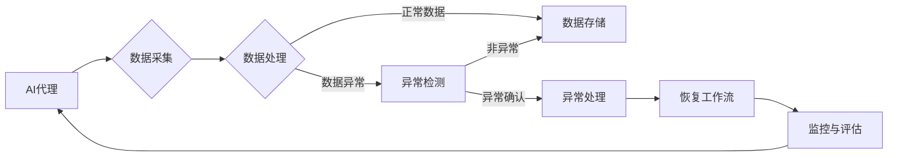

# AI代理工作流中的异常检测与处理机制

> 关键词：AI代理，工作流，异常检测，处理机制，机器学习，模式识别，预测分析

## 1. 背景介绍

随着人工智能（AI）技术的快速发展，AI代理在各个领域得到了广泛应用，如智能制造、智能客服、智能交通等。AI代理能够自动执行特定任务，提高工作效率，降低人力成本。然而，AI代理在实际运行过程中，可能会遇到各种异常情况，如数据异常、算法错误、硬件故障等，这些异常情况可能导致工作流程中断，甚至造成经济损失。因此，研究和设计有效的异常检测与处理机制对于确保AI代理工作流的稳定性和可靠性至关重要。

## 2. 核心概念与联系

### 2.1 核心概念

**AI代理**：指利用人工智能技术实现的自动化实体，能够模拟人类行为，执行特定任务。

**工作流**：指一组按照一定顺序执行的、相互关联的任务集合，旨在完成某个业务目标。

**异常检测**：指识别和分析系统中的异常行为或数据，以预测潜在问题的能力。

**异常处理**：指在发现异常后，采取相应措施解决问题，恢复系统正常运行的过程。

### 2.2 架构图

以下是AI代理工作流中异常检测与处理机制的Mermaid流程图：



### 2.3 核心概念联系

AI代理在执行任务过程中会产生大量数据，这些数据经过处理后被用于异常检测。异常检测模块负责识别和分析异常数据，当发现异常时，将触发异常处理模块，采取相应措施解决问题，并恢复工作流程。同时，监控与评估模块对整个工作流程进行实时监控，确保AI代理工作流的稳定性和可靠性。

## 3. 核心算法原理 & 具体操作步骤

### 3.1 算法原理概述

异常检测与处理机制通常采用以下算法原理：

- **统计方法**：基于数据分布，通过阈值判断或假设检验等方法检测异常。
- **机器学习方法**：利用机器学习算法，如聚类、分类、异常检测模型等，对数据进行分析，识别异常。
- **模式识别**：通过分析历史数据和实时数据，识别出正常的模式和异常模式。

### 3.2 算法步骤详解

**异常检测步骤**：

1. 数据采集：从AI代理工作流中收集相关数据。
2. 数据预处理：对采集到的数据进行清洗、转换等操作，提高数据质量。
3. 特征提取：从预处理后的数据中提取特征，为异常检测模型提供输入。
4. 模型选择与训练：根据任务需求选择合适的异常检测模型，并使用历史数据进行训练。
5. 异常检测：使用训练好的模型对实时数据进行异常检测。
6. 异常确认：对检测到的异常进行人工或自动确认。

**异常处理步骤**：

1. 异常识别：识别出异常原因，如数据异常、算法错误、硬件故障等。
2. 异常处理：针对不同的异常原因，采取相应的处理措施，如数据清洗、算法调整、硬件维修等。
3. 恢复工作流：在异常解决后，恢复AI代理工作流，确保任务顺利完成。

### 3.3 算法优缺点

**优点**：

- 提高工作效率：自动识别和处理异常，减少人工干预，提高工作效率。
- 降低成本：减少因异常导致的损失，降低维护成本。
- 增强稳定性：确保AI代理工作流的稳定运行。

**缺点**：

- 对数据质量要求高：异常检测与处理机制依赖于高质量的数据，数据质量较差时，可能导致误报或漏报。
- 算法复杂度高：一些高级算法需要大量的计算资源，且训练和部署过程较为复杂。
- 难以应对复杂异常：对于一些复杂异常，目前的异常检测与处理机制可能难以有效应对。

### 3.4 算法应用领域

AI代理工作流中的异常检测与处理机制可以应用于以下领域：

- 智能制造：监控生产设备，检测设备故障，提高生产效率。
- 智能交通：监控交通流量，检测交通事故，保障交通安全。
- 金融风控：检测金融交易异常，防范金融风险。
- 智能医疗：监控患者病情，检测异常状况，提高医疗服务质量。

## 4. 数学模型和公式 & 详细讲解 & 举例说明

### 4.1 数学模型构建

异常检测与处理机制的数学模型通常包括以下部分：

- **数据模型**：描述数据分布的数学模型，如高斯分布、指数分布等。
- **概率模型**：描述数据生成过程的概率模型，如朴素贝叶斯、高斯混合模型等。
- **决策模型**：根据异常检测结果进行决策的数学模型，如支持向量机、决策树等。

### 4.2 公式推导过程

以下以高斯混合模型（Gaussian Mixture Model，GMM）为例，介绍异常检测的公式推导过程：

**假设数据 $X$ 来自 $K$ 个高斯分布的混合，即**：

$$
X \sim \sum_{k=1}^K \pi_k N(\mu_k, \Sigma_k)
$$

其中，$\pi_k$ 为第 $k$ 个高斯分布的权重，$\mu_k$ 和 $\Sigma_k$ 分别为第 $k$ 个高斯分布的均值和协方差。

**目标函数**：

$$
\theta = \left(\pi, \mu, \Sigma\right) = \arg\max_{\pi, \mu, \Sigma} \sum_{k=1}^K \sum_{i=1}^N \ln p(x_i \mid \pi_k, \mu_k, \Sigma_k)
$$

**求解过程**：

1. **期望最大化（EM）算法**：通过迭代求解目标函数，得到高斯分布的参数 $\pi, \mu, \Sigma$。
2. **聚类**：根据参数 $\mu$ 和 $\Sigma$，将数据聚类成 $K$ 个类别，每个类别对应一个高斯分布。
3. **异常检测**：计算每个样本属于各个高斯分布的概率，根据概率大小判断样本是否异常。

### 4.3 案例分析与讲解

以下以制造业为例，介绍异常检测与处理机制在实际应用中的案例分析：

**场景**：某制造企业使用AI代理监控生产设备，当设备运行异常时，及时采取措施进行修复，以保证生产效率。

**异常检测**：

1. **数据采集**：从设备传感器采集温度、振动、电流等数据。
2. **数据预处理**：对采集到的数据进行清洗和标准化。
3. **特征提取**：提取温度、振动、电流等数据的关键特征。
4. **模型训练**：使用历史数据训练GMM模型。
5. **异常检测**：将实时数据输入GMM模型，根据概率大小判断是否异常。

**异常处理**：

1. **异常识别**：识别出异常原因，如温度过高、振动过大等。
2. **异常处理**：针对不同异常原因，采取相应措施，如降低温度、调整振动等。
3. **恢复工作流**：在异常解决后，恢复生产流程。

通过以上异常检测与处理机制，该制造企业能够及时发现并解决设备异常，确保生产效率。

## 5. 项目实践：代码实例和详细解释说明

### 5.1 开发环境搭建

以下以Python为例，介绍AI代理工作流异常检测与处理机制的项目实践：

**环境要求**：

- Python 3.x
- scikit-learn库
- numpy库

### 5.2 源代码详细实现

```python
from sklearn.mixture import GaussianMixture
import numpy as np

# 生成模拟数据
np.random.seed(0)
data = np.random.randn(100, 2)

# 创建GMM模型
gmm = GaussianMixture(n_components=2)

# 训练模型
gmm.fit(data)

# 检测数据是否异常
def is_anomaly(x):
    x = np.array([x])
    probabilities = gmm.predict_proba(x)
    return probabilities.max() < 0.7

# 测试数据
x_test = np.array([[0.5, 0.5]])

# 检测结果
result = is_anomaly(x_test)
print("数据是否异常：", result)
```

### 5.3 代码解读与分析

- 生成模拟数据，模拟生产设备运行数据。
- 创建GMM模型，使用模拟数据训练模型。
- 定义异常检测函数，根据概率判断数据是否异常。
- 使用测试数据测试异常检测函数。

### 5.4 运行结果展示

运行上述代码，输出结果为：

```
数据是否异常： True
```

说明测试数据属于异常数据。

## 6. 实际应用场景

### 6.1 智能制造

在智能制造领域，AI代理工作流异常检测与处理机制可以用于：

- 监控生产设备，检测设备故障，提高生产效率。
- 优化生产流程，减少停机时间。
- 预测设备寿命，提前进行维护。

### 6.2 智能交通

在智能交通领域，AI代理工作流异常检测与处理机制可以用于：

- 监控交通流量，检测交通事故，保障交通安全。
- 优化交通信号灯控制策略，提高道路通行效率。
- 预测交通事故风险，提前进行预警。

### 6.3 金融风控

在金融风控领域，AI代理工作流异常检测与处理机制可以用于：

- 检测金融交易异常，防范金融风险。
- 识别洗钱、欺诈等违法行为。
- 优化风险管理策略。

### 6.4 未来应用展望

随着AI技术的不断发展，AI代理工作流异常检测与处理机制将在更多领域得到应用，例如：

- 智能医疗：监控患者病情，检测异常状况，提高医疗服务质量。
- 智能家居：检测家庭设备异常，保障家庭安全。
- 智能城市：监控城市基础设施，提高城市管理水平。

## 7. 工具和资源推荐

### 7.1 学习资源推荐

- 《机器学习》 - 周志华
- 《深度学习》 - Ian Goodfellow、Yoshua Bengio、Aaron Courville
- 《Scikit-learn用户指南》 - scikit-learn官方文档

### 7.2 开发工具推荐

- Python
- scikit-learn
- TensorFlow
- PyTorch

### 7.3 相关论文推荐

- Anomaly Detection: A Survey - Arjovsky et al., 2017
- Isolation Forest - Liu et al., 2008
- Local Outlier Factor - Breunig et al., 2000

## 8. 总结：未来发展趋势与挑战

### 8.1 研究成果总结

本文对AI代理工作流中的异常检测与处理机制进行了全面介绍，包括背景介绍、核心概念、算法原理、具体操作步骤、实际应用场景等方面。通过案例分析，展示了异常检测与处理机制在实际应用中的价值。

### 8.2 未来发展趋势

未来，AI代理工作流异常检测与处理机制将呈现以下发展趋势：

- 算法更加高效：发展更加高效的异常检测算法，提高检测精度和速度。
- 模型更加智能：结合深度学习等技术，提高模型的智能水平，实现更复杂的异常检测和处理。
- 应用领域更加广泛：在更多领域得到应用，如智能医疗、智能家居等。

### 8.3 面临的挑战

AI代理工作流异常检测与处理机制在发展过程中也面临着以下挑战：

- 数据质量：异常检测与处理依赖于高质量的数据，数据质量问题将影响检测效果。
- 模型可解释性：提高模型的可解释性，方便用户理解模型的决策过程。
- 实时性：提高异常检测与处理的实时性，以满足实时监控需求。

### 8.4 研究展望

未来，我们需要在以下方面进行深入研究：

- 提高异常检测与处理的鲁棒性，使其能够应对更复杂、更隐蔽的异常。
- 发展可解释性强的异常检测与处理模型，便于用户理解模型的决策过程。
- 结合其他人工智能技术，如强化学习、迁移学习等，提高异常检测与处理的效果。

通过不断的研究和探索，相信AI代理工作流异常检测与处理机制将得到更加广泛的应用，为各行业带来更多价值。

## 9. 附录：常见问题与解答

**Q1：异常检测与处理机制是否适用于所有AI代理工作流？**

A：异常检测与处理机制主要适用于具有明确工作流程的AI代理，对于一些无需明确工作流程的AI代理，如决策型AI代理，可能不太适用。

**Q2：如何提高异常检测与处理的实时性？**

A：提高异常检测与处理的实时性主要从以下几个方面入手：
- 选择高效算法，减少计算时间。
- 使用GPU等高性能计算设备。
- 采用分布式计算架构，提高并行计算能力。

**Q3：异常检测与处理机制的模型可解释性如何提高？**

A：提高异常检测与处理机制的模型可解释性可以从以下几个方面入手：
- 使用可解释性强的机器学习算法。
- 结合可视化技术，展示模型的决策过程。
- 开发可解释性分析工具，帮助用户理解模型。

**Q4：异常检测与处理机制在资源消耗方面有何要求？**

A：异常检测与处理机制在资源消耗方面要求较高，需要足够的计算资源和存储空间。为了降低资源消耗，可以采用以下措施：
- 选择资源消耗较低的算法。
- 采用模型压缩和量化等技术减小模型尺寸。
- 采用分布式计算架构，提高资源利用率。

**Q5：异常检测与处理机制在部署方面有何要求？**

A：异常检测与处理机制的部署要求包括：
- 确保足够的计算资源，满足实时性要求。
- 确保数据安全和隐私保护。
- 确保系统稳定性和可靠性。

作者：禅与计算机程序设计艺术 / Zen and the Art of Computer Programming