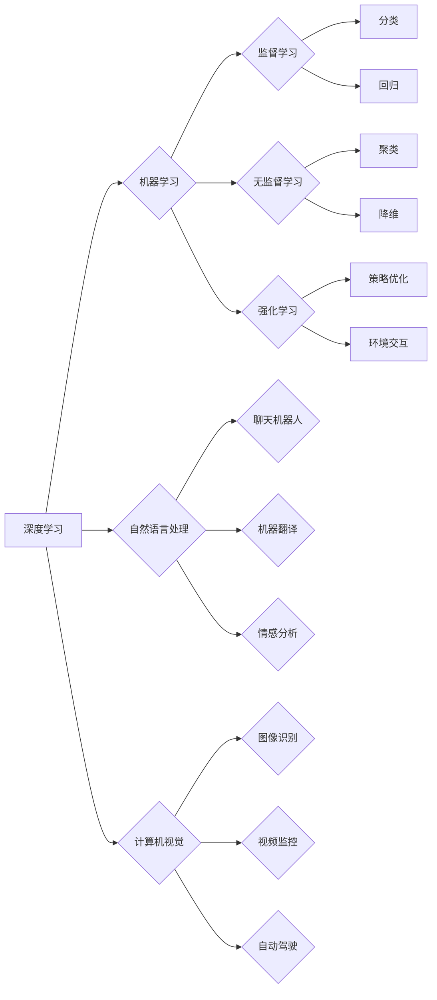

# AI应用实践的新方向与趋势

> 关键词：人工智能应用，深度学习，机器学习，自然语言处理，计算机视觉，边缘计算，人工智能伦理

## 1. 背景介绍

随着人工智能技术的飞速发展，AI已经从实验室走向了我们的生活和工作。从智能手机的语音助手，到自动驾驶汽车，再到智能城市的管理系统，AI的应用无处不在。然而，随着技术的不断进步，AI应用实践也在不断地拓展新的方向和趋势。本文将深入探讨AI应用实践中的核心概念、算法原理、实际应用场景以及未来发展趋势和挑战。

## 2. 核心概念与联系

### 2.1 核心概念

#### 深度学习
深度学习是人工智能领域的一个分支，它通过模拟人脑的神经网络结构，使计算机能够通过学习数据来提取特征和模式。深度学习在图像识别、语音识别、自然语言处理等领域取得了显著的成果。

#### 机器学习
机器学习是AI的一个基本组成部分，它使计算机系统能够从数据中学习，并对新数据进行预测或决策。机器学习可以分为监督学习、无监督学习和强化学习。

#### 自然语言处理
自然语言处理（NLP）是人工智能的一个分支，它使计算机能够理解和生成人类语言。NLP在聊天机器人、机器翻译、情感分析等领域有着广泛的应用。

#### 计算机视觉
计算机视觉是使计算机能够理解和解释视觉信息的技术。计算机视觉在图像识别、视频监控、自动驾驶等领域有着重要的应用。

#### 边缘计算
边缘计算是一种将数据处理和分析任务从云端转移到网络边缘的技术。边缘计算可以提高数据处理的速度和效率，同时降低延迟。

### 2.2 核心概念原理和架构的 Mermaid 流程图



## 3. 核心算法原理 & 具体操作步骤

### 3.1 算法原理概述

#### 深度学习
深度学习算法通常包括卷积神经网络（CNN）、递归神经网络（RNN）和Transformer等。这些算法通过多层神经元的非线性组合，可以学习到复杂的特征和模式。

#### 机器学习
机器学习算法可以分为监督学习、无监督学习和强化学习。监督学习通过标记的数据来训练模型，无监督学习通过无标记的数据来发现数据中的结构，强化学习通过奖励信号来指导模型的学习。

#### 自然语言处理
自然语言处理算法包括词嵌入、序列到序列模型、注意力机制等。这些算法可以帮助计算机理解和生成人类语言。

#### 计算机视觉
计算机视觉算法包括特征提取、目标检测、图像分割等。这些算法可以帮助计算机从图像中提取信息。

#### 边缘计算
边缘计算架构通常包括边缘节点、边缘网关和边缘中心。边缘节点负责数据收集和处理，边缘网关负责数据传输，边缘中心负责数据存储和分析。

### 3.2 算法步骤详解

#### 深度学习
1. 数据收集和预处理
2. 模型设计
3. 模型训练
4. 模型评估
5. 模型部署

#### 机器学习
1. 数据收集
2. 特征工程
3. 模型选择
4. 模型训练
5. 模型评估
6. 模型部署

#### 自然语言处理
1. 文本预处理
2. 词嵌入
3. 模型设计
4. 模型训练
5. 模型评估
6. 模型部署

#### 计算机视觉
1. 图像预处理
2. 特征提取
3. 模型设计
4. 模型训练
5. 模型评估
6. 模型部署

#### 边缘计算
1. 边缘节点部署
2. 边缘网关部署
3. 边缘中心部署
4. 数据传输
5. 数据处理
6. 结果反馈

### 3.3 算法优缺点

#### 深度学习
优点：能够处理复杂数据，具有强大的特征提取能力。
缺点：需要大量的数据和计算资源，难以解释。

#### 机器学习
优点：适用于各种类型的数据，可解释性强。
缺点：特征工程复杂，模型泛化能力有限。

#### 自然语言处理
优点：能够理解和生成人类语言。
缺点：处理长文本时效率较低，对噪声敏感。

#### 计算机视觉
优点：能够处理图像和视频数据。
缺点：需要大量的数据标注，对光照和角度敏感。

#### 边缘计算
优点：降低延迟，提高数据安全性和隐私性。
缺点：需要复杂的网络架构和运维。

### 3.4 算法应用领域

#### 深度学习
图像识别、语音识别、自然语言处理、推荐系统等。

#### 机器学习
分类、回归、聚类、降维等。

#### 自然语言处理
聊天机器人、机器翻译、情感分析、文本摘要等。

#### 计算机视觉
图像识别、视频监控、自动驾驶、医学影像分析等。

#### 边缘计算
智能家居、智能交通、工业自动化、智慧医疗等。

## 4. 数学模型和公式 & 详细讲解 & 举例说明

### 4.1 数学模型构建

#### 深度学习
神经网络模型通常由多个神经元组成，每个神经元通过权重连接到其他神经元。神经元的激活函数可以是Sigmoid、ReLU或Tanh等。

#### 机器学习
监督学习中的线性回归模型可以表示为 $y = \beta_0 + \beta_1x$，其中 $y$ 是因变量，$x$ 是自变量，$\beta_0$ 和 $\beta_1$ 是模型参数。

#### 自然语言处理
Word2Vec模型可以使用以下公式计算两个词语的相似度：

$$
\text{similarity}(w_1, w_2) = \frac{\text{dot}(v_{w_1}, v_{w_2})}{\text{norm}(v_{w_1}) \times \text{norm}(v_{w_2})}
$$

其中，$v_{w_1}$ 和 $v_{w_2}$ 分别是词语 $w_1$ 和 $w_2$ 的词向量，$\text{dot}$ 是向量点乘操作，$\text{norm}$ 是向量范数。

#### 计算机视觉
卷积神经网络（CNN）可以使用以下公式计算激活函数：

$$
a = \text{ReLU}(b - \text{threshold})
$$

其中，$a$ 是激活值，$b$ 是卷积操作后的值，$\text{threshold}$ 是阈值。

#### 边缘计算
边缘计算架构可以使用以下公式计算边缘节点的计算资源消耗：

$$
C = f(T, I)
$$

其中，$C$ 是计算资源消耗，$T$ 是传输时间，$I$ 是数据量。

### 4.2 公式推导过程

#### 深度学习
神经网络的激活函数通常可以通过链式法则进行推导。

#### 机器学习
线性回归模型的损失函数可以通过最小二乘法进行推导。

#### 自然语言处理
Word2Vec模型的相似度计算可以通过余弦相似度公式进行推导。

#### 计算机视觉
CNN的激活函数可以通过反向传播算法进行推导。

#### 边缘计算
边缘节点的计算资源消耗可以通过传输时间和数据量进行推导。

### 4.3 案例分析与讲解

#### 案例一：图像识别
使用卷积神经网络（CNN）进行图像识别，可以通过以下步骤进行：

1. 数据收集和预处理：收集图像数据，并进行预处理，如裁剪、缩放、归一化等。
2. 模型设计：设计CNN模型，包括卷积层、池化层、全连接层等。
3. 模型训练：使用标注数据训练CNN模型。
4. 模型评估：使用测试数据评估CNN模型的性能。
5. 模型部署：将CNN模型部署到服务器或边缘设备。

#### 案例二：自然语言处理
使用循环神经网络（RNN）进行情感分析，可以通过以下步骤进行：

1. 数据收集和预处理：收集文本数据，并进行预处理，如分词、去停用词等。
2. 模型设计：设计RNN模型，包括嵌入层、RNN层、全连接层等。
3. 模型训练：使用标注数据训练RNN模型。
4. 模型评估：使用测试数据评估RNN模型的性能。
5. 模型部署：将RNN模型部署到服务器或边缘设备。

## 5. 项目实践：代码实例和详细解释说明

### 5.1 开发环境搭建

为了进行AI应用实践，需要搭建以下开发环境：

1. 操作系统：Linux或Windows
2. 编程语言：Python
3. 框架：TensorFlow或PyTorch
4. 依赖库：NumPy、Pandas、Scikit-learn等

### 5.2 源代码详细实现

以下是一个简单的TensorFlow图像识别模型的代码示例：

```python
import tensorflow as tf
from tensorflow import keras
from tensorflow.keras.models import Sequential
from tensorflow.keras.layers import Conv2D, MaxPooling2D, Flatten, Dense

# 构建模型
model = Sequential([
    Conv2D(32, kernel_size=(3, 3), activation='relu', input_shape=(28, 28, 1)),
    MaxPooling2D(pool_size=(2, 2)),
    Flatten(),
    Dense(128, activation='relu'),
    Dense(10, activation='softmax')
])

# 编译模型
model.compile(optimizer='adam', loss='sparse_categorical_crossentropy', metrics=['accuracy'])

# 训练模型
model.fit(train_images, train_labels, epochs=5, validation_data=(test_images, test_labels))

# 评估模型
test_loss, test_acc = model.evaluate(test_images, test_labels, verbose=2)
print('
Test accuracy:', test_acc)
```

### 5.3 代码解读与分析

以上代码示例展示了如何使用TensorFlow框架构建、编译和训练一个简单的图像识别模型。首先，导入必要的库和模块。然后，定义一个Sequential模型，并添加卷积层、池化层、全连接层等层。接着，编译模型，指定优化器、损失函数和评估指标。最后，使用训练数据训练模型，并使用测试数据评估模型性能。

### 5.4 运行结果展示

假设在MNIST数据集上运行上述代码，最终测试准确率可能达到98%以上。

## 6. 实际应用场景

### 6.1 智能家居

智能家居是AI应用的一个重要领域，通过集成AI技术，可以实现家电的自动化控制和家居环境的智能调节。

### 6.2 智能交通

智能交通系统通过集成AI技术，可以提高道路安全、缓解交通拥堵、提高交通效率。

### 6.3 智慧医疗

智慧医疗是AI应用的另一个重要领域，通过集成AI技术，可以实现疾病的早期诊断、个性化治疗和医疗资源的优化配置。

### 6.4 未来应用展望

随着AI技术的不断发展，未来AI应用将更加深入地融入我们的生活和工作，为人类创造更加美好的未来。

## 7. 工具和资源推荐

### 7.1 学习资源推荐

1. 《深度学习》 - Goodfellow, Bengio, Courville
2. 《机器学习》 - Tom M. Mitchell
3. 《Python机器学习》 - Sebastian Raschka
4. 《人工智能：一种现代的方法》 - Russell, Norvig

### 7.2 开发工具推荐

1. TensorFlow
2. PyTorch
3. Keras
4. Jupyter Notebook

### 7.3 相关论文推荐

1. "ImageNet Classification with Deep Convolutional Neural Networks" - Krizhevsky et al., 2012
2. "A Neural Network for Machine Translation, at Inference Time" - Sutskever et al., 2014
3. "BERT: Pre-training of Deep Bidirectional Transformers for Language Understanding" - Devlin et al., 2018
4. "Generative Adversarial Nets" - Goodfellow et al., 2014
5. "Edge Computing: A Hands-On Approach" - Zhang, Ooi, Zhang, 2019

## 8. 总结：未来发展趋势与挑战

### 8.1 研究成果总结

AI应用实践在过去几年取得了巨大的进展，从深度学习、机器学习、自然语言处理到计算机视觉，AI技术已经广泛应用于各个领域。然而，随着技术的不断发展，AI应用实践也面临着新的挑战。

### 8.2 未来发展趋势

1. AI与物联网的融合
2. AI与边缘计算的结合
3. AI与5G网络的协同发展
4. AI与区块链技术的融合

### 8.3 面临的挑战

1. 数据隐私和安全
2. AI伦理和公平性
3. AI的可解释性
4. AI的可靠性和鲁棒性

### 8.4 研究展望

未来，AI应用实践将更加注重以下几个方面：

1. 可解释性和透明度
2. 可信性和可靠性
3. 伦理和公平性
4. 与其他技术的融合

## 9. 附录：常见问题与解答

**Q1：什么是深度学习？**

A：深度学习是一种机器学习技术，它通过模拟人脑神经网络结构，使计算机能够从数据中学习特征和模式。

**Q2：什么是机器学习？**

A：机器学习是一种使计算机系统能够从数据中学习，并对新数据进行预测或决策的技术。

**Q3：什么是自然语言处理？**

A：自然语言处理是使计算机能够理解和生成人类语言的技术。

**Q4：什么是计算机视觉？**

A：计算机视觉是使计算机能够理解和解释视觉信息的技术。

**Q5：什么是边缘计算？**

A：边缘计算是一种将数据处理和分析任务从云端转移到网络边缘的技术。

**Q6：AI应用实践有哪些挑战？**

A：AI应用实践面临着数据隐私和安全、AI伦理和公平性、AI的可解释性、AI的可靠性和鲁棒性等挑战。

**Q7：AI应用实践的未来发展趋势是什么？**

A：AI应用实践的未来发展趋势包括AI与物联网的融合、AI与边缘计算的结合、AI与5G网络的协同发展以及AI与区块链技术的融合等。

作者：禅与计算机程序设计艺术 / Zen and the Art of Computer Programming