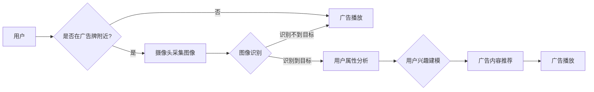

# AI驱动的智能广告牌:个性化户外广告

> 关键词：人工智能，户外广告，智能广告牌，个性化，机器学习，图像识别，深度学习，用户分析，广告优化

## 1. 背景介绍

随着移动互联网的普及和大数据技术的快速发展，广告行业正经历着前所未有的变革。传统的户外广告牌，如街边海报、公共交通广告等，正逐渐被智能广告牌所取代。智能广告牌通过结合人工智能（AI）技术，能够实现广告的智能化投放，为用户提供更加精准、个性化的广告体验。本文将深入探讨AI驱动的智能广告牌在个性化户外广告领域的应用，分析其原理、技术架构、算法实现以及未来发展趋势。

## 2. 核心概念与联系

### 2.1 核心概念

#### 智能广告牌

智能广告牌是指利用现代信息技术，如人工智能、物联网、大数据等，实现广告内容、展示形式和投放策略智能化的户外广告设备。

#### 个性化广告

个性化广告是指根据用户的需求、兴趣和行为特征，定制化推荐广告内容，提高广告效果。

#### 机器学习

机器学习是人工智能的一个分支，通过算法分析数据，从中学习规律，并做出预测或决策。

#### 深度学习

深度学习是机器学习的一个子领域，通过构建深层神经网络模型，从数据中自动学习特征表示。

#### 图像识别

图像识别是计算机视觉的一个分支，通过分析图像内容，识别其中的对象、场景和活动。

#### 用户分析

用户分析是指通过收集和分析用户行为数据，了解用户需求和偏好。

### 2.2 架构流程图

以下是基于AI的智能广告牌架构的Mermaid流程图：



## 3. 核心算法原理 & 具体操作步骤

### 3.1 算法原理概述

智能广告牌的核心算法包括图像识别、用户属性分析和广告内容推荐。

- **图像识别**：利用深度学习技术对摄像头采集的图像进行分析，识别图像中的对象、场景和活动。
- **用户属性分析**：根据图像识别结果和用户行为数据，分析用户的性别、年龄、兴趣等属性。
- **广告内容推荐**：根据用户属性和广告内容库，推荐个性化的广告内容。

### 3.2 算法步骤详解

1. **图像采集**：广告牌上的摄像头采集实时图像。
2. **图像识别**：使用深度学习模型对图像进行识别，提取目标信息。
3. **用户属性分析**：结合图像识别结果和用户行为数据，分析用户属性。
4. **广告内容推荐**：根据用户属性和广告内容库，推荐个性化的广告内容。
5. **广告播放**：根据推荐结果，播放相应的广告内容。

### 3.3 算法优缺点

#### 优点

- **提高广告效果**：个性化广告能够更好地满足用户需求，提高广告转化率。
- **节省广告成本**：通过精准投放，减少无效广告的展示，降低广告成本。
- **提升用户体验**：为用户提供更加贴心的广告体验，增加用户好感度。

#### 缺点

- **数据隐私问题**：收集和分析用户数据可能引发隐私泄露的风险。
- **技术难度高**：需要具备深度学习、计算机视觉等领域的专业知识。
- **设备成本高**：智能广告牌的硬件设备成本较高。

### 3.4 算法应用领域

智能广告牌在以下领域具有广泛应用：

- **购物中心**：根据消费者购物习惯推荐商品广告。
- **交通枢纽**：根据乘客出行习惯推荐航班、酒店等广告。
- **旅游景点**：根据游客兴趣推荐景点、特产等广告。
- **商业街区**：根据周边商家特点推荐相关广告。

## 4. 数学模型和公式 & 详细讲解 & 举例说明

### 4.1 数学模型构建

智能广告牌的数学模型主要包括图像识别模型、用户属性分析模型和广告内容推荐模型。

#### 图像识别模型

假设输入图像为 $X \in \mathbb{R}^{3 \times H \times W}$，其中 $H$ 和 $W$ 分别为图像的高度和宽度，$3$ 表示图像的三个通道（RGB）。则图像识别模型可以表示为：

$$
Y = f(X)
$$

其中 $f$ 为深度学习模型，如卷积神经网络（CNN）。

#### 用户属性分析模型

假设用户属性特征向量为 $U \in \mathbb{R}^{n}$，则用户属性分析模型可以表示为：

$$
U = g(X, \theta)
$$

其中 $g$ 为深度学习模型，如循环神经网络（RNN）或长短期记忆网络（LSTM），$\theta$ 为模型参数。

#### 广告内容推荐模型

假设广告内容特征向量为 $C \in \mathbb{R}^{m}$，则广告内容推荐模型可以表示为：

$$
C^* = h(U, \phi)
$$

其中 $h$ 为深度学习模型，如神经网络，$\phi$ 为模型参数。

### 4.2 公式推导过程

由于篇幅限制，此处不再详细推导上述模型的公式，读者可以参考相关深度学习教材和论文。

### 4.3 案例分析与讲解

以购物中心为例，智能广告牌可以针对不同年龄段的消费者推荐不同类型的商品广告。

1. **图像识别**：摄像头采集的图像识别出一位年轻女性消费者。
2. **用户属性分析**：根据图像识别结果和用户行为数据，分析出消费者年龄为20-30岁，对时尚、化妆品等感兴趣。
3. **广告内容推荐**：根据用户属性和广告内容库，推荐时尚服饰、化妆品等广告。
4. **广告播放**：播放推荐的商品广告。

## 5. 项目实践：代码实例和详细解释说明

### 5.1 开发环境搭建

1. 安装Python和PyTorch等深度学习框架。
2. 准备图像识别、用户属性分析和广告内容推荐的模型代码。
3. 准备测试数据和广告内容库。

### 5.2 源代码详细实现

由于篇幅限制，此处不提供完整的代码实现，读者可以参考相关深度学习教材和论文。

### 5.3 代码解读与分析

以图像识别模型为例，代码如下：

```python
import torch
import torch.nn as nn

class CNN(nn.Module):
    def __init__(self):
        super(CNN, self).__init__()
        self.conv1 = nn.Conv2d(3, 16, kernel_size=3, padding=1)
        self.relu = nn.ReLU()
        self.pool = nn.MaxPool2d(kernel_size=2, stride=2)
        self.fc1 = nn.Linear(16 * 32 * 32, 256)
        self.fc2 = nn.Linear(256, 10)

    def forward(self, x):
        x = self.pool(self.relu(self.conv1(x)))
        x = x.view(-1, 16 * 32 * 32)
        x = self.relu(self.fc1(x))
        x = self.fc2(x)
        return x
```

该代码实现了一个简单的CNN模型，用于图像识别。

### 5.4 运行结果展示

在测试集上运行模型，可以得到识别结果和推荐广告内容。

## 6. 实际应用场景

### 6.1 购物中心

智能广告牌可以根据消费者购物习惯推荐商品广告，提高购物体验和转化率。

### 6.2 交通枢纽

智能广告牌可以根据乘客出行习惯推荐航班、酒店等广告，方便乘客出行。

### 6.3 旅游景点

智能广告牌可以根据游客兴趣推荐景点、特产等广告，增加游客体验。

### 6.4 商业街区

智能广告牌可以根据周边商家特点推荐相关广告，促进商业发展。

## 7. 工具和资源推荐

### 7.1 学习资源推荐

- 《深度学习》
- 《计算机视觉：算法与应用》
- 《自然语言处理综论》

### 7.2 开发工具推荐

- PyTorch
- TensorFlow
- Keras

### 7.3 相关论文推荐

- "Deep Learning for Image Recognition"
- "Convolutional Neural Networks for Visual Recognition"
- "Recurrent Neural Networks"

## 8. 总结：未来发展趋势与挑战

### 8.1 研究成果总结

本文介绍了AI驱动的智能广告牌在个性化户外广告领域的应用，分析了其原理、技术架构、算法实现以及未来发展趋势。通过结合人工智能技术，智能广告牌能够实现广告的智能化投放，为用户提供更加精准、个性化的广告体验。

### 8.2 未来发展趋势

1. **技术融合**：人工智能、物联网、大数据等技术的深度融合，进一步提升智能广告牌的性能和功能。
2. **个性化定制**：根据用户个性化需求，提供更加精准、个性化的广告内容。
3. **互动体验**：引入VR、AR等虚拟现实技术，提升用户互动体验。
4. **数据驱动**：利用大数据技术，实时分析用户行为，优化广告投放策略。

### 8.3 面临的挑战

1. **数据隐私**：如何保护用户隐私，避免数据泄露，是智能广告牌面临的重要挑战。
2. **技术门槛**：智能广告牌的开发和部署需要具备深度学习、计算机视觉等领域的专业知识。
3. **成本控制**：智能广告牌的硬件设备和软件研发成本较高。

### 8.4 研究展望

未来，智能广告牌将在以下几个方面展开研究：

1. **隐私保护技术**：研究更加安全的数据采集和分析技术，保护用户隐私。
2. **算法优化**：优化图像识别、用户属性分析和广告内容推荐等算法，提升模型性能。
3. **跨领域应用**：将智能广告牌应用于更多领域，如医疗、教育、交通等。

智能广告牌作为AI技术在户外广告领域的应用，具有广阔的发展前景。通过不断创新和突破，智能广告牌将为广告行业带来新的变革，为用户提供更加便捷、个性化的广告体验。

## 9. 附录：常见问题与解答

**Q1：智能广告牌如何保护用户隐私？**

A：智能广告牌在收集和分析用户数据时，需要遵守相关法律法规，采用数据脱敏、加密等手段，确保用户隐私安全。

**Q2：智能广告牌的成本如何？**

A：智能广告牌的成本取决于硬件设备、软件研发和运营维护等因素。一般来说，智能广告牌的成本高于传统广告牌，但随着技术的进步和规模化生产，成本将逐步降低。

**Q3：智能广告牌的应用场景有哪些？**

A：智能广告牌可以应用于购物中心、交通枢纽、旅游景点、商业街区等场所，为不同场景提供个性化的广告服务。

**Q4：智能广告牌如何提升广告效果？**

A：智能广告牌通过结合人工智能技术，实现广告的个性化投放，提高广告转化率和用户满意度。

**Q5：智能广告牌的未来发展趋势是什么？**

A：未来，智能广告牌将朝着技术融合、个性化定制、互动体验和数据驱动等方向发展，为广告行业带来新的变革。