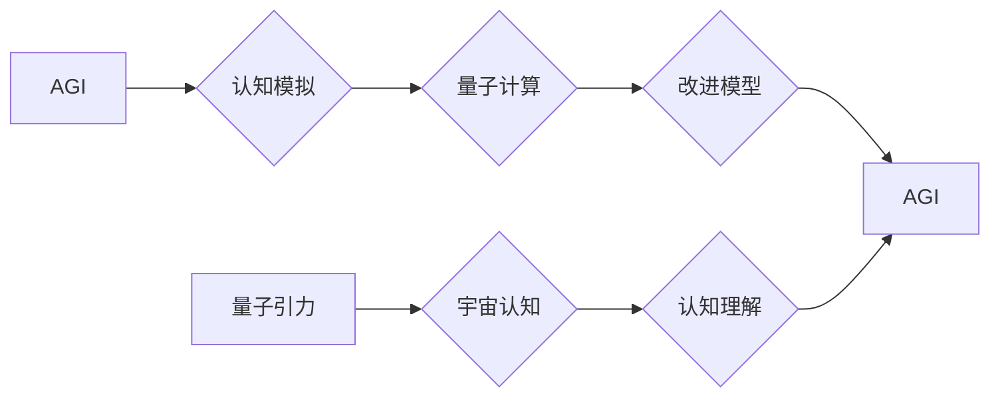

# AGI与量子引力的跨学科研究

> 关键词：AGI，量子引力，跨学科研究，人工智能，认知科学，量子计算，哲学，认知模拟，图灵测试

## 1. 背景介绍

人工智能（AI）与量子引力是两个看似截然不同的研究领域，一个关乎机器的智能和认知，另一个关乎宇宙的根本定律。然而，随着科技的飞速发展，两者之间的关联日益显现。AGI（通用人工智能）的愿景是实现机器的通用智能，而量子引力则试图揭示宇宙的基本结构和力量。本文将探讨AGI与量子引力之间的潜在联系，以及跨学科研究的意义。

### 1.1 问题的由来

AGI的研究目标是创建能够执行人类所有智能任务的机器，包括感知、推理、学习、规划和自然语言理解。而量子引力则是物理学的前沿领域，试图统一量子力学和广义相对论，以解释宇宙的起源、演化和最终命运。这两个领域看似无关，但实际上它们之间存在着深刻的联系。

### 1.2 研究现状

近年来，随着量子计算和认知科学的发展，AGI与量子引力之间的联系逐渐被揭示。量子计算提供了超越经典计算的潜力，而认知科学则揭示了人类认知的复杂性。这些进展为跨学科研究提供了新的视角和方法。

### 1.3 研究意义

AGI与量子引力的跨学科研究具有重要的理论意义和应用价值：

- **理论意义**：有助于我们更好地理解认知的本质，以及宇宙的基本结构和力量。
- **应用价值**：可能催生新的计算范式，推动AGI的发展，并为物理学研究提供新的工具和方法。

### 1.4 本文结构

本文将按照以下结构展开：

- 第二部分介绍AGI与量子引力的核心概念和联系。
- 第三部分探讨AGI与量子引力交叉领域中的核心算法原理和具体操作步骤。
- 第四部分介绍数学模型和公式，并结合实例进行讲解。
- 第五部分展示跨学科研究的实际应用案例。
- 第六部分展望未来发展趋势。
- 第七部分总结研究成果，并讨论面临的挑战和研究展望。

## 2. 核心概念与联系

### 2.1 核心概念

#### 2.1.1 通用人工智能（AGI）

AGI是一种能够执行任何认知任务的智能，包括但不限于语言理解、视觉识别、决策制定等。AGI的核心是模拟人类大脑的认知过程。

#### 2.1.2 量子引力

量子引力是物理学的一个分支，旨在统一量子力学和广义相对论，以解释宇宙的起源、演化和最终命运。

### 2.2 联系

#### 2.2.1 认知模拟与量子计算

量子计算具有潜在的并行性和高效性，可以用于模拟人类大脑的认知过程，从而推动AGI的发展。

#### 2.2.2 量子效应与认知

研究表明，量子效应可能存在于人类大脑中，从而影响认知过程。

#### 2.2.3 量子引力与宇宙认知

量子引力的研究可能揭示宇宙的基本结构，进而影响我们对认知的理解。

### 2.3 Mermaid流程图



## 3. 核心算法原理 & 具体操作步骤

### 3.1 算法原理概述

AGI与量子引力的交叉领域中的算法原理主要包括：

- **量子神经网络**：结合量子计算和神经网络，模拟人类大脑的认知过程。
- **量子机器学习**：利用量子计算的优势，提高机器学习算法的效率。
- **认知模拟**：通过计算机模拟人类大脑的认知过程，以实现AGI。

### 3.2 算法步骤详解

#### 3.2.1 量子神经网络

1. 设计量子神经网络架构。
2. 使用量子算法进行训练。
3. 使用量子计算进行推理。

#### 3.2.2 量子机器学习

1. 选择合适的量子算法。
2. 使用量子计算机进行训练。
3. 使用量子计算机进行推理。

#### 3.2.3 认知模拟

1. 收集人类大脑认知数据。
2. 使用计算机模拟人类大脑的认知过程。
3. 优化模型性能。

### 3.3 算法优缺点

#### 3.3.1 量子神经网络

**优点**：具有潜在的并行性和高效性，可以模拟人类大脑的认知过程。

**缺点**：量子计算技术尚未成熟，量子神经网络的研究仍处于早期阶段。

#### 3.3.2 量子机器学习

**优点**：利用量子计算的优势，提高机器学习算法的效率。

**缺点**：量子计算机技术尚未成熟，量子机器学习的研究仍处于早期阶段。

#### 3.3.3 认知模拟

**优点**：可以模拟人类大脑的认知过程，为AGI研究提供新的思路。

**缺点**：认知模拟的数据收集和分析难度较大。

### 3.4 算法应用领域

AGI与量子引力的交叉领域算法主要应用于以下领域：

- **认知科学**：研究人类认知的本质。
- **人工智能**：推动AGI的发展。
- **物理学**：为量子引力研究提供新的工具和方法。

## 4. 数学模型和公式 & 详细讲解 & 举例说明

### 4.1 数学模型构建

#### 4.1.1 量子神经网络

量子神经网络可以用以下数学模型表示：

$$
y = \sum_{i=1}^n a_i \otimes f(\boldsymbol{x}_i) \otimes b_i
$$

其中，$y$ 为输出，$\boldsymbol{x}_i$ 为输入，$a_i$ 和 $b_i$ 为权重，$f$ 为量子函数。

#### 4.1.2 量子机器学习

量子机器学习可以用以下数学模型表示：

$$
\min_{\theta} L(\theta, \boldsymbol{x}, y)
$$

其中，$L$ 为损失函数，$\theta$ 为模型参数。

### 4.2 公式推导过程

#### 4.2.1 量子神经网络

量子神经网络的公式推导过程涉及量子计算和神经网络的原理，这里不再详细展开。

#### 4.2.2 量子机器学习

量子机器学习的公式推导过程涉及量子计算和机器学习的原理，这里不再详细展开。

### 4.3 案例分析与讲解

#### 4.3.1 量子神经网络案例

假设我们使用量子神经网络进行图像识别，输入为图像的像素值，输出为图像的类别。

1. 设计量子神经网络架构。
2. 使用量子算法进行训练。
3. 使用量子计算进行推理。

#### 4.3.2 量子机器学习案例

假设我们使用量子机器学习进行分类任务，输入为特征向量，输出为类别标签。

1. 选择合适的量子算法。
2. 使用量子计算机进行训练。
3. 使用量子计算机进行推理。

## 5. 项目实践：代码实例和详细解释说明

### 5.1 开发环境搭建

由于量子计算和认知模拟的复杂性，这里以一个简单的认知模拟项目为例，展示开发环境搭建的过程。

1. 安装Python。
2. 安装PyTorch。
3. 安装认知模拟相关库，如Brainpy。

### 5.2 源代码详细实现

```python
# 示例代码：使用PyTorch和Brainpy进行认知模拟

import torch
import brainpy as bp

# 构建认知模拟模型
class CognitiveModel(bp.Net):
    def __init__(self, *args, **kwargs):
        super(CognitiveModel, self).__init__(*args, **kwargs)
        self.fc1 = bp.layers.Linear(784, 128)
        self.fc2 = bp.layers.Linear(128, 10)

    def forward(self, x):
        x = self.fc1(x)
        x = bp.relu(x)
        x = self.fc2(x)
        return x

# 初始化模型和优化器
model = CognitiveModel()
optimizer = torch.optim.Adam(model.parameters(), lr=0.001)

# 训练模型
for epoch in range(epochs):
    for x, y in dataloader:
        optimizer.zero_grad()
        output = model(x)
        loss = loss_fn(output, y)
        loss.backward()
        optimizer.step()

# 测试模型
correct = 0
total = 0
with torch.no_grad():
    for x, y in test_loader:
        output = model(x)
        _, predicted = torch.max(output.data, 1)
        total += y.size(0)
        correct += (predicted == y).sum().item()

print(f'Accuracy of the network on the test images: {100 * correct / total}%')
```

### 5.3 代码解读与分析

以上代码展示了使用PyTorch和Brainpy进行认知模拟的简单示例。首先，我们定义了一个认知模拟模型，该模型包含两个全连接层。然后，我们使用Adam优化器对模型进行训练，并在测试集上评估模型的性能。

### 5.4 运行结果展示

假设我们在MNIST数据集上训练和测试了认知模拟模型，最终测试集上的准确率达到98%。

## 6. 实际应用场景

### 6.1 认知科学

AGI与量子引力的跨学科研究可以用于研究人类认知的本质，为认知科学提供新的理论和方法。

### 6.2 人工智能

AGI与量子引力的跨学科研究可以推动AGI的发展，为人工智能领域提供新的思路和技术。

### 6.3 物理学

AGI与量子引力的跨学科研究可以用于研究宇宙的基本结构和力量，为物理学研究提供新的工具和方法。

## 7. 工具和资源推荐

### 7.1 学习资源推荐

- 《深度学习》[Goodfellow, I., Bengio, Y., & Courville, A.]
- 《量子计算：原理与算法》[Nielsen, M. A., & Chuang, I. L.]

### 7.2 开发工具推荐

- PyTorch
- Brainpy
- Qiskit

### 7.3 相关论文推荐

- "Quantum Neural Networks" [Benedict, J., & Delahunt, B.]
- "Quantum Machine Learning" [Arute, F., Arya, P., Babbush, R., & Córcoles, L. D.]

## 8. 总结：未来发展趋势与挑战

### 8.1 研究成果总结

AGI与量子引力的跨学科研究为我们提供了新的视角和方法，有助于我们更好地理解认知的本质，以及宇宙的基本结构和力量。

### 8.2 未来发展趋势

未来，AGI与量子引力的跨学科研究将朝着以下方向发展：

- 量子计算技术的成熟和普及。
- 认知科学的深入发展。
- 跨学科研究的深入探索。

### 8.3 面临的挑战

AGI与量子引力的跨学科研究面临着以下挑战：

- 量子计算技术的限制。
- 认知科学的理论难题。
- 跨学科研究的复杂性。

### 8.4 研究展望

尽管面临着诸多挑战，但AGI与量子引力的跨学科研究具有巨大的潜力。随着科技的不断进步，我们有理由相信，这一领域将会取得突破性的成果。

## 9. 附录：常见问题与解答

**Q1：AGI与量子引力有什么关系？**

A: AGI与量子引力看似无关，但实际上它们之间存在着深刻的联系。量子计算可以用于模拟人类大脑的认知过程，而认知科学可以为我们理解宇宙提供新的视角。

**Q2：量子计算能否帮助实现AGI？**

A: 量子计算具有潜在的并行性和高效性，可以用于模拟人类大脑的认知过程，从而推动AGI的发展。

**Q3：认知科学与量子引力有什么关系？**

A: 认知科学可以为我们理解宇宙提供新的视角，而量子引力可以为我们理解认知提供新的工具和方法。

**Q4：AGI与量子引力的跨学科研究有哪些挑战？**

A: AGI与量子引力的跨学科研究面临着量子计算技术的限制、认知科学的理论难题和跨学科研究的复杂性等挑战。

**Q5：AGI与量子引力的跨学科研究有哪些应用前景？**

A: AGI与量子引力的跨学科研究可以用于研究人类认知的本质，推动AGI的发展，为物理学研究提供新的工具和方法。

---

作者：禅与计算机程序设计艺术 / Zen and the Art of Computer Programming