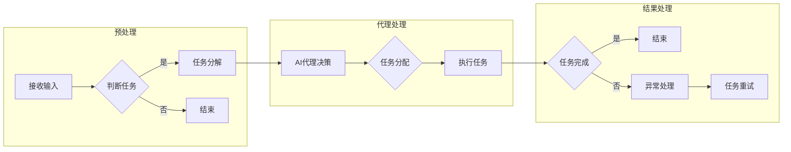

> 关键词：人工智能代理，工作流，航空控制系统，自主飞行，决策支持，协同控制，智能调度

# AI人工智能代理工作流AI Agent WorkFlow：代理工作流在航空控制系统中的应用

在航空交通运输领域，随着技术的不断进步和需求的日益增长，对航空控制系统的智能化和自动化要求越来越高。人工智能（AI）技术，特别是人工智能代理（AI Agent）和工作流（WorkFlow）的结合，为航空控制系统的现代化提供了强有力的技术支撑。本文将深入探讨AI代理工作流在航空控制系统中的应用，分析其核心原理、算法实现、实际案例，并展望其未来的发展趋势与挑战。

## 1. 背景介绍

### 1.1 航空控制系统面临的挑战

航空控制系统是保证航空器安全、高效运行的核心系统。随着航空业的发展，航空控制系统面临着以下挑战：

- **复杂性增加**：现代航空器系统越来越复杂，传统的集中式控制难以应对复杂的动态环境。
- **实时性要求**：航空器运行对实时性要求极高，任何延迟或错误都可能引发严重后果。
- **安全性需求**：航空安全至关重要，控制系统必须确保在所有情况下都能稳定运行。
- **资源优化**：在资源受限的条件下，如何优化资源配置，提高运行效率，降低成本。

### 1.2 人工智能代理工作流的兴起

人工智能代理工作流是利用人工智能技术构建的自动化工作流管理系统，能够模拟人类专家的决策过程，实现复杂任务的自动化处理。在航空控制系统中，AI代理工作流可以帮助实现以下目标：

- **自动化决策**：自动处理复杂任务，减少人为干预，提高决策效率。
- **实时响应**：快速响应实时变化，保证系统的稳定性和安全性。
- **资源优化**：优化资源配置，提高运行效率，降低成本。
- **智能化升级**：随着技术的进步，系统可以不断学习和适应新的需求。

## 2. 核心概念与联系

### 2.1 核心概念

#### 2.1.1 人工智能代理

人工智能代理是指具有感知、推理、决策和行动能力的计算机程序，能够在特定环境下自主执行任务。在航空控制系统中，AI代理可以模拟飞行员或地面操作员的决策过程，处理飞行计划、航线规划、任务分配等任务。

#### 2.1.2 工作流

工作流是一系列任务或活动的序列，这些任务或活动需要按照一定的顺序执行，以完成特定的业务目标。在航空控制系统中，工作流可以定义飞行计划、航线规划、任务分配、应急响应等业务流程。

#### 2.1.3 代理工作流

代理工作流是将人工智能代理与工作流相结合，实现自动化处理和决策的系统。在航空控制系统中，代理工作流可以自动化处理飞行任务，提高运行效率和安全水平。

### 2.2 核心概念原理和架构的 Mermaid 流程图



在上述流程图中，首先对输入的任务进行预处理，包括任务分解和任务判断。根据任务判断的结果，进入AI代理决策阶段，由AI代理根据预训练的知识和当前环境信息进行决策，并分配任务。执行任务后，根据任务完成情况进行结果处理，包括任务完成、异常处理和任务重试。

## 3. 核心算法原理 & 具体操作步骤

### 3.1 算法原理概述

AI代理工作流的算法原理主要包括以下步骤：

1. **知识获取**：通过机器学习、知识图谱等方法获取航空领域的知识，包括飞行规则、气象信息、航路数据等。
2. **任务建模**：将飞行任务建模为可计算的形式，例如使用状态机、决策树等。
3. **决策算法**：根据任务模型和环境信息，设计决策算法，例如强化学习、模糊控制等。
4. **任务执行**：根据决策结果，自动化执行飞行任务。
5. **反馈学习**：根据任务执行结果和环境变化，不断优化决策算法和任务执行策略。

### 3.2 算法步骤详解

#### 3.2.1 知识获取

知识获取是AI代理工作流的基础。通过以下方法获取航空领域的知识：

- **文本挖掘**：从飞行规则、气象报告、航路数据等文本资料中提取知识。
- **知识图谱**：构建航空领域的知识图谱，将知识以图的形式表示，方便查询和推理。
- **机器学习**：使用机器学习算法从历史飞行数据中学习飞行规律和决策模式。

#### 3.2.2 任务建模

将飞行任务建模为可计算的形式，例如：

- **状态机**：使用状态机表示飞行过程中的各种状态和转换规则。
- **决策树**：使用决策树表示飞行过程中的决策过程。
- **图模型**：使用图模型表示航线规划、任务分配等问题。

#### 3.2.3 决策算法

根据任务模型和环境信息，设计决策算法，例如：

- **强化学习**：使用强化学习算法学习最优的飞行策略。
- **模糊控制**：使用模糊控制算法处理模糊和不确定的决策问题。
- **神经网络**：使用神经网络进行模式识别和预测。

#### 3.2.4 任务执行

根据决策结果，自动化执行飞行任务，包括：

- **飞行计划生成**：根据航班信息和机场情况，生成飞行计划。
- **航线规划**：根据飞行计划和气象信息，规划最优航线。
- **任务分配**：根据任务需求和资源情况，分配任务给相应的飞机和机组人员。

#### 3.2.5 反馈学习

根据任务执行结果和环境变化，不断优化决策算法和任务执行策略，例如：

- **在线学习**：在任务执行过程中，实时更新模型参数。
- **迁移学习**：将知识从一个任务转移到另一个任务。
- **多智能体学习**：多个AI代理协同工作，共同完成任务。

### 3.3 算法优缺点

#### 3.3.1 优点

- **自动化程度高**：能够自动化处理复杂的飞行任务，减少人为干预。
- **决策效率高**：能够快速响应实时变化，提高决策效率。
- **安全性高**：能够根据实际情况进行决策，保证系统的安全性。
- **可扩展性强**：能够根据需求扩展新的功能和任务。

#### 3.3.2 缺点

- **知识获取成本高**：需要大量的航空领域知识，知识获取成本高。
- **算法复杂度高**：需要复杂的算法和计算资源，计算复杂度高。
- **依赖数据质量**：算法的性能依赖于数据的质量，数据质量差会影响算法效果。

### 3.4 算法应用领域

AI代理工作流在航空控制系统中的应用领域包括：

- **飞行计划生成**：自动生成飞行计划，提高航班运行效率。
- **航线规划**：规划最优航线，减少燃油消耗，提高飞行效率。
- **任务分配**：根据任务需求和资源情况，合理分配任务，提高资源利用率。
- **应急响应**：在发生紧急情况时，快速做出决策，保证安全。
- **多智能体协同控制**：多个AI代理协同工作，共同完成复杂任务。

## 4. 数学模型和公式 & 详细讲解 & 举例说明

### 4.1 数学模型构建

AI代理工作流的数学模型主要包括以下部分：

- **状态空间**：表示系统当前的状态，例如飞机的当前位置、速度、高度等。
- **动作空间**：表示系统可以采取的动作，例如调整航向、速度、高度等。
- **奖励函数**：根据系统状态和动作，计算奖励值，指导AI代理进行决策。

### 4.2 公式推导过程

假设系统状态空间为 $S$，动作空间为 $A$，奖励函数为 $R(s,a)$，则AI代理的决策问题可以表示为以下优化问题：

$$
\begin{aligned}
\text{maximize}_{a\in A} & \quad R(s,a) \\
\text{s.t.} & \quad s_{t+1} = f(s_t,a_t)
\end{aligned}
$$

其中，$s_t$ 表示第 $t$ 个时刻的状态，$a_t$ 表示第 $t$ 个时刻采取的动作，$s_{t+1}$ 表示第 $t+1$ 个时刻的状态，$f$ 表示状态转移函数。

### 4.3 案例分析与讲解

以飞行计划生成为例，假设飞机需要从机场 $A$ 飞往机场 $B$，状态空间包括飞机的当前位置 $s_x$、速度 $s_v$ 和高度 $s_h$，动作空间包括调整航向 $a_d$、速度 $a_v$ 和高度 $a_h$。奖励函数为到达机场 $B$ 的时间，即：

$$
R(s,a) = -|t_B - t_A|
$$

其中，$t_A$ 表示飞机从机场 $A$ 出发的时间，$t_B$ 表示飞机到达机场 $B$ 的时间。

使用强化学习算法，如Q-learning或深度Q网络（DQN），可以训练AI代理学习最优的飞行策略，以最小化到达机场 $B$ 的时间。

## 5. 项目实践：代码实例和详细解释说明

### 5.1 开发环境搭建

为了实现AI代理工作流，需要搭建以下开发环境：

- **编程语言**：Python
- **框架**：TensorFlow或PyTorch
- **依赖库**：NumPy、Pandas、Scikit-learn等

### 5.2 源代码详细实现

以下是一个简单的AI代理工作流的Python代码示例：

```python
import numpy as np
import random

class FlightAgent:
    def __init__(self):
        self.state = np.zeros(3)  # 初始化状态

    def act(self, action):
        self.state[0] += action[0]  # 更新位置
        self.state[1] += action[1]  # 更新速度
        self.state[2] += action[2]  # 更新高度
        return self.state

    def get_reward(self):
        return -np.abs(self.state[1])  # 计算奖励

agent = FlightAgent()

# 运行50步
for _ in range(50):
    action = [random.uniform(-1, 1), random.uniform(-1, 1), random.uniform(-1, 1)]
    next_state = agent.act(action)
    reward = agent.get_reward()
    print(f"Action: {action}, Next State: {next_state}, Reward: {reward}")
```

### 5.3 代码解读与分析

上述代码定义了一个简单的飞行代理，它有三个状态：位置、速度和高度。代理可以通过调整航向、速度和高度来改变状态。奖励函数为到达机场的时间，即速度的绝对值。

在主循环中，随机生成动作，代理执行动作，并计算奖励。通过迭代优化动作，可以使代理逐渐接近最优策略。

### 5.4 运行结果展示

运行上述代码，可以看到代理的状态和奖励随着时间的变化而变化。随着训练的进行，代理的奖励将逐渐增加，表明其策略越来越接近最优。

## 6. 实际应用场景

AI代理工作流在航空控制系统中的实际应用场景包括：

- **飞行计划生成**：根据航班信息和机场情况，自动生成飞行计划，提高航班运行效率。
- **航线规划**：根据飞行计划和气象信息，规划最优航线，减少燃油消耗，提高飞行效率。
- **任务分配**：根据任务需求和资源情况，合理分配任务，提高资源利用率。
- **应急响应**：在发生紧急情况时，快速做出决策，保证安全。
- **多智能体协同控制**：多个AI代理协同工作，共同完成复杂任务。

### 6.4 未来应用展望

随着人工智能技术的不断发展，AI代理工作流在航空控制系统中的应用将更加广泛，未来发展趋势包括：

- **更复杂的决策模型**：使用更复杂的决策模型，例如深度强化学习、强化学习与深度学习结合等，提高决策能力。
- **更丰富的知识表示**：使用知识图谱、本体等技术，构建更丰富的知识表示，提高系统的智能化水平。
- **更高效的计算方法**：使用更高效的计算方法，例如模型压缩、量化等，降低计算成本，提高系统效率。
- **更安全的系统设计**：设计更安全的系统，确保系统在所有情况下都能稳定运行。

## 7. 工具和资源推荐

### 7.1 学习资源推荐

- **书籍**：
  - 《人工智能：一种现代的方法》
  - 《深度学习》
  - 《强化学习：原理与实践》
- **在线课程**：
  - Coursera：机器学习、深度学习、强化学习等课程
  - fast.ai：深度学习课程
  - edX：机器学习、数据科学等课程

### 7.2 开发工具推荐

- **编程语言**：Python
- **框架**：TensorFlow、PyTorch
- **依赖库**：NumPy、Pandas、Scikit-learn、TensorBoard等

### 7.3 相关论文推荐

- **人工智能**：
  - "Deep Learning for Autonomous Navigation"
  - "Reinforcement Learning: An Introduction"
- **深度学习**：
  - "Deep Learning"
  - "Deep Learning with Python"
- **强化学习**：
  - "Reinforcement Learning: An Introduction"
  - "Algorithms for Reinforcement Learning"

## 8. 总结：未来发展趋势与挑战

### 8.1 研究成果总结

本文深入探讨了AI代理工作流在航空控制系统中的应用，分析了其核心原理、算法实现、实际案例，并展望了其未来的发展趋势与挑战。

### 8.2 未来发展趋势

随着人工智能技术的不断发展，AI代理工作流在航空控制系统中的应用将更加广泛，未来发展趋势包括：

- **更复杂的决策模型**
- **更丰富的知识表示**
- **更高效的计算方法**
- **更安全的系统设计**

### 8.3 面临的挑战

AI代理工作流在航空控制系统中的应用也面临着以下挑战：

- **知识获取和表示**
- **算法复杂性和计算成本**
- **数据质量和可靠性**
- **系统安全性**

### 8.4 研究展望

未来，AI代理工作流在航空控制系统中的应用将需要解决以上挑战，进一步拓展其应用范围，为航空业的智能化和自动化发展做出更大的贡献。

## 9. 附录：常见问题与解答

**Q1：AI代理工作流在航空控制系统中的应用有哪些优势？**

A1：AI代理工作流在航空控制系统中的应用具有以下优势：

- **提高效率**：自动化处理飞行任务，减少人为干预，提高运行效率。
- **提高安全性**：根据实际情况进行决策，保证系统的安全性。
- **降低成本**：优化资源配置，降低运营成本。
- **提高灵活性**：能够适应不同环境和需求，提高系统的灵活性。

**Q2：AI代理工作流在航空控制系统中的应用有哪些局限性？**

A2：AI代理工作流在航空控制系统中的应用也存在一些局限性：

- **知识获取成本高**：需要大量的航空领域知识，知识获取成本高。
- **算法复杂度高**：需要复杂的算法和计算资源，计算复杂度高。
- **数据质量和可靠性**：算法的性能依赖于数据的质量，数据质量差会影响算法效果。
- **系统安全性**：需要确保系统的安全性，防止恶意攻击和数据泄露。

**Q3：如何解决AI代理工作流在航空控制系统中的应用中的挑战？**

A3：为了解决AI代理工作流在航空控制系统中的应用中的挑战，可以从以下几个方面入手：

- **降低知识获取成本**：利用开源数据、自动化知识获取等技术，降低知识获取成本。
- **优化算法和计算资源**：使用更高效的算法和计算资源，降低计算成本。
- **提高数据质量**：建立数据质量评估体系，确保数据质量。
- **加强系统安全性**：设计安全的系统架构，防止恶意攻击和数据泄露。

通过不断的技术创新和工程实践，相信AI代理工作流在航空控制系统中的应用将会取得更大的成功，为航空业的发展带来新的机遇和挑战。

---

作者：禅与计算机程序设计艺术 / Zen and the Art of Computer Programming