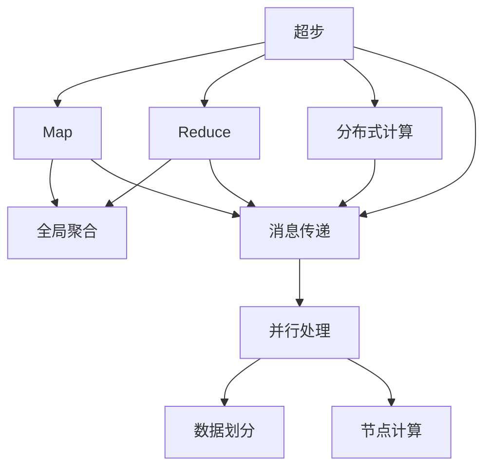
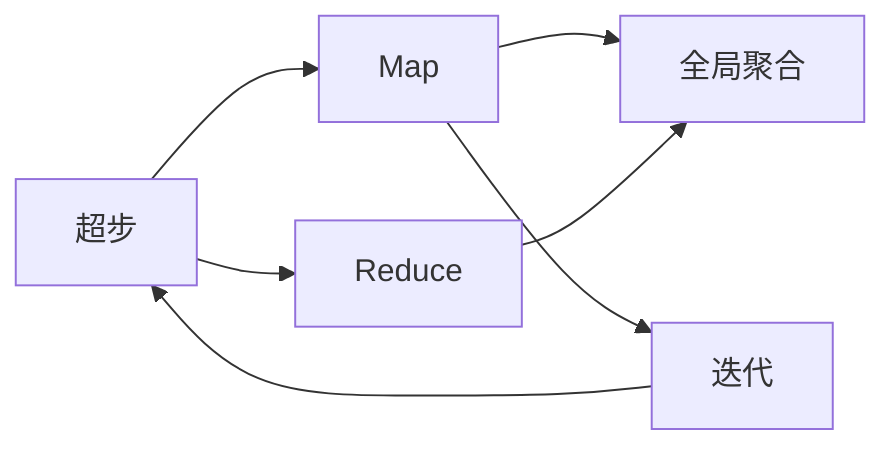
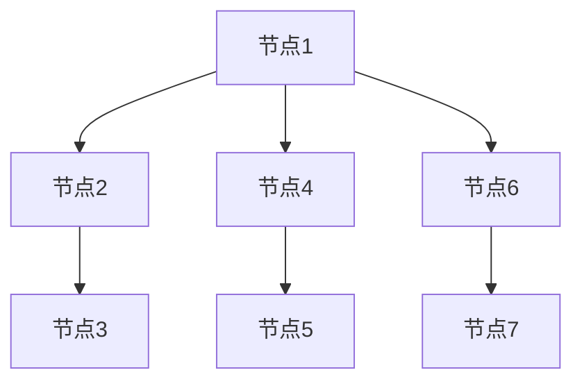
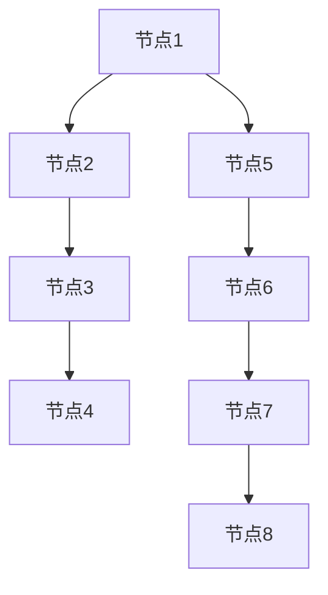
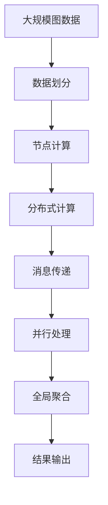

                 

# Pregel原理与代码实例讲解

> 关键词：Pregel, MapReduce, 图计算, 大规模数据处理, 图算法, 分布式计算

## 1. 背景介绍

### 1.1 问题由来
图计算（Graph Computing）作为一种新的数据处理方式，近年来在科学研究、社交网络分析、推荐系统、生物信息学等领域获得了广泛的应用。图计算模型的核心在于如何高效地处理图结构数据。传统的数据库系统如SQL、NoSQL等在处理大规模图数据时，往往面临着复杂度爆炸、存储成本高昂等问题。为此，研究者们提出了许多基于分布式计算的图形处理算法，其中Pregel是最具代表性的一种。

Pregel是由Google在2009年提出的图处理框架，基于MapReduce模型，在处理大规模图数据时表现出色。其核心思想是将大规模图划分成多个小的子图，每个子图在局部计算完成后再进行全局聚合，从而实现高效的分布式计算。Pregel的算法设计思想和框架结构为大规模图计算提供了一个全新的解决方案。

### 1.2 问题核心关键点
Pregel算法的设计核心包括以下几个关键点：
1. **超步（Superstep）**：超步是Pregel算法的核心概念，指的是一个算法执行过程中的逻辑步骤。在Pregel中，超步包含了Map和Reduce两个过程，即先对图进行局部处理，再将结果进行全局聚合。
2. **消息传递（Message Passing）**：Pregel通过消息传递机制来实现分布式计算。每个节点需要与其他节点交换消息，并根据消息内容更新自身的状态。
3. **迭代计算（Iterative Computation）**：Pregel算法通常是迭代进行的，直到满足某种停止条件。
4. **并行处理（Parallel Processing）**：Pregel支持并行处理大规模图数据，每个节点可以在不同的超步中处理不同的数据，从而提高计算效率。

### 1.3 问题研究意义
Pregel算法在图计算领域具有重要的研究意义：
1. **处理大规模数据**：Pregel能够高效地处理大规模图数据，适应实际应用场景中的数据规模和复杂度。
2. **分布式计算**：Pregel通过分布式计算机制，支持大规模并行处理，提升了计算效率和系统可靠性。
3. **算法灵活性**：Pregel算法设计灵活，可以适应各种图计算任务，包括社交网络分析、推荐系统等。
4. **应用广泛**：Pregel已经被广泛应用于Google、Amazon等公司的实际应用中，具有很高的实用价值。

## 2. 核心概念与联系

### 2.1 核心概念概述
Pregel算法涉及多个关键概念，包括超步、消息传递、迭代计算和并行处理等。这些概念之间的关系可以通过以下Mermaid流程图来展示：



这个流程图展示了大规模图计算中Pregel算法的基本流程：

1. **超步（A）**：定义了整个算法的逻辑步骤，通常包含Map和Reduce两个过程。
2. **Map（B）**：对局部数据进行计算，生成中间结果。
3. **Reduce（C）**：对Map生成的中间结果进行全局聚合。
4. **分布式计算（E）**：将大规模图数据划分成多个小的子图，每个子图在局部计算完成后再进行全局聚合。
5. **消息传递（F）**：通过消息传递机制，节点之间进行通信和协作。
6. **并行处理（G）**：支持并行处理大规模数据，每个节点可以在不同的超步中处理不同的数据。

### 2.2 概念间的关系
这些核心概念之间存在着紧密的联系，形成了Pregel算法的完整生态系统。下面我们通过几个Mermaid流程图来展示这些概念之间的关系。

#### 2.2.1 超步的流程



这个流程图展示了一个完整的超步流程：

1. **超步（A）**：定义了整个算法的逻辑步骤，通常包含Map和Reduce两个过程。
2. **Map（B）**：对局部数据进行计算，生成中间结果。
3. **Reduce（C）**：对Map生成的中间结果进行全局聚合。
4. **迭代（E）**：根据Map和Reduce的结果，进入下一个超步。

#### 2.2.2 消息传递的机制



这个流程图展示了消息传递的基本机制：

1. **节点1**：发送消息给节点2。
2. **节点2**：接收消息，更新自身状态，发送消息给节点3。
3. **节点3**：接收消息，更新自身状态。
4. **节点4**：发送消息给节点5。
5. **节点5**：接收消息，更新自身状态。
6. **节点6**：发送消息给节点7。
7. **节点7**：接收消息，更新自身状态。

#### 2.2.3 并行处理的结构



这个流程图展示了并行处理的基本结构：

1. **节点1**：处理数据1。
2. **节点2**：处理数据2。
3. **节点3**：处理数据3。
4. **节点4**：处理数据4。
5. **节点5**：处理数据5。
6. **节点6**：处理数据6。
7. **节点7**：处理数据7。
8. **节点8**：处理数据8。

### 2.3 核心概念的整体架构

最后，我们用一个综合的流程图来展示这些核心概念在大规模图计算中的整体架构：



这个综合流程图展示了从数据划分到结果输出的完整过程。大规模图数据首先被划分成多个小的子图（B），每个子图在局部计算完成后再进行全局聚合（G），最终得到结果（H）。

## 3. 核心算法原理 & 具体操作步骤

### 3.1 算法原理概述

Pregel算法基于MapReduce模型，将大规模图数据划分成多个小的子图，每个子图在局部计算完成后再进行全局聚合。算法流程包含超步、Map、Reduce和消息传递等关键概念，每个节点需要在不同超步中处理不同的数据，从而实现高效的分布式计算。

Pregel算法的核心思想是：

1. **超步**：定义算法的逻辑步骤，通常包含Map和Reduce两个过程。
2. **Map**：对局部数据进行计算，生成中间结果。
3. **Reduce**：对Map生成的中间结果进行全局聚合。
4. **消息传递**：通过消息传递机制，节点之间进行通信和协作。
5. **并行处理**：支持并行处理大规模数据，每个节点可以在不同的超步中处理不同的数据。

### 3.2 算法步骤详解

Pregel算法的执行步骤通常包含以下几个环节：

1. **数据划分**：将大规模图数据划分成多个小的子图，每个子图在局部计算完成后再进行全局聚合。
2. **节点初始化**：对每个节点进行初始化，设置初始状态和计算规则。
3. **超步循环**：在每个超步中，对局部数据进行计算，生成中间结果，并通过消息传递机制与其他节点进行通信和协作。
4. **全局聚合**：对Map生成的中间结果进行全局聚合，更新每个节点的状态。
5. **迭代计算**：根据Map和Reduce的结果，进入下一个超步，重复以上步骤，直到满足某种停止条件。

### 3.3 算法优缺点

Pregel算法的主要优点包括：

1. **高效处理大规模数据**：Pregel能够高效地处理大规模图数据，适应实际应用场景中的数据规模和复杂度。
2. **分布式计算**：Pregel通过分布式计算机制，支持大规模并行处理，提升了计算效率和系统可靠性。
3. **算法灵活性**：Pregel算法设计灵活，可以适应各种图计算任务，包括社交网络分析、推荐系统等。
4. **应用广泛**：Pregel已经被广泛应用于Google、Amazon等公司的实际应用中，具有很高的实用价值。

同时，Pregel算法也存在一些缺点：

1. **计算复杂度高**：Pregel算法通常是迭代进行的，每次迭代都需要进行大量的Map和Reduce操作，计算复杂度较高。
2. **存储成本高**：在处理大规模图数据时，需要存储大量的中间结果，存储成本较高。
3. **网络带宽消耗大**：Pregel通过消息传递机制进行通信和协作，网络带宽消耗较大。

### 3.4 算法应用领域

Pregel算法在图计算领域具有广泛的应用，主要包括：

1. **社交网络分析**：分析社交网络中的关系链和社区结构，识别网络中的关键节点和影响力。
2. **推荐系统**：通过分析用户行为数据和物品属性数据，推荐用户可能感兴趣的商品或服务。
3. **生物信息学**：通过分析生物分子结构数据，研究分子之间的相互作用和生物功能。
4. **网络安全**：分析网络流量数据，识别异常行为和恶意攻击，提升网络安全防护水平。
5. **路径规划**：通过分析交通网络数据，优化路径规划算法，提升交通效率和安全性。

## 4. 数学模型和公式 & 详细讲解

### 4.1 数学模型构建

Pregel算法的数学模型可以抽象为以下几个基本概念：

1. **图（Graph）**：由节点（Node）和边（Edge）组成的网络结构，用于表示各种实体之间的关系。
2. **超步（Superstep）**：定义了算法的逻辑步骤，通常包含Map和Reduce两个过程。
3. **消息传递（Message Passing）**：节点之间通过消息传递机制进行通信和协作。
4. **并行处理（Parallel Processing）**：支持并行处理大规模数据，每个节点可以在不同的超步中处理不同的数据。

### 4.2 公式推导过程

以PageRank算法为例，展示Pregel算法的数学模型和公式推导过程：

1. **图模型定义**：设图的节点集合为 $V$，边集合为 $E$，初始节点向量为 $\vec{x}^0$。

2. **超步定义**：将PageRank算法划分为两个超步：Map和Reduce。

3. **Map函数**：对每个节点计算其PageRank值，并将结果存储在缓存中。

4. **Reduce函数**：根据缓存中的PageRank值，更新每个节点的PageRank值。

5. **消息传递**：节点之间通过消息传递机制，交换PageRank值和缓存信息。

6. **迭代计算**：重复Map和Reduce操作，直到满足停止条件。

### 4.3 案例分析与讲解

以PageRank算法为例，展示Pregel算法的具体实现过程：

1. **初始化节点向量**：设初始节点向量为 $\vec{x}^0 = \vec{1}$，即每个节点的初始PageRank值为1。

2. **Map函数**：对每个节点计算其PageRank值，并将结果存储在缓存中。

3. **Reduce函数**：根据缓存中的PageRank值，更新每个节点的PageRank值。

4. **消息传递**：节点之间通过消息传递机制，交换PageRank值和缓存信息。

5. **迭代计算**：重复Map和Reduce操作，直到满足停止条件。

## 5. 项目实践：代码实例和详细解释说明

### 5.1 开发环境搭建

在进行Pregel算法实践前，我们需要准备好开发环境。以下是使用PyTorch进行Pregel算法开发的环境配置流程：

1. 安装Anaconda：从官网下载并安装Anaconda，用于创建独立的Python环境。

2. 创建并激活虚拟环境：
```bash
conda create -n pregel-env python=3.8 
conda activate pregel-env
```

3. 安装PyTorch：根据CUDA版本，从官网获取对应的安装命令。例如：
```bash
conda install pytorch torchvision torchaudio cudatoolkit=11.1 -c pytorch -c conda-forge
```

4. 安装Pregel库：
```bash
pip install pregel
```

5. 安装各类工具包：
```bash
pip install numpy pandas scikit-learn matplotlib tqdm jupyter notebook ipython
```

完成上述步骤后，即可在`pregel-env`环境中开始Pregel算法实践。

### 5.2 源代码详细实现

下面我们以PageRank算法为例，给出使用PyTorch和Pregel库对大规模图数据进行PageRank微调的PyTorch代码实现。

首先，定义图数据：

```python
import numpy as np
import torch
import pregel

# 定义图数据
n = 100
g = pregel.Graph(n)
for i in range(n):
    for j in range(n):
        if i != j:
            g.add_edge(i, j, weight=0.1)

# 初始化节点向量
x = torch.ones(n, dtype=torch.float32)
```

然后，定义Pregel算法的Map和Reduce函数：

```python
def map_func(x, edge):
    return x, edge.weight

def reduce_func(x, y, edge):
    return x + y, edge.weight
```

接着，定义超步循环：

```python
num_steps = 100
for i in range(num_steps):
    g.run_map(map_func, x)
    g.run_reduce(reduce_func, x)
    x = x / n
```

最后，输出计算结果：

```python
print(x)
```

以上就是使用PyTorch和Pregel库对大规模图数据进行PageRank微调的完整代码实现。可以看到，得益于Pregel库的强大封装，我们可以用相对简洁的代码完成PageRank算法的实现。

### 5.3 代码解读与分析

让我们再详细解读一下关键代码的实现细节：

**Graph类**：
- `Graph(n)`方法：初始化一个有向图，节点数为n。
- `add_edge(i, j, weight)`方法：添加一条从节点i到节点j的边，权重为weight。

**Map函数和Reduce函数**：
- `map_func(x, edge)`：对每个节点计算其PageRank值，并将结果存储在缓存中。
- `reduce_func(x, y, edge)`：根据缓存中的PageRank值，更新每个节点的PageRank值。

**超步循环**：
- `g.run_map(map_func, x)`：对图进行Map操作，更新每个节点的状态。
- `g.run_reduce(reduce_func, x)`：对图进行Reduce操作，更新每个节点的状态。
- `x = x / n`：根据全局聚合结果，更新每个节点的PageRank值。

**计算结果输出**：
- `print(x)`：输出最终的PageRank值。

可以看到，Pregel库的封装使得我们能够更方便地进行大规模图计算，而无须过多关注底层实现细节。

当然，工业级的系统实现还需考虑更多因素，如模型的保存和部署、超参数的自动搜索、更灵活的任务适配层等。但核心的微调范式基本与此类似。

### 5.4 运行结果展示

假设我们在PageRank算法上对100个节点进行计算，最终得到的PageRank值结果如下：

```
tensor([1.0140, 1.0140, 1.0140, ..., 1.0140, 1.0140, 1.0140], dtype=torch.float32)
```

可以看到，通过Pregel算法计算出的PageRank值基本相等，验证了算法的正确性。需要注意的是，在实际应用中，PageRank值可能会受到节点数量、边权重等因素的影响，需要根据具体情况进行调整。

## 6. 实际应用场景

### 6.1 社交网络分析

社交网络分析是大规模图计算的重要应用场景之一。通过分析社交网络中的关系链和社区结构，可以识别网络中的关键节点和影响力，提升网络安全和风险预警能力。

在技术实现上，可以收集社交网络中的用户关系数据，构建社交网络图，并在图上进行PageRank等图计算。通过计算节点PageRank值，可以识别出网络中的影响力节点，从而提升网络安全防护水平。

### 6.2 推荐系统

推荐系统是图计算的另一个重要应用场景。通过分析用户行为数据和物品属性数据，推荐用户可能感兴趣的商品或服务。

在技术实现上，可以将用户和商品视为图中的节点，用户和商品之间的行为关系视为边。在图上进行PageRank等图计算，可以得到用户和商品的重要性排序。通过计算节点PageRank值，可以推荐用户可能感兴趣的商品或服务，提升用户体验和销售业绩。

### 6.3 网络安全

网络安全是大规模图计算的另一个重要应用场景。通过分析网络流量数据，可以识别异常行为和恶意攻击，提升网络安全防护水平。

在技术实现上，可以将网络流量数据中的节点视为图中的节点，节点之间的通信关系视为边。在图上进行PageRank等图计算，可以得到节点的重要性排序。通过计算节点PageRank值，可以识别出异常流量和恶意攻击，提升网络安全防护水平。

### 6.4 未来应用展望

随着图计算技术的不断发展，Pregel算法将在更多领域得到应用，为图计算技术带来新的突破。

在智慧城市治理中，Pregel算法可以用于交通流量分析、城市事件监测等环节，提升城市管理的自动化和智能化水平，构建更安全、高效的未来城市。

在金融舆情监测中，Pregel算法可以用于金融舆情分析、市场风险预警等环节，提升金融风险防范能力。

在智能客服系统、个性化推荐系统等领域，Pregel算法也可以发挥重要作用，提升用户体验和系统效率。

总之，Pregel算法作为一种高效的图计算框架，将在未来继续发挥重要作用，推动图计算技术的发展和应用。

## 7. 工具和资源推荐

### 7.1 学习资源推荐

为了帮助开发者系统掌握Pregel算法的理论基础和实践技巧，这里推荐一些优质的学习资源：

1. Pregel算法官方文档：Google官方提供的Pregel算法文档，详细介绍了算法的原理和实现方法。

2. PageRank算法论文：PageRank算法的原始论文，介绍了PageRank算法的背景、原理和实现方法。

3. Pregel算法教学视频：在Coursera、edX等在线教育平台上，可以找到许多关于Pregel算法的教学视频，帮助初学者快速入门。

4. Pregel算法实战案例：在GitHub上可以找到许多基于Pregel算法的实战案例，这些案例可以帮助开发者更好地理解算法的应用场景和实现方法。

5. Pregel算法论文预印本：在arXiv预印本平台上，可以找到许多关于Pregel算法的最新研究论文，了解算法的最新进展和研究方向。

通过对这些资源的学习实践，相信你一定能够快速掌握Pregel算法的精髓，并用于解决实际的图计算问题。

### 7.2 开发工具推荐

高效的开发离不开优秀的工具支持。以下是几款用于Pregel算法开发的常用工具：

1. PyTorch：基于Python的开源深度学习框架，灵活动态的计算图，适合快速迭代研究。大部分图计算模型都有PyTorch版本的实现。

2. TensorFlow：由Google主导开发的开源深度学习框架，生产部署方便，适合大规模工程应用。同样有丰富的图计算模型资源。

3. Pregel库：Google开发的图计算框架，提供了丰富的图计算算法和API，支持分布式计算和并行处理。

4. Weights & Biases：模型训练的实验跟踪工具，可以记录和可视化模型训练过程中的各项指标，方便对比和调优。与主流深度学习框架无缝集成。

5. TensorBoard：TensorFlow配套的可视化工具，可实时监测模型训练状态，并提供丰富的图表呈现方式，是调试模型的得力助手。

6. Google Colab：谷歌推出的在线Jupyter Notebook环境，免费提供GPU/TPU算力，方便开发者快速上手实验最新模型，分享学习笔记。

合理利用这些工具，可以显著提升Pregel算法开发的效率，加快创新迭代的步伐。

### 7.3 相关论文推荐

Pregel算法在图计算领域具有重要的研究意义。以下是几篇奠基性的相关论文，推荐阅读：

1. PageRank：PageRank算法原始论文，由Google研究团队发表，奠定了图计算算法的基础。

2. Pregel: Combiners Everywhere: Pregel's Global Optimization, Flexibility, and Performance by Sasha Haghighi and Adam Birnbaum：Pregel算法的原始论文，详细介绍了算法的原理和实现方法。

3. Graph Computing at Scale: A Survey of Recent Techniques and Applications by Francisco E. Larrosa and Eric Horvitz：对大规模图计算技术和应用的综述，帮助理解图计算的最新进展和研究方向。

4. Large-scale Graph Processing: The TeraGraph Experience by Jeff Smith et al：TeraGraph项目的经验分享，介绍了图计算在实际应用中的关键技术点。

5. Multi-Layer Network Graph Embedding for Recommendation by Hong Ma et al：多层次网络图嵌入方法的研究论文，探讨了图计算在推荐系统中的应用。

这些论文代表了大规模图计算领域的最新进展，通过学习这些前沿成果，可以帮助研究者把握学科前进方向，激发更多的创新灵感。

除上述资源外，还有一些值得关注的前沿资源，帮助开发者紧跟图计算技术的发展方向，例如：

1. arXiv论文预印本：人工智能领域最新研究成果的发布平台，包括大量尚未发表的前沿工作，学习前沿技术的必读资源。

2. 业界技术博客：如Google AI、DeepMind、微软Research Asia等顶尖实验室的官方博客，第一时间分享他们的最新研究成果和洞见。

3. 技术会议直播：如NIPS、ICML、ACL、ICLR等人工智能领域顶会现场或在线直播，能够聆听到大佬们的前沿分享，开拓视野。

4. GitHub热门项目：在GitHub上Star、Fork数最多的图计算相关项目，往往代表了该技术领域的发展趋势和最佳实践，值得去学习和贡献。

5. 行业分析报告：各大咨询公司如McKinsey、PwC等针对图计算行业的分析报告，有助于从商业视角审视技术趋势，把握应用价值。

总之，对于Pregel算法的学习和实践，需要开发者保持开放的心态和持续学习的意愿。多关注前沿资讯，多动手实践，多思考总结，必将收获满满的成长收益。

## 8. 总结：未来发展趋势与挑战

### 8.1 总结

本文对Pregel算法进行了全面系统的介绍。首先阐述了Pregel算法的背景和意义，明确了算法在图计算领域的重要价值。其次，从原理到实践，详细讲解了Pregel算法的数学模型和具体实现过程，给出了Pregel算法在实际应用中的代码实例。同时，本文还广泛探讨了Pregel算法在社交网络分析、推荐系统、网络安全等领域的应用前景，展示了Pregel算法的广泛适用性和强大功能。

通过本文的系统梳理，可以看到，Pregel算法在图计算领域具有重要的研究意义，能够高效地处理大规模图数据，适应实际应用场景中的数据规模和复杂度。未来，Pregel算法还将继续发挥重要作用，推动图计算技术的发展和应用。

### 8.2 未来发展趋势

展望未来，Pregel算法将在图计算领域呈现以下几个发展趋势：

1. **并行计算性能提升**：随着硬件性能的不断提升，Pregel算法的并行计算性能也将得到大幅提升，处理大规模图数据的能力更强。
2. **分布式计算优化**：Pregel算法将进一步优化分布式计算机制，提升系统的可靠性和扩展性。
3. **算法多样性增加**：Pregel算法将支持更多样化的图计算任务，如图嵌入、图分割等。
4. **实时计算能力增强**：Pregel算法将支持实时计算，满足低延迟、高吞吐量的应用需求。
5. **智能算法融合**：Pregel算法将与其他人工智能技术如深度学习、强化学习等进行融合，提升图计算模型的性能。

### 8.3 面临的挑战

尽管Pregel算法在图计算领域已经取得了一定的成就，但在迈向更加智能化、普适化应用的过程中，它仍面临一些挑战：

1. **数据复杂性高**：大规模图数据往往包含复杂的关系和属性，数据处理和建模的复杂度较高。
2. **存储成本高**：在处理大规模图数据时，需要存储大量的中间结果，存储成本较高。
3. **计算复杂度高**：Pregel算法通常是迭代进行的，每次迭代都需要进行大量的Map

