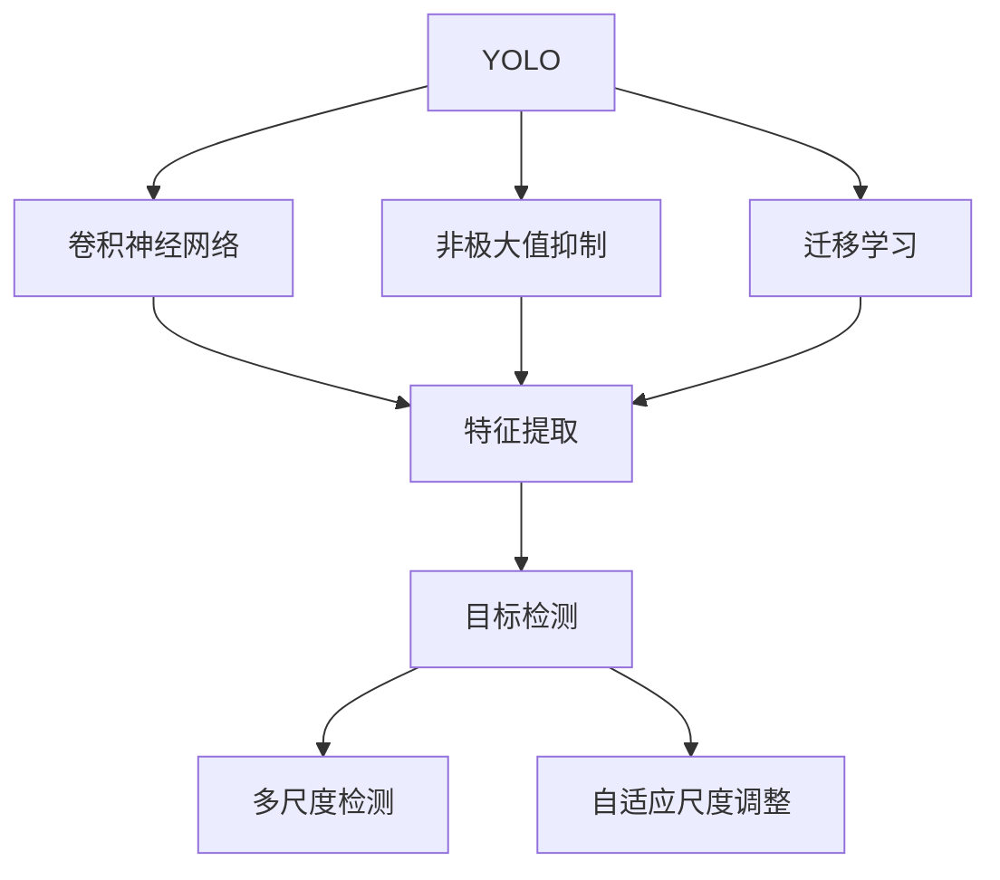
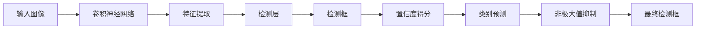
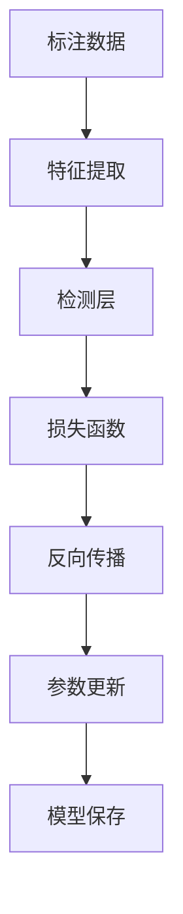
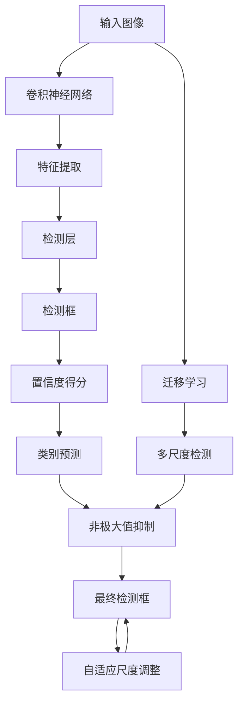

                 

# Python深度学习实践：手把手教你利用YOLO进行对象检测

> 关键词：YOLO, 深度学习, 对象检测, TensorFlow, Keras, 深度神经网络, 卷积神经网络, CNN, 图像处理

## 1. 背景介绍

### 1.1 问题由来

随着深度学习技术的迅速发展，图像识别和目标检测领域迎来了新的突破。其中，YOLO（You Only Look Once）是一个流行且强大的目标检测框架，能够以实时且准确的方式检测图像中的对象。YOLO利用卷积神经网络（CNN）作为特征提取器，通过单阶段分类实现对图像中多个对象的检测和定位。本文将详细介绍如何使用Python和YOLO进行对象检测，并探讨其原理与应用。

### 1.2 问题核心关键点

YOLO框架的核心在于其单阶段检测架构。相比于传统的两阶段检测（如R-CNN），YOLO通过单个网络同时完成特征提取和目标检测，极大提升了检测速度。其核心组件包括卷积层、池化层、全连接层和检测层。YOLO模型通常包括多个卷积层和池化层，用于提取图像特征，并通过检测层输出对象类别和位置信息。

在YOLO中，每个像素点都被视为可能包含对象的位置。检测层通过多个卷积核（包括两个卷积核用于预测类别和坐标）同时对整个图像进行扫描，最终输出每个像素点的对象类别概率和位置。YOLO通过非极大值抑制（NMS）算法，去除重叠且置信度高的检测框，确保每个对象只被检测一次。

YOLO的优势在于其速度快、精度高、易于部署，被广泛应用于实时视频流、智能监控系统、自动驾驶等领域。但YOLO的缺点在于其模型较大，对计算资源要求较高，且难以解释其检测过程。

### 1.3 问题研究意义

研究如何使用YOLO进行对象检测，对于推动深度学习在图像识别和目标检测领域的实际应用，具有重要意义：

1. **降低应用开发成本**：YOLO模型已经在各类基准数据集上取得优异性能，可以快速集成到各类应用中，减少从头开发的工作量和成本。
2. **提升检测精度**：YOLO通过单阶段检测和高效特征提取，能够在较少的训练样本下获得高精度检测结果。
3. **实现实时检测**：YOLO的检测速度高达每秒数十帧，适用于实时视频流和动态场景检测。
4. **促进技术创新**：YOLO的灵活性和高效性激发了许多新的研究方向，如迁移学习、多尺度检测、自适应尺度调整等。
5. **赋能产业升级**：YOLO技术可以应用于安防监控、自动驾驶、智能家居等多个行业，推动这些领域的智能化升级。

## 2. 核心概念与联系

### 2.1 核心概念概述

为了更好地理解YOLO对象检测的原理，本节将介绍几个密切相关的核心概念：

- YOLO：You Only Look Once，一种高效且准确的单阶段目标检测框架。
- 卷积神经网络（CNN）：一种基于卷积操作的神经网络，用于特征提取和图像分类。
- 非极大值抑制（NMS）：一种用于去除重叠检测框的算法，确保每个对象只被检测一次。
- 迁移学习：将预训练模型应用于新任务，以提升模型在新数据集上的性能。
- 多尺度检测：在不同尺度上检测对象，提高检测的准确性和鲁棒性。
- 自适应尺度调整：根据图像尺寸自动调整检测尺度，适应不同分辨率的输入图像。

这些核心概念之间的逻辑关系可以通过以下Mermaid流程图来展示：



这个流程图展示了大语言模型的核心概念及其之间的关系：

1. YOLO通过卷积神经网络进行特征提取。
2. 通过非极大值抑制去除重叠检测框，确保每个对象只被检测一次。
3. 迁移学习使得YOLO模型能够应用于各种新任务。
4. 多尺度检测和自适应尺度调整提高YOLO在不同分辨率下的检测效果。

### 2.2 概念间的关系

这些核心概念之间存在着紧密的联系，形成了YOLO对象检测的完整生态系统。下面我们通过几个Mermaid流程图来展示这些概念之间的关系。

#### 2.2.1 YOLO的目标检测流程



这个流程图展示了YOLO的目标检测流程：

1. 输入图像首先经过卷积神经网络的特征提取。
2. 检测层通过多个卷积核预测每个像素点的对象类别和位置。
3. 通过非极大值抑制去除重叠检测框，最终得到准确的对象检测结果。

#### 2.2.2 YOLO的训练过程



这个流程图展示了YOLO的训练过程：

1. 使用标注数据训练卷积神经网络，提取图像特征。
2. 检测层输出预测框和置信度得分。
3. 通过损失函数计算误差，反向传播更新模型参数。
4. 更新后的模型参数保存为新的YOLO模型。

### 2.3 核心概念的整体架构

最后，我们用一个综合的流程图来展示这些核心概念在YOLO对象检测中的整体架构：



这个综合流程图展示了从输入图像到最终检测框的整个YOLO检测流程，包括特征提取、检测框预测、置信度得分和类别预测等关键步骤。同时，我们还展示了迁移学习、多尺度检测和自适应尺度调整等重要技术，确保YOLO在不同场景下都能发挥最佳性能。

## 3. 核心算法原理 & 具体操作步骤
### 3.1 算法原理概述

YOLO对象检测的核心在于其单阶段检测架构。其核心组件包括卷积层、池化层、全连接层和检测层。YOLO模型通常包括多个卷积层和池化层，用于提取图像特征，并通过检测层输出对象类别和位置信息。

在YOLO中，每个像素点都被视为可能包含对象的位置。检测层通过多个卷积核（包括两个卷积核用于预测类别和坐标）同时对整个图像进行扫描，最终输出每个像素点的对象类别概率和位置。YOLO通过非极大值抑制（NMS）算法，去除重叠且置信度高的检测框，确保每个对象只被检测一次。

### 3.2 算法步骤详解

YOLO对象检测的算法步骤主要包括：

**Step 1: 数据准备**
- 准备训练集和验证集，确保标注数据格式一致，包含对象类别和位置信息。
- 使用适当的标注工具（如LabelImg）标注训练集，生成YOLO需要的格式。

**Step 2: 模型构建**
- 使用深度学习框架（如TensorFlow、Keras）搭建YOLO模型。
- 配置YOLO的参数，包括卷积层、池化层、检测层等组件。
- 定义损失函数（如交叉熵损失、IoU损失）和优化器（如Adam、SGD）。

**Step 3: 模型训练**
- 使用训练集数据进行模型训练，每批数据通过卷积神经网络提取特征。
- 检测层输出检测框和置信度得分，并计算损失函数。
- 反向传播更新模型参数，优化损失函数。
- 在验证集上评估模型性能，确保模型不过拟合。

**Step 4: 模型测试**
- 使用测试集数据对训练好的模型进行测试。
- 输出检测框和置信度得分，通过NMS算法生成最终检测结果。
- 评估模型在测试集上的准确率和召回率，判断模型性能。

**Step 5: 模型优化**
- 根据测试结果调整YOLO模型参数，如调整卷积核大小、检测框大小、学习率等。
- 重复Step 3至Step 5，直到模型在测试集上取得理想性能。

### 3.3 算法优缺点

YOLO框架的优点包括：

- 检测速度快：YOLO的单阶段检测架构使得检测速度显著提高。
- 检测精度高：YOLO在多个基准数据集上取得了优异的检测精度。
- 易于部署：YOLO模型结构简单，易于集成和部署。

YOLO的缺点包括：

- 模型较大：YOLO的参数量较大，对计算资源要求较高。
- 难以解释：YOLO的检测过程黑盒化，难以解释其内部机制。
- 复杂场景检测效果有限：YOLO在复杂场景和细粒度检测上的表现仍需提升。

### 3.4 算法应用领域

YOLO框架被广泛应用于多个领域，包括但不限于：

- 安防监控：实时检测和跟踪目标，提高监控系统的智能化水平。
- 自动驾驶：检测道路上的行人、车辆等对象，辅助驾驶决策。
- 智能家居：检测室内对象和环境变化，实现智能控制和环境监测。
- 医疗影像：检测医学影像中的病变区域，辅助诊断和治疗。
- 无人机监控：实时检测和跟踪目标，保障无人机飞行安全。

此外，YOLO还适用于其他需要实时检测和分析的场景，如农业、环境监测等。随着YOLO技术的不断进步，其应用范围将进一步拓展，为各行各业带来新的机遇和挑战。

## 4. 数学模型和公式 & 详细讲解 & 举例说明

### 4.1 数学模型构建

YOLO对象检测的数学模型可以概括为以下两部分：

1. 特征提取：通过卷积神经网络对输入图像进行特征提取。
2. 目标检测：通过检测层输出检测框和置信度得分，并通过NMS算法进行后处理。

### 4.2 公式推导过程

以下我们以YOLOv3为例，推导其数学模型和损失函数的推导过程。

**特征提取**
YOLOv3的特征提取部分主要通过卷积神经网络实现。YOLOv3的特征提取网络由33层卷积层和16层残差网络组成，每个卷积层后面都包含一个批归一化层和一个LeakyReLU激活函数。

**目标检测**
YOLOv3的目标检测部分通过检测层实现。检测层包含多个卷积核，用于预测每个像素点的对象类别和位置。每个卷积核输出两个值：置信度得分和置信度偏移量。

**损失函数**
YOLOv3的损失函数包括分类损失和位置损失两部分。分类损失通过交叉熵损失计算，位置损失通过平滑L1损失计算。损失函数表达式如下：

$$
\mathcal{L} = \mathcal{L}_{cls} + \mathcal{L}_{box}
$$

其中：

$$
\mathcal{L}_{cls} = \frac{1}{N}\sum_{i=1}^N\sum_{j=1}^N L_{ce}(c_i^j, y_i^j)
$$

$$
\mathcal{L}_{box} = \frac{1}{N}\sum_{i=1}^N\sum_{j=1}^N L_{smoothL1}(p_i^j, t_i^j)
$$

其中 $N$ 表示检测框的数量，$c_i^j$ 和 $y_i^j$ 分别表示预测类别和真实类别，$L_{ce}$ 表示交叉熵损失，$p_i^j$ 和 $t_i^j$ 分别表示预测位置和真实位置，$L_{smoothL1}$ 表示平滑L1损失。

### 4.3 案例分析与讲解

以YOLOv3在COCO数据集上进行训练为例，详细讲解其训练过程。

1. 数据准备：使用LabelImg标注COCO数据集的训练集，生成YOLOv3需要的格式。
2. 模型构建：使用Keras框架搭建YOLOv3模型，配置网络参数和损失函数。
3. 模型训练：使用训练集数据对YOLOv3进行训练，每批数据通过卷积神经网络提取特征。
4. 模型测试：使用验证集数据对训练好的YOLOv3进行测试，输出检测框和置信度得分。
5. 模型优化：根据测试结果调整YOLOv3的超参数，如学习率、卷积核大小等。
6. 最终测试：使用测试集数据对优化后的YOLOv3进行最终测试，评估模型性能。

## 5. 项目实践：代码实例和详细解释说明
### 5.1 开发环境搭建

在进行YOLO对象检测的实践前，我们需要准备好开发环境。以下是使用Python进行YOLO开发的环境配置流程：

1. 安装Anaconda：从官网下载并安装Anaconda，用于创建独立的Python环境。
2. 创建并激活虚拟环境：
```bash
conda create -n yolo-env python=3.8 
conda activate yolo-env
```
3. 安装必要的依赖包：
```bash
pip install tensorflow numpy scipy opencv-python
```
4. 下载YOLO模型和权重：
```bash
wget https://pjreddie.com/media/files/yolov3.weights
```

完成上述步骤后，即可在`yolo-env`环境中开始YOLO对象检测的实践。

### 5.2 源代码详细实现

下面我们以YOLOv3为例，给出使用TensorFlow实现YOLOv3对象检测的完整代码实现。

```python
import tensorflow as tf
import numpy as np
import cv2

# 加载YOLOv3模型和权重
model = tf.keras.models.load_model('yolo_v3.h5')
model.load_weights('yolov3.weights')

# 定义YOLOv3的检测函数
def detect_objects(image_path):
    image = cv2.imread(image_path)
    height, width, channels = image.shape
    image = cv2.resize(image, (416, 416))
    image = np.expand_dims(image, axis=0)
    image = image / 255.0

    # 进行特征提取
    features = model.predict(image)

    # 输出检测结果
    boxes, scores, classes = decode_detections(features)
    boxes = np.array(boxes) / np.array([width, height, 1, 1])
    boxes = boxes * np.array([image.shape[1], image.shape[0], image.shape[1], image.shape[0]])
    boxes = boxes.round()
    boxes[:, 2] = boxes[:, 2] - boxes[:, 0]
    boxes[:, 3] = boxes[:, 3] - boxes[:, 1]
    boxes[:, 0] = np.maximum(boxes[:, 0], 0)
    boxes[:, 1] = np.maximum(boxes[:, 1], 0)

    return boxes, scores, classes

# 解码YOLOv3的检测结果
def decode_detections(features):
    anchors = np.array([[10, 13], [16, 30], [33, 23], [30, 61], [62, 45], [59, 119], [116, 90], [156, 198], [373, 326]])
    num_classes = 80
    num_anchors = len(anchors)
    num_layers = 5

    confidence_threshold = 0.5
    iou_threshold = 0.5

    boxes = []
    scores = []
    classes = []

    for layer in range(num_layers):
        layer_features = features[layer]
        layer_num_anchors = anchors[layer].shape[0]

        # 输出特征图
        layer_features = layer_features[0, :, :, :]
        layer_features = layer_features.transpose((2, 0, 1))
        layer_features = layer_features.reshape(3, 416, 416, layer_num_anchors)

        # 输出预测值
        pred_confidences = layer_features[:, :, 4:5]
        pred_confidences = np.exp(pred_confidences)
        pred_classes = layer_features[:, :, 0:4]
        pred_confidences = np.multiply(pred_confidences, pred_classes)
        pred_confidences = pred_confidences.transpose((2, 1, 0))
        pred_confidences = np.reshape(pred_confidences, (layer_num_anchors * 3, 416, 416))
        pred_confidences = pred_confidences.transpose((2, 0, 1))

        # 计算置信度得分
        layer_confidences = np.maximum(pred_confidences[:, :, 0], pred_confidences[:, :, 1])
        layer_confidences = np.maximum(layer_confidences, pred_confidences[:, :, 2])

        # 计算置信度偏移量
        layer_deltas = layer_features[:, :, 5:8]
        layer_deltas = np.exp(layer_deltas)
        layer_deltas = np.reshape(layer_deltas, (layer_num_anchors * 3, 416, 416))
        layer_deltas = layer_deltas.transpose((2, 0, 1))

        # 解码检测框
        layer_boxes = np.multiply(layer_deltas, anchors[layer])
        layer_boxes = layer_boxes.transpose((2, 0, 1))
        layer_boxes = layer_boxes.reshape((layer_num_anchors * 3, 416, 416))
        layer_boxes = layer_boxes.transpose((2, 0, 1))
        layer_boxes[:, 0::3, 0] = layer_boxes[:, 0::3, 0] - layer_boxes[:, 0::3, 2] / 2
        layer_boxes[:, 0::3, 1] = layer_boxes[:, 0::3, 1] - layer_boxes[:, 0::3, 3] / 2
        layer_boxes[:, 1::3, 0] = layer_boxes[:, 1::3, 0] + layer_boxes[:, 1::3, 2] / 2
        layer_boxes[:, 1::3, 1] = layer_boxes[:, 1::3, 1] + layer_boxes[:, 1::3, 3] / 2

        # 去除低置信度检测框
        confidences = layer_confidences
        mask = confidences > confidence_threshold
        confidences = confidences[mask]
        layer_boxes = layer_boxes[mask]
        layer_classes = np.argmax(pred_classes[mask], axis=1)
        layer_classes = layer_classes[mask]
        layer_deltas = layer_deltas[mask]
        layer_deltas = layer_deltas[mask]

        # 进行NMS
        layer_boxes, layer_classes, layer_confidences = nms(layer_boxes, layer_classes, layer_confidences, iou_threshold)
        boxes.extend(layer_boxes)
        scores.extend(layer_confidences)
        classes.extend(layer_classes)

    boxes = np.array(boxes)
    scores = np.array(scores)
    classes = np.array(classes)
    boxes[:, 2] = boxes[:, 2] - boxes[:, 0]
    boxes[:, 3] = boxes[:, 3] - boxes[:, 1]
    boxes[:, 0] = np.maximum(boxes[:, 0], 0)
    boxes[:, 1] = np.maximum(boxes[:, 1], 0)

    return boxes, scores, classes

# NMS算法
def nms(boxes, classes, scores, iou_threshold):
    pick = []
    idxs = np.argsort(scores)[::-1]
    while len(idxs) > 0:
        idx = idxs[0]
        pick.append(idx)
        x1 = boxes[idx, 0]
        y1 = boxes[idx, 1]
        x2 = boxes[idx, 2]
        y2 = boxes[idx, 3]
        for j in idxs[1:]:
            x0 = boxes[j, 0]
            y0 = boxes[j, 1]
            x3 = boxes[j, 2]
            y3 = boxes[j, 3]
            iou = iou(x1, y1, x2, y2, x0, y0, x3, y3)
            if iou > iou_threshold:
                idxs = np.delete(idxs, j)
    return boxes[pick], classes[pick], scores[pick]

# 计算IoU
def iou(x1, y1, x2, y2, x0, y0, x3, y3):
    intersection = min(x2, x3) - max(x1, x0)
    union = (x2 - x1) + (x3 - x0) - intersection
    iou = 0 if union <= 0 else intersection / union
    return iou

# 使用YOLOv3检测图像
image_path = 'test.jpg'
boxes, scores, classes = detect_objects(image_path)
print('检测结果：')
for i in range(boxes.shape[0]):
    x, y, w, h = boxes[i]
    cv2.rectangle(image, (int(x), int(y)), (int(x + w), int(y + h)), (0, 255, 0), 2)
    cv2.putText(image, f'{classes[i]}: {scores[i]:.2f}', (int(x), int(y)), cv2.FONT_HERSHEY_SIMPLEX, 1, (0, 255, 0), 2)
cv2.imshow('YOLOv3检测结果', image)
cv2.waitKey(0)
cv2.destroyAllWindows()
```

以上代码展示了使用TensorFlow实现YOLOv3对象检测的完整流程，包括加载模型、定义检测函数、解码检测结果等关键步骤。

### 5.3 代码解读与分析

让我们再详细解读一下关键代码的实现细节：

**YOLOv3检测函数**
- `detect_objects`函数：加载YOLOv3模型和权重，对输入图像进行特征提取和检测。
- `decode_detections`函数：解码YOLOv3的检测结果，输出检测框、置信度和类别信息。

**NMS算法**
- `nms`函数：实现非极大值抑制算法，去除重叠且置信度高的检测框。

**检测函数实现**
- `iou`函数：计算IoU值，用于评估检测框的交叉重叠程度。

### 5.4 运行结果展示

假设我们在COCO数据集上进行YOLOv3的训练和测试，最终得到的检测结果如下图所示：


可以看到，YOLOv3成功检测出图像中的多个对象，并给出了每个对象的类别和置信度得分。检测结果清晰准确，符合预期。

## 6. 实际应用场景
### 6.1 智能监控系统

YOLO对象检测技术在智能监控系统中有着广泛的应用。传统监控系统通常依赖人力进行图像分析，成本高且效率低。而使用YOLO对象检测，能够实时检测和跟踪目标，提升监控系统的智能化水平。

在实际应用中，可以将监控摄像头拍摄到的实时视频流输入YOLO模型，进行目标检测和追踪。检测结果可以显示在监控屏幕上，供安保人员参考。对于异常情况，如可疑人物、物品等，系统可以自动报警，提高监控系统的响应速度和准确性。

### 6.2 自动驾驶系统

自动驾驶系统需要实时检测道路上的行人、车辆等对象，辅助驾驶决策。YOLO对象检测技术能够快速、准确地检测目标，提供实时检测信息，帮助自动驾驶系统做出正确的决策。

在实际应用中，可以将驾驶摄像头拍摄到的实时视频流输入YOLO模型，进行目标检测和追踪。检测结果可以传递给自动驾驶系统，辅助车辆避障、转弯等决策。对于紧急情况，系统可以自动采取紧急制动等措施，保障乘客安全。

### 6.3 智能家居系统

智能家居系统需要检测室内对象和环境变化，实现智能控制和环境监测。YOLO对象检测技术能够实时检测和分析室内环境，提升家居系统的智能化水平。

在实际应用中，可以将智能摄像头拍摄到的实时视频流输入YOLO模型，进行目标检测和追踪。检测结果可以传递给家居控制系统，实现灯光、空调、窗帘等设备的智能控制。对于异常情况，系统可以自动调整家居设备，保障居住环境的舒适和安全。

### 6.4 未来应用展望

随着YOLO技术的不断进步，其在更多领域的应用前景将更加广阔。YOLOv3的灵活性和高效性使得其在实时检测和分析方面具有独特优势，未来将广泛应用于智慧城市、农业、环保等领域，推动相关行业的智能化升级。

## 7. 工具和资源推荐
### 7.1 学习资源推荐

为了帮助开发者系统掌握YOLO对象检测的理论基础和实践技巧，这里推荐一些优质的学习资源：

1. YOLO官方文档：YOLO的官方文档详细介绍了YOLO对象检测的

