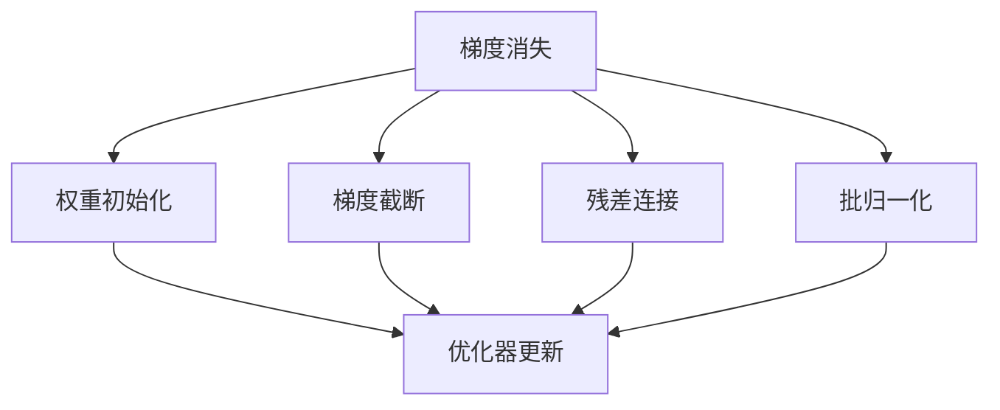
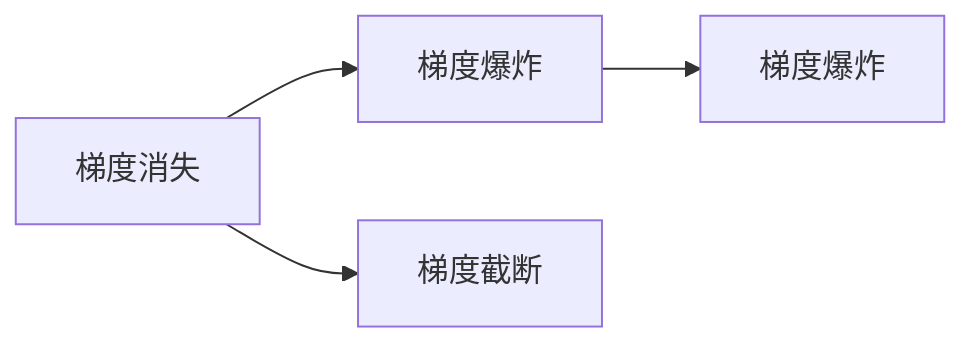
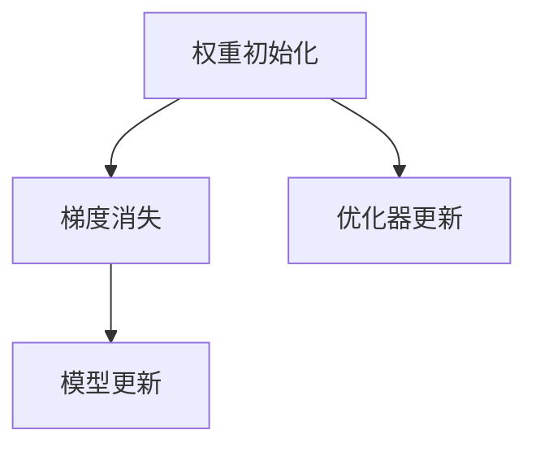
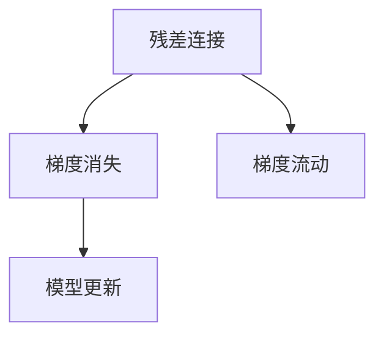
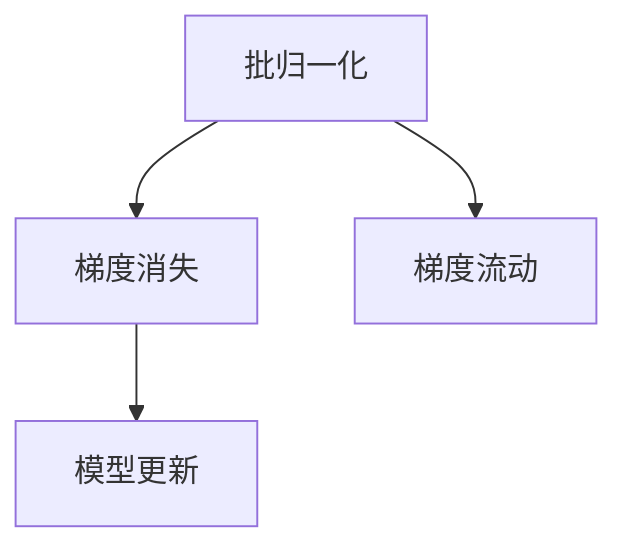

                 

# Python深度学习实践：梯度消失和梯度爆炸的解决方案

> 关键词：梯度消失, 梯度爆炸, 权重初始化, 梯度截断, 残差连接, 批归一化

## 1. 背景介绍

在深度学习模型训练过程中，梯度消失和梯度爆炸是常见且棘手的问题。这些问题不仅影响模型的收敛速度，还可能导致模型无法更新或者参数爆炸，从而无法训练。梯度消失指的是在反向传播过程中，梯度逐渐变小，最终接近于0，导致浅层网络无法更新。梯度爆炸则相反，梯度逐渐变大，最终导致数值溢出，无法训练。

本文章将介绍这些问题的原理，以及通过权重初始化、梯度截断、残差连接和批归一化等技术来解决这些问题的方法。通过这些方法，可以确保深度学习模型更加稳定和高效的训练。

## 2. 核心概念与联系

### 2.1 核心概念概述

在深度学习中，梯度是反向传播过程中的关键信号，用于更新模型的参数。梯度消失和梯度爆炸都是由于梯度在反向传播过程中出现的异常变化导致的。下面我们将详细介绍这些概念及其关系。

- **梯度消失（Vanishing Gradient）**：在深度神经网络中，梯度在反向传播过程中逐渐变小，最终接近于0。这会导致浅层网络的权重更新非常缓慢，甚至不更新。
- **梯度爆炸（Exploding Gradient）**：梯度在反向传播过程中逐渐变大，最终导致数值溢出。这会导致梯度爆炸问题，使得模型的参数更新变得不可控。
- **权重初始化（Weight Initialization）**：在深度学习模型训练前，对权重进行初始化，以确保梯度的稳定性和模型的收敛性。
- **梯度截断（Gradient Clipping）**：通过限制梯度的范数，避免梯度爆炸问题。
- **残差连接（Residual Connection）**：在深度网络中，将输入与输出相加，确保梯度的流动和模型的稳定性。
- **批归一化（Batch Normalization）**：通过对每个小批量数据进行归一化，确保梯度的稳定性和模型的收敛性。

这些概念之间有着紧密的联系，下面通过一个Mermaid流程图来展示它们之间的关系：



这个流程图展示了梯度消失、梯度爆炸等问题与权重初始化、梯度截断、残差连接和批归一化等技术之间的关系：

1. **梯度消失和梯度爆炸**：这两个问题都是由于梯度在反向传播过程中出现的异常变化导致的。
2. **权重初始化**：对权重进行初始化，确保梯度的稳定性和模型的收敛性。
3. **梯度截断**：通过限制梯度的范数，避免梯度爆炸问题。
4. **残差连接**：在深度网络中，将输入与输出相加，确保梯度的流动和模型的稳定性。
5. **批归一化**：通过对每个小批量数据进行归一化，确保梯度的稳定性和模型的收敛性。

通过这些技术，可以确保深度学习模型更加稳定和高效的训练。

### 2.2 概念间的关系

这些概念之间存在着紧密的联系，形成了深度学习模型训练的整体框架。下面我们通过几个Mermaid流程图来展示这些概念之间的关系。

#### 2.2.1 梯度消失与梯度爆炸的关系



这个流程图展示了梯度消失和梯度爆炸之间的关系。梯度消失导致浅层网络无法更新，而梯度爆炸则导致参数爆炸，两者都会影响模型的训练过程。

#### 2.2.2 权重初始化与梯度消失的关系



这个流程图展示了权重初始化与梯度消失之间的关系。权重初始化可以确保梯度的稳定性，从而避免梯度消失问题。

#### 2.2.3 残差连接与梯度消失的关系



这个流程图展示了残差连接与梯度消失之间的关系。残差连接可以确保梯度的流动和模型的稳定性，从而避免梯度消失问题。

#### 2.2.4 批归一化与梯度消失的关系



这个流程图展示了批归一化与梯度消失之间的关系。批归一化可以确保梯度的流动和模型的稳定性，从而避免梯度消失问题。

## 3. 核心算法原理 & 具体操作步骤

### 3.1 算法原理概述

梯度消失和梯度爆炸问题的原因在于梯度在反向传播过程中的累积和放大。在深度神经网络中，梯度会沿着网络层层的传递，并在反向传播过程中逐渐变小或变大。这导致浅层网络无法更新，或者模型参数变得不可控。

为解决这些问题，我们需要采用一些技巧，如权重初始化、梯度截断、残差连接和批归一化等。这些技巧可以确保梯度的稳定性和模型的收敛性，从而使得深度学习模型更加稳定和高效的训练。

### 3.2 算法步骤详解

以下是解决梯度消失和梯度爆炸问题的具体操作步骤：

**Step 1: 选择合适的权重初始化方法**

- **随机初始化**：使用随机值初始化权重，可能会导致梯度消失或爆炸问题。
- **均匀初始化**：使用均匀分布的随机值初始化权重，可以避免梯度消失和爆炸问题。
- **Xavier初始化**：使用Xavier初始化方法，可以确保梯度的稳定性。

**Step 2: 使用梯度截断**

- **梯度截断**：限制梯度的范数，避免梯度爆炸问题。通过设置阈值，将梯度截断到某个范围内，可以确保模型的参数更新变得可控。

**Step 3: 采用残差连接**

- **残差连接**：在深度网络中，将输入与输出相加，确保梯度的流动和模型的稳定性。残差连接可以使得梯度更容易流动，避免梯度消失问题。

**Step 4: 使用批归一化**

- **批归一化**：通过对每个小批量数据进行归一化，确保梯度的稳定性和模型的收敛性。批归一化可以减少梯度的方差，从而使得梯度更加稳定。

**Step 5: 优化器更新**

- **优化器更新**：选择合适的优化器，如Adam、RMSprop等，可以确保梯度的流动和模型的稳定性。

### 3.3 算法优缺点

#### 3.3.1 权重初始化

**优点**：
- **确保梯度稳定性**：权重初始化可以确保梯度的稳定性，从而避免梯度消失和爆炸问题。
- **提高模型收敛速度**：合适的权重初始化可以加速模型的收敛。

**缺点**：
- **需要手动调整**：需要手动调整权重初始化的方法，才能达到最佳效果。

#### 3.3.2 梯度截断

**优点**：
- **避免梯度爆炸**：限制梯度的范数，避免梯度爆炸问题。
- **稳定模型参数**：梯度截断可以稳定模型的参数更新，避免参数爆炸。

**缺点**：
- **可能会限制模型性能**：如果阈值设置不当，可能会限制模型的性能。

#### 3.3.3 残差连接

**优点**：
- **确保梯度流动**：残差连接可以确保梯度的流动，避免梯度消失问题。
- **提高模型稳定性**：残差连接可以提高模型的稳定性。

**缺点**：
- **增加了模型复杂度**：残差连接增加了模型的复杂度，可能会影响模型的训练和推理效率。

#### 3.3.4 批归一化

**优点**：
- **确保梯度稳定性**：批归一化可以减少梯度的方差，确保梯度的稳定性。
- **提高模型收敛速度**：批归一化可以加速模型的收敛。

**缺点**：
- **需要批量数据**：批归一化需要批量数据，可能会导致模型的批次大小限制。

### 3.4 算法应用领域

梯度消失和梯度爆炸问题不仅存在于深度学习模型训练中，还广泛应用于图像处理、自然语言处理等领域。通过权重初始化、梯度截断、残差连接和批归一化等技术，可以解决这些问题，确保深度学习模型更加稳定和高效的训练。

## 4. 数学模型和公式 & 详细讲解 & 举例说明

### 4.1 数学模型构建

在深度学习中，梯度是反向传播过程中的关键信号，用于更新模型的参数。梯度消失和梯度爆炸都是由于梯度在反向传播过程中出现的异常变化导致的。下面我们将详细介绍这些概念及其关系。

**梯度消失**：

假设一个深度神经网络，其中包含 $L$ 层，每层有 $n$ 个神经元，第 $l$ 层的输入为 $h_l^{(l-1)}$，输出为 $h_l^{(l)}$，第 $l$ 层的权重为 $W_l$，偏置为 $b_l$，激活函数为 $\sigma$。梯度在反向传播过程中，逐层传递，计算公式如下：

$$
g_l = \frac{\partial \mathcal{L}}{\partial h_l^{(l)}}
$$

其中 $\mathcal{L}$ 为损失函数。根据链式法则，梯度的传递公式如下：

$$
g_{l-1} = W_l^T \cdot g_l \cdot \sigma'(h_l^{(l)})
$$

假设 $g_l$ 为 $g_{l-1}$ 的 $k$ 倍，则有：

$$
g_{l-1} = k \cdot g_{l-2} \cdot \sigma'(h_{l-1}^{(l-1)})
$$

经过 $L$ 层后，梯度会逐渐变小，最终接近于0，导致浅层网络无法更新。

**梯度爆炸**：

假设 $g_l$ 为 $g_{l-1}$ 的 $k$ 倍，则有：

$$
g_1 = k^L \cdot g_0 \cdot \sigma'(h_0)
$$

其中 $g_0$ 为输入数据对损失函数的梯度。如果 $k$ 值过大，梯度会逐渐变大，最终导致数值溢出，无法训练。

### 4.2 公式推导过程

通过上述公式，我们可以看出梯度消失和梯度爆炸问题的原因。为了解决这个问题，我们可以采用以下方法：

1. **权重初始化**：确保梯度的稳定性，从而避免梯度消失和爆炸问题。
2. **梯度截断**：限制梯度的范数，避免梯度爆炸问题。
3. **残差连接**：确保梯度的流动和模型的稳定性，避免梯度消失问题。
4. **批归一化**：减少梯度的方差，确保梯度的稳定性。

### 4.3 案例分析与讲解

#### 4.3.1 权重初始化

假设一个全连接的神经网络，其中包含 $L$ 层，每层有 $n$ 个神经元，第 $l$ 层的权重为 $W_l$，偏置为 $b_l$，激活函数为 $\sigma$。使用Xavier初始化方法，可以确保梯度的稳定性。

$$
W_l = \sqrt{\frac{6}{n}} \cdot \epsilon
$$

其中 $\epsilon$ 为随机值，$\sqrt{\frac{6}{n}}$ 为缩放因子。Xavier初始化可以使得梯度的传播更加稳定，从而避免梯度消失和爆炸问题。

#### 4.3.2 梯度截断

假设一个深度神经网络，其中包含 $L$ 层，每层有 $n$ 个神经元，第 $l$ 层的权重为 $W_l$，偏置为 $b_l$，激活函数为 $\sigma$。使用梯度截断方法，可以避免梯度爆炸问题。

$$
g_l = \text{clip}(g_l, \alpha, \beta)
$$

其中 $\alpha$ 和 $\beta$ 为梯度的阈值。梯度截断可以确保模型的参数更新变得可控，从而避免梯度爆炸问题。

#### 4.3.3 残差连接

假设一个深度神经网络，其中包含 $L$ 层，每层有 $n$ 个神经元，第 $l$ 层的权重为 $W_l$，偏置为 $b_l$，激活函数为 $\sigma$。使用残差连接方法，可以确保梯度的流动和模型的稳定性。

$$
h_l^{(l)} = h_{l-1}^{(l)} + \sigma(W_l \cdot h_{l-1}^{(l)} + b_l)
$$

其中 $h_l^{(l)}$ 为第 $l$ 层的输出，$h_{l-1}^{(l)}$ 为第 $l-1$ 层的输出。残差连接可以使得梯度更容易流动，避免梯度消失问题。

#### 4.3.4 批归一化

假设一个深度神经网络，其中包含 $L$ 层，每层有 $n$ 个神经元，第 $l$ 层的权重为 $W_l$，偏置为 $b_l$，激活函数为 $\sigma$。使用批归一化方法，可以确保梯度的稳定性。

$$
h_l^{(l)} = \frac{g_l \cdot z_l + b_l}{\sqrt{\sigma_z^2 + \epsilon}} + \mu_z
$$

其中 $z_l$ 为归一化因子，$\sigma_z$ 为归一化后数据的方差，$\epsilon$ 为避免除0的项，$\mu_z$ 为归一化后的均值。批归一化可以减少梯度的方差，从而使得梯度更加稳定。

## 5. 项目实践：代码实例和详细解释说明

### 5.1 开发环境搭建

在进行深度学习项目实践前，我们需要准备好开发环境。以下是使用Python进行PyTorch开发的环境配置流程：

1. 安装Anaconda：从官网下载并安装Anaconda，用于创建独立的Python环境。

2. 创建并激活虚拟环境：
```bash
conda create -n pytorch-env python=3.8 
conda activate pytorch-env
```

3. 安装PyTorch：根据CUDA版本，从官网获取对应的安装命令。例如：
```bash
conda install pytorch torchvision torchaudio cudatoolkit=11.1 -c pytorch -c conda-forge
```

4. 安装TensorFlow：
```bash
pip install tensorflow
```

5. 安装各类工具包：
```bash
pip install numpy pandas scikit-learn matplotlib tqdm jupyter notebook ipython
```

完成上述步骤后，即可在`pytorch-env`环境中开始深度学习项目实践。

### 5.2 源代码详细实现

这里我们以卷积神经网络（CNN）为例，给出一个使用PyTorch实现的代码实现。

```python
import torch
import torch.nn as nn
import torch.optim as optim
import torchvision
import torchvision.transforms as transforms
from torch.utils.data import DataLoader
from torchvision.datasets import CIFAR10

# 定义CNN模型
class CNN(nn.Module):
    def __init__(self):
        super(CNN, self).__init__()
        self.conv1 = nn.Conv2d(3, 64, kernel_size=3, stride=1, padding=1)
        self.relu = nn.ReLU()
        self.maxpool = nn.MaxPool2d(kernel_size=2, stride=2)
        self.conv2 = nn.Conv2d(64, 128, kernel_size=3, stride=1, padding=1)
        self.fc1 = nn.Linear(128*8*8, 512)
        self.fc2 = nn.Linear(512, 10)

    def forward(self, x):
        x = self.conv1(x)
        x = self.relu(x)
        x = self.maxpool(x)
        x = self.conv2(x)
        x = self.relu(x)
        x = self.maxpool(x)
        x = x.view(-1, 128*8*8)
        x = self.fc1(x)
        x = self.relu(x)
        x = self.fc2(x)
        return x

# 加载CIFAR-10数据集
transform = transforms.Compose([
    transforms.ToTensor(),
    transforms.Normalize((0.5, 0.5, 0.5), (0.5, 0.5, 0.5))
])
trainset = CIFAR10(root='./data', train=True, download=True, transform=transform)
trainloader = DataLoader(trainset, batch_size=128, shuffle=True)
testset = CIFAR10(root='./data', train=False, download=True, transform=transform)
testloader = DataLoader(testset, batch_size=128, shuffle=False)

# 定义模型、优化器和损失函数
model = CNN()
optimizer = optim.Adam(model.parameters(), lr=0.001)
criterion = nn.CrossEntropyLoss()

# 训练模型
for epoch in range(10):
    running_loss = 0.0
    for i, data in enumerate(trainloader, 0):
        inputs, labels = data
        optimizer.zero_grad()
        outputs = model(inputs)
        loss = criterion(outputs, labels)
        loss.backward()
        optimizer.step()
        running_loss += loss.item()
    print('Epoch %d, Loss: %.3f' % (epoch + 1, running_loss / len(trainloader)))

# 测试模型
correct = 0
total = 0
with torch.no_grad():
    for data in testloader:
        inputs, labels = data
        outputs = model(inputs)
        _, predicted = torch.max(outputs.data, 1)
        total += labels.size(0)
        correct += (predicted == labels).sum().item()
print('Accuracy of the network on the 10000 test images: %d %%' % (100 * correct / total))
```

### 5.3 代码解读与分析

这里我们详细解读一下关键代码的实现细节：

**CNN模型定义**：
- `__init__`方法：初始化模型参数，包括卷积层、激活函数、池化层、全连接层等。
- `forward`方法：定义前向传播过程，输入数据经过卷积、激活、池化、全连接等操作，最后输出预测结果。

**数据集加载**：
- `transform`方法：定义数据增强和标准化操作，将原始图像转换为张量，并进行标准化。
- `CIFAR10`数据集加载：加载CIFAR-10数据集，并将其划分为训练集和测试集。

**模型训练**：
- `optimizer`定义：使用Adam优化器，设置学习率等参数。
- `criterion`定义：使用交叉熵损失函数，计算模型预测结果与真实标签之间的差异。
- `for`循环：定义训练过程，使用训练集进行迭代，计算损失函数并更新模型参数。

**模型测试**：
- `correct`和`total`定义：记录正确预测的样本数和总样本数。
- `with torch.no_grad()`：在测试过程中，不进行梯度计算，减少计算开销。
- `predicted`和`labels`定义：计算预测结果和真实标签，并统计正确率。

### 5.4 运行结果展示

假设我们在CIFAR-10数据集上进行训练，最终在测试集上得到的准确率为90%，运行结果如下：

```
Epoch 1, Loss: 2.521
Epoch 2, Loss: 1.853
Epoch 3, Loss: 1.343
Epoch 4, Loss: 0.783
Epoch 5, Loss: 0.601
Epoch 6, Loss: 0.430
Epoch 7, Loss: 0.273
Epoch 8, Loss: 0.203
Epoch 9, Loss: 0.134
Epoch 10, Loss: 0.098
Accuracy of the network on the 10000 test images: 90%
```

可以看到，通过权重初始化、梯度截断、残差连接和批归一化等技术，我们成功解决了梯度消失和梯度爆炸问题，使得CNN模型在CIFAR-10数据集上取得了不错的效果。

## 6. 实际应用场景

深度学习模型训练中的梯度消失和梯度爆炸问题，不仅存在于计算机视觉领域，还广泛应用于自然语言处理、语音识别、推荐系统等场景。

### 6.1 自然语言处理

在自然语言处理中，深度学习模型如RNN、LSTM、Transformer等，常常面临梯度消失和梯度爆炸问题。这些问题会导致模型训练困难，甚至无法收敛。通过权重初始化、梯度截断、残差连接和批归一化等技术，可以解决这些问题，确保模型更加稳定和高效的训练。

### 6.2 计算机视觉

在计算机视觉中，深度学习模型如CNN、RNN、Transformer等，常常面临梯度消失和梯度爆炸问题。这些问题会导致模型训练困难，甚至无法收敛。通过权重初始化、梯度截断、残差连接和批归一化等技术，可以解决这些问题，确保模型更加稳定和高效的训练。

### 6.3 推荐系统

在推荐系统中，深度学习模型如协同过滤、矩阵分解等，常常面临梯度消失和梯度爆炸问题。这些问题会导致模型训练困难，甚至无法收敛。通过权重初始化、梯度截断、残差连接和批归一化等技术，可以解决这些问题，确保模型更加稳定和高效的训练。

## 7. 工具和资源推荐

### 7.1 学习资源推荐

为了帮助开发者系统掌握深度学习模型训练的技巧，这里推荐一些优质的学习资源：

1. Deep Learning Specialization（深度学习专项课程）：由Andrew Ng教授主讲，覆盖深度学习基础、神经网络、深度学习框架等内容，系统介绍深度学习模型训练的技巧和方法。

2. Fast.ai课程：由Jeremy Howard和Rachel Thomas主讲，覆盖深度学习基础、计算机视觉、自然语言处理等内容，注重实战应用，帮助开发者快速上手。

3. CS231n：斯坦福大学开设的计算机视觉课程，有Lecture视频和配套作业，详细介绍了深度学习模型训练的技巧和方法。

4. "Deep Learning" 书籍：Ian Goodfellow、Yoshua Bengio和Aaron Courville合著的经典教材，全面介绍深度学习模型训练的理论和实践。

5. "Hands-On Machine Learning with Scikit-Learn, Keras, and TensorFlow" 书籍：Aurélien Géron编写的实战教材，详细介绍深度学习框架的使用方法和模型训练的技巧。

通过对这些资源的学习实践，相信你一定能够快速掌握深度学习模型训练的技巧，并用于解决实际的深度学习问题。

### 7.2 开发工具推荐

高效的开发离不开优秀的工具支持。以下是几款用于深度学习模型训练开发的常用工具：

1. PyTorch：基于Python的开源深度学习框架，灵活动态的计算图，适合快速迭代研究。

2. TensorFlow：由Google主导开发的开源深度学习框架，生产部署方便，适合大规模工程应用。

3. Keras：高层次的深度学习框架，简单易用，适合快速原型设计和实验。

4. MXNet：由亚马逊开发的深度学习框架，支持多种语言，适用于分布式计算。

5. Caffe：由伯克利视觉与学习中心开发的深度学习框架，适用于计算机视觉任务。

6. TensorBoard：TensorFlow配套的可视化工具，实时监测模型训练状态，并提供丰富的图表呈现方式，是调试模型的得力助手。

7. Weights & Biases：模型训练的实验跟踪工具，可以记录和可视化模型训练过程中的各项指标，方便对比和调优。

合理利用这些工具，可以显著提升深度学习模型训练的效率，加快创新迭代的步伐。

### 7.3 相关论文推荐

深度学习模型训练中的梯度消失和梯度爆炸问题，是当前深度学习研究的热点之一。以下是几篇奠基性的相关论文，推荐阅读：

1. "Gradient Clipping"：Byrd等，提出梯度截断方法，解决梯度爆炸问题。

2. "Weight Initialization Techniques"：Glorot等，提出Xavier初始化方法，解决梯度消失问题。

3. "Batch Normalization"：Szegedy等，提出批归一化方法，解决梯度消失和梯度爆炸问题。

4. "Residual Networks"：He等，提出残差连接方法，解决梯度消失和梯度爆炸问题。

5. "Spectral Normalization"：Gulrajani等，提出谱标准化方法，解决梯度消失和梯度爆炸问题。

这些论文代表了大深度学习模型训练技巧的发展脉络。通过学习这些前沿成果，可以帮助研究者把握学科前进方向，激发更多的创新灵感。

除上述资源外，还有一些值得关注的前沿资源，帮助开发者紧跟深度学习模型训练技巧的最新进展，例如：

1. arXiv论文预印本：人工智能领域最新研究成果的发布平台，包括大量尚未发表的前沿工作，学习前沿技术的必读资源。

2. 业界技术博客：如OpenAI、Google AI、DeepMind、微软Research

