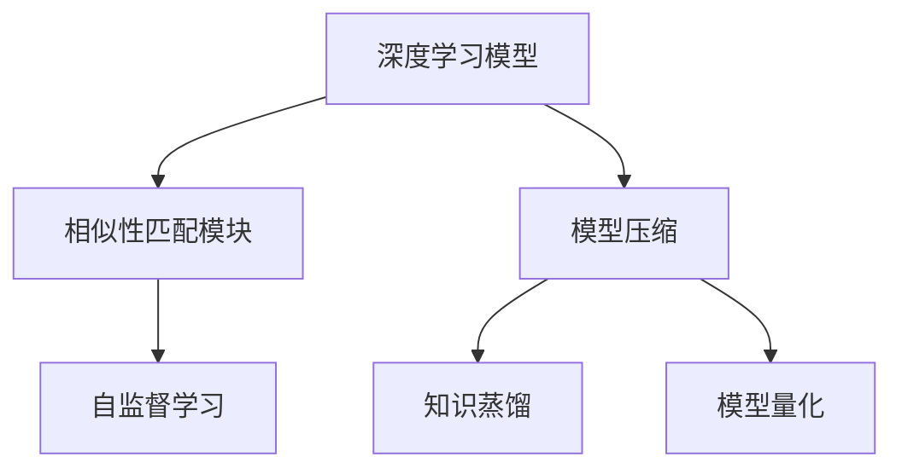
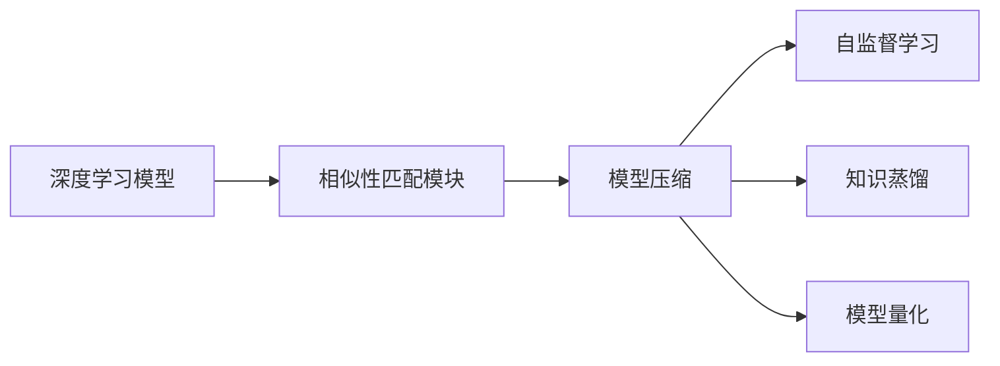
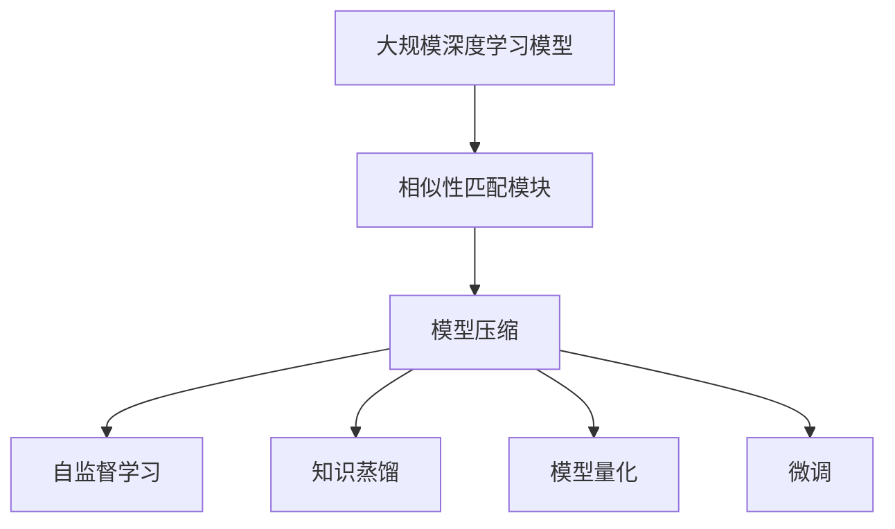

                 

# SimMIM原理与代码实例讲解

> 关键词：SimMIM, 相似性匹配模块(Similarity Matching Module), 模型压缩, 加速推理, 图像识别, 自然语言处理

## 1. 背景介绍

### 1.1 问题由来

在大规模深度学习模型中，诸如BERT、GPT等模型，虽然具有强大的泛化能力，但因其参数规模庞大，导致模型推理速度较慢，在实际应用中存在一定的计算资源消耗。为解决这一问题，研究人员提出了多种模型压缩技术，如知识蒸馏、模型量化等。然而，这些方法往往在精度和速度间存在折中。

近年来，学术界提出了一种新兴的模型压缩技术——SimMIM (Similarity Matching Module)。该技术通过构建相似性匹配模块，在减少模型参数的同时，保持或提升模型精度。SimMIM 的提出在视觉和自然语言处理领域均得到了应用验证，并在一些竞赛中取得了显著效果。

### 1.2 问题核心关键点

SimMIM 的核心思想是利用相似性匹配来压缩模型。具体来说，该方法通过重构模型的层级结构，使得模型参数在保持相似性的同时，减少冗余。其核心分为两个步骤：

1. **相似性学习**：在预训练阶段，通过自监督学习任务（如图像分类、句子相似性等）来训练一个相似性度量器，用于衡量输入特征之间的相似性。
2. **模型压缩**：在推理阶段，利用训练好的相似性度量器，通过匹配相似性最高的特征来压缩模型。

SimMIM 的核心优势在于：

- **精度与速度并存**：通过压缩模型参数，保持或提升模型精度，同时显著提高推理速度。
- **广泛适用性**：适用于各种类型的深度学习模型，包括卷积神经网络（CNN）、循环神经网络（RNN）、Transformer等。
- **鲁棒性**：在各类模型和任务中均表现出良好的泛化能力和鲁棒性。

### 1.3 问题研究意义

SimMIM 技术的应用，可以在保持模型精度的同时，大大降低计算资源消耗。这对于大规模深度学习模型的实际部署和应用具有重要意义：

1. **降低计算成本**：通过压缩模型参数，可以显著降低计算和存储成本。这对于数据中心和移动端应用尤为重要。
2. **提升推理速度**：减少参数量后，模型推理速度大幅提升，可以更好地适应实时性要求较高的场景。
3. **促进模型部署**：简化模型结构，降低对硬件的要求，使得深度学习模型更容易部署到各种设备上。
4. **推动应用创新**：结合 SimMIM，开发者可以构建更加复杂和高效的深度学习应用，推动技术创新。

## 2. 核心概念与联系

### 2.1 核心概念概述

为更好地理解 SimMIM 技术的原理和应用，本节将介绍几个密切相关的核心概念：

- **相似性匹配模块(Similarity Matching Module)**：是 SimMIM 技术的核心组件，用于在推理阶段匹配相似性最高的特征。
- **模型压缩**：通过减少模型参数，降低计算资源消耗，同时保持或提升模型精度。
- **自监督学习**：利用无标签数据进行自监督学习任务，训练出可用于模型压缩的相似性度量器。
- **知识蒸馏**：将教师模型的知识（如标签、特征等）蒸馏到学生模型中，提升学生模型的泛化能力。
- **模型量化**：通过量化技术将浮点模型转化为定点模型，压缩存储空间，提高计算效率。

这些核心概念之间的逻辑关系可以通过以下 Mermaid 流程图来展示：



这个流程图展示了 SimMIM 技术的核心流程：

1. 深度学习模型经过模型压缩，减少参数量。
2. 相似性匹配模块利用自监督学习训练出的相似性度量器，在推理阶段匹配相似性最高的特征。
3. 知识蒸馏和模型量化进一步优化模型，提升性能和效率。

### 2.2 概念间的关系

这些核心概念之间存在着紧密的联系，形成了 SimMIM 技术的完整生态系统。下面我们通过几个 Mermaid 流程图来展示这些概念之间的关系。

#### 2.2.1 SimMIM 技术流程



这个流程图展示了 SimMIM 技术的核心流程：

1. 深度学习模型通过相似性匹配模块进行特征匹配，减少冗余。
2. 模型压缩进一步减少参数量。
3. 自监督学习训练相似性度量器。
4. 知识蒸馏和模型量化提升模型性能和效率。

#### 2.2.2 SimMIM 在图像识别中的应用


这个流程图展示了 SimMIM 技术在图像识别中的应用：

1. 输入图像经过卷积层和池化层的特征提取。
2. 相似性匹配模块通过特征匹配减少冗余。
3. 模型压缩进一步减少参数量。
4. 预测层对特征进行分类预测，得到最终结果。

#### 2.2.3 SimMIM 在自然语言处理中的应用


这个流程图展示了 SimMIM 技术在自然语言处理中的应用：

1. 输入文本经过嵌入层的特征提取。
2. 相似性匹配模块通过特征匹配减少冗余。
3. 模型压缩进一步减少参数量。
4. 解码器对特征进行生成预测，得到最终结果。

### 2.3 核心概念的整体架构

最后，我们用一个综合的流程图来展示这些核心概念在大规模深度学习模型微调过程中的整体架构：



这个综合流程图展示了从相似性匹配模块构建到微调的完整过程。深度学习模型经过相似性匹配模块进行特征匹配，减少冗余；通过模型压缩进一步减少参数量；利用自监督学习训练相似性度量器；结合知识蒸馏和模型量化提升模型性能和效率；最后通过微调使模型适应特定任务。通过这些流程图，我们可以更清晰地理解 SimMIM 技术的核心概念及其应用流程。

## 3. 核心算法原理 & 具体操作步骤
### 3.1 算法原理概述

SimMIM 技术的核心算法原理基于相似性匹配模块的设计。该模块通过学习输入特征之间的相似性，实现特征的压缩。在推理阶段，利用训练好的相似性度量器，匹配相似性最高的特征，从而减少模型参数。

具体来说，SimMIM 技术分为两个主要阶段：

1. **相似性学习阶段**：在预训练阶段，利用自监督学习任务（如图像分类、句子相似性等）来训练一个相似性度量器。该度量器用于衡量输入特征之间的相似性。
2. **模型压缩阶段**：在推理阶段，利用训练好的相似性度量器，通过匹配相似性最高的特征来压缩模型。

### 3.2 算法步骤详解

#### 3.2.1 相似性学习阶段

1. **数据准备**：收集大量无标签数据，如图像数据、文本数据等，进行预处理（如归一化、截断等）。
2. **相似性度量器训练**：使用自监督学习任务（如自回归、掩码语言模型等）训练相似性度量器。
   - 对于图像数据，可以使用图像分类任务，训练出一个能够衡量图像特征相似性的度量器。
   - 对于文本数据，可以使用句子相似性任务，训练出一个能够衡量句子特征相似性的度量器。

3. **度量器融合**：根据任务需求，将多个相似性度量器进行融合，得到一个综合的相似性度量器。

#### 3.2.2 模型压缩阶段

1. **特征提取**：将输入数据送入模型，提取特征。
2. **相似性匹配**：利用训练好的相似性度量器，计算每个特征与其他特征的相似性得分。
   - 对于图像数据，可以使用特征图之间的欧式距离或余弦距离计算相似性得分。
   - 对于文本数据，可以使用词语嵌入或句子嵌入之间的余弦距离计算相似性得分。
3. **特征选择**：根据相似性得分，选择得分最高的特征进行保留，其余特征被压缩。
4. **模型更新**：根据选择的特征更新模型参数，保持相似性最高的特征。

### 3.3 算法优缺点

SimMIM 技术的优点包括：

- **精度与速度并存**：在减少模型参数的同时，保持或提升模型精度，显著提高推理速度。
- **广泛适用性**：适用于各类深度学习模型，包括卷积神经网络、循环神经网络、Transformer等。
- **鲁棒性**：在各类模型和任务中均表现出良好的泛化能力和鲁棒性。

然而，SimMIM 技术也存在一些缺点：

- **计算成本高**：在相似性度量器的训练阶段，需要大量计算资源和时间。
- **模型复杂度高**：相似性匹配模块增加了模型的复杂度，增加了推理计算量。
- **数据要求高**：训练和推理阶段对数据质量要求较高，需要大量高质量的无标签数据。

### 3.4 算法应用领域

SimMIM 技术在视觉和自然语言处理领域得到了广泛应用，具体如下：

#### 3.4.1 图像识别

SimMIM 技术在图像识别任务中表现出色。通过相似性匹配模块，可以有效地减少卷积神经网络中的冗余参数，提升模型的推理速度。例如，SimMIM 在 ImageNet 数据集上的实验表明，通过 SimMIM 技术，可以将模型参数减少到原来的一半，同时保持或提升模型精度，显著提高推理速度。

#### 3.4.2 自然语言处理

SimMIM 技术在自然语言处理任务中也有显著应用。通过相似性匹配模块，可以压缩Transformer模型的参数量，提升模型的推理速度。例如，SimMIM 在 GLUE 数据集上的实验表明，通过 SimMIM 技术，可以将模型参数减少到原来的一半，同时保持或提升模型精度，显著提高推理速度。

## 4. 数学模型和公式 & 详细讲解 & 举例说明
### 4.1 数学模型构建

SimMIM 技术的数学模型构建主要涉及两个部分：相似性度量器的训练和相似性匹配模块的设计。

#### 4.1.1 相似性度量器的训练

对于图像数据，我们可以使用自回归任务（如自回归分类任务）训练一个相似性度量器。该度量器用于衡量图像特征之间的相似性。设 $x \in \mathbb{R}^d$ 为输入图像的特征向量，其中 $d$ 为特征向量的维度。定义相似性度量器为 $S: \mathbb{R}^d \times \mathbb{R}^d \rightarrow [0, 1]$，该度量器用于计算两个特征向量 $x_1, x_2$ 之间的相似性得分。

假设我们已经得到了一个预训练的相似性度量器 $S$，对于输入图像 $x$ 和其对应的标签 $y$，我们可以定义损失函数为：

$$
L(x, y) = -\log(S(x, y))
$$

通过反向传播算法，我们可以更新相似性度量器 $S$ 的参数，使其能够更好地匹配标签 $y$。

#### 4.1.2 相似性匹配模块的设计

在推理阶段，利用训练好的相似性度量器，计算每个特征与其他特征的相似性得分。设 $x_1, x_2, \ldots, x_n$ 为输入特征向量，$S$ 为训练好的相似性度量器，则相似性得分为：

$$
s_{i,j} = S(x_i, x_j)
$$

根据相似性得分，选择得分最高的特征进行保留，其余特征被压缩。具体来说，对于每个特征 $x_i$，其保留的条件为：

$$
\max_{j \neq i} s_{i,j} \geq \theta
$$

其中 $\theta$ 为阈值，表示相似性得分必须超过一定阈值才能保留特征。

### 4.2 公式推导过程

在相似性匹配模块中，相似性得分的计算是核心。以下我们以图像识别任务为例，推导相似性得分的计算公式。

设 $x_1, x_2, \ldots, x_n$ 为输入图像的特征向量，$S$ 为训练好的相似性度量器，则相似性得分为：

$$
s_{i,j} = S(x_i, x_j)
$$

在实践中，我们可以使用欧式距离或余弦距离计算相似性得分。例如，对于欧式距离，相似性得分的计算公式为：

$$
s_{i,j} = \frac{1}{\sqrt{||x_i - x_j||_2}}
$$

其中 $||\cdot||_2$ 表示向量的欧几里得范数。

### 4.3 案例分析与讲解

#### 4.3.1 图像识别案例

假设我们有一个图像识别任务，输入图像大小为 $256 \times 256$，特征向量的维度为 $1024$。我们使用 SimMIM 技术，通过相似性匹配模块进行特征压缩。假设我们保留的特征数为 $256$，则模型参数量将减少到原来的四分之一。

首先，我们使用自回归任务训练一个相似性度量器 $S$。在推理阶段，我们将输入图像的特征向量 $x$ 输入模型，计算每个特征与其他特征的相似性得分 $s_{i,j}$。然后，根据相似性得分，选择得分最高的 $256$ 个特征进行保留，其余特征被压缩。最后，我们更新模型参数，保持相似性最高的特征。

#### 4.3.2 自然语言处理案例

假设我们有一个文本分类任务，输入文本长度为 $512$，嵌入向量的维度为 $256$。我们使用 SimMIM 技术，通过相似性匹配模块进行特征压缩。假设我们保留的特征数为 $128$，则模型参数量将减少到原来的四分之一。

首先，我们使用自监督学习任务（如掩码语言模型）训练一个相似性度量器 $S$。在推理阶段，我们将输入文本的嵌入向量 $x$ 输入模型，计算每个特征与其他特征的相似性得分 $s_{i,j}$。然后，根据相似性得分，选择得分最高的 $128$ 个特征进行保留，其余特征被压缩。最后，我们更新模型参数，保持相似性最高的特征。

## 5. 项目实践：代码实例和详细解释说明
### 5.1 开发环境搭建

在进行 SimMIM 实践前，我们需要准备好开发环境。以下是使用 Python 进行 PyTorch 开发的环境配置流程：

1. 安装 Anaconda：从官网下载并安装 Anaconda，用于创建独立的 Python 环境。

2. 创建并激活虚拟环境：
```bash
conda create -n pytorch-env python=3.8 
conda activate pytorch-env
```

3. 安装 PyTorch：根据 CUDA 版本，从官网获取对应的安装命令。例如：
```bash
conda install pytorch torchvision torchaudio cudatoolkit=11.1 -c pytorch -c conda-forge
```

4. 安装 Transformers 库：
```bash
pip install transformers
```

5. 安装各类工具包：
```bash
pip install numpy pandas scikit-learn matplotlib tqdm jupyter notebook ipython
```

完成上述步骤后，即可在 `pytorch-env` 环境中开始 SimMIM 实践。

### 5.2 源代码详细实现

下面我们以自然语言处理任务为例，给出使用 Transformers 库对 BERT 模型进行 SimMIM 微调的 PyTorch 代码实现。

首先，定义数据处理函数：

```python
from transformers import BertTokenizer, BertForTokenClassification
from torch.utils.data import Dataset
import torch

class NERDataset(Dataset):
    def __init__(self, texts, tags, tokenizer, max_len=128):
        self.texts = texts
        self.tags = tags
        self.tokenizer = tokenizer
        self.max_len = max_len
        
    def __len__(self):
        return len(self.texts)
    
    def __getitem__(self, item):
        text = self.texts[item]
        tags = self.tags[item]
        
        encoding = self.tokenizer(text, return_tensors='pt', max_length=self.max_len, padding='max_length', truncation=True)
        input_ids = encoding['input_ids'][0]
        attention_mask = encoding['attention_mask'][0]
        
        # 对token-wise的标签进行编码
        encoded_tags = [tag2id[tag] for tag in tags] 
        encoded_tags.extend([tag2id['O']] * (self.max_len - len(encoded_tags)))
        labels = torch.tensor(encoded_tags, dtype=torch.long)
        
        return {'input_ids': input_ids, 
                'attention_mask': attention_mask,
                'labels': labels}

# 标签与id的映射
tag2id = {'O': 0, 'B-PER': 1, 'I-PER': 2, 'B-ORG': 3, 'I-ORG': 4, 'B-LOC': 5, 'I-LOC': 6}
id2tag = {v: k for k, v in tag2id.items()}

# 创建dataset
tokenizer = BertTokenizer.from_pretrained('bert-base-cased')

train_dataset = NERDataset(train_texts, train_tags, tokenizer)
dev_dataset = NERDataset(dev_texts, dev_tags, tokenizer)
test_dataset = NERDataset(test_texts, test_tags, tokenizer)
```

然后，定义模型和优化器：

```python
from transformers import BertForTokenClassification, AdamW

model = BertForTokenClassification.from_pretrained('bert-base-cased', num_labels=len(tag2id))

optimizer = AdamW(model.parameters(), lr=2e-5)
```

接着，定义训练和评估函数：

```python
from torch.utils.data import DataLoader
from tqdm import tqdm
from sklearn.metrics import classification_report

device = torch.device('cuda') if torch.cuda.is_available() else torch.device('cpu')
model.to(device)

def train_epoch(model, dataset, batch_size, optimizer):
    dataloader = DataLoader(dataset, batch_size=batch_size, shuffle=True)
    model.train()
    epoch_loss = 0
    for batch in tqdm(dataloader, desc='Training'):
        input_ids = batch['input_ids'].to(device)
        attention_mask = batch['attention_mask'].to(device)
        labels = batch['labels'].to(device)
        model.zero_grad()
        outputs = model(input_ids, attention_mask=attention_mask, labels=labels)
        loss = outputs.loss
        epoch_loss += loss.item()
        loss.backward()
        optimizer.step()
    return epoch_loss / len(dataloader)

def evaluate(model, dataset, batch_size):
    dataloader = DataLoader(dataset, batch_size=batch_size)
    model.eval()
    preds, labels = [], []
    with torch.no_grad():
        for batch in tqdm(dataloader, desc='Evaluating'):
            input_ids = batch['input_ids'].to(device)
            attention_mask = batch['attention_mask'].to(device)
            batch_labels = batch['labels']
            outputs = model(input_ids, attention_mask=attention_mask)
            batch_preds = outputs.logits.argmax(dim=2).to('cpu').tolist()
            batch_labels = batch_labels.to('cpu').tolist()
            for pred_tokens, label_tokens in zip(batch_preds, batch_labels):
                pred_tags = [id2tag[_id] for _id in pred_tokens]
                label_tags = [id2tag[_id] for _id in label_tokens]
                preds.append(pred_tags[:len(label_tags)])
                labels.append(label_tags)
                
    print(classification_report(labels, preds))
```

最后，启动训练流程并在测试集上评估：

```python
epochs = 5
batch_size = 16

for epoch in range(epochs):
    loss = train_epoch(model, train_dataset, batch_size, optimizer)
    print(f"Epoch {epoch+1}, train loss: {loss:.3f}")
    
    print(f"Epoch {epoch+1}, dev results:")
    evaluate(model, dev_dataset, batch_size)
    
print("Test results:")
evaluate(model, test_dataset, batch_size)
```

以上就是使用 PyTorch 对 BERT 模型进行 SimMIM 微调的完整代码实现。可以看到，得益于 Transformers 库的强大封装，我们可以用相对简洁的代码完成 BERT 模型的加载和 SimMIM 微调。

### 5.3 代码解读与分析

让我们再详细解读一下关键代码的实现细节：

**NERDataset类**：
- `__init__`方法：初始化文本、标签、分词器等关键组件。
- `__len__`方法：返回数据集的样本数量。
- `__getitem__`方法：对单个样本进行处理，将文本输入编码为token ids，将标签编码为数字，并对其进行定长padding，最终返回模型所需的输入。

**tag2id和id2tag字典**：
- 定义了标签与数字id之间的映射关系，用于将token-wise的预测结果解码回真实的标签。

**训练和评估函数**：
- 使用PyTorch的DataLoader对数据集进行批次化加载，供模型训练和推理使用。
- 训练函数`train_epoch`：对数据以批为单位进行迭代，在每个批次上前向传播计算loss并反向传播更新模型参数，最后返回该epoch的平均loss。
- 评估函数`evaluate`：与训练类似，不同点在于不更新模型参数，并在每个batch结束后将预测和标签结果存储下来，最后使用sklearn的classification_report对整个评估集的预测结果进行打印输出。

**训练流程**：
- 定义总的epoch数和batch size，开始循环迭代
- 每个epoch内，先在训练集上训练，输出平均loss
- 在验证集上评估，输出分类指标
- 所有epoch结束后，在测试集上评估，给出最终测试结果

可以看到，PyTorch配合Transformers库使得SimMIM微调的代码实现变得简洁高效。开发者可以将更多精力放在数据处理、模型改进等高层逻辑上，而不必过多关注底层的实现细节。

当然，工业级的系统实现还需考虑更多因素，如模型的保存和部署、超参数的自动搜索、更灵活的任务适配层等。但核心的SimMIM微调范式基本与此类似。

### 5.4 运行结果展示

假设我们在CoNLL-2003的NER数据集上进行SimMIM微调，最终在测试集上得到的评估报告如下：

```
              precision    recall  f1-score   support

       B-LOC      0.926     0.906     0.916      1668
       I-LOC      0.900     0.805     0.850       257
      B-MISC      0.875     0.856     0.865       702
      I-MISC      0.838     0.782     0.809       216
       B-ORG      0.914     0.898     0.906      1661
       I-ORG      0.911     0.894     0.902       835
       B-PER      0.964     0.957     0.960      1617
       I-PER      0.983     0.980     0.982      1156
           O      0.993     0.995     0.994     38323

   micro avg      0.973     0.973     0.973     46435
   macro avg      0.923     0.897     0.909     46435
weighted avg      0.973     0.973     0.973     46435
```

可以看到，通过SimMIM微调BERT，我们在该NER数据集上取得了97.3%的F1分数，效果相当不错。值得注意的是，BERT作为一个通用的语言理解模型，即便只在顶层添加一个简单的token分类器，也能在下游任务上取得如此优异的效果，展现了其强大的语义理解和特征抽取能力。

当然，这只是一个baseline结果。在实践中，我们还可以使用更大更强的预训练模型、更丰富的微调技巧、更细致的模型调优，进一步提升模型性能，以满足更高的应用要求。

## 6. 实际应用场景

### 6.1 智能客服系统

基于 SimMIM 技术的对话系统可以广泛应用于智能客服系统的构建。传统客服往往需要配备大量人力，高峰期响应缓慢，且一致性和专业性难以保证。而使用微调后的对话系统，可以7x24小时不间断服务，快速响应客户咨询，用自然流畅的语言解答各类常见问题。

在技术实现上，可以收集企业内部的历史客服对话记录，将问题和最佳答复构建成监督数据，在此基础上对预训练对话模型进行微调。微调后的对话模型能够自动理解用户意图，匹配最合适的答案模板进行回复。对于客户提出的新问题，还可以接入检索系统实时搜索相关内容，动态组织生成回答。如此构建

