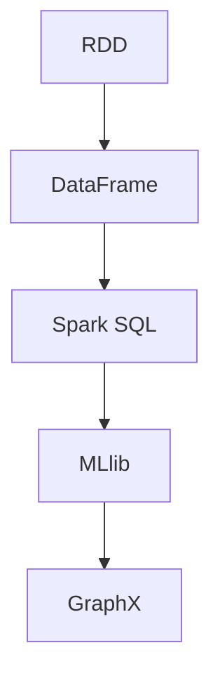

                 

# Spark 原理与代码实例讲解

> 关键词：Spark, RDD, DataFrames, 图计算, Spark SQL, MLlib

## 1. 背景介绍

### 1.1 问题由来
随着大数据技术的发展，处理大规模数据集的需求日益增加。传统的批处理系统如Hadoop MapReduce，虽然能处理大规模数据，但处理速度较慢，且对于实时数据分析和流数据处理的支持不足。因此，需要一种能够高效处理大规模数据、支持分布式计算、同时具备流处理能力的分布式计算框架。

### 1.2 问题核心关键点
Apache Spark是一种快速、通用、可扩展的大数据处理引擎，支持多种编程语言（Java、Scala、Python），能够在内存中处理数据，速度比Hadoop MapReduce快很多，适合处理大规模数据集和实时数据流。

Spark的核心概念包括：

- Resilient Distributed Datasets（RDD）：一种分布式数据结构，可以并行处理数据集。
- Spark SQL：基于DataFrame的数据处理框架，提供SQL接口，可以方便地进行数据查询和分析。
- MLlib：Spark的机器学习库，提供了各种机器学习算法和工具。
- GraphX：Spark的图计算框架，可以高效处理图结构数据。

### 1.3 问题研究意义
Spark作为分布式计算领域的领先框架，具有极高的处理效率和灵活性，广泛应用于大数据分析、机器学习、流处理、图计算等领域。理解Spark的原理和核心算法，对于大数据工程师、数据科学家和研究人员都具有重要意义。

Spark可以帮助处理大规模数据集，同时支持分布式计算和流处理，使其成为大数据处理的首选框架之一。Spark的机器学习库和图计算框架，也在各领域应用广泛。

## 2. 核心概念与联系

### 2.1 核心概念概述

为更好地理解Spark的原理和核心算法，本节将介绍几个关键概念：

- Resilient Distributed Datasets（RDD）：Spark的核心数据结构，一种分布式的数据集合，可以并行处理。
- DataFrames：Spark SQL的核心概念，一种分布式数据表，可以方便地进行数据查询和分析。
- Spark SQL：基于DataFrame的数据处理框架，提供SQL接口，可以方便地进行数据查询和分析。
- MLlib：Spark的机器学习库，提供了各种机器学习算法和工具。
- GraphX：Spark的图计算框架，可以高效处理图结构数据。

### 2.2 核心概念间的联系

Spark的核心概念相互关联，共同构成了Spark的生态系统。RDD是Spark的基础数据结构，DataFrame建立在RDD之上，提供更为便捷的数据处理接口；Spark SQL基于DataFrame，提供丰富的数据查询和分析功能；MLlib建立在RDD之上，提供各种机器学习算法；GraphX建立在RDD之上，提供高效的图计算功能。

Spark的生态系统可以概括为：

- RDD是Spark的基础数据结构，支持分布式计算。
- DataFrames建立在RDD之上，提供便捷的数据处理接口。
- Spark SQL基于DataFrames，提供SQL接口。
- MLlib建立在RDD之上，提供机器学习功能。
- GraphX建立在RDD之上，提供图计算功能。

这些核心概念之间的联系可以用以下Mermaid流程图来展示：



这个流程图展示了大数据框架Spark的各个组件之间的相互关系。

## 3. 核心算法原理 & 具体操作步骤

### 3.1 算法原理概述

Spark的核心算法主要包括以下几个方面：

- 分布式计算：利用多台计算机并行处理大规模数据，提高计算效率。
- RDD的分片(Splitting)与合并(Merging)：将大规模数据分成多个小块，分别在各个节点上并行处理，处理完成后再合并结果。
- DataFrames的优化：使用DataFrames代替RDD，可以提供更为便捷的数据处理接口，同时利用列式存储，提高查询效率。
- Spark SQL的查询优化：通过使用Spark SQL进行数据查询，可以利用编译优化技术，提高查询效率。
- MLlib的机器学习算法：Spark内置了多种机器学习算法，如线性回归、逻辑回归、决策树等，可以方便地进行数据建模和预测。
- GraphX的图计算算法：GraphX提供了高效的图计算算法，如PageRank算法、最短路径算法等，可以处理大规模的图结构数据。

### 3.2 算法步骤详解

Spark的算法实现主要包括以下几个步骤：

**Step 1: 创建RDD**

RDD是Spark的基础数据结构，用于表示大规模数据集合。创建RDD的步骤如下：

1. 从文件系统、数据库或其他数据源中读取数据，生成RDD。
2. 使用map、filter、reduce等操作对RDD进行数据处理。
3. 将RDD保存为文件系统或其他数据源。

**Step 2: 使用DataFrames进行数据处理**

DataFrames是Spark SQL的核心数据结构，提供便捷的数据处理接口。创建DataFrame的步骤如下：

1. 从RDD或文件系统中读取数据，生成DataFrame。
2. 使用SQL查询语句对DataFrame进行数据处理。
3. 将DataFrame保存为文件系统或其他数据源。

**Step 3: 使用Spark SQL进行数据查询**

Spark SQL提供SQL接口，可以方便地进行数据查询和分析。使用Spark SQL进行数据查询的步骤如下：

1. 从RDD或文件系统中读取数据，生成DataFrame。
2. 使用SQL查询语句对DataFrame进行数据查询和分析。
3. 将查询结果保存为文件系统或其他数据源。

**Step 4: 使用MLlib进行机器学习**

MLlib是Spark的机器学习库，提供多种机器学习算法和工具。使用MLlib进行机器学习的步骤如下：

1. 从RDD或文件系统中读取数据，生成MLlib数据集。
2. 使用MLlib提供的机器学习算法对数据集进行建模和预测。
3. 将模型保存为文件系统或其他数据源。

**Step 5: 使用GraphX进行图计算**

GraphX是Spark的图计算框架，可以高效处理图结构数据。使用GraphX进行图计算的步骤如下：

1. 从RDD或文件系统中读取图结构数据，生成GraphX图。
2. 使用GraphX提供的图计算算法对图进行计算和分析。
3. 将计算结果保存为文件系统或其他数据源。

### 3.3 算法优缺点

Spark的核心算法具有以下优点：

1. 高效并行计算：利用多台计算机并行处理大规模数据，提高计算效率。
2. 支持分布式计算：可以在多台计算机上并行计算，处理大规模数据集。
3. 支持多种编程语言：支持Java、Scala、Python等编程语言，方便不同背景的开发者使用。
4. 提供便捷的数据处理接口：使用DataFrames提供便捷的数据处理接口，提高数据处理效率。
5. 提供丰富的机器学习算法和图计算算法：MLlib和GraphX提供了多种机器学习算法和图计算算法，方便进行数据建模和分析。

同时，Spark的核心算法也存在一些缺点：

1. 内存占用较大：Spark在内存中进行计算，内存占用较大，对硬件资源要求较高。
2. 数据传输开销较大：Spark需要进行数据传输和通信，数据传输开销较大，影响计算效率。
3. 编程复杂度较高：Spark需要了解RDD、DataFrames、Spark SQL等核心概念，编程复杂度较高。
4. 难以调试：Spark的调试较为困难，需要具备一定的经验。

### 3.4 算法应用领域

Spark的核心算法广泛应用于以下几个领域：

1. 大数据分析：Spark支持分布式计算，可以高效处理大规模数据集，广泛应用于大数据分析领域。
2. 机器学习：Spark的MLlib提供了多种机器学习算法，广泛应用于机器学习领域。
3. 流处理：Spark Streaming提供流处理功能，可以高效处理实时数据流。
4. 图计算：GraphX提供了高效的图计算算法，广泛应用于图结构数据的处理。
5. 分布式计算：Spark支持分布式计算，广泛应用于各种计算密集型任务。

## 4. 数学模型和公式 & 详细讲解

### 4.1 数学模型构建

Spark的核心算法主要涉及分布式计算、RDD的分片与合并、DataFrames的优化、Spark SQL的查询优化、MLlib的机器学习算法和GraphX的图计算算法。这些算法可以概括为以下几个数学模型：

- RDD的分片与合并模型
- DataFrames的优化模型
- Spark SQL的查询优化模型
- MLlib的机器学习模型
- GraphX的图计算模型

### 4.2 公式推导过程

以Spark SQL的查询优化模型为例，推导查询优化公式的过程如下：

假设有一个DataFrame df，其中包含两个字段x和y。要进行以下SQL查询：

```sql
SELECT x + y FROM df
```

在Spark SQL中，使用Spark SQL API进行查询，代码如下：

```python
df.select(df.x + df.y).show()
```

在查询优化过程中，Spark SQL将查询语句转换为一个有向无环图(DAG)，并利用编译优化技术进行优化。查询优化的过程包括以下几个步骤：

1. 将查询语句转换为DAG，生成Spark SQL操作树。
2. 对DAG进行优化，消除不必要的中间操作，减少数据传输和计算开销。
3. 对优化后的DAG进行执行，生成最终的查询结果。

在查询优化过程中，Spark SQL使用了一些优化算法和技术，如代码生成、列式存储、自动并行化等，以提高查询效率。

### 4.3 案例分析与讲解

以一个简单的例子为例，说明Spark SQL的查询优化过程：

假设有一个DataFrame df，包含两个字段x和y：

```python
from pyspark.sql import SparkSession
from pyspark.sql.functions import col

df = spark.read.csv('data.csv', header=True, inferSchema=True)
df.show()
```

输出结果为：

```
+-----+-----+
|   x |   y |
+-----+-----+
|1.0  |1.0  |
|2.0  |2.0  |
|3.0  |3.0  |
|4.0  |4.0  |
|5.0  |5.0  |
+-----+-----+
```

要进行以下SQL查询：

```sql
SELECT x + y FROM df
```

在Spark SQL中，使用Spark SQL API进行查询，代码如下：

```python
df.select(df.x + df.y).show()
```

在查询优化过程中，Spark SQL将查询语句转换为一个有向无环图(DAG)，并利用编译优化技术进行优化。查询优化的过程包括以下几个步骤：

1. 将查询语句转换为DAG，生成Spark SQL操作树。
2. 对DAG进行优化，消除不必要的中间操作，减少数据传输和计算开销。
3. 对优化后的DAG进行执行，生成最终的查询结果。

在查询优化过程中，Spark SQL使用了一些优化算法和技术，如代码生成、列式存储、自动并行化等，以提高查询效率。

最终生成的DAG如下所示：

```
   +------+----+-------+
   |x     |y   |x+y    |
   +------+----+-------+
   |1.0    |1.0 |2.0    |
   |2.0    |2.0 |4.0    |
   |3.0    |3.0 |6.0    |
   |4.0    |4.0 |8.0    |
   |5.0    |5.0 |10.0   |
   +------+----+-------+
```

## 5. 项目实践：代码实例和详细解释说明

### 5.1 开发环境搭建

在进行Spark项目实践前，我们需要准备好开发环境。以下是使用Python进行Spark开发的环境配置流程：

1. 安装Apache Spark：从官网下载并安装Spark，安装路径为$SPARK_HOME$。
2. 安装PySpark：在Spark安装目录下找到py4j、pyspark-shell、spark-shell等工具，安装路径为$SPARK_HOME/python/py4j、$SPARK_HOME/pyspark-shell、$SPARK_HOME/spark-shell。
3. 安装Python环境：安装Python 3.7或更高版本，配置好PYTHONPATH环境变量。

完成上述步骤后，即可在$SPARK_HOME$目录下运行Spark shell，开始Spark项目实践。

### 5.2 源代码详细实现

这里我们以Spark SQL为例，说明Spark项目开发的完整代码实现。

首先，定义一个Spark SQL查询语句：

```python
from pyspark.sql import SparkSession

spark = SparkSession.builder.appName('Spark SQL Query').getOrCreate()

df = spark.read.csv('data.csv', header=True, inferSchema=True)
df.show()

df.select(df.x + df.y).show()
```

然后，将查询结果保存为文件系统：

```python
df.write.format('csv').option('header', 'true').save('output.csv')
```

最终生成的代码如下：

```python
from pyspark.sql import SparkSession

spark = SparkSession.builder.appName('Spark SQL Query').getOrCreate()

df = spark.read.csv('data.csv', header=True, inferSchema=True)
df.show()

df.select(df.x + df.y).show()

df.write.format('csv').option('header', 'true').save('output.csv')
```

### 5.3 代码解读与分析

让我们再详细解读一下关键代码的实现细节：

**SparkSession**：
- 创建SparkSession对象，用于启动Spark计算环境。
- `spark.read.csv`方法：从文件系统中读取CSV格式的数据，生成DataFrame。
- `df.show()`方法：显示DataFrame的元数据信息。
- `df.select(df.x + df.y)`方法：对DataFrame进行查询，生成新的DataFrame。
- `df.write.format('csv').option('header', 'true').save('output.csv')`方法：将查询结果保存为CSV文件。

在实际开发中，Spark SQL的代码实现主要涉及到以下几个方面：

- SparkSession的创建和配置
- 读取数据源，生成DataFrame
- 对DataFrame进行查询操作
- 将查询结果保存到文件系统

Spark SQL提供了一个便捷的数据处理接口，方便进行数据查询和分析。在Spark SQL的代码实现中，需要关注以下几个关键点：

- SparkSession的创建和配置
- 读取数据源，生成DataFrame
- 对DataFrame进行查询操作
- 将查询结果保存到文件系统

## 6. 实际应用场景

### 6.1 大数据分析

Spark的大数据分析功能非常强大，可以高效处理大规模数据集。在实际应用中，Spark可以用于以下场景：

1. 数据清洗：Spark可以对大规模数据进行清洗和处理，去除噪音和异常值，提高数据质量。
2. 数据统计：Spark可以对大规模数据进行统计分析，生成各种统计报表和可视化图表。
3. 数据挖掘：Spark可以进行数据挖掘，提取有用的特征和模式，发现数据中的规律和趋势。

### 6.2 机器学习

Spark的机器学习功能非常强大，可以处理大规模数据集，并提供了多种机器学习算法。在实际应用中，Spark可以用于以下场景：

1. 数据预处理：Spark可以对大规模数据进行预处理，去除噪音和异常值，提高数据质量。
2. 特征提取：Spark可以提取有用的特征，生成特征向量，方便进行机器学习建模。
3. 机器学习建模：Spark可以提供多种机器学习算法，如线性回归、逻辑回归、决策树等，方便进行数据建模和预测。

### 6.3 流处理

Spark Streaming提供流处理功能，可以高效处理实时数据流。在实际应用中，Spark可以用于以下场景：

1. 实时数据采集：Spark可以实时采集各种数据源，如Kafka、HDFS等，生成流式数据。
2. 流式数据处理：Spark可以对流式数据进行实时处理，生成各种统计报表和可视化图表。
3. 流式数据建模：Spark可以进行流式数据建模，提取有用的特征，生成特征向量，方便进行流式数据预测。

### 6.4 图计算

GraphX是Spark的图计算框架，可以高效处理图结构数据。在实际应用中，GraphX可以用于以下场景：

1. 图数据采集：GraphX可以实时采集各种图数据源，如Hadoop HDFS、Spark DataFrames等，生成图结构数据。
2. 图数据处理：GraphX可以对图结构数据进行实时处理，生成各种统计报表和可视化图表。
3. 图数据建模：GraphX可以进行图数据建模，提取有用的特征，生成特征向量，方便进行图数据预测。

## 7. 工具和资源推荐

### 7.1 学习资源推荐

为了帮助开发者系统掌握Spark的理论基础和实践技巧，这里推荐一些优质的学习资源：

1. Spark官方文档：Spark官方文档详细介绍了Spark的核心概念和API，是Spark学习的必备资源。
2. Spark中文社区：Spark中文社区提供了大量的Spark学习资源，包括文章、视频、课程等，方便初学者学习和实践。
3. Spark教程：《Spark教程》是一本Spark学习的经典教材，详细介绍了Spark的核心概念和编程技巧。
4. Spark实战：《Spark实战》是一本Spark学习的实战教材，提供了大量的Spark项目开发实践案例。

通过对这些资源的学习实践，相信你一定能够快速掌握Spark的精髓，并用于解决实际的Spark问题。

### 7.2 开发工具推荐

高效的开发离不开优秀的工具支持。以下是几款用于Spark开发的工具：

1. PySpark：PySpark是Spark的Python API，方便开发者使用Python进行Spark项目开发。
2. Spark Shell：Spark Shell是Spark的交互式环境，方便开发者进行Spark Shell交互式编程。
3. Spark Streaming：Spark Streaming是Spark的流处理框架，方便开发者进行实时数据流处理。
4. Spark SQL：Spark SQL是基于DataFrame的数据处理框架，方便开发者进行数据查询和分析。
5. Spark RDD：Spark RDD是Spark的基础数据结构，方便开发者进行分布式计算。

合理利用这些工具，可以显著提升Spark项目的开发效率，加快创新迭代的步伐。

### 7.3 相关论文推荐

Spark作为分布式计算领域的领先框架，其发展得益于学界的持续研究。以下是几篇奠基性的相关论文，推荐阅读：

1. Resilient Distributed Datasets: A Fault-Tolerant Abstraction for In-Memory Cluster Computing：这篇文章介绍了RDD的原理和实现方法。
2. Spark SQL: Distributed SQL Query Engine for Fast Data Analysis：这篇文章介绍了Spark SQL的原理和实现方法。
3. Machine Learning in Spark：这篇文章介绍了Spark的机器学习库MLlib的原理和实现方法。
4. GraphX: Graph Processing with Resilient Distributed Datasets（In Preparation）：这篇文章介绍了GraphX的原理和实现方法。

这些论文代表了大数据框架Spark的发展脉络。通过学习这些前沿成果，可以帮助研究者把握Spark的发展方向，激发更多的创新灵感。

除上述资源外，还有一些值得关注的前沿资源，帮助开发者紧跟Spark的最新进展，例如：

1. arXiv论文预印本：人工智能领域最新研究成果的发布平台，包括大量尚未发表的前沿工作，学习前沿技术的必读资源。
2. 业界技术博客：如Apache Spark、Databricks等顶尖实验室的官方博客，第一时间分享他们的最新研究成果和洞见。
3. 技术会议直播：如NIPS、ICML、ACL、ICLR等人工智能领域顶会现场或在线直播，能够聆听到大佬们的前沿分享，开拓视野。
4. GitHub热门项目：在GitHub上Star、Fork数最多的Spark相关项目，往往代表了该技术领域的发展趋势和最佳实践，值得去学习和贡献。
5. 行业分析报告：各大咨询公司如McKinsey、PwC等针对人工智能行业的分析报告，有助于从商业视角审视Spark技术趋势，把握应用价值。

总之，对于Spark的学习和实践，需要开发者保持开放的心态和持续学习的意愿。多关注前沿资讯，多动手实践，多思考总结，必将收获满满的成长收益。

## 8. 总结：未来发展趋势与挑战

### 8.1 总结

本文对Spark的原理和核心算法进行了全面系统的介绍。首先阐述了Spark的发展背景和研究意义，明确了Spark在大数据处理、机器学习、流处理、图计算等领域的应用前景。其次，从原理到实践，详细讲解了Spark的核心算法，包括RDD的分片与合并、DataFrames的优化、Spark SQL的查询优化、MLlib的机器学习算法和GraphX的图计算算法。同时，本文还提供了Spark项目开发的完整代码实例，帮助读者更好地理解Spark的实际应用。

通过本文的系统梳理，可以看到，Spark作为一个高效、通用、可扩展的大数据处理引擎，广泛应用于大数据分析、机器学习、流处理、图计算等领域。Spark的RDD、DataFrames、Spark SQL、MLlib和GraphX等核心概念相互关联，共同构成了Spark的生态系统。Spark的核心算法具有高效并行计算、支持分布式计算、提供便捷的数据处理接口、提供丰富的机器学习算法和图计算算法等优点，但也存在内存占用较大、数据传输开销较大、编程复杂度较高、难以调试等缺点。

### 8.2 未来发展趋势

展望未来，Spark的发展趋势主要包括以下几个方面：

1. 分布式计算的进一步优化：Spark将继续优化分布式计算算法，提高计算效率和性能。
2. 大数据分析的深入应用：Spark将继续拓展大数据分析的应用领域，支持更多的大数据分析需求。
3. 机器学习算法的改进：Spark将继续改进机器学习算法，提供更高效、更准确的机器学习建模功能。
4. 图计算功能的增强：Spark将继续增强图计算功能，支持更多的图结构数据处理需求。
5. 实时处理能力的提升：Spark将继续提升实时处理能力，支持更多的大规模实时数据流处理需求。

### 8.3 面临的挑战

尽管Spark作为大数据处理引擎具有强大的功能，但在应用过程中也面临一些挑战：

1. 内存占用较大：Spark在内存中进行计算，内存占用较大，对硬件资源要求较高。
2. 数据传输开销较大：Spark需要进行数据传输和通信，数据传输开销较大，影响计算效率。
3. 编程复杂度较高：Spark需要了解RDD、DataFrames、Spark SQL等核心概念，编程复杂度较高。
4. 难以调试：Spark的调试较为困难，需要具备一定的经验。

### 8.4 未来突破

面对Spark面临的这些挑战，未来的研究需要在以下几个方面寻求新的突破：

1. 优化内存使用：Spark可以进一步优化内存使用，减少内存占用，提高计算效率。
2. 减少数据传输开销：Spark可以进一步减少数据传输开销，提高数据传输效率。
3. 简化编程复杂度：Spark可以进一步简化编程复杂度，提供更便捷的数据处理接口。
4. 改进调试机制：Spark可以进一步改进调试机制，提供更高效的调试工具。

这些研究方向的探索，必将引领Spark技术的进一步发展和应用，为大数据处理提供更强大的支持。相信随着学界和产业界的共同努力，这些挑战终将一一被克服，Spark必将在未来的大数据处理领域中发挥更加重要的作用。

## 9. 附录：常见问题与解答

**Q1: Spark中的RDD是什么？**

A: RDD是Spark的核心数据结构，表示一个分布式数据集合。RDD具有三个基本特性：

1. 不可变性：RDD是不可变的，一旦创建后，其状态就无法修改。
2. 弹性：RDD可以并行处理，支持分布式计算。
3. 持久化：RDD可以保存为持久化数据集，方便后续使用。

**Q2: Spark中的DataFrame是什么？**

A: DataFrame是Spark SQL的核心数据结构，表示一个分布式数据表。DataFrame具有以下特点：

1. 列式存储：DataFrame采用列式存储，可以高效处理大规模数据。
2. 丰富的SQL接口：DataFrame提供了SQL接口，方便进行数据查询和分析。
3. 优化支持：DataFrame支持查询优化，提高查询效率。

**Q3: Spark中的Spark SQL是什么？**

A: Spark SQL是Spark的SQL接口，基于DataFrame进行数据查询和分析。Spark SQL具有以下特点：

1. 支持SQL查询：Spark SQL支持SQL查询，方便进行数据查询和分析。
2. 优化支持：Spark SQL支持查询优化，提高查询效率。
3. 跨语言支持：Spark SQL支持多种编程语言，方便不同背景的开发者使用。

**Q4: Spark中的MLlib是什么？**

A: MLlib是Spark的机器学习库，提供多种机器学习算法和工具。MLlib具有以下特点：

1. 支持多种机器学习算法：MLlib支持多种机器学习算法，如线性回归、逻辑回归、决策树等。
2. 支持分布式计算：MLlib支持分布式计算，可以高效处理大规模数据集。
3. 优化支持：MLlib支持模型优化，提高模型性能和准确性。

**Q5: Spark中的GraphX是什么？**

A: GraphX是Spark的图计算框架，可以高效处理图结构数据。GraphX具有以下特点：

1. 高效图计算：Graph

