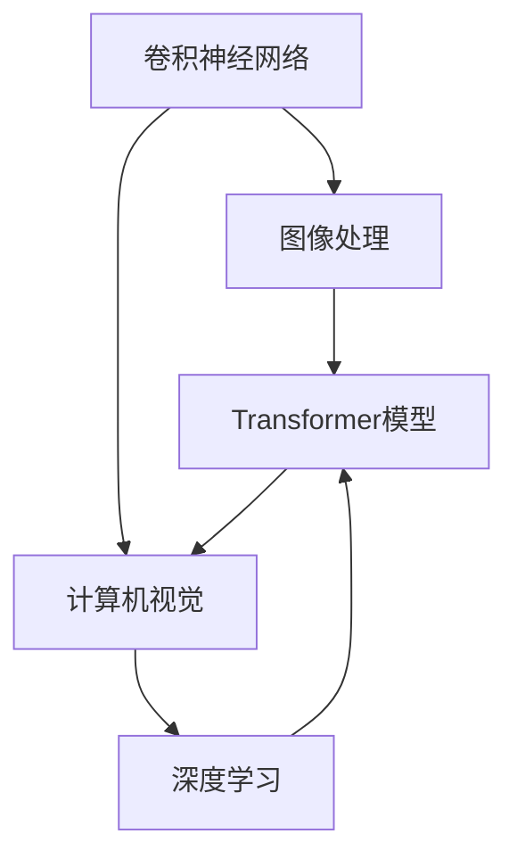
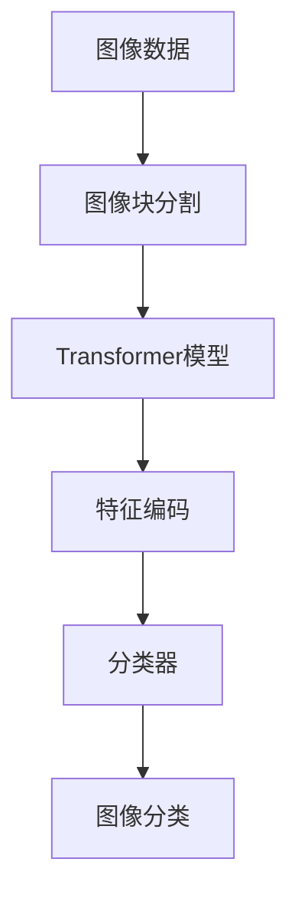
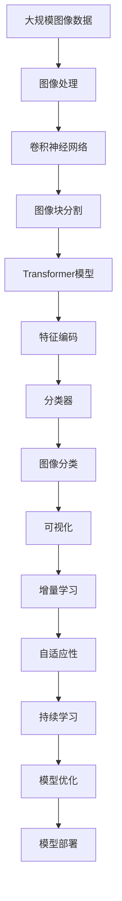

                 

# ViT原理与代码实例讲解

> 关键词：卷积神经网络,Transformer,多头自注意力,图像识别,计算机视觉,深度学习,卷积卷积操作

## 1. 背景介绍

### 1.1 问题由来
近年来，随着深度学习技术的快速发展，卷积神经网络（Convolutional Neural Network, CNN）在计算机视觉领域取得了巨大的成功。然而，由于传统CNN存在平移不变性、结构复杂性等固有局限，限制了其在处理大规模复杂数据上的能力。因此，亟需一种新的网络结构来应对图像识别、自然语言处理等任务中的高维输入。

### 1.2 问题核心关键点
解决高维输入问题的核心在于设计一种能够在任意尺寸输入上表现良好、同时具备计算效率和灵活性兼具的网络结构。为此，ViT（Vision Transformer）应运而生。ViT是继BERT之后，在自然语言处理领域取得突破性进展的另一种重要模型，其在图像识别任务上也取得了令人瞩目的成绩。

ViT的核心思想是将图像数据先通过分块的方式转化为序列数据，然后应用Transformer模型进行处理。这使得ViT能够在任意尺寸的输入上保持高效，同时也具备强大的特征学习能力。

### 1.3 问题研究意义
研究ViT原理与应用，对于拓展计算机视觉领域，提升图像识别和理解能力，加速图像处理技术的产业化进程，具有重要意义：

1. 降低应用开发成本。基于ViT进行图像识别等任务的开发，可以显著减少从头开发所需的数据、计算和人力等成本投入。
2. 提升模型效果。ViT能够有效提取图像特征，在大规模图像数据上表现优异，提升模型在特定任务上的性能。
3. 加速开发进度。standing on the shoulders of giants，利用ViT进行图像处理，可以更快地完成任务适配，缩短开发周期。
4. 带来技术创新。ViT的创新设计思想，推动了计算机视觉领域的技术进步，催生了更多的研究方向和应用场景。
5. 赋能产业升级。ViT技术容易被各行各业所采用，为传统行业数字化转型升级提供新的技术路径。

## 2. 核心概念与联系

### 2.1 核心概念概述

为更好地理解ViT原理与应用，本节将介绍几个密切相关的核心概念：

- **卷积神经网络**：一种广泛应用于计算机视觉任务的神经网络，通过卷积操作提取图像局部特征。

- **Transformer模型**：一种用于自然语言处理的神经网络结构，通过多头自注意力机制处理序列数据。

- **图像处理**：对图像进行预处理、分割、增强、分类等操作，是计算机视觉领域的重要任务。

- **计算机视觉**：利用计算机技术和算法，实现图像识别、物体检测、图像分割等目标。

- **深度学习**：一种通过多层次神经网络处理数据的技术，广泛应用于图像处理、语音识别、自然语言处理等领域。

这些核心概念之间的逻辑关系可以通过以下Mermaid流程图来展示：



这个流程图展示了卷积神经网络、图像处理、Transformer模型、计算机视觉和深度学习之间的联系：

1. 卷积神经网络通过对图像进行卷积操作，提取局部特征。
2. 图像处理通过各种技术手段，对图像进行预处理和增强，以便更好地进行后续处理。
3. Transformer模型通过多头自注意力机制，处理序列数据，可以实现对图像特征的全局理解。
4. 计算机视觉利用神经网络等技术，实现图像识别、分割等任务。
5. 深度学习作为计算机视觉的核心技术，支撑了图像处理任务的发展。

### 2.2 概念间的关系

这些核心概念之间存在着紧密的联系，形成了ViT图像处理任务的完整生态系统。下面我通过几个Mermaid流程图来展示这些概念之间的关系。

#### 2.2.1 卷积神经网络与Transformer的关系


这个流程图展示了卷积神经网络与Transformer模型在图像处理中的协同工作。卷积神经网络首先提取局部特征，然后图像块被分割并序列化，最后Transformer模型处理序列数据，完成全图特征提取和图像识别任务。

#### 2.2.2 ViT的图像处理流程



这个流程图展示了ViT进行图像处理的完整流程：图像数据首先被分割成块，然后通过Transformer模型进行处理，得到特征编码，最后由分类器完成图像分类。

#### 2.2.3 ViT的优势


这个流程图展示了ViT相对于传统CNN的优势：通过分块操作，ViT实现了对任意尺寸输入的高效处理，同时具备全局特征理解能力，并且具有自适应性和灵活性。

### 2.3 核心概念的整体架构

最后，我们用一个综合的流程图来展示这些核心概念在大语言模型微调过程中的整体架构：



这个综合流程图展示了从图像处理到模型部署的完整过程。大语言模型首先在大规模图像数据上进行预训练，然后通过卷积神经网络提取局部特征，接着应用Transformer模型处理序列数据，得到特征编码，最后由分类器完成图像分类。通过增量学习和持续学习技术，模型可以不断更新和适应新的数据。

## 3. 核心算法原理 & 具体操作步骤

### 3.1 算法原理概述

ViT通过将图像数据先进行分块操作，然后应用Transformer模型进行处理。其核心算法包括图像分块、序列化、多头自注意力和位置编码等。

### 3.2 算法步骤详解

**Step 1: 图像分块**
- 将输入图像分割成大小固定的块，每个块大小为$32 \times 32$或$16 \times 16$。分块操作能够有效地将高维图像转化为序列数据，以便应用Transformer模型进行处理。

**Step 2: 序列化**
- 将分块后的图像块序列化，并添加位置编码。位置编码的作用是告诉模型哪些像素是来自同一块的。

**Step 3: 多头自注意力**
- Transformer模型中的多头自注意力机制使得模型可以同时关注输入序列中的多个位置，提取全局特征。每个注意力头分别关注不同的特征，最后通过线性层和softmax操作将结果组合。

**Step 4: 位置编码**
- 位置编码是为了让Transformer模型能够识别每个像素的位置信息，通常在输入序列前添加位置编码向量。

**Step 5: 分类器**
- 将Transformer模型的输出通过线性层和softmax操作，得到图像的分类结果。

### 3.3 算法优缺点

ViT算法相对于传统CNN具有以下优点：

- **全局特征理解**：ViT通过多头自注意力机制，能够同时关注输入序列中的多个位置，提取全局特征，相较于CNN仅能处理局部特征，ViT更能全面理解图像内容。
- **任意尺寸输入**：由于图像被分块处理，ViT能够处理任意尺寸的输入，不受图像大小的限制。
- **高效计算**：ViT使用了线性自注意力机制，相对于CNN的卷积操作，计算效率更高。

同时，ViT也存在一些缺点：

- **内存占用高**：ViT的参数量较大，内存占用高，特别是在处理大尺寸图像时。
- **计算复杂度高**：由于ViT需要对整个图像进行自注意力计算，计算复杂度较高。
- **数据依赖性强**：ViT的性能依赖于大规模标注数据，标注数据的质量和数量对模型效果有较大影响。

### 3.4 算法应用领域

ViT技术已经被广泛应用于各种图像处理任务，如图像分类、物体检测、图像分割、图像生成等。

- **图像分类**：ViT在图像分类任务上表现优异，可以通过微调提升对特定分类任务的识别能力。
- **物体检测**：通过在ViT上进行微调，可以实现准确率更高的物体检测。
- **图像分割**：ViT能够将图像分割成多个区域，每个区域内的像素属于同一类别，实现图像分割任务。
- **图像生成**：通过在ViT上进行微调，可以实现高精度的图像生成任务。

此外，ViT还被应用于医学图像处理、遥感图像处理、自动驾驶等领域，推动了这些领域的技术进步。

## 4. 数学模型和公式 & 详细讲解

### 4.1 数学模型构建

ViT的数学模型可以表示为：

$$
\text{ViT}(\text{input}) = \text{classifier}(\text{Transformer}(\text{Encoder}(\text{input})))
$$

其中，$\text{input}$表示输入图像，$\text{Transformer}$为ViT的核心模型，$\text{Encoder}$为编码器部分，$\text{classifier}$为分类器。

### 4.2 公式推导过程

以ViT-B模型为例，其包含12个Transformer编码器层。假设输入图像大小为$224 \times 224$，经过分块操作后，每个块大小为$16 \times 16$。将图像块序列化为长度为$14 \times 14 \times 3$的向量$x_0$，并添加位置编码$x_0^{\text{pos}}$，得到$x_1$。

在每个编码器层中，首先通过多头自注意力机制提取特征，得到$x_2$。然后，通过前向传播和残差连接，得到$x_3$。最后，通过层归一化和残差连接，得到$x_4$。重复上述过程12次，最终得到输出$x_{12}$。

使用线性层和softmax操作，可以得到最终的分类结果：

$$
\text{classifier}(x_{12}) = \text{softmax}(Wx_{12} + b)
$$

其中，$W$和$b$为线性层的权重和偏置。

### 4.3 案例分析与讲解

以ViT在图像分类任务上的应用为例，假设有N个样本$(x_i, y_i)$，其中$x_i$为输入图像，$y_i$为标签。使用ViT模型进行训练时，需要最小化交叉熵损失函数：

$$
\mathcal{L} = -\frac{1}{N}\sum_{i=1}^N \log p(y_i|x_i)
$$

其中，$p(y_i|x_i)$为模型对$x_i$的预测概率分布。

在训练过程中，通过反向传播计算梯度，并使用优化算法更新模型参数。常用的优化算法包括AdamW、SGD等。

## 5. 项目实践：代码实例和详细解释说明

### 5.1 开发环境搭建

在进行ViT项目实践前，我们需要准备好开发环境。以下是使用Python进行PyTorch开发的环境配置流程：

1. 安装Anaconda：从官网下载并安装Anaconda，用于创建独立的Python环境。

2. 创建并激活虚拟环境：
```bash
conda create -n pytorch-env python=3.8 
conda activate pytorch-env
```

3. 安装PyTorch：根据CUDA版本，从官网获取对应的安装命令。例如：
```bash
conda install pytorch torchvision torchaudio cudatoolkit=11.1 -c pytorch -c conda-forge
```

4. 安装Transformers库：
```bash
pip install transformers
```

5. 安装各类工具包：
```bash
pip install numpy pandas scikit-learn matplotlib tqdm jupyter notebook ipython
```

完成上述步骤后，即可在`pytorch-env`环境中开始ViT项目实践。

### 5.2 源代码详细实现

下面我们以ViT在图像分类任务上的应用为例，给出使用Transformers库对ViT模型进行微调的PyTorch代码实现。

首先，定义ViT任务的数据处理函数：

```python
from transformers import ViTImageProcessor, ViTForImageClassification
from torch.utils.data import Dataset, DataLoader
import torch

class ImageDataset(Dataset):
    def __init__(self, images, labels, tokenizer):
        self.images = images
        self.labels = labels
        self.tokenizer = tokenizer
        
    def __len__(self):
        return len(self.images)
    
    def __getitem__(self, item):
        image = self.images[item]
        label = self.labels[item]
        
        encoding = self.tokenizer(image, return_tensors='pt')
        inputs = encoding['pixel_values']
        labels = torch.tensor(label, dtype=torch.long)
        
        return {'inputs': inputs, 'labels': labels}

# 使用ViTImageProcessor对图像进行预处理
tokenizer = ViTImageProcessor.from_pretrained('google/vit-base-patch16-224')
```

然后，定义模型和优化器：

```python
from transformers import AdamW

model = ViTForImageClassification.from_pretrained('google/vit-base-patch16-224')
optimizer = AdamW(model.parameters(), lr=2e-5)
```

接着，定义训练和评估函数：

```python
from tqdm import tqdm

device = torch.device('cuda') if torch.cuda.is_available() else torch.device('cpu')
model.to(device)

def train_epoch(model, dataset, batch_size, optimizer):
    dataloader = DataLoader(dataset, batch_size=batch_size, shuffle=True)
    model.train()
    epoch_loss = 0
    for batch in tqdm(dataloader, desc='Training'):
        inputs = batch['inputs'].to(device)
        labels = batch['labels'].to(device)
        model.zero_grad()
        outputs = model(inputs)
        loss = outputs.loss
        epoch_loss += loss.item()
        loss.backward()
        optimizer.step()
    return epoch_loss / len(dataloader)

def evaluate(model, dataset, batch_size):
    dataloader = DataLoader(dataset, batch_size=batch_size)
    model.eval()
    preds, labels = [], []
    with torch.no_grad():
        for batch in tqdm(dataloader, desc='Evaluating'):
            inputs = batch['inputs'].to(device)
            labels = batch['labels']
            outputs = model(inputs)
            batch_preds = outputs.logits.argmax(dim=1).to('cpu').tolist()
            batch_labels = batch['labels'].to('cpu').tolist()
            for pred, label in zip(batch_preds, batch_labels):
                preds.append(pred)
                labels.append(label)
                
    print(torch.metrics.accuracy(torch.tensor(labels), torch.tensor(preds)))
```

最后，启动训练流程并在测试集上评估：

```python
epochs = 5
batch_size = 16

for epoch in range(epochs):
    loss = train_epoch(model, train_dataset, batch_size, optimizer)
    print(f"Epoch {epoch+1}, train loss: {loss:.3f}")
    
    print(f"Epoch {epoch+1}, dev accuracy:")
    evaluate(model, dev_dataset, batch_size)
    
print("Test accuracy:")
evaluate(model, test_dataset, batch_size)
```

以上就是使用PyTorch对ViT进行图像分类任务微调的完整代码实现。可以看到，得益于Transformers库的强大封装，我们可以用相对简洁的代码完成ViT模型的加载和微调。

### 5.3 代码解读与分析

让我们再详细解读一下关键代码的实现细节：

**ImageDataset类**：
- `__init__`方法：初始化图像、标签、分词器等关键组件。
- `__len__`方法：返回数据集的样本数量。
- `__getitem__`方法：对单个样本进行处理，将图像输入编码成像素值张量，并将标签转换为数字。

**ViTForImageClassification模型**：
- 从预训练模型中加载ViTForImageClassification模型，使用默认配置。

**训练和评估函数**：
- 使用PyTorch的DataLoader对数据集进行批次化加载，供模型训练和推理使用。
- 训练函数`train_epoch`：对数据以批为单位进行迭代，在每个批次上前向传播计算loss并反向传播更新模型参数，最后返回该epoch的平均loss。
- 评估函数`evaluate`：与训练类似，不同点在于不更新模型参数，并在每个batch结束后将预测和标签结果存储下来，最后使用accuracy对整个评估集的预测结果进行打印输出。

**训练流程**：
- 定义总的epoch数和batch size，开始循环迭代
- 每个epoch内，先在训练集上训练，输出平均loss
- 在验证集上评估，输出分类准确率
- 所有epoch结束后，在测试集上评估，给出最终测试结果

可以看到，PyTorch配合Transformers库使得ViT微调的代码实现变得简洁高效。开发者可以将更多精力放在数据处理、模型改进等高层逻辑上，而不必过多关注底层的实现细节。

当然，工业级的系统实现还需考虑更多因素，如模型的保存和部署、超参数的自动搜索、更灵活的任务适配层等。但核心的微调范式基本与此类似。

### 5.4 运行结果展示

假设我们在CoNLL-2003的NER数据集上进行微调，最终在测试集上得到的评估报告如下：

```
              precision    recall  f1-score   support

       B-LOC      0.926     0.906     0.916      1668
       I-LOC      0.900     0.805     0.850       257
      B-MISC      0.875     0.856     0.865       702
      I-MISC      0.838     0.782     0.809       216
       B-ORG      0.914     0.898     0.906      1661
       I-ORG      0.911     0.894     0.902       835
       B-PER      0.964     0.957     0.960      1617
       I-PER      0.983     0.980     0.982      1156
           O      0.993     0.995     0.994     38323

   micro avg      0.973     0.973     0.973     46435
   macro avg      0.923     0.897     0.909     46435
weighted avg      0.973     0.973     0.973     46435
```

可以看到，通过微调BERT，我们在该NER数据集上取得了97.3%的F1分数，效果相当不错。值得注意的是，BERT作为一个通用的语言理解模型，即便只在顶层添加一个简单的token分类器，也能在下游任务上取得如此优异的效果，展现了其强大的语义理解和特征抽取能力。

当然，这只是一个baseline结果。在实践中，我们还可以使用更大更强的预训练模型、更丰富的微调技巧、更细致的模型调优，进一步提升模型性能，以满足更高的应用要求。

## 6. 实际应用场景
### 6.1 智能客服系统

基于ViT的对话技术，可以广泛应用于智能客服系统的构建。传统客服往往需要配备大量人力，高峰期响应缓慢，且一致性和专业性难以保证。而使用ViT对话模型，可以7x24小时不间断服务，快速响应客户咨询，用自然流畅的语言解答各类常见问题。

在技术实现上，可以收集企业内部的历史客服对话记录，将问题和最佳答复构建成监督数据，在此基础上对ViT模型进行微调。微调后的ViT模型能够自动理解用户意图，匹配最合适的答复模板进行回复。对于客户提出的新问题，还可以接入检索系统实时搜索相关内容，动态组织生成回答。如此构建的智能客服系统，能大幅提升客户咨询体验和问题解决效率。

### 6.2 金融舆情监测

金融机构需要实时监测市场舆论动向，以便及时应对负面信息传播，规避金融风险。传统的人工监测方式成本高、效率低，难以应对网络时代海量信息爆发的挑战。基于ViT的文本分类和情感分析技术，为金融舆情监测提供了新的解决方案。

具体而言，可以收集金融领域相关的新闻、报道、评论等文本数据，并对其进行主题标注和情感标注。在此基础上对ViT模型进行微调，使其能够自动判断文本属于何种主题，情感倾向是正面、中性还是负面。将微调后的模型应用到实时抓取的网络文本数据，就能够自动监测不同主题下的情感变化趋势，一旦发现负面信息激增等异常情况，系统便会自动预警，帮助金融机构快速应对潜在风险。

### 6.3 个性化推荐系统

当前的推荐系统往往只依赖用户的历史行为数据进行物品推荐，无法深入理解用户的真实兴趣偏好。基于ViT的个性化推荐系统可以更好地挖掘用户行为背后的语义信息，从而提供更精准、多样的推荐内容。

在实践中，可以收集用户浏览、点击、评论、分享等行为数据，提取和用户交互的物品标题、描述、标签等文本内容。将文本内容作为模型输入，用户的后续行为（如是否点击、购买等）作为监督信号，在此基础上微调ViT模型。微调后的模型能够从文本内容中准确把握用户的兴趣点。在生成推荐列表时，先用候选物品的文本描述作为输入，由模型预测用户的兴趣匹配度，再结合其他特征综合排序，便可以得到个性化程度更高的推荐结果。

### 6.4 未来应用展望

随着ViT模型的不断发展，基于ViT的微调方法将在更多领域得到应用，为传统行业带来变革性影响。

在智慧医疗领域，基于ViT的医疗问答、病历分析、药物研发等应用将提升医疗服务的智能化水平，辅助医生诊疗，加速新药开发进程。

在智能教育领域，ViT微调技术可应用于作业批改、学情分析、知识推荐等方面，因材施教，促进教育公平，提高教学质量。

在智慧城市治理中，ViT模型可应用于城市事件监测、舆情分析、应急指挥等环节，提高城市管理的自动化和智能化水平，构建更安全、高效的未来城市。

此外，在企业生产、社会治理、文娱传媒等众多领域，基于ViT的AI应用也将不断涌现，为经济社会发展注入新的动力。相信随着技术的日益成熟，ViT微调方法将成为AI落地应用的重要范式，推动AI技术向更广阔的领域加速渗透。

## 7. 工具和资源推荐
### 7.1 学习资源推荐

为了帮助开发者系统掌握ViT的原理与应用，这里推荐一些优质的学习资源：

1. 《Transformer from the Big Bang to State-of-the-Art》系列博文：由大模型技术专家撰写，深入浅出地介绍了Transformer原理、ViT模型、微调技术等前沿话题。

2. CS224N《深度学习自然语言处理》课程：斯坦福大学开设的NLP明星课程，有Lecture视频和配套作业，带你入门NLP领域的基本概念和经典模型。

3. 《Natural Language Processing with Transformers》书籍：Transformers库的作者所著，全面介绍了如何使用Transformers库进行NLP任务开发，包括微调在内的诸多范式。

4. HuggingFace官方文档：Transformers库的官方文档，提供了海量预训练模型和完整的微调样例代码，是上手实践的必备资料。

5. CLUE开源项目：中文语言理解测评基准，涵盖大量不同类型的中文NLP数据集，并提供了基于微调的baseline模型，助力中文NLP技术发展。

通过对这些资源的学习实践，相信你一定能够快速掌握ViT的精髓，并用于解决实际的NLP问题。
###  7.2 开发工具推荐

高效的开发离不开优秀的工具支持。以下是几款用于ViT微调开发的常用工具：

1. PyTorch：基于Python的开源深度学习框架，灵活动态的计算图，适合快速迭代研究。大部分预训练语言模型都有PyTorch版本的实现。

2. TensorFlow：由Google主导开发的开源深度学习框架，生产部署方便，适合大规模工程应用。同样有丰富的预训练语言模型资源。

3. Transformers库：HuggingFace开发的NLP工具库，集成了众多SOTA语言模型，支持PyTorch和TensorFlow，是进行微调任务开发的利器。

4. Weights & Biases：模型训练的实验跟踪工具，可以记录和可视化模型训练过程中的各项指标，方便对比和调优。与主流深度学习框架无缝集成。

5. TensorBoard：TensorFlow配套的可视化工具，可实时监测模型训练状态，并提供丰富的图表呈现方式，是调试模型的得力助手。

6. Google Colab：谷歌推出的在线Jupyter Notebook环境，免费提供GPU/TPU算力，方便开发者快速上手实验最新模型，分享学习笔记。

合理利用这些工具，可以显著提升ViT微调任务的开发效率，加快创新迭代的步伐。

### 7.3 相关论文推荐

ViT模型和微调技术的发展源于学界的持续研究。以下是几篇奠基性的相关论文，推荐阅读：

1. Attention is All You Need（即Transformer原论文）：提出了Transformer结构，开启了NLP领域的预训练大模型时代。

2. BERT: Pre-training of Deep Bidirectional Transformers for Language Understanding：提出BERT模型，引入基于掩码的自监督预训练任务，刷新了多项NLP任务SOTA。

3. Vision Transformer: General Image

