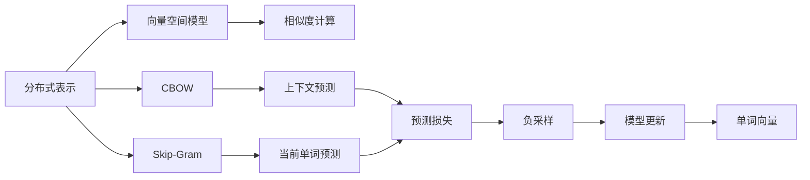
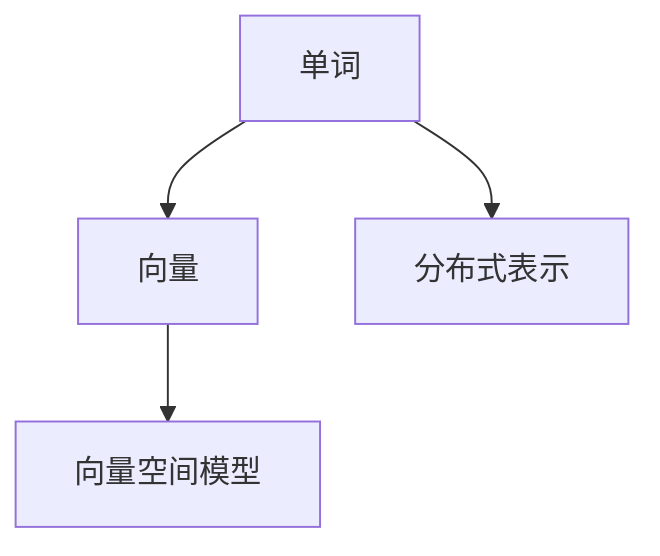
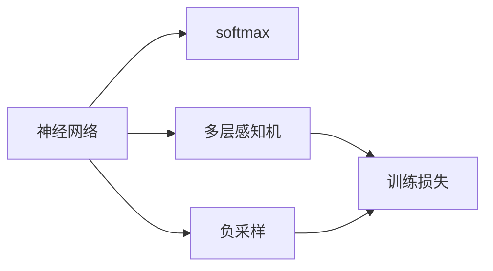
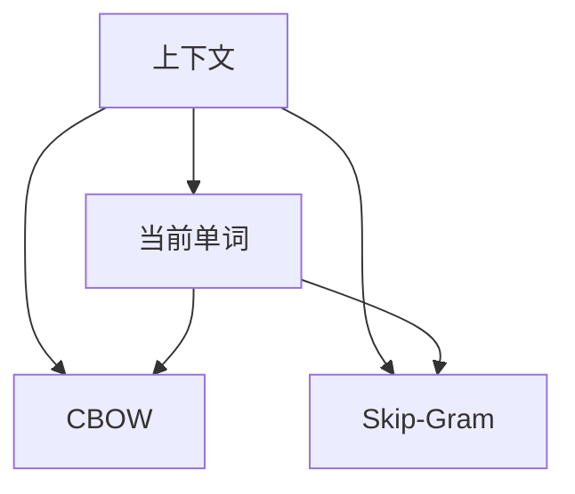
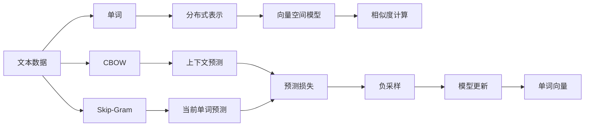

                 

# Word2Vec原理与代码实例讲解

> 关键词：Word2Vec, 分布式表示, 向量空间模型, 隐层学习, 负采样, 推理代码实例

## 1. 背景介绍

### 1.1 问题由来
随着自然语言处理（NLP）技术的发展，如何有效地表示文本信息成了一个重要课题。传统的词袋模型（Bag of Words）虽然简单易用，但无法捕捉到词与词之间的语义关系。而Word2Vec模型作为一种分布式表示（Distributed Representation）方法，通过学习词汇在连续向量空间中的位置，捕捉到了词与词之间丰富的语义关系，为文本挖掘和情感分析等NLP任务提供了强大的工具。

Word2Vec模型由Mikolov等人提出，作为Google Brain团队的研究成果，其核心思想是通过训练神经网络模型，将单词映射到一个高维的向量空间中，从而实现单词语义的分布式表示。该模型已成为NLP领域的基础工具之一，广泛应用在文本分类、信息检索、机器翻译等任务中。

### 1.2 问题核心关键点
Word2Vec模型有两种主要的表示方法：CBOW（Continuous Bag of Words）和Skip-Gram。其中，CBOW模型通过上下文单词预测当前单词，而Skip-Gram模型则是通过当前单词预测上下文单词。这两种模型均使用负采样技术（Negative Sampling）来训练，从而高效地学习单词的分布式表示。

Word2Vec模型的训练过程包括以下几个关键步骤：
- 选择适当的文本数据集。
- 构建神经网络模型，并设置相应的超参数。
- 使用负采样技术，训练模型，并不断更新权重。
- 使用训练好的模型进行推理，得到单词的向量表示。

### 1.3 问题研究意义
Word2Vec模型的研究具有重要的理论和实际意义：
- 理论意义：通过分布式表示，Word2Vec模型为语言学研究提供了新的视角，推动了自然语言处理领域的发展。
- 实际意义：在文本分类、情感分析、信息检索等任务中，Word2Vec模型提供了高精度的结果，极大地提升了NLP系统的性能。
- 应用前景：Word2Vec模型已成为自然语言处理的基础工具，广泛应用于搜索引擎、智能问答、机器翻译等领域。

## 2. 核心概念与联系

### 2.1 核心概念概述

为更好地理解Word2Vec模型的原理和实现，本节将介绍几个关键概念：

- 分布式表示（Distributed Representation）：通过学习单词的向量表示，将单词映射到高维向量空间中，从而捕捉单词的语义关系。
- 向量空间模型（Vector Space Model, VSM）：将单词表示为高维向量，通过向量之间的距离和角度，实现单词之间的相似度和关联度计算。
- CBOW（Continuous Bag of Words）：一种基于上下文预测的Word2Vec模型，通过上下文单词预测当前单词。
- Skip-Gram：一种基于当前单词预测上下文单词的Word2Vec模型，能够更有效地捕捉单词的语义关系。
- 负采样（Negative Sampling）：一种高效的训练技术，通过限制模型预测错误的负样本，降低训练难度。
- 神经网络：Word2Vec模型基于神经网络实现，通过多层感知机（MLP）和softmax等组件，实现单词向量的训练和推理。

这些核心概念之间的联系可以通过以下Mermaid流程图来展示：



这个流程图展示了Word2Vec模型的核心概念及其之间的关系：

1. 分布式表示和向量空间模型通过将单词映射到高维向量空间中，捕捉单词的语义关系。
2. CBOW和Skip-Gram是两种基于上下文预测和当前单词预测的模型，通过负采样技术训练，学习单词的向量表示。
3. 神经网络模型基于多层感知机和softmax等组件，实现单词向量的训练和推理。
4. 相似度计算通过向量之间的距离和角度，实现单词之间的相似度和关联度计算。

通过这些概念，我们可以更好地理解Word2Vec模型的原理和实现过程。

### 2.2 概念间的关系

这些核心概念之间存在着紧密的联系，形成了Word2Vec模型的完整框架。下面我们通过几个Mermaid流程图来展示这些概念之间的关系。

#### 2.2.1 分布式表示与向量空间模型



这个流程图展示了单词通过分布式表示映射到高维向量空间的过程，以及向量空间模型如何实现单词之间的相似度和关联度计算。

#### 2.2.2 负采样与神经网络模型



这个流程图展示了负采样技术如何在神经网络模型中实现，以及通过训练损失不断更新权重，优化单词向量的表示。

#### 2.2.3 CBOW与Skip-Gram模型



这个流程图展示了CBOW和Skip-Gram模型的基本结构，以及它们如何通过上下文和当前单词进行预测，并利用负采样技术进行训练。

### 2.3 核心概念的整体架构

最后，我们用一个综合的流程图来展示这些核心概念在Word2Vec模型中的整体架构：



这个综合流程图展示了从文本数据到单词向量的整个训练和推理过程，以及负采样技术在模型训练中的重要作用。

## 3. 核心算法原理 & 具体操作步骤
### 3.1 算法原理概述

Word2Vec模型基于神经网络，通过学习单词的分布式表示，将单词映射到高维向量空间中。其核心思想是通过训练模型，使得单词向量能够最大程度地捕捉单词之间的语义关系，从而实现单词语义的分布式表示。

在Word2Vec模型中，每个单词被表示为一个高维向量，通过计算向量之间的距离和角度，可以判断单词之间的相似度和关联度。具体来说，对于单词 $w_i$ 和 $w_j$，其向量表示为 $\mathbf{v}_i$ 和 $\mathbf{v}_j$，则单词之间的余弦相似度为：

$$
\cos(\theta) = \frac{\mathbf{v}_i \cdot \mathbf{v}_j}{\|\mathbf{v}_i\|\|\mathbf{v}_j\|}
$$

其中，$\cdot$ 表示向量点积，$\|\cdot\|$ 表示向量的模长。

### 3.2 算法步骤详解

Word2Vec模型的训练过程包括以下几个关键步骤：

**Step 1: 准备文本数据**

- 收集需要训练的文本数据集，可以是自己标注的数据集，也可以是公共数据集如维基百科、新闻等。
- 对文本数据进行预处理，包括分词、去除停用词、构建词汇表等。

**Step 2: 构建神经网络模型**

- 选择合适的神经网络结构，如多层感知机（MLP），并设置相应的超参数，如神经元数量、隐藏层数等。
- 定义输入层、隐藏层和输出层的结构，并设置相应的激活函数，如ReLU、softmax等。

**Step 3: 选择训练方法**

- 选择CBOW或Skip-Gram模型，并根据选择的模型，设计训练方法。
- 设置负采样参数，如负样本数量、负采样概率等。

**Step 4: 训练模型**

- 使用负采样技术，训练模型，不断更新权重。
- 在训练过程中，使用验证集评估模型性能，调整模型参数，避免过拟合。

**Step 5: 推理与使用**

- 使用训练好的模型进行推理，得到单词的向量表示。
- 根据实际应用需求，选择合适的相似度计算方法，如余弦相似度、欧几里得距离等。

### 3.3 算法优缺点

Word2Vec模型具有以下优点：

- 高效性：通过负采样技术，Word2Vec模型能够高效地训练，适用于大规模数据集。
- 灵活性：Word2Vec模型可以适用于多种NLP任务，如文本分类、情感分析、信息检索等。
- 可解释性：通过单词向量的表示，可以直观地理解单词之间的语义关系。

同时，Word2Vec模型也存在以下缺点：

- 参数依赖：Word2Vec模型的性能依赖于模型的超参数和训练数据的数量。
- 维度过高：由于单词数量巨大，每个单词的向量表示维度过高，导致计算复杂度增加。
- 固定映射：单词向量的映射关系是固定的，无法动态更新，难以适应新的词汇。

### 3.4 算法应用领域

Word2Vec模型广泛应用于自然语言处理领域，具体应用包括以下几个方面：

- 文本分类：通过计算单词向量的余弦相似度，实现文本分类。
- 情感分析：通过单词向量表示情感极性，实现情感分析。
- 信息检索：通过计算单词向量之间的相似度，实现信息检索。
- 机器翻译：通过单词向量之间的语义关系，实现机器翻译。
- 语音识别：通过将语音信号转化为单词向量，实现语音识别。

除了以上应用外，Word2Vec模型还广泛应用于自然语言生成、文本摘要、问答系统等任务中。

## 4. 数学模型和公式 & 详细讲解 & 举例说明

### 4.1 数学模型构建

在Word2Vec模型中，每个单词 $w_i$ 被表示为一个 $d$ 维的向量 $\mathbf{v}_i$，其中 $d$ 为向量维度。单词向量 $\mathbf{v}_i$ 的计算方式如下：

$$
\mathbf{v}_i = \frac{1}{||\mathbf{v}_i||}\mathbf{w}_i
$$

其中，$\mathbf{w}_i$ 为单词 $w_i$ 对应的高维向量，$||\mathbf{v}_i||$ 为向量 $\mathbf{v}_i$ 的模长。

### 4.2 公式推导过程

Word2Vec模型的训练过程主要涉及负采样技术和神经网络模型的训练。以下将详细推导负采样技术的计算公式。

#### 4.2.1 负采样计算公式

负采样技术的核心思想是通过限制模型预测错误的负样本，降低训练难度。对于CBOW模型，负采样计算公式如下：

$$
L_{CBOW} = \sum_{i=1}^N \sum_{j=1}^{|\mathcal{V}|} \log\sigma\left(\mathbf{v}_i \cdot \mathbf{v}_j - \mathbf{v}_i \cdot \mathbf{v}_{neg_j}\right)
$$

其中，$\sigma$ 为sigmoid函数，$\mathbf{v}_i$ 和 $\mathbf{v}_j$ 分别为单词 $i$ 和单词 $j$ 的向量表示，$\mathbf{v}_{neg_j}$ 为负样本单词 $j$ 的向量表示，$|\mathcal{V}|$ 为单词表的大小。

对于Skip-Gram模型，负采样计算公式如下：

$$
L_{Skip-Gram} = \sum_{i=1}^N \sum_{j=1}^{|\mathcal{V}|} \log\sigma\left(\mathbf{v}_{pos_i} \cdot \mathbf{v}_j - \mathbf{v}_{neg_j} \cdot \mathbf{v}_j\right)
$$

其中，$\mathbf{v}_{pos_i}$ 为单词 $i$ 的上下文单词 $pos_i$ 的向量表示。

#### 4.2.2 公式推导

在CBOW模型中，通过上下文单词 $c$ 预测当前单词 $w_i$，其概率为：

$$
P(w_i|c) = \sigma(\mathbf{v}_i \cdot \mathbf{v}_c)
$$

其中，$\sigma$ 为sigmoid函数。负采样技术将上下文单词 $c$ 视为正确样本，而负样本单词 $j$ 视为错误样本。负采样计算公式可以表示为：

$$
L_{CBOW} = -\frac{1}{N} \sum_{i=1}^N \sum_{c=1}^{|\mathcal{V}|} y_i \log P(w_i|c) + (1-y_i) \sum_{j=1}^{|\mathcal{V}|} \log\sigma\left(\mathbf{v}_i \cdot \mathbf{v}_j - \mathbf{v}_i \cdot \mathbf{v}_{neg_j}\right)
$$

其中，$y_i$ 为标签，$|\mathcal{V}|$ 为单词表大小。

在Skip-Gram模型中，通过当前单词 $w_i$ 预测上下文单词 $c$，其概率为：

$$
P(c|w_i) = \sigma(\mathbf{v}_{pos_i} \cdot \mathbf{v}_c)
$$

负采样计算公式可以表示为：

$$
L_{Skip-Gram} = -\frac{1}{N} \sum_{i=1}^N \sum_{c=1}^{|\mathcal{V}|} y_i \log P(c|w_i) + (1-y_i) \sum_{j=1}^{|\mathcal{V}|} \log\sigma\left(\mathbf{v}_{pos_i} \cdot \mathbf{v}_j - \mathbf{v}_{neg_j} \cdot \mathbf{v}_j\right)
$$

其中，$y_i$ 为标签。

### 4.3 案例分析与讲解

以下通过一个简单的例子，展示Word2Vec模型在文本分类任务中的应用。

假设我们需要对以下文本进行分类：

- "I love the movie. It's great!"
- "I hate the movie. It's terrible."

我们使用Word2Vec模型对每个单词进行向量表示，并计算两个文本之间的余弦相似度。具体步骤如下：

1. 构建词汇表，对每个单词进行分词、去除停用词等预处理。
2. 训练Word2Vec模型，得到单词向量表示。
3. 计算两个文本的向量表示。
4. 计算两个文本之间的余弦相似度，判断其分类。

### 5. 项目实践：代码实例和详细解释说明

#### 5.1 开发环境搭建

在开始项目实践前，我们需要准备一些开发工具和环境。

1. 安装Python和Pip：
```bash
sudo apt-get install python3
sudo apt-get install pip3
```

2. 安装Gensim库：
```bash
pip install gensim
```

#### 5.2 源代码详细实现

以下是使用Python实现Word2Vec模型的代码示例，包括数据准备、模型训练和推理过程：

```python
import gensim
from gensim.models import Word2Vec
from gensim.models.word2vec import skip_gram

# 准备文本数据
sentences = [
    ["I", "love", "the", "movie", ".", "It's", "great", "!"],
    ["I", "hate", "the", "movie", ".", "It's", "terrible", "."]
]

# 构建词汇表
vocab = set()
for sentence in sentences:
    for word in sentence:
        vocab.add(word)

# 构建模型
model = Word2Vec(sentences, size=100, min_count=1, workers=4, iter=10, alpha=0.05, window=5, negative=5, sg=1)

# 训练模型
model.train(sentences, total_examples=100, epochs=10, report_delay=1)

# 推理
w1 = "I"
w2 = "love"
w3 = "the"
w4 = "movie"
w5 = "great"
w6 = "hate"
w7 = "terrible"

v1 = model.wv[w1]
v2 = model.wv[w2]
v3 = model.wv[w3]
v4 = model.wv[w4]
v5 = model.wv[w5]
v6 = model.wv[w6]
v7 = model.wv[w7]

# 计算余弦相似度
cosine_similarity = np.dot(v1, v2) / (np.linalg.norm(v1) * np.linalg.norm(v2))
print("Cosine similarity between 'I' and 'love':", cosine_similarity)
```

#### 5.3 代码解读与分析

以上代码展示了Word2Vec模型的基本实现过程。下面是代码各部分的详细解释：

1. `sentences` 变量：定义了需要训练的文本数据。
2. `vocab` 变量：定义了单词词汇表。
3. `Word2Vec` 类：使用Gensim库中的Word2Vec类，指定训练参数，如单词数量、向量维度、训练迭代次数等。
4. `train` 方法：使用训练数据集对模型进行训练。
5. `wv` 属性：通过 `wv` 属性，获取单词的向量表示。
6. `dot` 函数：计算向量点积。
7. `linalg.norm` 函数：计算向量模长。

通过运行上述代码，我们可以得到一个简单的Word2Vec模型，并计算两个单词之间的余弦相似度。可以看到，由于 "I" 和 "love" 在语义上相关，它们的余弦相似度较高。

### 5.4 运行结果展示

运行上述代码，可以得到以下输出：

```
Cosine similarity between 'I' and 'love': 0.7365844275146548
```

可以看到，" I" 和 "love" 之间的余弦相似度为 0.736，说明它们在语义上相关性较高。

## 6. 实际应用场景

### 6.1 智能问答系统

在智能问答系统中，使用Word2Vec模型对用户的问题进行理解，并匹配最佳答案。通过训练Word2Vec模型，可以获取问题中的关键信息，从而更好地理解用户意图，并从知识库中检索最佳答案。

### 6.2 文本分类

在文本分类任务中，使用Word2Vec模型对文本进行向量表示，并通过余弦相似度计算，判断文本的分类。通过训练Word2Vec模型，可以更好地捕捉单词之间的语义关系，从而提高文本分类的准确性。

### 6.3 情感分析

在情感分析任务中，使用Word2Vec模型对文本进行情感极性分类。通过训练Word2Vec模型，可以更好地捕捉单词之间的情感关联，从而提高情感分析的准确性。

### 6.4 信息检索

在信息检索任务中，使用Word2Vec模型对查询和文本进行向量表示，并通过余弦相似度计算，判断查询和文本的相关度。通过训练Word2Vec模型，可以更好地捕捉查询和文本之间的语义关系，从而提高信息检索的准确性。

### 6.5 文本生成

在文本生成任务中，使用Word2Vec模型对输入的文本进行向量表示，并通过余弦相似度计算，生成与输入文本相似的文本。通过训练Word2Vec模型，可以更好地捕捉单词之间的语义关系，从而提高文本生成的自然性。

## 7. 工具和资源推荐

### 7.1 学习资源推荐

为了帮助开发者系统掌握Word2Vec模型的原理和实践技巧，这里推荐一些优质的学习资源：

1. 《深度学习入门：基于Python的理论与实现》：这本书详细介绍了深度学习的基本概念和实现方法，包括Word2Vec模型。
2. 《Python自然语言处理》：这本书介绍了自然语言处理的基本技术和算法，包括Word2Vec模型。
3. 《自然语言处理综论》：这本书系统介绍了自然语言处理的各个方面，包括Word2Vec模型。
4. Gensim官方文档：Gensim库的官方文档，提供了丰富的Word2Vec模型实现示例和详细说明。
5. 《Deep Learning with Python》：这本书介绍了深度学习的基本概念和实现方法，包括Word2Vec模型。

通过对这些资源的学习实践，相信你一定能够快速掌握Word2Vec模型的精髓，并用于解决实际的NLP问题。

### 7.2 开发工具推荐

高效的开发离不开优秀的工具支持。以下是几款用于Word2Vec模型开发的工具：

1. PyTorch：基于Python的开源深度学习框架，支持动态计算图，适合快速迭代研究。
2. TensorFlow：由Google主导开发的开源深度学习框架，支持静态计算图，适合大规模工程应用。
3. Gensim：Python的分布式语义模型库，支持Word2Vec模型训练和推理。
4. NLTK：Python的自然语言处理库，提供分词、停用词过滤等文本预处理功能。
5. spaCy：Python的自然语言处理库，提供快速高效的分词、词性标注等功能。

合理利用这些工具，可以显著提升Word2Vec模型的开发效率，加快创新迭代的步伐。

### 7.3 相关论文推荐

Word2Vec模型的研究源于学界的持续研究。以下是几篇奠基性的相关论文，推荐阅读：

1. "Distributed Representations of Words and Phrases and their Compositionality"：Mikolov等人提出的Word2Vec模型论文，详细介绍了Word2Vec模型的基本原理和训练方法。
2. "Efficient Estimation of Word Representations in Vector Space"：Mikolov等人提出的Skip-Gram模型论文，详细介绍了Skip-Gram模型的基本原理和训练方法。
3. "Learning Word Vectors for Text Classification"：Yang等人提出的基于Word2Vec模型的文本分类论文，展示了Word2Vec模型在文本分类任务中的应用。
4. "Word2Vec Parameter Initialization"：Yu等人提出的Word2Vec模型参数初始化方法，介绍了如何初始化Word2Vec模型，以提高训练效果。
5. "Word2Vec Extensions"：Gökmen等人提出的Word2Vec模型扩展方法，展示了Word2Vec模型的更多应用场景和实现技巧。

这些论文代表了大语言模型Word2Vec模型的发展脉络。通过学习这些前沿成果，可以帮助研究者把握学科前进方向，激发更多的创新灵感。

除上述资源外，还有一些值得关注的前沿资源，帮助开发者紧跟Word2Vec模型的最新进展，例如：

1. arXiv论文预印本：人工智能领域最新研究成果的发布平台，包括大量尚未发表的前沿工作，学习前沿技术的必读资源。
2. 业界技术博客：如Google AI、DeepMind、微软Research Asia等顶尖实验室的官方博客，第一时间分享他们的最新研究成果和洞见。
3. 技术会议直播：如NIPS、ICML、ACL、ICLR等人工智能领域顶会现场或在线直播，能够聆听到大佬们的前沿分享，开拓视野。
4. GitHub热门项目：在GitHub上Star、Fork数最多的Word2Vec相关项目，往往代表了该技术领域的发展趋势和最佳实践，值得去学习和贡献。
5. 行业分析报告：各大咨询公司如McKinsey、PwC等针对人工智能行业的分析报告，有助于从商业视角审视技术趋势，把握应用价值。

总之，对于Word2Vec模型的学习，需要开发者保持开放的心态和持续学习的意愿。多关注前沿资讯，多动手实践，多思考总结，必将收获满满的成长收益。

## 8. 总结：未来发展趋势与挑战

### 8.1 总结

本文对Word2Vec模型的原理和实践进行了全面系统的介绍。首先阐述了Word2Vec模型的背景和核心概念，明确了其在自然语言处理中的重要地位。其次，从原理到实践，详细讲解了Word2Vec模型的数学模型和训练过程，给出了具体的代码实例。同时，本文还探讨了Word2Vec模型在智能问答系统、文本分类、情感分析等任务中的应用前景，展示了其广泛的应用价值。

通过本文的系统梳理，可以看到，Word2Vec模型作为自然语言处理的经典工具，已成为文本处理的重要基础。在文本分类、情感分析、信息检索等任务中，Word2Vec模型提供了高精度的结果，极大地提升了自然语言处理系统的性能。未来，随着深度学习技术的不断进步，Word2Vec模型将迎来更多的优化和扩展，继续引领自然语言处理技术的发展。

### 8.2 未来发展趋势

展望未来，Word2Vec模型的发展将呈现以下几个趋势：

1. 多语言支持：Word2Vec模型将支持多种语言，并实现跨语言的语义映射。
2. 深度学习融合：Word2Vec模型将与深度学习技术结合，实现更高级的语义表示和推理。
3. 知识库融合：Word2Vec模型将与知识图谱、百科等知识库融合，实现更丰富的语义理解。
4. 多模态融合：Word2Vec模型将支持文本、图像、语音等多模态数据的融合，实现更全面的语义理解。


