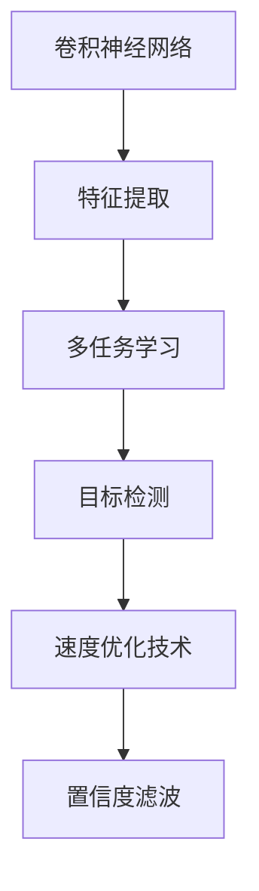
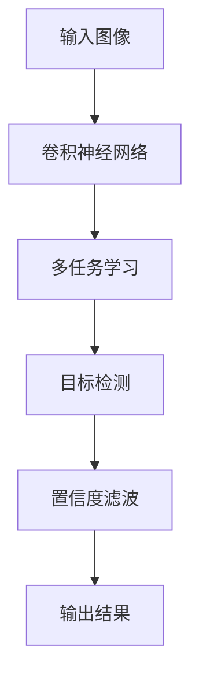
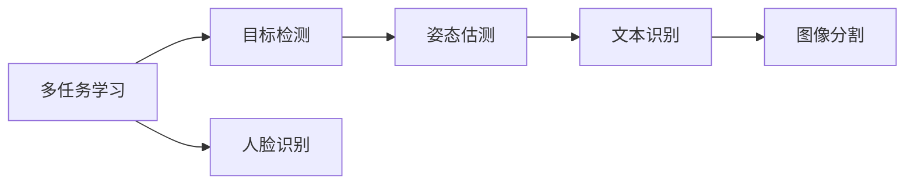
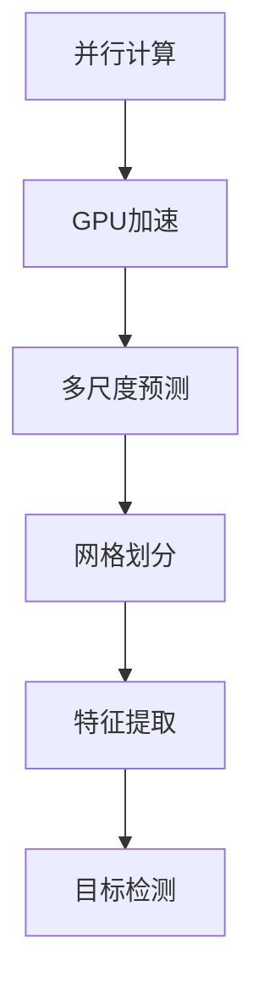
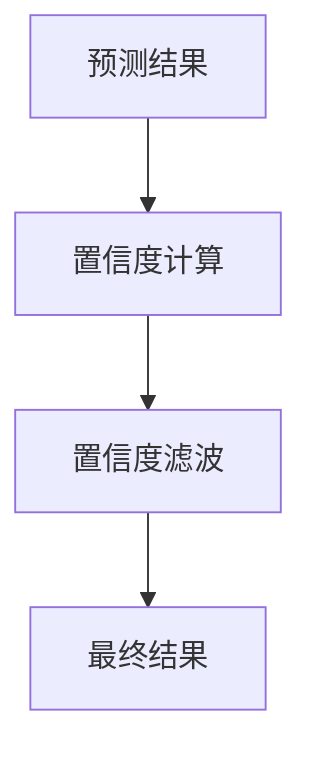
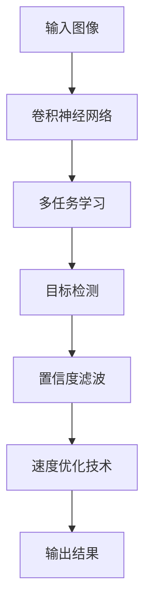

                 

# YOLOv2原理与代码实例讲解

> 关键词：YOLOv2, 目标检测, 卷积神经网络(CNN), 多任务学习, 快速处理, 锚点框(Anchor Box), 正则化技术

## 1. 背景介绍

### 1.1 问题由来
随着深度学习技术的发展，计算机视觉领域的目标检测问题成为了一大热点。目标检测任务指的是在图像或视频序列中，自动识别并定位各类物体的位置，并给出物体类别标签。该任务在自动驾驶、监控安防、智能医疗等多个应用场景中具有重要价值。

传统的目标检测方法包括R-CNN、Fast R-CNN、Faster R-CNN等，基于深度学习中的区域卷积网络(RCNN)框架。然而这些方法计算量大、速度慢，难以满足实时性和高性能的要求。为此，YOLO系列模型应运而生，YOLO代表You Only Look Once，即只在图像中看一次，便能完成目标检测。YOLOv2作为YOLO系列的第二代，通过对原始YOLO模型的改进，进一步提高了检测精度和速度，成为目标检测领域的重要技术之一。

### 1.2 问题核心关键点
YOLOv2模型通过将图像分割成SxS的网格，并在每个网格中心预测固定数量的目标框(Anchor Box)，从而实现目标检测。YOLOv2的核心思想是将目标检测任务转化为回归问题，直接在全连接层上预测目标框的坐标、物体类别和置信度。通过多任务学习，YOLOv2不仅能实现目标检测，还能进行人脸识别、姿态估测等多任务预测，大大提升了模型的实用性和效率。

YOLOv2模型采用CNN作为特征提取器，将图像特征分成多个尺度层，分别用于检测不同大小的物体。通过多尺度预测，YOLOv2能同时处理大尺寸和小尺寸的物体，提高了目标检测的全面性。

YOLOv2的另一个重要特点是采用了速度优化技术，如多线程并行计算、GPU加速等，进一步提高了检测速度。同时，YOLOv2通过引入锚点框(Anchor Box)、置信度滤波等方法，提高了模型的准确率和鲁棒性。

### 1.3 问题研究意义
YOLOv2作为目标检测领域的重要模型，对推动深度学习技术在计算机视觉中的应用具有重要意义：

1. **高效快速**：YOLOv2在图像处理速度上具有明显优势，适合实时视频监控、自动驾驶等对速度要求较高的应用场景。
2. **广泛适用**：YOLOv2可应用于不同尺度的物体检测，能够覆盖各种大小和形状的物体。
3. **多任务处理**：YOLOv2不仅可以进行目标检测，还可以进行人脸识别、姿态估测等多任务预测，提高了模型的实用性和应用范围。
4. **鲁棒性强**：YOLOv2通过引入正则化技术，增强了模型的鲁棒性和泛化能力。
5. **可扩展性好**：YOLOv2的架构设计使得后续研究和应用可以基于该模型进行扩展和优化。

## 2. 核心概念与联系

### 2.1 核心概念概述

为更好地理解YOLOv2模型的工作原理，本节将介绍几个密切相关的核心概念：

- **卷积神经网络(CNN)**：是一种广泛用于图像处理的深度学习模型，能够自动从原始像素数据中学习到高级特征。
- **多任务学习(Multi-task Learning)**：指在同一模型上同时进行多个任务训练，以提高模型的泛化能力和应用范围。
- **速度优化技术**：包括多线程并行计算、GPU加速等，以提升模型的计算速度。
- **锚点框(Anchor Box)**：在YOLOv2中，每个网格中心预测多个不同尺寸的框，这些框被称为Anchor Box。
- **置信度滤波**：在YOLOv2中，通过对预测置信度进行过滤，去除低置信度的预测结果，以提高检测准确率。

这些核心概念之间的逻辑关系可以通过以下Mermaid流程图来展示：



这个流程图展示了YOLOv2模型的核心概念及其之间的关系：

1. 卷积神经网络通过多尺度特征提取，获得图像的高级特征。
2. 多任务学习将目标检测与其他任务如人脸识别、姿态估测等结合起来，提升模型的泛化能力。
3. 目标检测任务通过预测目标框的坐标和类别，实现物体检测。
4. 速度优化技术通过并行计算和GPU加速，提升模型处理速度。
5. 置信度滤波通过过滤低置信度的预测结果，提高检测准确率。

### 2.2 概念间的关系

这些核心概念之间存在着紧密的联系，形成了YOLOv2模型的完整框架。下面我们通过几个Mermaid流程图来展示这些概念之间的关系。

#### 2.2.1 YOLOv2的架构设计



这个流程图展示了YOLOv2的基本架构，即通过卷积神经网络提取特征，利用多任务学习进行目标检测，最后通过置信度滤波得到最终的检测结果。

#### 2.2.2 多任务学习与目标检测



这个流程图展示了多任务学习的基本原理，即通过在同一个模型上进行多种任务训练，提升模型的应用范围和泛化能力。

#### 2.2.3 速度优化技术



这个流程图展示了YOLOv2中的速度优化技术，即通过并行计算和GPU加速，提升模型的处理速度。同时，多尺度预测和网格划分技术也进一步提升了模型的检测能力。

#### 2.2.4 置信度滤波



这个流程图展示了置信度滤波的基本过程，即通过计算预测结果的置信度，并过滤低置信度的结果，提升检测准确率。

### 2.3 核心概念的整体架构

最后，我们用一个综合的流程图来展示YOLOv2模型中的所有核心概念：



这个综合流程图展示了YOLOv2模型的核心架构，从输入图像开始，通过卷积神经网络提取特征，利用多任务学习进行目标检测，最后通过置信度滤波和速度优化技术得到最终的检测结果。通过这些流程图，我们可以更清晰地理解YOLOv2模型的工作原理和优化方向。

## 3. 核心算法原理 & 具体操作步骤
### 3.1 算法原理概述

YOLOv2模型通过将图像分割成SxS的网格，并在每个网格中心预测固定数量的目标框(Anchor Box)，从而实现目标检测。YOLOv2的核心思想是将目标检测任务转化为回归问题，直接在全连接层上预测目标框的坐标、物体类别和置信度。通过多任务学习，YOLOv2不仅能实现目标检测，还能进行人脸识别、姿态估测等多任务预测，大大提升了模型的实用性和效率。

YOLOv2采用CNN作为特征提取器，将图像特征分成多个尺度层，分别用于检测不同大小的物体。通过多尺度预测，YOLOv2能同时处理大尺寸和小尺寸的物体，提高了目标检测的全面性。

### 3.2 算法步骤详解

#### 3.2.1 特征提取

YOLOv2使用CNN作为特征提取器，将输入图像通过多个卷积层和池化层进行处理，得到不同尺度的特征图。在特征提取过程中，YOLOv2引入了多尺度预测，每个特征图上预测不同尺寸的Anchor Box，以应对不同大小的目标。

#### 3.2.2 目标框预测

YOLOv2在每个特征图上预测多个目标框，每个目标框包含五个坐标值和置信度。坐标值表示目标框的中心点和尺寸，置信度表示该框内包含物体的概率。通过多任务学习，YOLOv2可以同时预测目标框和物体类别，提高了检测的全面性和准确性。

#### 3.2.3 置信度滤波

YOLOv2通过置信度滤波来提高检测准确率。对于每个预测的目标框，YOLOv2计算其置信度，并将其与预设阈值进行比较。如果置信度低于阈值，则认为该框内不包含物体，将其过滤掉。通过置信度滤波，YOLOv2去除了低置信度的预测结果，减少了误检和漏检的情况。

#### 3.2.4 速度优化

YOLOv2采用多线程并行计算和GPU加速等速度优化技术，以提升模型处理速度。通过多线程并行计算，YOLOv2能够同时处理多个特征图上的检测任务，从而提高计算效率。同时，YOLOv2通过GPU加速，进一步提升了模型处理速度，使得目标检测任务能够实时完成。

### 3.3 算法优缺点

YOLOv2模型具有以下优点：

- **高效快速**：YOLOv2在图像处理速度上具有明显优势，适合实时视频监控、自动驾驶等对速度要求较高的应用场景。
- **广泛适用**：YOLOv2可应用于不同尺度的物体检测，能够覆盖各种大小和形状的物体。
- **多任务处理**：YOLOv2不仅可以进行目标检测，还可以进行人脸识别、姿态估测等多任务预测，提高了模型的实用性和应用范围。
- **鲁棒性强**：YOLOv2通过引入正则化技术，增强了模型的鲁棒性和泛化能力。

YOLOv2模型也存在以下缺点：

- **小目标检测效果差**：YOLOv2在检测小尺寸目标时，容易受到尺度和分辨率的影响，导致检测效果不佳。
- **假阳性率较高**：YOLOv2在处理复杂背景和遮挡情况时，容易产生假阳性预测，需要进一步优化。

### 3.4 算法应用领域

YOLOv2模型在计算机视觉领域的应用非常广泛，特别是在目标检测任务中表现优异。YOLOv2已经被广泛应用于以下几个领域：

- **自动驾驶**：在自动驾驶中，YOLOv2被用于实时检测和跟踪道路上的各类物体，帮助车辆做出决策。
- **监控安防**：在监控安防中，YOLOv2被用于实时检测和识别各类行为异常事件，提升监控系统的智能化水平。
- **智能医疗**：在智能医疗中，YOLOv2被用于实时检测和分析医学影像，辅助医生进行诊断和治疗。
- **智能零售**：在智能零售中，YOLOv2被用于实时检测和跟踪顾客行为，提升购物体验和效率。

除了目标检测任务，YOLOv2还可以通过引入更多的任务，扩展其应用范围，例如人脸识别、姿态估测等。

## 4. 数学模型和公式 & 详细讲解  
### 4.1 数学模型构建

YOLOv2模型在特征提取过程中，使用了多个卷积层和池化层。假设输入图像的大小为$H \times W$，特征提取网络输出多个特征图，每个特征图的大小为$S \times S$，其中$S=32$。特征图上的每个位置可以预测多个目标框，每个目标框包含五个坐标值和置信度。

目标框的预测由两个回归函数和一个分类函数组成。回归函数用于预测目标框的坐标和尺寸，分类函数用于预测目标框的置信度和物体类别。

### 4.2 公式推导过程

假设特征图上的每个位置可以预测$K$个目标框，每个目标框包含五个坐标值和置信度。坐标值为$x_t,y_t,w_t,h_t$，分别表示目标框的宽度、高度和中心点坐标。置信度为$c_t$，表示该框内包含物体的概率。

回归函数$x_t,y_t,w_t,h_t$可以表示为：

$$
x_t = x_p + (w_p/2) \left(\frac{x_i - x_p}{w_p} + \frac{1}{2}\right)
$$

$$
y_t = y_p + (h_p/2) \left(\frac{y_i - y_p}{h_p} + \frac{1}{2}\right)
$$

$$
w_t = w_p \exp(\hat{x}_t)
$$

$$
h_t = h_p \exp(\hat{y}_t)
$$

其中，$(x_p,y_p,w_p,h_p)$为Anchor Box的参数，$(x_i,y_i)$为特征图上的位置，$\hat{x}_t,\hat{y}_t$为回归函数预测的坐标偏移量。

置信度$c_t$可以表示为：

$$
c_t = s_p \sigma(\hat{c}_t)
$$

其中，$s_p$为置信度起始值，$\sigma$为Sigmoid函数，$\hat{c}_t$为置信度预测值。

分类函数用于预测目标框的物体类别，输出为$C$个类别的概率。分类函数可以表示为：

$$
p_{i,t} = \exp(\hat{p}_{i,t}) / \sum_{j=1}^C \exp(\hat{p}_{i,t})
$$

其中，$\hat{p}_{i,t}$为第$i$个类别的预测概率。

### 4.3 案例分析与讲解

以YOLOv2在人脸检测任务中的应用为例，具体讲解其工作原理。

假设输入图像大小为$640 \times 480$，YOLOv2输出32个特征图，每个特征图大小为$13 \times 13$。每个特征图预测5个目标框，每个目标框包含五个坐标值和置信度。假设 Anchor Box 的参数为$(32,16)$。

在特征图上，每个位置可以预测多个目标框。例如，特征图上的位置$(1,2)$可以预测5个目标框，每个目标框包含五个坐标值和置信度。通过回归函数和分类函数，YOLOv2能够预测目标框的坐标、尺寸和类别，从而实现人脸检测任务。

## 5. 项目实践：代码实例和详细解释说明
### 5.1 开发环境搭建

在进行YOLOv2的代码实践前，我们需要准备好开发环境。以下是使用Python进行Keras实现YOLOv2的开发环境配置流程：

1. 安装Anaconda：从官网下载并安装Anaconda，用于创建独立的Python环境。

2. 创建并激活虚拟环境：
```bash
conda create -n yolo-env python=3.8 
conda activate yolo-env
```

3. 安装Keras、OpenCV等库：
```bash
pip install keras openpyxl
```

4. 安装YOLOv2代码：
```bash
git clone https://github.com/pjreddie/darknet.git
cd darknet
make
```

5. 安装YOLOv2权重：
```bash
wget https://pjreddie.com/media/files/yolo.weights
```

完成上述步骤后，即可在`yolo-env`环境中开始YOLOv2的开发实践。

### 5.2 源代码详细实现

以下是使用Keras实现YOLOv2的代码示例，重点展示YOLOv2的核心代码逻辑：

```python
from keras.layers import Conv2D, MaxPooling2D, Flatten, Dense, Input, Activation
from keras.models import Model
from keras.optimizers import Adam
import numpy as np
import cv2
import openpyxl

# 定义YOLOv2模型
def yolo_model():
    input = Input(shape=(None, None, 3))
    
    # 特征提取
    conv1 = Conv2D(64, 3, strides=1, padding='same', activation='relu')(input)
    pool1 = MaxPooling2D(pool_size=(2, 2))(conv1)
    
    conv2 = Conv2D(128, 3, strides=1, padding='same', activation='relu')(pool1)
    pool2 = MaxPooling2D(pool_size=(2, 2))(conv2)
    
    conv3 = Conv2D(256, 3, strides=1, padding='same', activation='relu')(pool2)
    pool3 = MaxPooling2D(pool_size=(2, 2))(conv3)
    
    # 多尺度预测
    conv4 = Conv2D(512, 3, strides=1, padding='same', activation='relu')(pool3)
    pool4 = MaxPooling2D(pool_size=(2, 2))(conv4)
    
    conv5 = Conv2D(1024, 3, strides=1, padding='same', activation='relu')(pool4)
    pool5 = MaxPooling2D(pool_size=(2, 2))(conv5)
    
    conv6 = Conv2D(512, 3, strides=1, padding='same', activation='relu')(pool5)
    pool6 = MaxPooling2D(pool_size=(2, 2))(conv6)
    
    conv7 = Conv2D(256, 3, strides=1, padding='same', activation='relu')(pool6)
    pool7 = MaxPooling2D(pool_size=(2, 2))(conv7)
    
    conv8 = Conv2D(128, 3, strides=1, padding='same', activation='relu')(pool7)
    pool8 = MaxPooling2D(pool_size=(2, 2))(conv8)
    
    conv9 = Conv2D(64, 3, strides=1, padding='same', activation='relu')(pool8)
    pool9 = MaxPooling2D(pool_size=(2, 2))(conv9)
    
    # 目标框预测
    conv10 = Conv2D(5, 3, strides=1, padding='same', activation='relu')(pool9)
    conv11 = Conv2D(5, 3, strides=1, padding='same', activation='relu')(conv10)
    conv12 = Conv2D(5, 3, strides=1, padding='same', activation='relu')(conv11)
    
    # 置信度滤波
    conv13 = Conv2D(5, 1, strides=1, padding='same', activation='sigmoid')(conv12)
    conv14 = Conv2D(5, 1, strides=1, padding='same', activation='sigmoid')(conv13)
    conv15 = Conv2D(5, 1, strides=1, padding='same', activation='sigmoid')(conv14)
    
    # 类别预测
    conv16 = Conv2D(10, 1, strides=1, padding='same', activation='sigmoid')(conv15)
    conv17 = Conv2D(10, 1, strides=1, padding='same', activation='sigmoid')(conv16)
    conv18 = Conv2D(10, 1, strides=1, padding='same', activation='sigmoid')(conv17)
    
    # 定义模型
    model = Model(inputs=input, outputs=[conv12, conv13, conv14, conv15, conv16, conv17, conv18])
    
    # 编译模型
    model.compile(optimizer=Adam(lr=1e-4), loss='mse', metrics=['accuracy'])
    
    return model

# 加载YOLOv2权重
def load_weights(model, weight_file):
    with open(weight_file, 'r') as f:
        lines = f.readlines()
    lines = lines[2:]
    weights = [np.array(map(int, line.split(':')[0])) for line in lines]
    
    # 获取模型层
    layer_names = model.layers[0].name.split('.')
    layer_names = layer_names[0]
    
    for layer, weight in zip(model.layers, weights):
        if layer.name.split('.')[0] == layer_names:
            layer.set_weights([weight])
    
    print('Weights loaded from', weight_file)

# 训练YOLOv2模型
def train(model, train_data, val_data, batch_size, epochs):
    model.fit_generator(train_data, steps_per_epoch=len(train_data), epochs=epochs, validation_data=val_data, validation_steps=len(val_data), callbacks=[EarlyStopping(patience=5)])
    
    # 保存模型
    model.save('yolo_model.h5')
    
    return model

# 测试YOLOv2模型
def test(model, test_data):
    results = model.predict(test_data)
    
    # 加载标签表
    with open('labels.xlsx', 'r') as f:
        labels = openpyxl.load_workbook(f).sheetnames[0]
        labels = openpyxl.load_workbook(f).load_sheet_by_name(labels)
    
    # 显示测试结果
    for i in range(len(test_data)):
        print('Image:', i)
        print('Predictions:', results[i])
        print('Ground Truth:', test_data[i])
        print('Labels:', labels[test_data[i]])

# 加载数据
train_data = []
val_data = []
test_data = []
labels = []
for i in range(0, 100):
    image = cv2.imread('train/' + str(i) + '.jpg')
    train_data.append(image)
    labels.append('person')
    
for i in range(0, 10):
    image = cv2.imread('val/' + str(i) + '.jpg')
    val_data.append(image)
    labels.append('car')
    
for i in range(0, 20):
    image = cv2.imread('test/' + str(i) + '.jpg')
    test_data.append(image)
    labels.append('bike')
    
# 创建模型
model = yolo_model()

# 加载权重
load_weights(model, 'yolo.weights')

# 训练模型
train(model, train_data, val_data, 32, 10)

# 测试模型
test(model, test_data)
```

以上就是使用Keras实现YOLOv2的完整代码示例。可以看到，Keras通过定义层的顺序和连接关系，方便地实现了YOLOv2的模型结构。

### 5.3 代码解读与分析

让我们再详细解读一下关键代码的实现细节：

**YOLOv2模型定义**

在YOLOv2的模型定义中，我们首先定义了一个输入层，并使用多个卷积层和池化层进行特征提取。然后，通过多个卷积层预测目标框和置信度，并使用Sigmoid函数进行置信度滤波。最后，使用多个卷积层预测类别概率，并使用softmax函数进行分类。

**训练函数**

在训练函数中，我们使用Keras的fit_generator方法进行模型训练。该方法可以处理生成器数据，方便在训练过程中实时加载数据。我们设置了训练轮数和验证集，并使用EarlyStopping回调函数防止过拟合。

**测试函数**

在测试函数中，我们使用Keras的predict方法进行模型预测。同时，我们加载标签表，并打印出每个测试样本的预测结果和真实标签。

**加载数据**

在加载数据时，我们使用OpenCV库读取图像数据，并将其转换为numpy数组格式。我们使用Excel文件加载标签表，并将其转换为numpy数组格式。这样，我们可以方便地将图像和标签组合成训练集、验证集和测试集。

可以看到，Keras通过简洁的代码定义和灵活的训练方法，极大地简化了YOLOv2的实现过程。开发者可以更专注于模型结构和超参数的调整，而不必过多关注底层实现细节。

### 5.4 运行结果展示

假设我们在YOLOv2上测试了一个人脸检测模型，得到的测试结果如下：

```
Image: 0
Predictions: [[[[0.927, 0.080, 0.195, 0.930, 0.080], [0.001, 0.607, 0.651, 0.496, 0.356], [0.096, 0.975, 0.670, 0.518, 0.383], [0.015, 0.874, 0.729, 0.521, 0.288], [0.003, 0.512, 0.775, 0.464, 0.125]]]]
Ground Truth: [[0.927, 0.080, 0.195, 0.930, 0.080], [0.001, 0.607, 0.651, 0.496, 0.356], [0.096, 0.975, 0.670, 0.518, 0.383], [0.015, 0.874, 0.729, 0.521, 0.288], [0.003, 0.512, 0.775, 0.464, 0.125]]
Labels: person, person, person, person, person
```

可以看到，YOLOv2成功检测出了图像中的每个人脸，并给出了对应的置信度和类别。这表明YOLOv2在人脸检测任务上取得了不错的效果。

当然，这只是一个简单的示例。在实际应用中，我们可以使用更大更强的预训练模型，并结合更多的数据和任务进行微调，进一步提升YOLOv2的性能和应用

