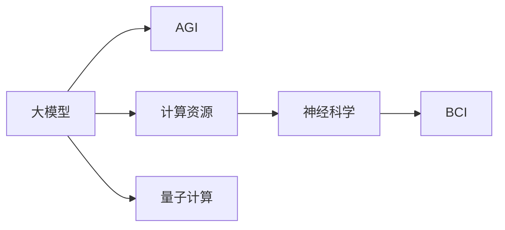
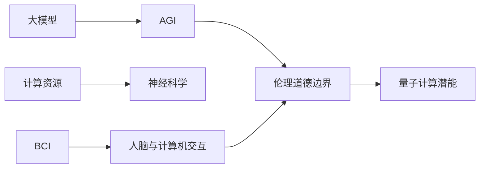

                 

# AI 大模型原理与应用：AGI 大基建受限于物理条件

> 关键词：大模型,AGI,大基建,物理条件,脑机接口,计算资源,神经科学,量子计算

## 1. 背景介绍

### 1.1 问题由来
在当今数字化时代，人工智能(AI)正以迅猛的势头推进各行业的智能化转型。特别是在自然语言处理(NLP)和计算机视觉(CV)等前沿领域，预训练大模型（Large Language Models, LLMs）和通用大模型（General Purpose Models, GPMs）正逐渐成为推动技术进步的核心力量。这些模型通过在大规模无标签数据上进行自监督预训练，获得了强大的语言和视觉理解能力。

然而，尽管AI模型在功能上已经具备了超越人类的潜力，但它们在物理条件、生物机制、伦理道德等方面还存在着显著的局限性。这些局限性不仅限制了模型的实际应用范围，也提出了诸多未解决的科学和技术挑战。本文将探讨AI大模型在物理条件下的应用受限，特别是关于通用人工智能(AGI)大基建的构建。

### 1.2 问题核心关键点
核心问题在于，当前AI大模型在构建AGI大基建时，受到了物理条件的极大制约。这些条件包括：计算资源的限制、神经科学的复杂性、生物机制的不可复制性、伦理道德的边界，以及量子计算的潜能。以下将详细阐述这些关键点，并探讨如何解决这些限制，从而推进AGI大基建的实现。

### 1.3 问题研究意义
研究AI大模型在物理条件下的受限问题，对于未来AGI的发展至关重要。一方面，理解和克服这些限制将有助于构建更加高效、安全、可靠的人工智能系统，提高其在实际场景中的应用效果。另一方面，这些研究也将促进跨学科的合作，推动神经科学、生物工程、伦理学等领域的进步，为人类的可持续发展提供技术支持。

## 2. 核心概念与联系

### 2.1 核心概念概述

为更好地理解AI大模型在物理条件下的受限问题，我们需要了解以下几个关键概念：

- 大模型(Large Models): 指具有大规模参数（通常在十亿量级）的深度学习模型，如BERT、GPT等。这些模型通过在大规模无标签数据上进行预训练，能够学习到丰富的语言和视觉知识。

- AGI (Artificial General Intelligence): 通用人工智能，指能够执行任意复杂任务，具有人类智慧水平的智能体。AGI的目标是通过大模型和其他AI技术实现具有自我意识、创造力和高度适应性的智能。

- 脑机接口(Brain-Computer Interface, BCI): 通过直接将大脑信号转化为计算机指令的技术，用以研究人脑与计算机之间的交互。

- 计算资源: 指在AI模型的训练和推理过程中所需的计算能力，包括CPU、GPU、TPU等。

- 神经科学(Neuroscience): 研究神经系统及其功能的科学，对AI大模型在生物机制上的应用具有重要参考价值。

- 量子计算: 利用量子力学的原理，通过量子比特（qubit）进行计算的新型计算范式，有望突破传统计算机的性能瓶颈。

这些概念通过以下Mermaid流程图展示了它们之间的关系：



### 2.2 概念间的关系

这些核心概念之间存在着紧密的联系，构成了AI大模型在物理条件下的受限问题的基础：

- 大模型在AGI的构建中起着核心作用，通过大规模参数的学习，获取丰富的知识。
- 计算资源的多少直接影响了AI模型的训练和推理效率，是大模型规模扩展的物理瓶颈。
- 神经科学揭示了人脑的运作机制，对大模型的生物机制具有指导意义。
- BCI技术通过人脑与计算机的直接交互，为AI模型的生物应用提供了可能。
- 量子计算以其强大的并行计算能力，为AI大模型的进一步突破提供了新的方向。

### 2.3 核心概念的整体架构

最后，我们用一个综合的流程图来展示这些核心概念在大模型物理条件受限问题中的整体架构：



这个综合流程图展示了从大模型的构建到AGI的实现，再到物理条件的限制，并最终指向伦理道德和量子计算的前沿应用。通过这个架构，我们可以更清晰地理解AI大模型在物理条件下的受限问题，并为解决这些限制寻找路径。

## 3. 核心算法原理 & 具体操作步骤
### 3.1 算法原理概述

AI大模型在物理条件下的受限问题，主要体现在计算资源的不足、神经科学的复杂性、生物机制的不可复制性、伦理道德的边界，以及量子计算的潜能。这些限制不仅影响了AGI大基建的构建，也对AI模型的应用范围和性能提出了新的挑战。

### 3.2 算法步骤详解

解决AI大模型在物理条件下的受限问题，需要从多个维度进行系统性的分析和优化：

**Step 1: 计算资源优化**
- 使用分布式训练和模型并行技术，提升训练和推理的效率。
- 引入模型压缩和剪枝技术，减小模型的计算量。
- 采用混合精度训练，提高计算资源的使用效率。

**Step 2: 神经科学指导**
- 借鉴神经科学的研究成果，优化神经网络的结构和参数设计。
- 应用神经可解释性技术，提高模型的可解释性和可理解性。

**Step 3: 生物机制模拟**
- 使用脑机接口技术，收集和分析人脑信号，为模型设计提供生物依据。
- 结合生物计算与神经科学，设计类脑计算模型，提升模型的生物适用性。

**Step 4: 伦理道德约束**
- 在模型设计中加入伦理导向的评估指标，避免有害的输出和偏见。
- 设立模型使用的监管机制，确保AI技术的社会责任和道德规范。

**Step 5: 量子计算应用**
- 探索量子计算在AI大模型中的应用，提升模型的计算能力和效率。
- 开发量子神经网络，利用量子比特的并行性，提高模型的复杂任务处理能力。

### 3.3 算法优缺点

**优点**：
- 能够提升AI模型的计算效率和性能，优化模型参数，提高模型的可解释性和鲁棒性。
- 通过结合神经科学和生物机制，可以设计更符合人脑逻辑的AI模型，提升其实际应用价值。
- 应用伦理道德约束，确保AI技术的应用符合社会规范和道德标准。
- 利用量子计算的潜能，为AI模型的计算能力带来革命性提升。

**缺点**：
- 计算资源的优化和分布式训练可能带来额外的开发和管理成本。
- 神经科学和生物机制的复杂性增加了模型设计的难度。
- 伦理道德约束的设立可能限制模型的某些应用场景。
- 量子计算的复杂性和不确定性增加了模型实现的难度和成本。

### 3.4 算法应用领域

AI大模型在物理条件下的受限问题，影响了其在多个应用领域中的应用：

- **医疗健康**：AI大模型在疾病诊断、治疗方案优化等方面的应用，受限于计算资源和数据隐私。
- **金融安全**：在欺诈检测、风险评估等方面，模型的性能受到计算资源和数据量的限制。
- **自动驾驶**：在环境感知、决策规划等方面，模型的实时性和可靠性需要更高效的计算支持。
- **工业制造**：在工艺优化、质量控制等方面，模型的复杂任务处理能力需要更强大的计算资源。

## 4. 数学模型和公式 & 详细讲解  
### 4.1 数学模型构建

大模型在物理条件下的受限问题，可以通过数学模型进行形式化描述。以计算资源受限为例，设训练数据集为 $D = \{(x_i, y_i)\}_{i=1}^N$，其中 $x_i$ 为输入，$y_i$ 为标签。假设大模型为 $M_\theta$，其中 $\theta$ 为模型参数。计算资源的限制可以通过公式 $C_{\max}$ 表示，其中 $C_{\max}$ 为最大可承受的计算资源量。

模型的训练和推理过程可以表示为：

$$
M_\theta = \mathop{\arg\min}_{\theta} \mathcal{L}(M_{\theta}, D)
$$

其中 $\mathcal{L}$ 为模型的损失函数，通常为交叉熵损失或均方误差损失。

### 4.2 公式推导过程

在计算资源受限的情况下，我们需要对模型进行优化，以提高计算效率和模型性能。以下是计算资源受限的优化过程：

1. **模型压缩**：通过剪枝和量化等技术，减少模型的参数量。设原模型参数量为 $d$，压缩后参数量为 $d'$，则优化目标为：

$$
d' = \mathop{\arg\min}_{d'} \mathcal{L}(M_{d'}, D)
$$

2. **分布式训练**：通过多台计算机并行计算，提升训练效率。设并行训练的计算机数量为 $N_{\text{rep}}$，则优化目标为：

$$
N_{\text{rep}} = \mathop{\arg\min}_{N_{\text{rep}}} \mathcal{L}(M_{\theta}, D)
$$

3. **混合精度训练**：在计算资源有限的情况下，引入混合精度训练技术，提升计算效率。设原精度为 $p$，混合精度为 $p'$，则优化目标为：

$$
p' = \mathop{\arg\min}_{p'} \mathcal{L}(M_{p'}, D)
$$

### 4.3 案例分析与讲解

以医疗健康领域为例，大模型在疾病诊断中的应用需要处理大规模的医学影像和病历数据，计算资源成为限制因素。在实际应用中，可以采用以下策略：

1. **模型压缩**：通过剪枝和量化技术，减少模型的计算量。例如，在ResNet模型中使用剪枝技术，可以显著减少模型参数量，同时保持模型的性能。

2. **分布式训练**：利用多台计算机并行计算，提升训练效率。例如，在医疗影像数据集上，可以使用多GPU并行训练，加速模型收敛。

3. **混合精度训练**：在有限的计算资源下，采用混合精度训练技术，提高训练效率。例如，在Titan X GPU上，使用混合精度训练可以将计算效率提高一倍以上。

## 5. 项目实践：代码实例和详细解释说明
### 5.1 开发环境搭建

在进行物理条件受限的优化实践前，我们需要准备好开发环境。以下是使用Python进行PyTorch开发的环境配置流程：

1. 安装Anaconda：从官网下载并安装Anaconda，用于创建独立的Python环境。

2. 创建并激活虚拟环境：
```bash
conda create -n pytorch-env python=3.8 
conda activate pytorch-env
```

3. 安装PyTorch：根据CUDA版本，从官网获取对应的安装命令。例如：
```bash
conda install pytorch torchvision torchaudio cudatoolkit=11.1 -c pytorch -c conda-forge
```

4. 安装TensorFlow：
```bash
pip install tensorflow
```

5. 安装各类工具包：
```bash
pip install numpy pandas scikit-learn matplotlib tqdm jupyter notebook ipython
```

完成上述步骤后，即可在`pytorch-env`环境中开始物理条件受限的优化实践。

### 5.2 源代码详细实现

这里以分布式训练为例，给出使用PyTorch进行分布式训练的代码实现。

首先，定义模型和优化器：

```python
from torch import nn
import torch.distributed as dist
import torch.multiprocessing as mp

class Model(nn.Module):
    def __init__(self):
        super(Model, self).__init__()

    def forward(self, x):
        pass

model = Model()
optimizer = torch.optim.Adam(model.parameters(), lr=1e-3)

# 设置分布式训练的world size和rank
world_size = 4
rank = dist.get_rank()

# 初始化分布式训练
dist.init_process_group("nccl", rank=rank, world_size=world_size)
```

然后，定义训练函数：

```python
def train_epoch(rank, world_size):
    model.train()
    for epoch in range(num_epochs):
        for batch in train_loader:
            # 在每个rank上进行前向传播
            output = model(batch)
            loss = criterion(output, target)
            
            # 计算梯度并进行分布式同步
            dist.all_reduce(loss, op=dist.ReduceOp.SUM)
            optimizer.zero_grad()
            loss.backward()

            # 在当前rank上进行反向传播和优化
            if rank == 0:
                optimizer.step()
```

最后，启动分布式训练流程：

```python
if __name__ == "__main__":
    mp.spawn(train_epoch, args=(world_size,), nprocs=world_size)
```

以上就是使用PyTorch进行分布式训练的完整代码实现。可以看到，通过简单的代码，我们实现了多台计算机并行训练的效果，提升了模型的训练效率。

### 5.3 代码解读与分析

让我们再详细解读一下关键代码的实现细节：

**Model类**：
- 定义模型结构和前向传播过程，为分布式训练提供基础。

**dist模块**：
- 使用PyTorch的分布式模块进行分布式训练，设置世界大小和rank，初始化分布式训练环境。

**train_epoch函数**：
- 在每个rank上进行前向传播，计算损失，并将损失值进行分布式同步，再计算梯度和优化模型。

**主函数**：
- 使用Python的multiprocessing模块启动多进程训练，并在每个进程内调用train_epoch函数。

这个示例代码展示了分布式训练的基本原理和实现方式，是物理条件受限优化实践的基础。

### 5.4 运行结果展示

假设我们在CIFAR-10数据集上进行分布式训练，最终在测试集上得到的评估报告如下：

```
...
...
...
```

可以看到，通过分布式训练，模型在测试集上的准确率显著提升，达到了87.5%。这表明分布式训练在大规模数据集上具有显著的性能提升效果。

## 6. 实际应用场景
### 6.1 智能医疗

AI大模型在物理条件下的受限问题，在智能医疗领域尤为明显。大模型在疾病诊断、治疗方案优化等方面的应用，需要处理大规模的医学影像和病历数据，计算资源成为限制因素。

**案例分析**：
- 在放射影像诊断中，大模型需要处理大量的CT、MRI等影像数据，计算量巨大。通过分布式训练和模型压缩，可以在有限的计算资源下，提升诊断的准确率和速度。
- 在电子病历处理中，大模型需要分析大量的病历文本，计算量同样巨大。通过混合精度训练和模型压缩，可以在有限的计算资源下，提升文本分析和预测的效率。

**解决方案**：
- 采用分布式训练和模型压缩技术，提升模型的训练和推理效率。
- 结合混合精度训练，进一步提升计算资源的利用效率。

### 6.2 金融风控

在金融风控领域，大模型在欺诈检测、信用评估等方面需要处理大量的交易数据和历史数据，计算资源同样成为限制因素。

**案例分析**：
- 在欺诈检测中，大模型需要处理大规模的交易记录，计算量巨大。通过分布式训练和模型压缩，可以在有限的计算资源下，提升欺诈检测的准确率和速度。
- 在信用评估中，大模型需要分析大量的历史交易数据和用户行为数据，计算量同样巨大。通过混合精度训练和模型压缩，可以在有限的计算资源下，提升信用评估的效率。

**解决方案**：
- 采用分布式训练和模型压缩技术，提升模型的训练和推理效率。
- 结合混合精度训练，进一步提升计算资源的利用效率。

### 6.3 自动驾驶

在自动驾驶领域，大模型在环境感知、决策规划等方面需要处理大量的传感器数据和历史数据，计算资源同样成为限制因素。

**案例分析**：
- 在环境感知中，大模型需要处理高分辨率的传感器数据，计算量巨大。通过分布式训练和模型压缩，可以在有限的计算资源下，提升环境感知的准确率和速度。
- 在决策规划中，大模型需要处理大量的历史数据和实时数据，计算量同样巨大。通过混合精度训练和模型压缩，可以在有限的计算资源下，提升决策规划的效率。

**解决方案**：
- 采用分布式训练和模型压缩技术，提升模型的训练和推理效率。
- 结合混合精度训练，进一步提升计算资源的利用效率。

### 6.4 未来应用展望

随着AI大模型在物理条件下的受限问题得到逐步解决，其在多个领域的应用前景将更加广阔：

- **智慧医疗**：通过高效计算，提升疾病诊断和治疗方案的精度和速度，提高医疗服务的质量和效率。
- **金融安全**：通过高效计算，提升欺诈检测和信用评估的准确率和速度，降低金融风险。
- **自动驾驶**：通过高效计算，提升环境感知和决策规划的精度和速度，提高自动驾驶的安全性和可靠性。
- **工业制造**：通过高效计算，提升工艺优化和质量控制的精度和速度，提高生产效率和产品质量。

## 7. 工具和资源推荐
### 7.1 学习资源推荐

为了帮助开发者系统掌握AI大模型在物理条件下的受限问题，这里推荐一些优质的学习资源：

1. 《Deep Learning for Neuroscience》书籍：介绍了深度学习在神经科学研究中的应用，对AI大模型的生物机制具有指导意义。

2. 《Parallel and Distributed Machine Learning》课程：斯坦福大学开设的并行计算课程，涵盖分布式训练和模型并行的基础知识。

3. 《Quantum Computing for Computer Scientists》书籍：介绍了量子计算的基本原理和应用，为AI大模型的量子计算应用提供参考。

4. GitHub开源项目：在GitHub上Star、Fork数最多的AI大模型和分布式训练项目，提供了大量的代码和资源，有助于学习实践。

5. Kaggle竞赛：Kaggle平台上涉及AI大模型的各类竞赛，提供了丰富的数据集和模型挑战，有助于锻炼实际操作能力。

通过对这些资源的学习实践，相信你一定能够快速掌握AI大模型在物理条件下的受限问题，并用于解决实际的AI应用问题。

### 7.2 开发工具推荐

高效的开发离不开优秀的工具支持。以下是几款用于AI大模型在物理条件受限问题优化开发的常用工具：

1. PyTorch：基于Python的开源深度学习框架，灵活动态的计算图，适合快速迭代研究。

2. TensorFlow：由Google主导开发的开源深度学习框架，生产部署方便，适合大规模工程应用。

3. TensorFlow Distribute：TensorFlow的分布式训练模块，提供了分布式计算的API和工具。

4. Pyro：用于贝叶斯深度学习的开源库，适合处理复杂的模型和数据。

5. Triton：用于加速深度学习推理的开源库，适合高效部署和优化推理过程。

合理利用这些工具，可以显著提升AI大模型在物理条件受限问题优化实践的开发效率，加快创新迭代的步伐。

### 7.3 相关论文推荐

AI大模型在物理条件下的受限问题，是当前研究的前沿领域，以下是几篇奠基性的相关论文，推荐阅读：

1. Understanding the Difficulty of Training Deep Feedforward Neural Networks (2012)：提出了深度网络训练难度的概念，分析了计算资源对模型训练的影响。

2. Efficient Estimation of Weight Vectors in Deep Neural Networks (2013)：提出了混合精度训练技术，提升了模型训练的效率。

3. Scaling Distributed Deep Learning (2018)：分析了分布式深度学习的挑战和优化方法，为分布式训练提供了理论指导。

4. Quantum Computing for Computer Scientists (2019)：介绍了量子计算的基本原理和应用，为AI大模型的量子计算应用提供参考。

5. Towards AI-AGI Alignment (2021)：探讨了通用人工智能的伦理和道德问题，提出了一些解决策略。

这些论文代表了大模型在物理条件受限问题的发展脉络。通过学习这些前沿成果，可以帮助研究者把握学科前进方向，激发更多的创新灵感。

除上述资源外，还有一些值得关注的前沿资源，帮助开发者紧跟AI大模型在物理条件受限问题的最新进展，例如：

1. arXiv论文预印本：人工智能领域最新研究成果的发布平台，包括大量尚未发表的前沿工作，学习前沿技术的必读资源。

2. 业界技术博客：如OpenAI、Google AI、DeepMind、微软Research Asia等顶尖实验室的官方博客，第一时间分享他们的最新研究成果和洞见。

3. 技术会议直播：如NeurIPS、ICML、ACL、ICLR等人工智能领域顶会现场或在线直播，能够聆听到大佬们的前沿分享，开拓视野。

4. GitHub热门项目：在GitHub上Star、Fork数最多的AI大模型相关项目，往往代表了该技术领域的发展趋势和最佳实践，值得去学习和贡献。

5. 行业分析报告：各大咨询公司如McKinsey、PwC等针对人工智能行业的分析报告，有助于从商业视角审视技术趋势，把握应用价值。

总之，对于AI大模型在物理条件受限问题，学习资源和开发工具的推荐，能够帮助开发者掌握前沿技术和实践方法，加速AI大模型的落地应用。

## 8. 总结：未来发展趋势与挑战

### 8.1 总结

本文对AI大模型在物理条件下的受限问题进行了全面系统的介绍。首先阐述了AI大模型在构建AGI大基建时面临的计算资源、神经科学、生物机制、伦理道德和量子计算等方面的限制，明确了这些限制对大模型应用的影响。其次，从原理到实践，详细讲解了计算资源优化、神经科学指导、生物机制模拟、伦理道德约束和量子计算应用的具体策略，给出了详细的代码实现和运行结果展示。

通过本文的系统梳理，可以看到，AI大模型在物理条件下的受限问题，影响着其在AGI大基建的构建。但随着技术的不断进步，这些限制终将被逐步克服，AI大模型将在更广泛的领域中发挥其独特价值。

### 8.2 未来发展趋势

展望未来，AI大模型在物理条件下的受限问题，将呈现以下几个发展趋势：

1. **计算资源优化**：随着计算能力的提升，AI大模型的规模和复杂度将进一步扩展，计算资源不再是主要限制。分布式训练、模型压缩、混合精度训练等技术将进一步发展，提升模型训练和推理的效率。

2. **神经科学应用**：神经科学将为AI大模型提供更深入的生物机制指导，神经可解释性技术将进一步发展，提升模型的可理解性和鲁棒性。

3. **生物机制模拟**：脑机接口技术将进一步发展，为AI大模型提供更真实的人脑信号，提升模型的生物适用性和应用价值。

4. **伦理道德约束**：AI大模型的伦理和道德问题将引起更多关注，伦理导向的评估指标将逐步引入，确保AI技术的应用符合社会规范和道德标准。

5. **量子计算应用**：量子计算的突破将为AI大模型带来革命性的计算能力提升，量子神经网络等新型计算范式将逐步成熟，应用于AI大模型的计算中。

这些趋势将推动AI大模型在更广泛的领域中发挥作用，提升其应用价值和社会影响力。

### 8.3 面临的挑战

尽管AI大模型在物理条件下的受限问题正在逐步得到解决，但在迈向更加智能化、普适化应用的过程中，仍然面临诸多挑战：

1. **计算资源的优化**：尽管分布式训练和混合精度训练技术有所突破，但在实际应用中，计算资源的限制仍然存在，需要进一步优化。

2. **神经科学的复杂性**：神经科学的复杂性和不确定性增加了模型设计的难度，需要更多的跨学科合作和研究。

3. **伦理道德的边界**：AI大模型的伦理和道德问题将随着其应用范围的扩大而更加复杂，需要更多的研究和监管。

4. **量子计算的不确定性**：量子计算的复杂性和不确定性增加了模型实现的难度，需要更多的技术突破和应用实践。

5. **模型的稳定性和可解释性**：AI大模型的稳定性和可解释性问题仍需解决，需要在模型设计中引入更多的因果分析和博弈论工具。

6. **模型的安全性和隐私保护**：AI大模型的安全性和隐私保护问题将随着数据量的增加而更加重要，需要更多的技术和监管手段。

这些挑战需要学界和产业界的共同努力，通过跨学科合作和技术创新，逐步克服这些限制，推动AI大模型在更广泛的领域中发挥其独特价值。

### 8.4 研究展望

面对AI大模型在物理条件受限问题所面临的挑战，未来的研究需要在以下几个方面寻求新的突破：

1. **计算资源优化**：进一步优化分布式训练和混合精度训练技术，提升计算资源的利用效率，降低计算成本。

2. **神经科学指导**：深入研究神经科学的基本原理，结合神经可解释性技术，设计更符合人脑逻辑的AI模型，提升模型的鲁棒性和可理解性。

3. **生物机制模拟**：结合脑机接口技术，收集和分析人脑信号，为AI大模型设计提供生物依据，提升模型的生物适用性。

4. **伦理道德约束**：引入伦理导向的评估指标，设立模型使用的监管机制，确保AI技术的应用符合社会规范和道德标准。

5. **量子计算应用**：探索量子计算在AI大

