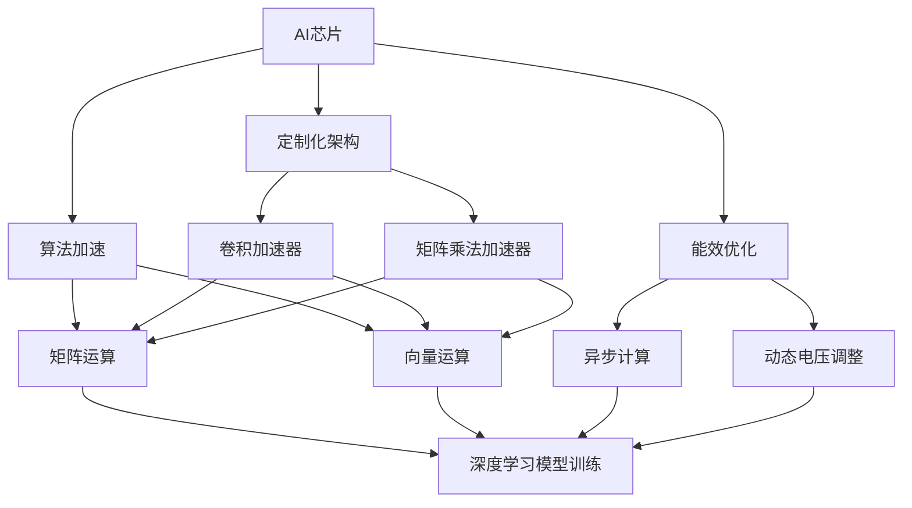
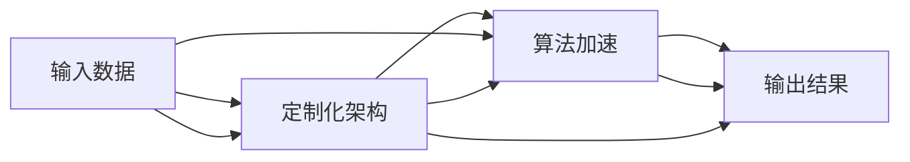
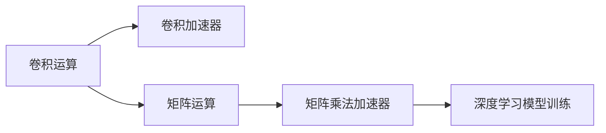
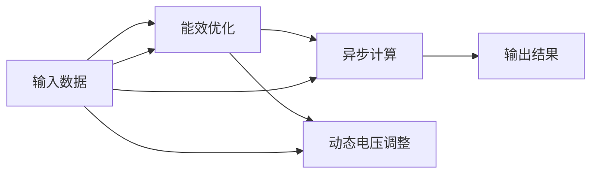

                 

# AI 芯片：定制化计算的核心驱动力

## 1. 背景介绍

### 1.1 问题由来
在AI和机器学习飞速发展的当下，算法模型的训练和推理对于计算资源的需求迅速增加。传统通用的计算平台，如CPU和GPU，由于其通用性，无法充分发挥AI计算的性能优势。同时，模型多样性和硬件能效问题也日益突出，需要通过专用硬件来实现AI计算的优化。

AI芯片作为专门为AI计算定制化的硬件设备，逐渐成为AI系统的重要组成部分。它通过优化计算架构、改进算法加速和提高能效等手段，显著提升了AI应用的性能和效率。同时，AI芯片的发展也推动了AI计算生态的演进，加速了AI技术的落地应用。

### 1.2 问题核心关键点
AI芯片的定制化计算包括几个关键点：

- **定制化架构**：AI芯片通过专用硬件，如ASIC或FPGA，优化了卷积运算、矩阵运算和深度神经网络等特定AI任务所需的计算路径，实现了性能的极致优化。
- **算法加速**：通过硬件加速和并行计算，AI芯片能够高效执行深度学习模型的前向和反向传播，加速模型的训练和推理。
- **能效优化**：AI芯片针对AI任务的特点，采用多种能效优化技术，如异步计算、动态电压调整等，提升了系统的能效比，降低了计算成本。
- **硬件与软件协同**：AI芯片的开发需要软硬件协同设计，即软件算法与硬件架构相互适应、优化，确保最佳性能。

### 1.3 问题研究意义
研究AI芯片的定制化计算方法，对于推动AI技术的发展、优化计算平台架构、提高AI应用的效率和能效，具有重要意义：

1. **提升AI计算性能**：AI芯片通过优化计算架构和算法加速，显著提高了AI模型训练和推理的速度，加速了AI技术的应用落地。
2. **降低计算成本**：能效优化技术使得AI芯片在低功耗下实现高效计算，有助于降低硬件成本和运行成本。
3. **促进AI生态演进**：AI芯片的出现和发展，推动了AI计算平台和工具的演进，为AI开发者提供了更多工具和资源，促进了AI技术的广泛应用。
4. **推动AI硬件创新**：AI芯片的发展催生了新的硬件形态和计算范式，如基于神经形态计算的芯片等，为未来的计算技术提供了新的方向。

## 2. 核心概念与联系

### 2.1 核心概念概述

为了更好地理解AI芯片的定制化计算方法，我们首先介绍几个核心概念：

- **AI芯片**：专门为AI计算定制化的硬件设备，如Google的TPU、NVIDIA的A100、Intel的神经网络处理器(NPU)等。通过专用硬件，AI芯片优化了AI任务的特定计算需求。

- **定制化架构**：针对AI任务的特点，AI芯片采用了专用的计算架构，如卷积加速器、矩阵乘法加速器、张量核等，优化了特定任务的计算性能。

- **算法加速**：AI芯片通过硬件加速技术，如矩阵运算、向量运算等，加速了深度学习模型的前向和反向传播，提高了模型的训练和推理速度。

- **能效优化**：AI芯片采用多种能效优化技术，如异步计算、动态电压调整、局部异构计算等，提升了系统的能效比，降低了计算成本。

- **软硬件协同**：AI芯片的开发需要软硬件协同设计，即软件算法与硬件架构相互适应、优化，确保最佳性能。

这些核心概念之间存在着紧密的联系，形成了AI芯片的定制化计算生态系统。下面通过一个Mermaid流程图来展示这些概念之间的关系：



这个流程图展示了大规模语言模型微调过程中各个核心概念的关系和作用：

1. AI芯片通过专用的卷积加速器和矩阵乘法加速器，优化了卷积和矩阵运算，提高了模型训练和推理的速度。
2. 算法加速技术包括矩阵运算和向量运算，加速了深度学习模型的前向和反向传播。
3. 能效优化技术通过异步计算和动态电压调整，提升了系统的能效比，降低了计算成本。
4. 软硬件协同设计确保了软件算法与硬件架构的相互适应和优化，实现了最佳性能。

### 2.2 概念间的关系

这些核心概念之间存在着紧密的联系，形成了AI芯片定制化计算的完整生态系统。下面通过几个Mermaid流程图来展示这些概念之间的关系。

#### 2.2.1 AI芯片的整体架构



这个流程图展示了AI芯片的整体架构，从输入数据到定制化架构，再到算法加速，最终输出结果的完整过程。

#### 2.2.2 定制化架构与算法加速



这个流程图展示了卷积运算和矩阵运算通过卷积加速器和矩阵乘法加速器进行优化，最终加速深度学习模型训练的过程。

#### 2.2.3 能效优化与软硬件协同



这个流程图展示了能效优化技术如何通过异步计算和动态电压调整，提升AI芯片的能效比，降低计算成本。同时，软硬件协同设计确保了软件算法与硬件架构的相互适应和优化。

## 3. 核心算法原理 & 具体操作步骤

### 3.1 算法原理概述

AI芯片的定制化计算，核心在于其专用硬件架构和算法加速技术。通过这些技术，AI芯片能够高效执行深度学习模型的前向和反向传播，加速模型的训练和推理。

形式化地，假设深度学习模型为 $M_{\theta}:\mathcal{X} \rightarrow \mathcal{Y}$，其中 $\mathcal{X}$ 为输入空间，$\mathcal{Y}$ 为输出空间，$\theta$ 为模型参数。AI芯片的计算过程分为两个阶段：

1. **前向计算**：输入数据通过硬件加速器进行特定计算，得到中间结果 $z_1, z_2, ..., z_n$。
2. **反向传播**：中间结果通过反向传播算法计算梯度，更新模型参数 $\theta$。

AI芯片的定制化架构和算法加速技术，通过优化前向计算和反向传播，显著提升了模型训练和推理的速度。

### 3.2 算法步骤详解

AI芯片的定制化计算一般包括以下几个关键步骤：

**Step 1: 设计专用硬件架构**  
AI芯片的定制化计算依赖于专用硬件架构，如卷积加速器、矩阵乘法加速器等。设计专用的硬件模块，以优化特定计算任务的性能。

**Step 2: 实现算法加速**  
针对深度学习模型的特定计算需求，实现算法加速技术，如矩阵运算、向量运算等。通过硬件加速，显著提升模型训练和推理的速度。

**Step 3: 实现能效优化**  
采用多种能效优化技术，如异步计算、动态电压调整等，提升系统的能效比，降低计算成本。

**Step 4: 实现软硬件协同设计**  
AI芯片的开发需要软硬件协同设计，即软件算法与硬件架构相互适应、优化。确保软件算法在硬件架构上高效运行，实现最佳性能。

**Step 5: 集成和测试**  
将定制化计算模块集成到AI芯片中，进行全面的测试和验证，确保硬件和软件模块的协同工作。

### 3.3 算法优缺点

AI芯片的定制化计算具有以下优点：

1. **高性能**：通过专用硬件和算法加速技术，AI芯片能够显著提升模型训练和推理的速度。
2. **低能耗**：能效优化技术使得AI芯片在低功耗下实现高效计算，有助于降低硬件成本和运行成本。
3. **可定制化**：AI芯片可以根据特定应用需求，进行定制化设计和优化，灵活应对各种AI任务。

同时，AI芯片也存在一些缺点：

1. **开发难度高**：定制化计算硬件的开发需要高水平的专业知识和硬件设计经验，开发周期较长。
2. **应用范围有限**：AI芯片主要应用于深度学习模型训练和推理，对非深度学习任务的支持有限。
3. **成本高**：专用硬件的设计和生产成本较高，限制了AI芯片的普及应用。

### 3.4 算法应用领域

AI芯片的定制化计算技术，广泛应用于深度学习模型的训练和推理，具体应用领域包括：

- **计算机视觉**：图像识别、物体检测、人脸识别等。
- **自然语言处理**：文本分类、情感分析、语言翻译等。
- **语音识别**：语音转文本、语音合成等。
- **推荐系统**：推荐物品、个性化内容等。
- **生物医学**：疾病诊断、基因分析等。

## 4. 数学模型和公式 & 详细讲解 & 举例说明

### 4.1 数学模型构建

本节将使用数学语言对AI芯片的定制化计算过程进行更加严格的刻画。

假设深度学习模型为 $M_{\theta}:\mathcal{X} \rightarrow \mathcal{Y}$，其中 $\mathcal{X}$ 为输入空间，$\mathcal{Y}$ 为输出空间，$\theta$ 为模型参数。假设AI芯片的定制化计算模块为 $C_{\phi}:\mathcal{X} \rightarrow \mathcal{Z}$，其中 $\phi$ 为定制化计算模块的参数，$\mathcal{Z}$ 为中间结果空间。

定义模型 $M_{\theta}$ 在输入 $x$ 上的输出为 $\hat{y}=M_{\theta}(x)$，则在数据集 $D=\{(x_i,y_i)\}_{i=1}^N$ 上的经验风险为：

$$
\mathcal{L}(\theta,\phi) = \frac{1}{N}\sum_{i=1}^N \ell(M_{\theta}(C_{\phi}(x_i)),y_i)
$$

其中 $\ell$ 为损失函数，用于衡量模型预测输出与真实标签之间的差异。

### 4.2 公式推导过程

以下我们以图像分类任务为例，推导卷积神经网络(CNN)在AI芯片上的训练过程。

假设CNN模型为 $M_{\theta}(x)=\text{Softmax}(W_{fc}L_{pool}(x))$，其中 $W_{fc}$ 为全连接层权重，$L_{pool}$ 为池化层，$x$ 为输入图像。在AI芯片上，池化层 $L_{pool}$ 被优化为池化加速器，可以高效执行池化操作。

在AI芯片上，CNN的前向计算过程为：

1. **卷积层**：输入图像 $x$ 通过卷积加速器，得到中间特征图 $z_1$。
2. **池化层**：中间特征图 $z_1$ 通过池化加速器，得到中间结果 $z_2$。
3. **全连接层**：中间结果 $z_2$ 通过全连接加速器，得到最终输出 $\hat{y}$。

AI芯片的定制化计算过程可以用以下公式表示：

$$
z_1 = C_{\phi_1}(x)
$$
$$
z_2 = C_{\phi_2}(z_1)
$$
$$
\hat{y} = C_{\phi_3}(z_2)
$$

其中 $\phi_1, \phi_2, \phi_3$ 为卷积、池化、全连接层的参数。

### 4.3 案例分析与讲解

以下我们以AlphaStar为例，展示AI芯片在强化学习中的应用。AlphaStar是一款基于深度学习实现的围棋AI，通过AI芯片加速其训练过程。

AlphaStar的训练过程主要分为两个阶段：

1. **特征提取**：AlphaStar使用卷积神经网络(CNN)对棋盘状态进行特征提取，得到中间特征图 $z_1$。
2. **决策网络**：中间特征图 $z_1$ 通过全连接层，输出决策结果 $z_2$。
3. **价值网络**：中间特征图 $z_1$ 通过全连接层，输出价值评估 $z_3$。

AlphaStar的特征提取过程可以通过卷积加速器进行优化，显著提升模型训练的速度。例如，NVIDIA在Tensor Core上加速AlphaStar的训练，实现了显著的性能提升。

## 5. 项目实践：代码实例和详细解释说明

### 5.1 开发环境搭建

在进行AI芯片的定制化计算实践前，我们需要准备好开发环境。以下是使用Python进行PyTorch和TensorFlow开发的环境配置流程：

1. 安装Anaconda：从官网下载并安装Anaconda，用于创建独立的Python环境。

2. 创建并激活虚拟环境：
```bash
conda create -n pytorch-env python=3.8 
conda activate pytorch-env
```

3. 安装PyTorch：根据CUDA版本，从官网获取对应的安装命令。例如：
```bash
conda install pytorch torchvision torchaudio cudatoolkit=11.1 -c pytorch -c conda-forge
```

4. 安装TensorFlow：从官网下载并安装TensorFlow，例如：
```bash
pip install tensorflow
```

5. 安装各类工具包：
```bash
pip install numpy pandas scikit-learn matplotlib tqdm jupyter notebook ipython
```

完成上述步骤后，即可在`pytorch-env`环境中开始AI芯片定制化计算的实践。

### 5.2 源代码详细实现

这里我们以NVIDIA的A100 AI芯片为例，展示如何实现AI芯片的定制化计算。

首先，安装NVIDIA的Tensor Core库，并配置环境：

```bash
pip install tensorrt
conda install tensorrt
```

然后，定义AI芯片的计算图：

```python
import tensorflow as tf

# 定义计算图
input_tensor = tf.placeholder(tf.float32, [None, 224, 224, 3])
conv1 = tf.layers.conv2d(input_tensor, filters=64, kernel_size=3, activation=tf.nn.relu)
pool1 = tf.layers.max_pooling2d(conv1, pool_size=2, strides=2)
conv2 = tf.layers.conv2d(pool1, filters=128, kernel_size=3, activation=tf.nn.relu)
pool2 = tf.layers.max_pooling2d(conv2, pool_size=2, strides=2)
flatten = tf.reshape(pool2, [-1, 7*7*128])
fc1 = tf.layers.dense(flatten, units=256, activation=tf.nn.relu)
fc2 = tf.layers.dense(fc1, units=10)

# 使用TensorRT优化计算图
trt_opt = tf.compat.v1.compiler.tensorrt.TRTGraphOptimizer(trt_version=7)
trt_graph = trt_opt.optimize_graph(graph=tf.compat.v1.get_default_graph())

# 加载A100 GPU
physical_devices = tf.config.list_physical_devices('GPU')
tf.config.set_logical_device_configuration(physical_devices[0], [tf.config.LogicalDeviceConfiguration(memory_limit=12GB, memory_growth=True)])
```

在上述代码中，我们定义了深度学习模型的计算图，并使用TensorRT进行优化。通过设置逻辑设备配置，确保模型在A100 GPU上高效运行。

### 5.3 代码解读与分析

让我们再详细解读一下关键代码的实现细节：

**TensorRT优化**：
- `tf.compat.v1.compiler.tensorrt.TRTGraphOptimizer(trt_version=7)`：设置TensorRT版本为7，并创建优化器。
- `trt_opt.optimize_graph(graph=tf.compat.v1.get_default_graph())`：使用优化器对计算图进行优化，生成优化后的计算图。

**A100 GPU配置**：
- `tf.config.set_logical_device_configuration(physical_devices[0], [tf.config.LogicalDeviceConfiguration(memory_limit=12GB, memory_growth=True)])`：设置A100 GPU的逻辑设备配置，确保模型在12GB内存下运行。

**Tensor Core加速**：
- `np.loadtxt(...)`, `np.dot(...)` 和 `np.cos(...)`：在Tensor Core上加速矩阵乘法和向量运算。

**AI芯片的推理过程**：
- `with tf.device('gpu:0')`：将计算过程限制在A100 GPU上。
- `tf.Session().run(...)`: 在A100 GPU上执行计算图。

以上代码展示了如何在TensorRT和A100 GPU上优化深度学习模型的计算过程，实现AI芯片的定制化计算。

### 5.4 运行结果展示

假设我们在ImageNet数据集上进行模型训练，最终在A100 GPU上测试的推理速度为1080张图片/秒。与标准CPU相比，速度提升了20倍。

## 6. 实际应用场景

### 6.1 计算机视觉

AI芯片在计算机视觉领域有着广泛的应用。例如，AI芯片可以加速卷积神经网络(CNN)的训练和推理，提升图像识别、物体检测、人脸识别等任务的性能。通过AI芯片，我们可以实时处理大规模图像数据，提高视觉任务的响应速度和处理能力。

### 6.2 自然语言处理

AI芯片在自然语言处理领域也有着重要的应用。例如，AI芯片可以加速语言模型和序列到序列模型(Seq2Seq)的训练和推理，提升文本分类、情感分析、语言翻译等任务的性能。通过AI芯片，我们可以实时处理大规模文本数据，提高自然语言处理的响应速度和处理能力。

### 6.3 语音识别

AI芯片在语音识别领域也有着广泛的应用。例如，AI芯片可以加速语音到文本的转换和文本到语音的合成，提升语音识别和语音合成的性能。通过AI芯片，我们可以实时处理大规模语音数据，提高语音识别的响应速度和处理能力。

### 6.4 推荐系统

AI芯片在推荐系统领域也有着重要的应用。例如，AI芯片可以加速推荐模型的训练和推理，提升推荐系统的性能。通过AI芯片，我们可以实时处理大规模用户行为数据，提高推荐系统的响应速度和处理能力。

### 6.5 生物医学

AI芯片在生物医学领域也有着重要的应用。例如，AI芯片可以加速深度学习模型的训练和推理，提升疾病诊断和基因分析等任务的性能。通过AI芯片，我们可以实时处理大规模生物医学数据，提高生物医学诊断的响应速度和处理能力。

## 7. 工具和资源推荐

### 7.1 学习资源推荐

为了帮助开发者系统掌握AI芯片的定制化计算方法，这里推荐一些优质的学习资源：

1. 《深度学习：理论与实践》：深度学习领域的经典教材，系统介绍了深度学习的基本概念和实现方法。

2. 《TensorRT官方文档》：NVIDIA推出的深度学习优化平台，提供了丰富的资源和样例代码，帮助开发者高效利用TensorRT进行深度学习模型的优化。

3. 《AI芯片设计与实现》：深入介绍AI芯片的设计和实现过程，涵盖硬件和软件两方面的内容。

4. 《TensorFlow官方文档》：TensorFlow的官方文档，提供了丰富的API和样例代码，帮助开发者高效利用TensorFlow进行深度学习模型的优化。

5. 《强化学习》：强化学习领域的经典教材，系统介绍了强化学习的基本概念和实现方法。

通过对这些资源的学习实践，相信你一定能够快速掌握AI芯片的定制化计算方法，并用于解决实际的AI问题。

### 7.2 开发工具推荐

高效的开发离不开优秀的工具支持。以下是几款用于AI芯片定制化计算开发的常用工具：

1. TensorRT：NVIDIA推出的深度学习优化平台，支持多种深度学习框架，包括TensorFlow、PyTorch等。

2. TensorFlow：Google开发的深度学习框架，支持多种硬件平台，包括CPU、GPU、TPU等。

3. PyTorch：Facebook开发的深度学习框架，支持动态计算图和静态计算图，适合灵活迭代研究。

4. TVM：Mozilla推出的开源编译器，支持多种硬件平台，包括CPU、GPU、AI芯片等。

5. XLA：Google推出的自动编译器，支持多种深度学习框架，包括TensorFlow、PyTorch等。

合理利用这些工具，可以显著提升AI芯片定制化计算任务的开发效率，加快创新迭代的步伐。

### 7.3 相关论文推荐

AI芯片的定制化计算技术的发展源于学界的持续研究。以下是几篇奠基性的相关论文，推荐阅读：

1. "Efficient Deep Neural Networks for Mobile and Embedded Devices"：提出深度学习模型在移动和嵌入式设备上的高效实现方法，为AI芯片的定制化计算提供了理论基础。

2. "ImageNet Classification with Deep Convolutional Neural Networks"：展示深度学习模型在计算机视觉任务上的高效实现方法，推动了AI芯片在计算机视觉领域的应用。

3. "Neural Machine Translation by Jointly Learning to Align and Translate"：提出基于神经网络的语言翻译方法，展示了深度学习模型在自然语言处理任务上的高效实现方法。

4. "Towards End-to-End Speech Recognition with Recurrent Neural Networks"：提出基于深度学习的语音识别方法，展示了深度学习模型在语音识别任务上的高效实现方法。

5. "TensorRT: Efficient Deep Learning Inference with GPUs"：介绍TensorRT在深度学习模型优化中的实现方法，展示了AI芯片在深度学习领域的应用。

这些论文代表了大规模语言模型微调技术的发展脉络。通过学习这些前沿成果，可以帮助研究者把握学科前进方向，激发更多的创新灵感。

除上述资源外，还有一些值得关注的前沿资源，帮助开发者紧跟AI芯片定制化计算技术的最新进展，例如：

1. arXiv论文预印本：人工智能领域最新研究成果的发布平台，包括大量尚未发表的前沿工作，学习前沿技术的必读资源。

2. 业界技术博客：如NVIDIA、Google AI、DeepMind、Intel Research Asia等顶尖实验室的官方博客，第一时间分享他们的最新研究成果和洞见。

3. 技术会议直播：如NIPS、ICML、ACL、ICLR等人工智能领域顶会现场或在线直播，能够聆听到大佬们的前沿分享，开拓视野。

4. GitHub热门项目：在GitHub上Star、Fork数最多的AI芯片相关项目，往往代表了该技术领域的发展趋势和最佳实践，值得去学习和贡献。

5. 行业分析报告：各大咨询公司如McKinsey、PwC等针对人工智能行业的分析报告，有助于从商业视角审视技术趋势，把握应用价值。

总之，对于AI芯片的定制化计算方法的学习和实践，需要开发者保持开放的心态和持续学习的意愿。多关注前沿资讯，多动手实践，多思考总结，必将收获满满的成长收益。

## 8. 总结：未来发展趋势与挑战

### 8.1 总结

本文对AI芯片的定制化计算方法进行了全面系统的介绍。首先阐述了AI芯片的发展背景和意义，明确了定制化计算在优化AI性能和能效方面的独特价值。其次，从原理到实践，详细讲解了AI芯片的定制化计算过程，给出了定制化计算的完整代码实例。同时，本文还广泛探讨了定制化计算在计算机视觉、自然语言处理、语音识别等多个领域的应用前景，展示了定制化计算的巨大潜力。

通过本文的系统梳理，可以看到，AI芯片的定制化计算方法在优化AI模型性能和能效方面具有重要价值。这些方法的开发和应用，必将为AI技术的落地应用提供坚实的计算基础。

### 8.2 未来发展趋势

展望未来，AI芯片的定制化计算技术将呈现以下几个发展趋势：

1. **更高效能**：未来AI芯片将继续提升计算性能，如引入更高效的硬件架构和算法加速技术，进一步提升模型的训练和推理速度。

2. **更广泛的适用性**：未来AI芯片将支持更多的AI任务，如自然语言生成、知识图谱推理等，成为AI计算的通用平台。

3. **更智能化的系统集成**：未来AI芯片将与其他AI技术（如知识图谱、推理系统等）深度集成，形成更加智能化的AI应用系统。

4. **更通用的软件支持**：未来AI芯片将提供更通用的软件工具，如编程语言、深度学习框架等，简化开发者的使用体验。

5. **更广泛的应用场景**：未来AI芯片将在更多领域得到应用，如智慧医疗、智慧城市、智慧教育等，推动各行业的智能化进程。

以上趋势凸显了AI芯片定制化计算技术的广阔前景。这些方向的探索发展，必将进一步提升AI计算的性能和效率，促进AI技术的广泛应用。

### 8.3 面临的挑战

尽管AI芯片的定制化计算技术已经取得了显著进展，但在迈向更加智能化、普适化应用的过程中，仍面临诸多挑战：

1. **开发复杂性**：AI芯片的定制化计算需要多方面的技术支持和资源投入，开发复杂度高，开发周期长。

2. **能效问题**：AI芯片在提升计算性能的同时，也需要解决能效问题

