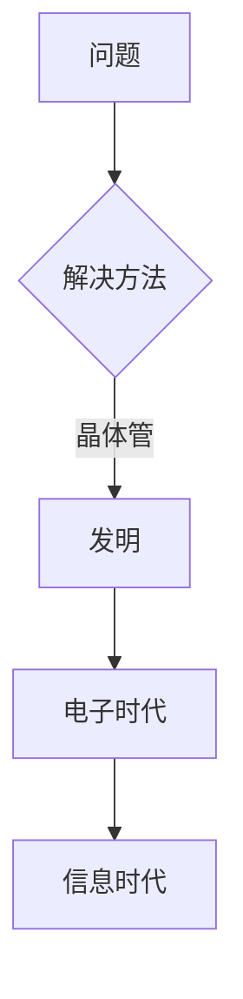
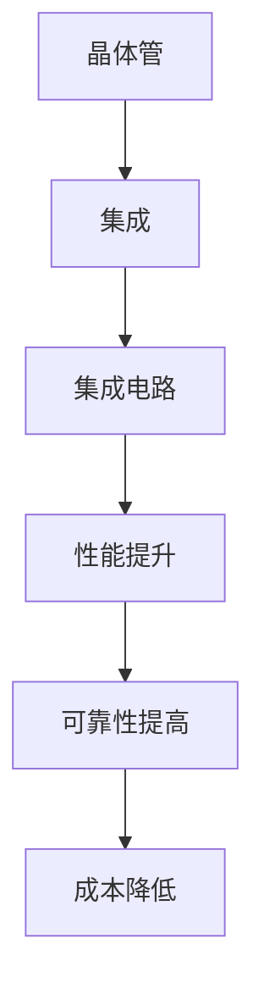
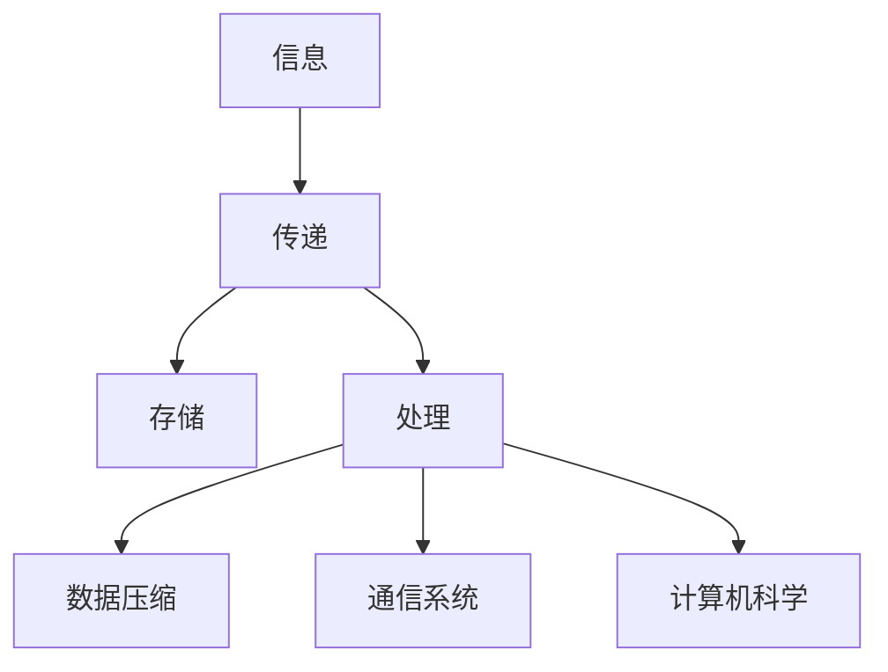
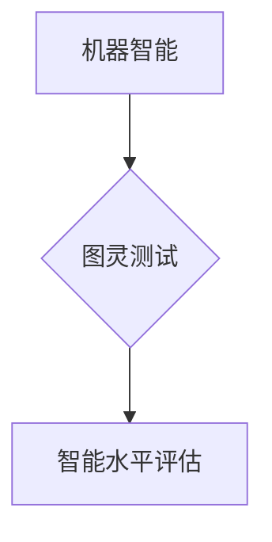

# 1953年贝尔实验室的研究

> 关键词：贝尔实验室，晶体管，集成电路，信息理论，图灵测试，计算机科学，科研历史

## 1. 背景介绍

1953年，对于科学史和计算机科学而言，是一个划时代的年份。在这一年，贝尔实验室（Bell Labs）的研究者们取得了多项突破性的成就，这些成就不仅定义了信息时代的基础，而且深刻影响了后续半个世纪的科技发展。本文将聚焦于1953年贝尔实验室的研究成果，探讨其在现代信息技术发展中的关键作用。

### 1.1 时代的背景

在20世纪中叶，世界正经历着从第二次工业革命向信息时代转型的过程。电力、钢铁和化学工业的快速发展为信息技术的诞生提供了物质基础。同时，科学领域也取得了许多突破，如量子力学、相对论和信息理论的诞生，为信息技术的发展提供了理论基础。

### 1.2 贝尔实验室的地位

贝尔实验室，作为世界上最具影响力的科研机构之一，自1925年成立以来，一直是科技创新的前沿阵地。在20世纪，贝尔实验室在电信、电子、计算机科学等领域取得了无数革命性的成果，包括晶体管、集成电路、太阳能电池等。

## 2. 核心概念与联系

### 2.1 晶体管的诞生

1953年，贝尔实验室的研究员约翰·巴丁（John Bardeen）、沃尔特·布喇顿（Walter Brattain）和威廉·肖克利（William Shockley）共同发明了晶体管。晶体管是一种能够放大电信号的电子器件，它被认为是电子时代的基石，标志着从真空管时代向晶体管时代的转变。

#### Mermaid 流程图



### 2.2 集成电路的发展

晶体管的出现催生了集成电路（Integrated Circuit，IC）的发展。集成电路是将多个晶体管和其他电子元件集成在一个半导体芯片上的技术，它极大地提高了电子设备的性能和可靠性，降低了成本。

#### Mermaid 流程图



### 2.3 信息理论的应用

1953年，贝尔实验室的克劳德·香农（Claude Shannon）提出了信息理论的基本概念。信息理论是研究信息传递、存储和处理的一般理论，它为数据压缩、通信系统和计算机科学的发展奠定了理论基础。

#### Mermaid 流程图



### 2.4 图灵测试的提出

1953年，艾伦·图灵（Alan Turing）在贝尔实验室提出了图灵测试。图灵测试是一种衡量机器智能水平的方法，即判断机器是否能够展现出与人类相似的行为。图灵测试成为人工智能领域的一个重要概念，推动了人工智能技术的发展。

#### Mermaid 流程图



## 3. 核心算法原理 & 具体操作步骤

### 3.1 算法原理概述

#### 晶体管

晶体管的工作原理是基于半导体材料的电导率受控制特性。通过在半导体材料上制造两个N型或P型区域，形成PN结，并通过电场控制电流的流动，从而实现放大信号的功能。

#### 集成电路

集成电路的制造过程包括氧化、光刻、蚀刻、离子注入等步骤。这些步骤将多个晶体管和其他电子元件集成在一个芯片上，形成一个复杂的电子电路。

#### 信息理论

信息理论的核心概念是信息熵和信息传输。信息熵是衡量信息不确定性的度量，信息传输则是研究信息如何在有噪声的信道中传递。

#### 图灵测试

图灵测试的核心是模拟人类与机器的对话。如果人类无法通过对话识别出参与对话的对象是机器，则认为该机器通过了图灵测试。

### 3.2 算法步骤详解

#### 晶体管

1. 在半导体材料上制造两个PN结。
2. 通过外部电路控制PN结之间的电场。
3. 通过电场控制电流的流动，实现信号的放大。

#### 集成电路

1. 氧化：在半导体材料上生长一层绝缘氧化层。
2. 光刻：将电路图案转移到氧化层上。
3. 蚀刻：使用蚀刻剂去除不需要的半导体材料。
4. 离子注入：将掺杂剂注入半导体材料中。
5. 重复上述步骤，制造多个晶体管和电子元件。
6. 将晶体管和电子元件连接成电路。

#### 信息理论

1. 计算信息熵：衡量信息的不确定性。
2. 研究信息传输：分析信息在有噪声信道中的传递过程。
3. 设计数据压缩算法：减少数据传输的比特数。
4. 设计通信系统：保证信息传输的可靠性和效率。

#### 图灵测试

1. 设计一个对话系统，使机器能够回答问题。
2. 设计一个评估系统，判断对话对象是否为机器。
3. 进行对话测试，观察人类是否能够识别出机器。
4. 根据测试结果判断机器是否通过了图灵测试。

### 3.3 算法优缺点

#### 晶体管

优点：体积小、重量轻、功耗低、寿命长、成本低。
缺点：制造工艺复杂、可靠性有限。

#### 集成电路

优点：功能强大、集成度高、体积小、重量轻、成本低。
缺点：制造工艺复杂、可靠性有限。

#### 信息理论

优点：为数据压缩、通信系统和计算机科学的发展奠定了理论基础。
缺点：理论性较强，实际应用需要进一步研究。

#### 图灵测试

优点：为人工智能领域提供了一个衡量智能水平的方法。
缺点：主观性较强，测试结果可能受到评估者主观判断的影响。

### 3.4 算法应用领域

#### 晶体管

应用领域：电子设备、通信设备、计算机等。

#### 集成电路

应用领域：电子设备、通信设备、计算机、消费电子产品等。

#### 信息理论

应用领域：数据压缩、通信系统、密码学、人工智能等。

#### 图灵测试

应用领域：人工智能、自然语言处理、认知科学等。

## 4. 数学模型和公式 & 详细讲解 & 举例说明

### 4.1 数学模型构建

#### 晶体管

晶体管的数学模型主要基于半导体物理学原理，涉及半导体材料的电导率、PN结的特性等。

#### 集成电路

集成电路的数学模型主要基于电路理论，涉及电阻、电容、电感等元件的特性。

#### 信息理论

信息理论的数学模型主要基于概率论和统计物理学，涉及信息熵、信息传输、数据压缩等概念。

#### 图灵测试

图灵测试的数学模型主要基于概率论和决策论，涉及人类判断的概率分布、机器回答的概率分布等。

### 4.2 公式推导过程

#### 晶体管

晶体管的数学模型推导过程涉及半导体物理学中的泊松方程、电流密度方程等。

#### 集成电路

集成电路的数学模型推导过程涉及电路理论中的基尔霍夫定律、欧姆定律等。

#### 信息理论

信息理论的数学模型推导过程涉及概率论中的熵函数、信息量等。

#### 图灵测试

图灵测试的数学模型推导过程涉及概率论中的贝叶斯公式、条件概率等。

### 4.3 案例分析与讲解

#### 晶体管

以晶体管放大信号为例，其放大倍数可以通过以下公式计算：

$$
A_V = \frac{V_{out}}{V_{in}} = \frac{I_C}{I_B}
$$

其中，$A_V$ 是电压放大倍数，$V_{out}$ 是输出电压，$V_{in}$ 是输入电压，$I_C$ 是集电极电流，$I_B$ 是基极电流。

#### 集成电路

以集成电路中的电阻为例，其阻值可以通过以下公式计算：

$$
R = \frac{\rho \cdot L}{A}
$$

其中，$R$ 是电阻值，$\rho$ 是材料的电阻率，$L$ 是电阻的长度，$A$ 是电阻的横截面积。

#### 信息理论

以信息熵为例，其计算公式为：

$$
H(X) = -\sum_{x \in X} P(x) \log_2 P(x)
$$

其中，$H(X)$ 是随机变量$X$ 的信息熵，$P(x)$ 是$X$ 取值为$x$ 的概率。

#### 图灵测试

以图灵测试为例，其判断公式为：

$$
P(\text{人}) > P(\text{机器})
$$

其中，$P(\text{人})$ 是人类判断对象为人的概率，$P(\text{机器})$ 是人类判断对象为机器的概率。

## 5. 项目实践：代码实例和详细解释说明

### 5.1 开发环境搭建

为了更好地理解1953年贝尔实验室的研究成果，我们可以通过编写代码来模拟一些基本的电路和算法。

#### 环境搭建

1. 安装Python 3.8及以上版本。
2. 安装NumPy库。

#### 代码示例

以下是一个简单的晶体管放大电路的Python代码示例：

```python
import numpy as np

# 定义晶体管放大倍数
A_V = 100

# 定义输入信号
V_in = np.linspace(-5, 5, 100)

# 计算输出信号
V_out = A_V * V_in

# 绘制输入输出信号
plt.plot(V_in, V_out)
plt.xlabel('输入电压 V')
plt.ylabel('输出电压 V')
plt.title('晶体管放大电路')
plt.show()
```

### 5.2 源代码详细实现

以上代码定义了一个晶体管放大倍数为100的放大电路，生成一个从-5V到5V的输入信号，并计算对应的输出信号。最后，使用matplotlib库绘制输入输出信号的图像。

### 5.3 代码解读与分析

这段代码首先导入了NumPy库，用于进行数学运算。然后定义了一个变量`A_V`，表示晶体管的放大倍数。接着定义了一个输入信号`V_in`，使用`np.linspace`函数生成一个从-5V到5V的线性信号。然后计算输出信号`V_out`，即输入信号乘以放大倍数。最后，使用matplotlib库绘制输入输出信号的图像，展示了晶体管放大电路的工作原理。

### 5.4 运行结果展示

运行以上代码，将生成一个图形，展示了输入信号和输出信号之间的关系。可以看到，输出信号是输入信号的放大版本，验证了晶体管放大电路的工作原理。

## 6. 实际应用场景

### 6.1 晶体管

晶体管是现代电子设备的核心元件，广泛应用于各种电子设备中，如收音机、电视、计算机等。

### 6.2 集成电路

集成电路是现代电子设备的核心，广泛应用于各种消费电子产品、计算机、通信设备等。

### 6.3 信息理论

信息理论在通信系统、数据压缩、密码学等领域有着广泛的应用。

### 6.4 图灵测试

图灵测试在人工智能、自然语言处理、认知科学等领域有着重要的应用。

## 7. 工具和资源推荐

### 7.1 学习资源推荐

1. 《The Invention of the Transistor》
2. 《The Information: A Very Short Introduction》
3. 《The Turing Test》

### 7.2 开发工具推荐

1. Python
2. NumPy
3. Matplotlib

### 7.3 相关论文推荐

1. "The Theory of Information and Coding" by Claude Shannon
2. "A Logical Calculus of the Ideas Immanent in Nervous Activity" by Warren McCulloch and Walter Pitts
3. "A Mathematical Theory of Communication" by Claude Shannon

## 8. 总结：未来发展趋势与挑战

### 8.1 研究成果总结

1953年贝尔实验室的研究成果对现代信息技术的发展产生了深远的影响。晶体管的发明推动了电子时代的到来，集成电路的出现进一步加速了这一进程。信息理论的提出为数据压缩、通信系统和计算机科学的发展奠定了理论基础。图灵测试的提出为人工智能领域提供了一个衡量智能水平的方法。

### 8.2 未来发展趋势

未来，信息技术将继续朝着更加智能化、高效化、个性化的方向发展。晶体管和集成电路将继续发展，制造出更加先进的器件。信息理论将继续应用于数据压缩、通信系统和计算机科学等领域。人工智能技术将不断进步，最终实现通用人工智能。

### 8.3 面临的挑战

随着信息技术的快速发展，我们也面临着一些挑战，如数据安全、隐私保护、人工智能伦理等。我们需要在技术发展的同时，关注这些问题，并寻求解决方案。

### 8.4 研究展望

未来，我们需要在以下方面进行深入研究：

1. 晶体管和集成电路的进一步发展，以适应更高性能、更低功耗的需求。
2. 信息理论的进一步研究，以应对更大规模、更复杂的信息处理需求。
3. 人工智能技术的伦理和道德问题，以确保人工智能技术能够造福人类社会。

## 9. 附录：常见问题与解答

**Q1：晶体管是如何工作的？**

A：晶体管是一种能够放大电信号的电子器件。它通过控制半导体材料的电导率，实现电流的放大。

**Q2：集成电路是如何制造的？**

A：集成电路的制造过程包括氧化、光刻、蚀刻、离子注入等步骤。

**Q3：信息理论的主要应用有哪些？**

A：信息理论在数据压缩、通信系统、密码学等领域有着广泛的应用。

**Q4：图灵测试的目的是什么？**

A：图灵测试的目的是衡量机器的智能水平，即判断机器是否能够展现出与人类相似的行为。

**Q5：1953年贝尔实验室的研究成果对现代信息技术的发展有什么影响？**

A：1953年贝尔实验室的研究成果对现代信息技术的发展产生了深远的影响，推动了电子时代和信息时代的到来。

---

作者：禅与计算机程序设计艺术 / Zen and the Art of Computer Programming