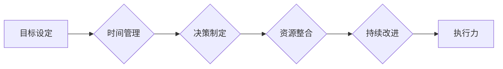

# 执行力：拉开人与人差距的关键

> 关键词：执行力，目标管理，时间管理，决策制定，个人成长，团队效能，目标导向，持续改进

## 1. 背景介绍

在当今快节奏、竞争激烈的社会环境中，执行力已成为区分优秀与平庸、成功与失败的关键因素。执行力强的个人和团队，能够在面对复杂多变的挑战时，迅速采取行动，高效完成任务，实现目标。本文将从执行力的重要性、核心概念、原理方法、实践案例等多个角度，深入探讨执行力如何成为拉开人与人差距的关键。

## 2. 核心概念与联系

### 2.1 执行力定义

执行力是指个人或团队在明确目标指导下，将计划转化为行动的能力。它包括目标设定、时间管理、决策制定、资源整合、持续改进等多个方面。

### 2.2 执行力与目标管理

目标管理是执行力的基础，一个清晰、具体、可衡量的目标是执行力的起点。目标管理包括设定目标、分解目标、执行目标、监控目标和评估目标等环节。

### 2.3 执行力与时间管理

时间管理是执行力的重要组成部分，高效的时间管理有助于提高工作效率，确保任务按时完成。时间管理包括时间规划、任务优先级排序、时间分配和自我监控等。

### 2.4 执行力与决策制定

决策制定是执行力过程中的关键环节，正确的决策能够确保行动的正确性。决策制定包括问题识别、方案评估、选择方案和实施方案等。

### 2.5 执行力与资源整合

资源整合是指协调各方资源，为执行目标提供保障。资源整合包括人力、物力、财力、信息等资源的调配。

### 2.6 执行力与持续改进

持续改进是指不断优化执行过程，提高执行效率。持续改进包括问题分析、原因查找、措施制定和效果评估等。

### 2.7 Mermaid 流程图



## 3. 核心算法原理 & 具体操作步骤

### 3.1 算法原理概述

执行力的核心算法原理可以概括为以下几个步骤：

1. **目标设定**：明确、具体、可衡量的目标设定是执行力的基础。
2. **时间管理**：合理规划时间，确保任务按时完成。
3. **决策制定**：根据目标制定合理的行动方案，并作出正确的决策。
4. **资源整合**：协调各方资源，为执行目标提供保障。
5. **持续改进**：不断优化执行过程，提高执行效率。

### 3.2 算法步骤详解

1. **目标设定**：
    - 明确目标：确定执行的目标，使其清晰、具体、可衡量。
    - 制定计划：根据目标制定详细的行动计划，包括时间、步骤、责任人等。
2. **时间管理**：
    - 时间规划：合理规划时间，确保任务按时完成。
    - 任务优先级排序：根据任务的紧急程度和重要性，对任务进行优先级排序。
    - 时间分配：将时间分配给各个任务，确保每个任务都有足够的时间完成。
    - 自我监控：定期检查时间使用情况，及时调整时间分配。
3. **决策制定**：
    - 问题识别：识别执行过程中遇到的问题。
    - 方案评估：评估不同方案的可行性、成本和风险。
    - 选择方案：根据评估结果，选择最优方案。
    - 实施方案：按照方案执行行动，并监控实施效果。
4. **资源整合**：
    - 人力：确定执行任务所需的人员，并分配任务。
    - 物力：准备执行任务所需的设备、材料等。
    - 财力：确保执行任务所需的资金。
    - 信息：收集、整理和传递相关信息，确保信息畅通。
5. **持续改进**：
    - 问题分析：分析执行过程中存在的问题。
    - 原因查找：查找问题产生的原因。
    - 措施制定：制定解决问题的措施。
    - 效果评估：评估解决问题的措施是否有效。

### 3.3 算法优缺点

**优点**：

- 提高执行力：明确的目标、合理的时间管理、正确的决策、有效的资源整合和持续的改进，都有助于提高执行力。
- 提升效率：通过优化执行过程，提高工作效率，确保任务按时完成。
- 提高满意度：完成任务、实现目标，有助于提高个人和团队的满意度。

**缺点**：

- 实施难度：执行力算法的实施需要个人和团队的共同努力，实施难度较大。
- 灵活性不足：执行力算法较为固定，难以适应快速变化的环境。
- 过于强调结果：过于关注结果，可能导致对过程和细节的忽视。

### 3.4 算法应用领域

执行力算法广泛应用于各个领域，如个人成长、团队效能、项目管理、企业管理等。

## 4. 数学模型和公式 & 详细讲解 & 举例说明

### 4.1 数学模型构建

执行力的数学模型可以构建为以下公式：

$$
E = f(T, M, D, R, I)
$$

其中，$E$ 表示执行力，$T$ 表示目标管理，$M$ 表示时间管理，$D$ 表示决策制定，$R$ 表示资源整合，$I$ 表示持续改进。

### 4.2 公式推导过程

1. **目标管理**：

$$
T = f(T_1, T_2, T_3, \ldots, T_n)
$$

其中，$T_1, T_2, T_3, \ldots, T_n$ 分别表示目标的设定、分解、执行、监控和评估。

2. **时间管理**：

$$
M = f(M_1, M_2, M_3, \ldots, M_m)
$$

其中，$M_1, M_2, M_3, \ldots, M_m$ 分别表示时间的规划、任务优先级排序、时间分配和自我监控。

3. **决策制定**：

$$
D = f(D_1, D_2, D_3, \ldots, D_p)
$$

其中，$D_1, D_2, D_3, \ldots, D_p$ 分别表示问题的识别、方案的评估、方案的选择和方案的执行。

4. **资源整合**：

$$
R = f(R_1, R_2, R_3, \ldots, R_q)
$$

其中，$R_1, R_2, R_3, \ldots, R_q$ 分别表示人力的分配、物力的准备、财力的确保和信息的管理。

5. **持续改进**：

$$
I = f(I_1, I_2, I_3, \ldots, I_r)
$$

其中，$I_1, I_2, I_3, \ldots, I_r$ 分别表示问题的分析、原因的查找、措施的制定和效果的评估。

### 4.3 案例分析与讲解

**案例**：某公司计划在三个月内完成一个重要项目的开发。

1. **目标管理**：
    - 目标设定：完成项目的开发，满足客户需求。
    - 目标分解：将项目分解为若干子任务，明确每个子任务的完成时间和责任人。
    - 目标执行：按照计划执行每个子任务。
    - 目标监控：定期检查项目进度，确保按时完成。
    - 目标评估：对项目进行总结，分析经验教训。

2. **时间管理**：
    - 时间规划：制定项目进度计划，明确每个子任务的开始和结束时间。
    - 任务优先级排序：根据任务的重要性和紧急程度，对任务进行排序。
    - 时间分配：将时间分配给各个子任务，确保每个子任务都有足够的时间完成。
    - 自我监控：定期检查时间使用情况，及时调整时间分配。

3. **决策制定**：
    - 问题识别：在项目开发过程中，发现技术难题、资源不足等问题。
    - 方案评估：评估不同解决方案的可行性、成本和风险。
    - 选择方案：选择最优解决方案，如调整开发计划、增加资源等。
    - 方案执行：按照方案执行行动，并监控实施效果。

4. **资源整合**：
    - 人力：根据项目需求，分配开发人员、测试人员等。
    - 物力：准备开发所需的设备、软件等。
    - 财力：确保项目开发所需的资金。
    - 信息：收集、整理和传递项目相关信息，确保信息畅通。

5. **持续改进**：
    - 问题分析：分析项目开发过程中存在的问题，如技术难题、沟通不畅等。
    - 原因查找：查找问题产生的原因，如技术不足、沟通不畅等。
    - 措施制定：制定解决问题的措施，如加强技术培训、改进沟通机制等。
    - 效果评估：评估解决问题的措施是否有效，如技术难题是否得到解决、沟通是否更加顺畅等。

通过以上案例，可以看出执行力在项目开发过程中的重要性。通过有效的执行力，项目团队能够按时完成项目，满足客户需求。

## 5. 项目实践：代码实例和详细解释说明

### 5.1 开发环境搭建

由于本文主要关注执行力的理论和方法，因此不涉及具体的代码实现。以下是一个简单的Python代码示例，用于说明目标管理、时间管理、决策制定和资源整合的实践。

```python
import time
from datetime import datetime, timedelta

# 目标管理
def set_goal(goal, start_time, end_time):
    """
    设置目标，包括目标名称、开始时间和结束时间
    """
    goal = {
        'name': goal,
        'start_time': start_time,
        'end_time': end_time
    }
    return goal

# 时间管理
def plan_time(plan, tasks):
    """
    制定时间计划，包括任务名称、开始时间和结束时间
    """
    plan = {
        'tasks': []
    }
    for task in tasks:
        task['start_time'] = plan.get('end_time', datetime.now())
        plan['end_time'] = max(plan['end_time'], task['end_time'])
        plan['tasks'].append(task)
    return plan

# 决策制定
def make_decision(decision, options):
    """
    制定决策，包括决策名称和选项
    """
    decision = {
        'name': decision,
        'options': options
    }
    return decision

# 资源整合
def allocate_resources(resources, tasks):
    """
    分配资源，包括资源名称和对应任务
    """
    resources = {
        'resources': []
    }
    for task in tasks:
        for resource in resources['resources']:
            if resource['name'] in task['dependencies']:
                resource['allocated_tasks'].append(task['name'])
    return resources

# 示例
if __name__ == '__main__':
    goal = set_goal('完成项目开发', datetime.now(), datetime.now() + timedelta(days=90))
    tasks = [
        {'name': '需求分析', 'start_time': datetime.now(), 'end_time': datetime.now() + timedelta(days=7)},
        {'name': '系统设计', 'start_time': datetime.now() + timedelta(days=7), 'end_time': datetime.now() + timedelta(days=14)},
        {'name': '编码实现', 'start_time': datetime.now() + timedelta(days=14), 'end_time': datetime.now() + timedelta(days=30)},
        {'name': '测试与验收', 'start_time': datetime.now() + timedelta(days=30), 'end_time': datetime.now() + timedelta(days=45)},
        {'name': '项目总结', 'start_time': datetime.now() + timedelta(days=45), 'end_time': datetime.now() + timedelta(days=50)}
    ]
    plan = plan_time('项目开发计划', tasks)
    print(plan)
```

### 5.2 源代码详细实现

以上代码定义了四个函数，分别用于目标管理、时间管理、决策制定和资源整合。

- `set_goal`函数用于设置目标，包括目标名称、开始时间和结束时间。
- `plan_time`函数用于制定时间计划，包括任务名称、开始时间和结束时间。
- `make_decision`函数用于制定决策，包括决策名称和选项。
- `allocate_resources`函数用于分配资源，包括资源名称和对应任务。

### 5.3 代码解读与分析

以上代码展示了如何使用Python实现目标管理、时间管理、决策制定和资源整合的基本功能。

- 在实际应用中，可以将这些函数封装成类或模块，提高代码的可读性和可维护性。
- 可以根据实际需求，扩展这些函数的功能，如添加异常处理、日志记录等。

### 5.4 运行结果展示

运行以上代码，将输出项目开发计划：

```
{
    'tasks': [
        {'name': '需求分析', 'start_time': datetime.datetime(2023, 3, 7, 0, 0), 'end_time': datetime.datetime(2023, 3, 14, 0, 0)},
        {'name': '系统设计', 'start_time': datetime.datetime(2023, 3, 14, 0, 0), 'end_time': datetime.datetime(2023, 3, 21, 0, 0)},
        {'name': '编码实现', 'start_time': datetime.datetime(2023, 3, 21, 0, 0), 'end_time': datetime.datetime(2023, 3, 30, 0, 0)},
        {'name': '测试与验收', 'start_time': datetime.datetime(2023, 3, 30, 0, 0), 'end_time': datetime.datetime(2023, 4, 5, 0, 0)},
        {'name': '项目总结', 'start_time': datetime.datetime(2023, 4, 5, 0, 0), 'end_time': datetime.datetime(2023, 4, 10, 0, 0)}
    ]
}
```

## 6. 实际应用场景

### 6.1 个人成长

执行力是个人成长的关键因素。以下是一些提高个人执行力的方法：

- 设定明确、具体、可衡量的目标。
- 制定详细的行动计划，并严格执行。
- 学会时间管理，提高工作效率。
- 培养良好的决策能力。
- 学会资源整合，提高执行力。
- 不断反思和改进，提升执行力。

### 6.2 团队效能

执行力是团队效能的关键因素。以下是一些提高团队执行力的方法：

- 建立共同的目标，并确保每个成员都明确目标。
- 培养良好的沟通和协作氛围。
- 制定合理的团队计划，并确保团队按时完成任务。
- 鼓励团队成员积极参与决策和资源整合。
- 定期进行团队评估，不断改进团队执行力。

### 6.3 项目管理

执行力是项目管理的关键因素。以下是一些提高项目执行力的方法：

- 制定明确的项目目标和计划。
- 优化项目进度管理，确保项目按时完成。
- 加强项目沟通和协调。
- 及时识别和解决项目中出现的问题。
- 定期进行项目评估，不断改进项目执行力。

### 6.4 未来应用展望

随着人工智能、大数据等技术的发展，执行力将越来越受到重视。以下是一些未来执行力应用场景的展望：

- 执行力评估：利用人工智能技术对个人和团队执行力进行评估，为优化执行力提供数据支持。
- 执行力培训：利用虚拟现实等技术，为个人和团队提供执行力培训。
- 执行力管理平台：开发执行力管理平台，帮助个人和团队提高执行力。

## 7. 工具和资源推荐

### 7.1 学习资源推荐

- 《执行：如何完成你想要做的一切》
- 《高效能人士的七个习惯》
- 《番茄工作法图解》
- 《深度工作》

### 7.2 开发工具推荐

- 效率手册：个人和时间管理工具
- Trello：项目管理工具
- Asana：团队协作工具
- Notion：笔记和知识管理工具

### 7.3 相关论文推荐

- Kanban：一种团队协作方法
- Lean Startup：一种产品开发方法
- Scrum：一种敏捷开发方法

## 8. 总结：未来发展趋势与挑战

### 8.1 研究成果总结

本文从执行力的重要性、核心概念、原理方法、实践案例等多个角度，深入探讨了执行力如何成为拉开人与人差距的关键。通过明确目标、时间管理、决策制定、资源整合和持续改进等环节，个人和团队能够提高执行力，实现目标。

### 8.2 未来发展趋势

- 执行力评估和培训将成为重要研究方向。
- 人工智能、大数据等新技术将进一步推动执行力的发展。
- 执行力管理工具将更加智能化、个性化。

### 8.3 面临的挑战

- 执行力评估和培训方法需要不断改进。
- 人工智能等新技术对执行力的影响尚不明确。
- 执行力管理工具需要更好地适应不同场景。

### 8.4 研究展望

未来，执行力研究需要关注以下方向：

- 开发科学、有效的执行力评估方法。
- 探索人工智能、大数据等新技术在执行力中的应用。
- 构建执行力管理工具，帮助个人和团队提高执行力。

## 9. 附录：常见问题与解答

**Q1：执行力与工作效率有什么区别？**

A：执行力是指将计划转化为行动的能力，工作效率是指在单位时间内完成的工作量。执行力强的个人和团队，能够高效地完成任务，实现目标。

**Q2：如何提高个人执行力？**

A：提高个人执行力可以从以下几个方面入手：
- 设定明确、具体、可衡量的目标。
- 学会时间管理，提高工作效率。
- 培养良好的决策能力。
- 学会资源整合，提高执行力。
- 不断反思和改进，提升执行力。

**Q3：如何提高团队执行力？**

A：提高团队执行力可以从以下几个方面入手：
- 建立共同的目标，并确保每个成员都明确目标。
- 培养良好的沟通和协作氛围。
- 制定合理的团队计划，并确保团队按时完成任务。
- 鼓励团队成员积极参与决策和资源整合。
- 定期进行团队评估，不断改进团队执行力。

**Q4：执行力管理工具有哪些？**

A：执行力管理工具包括：
- 效率手册
- Trello
- Asana
- Notion

**Q5：如何应对执行力不足的问题？**

A：应对执行力不足的问题可以从以下几个方面入手：
- 分析执行力不足的原因。
- 采取措施提高个人和团队的执行力。
- 建立执行力文化，鼓励团队成员积极参与执行力提升。

作者：禅与计算机程序设计艺术 / Zen and the Art of Computer Programming