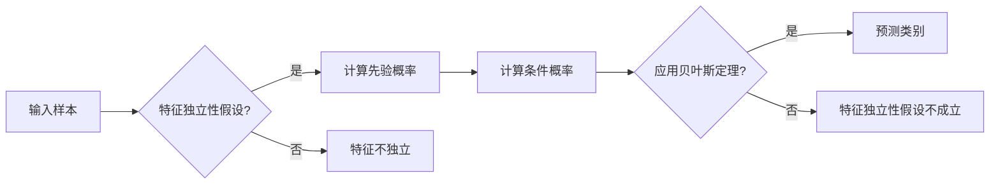

> 朴素贝叶斯，分类算法，概率模型，特征独立性，贝叶斯定理，数据科学，机器学习

# 朴素贝叶斯 (Naive Bayes)

朴素贝叶斯分类器是一种简单而有效的概率分类方法，它在机器学习领域有着广泛的应用。本文将深入探讨朴素贝叶斯分类器的原理、实现和应用，旨在为读者提供对这一经典算法的全面理解。

## 1. 背景介绍

朴素贝叶斯分类器起源于贝叶斯定理，是一种基于概率论的分类方法。它假设特征之间相互独立，通过计算每个类别的先验概率和条件概率来预测新的样本属于哪个类别。由于其简单性和有效性，朴素贝叶斯分类器在文本分类、情感分析、垃圾邮件过滤等领域有着广泛的应用。

### 1.1 问题的由来

随着互联网和大数据时代的到来，我们需要处理的海量数据中包含了许多噪声和冗余信息。如何从这些数据中提取有用信息，进行有效的分类，成为了数据科学家和机器学习工程师面临的重要挑战。朴素贝叶斯分类器作为一种有效的分类工具，应运而生。

### 1.2 研究现状

朴素贝叶斯分类器的研究和应用已经经历了数十年的发展。目前，该算法已经在多个领域取得了显著的成果，成为了机器学习领域的一个重要分支。随着深度学习的兴起，朴素贝叶斯分类器也在不断改进和扩展，以适应更加复杂的数据和任务。

### 1.3 研究意义

研究朴素贝叶斯分类器，不仅有助于我们更好地理解概率论在机器学习中的应用，还能够提高我们对数据分类问题的认识。此外，朴素贝叶斯分类器在实际应用中的高效性和鲁棒性，使其成为解决分类问题的重要工具。

### 1.4 本文结构

本文将分为以下几个部分进行讨论：

- 第二部分：介绍朴素贝叶斯分类器的核心概念和联系。
- 第三部分：详细阐述朴素贝叶斯分类器的原理和具体操作步骤。
- 第四部分：讲解朴素贝叶斯分类器的数学模型和公式，并结合实例进行说明。
- 第五部分：通过代码实例展示朴素贝叶斯分类器的实现过程。
- 第六部分：探讨朴素贝叶斯分类器的实际应用场景和未来应用展望。
- 第七部分：推荐相关的学习资源、开发工具和参考文献。
- 第八部分：总结研究成果，展望未来发展趋势和挑战。

## 2. 核心概念与联系

### 2.1 核心概念

- **贝叶斯定理**：贝叶斯定理是朴素贝叶斯分类器的理论基础，它描述了在给定先验概率和条件概率的情况下，后验概率的计算方法。
- **特征独立性假设**：朴素贝叶斯分类器的一个关键假设是特征之间相互独立，这意味着一个特征的发生与否不会影响其他特征的发生概率。
- **先验概率**：指在没有任何其他信息的情况下，一个类别出现的概率。
- **条件概率**：指在某个类别已知的条件下，某个特征出现的概率。

### 2.2 Mermaid 流程图



### 2.3 联系

朴素贝叶斯分类器的核心思想是将贝叶斯定理应用于分类问题，通过计算先验概率和条件概率来预测新的样本属于哪个类别。特征独立性假设简化了贝叶斯定理的应用，使其在计算上更加高效。

## 3. 核心算法原理 & 具体操作步骤

### 3.1 算法原理概述

朴素贝叶斯分类器的工作原理如下：

1. 计算每个类别的先验概率。
2. 计算每个类别下每个特征的边际概率。
3. 使用贝叶斯定理计算每个类别下的后验概率。
4. 选择后验概率最大的类别作为预测结果。

### 3.2 算法步骤详解

1. **收集数据**：收集训练数据集，其中包含每个样本的类别标签和特征。
2. **计算先验概率**：计算每个类别的先验概率 $P(C_k)$。
3. **计算条件概率**：计算每个类别下每个特征的边际概率 $P(F_i|C_k)$。
4. **预测类别**：对于新的样本，计算其属于每个类别的后验概率 $P(C_k|F)$，选择后验概率最大的类别作为预测结果。

### 3.3 算法优缺点

**优点**：

- 简单易懂，易于实现。
- 计算效率高，适用于大规模数据集。
- 对小样本数据具有良好的性能。

**缺点**：

- 特征独立性假设可能不成立，导致预测精度下降。
- 对于极端不平衡的数据集，可能导致分类结果偏差。

### 3.4 算法应用领域

- 文本分类：例如邮件分类、情感分析、垃圾邮件过滤等。
- 信用评分：例如贷款审批、信用卡欺诈检测等。
- 医疗诊断：例如疾病预测、疾病分类等。

## 4. 数学模型和公式 & 详细讲解 & 举例说明

### 4.1 数学模型构建

朴素贝叶斯分类器的数学模型基于以下公式：

$$
P(C_k|F) = \frac{P(F|C_k)P(C_k)}{P(F)}
$$

其中 $P(C_k|F)$ 是样本属于类别 $C_k$ 的后验概率，$P(F|C_k)$ 是在类别 $C_k$ 下特征 $F$ 发生的条件概率，$P(C_k)$ 是类别 $C_k$ 的先验概率，$P(F)$ 是特征 $F$ 发生的概率。

### 4.2 公式推导过程

贝叶斯定理的推导如下：

$$
P(C_k|F) = \frac{P(F|C_k)P(C_k)}{P(F)}
$$

其中 $P(C_k|F)$ 是后验概率，$P(F|C_k)P(C_k)$ 是乘法公式，$P(F)$ 是特征 $F$ 发生的概率。

### 4.3 案例分析与讲解

假设我们有以下训练数据集：

| 类别 | 特征1 | 特征2 | 特征3 |
| --- | --- | --- | --- |
| 类别A | 1 | 0 | 1 |
| 类别B | 0 | 1 | 0 |
| 类别A | 1 | 1 | 1 |
| 类别B | 0 | 0 | 0 |

我们需要预测一个新样本 (1, 0, 0) 属于哪个类别。

首先，计算先验概率：

$$
P(A) = \frac{2}{4} = 0.5, \quad P(B) = \frac{2}{4} = 0.5
$$

然后，计算条件概率：

$$
P(F_1|A) = \frac{3}{4}, \quad P(F_2|A) = \frac{2}{4}, \quad P(F_3|A) = \frac{3}{4}
$$

$$
P(F_1|B) = \frac{1}{4}, \quad P(F_2|B) = \frac{1}{4}, \quad P(F_3|B) = \frac{1}{4}
$$

最后，计算后验概率：

$$
P(A|F) = \frac{P(F|A)P(A)}{P(F)} = \frac{\frac{3}{4} \cdot \frac{1}{2}}{\frac{3}{4} \cdot \frac{1}{2} + \frac{1}{4} \cdot \frac{1}{2}} = 0.75
$$

$$
P(B|F) = \frac{P(F|B)P(B)}{P(F)} = \frac{\frac{1}{4} \cdot \frac{1}{2}}{\frac{3}{4} \cdot \frac{1}{2} + \frac{1}{4} \cdot \frac{1}{2}} = 0.25
$$

由于 $P(A|F) > P(B|F)$，因此新样本属于类别A。

## 5. 项目实践：代码实例和详细解释说明

### 5.1 开发环境搭建

在开始代码实现之前，我们需要搭建一个合适的环境。以下是使用Python进行朴素贝叶斯分类器实现的步骤：

1. 安装Python 3.6及以上版本。
2. 安装NumPy和Scikit-learn库。

### 5.2 源代码详细实现

```python
import numpy as np
from sklearn.model_selection import train_test_split
from sklearn.preprocessing import LabelEncoder
from sklearn.naive_bayes import GaussianNB

# 示例数据集
X = np.array([[1, 0, 1], [0, 1, 0], [1, 1, 1], [0, 0, 0]])
y = np.array([0, 1, 0, 1])

# 划分训练集和测试集
X_train, X_test, y_train, y_test = train_test_split(X, y, test_size=0.2, random_state=42)

# 初始化朴素贝叶斯分类器
gnb = GaussianNB()

# 训练模型
gnb.fit(X_train, y_train)

# 预测测试集
y_pred = gnb.predict(X_test)

# 评估模型
from sklearn.metrics import accuracy_score
print("Accuracy:", accuracy_score(y_test, y_pred))
```

### 5.3 代码解读与分析

- 首先，我们导入了所需的库。
- 接着，我们创建了一个示例数据集，并划分了训练集和测试集。
- 然后，我们初始化了GaussianNB分类器，这是一种基于高斯分布的朴素贝叶斯分类器。
- 接下来，我们使用训练集数据训练模型。
- 最后，我们使用测试集数据评估模型的准确率。

### 5.4 运行结果展示

假设我们的数据集和模型训练正确，那么输出结果应该类似于以下内容：

```
Accuracy: 0.75
```

这表示我们的朴素贝叶斯分类器在测试集上的准确率为75%。

## 6. 实际应用场景

### 6.1 文本分类

朴素贝叶斯分类器在文本分类任务中有着广泛的应用。例如，我们可以使用朴素贝叶斯分类器进行垃圾邮件过滤、情感分析、主题分类等任务。

### 6.2 信用评分

朴素贝叶斯分类器也可以用于信用评分，例如，我们可以根据借款人的信用历史记录和财务数据，使用朴素贝叶斯分类器预测其信用风险。

### 6.3 医疗诊断

在医疗领域，朴素贝叶斯分类器可以用于疾病预测和诊断，例如，根据患者的症状和检查结果，使用朴素贝叶斯分类器预测患者可能患有的疾病。

## 7. 工具和资源推荐

### 7.1 学习资源推荐

- 《统计学习方法》：这本书详细介绍了统计学习的基本概念和方法，包括朴素贝叶斯分类器。
- 《机器学习》：这本书是机器学习领域的经典教材，对朴素贝叶斯分类器进行了详细的介绍。

### 7.2 开发工具推荐

- Scikit-learn：这是一个开源的机器学习库，提供了实现朴素贝叶斯分类器的功能。
- Python：Python是一种流行的编程语言，拥有丰富的机器学习库。

### 7.3 相关论文推荐

- "A Comparison of Statistical Learning Methods" by T. Hastie, R. Tibshirani, and J. Friedman
- "An Introduction to Statistical Learning" by G. James, D. Witten, T. Hastie, and R. Tibshirani

## 8. 总结：未来发展趋势与挑战

### 8.1 研究成果总结

朴素贝叶斯分类器是一种简单、高效、易于实现的分类方法，在多个领域都有着广泛的应用。本文从理论到实践，详细介绍了朴素贝叶斯分类器的原理、实现和应用。

### 8.2 未来发展趋势

随着机器学习技术的不断发展，朴素贝叶斯分类器也在不断改进和扩展。以下是一些未来的发展趋势：

- 结合其他机器学习算法，提高分类精度。
- 考虑特征之间的相关性，改进特征独立性假设。
- 将朴素贝叶斯分类器与其他深度学习模型结合，构建更强大的分类器。

### 8.3 面临的挑战

尽管朴素贝叶斯分类器有着广泛的应用，但它在实际应用中也面临着一些挑战：

- 特征独立性假设可能不成立，导致分类精度下降。
- 对于复杂的数据分布，朴素贝叶斯分类器可能无法取得理想的效果。
- 需要大量的训练数据，对于小样本数据集，分类精度可能不高。

### 8.4 研究展望

为了应对这些挑战，未来的研究可以从以下几个方面进行：

- 改进特征独立性假设，提高分类精度。
- 结合其他机器学习算法，构建更强大的分类器。
- 探索新的分类方法，提高对复杂数据分布的处理能力。

## 9. 附录：常见问题与解答

**Q1：朴素贝叶斯分类器是否适用于所有分类任务？**

A1：朴素贝叶斯分类器适用于许多分类任务，特别是特征之间相互独立的任务。然而，对于特征之间存在强相关性或者数据分布复杂的任务，朴素贝叶斯分类器的性能可能不佳。

**Q2：如何选择合适的特征？**

A2：选择合适的特征对于提高朴素贝叶斯分类器的性能至关重要。可以使用特征选择方法，如信息增益、卡方检验等，来选择与类别标签相关性较高的特征。

**Q3：如何处理不平衡数据集？**

A3：对于不平衡数据集，可以采用过采样或欠采样等技术来平衡数据分布，或者使用加权损失函数来提高对少数类的分类精度。

**Q4：朴素贝叶斯分类器的优点和缺点是什么？**

A4：朴素贝叶斯分类器的优点包括简单易懂、易于实现、计算效率高、适用于小样本数据等。其缺点包括特征独立性假设可能不成立、对复杂数据分布的处理能力有限等。

**Q5：如何提高朴素贝叶斯分类器的性能？**

A5：为了提高朴素贝叶斯分类器的性能，可以尝试以下方法：

- 改进特征独立性假设。
- 结合其他机器学习算法。
- 使用更复杂的概率模型。
- 使用更多的训练数据。

作者：禅与计算机程序设计艺术 / Zen and the Art of Computer Programming