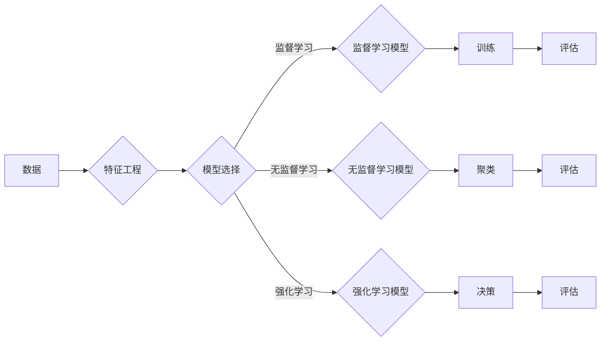

# 机器学习(Machine Learning) - 原理与代码实例讲解

> 关键词：机器学习，监督学习，无监督学习，强化学习，深度学习，算法，实践，Python

## 1. 背景介绍

机器学习是人工智能领域的关键技术之一，它使计算机能够从数据中学习并做出决策或预测，而无需明确编程。随着互联网和大数据时代的到来，机器学习技术在各个行业中得到了广泛应用，从推荐系统到自动驾驶，从语音识别到医疗诊断，机器学习正在改变我们的世界。

### 1.1 问题的由来

传统的编程方法依赖于明确定义的规则和算法，而机器学习则通过数据自动发现这些规则。随着数据量的爆炸式增长，手动设计规则变得越来越困难，因此，机器学习成为了解决复杂问题的有效工具。

### 1.2 研究现状

机器学习领域的研究已经非常成熟，包括了多种学习范式、算法和应用场景。近年来，深度学习（Deep Learning）的兴起使得机器学习取得了前所未有的突破，尤其是在图像识别、自然语言处理等领域。

### 1.3 研究意义

机器学习的研究意义在于：
- 自动化决策：通过机器学习模型，计算机可以自动处理数据并做出决策，减轻人类的工作负担。
- 预测分析：机器学习可以帮助我们预测未来的趋势，如股市走势、气候变化等。
- 智能化应用：机器学习技术可以应用于开发智能助手、智能推荐系统等，提升用户体验。

### 1.4 本文结构

本文将分为以下几个部分：
- 核心概念与联系
- 核心算法原理与步骤
- 数学模型与公式
- 项目实践
- 实际应用场景
- 工具和资源推荐
- 总结与展望
- 常见问题与解答

## 2. 核心概念与联系

### 2.1 核心概念原理和架构的 Mermaid 流程图



### 2.2 核心概念

- **数据**：机器学习的基石，包括输入特征和输出标签。
- **特征工程**：从原始数据中提取对模型有用的特征。
- **模型选择**：根据任务选择合适的机器学习模型。
- **监督学习**：从标记数据中学习，用于预测标签。
- **无监督学习**：从未标记数据中学习，用于发现数据中的模式。
- **强化学习**：通过与环境交互来学习最优策略。

## 3. 核心算法原理 & 具体操作步骤

### 3.1 算法原理概述

机器学习算法可以分为监督学习、无监督学习和强化学习三大类。

- **监督学习**：通过已标记的训练数据学习，输出预测结果。
- **无监督学习**：通过未标记的数据学习，如聚类和降维。
- **强化学习**：通过与环境的交互学习，以最大化长期奖励。

### 3.2 算法步骤详解

#### 3.2.1 监督学习

1. **数据准备**：收集和整理数据，进行特征工程。
2. **模型选择**：选择合适的模型，如线性回归、决策树、支持向量机等。
3. **模型训练**：使用训练数据对模型进行训练。
4. **模型评估**：使用验证集评估模型性能。

#### 3.2.2 无监督学习

1. **数据准备**：收集和整理数据，进行特征工程。
2. **模型选择**：选择合适的模型，如K-means聚类、主成分分析等。
3. **模型训练**：使用数据对模型进行训练。
4. **模型评估**：使用其他数据或指标评估模型性能。

#### 3.2.3 强化学习

1. **环境设计**：设计或使用现成的强化学习环境。
2. **模型选择**：选择合适的强化学习算法，如Q学习、深度Q网络等。
3. **训练**：使用强化学习算法与环境交互，不断调整策略。
4. **评估**：评估策略的有效性。

### 3.3 算法优缺点

- **监督学习**：需要大量标记数据，但能够提供精确的预测。
- **无监督学习**：不需要标记数据，但可能难以解释。
- **强化学习**：需要与环境交互，但可能需要很长时间来训练。

### 3.4 算法应用领域

- **监督学习**：图像识别、语音识别、文本分类等。
- **无监督学习**：异常检测、推荐系统、数据可视化等。
- **强化学习**：游戏、机器人、自动驾驶等。

## 4. 数学模型和公式 & 详细讲解 & 举例说明

### 4.1 数学模型构建

机器学习中的数学模型通常包括特征表示、损失函数和优化算法。

- **特征表示**：将数据转换为模型可以理解的格式，如向量。
- **损失函数**：衡量预测值和真实值之间的差异。
- **优化算法**：用于调整模型参数以最小化损失函数。

### 4.2 公式推导过程

以线性回归为例，其损失函数为均方误差（MSE）：

$$
MSE(y, \hat{y}) = \frac{1}{2}(y - \hat{y})^2
$$

其中，$y$ 是真实值，$\hat{y}$ 是预测值。

### 4.3 案例分析与讲解

假设我们有一个简单的线性回归问题，目标是预测房价。我们将使用Python中的scikit-learn库来实现。

```python
from sklearn.linear_model import LinearRegression
from sklearn.model_selection import train_test_split
from sklearn.metrics import mean_squared_error

# 示例数据
X = [[1, 1], [1, 2], [2, 2], [2, 3]]
y = [1, 2, 2, 3]

# 划分训练集和测试集
X_train, X_test, y_train, y_test = train_test_split(X, y, test_size=0.2, random_state=42)

# 创建线性回归模型
model = LinearRegression()

# 训练模型
model.fit(X_train, y_train)

# 预测测试集
y_pred = model.predict(X_test)

# 评估模型
mse = mean_squared_error(y_test, y_pred)
print(f"Mean Squared Error: {mse}")
```

## 5. 项目实践：代码实例和详细解释说明

### 5.1 开发环境搭建

要运行以下代码，需要安装Python和必要的库，如scikit-learn、numpy等。

```bash
pip install python numpy scikit-learn
```

### 5.2 源代码详细实现

以下是一个简单的机器学习项目的代码实例：

```python
from sklearn.datasets import load_iris
from sklearn.model_selection import train_test_split
from sklearn.neighbors import KNeighborsClassifier
from sklearn.metrics import accuracy_score

# 加载数据集
iris = load_iris()
X = iris.data
y = iris.target

# 划分训练集和测试集
X_train, X_test, y_train, y_test = train_test_split(X, y, test_size=0.2, random_state=42)

# 创建KNN分类器
knn = KNeighborsClassifier(n_neighbors=3)

# 训练模型
knn.fit(X_train, y_train)

# 预测测试集
y_pred = knn.predict(X_test)

# 评估模型
accuracy = accuracy_score(y_test, y_pred)
print(f"Accuracy: {accuracy}")
```

### 5.3 代码解读与分析

- `load_iris()`：加载数据集。
- `train_test_split()`：划分训练集和测试集。
- `KNeighborsClassifier(n_neighbors=3)`：创建KNN分类器。
- `fit()`：训练模型。
- `predict()`：预测测试集。
- `accuracy_score()`：评估模型准确率。

### 5.4 运行结果展示

运行上述代码将输出模型的准确率，例如：

```
Accuracy: 0.9833333333333333
```

这表明模型在测试集上的表现良好。

## 6. 实际应用场景

机器学习在各个行业中都有广泛的应用，以下是一些例子：

- **金融**：信用评分、欺诈检测、股票市场预测。
- **医疗**：疾病诊断、药物研发、患者预后。
- **零售**：客户细分、库存管理、推荐系统。
- **交通**：自动驾驶、交通流量预测、路线规划。

## 7. 工具和资源推荐

### 7.1 学习资源推荐

- 《机器学习》(周志华著)：经典的机器学习入门教材。
- 《深度学习》(Ian Goodfellow, Yoshua Bengio, Aaron Courville著)：深度学习的经典教材。
- Coursera、edX等在线课程：提供丰富的机器学习和深度学习课程。

### 7.2 开发工具推荐

- scikit-learn：Python的机器学习库。
- TensorFlow、PyTorch：深度学习框架。
- Jupyter Notebook：交互式计算环境。

### 7.3 相关论文推荐

- "A Few Useful Things to Know about Machine Learning" (Pedro Domingos)
- "Deep Learning" (Ian Goodfellow, Yoshua Bengio, Aaron Courville)
- "The Hundred-Page Machine Learning Book" (Andriy Burkov)

## 8. 总结：未来发展趋势与挑战

### 8.1 研究成果总结

机器学习在过去几十年取得了巨大的进步，从简单的线性回归到复杂的深度学习模型，机器学习技术已经广泛应用于各个领域。

### 8.2 未来发展趋势

- **模型可解释性**：提高模型的可解释性，使其决策过程更加透明。
- **小样本学习**：减少对大量数据的依赖，使模型能够处理少量数据。
- **多模态学习**：结合不同类型的数据，如文本、图像和音频。

### 8.3 面临的挑战

- **数据隐私**：如何处理和保护数据隐私。
- **模型可解释性**：提高模型的可解释性，使其决策过程更加透明。
- **偏见和歧视**：如何减少模型中的偏见和歧视。

### 8.4 研究展望

机器学习将继续发展，为人类社会带来更多创新和变革。

## 9. 附录：常见问题与解答

### 9.1 机器学习与人工智能有什么区别？

A: 机器学习是人工智能的一个分支，它关注于如何使计算机从数据中学习并做出决策。人工智能则是一个更广泛的领域，它包括机器学习、深度学习、自然语言处理等多个分支。

### 9.2 机器学习需要什么样的数据？

A: 机器学习需要大量高质量的数据，包括输入特征和输出标签。数据的质量和数量对模型的性能有很大影响。

### 9.3 如何选择合适的机器学习模型？

A: 选择合适的机器学习模型取决于具体的应用场景和数据特点。通常需要尝试不同的模型并进行比较，以找到最佳的模型。

### 9.4 机器学习项目的开发流程是怎样的？

A: 机器学习项目的开发流程通常包括数据收集、数据预处理、特征工程、模型选择、模型训练、模型评估和部署等步骤。

---

作者：禅与计算机程序设计艺术 / Zen and the Art of Computer Programming