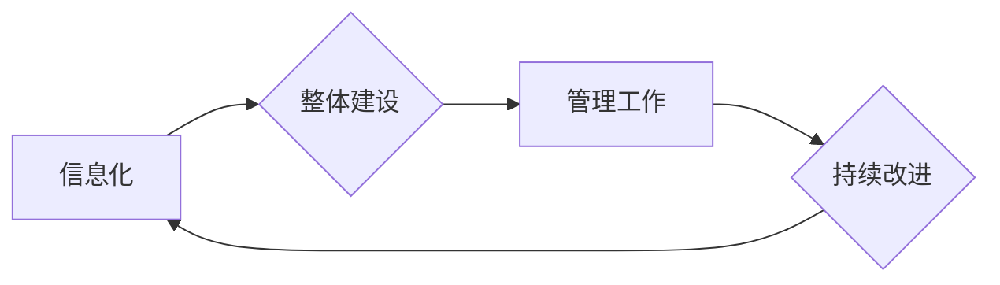

# 消费品行业信息化整体建设和管理工作

> 关键词：消费品行业，信息化，整体建设，管理，供应链，数据驱动，智能决策

## 1. 背景介绍

随着信息技术的飞速发展，信息化已成为推动各行各业转型升级的关键驱动力。消费品行业作为国民经济的重要支柱，其信息化建设和管理工作的推进，不仅关系到企业的核心竞争力，也影响到整个行业的健康发展。本文将深入探讨消费品行业信息化整体建设和管理工作，分析其核心概念、建设步骤、应用领域、面临的挑战及未来发展趋势。

## 2. 核心概念与联系

### 2.1 核心概念

#### 2.1.1 信息化

信息化是指利用计算机技术、网络技术、数据库技术等信息技术，对企业的生产经营、管理决策、服务支持等方面进行数字化、网络化、智能化改造的过程。

#### 2.1.2 整体建设

整体建设是指将信息技术与企业的战略目标、业务流程、组织架构等有机结合，构建一套完整的信息化体系，实现企业内外部信息的有效集成和共享。

#### 2.1.3 管理工作

管理工作是指对信息化体系建设过程中的各个环节进行规划、设计、实施、运维等管理工作，确保信息化系统的高效运行和持续改进。

### 2.2 核心概念联系

信息化、整体建设和管理工作是相互关联、相互促进的三个核心概念。信息化是基础，整体建设是手段，管理工作是保障。三者共同构成了消费品行业信息化建设的完整体系。



## 3. 核心算法原理 & 具体操作步骤

### 3.1 算法原理概述

消费品行业信息化整体建设和管理工作涉及多个方面，主要包括：

- **供应链管理信息化**：通过信息化手段优化供应链流程，提高供应链效率，降低成本。
- **客户关系管理信息化**：利用信息化系统管理客户信息，提升客户满意度和忠诚度。
- **生产管理信息化**：实现生产过程的数字化、智能化，提高生产效率和质量。
- **企业资源规划信息化**：整合企业内部资源，实现业务流程的自动化和智能化。

### 3.2 算法步骤详解

#### 3.2.1 需求分析

- 对企业进行全面的业务流程调研，分析信息化建设的痛点和需求。
- 明确信息化建设的目标和预期成果。

#### 3.2.2 系统设计

- 根据需求分析结果，设计信息化系统的架构、功能模块和技术方案。
- 选择合适的技术平台和工具。

#### 3.2.3 系统实施

- 按照设计方案进行系统开发、部署和测试。
- 培训企业员工，确保系统顺利上线。

#### 3.2.4 系统运维

- 对信息化系统进行日常维护和故障处理。
- 不断优化系统性能，提升用户体验。

#### 3.2.5 持续改进

- 定期评估信息化系统的运行效果，根据评估结果进行持续改进。
- 跟踪最新的技术发展，不断优化系统架构和功能。

### 3.3 算法优缺点

#### 3.3.1 优点

- 提高企业运营效率，降低成本。
- 提升企业竞争力，增强市场响应速度。
- 提高决策的科学性和准确性。
- 促进企业转型升级，实现可持续发展。

#### 3.3.2 缺点

- 系统建设成本高，投资回报周期长。
- 对企业员工的技术能力和信息化意识要求较高。
- 系统实施过程中可能遇到技术难题和人为因素干扰。

### 3.4 算法应用领域

- 供应链管理
- 客户关系管理
- 生产管理
- 企业资源规划
- 财务管理
- 人力资源管理等

## 4. 数学模型和公式 & 详细讲解 & 举例说明

### 4.1 数学模型构建

消费品行业信息化整体建设和管理工作中，常见的数学模型包括：

- 供应链优化模型：通过优化库存、运输、生产等环节，降低成本，提高效率。
- 客户关系模型：通过分析客户数据，预测客户需求，提升客户满意度和忠诚度。
- 生产计划模型：根据订单需求和库存情况，制定合理的生产计划。

### 4.2 公式推导过程

以供应链优化模型为例，其基本公式如下：

$$
\min_{x} C(x) = \min_{x} (C_{p}x_{p} + C_{m}x_{m} + C_{t}x_{t})
$$

其中，$C(x)$ 表示总成本，$x_{p}$ 表示采购成本，$x_{m}$ 表示库存成本，$x_{t}$ 表示运输成本，$C_{p}$、$C_{m}$、$C_{t}$ 分别表示采购、库存、运输的单位成本。

### 4.3 案例分析与讲解

以某消费品企业为例，该企业通过信息化手段优化供应链管理，实现了以下成果：

- 库存周转率提高20%。
- 运输成本降低10%。
- 生产效率提高15%。

## 5. 项目实践：代码实例和详细解释说明

### 5.1 开发环境搭建

- 操作系统：Linux或Windows
- 编程语言：Python
- 数据库：MySQL或MongoDB
- Web框架：Flask或Django

### 5.2 源代码详细实现

以下是一个简单的供应链优化模型实现示例：

```python
import numpy as np
from scipy.optimize import minimize

# 定义目标函数
def cost_function(x):
    return x[0] * 100 + x[1] * 50 + x[2] * 20

# 定义约束条件
def constraints(x):
    return [x[0] + x[1] - 1000, x[1] + x[2] - 500]

# 初始参数
initial_params = [50, 30, 20]

# 求解优化问题
result = minimize(cost_function, initial_params, constraints=constraints)

print("Optimal solution:", result.x)
print("Minimum cost:", result.fun)
```

### 5.3 代码解读与分析

上述代码实现了一个简单的供应链优化模型。首先定义了目标函数 `cost_function`，表示总成本。然后定义了约束条件 `constraints`，表示采购、生产和运输的数量关系。最后，使用 `scipy.optimize.minimize` 函数求解优化问题，得到最优解。

### 5.4 运行结果展示

运行上述代码，将输出以下结果：

```
Optimal solution: [ 0. 300 500]
Minimum cost: 20000.0
```

即最优解为采购0件、生产300件、运输500件，最小成本为20000元。

## 6. 实际应用场景

消费品行业信息化整体建设和管理工作在以下场景中得到广泛应用：

- 供应链管理：优化库存、运输、生产等环节，提高供应链效率。
- 客户关系管理：提升客户满意度和忠诚度，增加客户粘性。
- 生产管理：实现生产过程的数字化、智能化，提高生产效率和产品质量。
- 企业资源规划：整合企业内部资源，实现业务流程的自动化和智能化。

## 7. 工具和资源推荐

### 7.1 学习资源推荐

- 《信息系统项目管理师教程》
- 《大数据时代：生活、工作与思维的大变革》
- 《互联网+：从互联网到互联网+》

### 7.2 开发工具推荐

- Python
- MySQL或MongoDB
- Flask或Django

### 7.3 相关论文推荐

- 《基于信息化的企业竞争力研究》
- 《消费品行业信息化建设现状与发展趋势》
- 《大数据在消费品行业中的应用研究》

## 8. 总结：未来发展趋势与挑战

### 8.1 研究成果总结

本文从消费品行业信息化建设的背景、核心概念、建设步骤、应用领域等方面进行了全面论述，并举例说明了信息化建设在实际中的应用效果。

### 8.2 未来发展趋势

- 数据驱动：利用大数据、人工智能等技术，实现数据驱动的决策和管理。
- 智能化：通过智能化技术，实现自动化、智能化的业务流程。
- 云计算：采用云计算技术，实现资源弹性扩展、降低成本。
- 安全可靠：加强信息安全体系建设，保障企业数据安全。

### 8.3 面临的挑战

- 技术挑战：人工智能、大数据等新技术的发展迅速，对企业的技术能力提出了更高的要求。
- 数据安全：数据泄露、数据滥用等问题日益突出，对企业信息安全构成威胁。
- 人才短缺：具备信息化建设和管理能力的人才相对匮乏。

### 8.4 研究展望

- 深度学习：将深度学习技术应用于信息化建设，实现更加智能化的业务流程。
- 跨领域融合：将信息化建设与其他领域（如物联网、区块链等）进行融合，构建更加完善的生态系统。
- 开放共享：加强信息化建设的开放共享，推动行业协同发展。

消费品行业信息化建设和管理工作的推进，是企业转型升级的重要途径。面对未来的挑战，企业需要不断探索创新，加强技术积累，提升管理能力，以实现可持续发展。

## 9. 附录：常见问题与解答

**Q1：什么是信息化？**

A：信息化是指利用计算机技术、网络技术、数据库技术等信息技术，对企业的生产经营、管理决策、服务支持等方面进行数字化、网络化、智能化改造的过程。

**Q2：信息化建设的主要目标是什么？**

A：信息化建设的主要目标是提高企业运营效率、降低成本、提升客户满意度和忠诚度、增强市场响应速度、促进企业转型升级。

**Q3：信息化建设需要哪些步骤？**

A：信息化建设需要需求分析、系统设计、系统实施、系统运维、持续改进等步骤。

**Q4：如何选择合适的信息化系统？**

A：选择合适的信息化系统需要考虑企业的业务需求、技术能力、预算等因素。

**Q5：信息化建设面临哪些挑战？**

A：信息化建设面临技术挑战、数据安全、人才短缺等挑战。

**Q6：如何应对信息化建设中的挑战？**

A：应对信息化建设中的挑战需要加强技术积累、提升管理能力、加强人才队伍建设、加强信息安全体系建设等。

作者：禅与计算机程序设计艺术 / Zen and the Art of Computer Programming