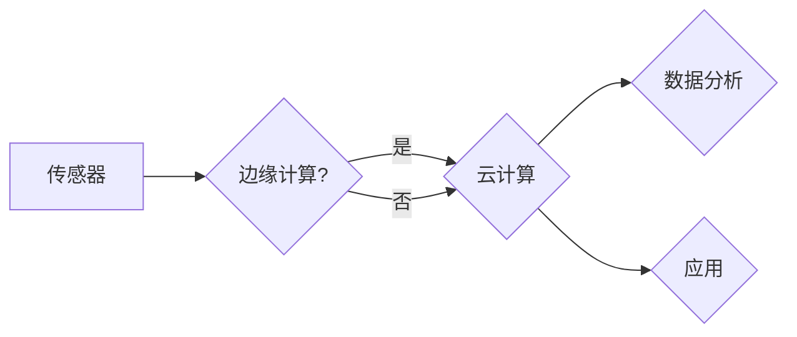

# 物联网(IoT)技术和各种传感器设备的集成：压力传感器的物联网实践

> 关键词：物联网，传感器，压力传感器，数据采集，数据分析，实时监控，边缘计算，云计算

## 1. 背景介绍

随着物联网（Internet of Things, IoT）技术的飞速发展，各种传感器设备在智能家居、工业自动化、智慧城市等领域的应用日益广泛。其中，压力传感器作为重要的感知设备，能够实时监测液体、气体、固体等介质的压力变化，为工业生产、环境监测、健康医疗等领域提供关键数据支持。本文将探讨物联网技术和各种传感器设备的集成，并以压力传感器为例，介绍其在物联网实践中的应用。

### 1.1 物联网技术概述

物联网技术是指通过信息传感设备，将各种物理对象连接到网络上，实现智能化识别、定位、追踪、监控和管理的技术。物联网技术主要包括以下几个方面：

- **感知层**：通过传感器设备收集环境信息，如温度、湿度、光照、压力等。
- **网络层**：负责将感知层采集的数据传输到云端或其他处理中心。
- **平台层**：提供数据处理、存储、分析等功能，支持各种应用开发。
- **应用层**：将物联网技术应用于不同领域，如智能家居、智慧城市、工业自动化等。

### 1.2 压力传感器概述

压力传感器是一种将压力信号转换为电信号的传感器，广泛应用于各种领域。根据压力的测量范围、测量原理、输出形式等不同特点，压力传感器可以分为多种类型，如：

- **按测量范围**：微压传感器、中压传感器、高压传感器等。
- **按测量原理**：弹性元件式、压阻式、电容式、压电式等。
- **按输出形式**：模拟量输出、数字量输出等。

### 1.3 研究意义

物联网技术和压力传感器的集成，可以实现压力数据的实时采集、传输、分析和应用，对于工业生产、环境监测、健康医疗等领域具有重要意义：

- **提高生产效率**：实时监测生产过程中的压力变化，及时发现故障，降低生产成本。
- **优化资源利用**：根据压力数据合理调配资源，提高资源利用效率。
- **保障生产安全**：实时监测压力变化，防止事故发生，保障生产安全。
- **提升生活质量**：在智能家居、健康医疗等领域，压力传感器的应用可以提升人们的生活质量。

## 2. 核心概念与联系

### 2.1 核心概念原理

在物联网技术和压力传感器的集成中，涉及以下核心概念：

- **传感器**：感知物理信号，并将信号转换为电信号。
- **传感器网络**：由多个传感器节点组成的网络，实现数据的采集和传输。
- **边缘计算**：在数据源附近进行数据处理，降低延迟，提高效率。
- **云计算**：将数据存储和处理任务交由云端完成，实现资源的集中管理和共享。

### 2.2 架构流程图

以下是物联网技术和压力传感器集成架构的Mermaid流程图：



### 2.3 核心概念联系

物联网技术和压力传感器的集成，需要将传感器采集的压力数据传输到云端或边缘设备进行处理和分析，最终应用于实际场景。传感器是数据采集的源头，边缘计算和云计算是数据处理的核心，数据分析是提升应用价值的关键。

## 3. 核心算法原理 & 具体操作步骤

### 3.1 算法原理概述

在物联网技术和压力传感器的集成中，涉及以下核心算法：

- **数据采集算法**：负责从压力传感器采集数据。
- **数据传输算法**：负责将采集到的数据传输到云端或边缘设备。
- **数据分析算法**：负责对数据进行处理和分析。
- **模型训练算法**：负责训练模型，用于预测和决策。

### 3.2 算法步骤详解

#### 3.2.1 数据采集算法

1. **初始化传感器**：配置传感器参数，如采样频率、量程等。
2. **采集数据**：定时读取传感器输出的电压、电流等模拟量信号。
3. **数据预处理**：对采集到的数据进行滤波、去噪等处理。

#### 3.2.2 数据传输算法

1. **选择传输协议**：选择合适的传输协议，如MQTT、CoAP等。
2. **建立连接**：与云端或边缘设备建立连接。
3. **数据打包**：将预处理后的数据打包成消息格式。
4. **发送数据**：将数据发送到云端或边缘设备。

#### 3.2.3 数据分析算法

1. **特征提取**：从压力数据中提取特征，如均值、方差、最大值、最小值等。
2. **模型训练**：使用机器学习算法对特征进行分类或回归分析。
3. **预测和决策**：根据模型预测结果进行决策。

#### 3.2.4 模型训练算法

1. **数据预处理**：对训练数据进行清洗、归一化等处理。
2. **选择模型**：选择合适的机器学习模型，如线性回归、支持向量机等。
3. **训练模型**：使用训练数据训练模型。
4. **模型评估**：使用验证数据评估模型性能。
5. **模型优化**：根据评估结果优化模型参数。

### 3.3 算法优缺点

#### 3.3.1 数据采集算法

- **优点**：能够实时、准确地采集压力数据。
- **缺点**：对传感器性能和环境影响敏感。

#### 3.3.2 数据传输算法

- **优点**：支持多种传输协议，适应不同场景。
- **缺点**：数据传输过程中可能存在丢包、延迟等问题。

#### 3.3.3 数据分析算法

- **优点**：能够从压力数据中提取有价值的信息。
- **缺点**：对数据质量和算法选择敏感。

#### 3.3.4 模型训练算法

- **优点**：能够实现自动化预测和决策。
- **缺点**：需要大量的训练数据，对算法和计算资源要求较高。

### 3.4 算法应用领域

上述算法在以下领域具有广泛的应用：

- **工业自动化**：监测生产过程中的压力变化，实现生产过程的智能化控制。
- **环境监测**：监测大气、水质、土壤等环境中的压力变化，实现环境监测和预警。
- **健康医疗**：监测患者的血压、心压等生理指标，实现健康管理和疾病预防。
- **智能家居**：监测家庭设备的工作状态，实现智能家居的自动化控制。

## 4. 数学模型和公式 & 详细讲解 & 举例说明

### 4.1 数学模型构建

压力传感器的输出信号通常为模拟量，需要将其转换为数字量进行处理。以下是一个常用的模拟信号转换模型：

$$
y = K \cdot x + b
$$

其中，$y$ 为输出电压，$x$ 为输入压力，$K$ 为转换系数，$b$ 为偏移量。

### 4.2 公式推导过程

假设压力传感器的输出信号为电压 $u(t)$，输入压力为 $p(t)$，转换系数为 $K$，偏移量为 $b$。则有：

$$
u(t) = K \cdot p(t) + b
$$

对上式进行线性变换，得：

$$
y = K \cdot x + b
$$

其中，$y$ 为输出电压，$x$ 为输入压力。

### 4.3 案例分析与讲解

以下是一个使用压力传感器监测水压的案例：

1. **选择传感器**：选择量程为0-10bar、精度为0.5%的压力传感器。
2. **数据采集**：使用A/D转换器将模拟信号转换为数字信号。
3. **数据传输**：将数字信号通过串口传输到微控制器。
4. **数据处理**：将数字信号转换为压力值，并进行滤波处理。
5. **数据显示**：将压力值显示在显示屏上。

通过上述步骤，我们可以实时监测水压变化，并根据压力值进行预警或控制。

## 5. 项目实践：代码实例和详细解释说明

### 5.1 开发环境搭建

以下是使用Arduino开发板和压力传感器的案例：

1. **硬件**：Arduino开发板、压力传感器、A/D转换器、显示屏等。
2. **软件**：Arduino IDE。

### 5.2 源代码详细实现

以下是Arduino代码示例：

```cpp
#include <Wire.h>
#include <Adafruit_BMP085.h>

Adafruit_BMP085 bmp;

void setup() {
  Serial.begin(9600);
  bmp.begin();
}

void loop() {
  float pressure = bmp.readPressure() / 101325.0;
  Serial.print("Pressure: ");
  Serial.print(pressure, 2);
  Serial.println(" bar");
  delay(1000);
}
```

### 5.3 代码解读与分析

上述代码使用Adafruit_BMP085库读取压力传感器数据，并将其转换为bar单位。通过串口将压力值输出到计算机，方便进行进一步的处理和分析。

### 5.4 运行结果展示

将Arduino开发板连接到计算机，运行上述代码，可以看到串口监视器中实时显示压力值。

## 6. 实际应用场景

### 6.1 工业自动化

在工业自动化领域，压力传感器可以用于监测设备运行状态，如：

- **压力容器**：监测压力容器内部的压力，防止超压事故发生。
- **液压系统**：监测液压系统压力，实现液压系统的自动化控制。
- **气动系统**：监测气动系统压力，实现气动系统的自动化控制。

### 6.2 环境监测

在环境监测领域，压力传感器可以用于监测大气、水质、土壤等环境中的压力变化，如：

- **大气压力监测**：监测大气压力变化，预测天气变化。
- **水质监测**：监测水质压力，评估水质状况。
- **土壤压力监测**：监测土壤压力，监测土壤水分含量。

### 6.3 健康医疗

在健康医疗领域，压力传感器可以用于监测患者的生理指标，如：

- **血压监测**：监测患者血压，预防高血压等疾病。
- **心压监测**：监测患者心压，评估心脏功能。
- **呼吸压力监测**：监测患者呼吸压力，评估呼吸功能。

### 6.4 智能家居

在智能家居领域，压力传感器可以用于监测家庭设备的工作状态，如：

- **水压监测**：监测家庭水压，防止水管破裂。
- **气压监测**：监测家庭气压，保持室内空气质量。
- **空气质量监测**：监测室内空气质量，实现空气净化。

## 7. 工具和资源推荐

### 7.1 学习资源推荐

- **书籍**：
  - 《物联网技术及应用》
  - 《传感器原理及应用》
  - 《物联网开发实战》
- **在线课程**：
  - Coursera《物联网技术》
  - Udemy《物联网开发》
  - edX《物联网系统设计与实现》
- **网站**：
  - 物联网之家
  - 物联网技术网
  - 慧聪物联网

### 7.2 开发工具推荐

- **开发板**：
  - Arduino
  - Raspberry Pi
  - ESP8266
- **开发环境**：
  - Arduino IDE
  - MicroPython
  - PlatformIO
- **编程语言**：
  - C/C++
  - Python
  - JavaScript

### 7.3 相关论文推荐

- 《物联网中传感器网络的架构设计与性能优化》
- 《基于物联网技术的智慧城市环境监测系统设计》
- 《物联网技术在医疗健康领域的应用研究》

## 8. 总结：未来发展趋势与挑战

### 8.1 研究成果总结

本文介绍了物联网技术和各种传感器设备的集成，并以压力传感器为例，探讨了其在物联网实践中的应用。通过分析物联网技术和压力传感器的核心概念、算法原理、应用场景等，为读者提供了全面的技术指导。

### 8.2 未来发展趋势

1. **低功耗传感器**：随着物联网设备的普及，对低功耗传感器的需求日益增长。
2. **智能传感器**：融合人工智能技术的智能传感器，能够实现更智能的数据采集和分析。
3. **边缘计算**：边缘计算能够降低数据处理延迟，提高系统效率。
4. **云计算**：云计算能够提供强大的数据处理和分析能力，支持大规模物联网应用。

### 8.3 面临的挑战

1. **数据安全**：物联网设备面临数据泄露、篡改等安全风险。
2. **网络连接**：物联网设备需要稳定的网络连接，以保证数据的实时性。
3. **标准化**：物联网技术需要统一的标准化，以实现设备之间的互操作性。

### 8.4 研究展望

未来，物联网技术和各种传感器设备的集成将朝着更加智能化、高效化、安全化的方向发展，为人类社会带来更多便利和福祉。

## 9. 附录：常见问题与解答

**Q1：物联网技术和传感器设备如何进行集成？**

A：物联网技术和传感器设备的集成主要包括以下步骤：
1. 选择合适的传感器和硬件平台。
2. 设计传感器数据采集方案。
3. 选择合适的网络连接方案。
4. 开发数据传输和处理算法。
5. 开发应用层软件。

**Q2：压力传感器在哪些领域应用广泛？**

A：压力传感器在以下领域应用广泛：
1. 工业自动化
2. 环境监测
3. 健康医疗
4. 智能家居

**Q3：如何提高压力传感器的精度？**

A：提高压力传感器的精度可以从以下几个方面入手：
1. 选择高精度的传感器
2. 对传感器进行校准
3. 优化数据采集和处理算法
4. 避免环境干扰

**Q4：如何保证物联网设备的数据安全？**

A：保证物联网设备的数据安全可以从以下几个方面入手：
1. 使用安全的通信协议
2. 对数据进行加密
3. 对设备进行身份认证
4. 定期更新设备固件

**Q5：物联网技术发展趋势是什么？**

A：物联网技术的发展趋势包括：
1. 低功耗传感器
2. 智能传感器
3. 边缘计算
4. 云计算
5. 数据安全和隐私保护

作者：禅与计算机程序设计艺术 / Zen and the Art of Computer Programming