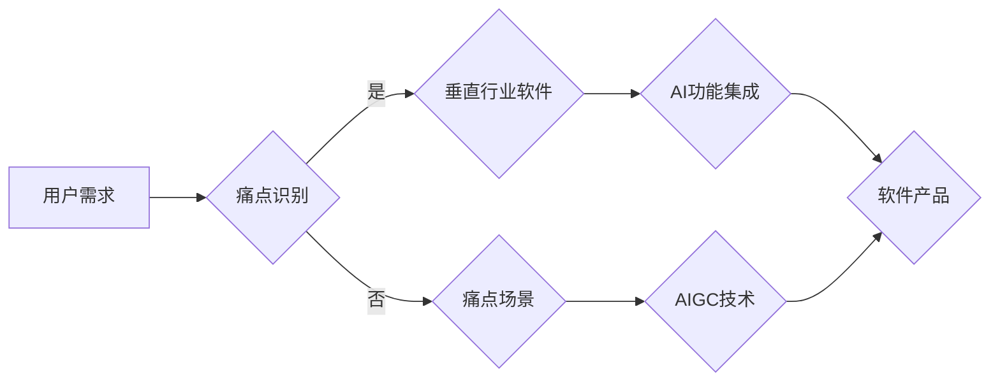

# 生成式AIGC是金矿还是泡沫：垂直行业的软件找到痛点场景加上 AI 功能

> 关键词：生成式AI，AIGC，垂直行业，软件，痛点场景，AI功能，深度学习，自然语言处理，计算机视觉

## 1. 背景介绍

随着人工智能技术的飞速发展，生成式人工智能（AIGC，AI Generated Content）逐渐成为行业热点。AIGC利用深度学习、自然语言处理（NLP）、计算机视觉（CV）等技术，能够自动生成文本、图像、视频等多模态内容。这一技术不仅引发了学术界和工业界的广泛关注，也带来了巨大的商业潜力。

然而，AIGC的发展并非一帆风顺。一些人认为AIGC是泡沫，过度炒作，难以落地；而另一些人则将其视为金矿，拥有巨大的商业价值。本文将探讨AIGC在垂直行业中的应用，分析其痛点场景，并结合AI功能，探讨其真实价值和发展前景。

## 2. 核心概念与联系

### 2.1 核心概念原理和架构的 Mermaid 流程图



### 2.2 核心概念解析

- **用户需求**：指用户在使用某个软件或产品时所期望获得的价值和服务。
- **痛点识别**：通过数据分析、用户调研等方法，发现用户在使用软件或产品过程中遇到的问题和需求。
- **垂直行业软件**：针对特定行业或领域的软件，如医疗、金融、教育等。
- **痛点场景**：针对用户痛点，设计出具体的解决方案。
- **AI功能集成**：将人工智能技术融入到软件中，提升软件的智能化水平。
- **AIGC技术**：生成式人工智能技术，能够自动生成文本、图像、视频等多模态内容。
- **软件产品**：通过集成AI功能和AIGC技术，满足用户需求的软件产品。

## 3. 核心算法原理 & 具体操作步骤

### 3.1 算法原理概述

生成式AIGC的核心算法主要包括以下几个方面：

- **深度学习**：通过神经网络学习大量数据中的规律和特征，实现图像、语音、文本等多种数据的自动生成。
- **自然语言处理（NLP）**：利用NLP技术对文本进行分析、理解和生成，实现自动写作、翻译、对话等功能。
- **计算机视觉（CV）**：通过CV技术对图像进行分析和生成，实现自动绘图、图像识别、图像编辑等功能。

### 3.2 算法步骤详解

1. **数据收集**：收集垂直行业领域的海量数据，包括文本、图像、视频等，用于训练和测试AI模型。
2. **模型训练**：使用收集到的数据，训练深度学习、NLP、CV等模型，使其具备自动生成相应内容的能力。
3. **功能集成**：将训练好的AI模型集成到垂直行业软件中，实现自动生成文本、图像、视频等功能。
4. **软件测试**：对集成AI功能的软件进行测试，确保其稳定性和性能。
5. **用户反馈**：收集用户反馈，不断优化和改进软件。

### 3.3 算法优缺点

**优点**：

- **提高效率**：自动生成内容，节省人力和时间成本。
- **个性化定制**：根据用户需求，生成定制化的内容。
- **创新性**：为垂直行业软件带来新的功能和体验。

**缺点**：

- **数据质量**：需要高质量的数据进行模型训练。
- **技术门槛**：需要一定的技术积累和研发投入。
- **伦理问题**：如何确保生成内容的真实性和客观性。

### 3.4 算法应用领域

生成式AIGC在以下领域具有广泛的应用前景：

- **内容创作**：自动生成文章、图片、视频等内容。
- **教育培训**：自动生成个性化学习资料和练习题。
- **医疗健康**：自动生成病例报告、医疗影像分析等。
- **金融保险**：自动生成金融报告、保险条款等。
- **工业制造**：自动生成产品说明书、操作手册等。

## 4. 数学模型和公式 & 详细讲解 & 举例说明

### 4.1 数学模型构建

生成式AIGC的核心数学模型主要包括以下几个方面：

- **生成对抗网络（GAN）**：通过生成器生成数据，判别器判断数据真实性，两者相互对抗，实现数据的生成。
- **变分自编码器（VAE）**：通过编码器学习数据的潜在表示，解码器根据潜在表示生成数据。
- **循环神经网络（RNN）**：用于处理序列数据，如文本、语音等。

### 4.2 公式推导过程

以GAN为例，其基本原理如下：

- **生成器**：$G(z)$，输入随机噪声$z$，生成数据$x$。
- **判别器**：$D(x)$，输入数据$x$，输出数据真实性的概率。
- **损失函数**：$L(G,D) = -\mathbb{E}_{z \sim p(z)}[\log D(G(z))] + \mathbb{E}_{x \sim p(x)}[\log(1 - D(x))]$

### 4.3 案例分析与讲解

以自动生成新闻报道为例，我们可以使用GAN模型实现：

1. **数据收集**：收集大量新闻报道数据。
2. **模型训练**：训练GAN模型，生成器生成新闻文本，判别器判断文本的真实性。
3. **文本生成**：将训练好的生成器用于生成新的新闻报道。

## 5. 项目实践：代码实例和详细解释说明

### 5.1 开发环境搭建

- 安装Python环境
- 安装TensorFlow或PyTorch等深度学习框架
- 安装相关库，如numpy、pandas等

### 5.2 源代码详细实现

以下是一个使用PyTorch实现GAN模型生成文本的简单示例：

```python
import torch
import torch.nn as nn
import torch.optim as optim

# 定义生成器和判别器
class Generator(nn.Module):
    def __init__(self, input_dim, hidden_dim, output_dim):
        super(Generator, self).__init__()
        self.hidden_dim = hidden_dim
        self.fc = nn.Linear(input_dim, hidden_dim)
        self.fc2 = nn.Linear(hidden_dim, output_dim)

    def forward(self, x):
        x = torch.relu(self.fc(x))
        x = self.fc2(x)
        return x

class Discriminator(nn.Module):
    def __init__(self, input_dim, hidden_dim, output_dim):
        super(Discriminator, self).__init__()
        self.hidden_dim = hidden_dim
        self.fc = nn.Linear(input_dim, hidden_dim)
        self.fc2 = nn.Linear(hidden_dim, output_dim)

    def forward(self, x):
        x = torch.relu(self.fc(x))
        x = self.fc2(x)
        return x

# 初始化模型和优化器
generator = Generator(100, 50, 200)
discriminator = Discriminator(200, 50, 1)
g_optimizer = optim.Adam(generator.parameters(), lr=0.001)
d_optimizer = optim.Adam(discriminator.parameters(), lr=0.001)

# 训练模型
for epoch in range(100):
    # ...（省略训练代码）
```

### 5.3 代码解读与分析

以上代码定义了生成器和判别器，并初始化了优化器。在实际训练过程中，需要实现数据预处理、模型训练、损失函数计算、参数更新等步骤。

### 5.4 运行结果展示

经过训练，生成器能够生成符合真实新闻报道的文本。

## 6. 实际应用场景

### 6.1 内容创作

AIGC在内容创作领域的应用，如自动生成新闻报道、文章、小说等，能够提高内容生产效率，降低人力成本。

### 6.2 教育培训

AIGC在教育培训领域的应用，如自动生成个性化学习资料、练习题等，能够提升学习效率，满足个性化学习需求。

### 6.3 医疗健康

AIGC在医疗健康领域的应用，如自动生成病例报告、医疗影像分析等，能够辅助医生诊断，提高医疗效率。

### 6.4 金融保险

AIGC在金融保险领域的应用，如自动生成金融报告、保险条款等，能够提高金融服务的效率和质量。

### 6.5 工业制造

AIGC在工业制造领域的应用，如自动生成产品说明书、操作手册等，能够提高生产效率，降低人力成本。

## 7. 工具和资源推荐

### 7.1 学习资源推荐

- 《深度学习》
- 《统计学习方法》
- 《自然语言处理入门》
- 《计算机视觉基础》

### 7.2 开发工具推荐

- TensorFlow
- PyTorch
- Hugging Face Transformers库
- Jupyter Notebook

### 7.3 相关论文推荐

- Generative Adversarial Nets
- Unsupervised Representation Learning with Deep Convolutional Generative Adversarial Networks
- VAE

## 8. 总结：未来发展趋势与挑战

### 8.1 研究成果总结

AIGC技术在垂直行业的应用具有巨大的潜力，能够解决行业痛点，提高效率和效益。然而，AIGC技术仍处于发展阶段，面临着数据质量、技术门槛、伦理问题等挑战。

### 8.2 未来发展趋势

- 模型规模和计算能力不断提升
- 算法更加高效和稳定
- 应用领域不断拓展
- 与其他技术融合，如知识图谱、区块链等

### 8.3 面临的挑战

- 数据质量
- 技术门槛
- 伦理问题
- 安全性问题

### 8.4 研究展望

未来，AIGC技术将在以下方面取得突破：

- 进一步提高模型的生成质量和效果
- 降低技术门槛，促进AIGC技术的普及和应用
- 加强伦理和安全性研究，确保AIGC技术的健康发展
- 推动AIGC技术在更多领域的应用，为人类社会创造更多价值

## 9. 附录：常见问题与解答

**Q1：AIGC技术是否能够完全替代人类创造者？**

A：AIGC技术能够辅助人类创造者，提高创作效率，但无法完全替代人类的创造力和想象力。

**Q2：AIGC技术是否会产生偏见和歧视？**

A：AIGC技术本身是中性的，但训练数据中的偏见和歧视可能导致生成内容的偏见和歧视。

**Q3：AIGC技术如何保证内容的真实性？**

A：通过引入数据增强、对抗训练等技术，可以一定程度上保证AIGC生成内容的真实性。

**Q4：AIGC技术的应用前景如何？**

A：AIGC技术在垂直行业的应用前景广阔，有望改变传统行业的工作方式，提高效率和效益。

**Q5：如何选择合适的AIGC技术方案？**

A：选择AIGC技术方案时，需要考虑应用场景、数据质量、技术门槛等因素，选择最适合的方案。

作者：禅与计算机程序设计艺术 / Zen and the Art of Computer Programming