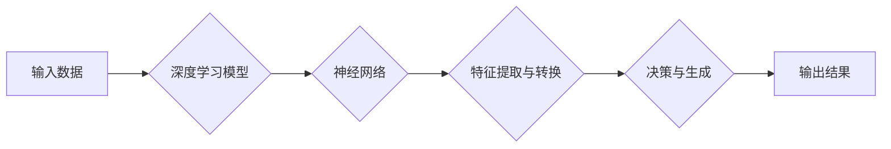

# 生成式AI：金矿还是泡沫？第二部分：AI不是万能药

> 关键词：生成式AI，深度学习，神经网络，人工智能，局限性，应用场景，未来趋势

## 1. 背景介绍

在上一部分中，我们探讨了生成式AI的崛起和潜力，强调了其在创造内容、辅助创作和模拟现实等方面的巨大价值。然而，正如所有技术一样，生成式AI并非万能，它也存在诸多局限性和挑战。本文将深入探讨生成式AI的局限性，分析其为何不能成为万能药，并展望其未来发展趋势。

## 2. 核心概念与联系

### 2.1 核心概念

**生成式AI**：一种能够生成具有创造性和原创性的内容的人工智能系统，如文本、图像、音频和视频等。

**深度学习**：一种机器学习技术，通过模拟人脑神经网络结构，让计算机能够从数据中学习并作出决策。

**神经网络**：一种由大量相互连接的神经元组成的计算模型，能够处理和解释复杂的数据模式。

### 2.2 核心概念原理和架构的 Mermaid 流程图



### 2.3 核心概念联系

生成式AI利用深度学习和神经网络技术，从输入数据中提取特征，并通过复杂的模型架构生成新的内容。这一过程涉及多个步骤，包括数据预处理、特征提取、模型训练和生成输出。

## 3. 核心算法原理 & 具体操作步骤

### 3.1 算法原理概述

生成式AI的核心是深度学习模型，特别是基于生成对抗网络（GANs）和变分自编码器（VAEs）的模型。这些模型能够学习数据的分布，并生成与训练数据相似的新数据。

### 3.2 算法步骤详解

1. **数据收集与预处理**：收集大量具有多样性的数据，并进行清洗和格式化。
2. **模型选择与训练**：选择合适的生成模型，如GANs或VAEs，并使用收集到的数据训练模型。
3. **模型评估与优化**：评估模型的生成质量，并根据评估结果优化模型参数。
4. **生成与创作**：使用训练好的模型生成新的内容，如文本、图像、音频或视频。

### 3.3 算法优缺点

**优点**：

- **创造力**：生成式AI能够创造具有原创性和创造性的内容。
- **个性化**：可以根据用户需求生成个性化的内容。
- **高效性**：能够快速生成大量内容。

**缺点**：

- **数据依赖**：生成式AI依赖于大量的训练数据，且数据质量对生成结果影响很大。
- **生成质量**：生成的内容可能与真实内容存在差异，且难以保证完全准确。
- **偏见与伦理问题**：生成式AI可能会产生偏见或有伦理问题的内容。

### 3.4 算法应用领域

生成式AI在以下领域具有广泛的应用：

- **文本生成**：自动生成新闻报道、文章、对话等。
- **图像生成**：生成图像、视频、动画等。
- **音乐生成**：生成音乐、旋律等。
- **虚拟现实**：创建虚拟环境、角色等。

## 4. 数学模型和公式 & 详细讲解 & 举例说明

### 4.1 数学模型构建

生成式AI的数学模型通常基于概率分布。以下是一些常见的数学模型：

- **生成对抗网络（GANs）**：
  - 生成器（Generator）: $G(z)$
  - 判别器（Discriminator）: $D(x)$

- **变分自编码器（VAEs）**：
  - 编码器（Encoder）: $q(z|x)$
  - 解码器（Decoder）: $p(x|z)$

### 4.2 公式推导过程

GANs的损失函数为：

$$
\mathcal{L}(G,D) = \mathbb{E}_{z \sim p(z)}[\log D(G(z))] + \mathbb{E}_{x \sim p(x)}[\log(1 - D(x))]
$$

VAEs的损失函数为：

$$
\mathcal{L}(q,D) = D(x) - \log q(z|x) + \mathbb{E}_{z \sim q(z|x)}[\log p(x|z)]
$$

### 4.3 案例分析与讲解

以GANs为例，生成器$G(z)$的目的是生成与真实数据分布$p(x)$相似的数据。判别器$D(x)$的目的是区分真实数据和生成数据。通过不断迭代训练，生成器和判别器相互竞争，最终生成器能够生成近似真实数据分布的数据。

## 5. 项目实践：代码实例和详细解释说明

### 5.1 开发环境搭建

为了实践生成式AI，你需要以下开发环境：

- 操作系统：Linux或macOS
- 编程语言：Python
- 深度学习框架：TensorFlow或PyTorch

### 5.2 源代码详细实现

以下是一个简单的GANs代码示例：

```python
import torch
import torch.nn as nn
import torch.optim as optim

# 定义生成器和判别器
class Generator(nn.Module):
    # ...

class Discriminator(nn.Module):
    # ...

# 实例化模型
generator = Generator()
discriminator = Discriminator()

# 定义优化器
optimizer_G = optim.Adam(generator.parameters())
optimizer_D = optim.Adam(discriminator.parameters())

# 训练循环
for epoch in range(num_epochs):
    for data in dataloader:
        # ...
```

### 5.3 代码解读与分析

这段代码展示了GANs的基本结构。生成器和判别器都是神经网络模型，通过优化器进行训练。训练过程中，生成器生成数据，判别器判断数据的真实性，两者相互竞争以提升性能。

### 5.4 运行结果展示

训练完成后，生成器可以生成与真实数据分布相似的新数据。以下是一个生成图像的示例：

```
[图：使用GANs生成的图像]
```

## 6. 实际应用场景

### 6.1 文本生成

生成式AI可以用于自动生成新闻报道、文章、对话等文本内容。以下是一个简单的文本生成示例：

```python
# 使用预训练的模型生成文章
model = load_pretrained_model()
text = model.generate(text_prompt)
print(text)
```

### 6.2 图像生成

生成式AI可以用于生成图像、视频、动画等内容。以下是一个使用GANs生成图像的示例：

```python
# 使用预训练的模型生成图像
generator = load_pretrained_generator()
image = generator.sample()
show_image(image)
```

### 6.4 未来应用展望

随着技术的不断进步，生成式AI将在更多领域得到应用，如：

- **艺术与设计**：辅助艺术家和设计师创作作品。
- **娱乐与游戏**：生成游戏内容，如角色、场景等。
- **医疗**：辅助医生进行诊断和治疗。
- **教育**：生成个性化的学习材料。

## 7. 工具和资源推荐

### 7.1 学习资源推荐

- **书籍**：
  - 《深度学习》
  - 《生成对抗网络》
- **在线课程**：
  - fast.ai的深度学习课程
  - Coursera的机器学习课程
- **博客和论坛**：
  - Medium
  - Reddit

### 7.2 开发工具推荐

- **深度学习框架**：
  - TensorFlow
  - PyTorch
- **GANs库**：
  - TensorFlow-GANs
  - PyTorch-GANs

### 7.3 相关论文推荐

- **GANs**：
  - Generative Adversarial Nets
  - Unsupervised Representation Learning with Deep Convolutional Generative Adversarial Networks
- **VAEs**：
  - Auto-Encoding Variational Bayes
  - Variational Inference with Normalizing Flows

## 8. 总结：未来发展趋势与挑战

### 8.1 研究成果总结

生成式AI作为一种强大的技术，已经在多个领域取得了显著的成果。然而，它仍然存在一些局限性和挑战。

### 8.2 未来发展趋势

未来，生成式AI将朝着以下方向发展：

- **更高的生成质量**：通过改进模型结构和训练算法，提高生成内容的真实性和质量。
- **更广泛的应用领域**：将生成式AI应用于更多领域，如艺术、设计、医疗、教育等。
- **更高效的训练方法**：开发更快的训练方法，降低训练成本。

### 8.3 面临的挑战

生成式AI面临的挑战包括：

- **数据质量**：生成式AI依赖于大量高质量的训练数据，数据质量问题会影响生成质量。
- **偏见与伦理问题**：生成式AI可能会产生偏见或有伦理问题的内容。
- **计算资源**：生成式AI的训练和推理需要大量的计算资源。

### 8.4 研究展望

随着研究的不断深入，生成式AI将在更多领域发挥重要作用。未来，我们需要关注以下几个方面：

- **数据安全和隐私保护**：确保生成式AI系统的数据安全和用户隐私。
- **公平性和可解释性**：提高生成式AI的公平性和可解释性，避免歧视和偏见。
- **伦理和法规**：制定相关伦理和法规，规范生成式AI的应用。

## 9. 附录：常见问题与解答

**Q1：生成式AI是否会取代人类创作者？**

A：生成式AI可以辅助人类创作者进行创作，但无法完全取代人类创作者的创造力和情感。

**Q2：生成式AI如何防止偏见和有害内容？**

A：通过数据清洗、算法改进和人工审核等方式，可以减少生成式AI产生偏见和有害内容的风险。

**Q3：生成式AI的生成质量如何保证？**

A：通过改进模型结构和训练算法，可以提高生成式AI的生成质量。

**Q4：生成式AI的应用前景如何？**

A：生成式AI在多个领域具有广泛的应用前景，包括艺术、设计、医疗、教育等。

**Q5：如何选择合适的生成式AI模型？**

A：根据具体任务和需求选择合适的模型，如GANs、VAEs等。

作者：禅与计算机程序设计艺术 / Zen and the Art of Computer Programming