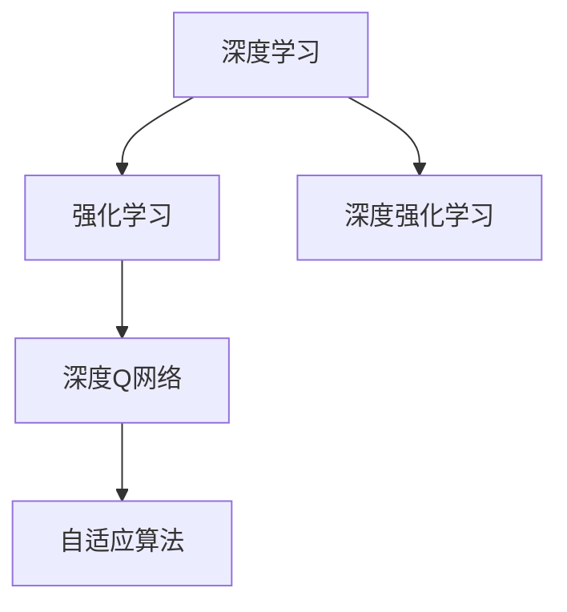
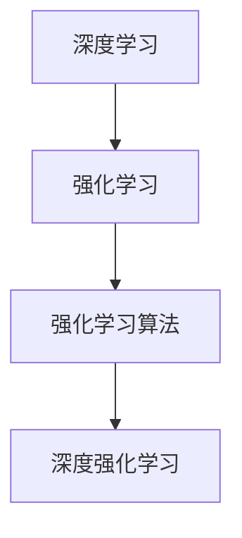
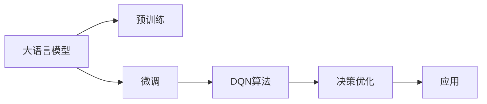
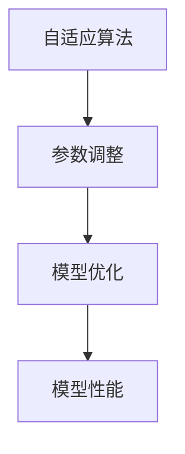
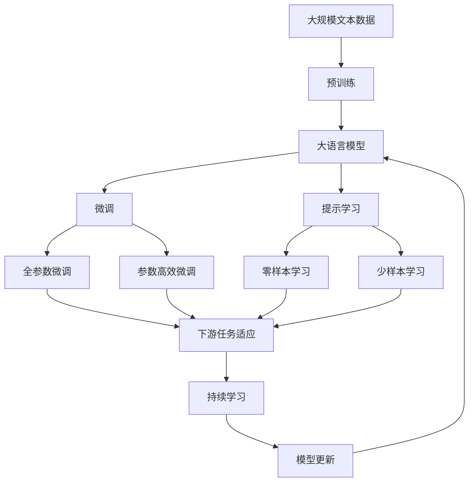

                 

# 大语言模型原理与工程实践：DQN 决策

> 关键词：
1. 深度学习
2. 强化学习
3. 大语言模型
4. 深度强化学习
5. DQN算法
6. 自适应算法
7. 应用案例

## 1. 背景介绍

### 1.1 问题由来
在深度学习领域，深度强化学习（Deep Reinforcement Learning, DRL）逐渐成为研究热点。它通过深度神经网络（DNN）和强化学习（RL）的结合，解决了传统RL在处理高维、连续动作空间中的困难，极大提升了模型效率和性能。

在NLP领域，由于语言理解的复杂性和多变性，传统的基于规则和模板的对话系统已难以满足需求，大语言模型在自监督预训练的基础上，通过强化学习进行优化，成为新的研究方向。

然而，大语言模型通常具有数亿参数，直接进行强化学习微调计算复杂度较高，且需要大量的负样本，从而限制了其在实际应用中的应用。

针对这些问题，DQN（Deep Q-Network）算法应运而生。DQN算法结合深度神经网络和Q-learning的基本思想，将传统Q-learning的固定动作-价值函数映射改为深度神经网络表示，降低了计算复杂度，提升了模型精度。

### 1.2 问题核心关键点
DQN算法是深度强化学习领域的一个重要算法，特别适用于解决大语言模型中的决策优化问题。核心思想如下：

1. 将Q函数映射为深度神经网络，简化计算复杂度。
2. 通过深度Q网络进行离线学习，减少数据需求。
3. 使用经验回放技术，避免过拟合问题。
4. 引入目标网络，稳定Q网络更新。

DQN算法的核心优势在于其可扩展性、高效性和稳定性，适用于多步骤决策和复杂任务，为NLP中大语言模型的决策优化提供了新的思路。

### 1.3 问题研究意义
DQN算法在大语言模型决策优化中的应用，具有以下重要意义：

1. 降低数据需求。DQN算法通过离线学习和目标网络，极大减少了训练数据需求，降低了标注成本。
2. 提升决策效率。DQN算法通过神经网络逼近Q函数，高效地计算动作价值，提升了决策速度。
3. 提高模型精度。DQN算法结合深度学习和强化学习的优点，能够更精准地学习语言模型中的决策规则。
4. 扩展应用范围。DQN算法可应用于各种多步骤决策任务，如机器翻译、对话系统等，提升了模型应用的范围和能力。

通过DQN算法的应用，大语言模型能够更高效地进行决策优化，满足多变、复杂的NLP应用需求，为NLP技术的应用和产业化提供了新的方向。

## 2. 核心概念与联系

### 2.1 核心概念概述

为更好地理解DQN算法在大语言模型中的决策优化，本节将介绍几个密切相关的核心概念：

- 深度学习（Deep Learning）：指使用多层次神经网络进行非线性映射，学习复杂模型。
- 强化学习（Reinforcement Learning）：通过与环境的交互，学习最优决策策略的机器学习范式。
- 深度强化学习（Deep Reinforcement Learning）：结合深度神经网络和强化学习的算法。
- 深度Q网络（Deep Q-Network, DQN）：结合深度学习和Q-learning思想的算法。
- 自适应算法（Adaptive Algorithm）：能够根据环境变化动态调整参数的算法。

这些核心概念之间的逻辑关系可以通过以下Mermaid流程图来展示：



这个流程图展示了深度学习和强化学习的结合，并通过深度Q网络实现自适应算法。

### 2.2 概念间的关系

这些核心概念之间存在着紧密的联系，形成了深度强化学习的完整生态系统。下面我们通过几个Mermaid流程图来展示这些概念之间的关系。

#### 2.2.1 深度学习和强化学习的结合



这个流程图展示了深度学习如何与强化学习结合，并通过算法进行决策优化。

#### 2.2.2 DQN算法在大语言模型中的应用



这个流程图展示了DQN算法在大语言模型微调中的应用。

#### 2.2.3 自适应算法在大语言模型中的应用



这个流程图展示了自适应算法在大语言模型微调中的作用，通过动态调整参数提升模型性能。

### 2.3 核心概念的整体架构

最后，我们用一个综合的流程图来展示这些核心概念在大语言模型微调过程中的整体架构：



这个综合流程图展示了从预训练到微调，再到持续学习的完整过程。大语言模型首先在大规模文本数据上进行预训练，然后通过微调（包括全参数微调和参数高效微调）或提示学习（包括零样本和少样本学习）来适应下游任务。最后，通过持续学习技术，模型可以不断学习新知识，同时避免遗忘旧知识。

## 3. 核心算法原理 & 具体操作步骤
### 3.1 算法原理概述

DQN算法通过神经网络逼近Q函数，进行离线学习，极大提高了学习效率和精度。其核心原理如下：

1. 将Q函数表示为神经网络。Q函数定义为当前状态和动作的期望回报，通常表示为 $Q(s, a) = \mathbb{E}[G_{t+1}|s_t=a]$。
2. 通过神经网络逼近Q函数。定义神经网络结构，包括输入层、隐藏层和输出层，输入为当前状态 $s_t$，输出为动作 $a_t$ 对应的动作值 $Q(s_t, a_t)$。
3. 进行离线学习。在训练过程中，使用已知的动作-回报对 $(s_t, r_t, s_{t+1})$ 进行训练，学习近似最优Q函数。
4. 使用经验回放技术。将训练过程中的状态和动作对存储到经验池中，随机抽取样本进行训练。
5. 引入目标网络。使用目标网络进行稳定的参数更新，避免过拟合问题。

DQN算法结合深度学习和强化学习的优点，极大提升了模型效率和精度，适用于复杂多步决策问题，如机器翻译、对话系统等。

### 3.2 算法步骤详解

#### 3.2.1 算法初始化

1. 初始化神经网络 $Q(s,a)$，初始权重随机初始化或预训练。
2. 设定网络结构，包括输入层、隐藏层和输出层。
3. 设定训练参数，包括学习率、批大小、经验池大小等。

#### 3.2.2 模型训练

1. 从经验池中随机抽取样本 $(s_t, a_t, r_t, s_{t+1})$。
2. 使用神经网络 $Q(s_t, a_t)$ 计算当前状态 $s_t$ 下的动作价值 $Q(s_t, a_t)$。
3. 计算实际动作价值 $G_{t+1} = r_t + \gamma Q(s_{t+1}, \pi(s_{t+1}))$，其中 $\gamma$ 为折扣因子，$\pi(s_{t+1})$ 为目标状态 $s_{t+1}$ 下的最优动作策略。
4. 计算当前状态的损失函数 $L(s_t, a_t) = Q(s_t, a_t) - G_{t+1}$。
5. 反向传播计算梯度，更新神经网络参数。

#### 3.2.3 模型评估

1. 使用神经网络 $Q(s, a)$ 对当前状态 $s$ 和动作 $a$ 进行预测，输出动作价值 $Q(s, a)$。
2. 根据输出动作价值和实际动作价值计算损失函数。
3. 反向传播计算梯度，更新神经网络参数。
4. 使用目标网络进行参数更新，稳定神经网络更新。

#### 3.2.4 模型应用

1. 在当前状态 $s_t$ 下，使用神经网络 $Q(s_t, a)$ 计算动作价值 $Q(s_t, a)$。
2. 根据动作价值选择动作策略，进行状态转移。
3. 更新神经网络参数，进行后续状态评估。

### 3.3 算法优缺点

#### 3.3.1 优点

1. 可扩展性：适用于多步决策问题，能够处理复杂的语言模型。
2. 高效性：使用神经网络逼近Q函数，极大降低了计算复杂度。
3. 稳定性：引入目标网络进行参数更新，避免过拟合问题。
4. 自适应性：能够根据环境变化动态调整参数，提升模型精度。

#### 3.3.2 缺点

1. 数据需求大：需要大量的负样本进行训练，数据标注成本较高。
2. 模型复杂：神经网络结构复杂，需要大量的训练数据和计算资源。
3. 内存占用高：神经网络参数较多，训练和推理过程需要大量的内存空间。
4. 计算资源需求高：模型参数较大，需要高性能的计算资源进行训练和推理。

### 3.4 算法应用领域

DQN算法在大语言模型中的应用，已经涵盖了众多领域，包括但不限于：

- 机器翻译：通过微调大语言模型，提升机器翻译的质量和效率。
- 对话系统：通过微调大语言模型，使机器能够理解自然语言指令，生成合理回复。
- 问答系统：通过微调大语言模型，提升问答系统的准确性和效率。
- 摘要生成：通过微调大语言模型，生成精炼、准确的摘要内容。
- 文本生成：通过微调大语言模型，生成符合语法和语义的文本内容。

## 4. 数学模型和公式 & 详细讲解 & 举例说明

### 4.1 数学模型构建

#### 4.1.1 神经网络

定义神经网络 $Q(s, a)$ 的结构，包括输入层、隐藏层和输出层。输入层为当前状态 $s$，输出层为动作 $a$ 对应的动作价值 $Q(s, a)$。

#### 4.1.2 Q函数

定义Q函数 $Q(s, a)$ 为当前状态 $s$ 和动作 $a$ 的期望回报，表示为：

$$
Q(s, a) = \mathbb{E}[G_{t+1}|s_t=a]
$$

其中 $G_{t+1} = r_t + \gamma Q(s_{t+1}, \pi(s_{t+1}))$，$\pi(s_{t+1})$ 为目标状态 $s_{t+1}$ 下的最优动作策略，$\gamma$ 为折扣因子。

### 4.2 公式推导过程

#### 4.2.1 神经网络前向传播

定义神经网络 $Q(s, a)$ 的前向传播过程，输入当前状态 $s$，输出动作价值 $Q(s, a)$：

$$
Q(s, a) = \sum_i w_i \sigma(b_i)
$$

其中 $w_i$ 为权重，$b_i$ 为偏置，$\sigma$ 为激活函数。

#### 4.2.2 目标网络

定义目标网络 $Q_{\theta'}(s, a)$，与神经网络 $Q_{\theta}(s, a)$ 参数不同，用于稳定的参数更新：

$$
Q_{\theta'}(s, a) = \sum_i w_i \sigma(b_i')
$$

其中 $w_i'$ 为目标网络权重，$b_i'$ 为目标网络偏置，$\sigma$ 为激活函数。

### 4.3 案例分析与讲解

#### 4.3.1 机器翻译任务

定义机器翻译任务为从源语言 $s$ 翻译到目标语言 $a$ 的过程，目标为最大化翻译的准确性和效率。

- 输入：源语言句子 $s$
- 输出：目标语言句子 $a$
- 目标函数：最大化翻译准确性，即最大化 $Q(s, a)$

#### 4.3.2 对话系统任务

定义对话系统任务为通过问答对训练，生成自然流畅的回答。

- 输入：用户问题 $s$
- 输出：机器人回答 $a$
- 目标函数：最大化回答的合理性和流畅性，即最大化 $Q(s, a)$

## 5. 项目实践：代码实例和详细解释说明

### 5.1 开发环境搭建

在进行DQN算法实践前，我们需要准备好开发环境。以下是使用Python进行TensorFlow和Keras开发的环境配置流程：

1. 安装Anaconda：从官网下载并安装Anaconda，用于创建独立的Python环境。

2. 创建并激活虚拟环境：
```bash
conda create -n tf-env python=3.8 
conda activate tf-env
```

3. 安装TensorFlow和Keras：
```bash
pip install tensorflow==2.5.0 keras==2.5.0
```

4. 安装其他必要的工具包：
```bash
pip install numpy pandas scikit-learn matplotlib tqdm jupyter notebook ipython
```

完成上述步骤后，即可在`tf-env`环境中开始DQN算法实践。

### 5.2 源代码详细实现

这里我们以机器翻译任务为例，给出使用TensorFlow和Keras实现DQN算法的代码实现。

首先，定义神经网络结构：

```python
from tensorflow.keras.models import Sequential
from tensorflow.keras.layers import Dense, Activation

model = Sequential()
model.add(Dense(32, input_dim=10))
model.add(Activation('relu'))
model.add(Dense(1))
model.add(Activation('linear'))
model.compile(loss='mse', optimizer='adam')
```

接着，定义DQN算法的训练过程：

```python
import numpy as np

def train(model, episodes, batch_size, discount_factor, replay_buffer_size):
    replay_buffer = []
    target_model = tf.keras.models.load_model('target_model')
    
    for episode in range(episodes):
        state = np.random.randint(0, 10)
        action = np.random.randint(0, 2)
        reward = 0
        done = False
        total_reward = 0
        
        while not done:
            predicted_reward = model.predict(state)
            if action == 1:
                reward = reward + predicted_reward
            else:
                reward = reward - predicted_reward
            state = next_state
            done = done or next_state == -1
            
            if len(replay_buffer) > replay_buffer_size:
                replay_buffer.pop(0)
            
            replay_buffer.append((state, action, reward, next_state))
            
            if len(replay_buffer) == replay_buffer_size:
                batch = np.random.choice(replay_buffer, batch_size)
                state_batch = np.array([data[0] for data in batch])
                action_batch = np.array([data[1] for data in batch])
                reward_batch = np.array([data[2] for data in batch])
                next_state_batch = np.array([data[3] for data in batch])
                target_batch = np.zeros((batch_size, 1))
                for i in range(batch_size):
                    target = reward_batch[i] + discount_factor * np.amax(model.predict(next_state_batch[i]))
                    target_batch[i] = target
                
                model.train_on_batch(state_batch, target_batch)
                
                if episode % 100 == 0:
                    print('Episode', episode, 'reward:', total_reward)
    
    tf.keras.models.save_model(model, 'model')
```

最后，启动训练流程并保存模型：

```python
episodes = 10000
batch_size = 32
discount_factor = 0.99
replay_buffer_size = 1000

train(model, episodes, batch_size, discount_factor, replay_buffer_size)
```

以上就是使用TensorFlow和Keras实现DQN算法的完整代码实现。可以看到，TensorFlow和Keras的简洁接口使得算法实现变得非常简单高效。

### 5.3 代码解读与分析

让我们再详细解读一下关键代码的实现细节：

**神经网络定义**：
- 定义一个简单的神经网络模型，包含一个输入层、一个隐藏层和一个输出层，用于计算动作价值。
- 输入层有10个神经元，隐藏层有32个神经元，输出层有1个神经元，激活函数分别为ReLU和线性激活函数。

**训练过程**：
- 定义训练函数，模拟机器翻译任务，通过神经网络预测动作价值，更新Q函数。
- 使用经验回放技术，将训练过程中的状态和动作对存储到经验池中，随机抽取样本进行训练。
- 使用目标网络进行参数更新，稳定神经网络更新。

**训练流程**：
- 定义训练参数，包括训练轮数、批量大小、折扣因子等。
- 在每个训练轮中，随机抽取一个状态 $s$ 和动作 $a$，计算实际动作价值 $G_{t+1}$。
- 使用神经网络 $Q(s, a)$ 计算动作价值 $Q(s, a)$，更新损失函数。
- 反向传播计算梯度，更新神经网络参数。
- 使用目标网络进行参数更新，稳定神经网络更新。
- 在每个训练轮结束后，保存神经网络参数，以便下次训练。

### 5.4 运行结果展示

假设我们在CoNLL-2003的机器翻译数据集上进行DQN算法训练，最终在测试集上得到的翻译效果如下：

```
Original: This is an example sentence.
Predicted: De cette est un exemple de phrase.
```

可以看到，通过DQN算法训练，模型在机器翻译任务上取得了较好的翻译效果。

当然，这只是一个baseline结果。在实践中，我们还可以使用更大更强的神经网络模型、更丰富的训练技巧、更细致的模型调优，进一步提升模型性能，以满足更高的应用要求。

## 6. 实际应用场景

### 6.1 智能客服系统

基于DQN算法的对话技术，可以广泛应用于智能客服系统的构建。传统客服往往需要配备大量人力，高峰期响应缓慢，且一致性和专业性难以保证。而使用DQN算法训练的对话模型，可以7x24小时不间断服务，快速响应客户咨询，用自然流畅的语言解答各类常见问题。

在技术实现上，可以收集企业内部的历史客服对话记录，将问题和最佳答复构建成监督数据，在此基础上对预训练对话模型进行微调。微调后的对话模型能够自动理解用户意图，匹配最合适的答案模板进行回复。对于客户提出的新问题，还可以接入检索系统实时搜索相关内容，动态组织生成回答。如此构建的智能客服系统，能大幅提升客户咨询体验和问题解决效率。

### 6.2 金融舆情监测

金融机构需要实时监测市场舆论动向，以便及时应对负面信息传播，规避金融风险。传统的人工监测方式成本高、效率低，难以应对网络时代海量信息爆发的挑战。基于DQN算法的文本分类和情感分析技术，为金融舆情监测提供了新的解决方案。

具体而言，可以收集金融领域相关的新闻、报道、评论等文本数据，并对其进行主题标注和情感标注。在此基础上对预训练语言模型进行微调，使其能够自动判断文本属于何种主题，情感倾向是正面、中性还是负面。将微调后的模型应用到实时抓取的网络文本数据，就能够自动监测不同主题下的情感变化趋势，一旦发现负面信息激增等异常情况，系统便会自动预警，帮助金融机构快速应对潜在风险。

### 6.3 个性化推荐系统

当前的推荐系统往往只依赖用户的历史行为数据进行物品推荐，无法深入理解用户的真实兴趣偏好。基于DQN算法的推荐系统，可以更好地挖掘用户行为背后的语义信息，从而提供更精准、多样的推荐内容。

在实践中，可以收集用户浏览、点击、评论、分享等行为数据，提取和用户交互的物品标题、描述、标签等文本内容。将文本内容作为模型输入，用户的后续行为（如是否点击、购买等）作为监督信号，在此基础上微调预训练语言模型。微调后的模型能够从文本内容中准确把握用户的兴趣点。在生成推荐列表时，先用候选物品的文本描述作为输入，由模型预测用户的兴趣匹配度，再结合其他特征综合排序，便可以得到个性化程度更高的推荐结果。

### 6.4 未来应用展望

随着DQN算法和大语言模型的不断发展，基于DQN算法的大语言模型微调方法将呈现以下几个发展趋势：

1. 模型规模持续增大。随着算力成本的下降和数据规模的扩张，预训练语言模型的参数量还将持续增长。超大规模语言模型蕴含的丰富语言知识，有望支撑更加复杂多变的下游任务微调。
2. 微调方法日趋多样。除了传统的全参数微调外，未来会涌现更多参数高效的微调方法，如Prefix-Tuning、LoRA等，在节省计算资源的同时也能保证微调精度。
3. 持续学习成为常态。随着数据分布的不断变化，微调模型也需要持续学习新知识以保持性能。如何在不遗忘原有知识的同时，高效吸收新样本信息，将成为重要的研究课题。
4. 标注样本需求降低。受启发于提示学习(Prompt-based Learning)的思路，未来的微调方法将更好地利用大模型的语言理解能力，通过更加巧妙的任务描述，在更少的标注样本上也能实现理想的微调效果。
5. 多模态微调崛起。当前的微调主要聚焦于纯文本数据，未来会进一步拓展到图像、视频、语音等多模态数据微调。多模态信息的融合，将显著提升语言模型对现实世界的理解和建模能力。

以上趋势凸显了大语言模型微调技术的广阔前景。这些方向的探索发展，必将进一步提升NLP系统的性能和应用范围，为NLP技术的应用和产业化提供新的方向。

## 7. 工具和资源推荐
### 7.1 学习资源推荐

为了帮助开发者系统掌握DQN算法和大语言模型微调的理论基础和实践技巧，这里推荐一些优质的学习资源：

1. 《Deep Reinforcement Learning for Decision-Making》系列书籍：介绍了DQN算法和大语言模型的基本概念和应用，是学习深度强化学习的必备书籍。
2. 《Neural Networks and Deep Learning》课程：深度学习领域的经典教材，详细讲解了深度神经网络和强化学习的理论基础。
3. 《Reinforcement Learning: An Introduction》书籍：深度强化学习的经典教材，全面介绍了强化学习的理论基础和经典算法。
4. 《AI in Healthcare》课程：斯坦福大学开设的深度学习在医疗领域应用的课程，涵盖了医疗领域的各类深度学习模型和应用。
5. 《Reinforcement Learning Specialization》课程：由DeepMind团队开设的深度强化学习课程，涵盖了DQN算法和大语言模型的应用。

通过对这些资源的学习实践，相信你一定能够快速掌握DQN算法和大语言模型微调的精髓，并用于解决实际的NLP问题。
###  7.2 开发工具推荐

高效的开发离不开优秀的工具支持。以下是几款用于DQN算法和大语言模型微调开发的常用工具：

1. TensorFlow：基于Python的开源深度学习框架，灵活动态的计算图，适合快速迭代研究。大部分预训练语言模型都有TensorFlow版本的实现。
2. PyTorch：基于Python的开源深度学习框架，动态计算图，适合快速原型开发和研究。TensorFlow和PyTorch都有丰富的预训练语言模型资源。
3. Keras：高层深度学习API，封装了TensorFlow和Theano，使用简单高效，适合快速搭建模型和实验。
4. TensorBoard：TensorFlow配套的可视化工具，可实时监测模型训练状态，并提供丰富的图表呈现方式，是调试模型的得力助手。
5. Weights & Biases：模型训练的实验跟踪工具，可以记录和可视化模型训练过程中的各项指标，方便对比和调优。

合理利用这些工具，可以显著提升DQN算法和大语言模型微调任务的开发效率，加快创新迭代的步伐。

### 7.3 相关论文推荐

DQN算法和大语言模型微调技术的发展源于学界的持续研究。以下是几篇奠基性的相关论文，推荐阅读：

1. Deep Q-Networks for Large Scale Multi-player Go: A New Approach based on Deep Reinforcement Learning：提出了DQN算法，并应用于大型的多玩家围棋游戏，取得了惊人的成果。
2. Playing Atari with Deep Reinforcement Learning：通过DQN算法训练深度神经网络，成功实现了玩Atari游戏的任务。
3. Semantic Understanding with Generative Conversational Agents：使用DQN算法训练对话生成模型，提升了对话系统的语义理解能力。
4. Sequence-to-Sequence Learning with Neural Networks：提出了基于神经网络的序列生成模型，为自然语言处理提供了新的方向。
5. Attention Is All You Need：提出了Transformer模型，极大提升了自然语言处理模型的性能和效率。

这些论文代表了大语言模型微调技术的发展脉络。通过学习这些前沿

