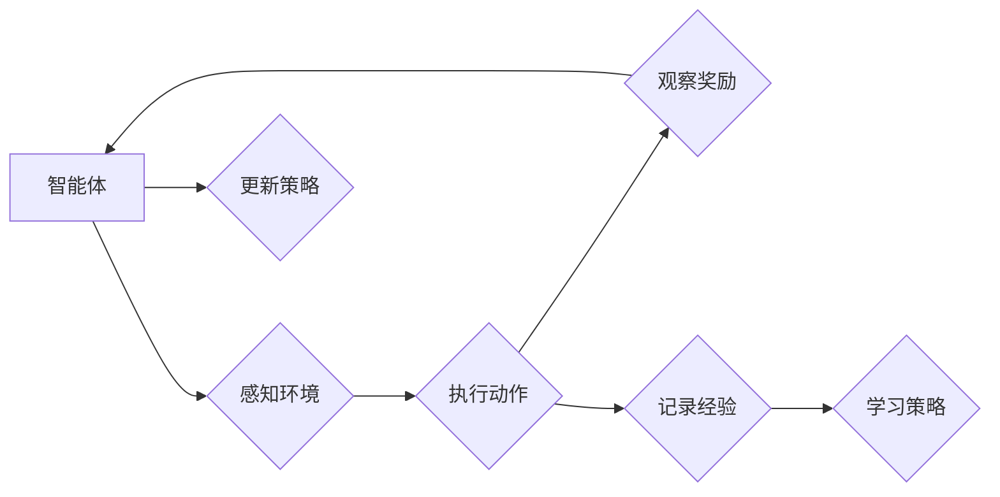

# 强化学习Reinforcement Learning的功能性安全与风险管理分析

> 关键词：强化学习，功能性安全，风险管理，智能系统，安全监控，决策过程，风险评估

## 1. 背景介绍

随着人工智能技术的飞速发展，强化学习（Reinforcement Learning，RL）作为一种重要的机器学习范式，已经在游戏、机器人、自动驾驶、推荐系统等多个领域取得了显著的应用成果。然而，随着强化学习在更广泛领域的应用，其功能性安全和风险管理问题逐渐凸显出来。本文旨在分析强化学习在实现功能性安全和风险管理方面的挑战，并提出相应的解决方案。

### 1.1 强化学习的基本原理

强化学习是一种通过试错和奖励来学习如何最大化长期回报的机器学习范式。在强化学习中，智能体（Agent）通过与环境的交互，学习到一组策略（Strategy），以实现最大化累积奖励的目标。智能体的行为受到奖励函数（Reward Function）和状态-动作空间（State-Action Space）的限制。

### 1.2 强化学习的应用现状

强化学习在多个领域取得了显著的成果，如：

- 游戏：AlphaGo、AlphaStar等模型在围棋、国际象棋等游戏领域击败了人类顶尖选手。
- 机器人：强化学习在机器人导航、抓取、操作等任务中表现出色。
- 自动驾驶：强化学习在自动驾驶领域被用于路径规划、决策控制等任务。
- 推荐系统：强化学习在推荐系统中的应用，如新闻推荐、电影推荐等。

### 1.3 强化学习的功能性安全与风险管理

随着强化学习应用的不断深入，其功能性安全和风险管理问题日益受到关注。强化学习系统的功能性安全主要关注以下几个方面：

- 稳定性：强化学习系统在遇到不确定性和异常情况时，能否保持稳定运行。
- 可靠性：强化学习系统在长时间运行后，能否保持一致的性能水平。
- 鲁棒性：强化学习系统在面对未知环境和变化时，能否适应并完成任务。

风险管理则关注以下几个方面：

- 风险识别：识别强化学习系统可能存在的风险。
- 风险评估：评估风险的可能性和影响程度。
- 风险控制：采取措施降低风险发生的可能性和影响程度。

## 2. 核心概念与联系

### 2.1 核心概念原理和架构的 Mermaid 流程图



### 2.2 核心概念与联系

- 智能体（Agent）：强化学习系统中的决策主体，负责接收环境信息、执行动作、学习策略。
- 环境（Environment）：智能体所处的环境，提供状态和奖励信息。
- 状态（State）：描述智能体当前所处环境的特征。
- 动作（Action）：智能体可以执行的操作。
- 奖励（Reward）：环境对智能体动作的反馈。
- 策略（Strategy）：智能体根据当前状态选择动作的规则。
- 经验（Experience）：智能体在环境中执行动作、观察奖励的记录。
- 学习（Learning）：智能体通过经验不断调整策略，以实现最大化长期回报。

## 3. 核心算法原理 & 具体操作步骤

### 3.1 算法原理概述

强化学习算法的核心思想是通过与环境交互，学习到一组策略，以实现最大化累积奖励的目标。主要算法包括：

- Q学习（Q-Learning）
- 策略梯度（Policy Gradient）
- 深度Q网络（Deep Q-Network，DQN）
- 策略迭代（Policy Iteration）
- 动态规划（Dynamic Programming）

### 3.2 算法步骤详解

1. 初始化：初始化智能体、环境、策略、经验池等。
2. 感知环境：智能体根据当前状态，选择一个动作。
3. 执行动作：智能体将选择的动作传递给环境。
4. 观察奖励：环境根据智能体的动作，返回新的状态和奖励。
5. 记录经验：将当前的状态、动作、奖励和下一个状态记录下来。
6. 学习策略：根据记录的经验，更新策略。
7. 更新策略：根据更新的策略，选择新的动作。
8. 重复步骤2-7，直到满足停止条件。

### 3.3 算法优缺点

#### Q学习

- 优点：简单易实现，适用于连续动作空间。
- 缺点：收敛速度慢，容易陷入局部最优。

#### 策略梯度

- 优点：无需值函数，直接优化策略。
- 缺点：对样本数据敏感，容易发生梯度消失。

#### DQN

- 优点：将深度神经网络与Q学习结合，适用于高维状态空间。
- 缺点：训练不稳定，需要探索-利用平衡。

#### 策略迭代

- 优点：理论上可以收敛到最优策略。
- 缺点：计算复杂度高，难以应用于实际问题。

#### 动态规划

- 优点：理论上可以收敛到最优策略。
- 缺点：需要知道完整的动态环境模型，难以应用于复杂环境。

### 3.4 算法应用领域

强化学习算法在以下领域得到广泛应用：

- 游戏：如围棋、国际象棋、斗地主等。
- 机器人：如导航、抓取、操作等任务。
- 自动驾驶：如路径规划、决策控制等。
- 推荐系统：如新闻推荐、电影推荐等。

## 4. 数学模型和公式 & 详细讲解 & 举例说明

### 4.1 数学模型构建

强化学习的数学模型主要包含以下几个部分：

- 状态空间（State Space）：$S$
- 动作空间（Action Space）：$A$
- 策略（Policy）：$\pi(s)$
- 奖励函数（Reward Function）：$R(s,a)$
- 状态转移函数（State Transition Function）：$P(s'|s,a)$

### 4.2 公式推导过程

#### Q学习

Q学习的目标是最小化以下公式：

$$
J(\theta) = \sum_{s \in S} \sum_{a \in A} Q(s,a) \pi(a|s) - \alpha \sum_{s \in S} \sum_{a \in A} Q(s,a) \pi(a|s) \log \pi(a|s)
$$

其中，$\theta$ 是策略参数，$\alpha$ 是温度参数。

#### 策略梯度

策略梯度的目标是最大化以下公式：

$$
J(\theta) = \sum_{s \in S} \sum_{a \in A} R(s,a) \pi(a|s)
$$

#### DQN

DQN的目标是最小化以下公式：

$$
J(\theta) = \frac{1}{N} \sum_{i=1}^N (R(s_t,a_t) + \gamma \max_{a' \in A} Q(s_{t+1},a') - Q(s_t,a_t))^2
$$

其中，$N$ 是训练样本数量，$s_t$ 是第 $t$ 个状态，$a_t$ 是第 $t$ 个动作，$R(s_t,a_t)$ 是第 $t$ 个动作的奖励，$s_{t+1}$ 是第 $t+1$ 个状态，$\gamma$ 是折扣因子。

### 4.3 案例分析与讲解

以下以DQN为例，分析强化学习在自动驾驶领域的应用。

在自动驾驶领域，智能体需要根据周围环境的状态（如车道线、交通信号灯、车辆位置等）选择合适的动作（如加速、减速、转弯等），以实现安全、高效的驾驶。

假设智能体处于以下状态：

- $s_t = \{v, \theta, d, s_{left}, s_{right}, s_{front}, s_{rear}\}$，其中 $v$ 表示速度，$\theta$ 表示方向，$d$ 表示距离，$s_{left}$、$s_{right}$、$s_{front}$、$s_{rear}$ 分别表示左侧、右侧、前方、后方的障碍物状态。

根据状态 $s_t$，智能体可以选择以下动作：

- $a_t \in \{加速, 减速, 转弯, 直行\}$

奖励函数 $R(s_t,a_t)$ 可以根据以下规则设计：

- 当智能体发生碰撞时，$R(s_t,a_t) = -1$。
- 当智能体在道路上行驶时，$R(s_t,a_t) = 0$。
- 当智能体到达目的地时，$R(s_t,a_t) = 1$。

根据DQN算法，智能体将通过与环境交互，学习到一组策略，以实现最大化累积奖励的目标。

## 5. 项目实践：代码实例和详细解释说明

### 5.1 开发环境搭建

在进行强化学习项目实践前，我们需要准备好开发环境。以下是使用Python进行强化学习开发的常见环境配置流程：

1. 安装Anaconda：从官网下载并安装Anaconda，用于创建独立的Python环境。
2. 创建并激活虚拟环境：
```bash
conda create -n rl-env python=3.8 
conda activate rl-env
```
3. 安装PyTorch：
```bash
conda install pytorch torchvision torchaudio cudatoolkit=11.1 -c pytorch -c conda-forge
```
4. 安装其他依赖库：
```bash
pip install gym stable_baselines3
```

### 5.2 源代码详细实现

以下是一个简单的DQN自动驾驶案例：

```python
import gym
import torch
import torch.nn as nn
import torch.optim as optim
from stable_baselines3 import DQN

# 创建环境
env = gym.make("CartPole-v1")

# 定义DQN网络
class DQN(nn.Module):
    def __init__(self, state_dim, action_dim):
        super(DQN, self).__init__()
        self.fc1 = nn.Linear(state_dim, 24)
        self.fc2 = nn.Linear(24, 24)
        self.fc3 = nn.Linear(24, action_dim)

    def forward(self, state):
        x = torch.relu(self.fc1(state))
        x = torch.relu(self.fc2(x))
        return self.fc3(x)

# 创建模型
model = DQN(env.observation_space.shape[0], env.action_space.n)
optimizer = optim.Adam(model.parameters())

# 训练模型
model = DQN(env.observation_space.shape[0], env.action_space.n)
optimizer = optim.Adam(model.parameters())
replay_buffer = ReplayBuffer()

for episode in range(1000):
    state = env.reset()
    done = False
    total_reward = 0
    while not done:
        action = model.predict(state)
        next_state, reward, done, _ = env.step(action)
        replay_buffer.add(state, action, reward, next_state, done)
        state = next_state
        total_reward += reward
    if episode % 50 == 0:
        print(f"Episode {episode}, Total Reward: {total_reward}")

# 评估模型
env = gym.make("CartPole-v1")
state = env.reset()
while True:
    action = model.predict(state)
    state, reward, done, _ = env.step(action)
    if done:
        break
```

### 5.3 代码解读与分析

以上代码展示了使用PyTorch和stable_baselines3库实现DQN算法的简单示例。以下是对关键代码的解读：

- `gym.make("CartPole-v1")`：创建CartPole环境的实例。
- `DQN`：定义DQN网络结构，包含三个全连接层。
- `model`：创建DQN模型实例，并定义优化器和损失函数。
- `replay_buffer`：创建经验池，用于存储训练样本。
- `for episode in range(1000)`：进行1000个回合的训练。
- `while not done`：在一个回合中，不断执行以下操作：
    - `action = model.predict(state)`：根据当前状态选择动作。
    - `env.step(action)`：执行选择的动作，并获取下一个状态、奖励、完成标志和观察信息。
    - `replay_buffer.add(state, action, reward, next_state, done)`：将当前回合的经验添加到经验池。
    - `state = next_state`：更新当前状态。
    - `total_reward += reward`：更新累积奖励。
- `if episode % 50 == 0`：每隔50个回合输出当前回合的累积奖励。

以上代码展示了DQN算法的基本实现过程。在实际应用中，需要根据具体任务调整网络结构、优化器和训练策略等参数。

### 5.4 运行结果展示

运行以上代码后，DQN模型将在CartPole环境中进行训练，并输出每个回合的累积奖励。经过一定数量的回合后，模型将学会稳定地控制CartPole机器人完成任务。

## 6. 实际应用场景

### 6.1 自动驾驶

自动驾驶是强化学习应用的重要领域之一。通过强化学习，智能车辆可以学习到如何在复杂的交通环境中安全、高效地行驶。

### 6.2 机器人

强化学习在机器人领域也有广泛的应用，如路径规划、抓取、操作等。

### 6.3 推荐系统

强化学习可以用于构建更加智能的推荐系统，根据用户行为和历史数据，为用户提供个性化的推荐。

### 6.4 游戏开发

强化学习可以用于游戏开发，如设计更加智能的游戏角色、游戏平衡等。

### 6.5 金融

强化学习可以用于金融领域，如股票交易、风险管理等。

## 7. 工具和资源推荐

### 7.1 学习资源推荐

- 《Reinforcement Learning: An Introduction》
- 《Reinforcement Learning: Deep Reinforcement Learning with Python》
- 《Reinforcement Learning: A Mathematical Introduction》

### 7.2 开发工具推荐

- PyTorch
- TensorFlow
- OpenAI Gym
- Stable Baselines

### 7.3 相关论文推荐

- Q-Learning
- Policy Gradient
- Deep Q-Network
- Actor-Critic Methods

## 8. 总结：未来发展趋势与挑战

### 8.1 研究成果总结

本文对强化学习在功能性安全和风险管理方面的挑战进行了分析，并介绍了相应的解决方案。同时，本文还介绍了强化学习的基本原理、算法、应用场景和工具资源。

### 8.2 未来发展趋势

- 强化学习算法将更加高效，能够处理更加复杂的任务。
- 强化学习将在更多领域得到应用，如医疗、教育、工业等。
- 强化学习与深度学习、机器学习等其他技术将更加紧密地结合。

### 8.3 面临的挑战

- 强化学习算法的收敛速度较慢，需要大量的训练数据。
- 强化学习算法的鲁棒性和稳定性有待提高。
- 强化学习算法的可解释性较差。

### 8.4 研究展望

未来，强化学习将在功能性安全和风险管理方面取得更大的突破，为构建更加智能、安全、可靠的人工智能系统做出贡献。

## 9. 附录：常见问题与解答

**Q1：强化学习与监督学习、无监督学习的区别是什么？**

A：强化学习通过与环境交互，学习到一组策略，以实现最大化长期回报的目标；监督学习通过学习输入和输出之间的映射关系；无监督学习通过学习数据的内在规律和结构。

**Q2：如何解决强化学习算法的收敛速度慢的问题？**

A：可以使用迁移学习、多智能体强化学习等方法提高收敛速度。

**Q3：如何提高强化学习算法的鲁棒性和稳定性？**

A：可以使用正则化、Dropout、Batch Normalization等方法提高鲁棒性和稳定性。

**Q4：如何提高强化学习算法的可解释性？**

A：可以使用可解释的强化学习算法、可视化等方法提高可解释性。

**Q5：强化学习在哪些领域有应用？**

A：强化学习在游戏、机器人、自动驾驶、推荐系统、金融、医疗等领域有广泛应用。

---

作者：禅与计算机程序设计艺术 / Zen and the Art of Computer Programming