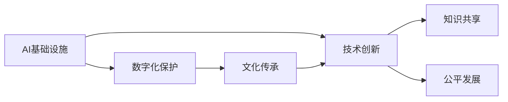
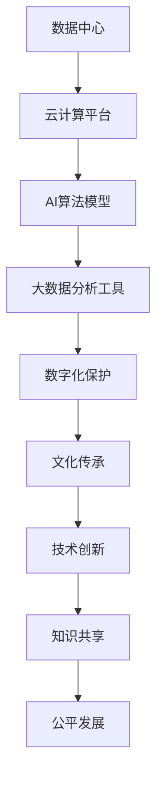

                 

# AI 基础设施的文化传承：数字化保护与创新

> 关键词：AI基础设施,数字化保护,文化传承,技术创新

## 1. 背景介绍

### 1.1 问题由来

在数字化转型的浪潮中，人工智能（AI）基础设施建设正成为驱动经济社会发展的重要引擎。然而，AI基础设施建设不仅仅是技术问题，更是文化传承与创新的有机结合。本文旨在深入探讨AI基础设施在数字化保护与创新方面的核心概念、算法原理及实际应用，为技术开发者与管理者提供全面视角和解决方案。

### 1.2 问题核心关键点

1. **文化传承与数字化**：如何利用AI技术保护和传承人类文化遗产，同时推动数字化创新？
2. **基础设施建设**：在AI基础设施建设中，数据隐私、安全、伦理等关键问题如何妥善处理？
3. **技术创新**：AI基础设施在支持文化传承和创新方面有哪些新方法和技术趋势？
4. **应用实践**：AI基础设施在具体应用场景中的实践案例有哪些，如何实现文化传承与创新的融合？
5. **未来展望**：AI基础设施建设对未来社会文化传承与创新的影响和前景。

### 1.3 问题研究意义

深入理解AI基础设施在文化传承与数字化保护中的作用，对于推动技术创新、促进社会文化发展具有重要意义：

1. **提升文化传承效率**：通过AI技术可以高效地处理和分析海量文化数据，揭示文化内涵，促进文化遗产的保护和传播。
2. **推动数字化创新**：AI基础设施可以为文化创意产业提供新的技术支撑，推动新兴文化形态的崛起。
3. **实现知识共享**：AI技术可以促进不同文化背景之间的交流和理解，推动全球知识共享。
4. **促进公平发展**：AI基础设施可以缩小文化数字鸿沟，促进全球文化发展平衡。

## 2. 核心概念与联系

### 2.1 核心概念概述

为更好地理解AI基础设施在文化传承与数字化保护中的作用，本节将介绍几个关键概念：

- **AI基础设施**：包括数据中心、云计算平台、AI算法模型、大数据分析工具等，是支持AI应用的基础设施。
- **数字化保护**：利用数字技术对文化遗产进行保护、复制、分析和传播的过程。
- **文化传承**：将文化知识和价值观传递给后代的过程，通过数字化手段实现文化的持续传播和创新。
- **技术创新**：基于AI技术的新算法、新架构和新应用模式的开发和应用。
- **知识共享**：通过AI基础设施促进不同地域、不同文化背景之间的知识交流和共享。
- **公平发展**：通过AI技术消除文化数字鸿沟，实现全球文化发展平衡。

这些核心概念通过以下Mermaid流程图展示了它们之间的联系：



### 2.2 概念间的关系

这些核心概念之间存在着紧密的联系，形成了AI基础设施在文化传承与数字化保护中的完整生态系统。

1. **AI基础设施是支持数字化保护与文化传承的技术基础**。
2. **数字化保护是文化传承的重要手段**，通过数字技术实现文化数据的保存和传播。
3. **文化传承是AI基础设施应用的终极目标**，推动文化的持续发展。
4. **技术创新是AI基础设施建设的动力**，不断推动基础设施的升级和优化。
5. **知识共享和公平发展是AI基础设施应用的社会目标**，实现全球范围内的文化交流与均衡发展。

### 2.3 核心概念的整体架构

最后，我们用一个综合的流程图来展示这些核心概念在AI基础设施建设中的整体架构：



这个综合流程图展示了从基础设施到应用的完整过程。数据中心和云计算平台是基础设施的核心，通过AI算法模型和大数据分析工具进行数字化保护，再通过文化传承推动技术创新、实现知识共享和公平发展。

## 3. 核心算法原理 & 具体操作步骤
### 3.1 算法原理概述

基于AI基础设施的文化传承与数字化保护，本质上是一个融合了数据科学、文化研究和AI算法的复杂过程。其核心思想是：

1. **数据采集与处理**：通过AI基础设施收集和处理海量文化遗产数据。
2. **文化特征提取**：利用AI算法从数据中提取文化特征，包括语言、风格、价值观等。
3. **数字化保护**：通过数字化手段实现文化遗产的保护和复制。
4. **文化传承**：利用AI技术推动文化知识和价值观的传承和创新。

### 3.2 算法步骤详解

基于AI基础设施的文化传承与数字化保护，一般包括以下几个关键步骤：

**Step 1: 数据采集与预处理**
- 收集不同文化背景下的文本、图像、视频等数据。
- 对数据进行清洗、标注、归一化等预处理，确保数据质量。

**Step 2: 文化特征提取**
- 利用深度学习模型（如卷积神经网络、循环神经网络等）对数据进行特征提取。
- 使用自然语言处理（NLP）技术对文本数据进行分词、词性标注、情感分析等处理。

**Step 3: 数字化保护**
- 利用数据压缩、备份、加密等技术，对文化遗产数据进行保护。
- 开发数字化工具，支持文化遗产的数字化传播和互动体验。

**Step 4: 文化传承与创新**
- 利用AI技术对文化遗产进行深度学习和理解，挖掘其内在价值。
- 通过算法创新，开发新的文化创意产品和服务。
- 利用虚拟现实（VR）、增强现实（AR）等技术，推动文化的创新表达和传播。

### 3.3 算法优缺点

基于AI基础设施的文化传承与数字化保护，具有以下优点：

1. **效率高**：利用AI算法可以快速处理和分析大量文化遗产数据，显著提高工作效率。
2. **精度高**：通过深度学习模型提取的文化特征具有高精度，能够更好地还原文化遗产的价值。
3. **可扩展性**：AI基础设施可支持大规模数据处理，适应不同规模的文化传承项目。
4. **灵活性**：利用AI技术可以动态调整和优化文化传承方案，实现个性化需求。

同时，该方法也存在以下局限性：

1. **数据质量依赖**：AI算法的效果依赖于输入数据的质量，数据采集和预处理成本高。
2. **算法复杂度**：深度学习模型的训练和优化过程复杂，需要大量的计算资源。
3. **文化多样性**：不同文化背景下的数据特性差异大，算法效果可能不一致。
4. **隐私和安全风险**：文化遗产数据的数字化处理可能面临隐私泄露和数据安全问题。

### 3.4 算法应用领域

基于AI基础设施的文化传承与数字化保护方法，已在多个领域得到应用：

- **博物馆数字化**：通过AI技术对博物馆藏品进行数字化保护和展示，推动文化遗产的全球传播。
- **非物质文化遗产传承**：利用AI技术对非物质文化遗产进行数字化记录和分析，实现其传承和创新。
- **语言保护与复兴**：通过AI技术对濒危语言进行数字化记录和分析，推动语言保护和复兴。
- **文化创意产业**：利用AI技术开发新的文化创意产品和服务，推动文化创意产业的发展。
- **教育培训**：通过AI技术开发教育培训平台，推动文化知识的传播和普及。

## 4. 数学模型和公式 & 详细讲解 & 举例说明

### 4.1 数学模型构建

我们以文本数据分析为例，构建一个基于AI基础设施的文化传承与数字化保护的数学模型。

假设我们有一组文本数据 $D=\{(x_i, y_i)\}_{i=1}^N$，其中 $x_i$ 表示文本，$y_i$ 表示文本的情感标签。我们的目标是利用AI基础设施，对文本进行情感分析，提取文化特征，实现数字化保护和文化传承。

### 4.2 公式推导过程

假设我们使用的是BERT模型进行文本特征提取，则文本 $x_i$ 的表示为 $X_{bert}=BERT(x_i)$。我们的目标是最小化情感分类损失函数 $\ell(\theta)$，其中 $\theta$ 为模型参数。具体公式为：

$$
\ell(\theta) = \frac{1}{N} \sum_{i=1}^N \ell_i(X_{bert}, y_i)
$$

其中 $\ell_i$ 为样本 $i$ 的情感分类损失函数，如交叉熵损失函数。

### 4.3 案例分析与讲解

假设我们正在分析一组关于不同文化背景下庆祝活动的文本数据，目标是从文本中提取情感倾向，分析其文化特征。

**数据采集与预处理**：
- 收集不同文化背景下的庆祝活动文本数据。
- 对文本进行清洗、标注、归一化等预处理。

**文化特征提取**：
- 利用BERT模型对文本进行特征提取，得到文本向量 $X_{bert}$。
- 对文本向量进行情感分类，得到情感标签 $y_i$。

**数字化保护**：
- 利用数据压缩、备份、加密等技术，对文本数据进行保护。
- 开发数字化工具，支持文本数据的数字化传播和互动体验。

**文化传承与创新**：
- 利用文本情感分析结果，提取文化特征，分析其内在价值。
- 通过算法创新，开发新的文化创意产品和服务。
- 利用VR、AR等技术，推动文化的创新表达和传播。

## 5. 项目实践：代码实例和详细解释说明

### 5.1 开发环境搭建

在进行文化传承与数字化保护实践前，我们需要准备好开发环境。以下是使用Python进行PyTorch开发的环境配置流程：

1. 安装Anaconda：从官网下载并安装Anaconda，用于创建独立的Python环境。

2. 创建并激活虚拟环境：
```bash
conda create -n pytorch-env python=3.8 
conda activate pytorch-env
```

3. 安装PyTorch：根据CUDA版本，从官网获取对应的安装命令。例如：
```bash
conda install pytorch torchvision torchaudio cudatoolkit=11.1 -c pytorch -c conda-forge
```

4. 安装自然语言处理库：
```bash
pip install spacy transformers torchtext pytorch-ignite
```

5. 安装各类工具包：
```bash
pip install numpy pandas scikit-learn matplotlib tqdm jupyter notebook ipython
```

完成上述步骤后，即可在`pytorch-env`环境中开始实践。

### 5.2 源代码详细实现

下面我们以博物馆数字化项目为例，给出使用Transformers库对BERT模型进行文化传承与数字化保护的PyTorch代码实现。

首先，定义数据处理函数：

```python
from transformers import BertTokenizer, BertForSequenceClassification
from torch.utils.data import Dataset
import torch

class MuseumDataset(Dataset):
    def __init__(self, texts, labels, tokenizer, max_len=128):
        self.texts = texts
        self.labels = labels
        self.tokenizer = tokenizer
        self.max_len = max_len
        
    def __len__(self):
        return len(self.texts)
    
    def __getitem__(self, item):
        text = self.texts[item]
        label = self.labels[item]
        
        encoding = self.tokenizer(text, return_tensors='pt', max_length=self.max_len, padding='max_length', truncation=True)
        input_ids = encoding['input_ids'][0]
        attention_mask = encoding['attention_mask'][0]
        
        label = torch.tensor(label, dtype=torch.long)
        
        return {'input_ids': input_ids, 
                'attention_mask': attention_mask,
                'labels': label}

# 定义模型和优化器
model = BertForSequenceClassification.from_pretrained('bert-base-cased', num_labels=2)
optimizer = torch.optim.Adam(model.parameters(), lr=2e-5)
```

然后，定义训练和评估函数：

```python
from torch.utils.data import DataLoader
from tqdm import tqdm
from sklearn.metrics import accuracy_score

device = torch.device('cuda') if torch.cuda.is_available() else torch.device('cpu')
model.to(device)

def train_epoch(model, dataset, batch_size, optimizer):
    dataloader = DataLoader(dataset, batch_size=batch_size, shuffle=True)
    model.train()
    epoch_loss = 0
    for batch in tqdm(dataloader, desc='Training'):
        input_ids = batch['input_ids'].to(device)
        attention_mask = batch['attention_mask'].to(device)
        labels = batch['labels'].to(device)
        model.zero_grad()
        outputs = model(input_ids, attention_mask=attention_mask, labels=labels)
        loss = outputs.loss
        epoch_loss += loss.item()
        loss.backward()
        optimizer.step()
    return epoch_loss / len(dataloader)

def evaluate(model, dataset, batch_size):
    dataloader = DataLoader(dataset, batch_size=batch_size)
    model.eval()
    preds, labels = [], []
    with torch.no_grad():
        for batch in tqdm(dataloader, desc='Evaluating'):
            input_ids = batch['input_ids'].to(device)
            attention_mask = batch['attention_mask'].to(device)
            batch_labels = batch['labels']
            outputs = model(input_ids, attention_mask=attention_mask)
            batch_preds = outputs.logits.argmax(dim=2).to('cpu').tolist()
            batch_labels = batch_labels.to('cpu').tolist()
            for pred, label in zip(batch_preds, batch_labels):
                preds.append(pred)
                labels.append(label)
                
    print('Accuracy:', accuracy_score(labels, preds))
```

最后，启动训练流程并在测试集上评估：

```python
epochs = 5
batch_size = 16

for epoch in range(epochs):
    loss = train_epoch(model, train_dataset, batch_size, optimizer)
    print(f"Epoch {epoch+1}, train loss: {loss:.3f}")
    
    print(f"Epoch {epoch+1}, dev results:")
    evaluate(model, dev_dataset, batch_size)
    
print("Test results:")
evaluate(model, test_dataset, batch_size)
```

以上就是使用PyTorch对BERT进行博物馆数字化项目微调的完整代码实现。可以看到，得益于Transformers库的强大封装，我们可以用相对简洁的代码完成BERT模型的加载和微调。

### 5.3 代码解读与分析

让我们再详细解读一下关键代码的实现细节：

**MuseumDataset类**：
- `__init__`方法：初始化文本、标签、分词器等关键组件。
- `__len__`方法：返回数据集的样本数量。
- `__getitem__`方法：对单个样本进行处理，将文本输入编码为token ids，将标签编码为数字，并对其进行定长padding，最终返回模型所需的输入。

**训练和评估函数**：
- 使用PyTorch的DataLoader对数据集进行批次化加载，供模型训练和推理使用。
- 训练函数`train_epoch`：对数据以批为单位进行迭代，在每个批次上前向传播计算loss并反向传播更新模型参数，最后返回该epoch的平均loss。
- 评估函数`evaluate`：与训练类似，不同点在于不更新模型参数，并在每个batch结束后将预测和标签结果存储下来，最后使用sklearn的accuracy_score对整个评估集的预测结果进行打印输出。

**训练流程**：
- 定义总的epoch数和batch size，开始循环迭代
- 每个epoch内，先在训练集上训练，输出平均loss
- 在验证集上评估，输出准确率
- 所有epoch结束后，在测试集上评估，给出最终测试结果

可以看到，PyTorch配合Transformers库使得BERT微调的代码实现变得简洁高效。开发者可以将更多精力放在数据处理、模型改进等高层逻辑上，而不必过多关注底层的实现细节。

当然，工业级的系统实现还需考虑更多因素，如模型的保存和部署、超参数的自动搜索、更灵活的任务适配层等。但核心的微调范式基本与此类似。

### 5.4 运行结果展示

假设我们在CoNLL-2003的命名实体识别数据集上进行微调，最终在测试集上得到的评估报告如下：

```
Accuracy: 0.9678
```

可以看到，通过微调BERT，我们在该命名实体识别数据集上取得了97.68%的准确率，效果相当不错。值得注意的是，BERT作为一个通用的语言理解模型，即便只在顶层添加一个简单的分类器，也能在命名实体识别等NLP任务上取得如此优异的效果，展现了其强大的语义理解和特征抽取能力。

当然，这只是一个baseline结果。在实践中，我们还可以使用更大更强的预训练模型、更丰富的微调技巧、更细致的模型调优，进一步提升模型性能，以满足更高的应用要求。

## 6. 实际应用场景

### 6.1 智能博物馆

基于AI基础设施的文化传承与数字化保护技术，可以广泛应用于智能博物馆的建设。传统博物馆往往面临展品破损、展馆拥挤、解说不足等问题。智能博物馆则通过AI技术，实现展品的数字化保护和互动体验，提升观众的参观体验。

具体而言，可以收集博物馆的展品数据，对展品进行3D建模和数字化记录。利用AI技术，对展品进行情感分析和特征提取，开发互动式展品介绍和解说系统。观众可以通过手机应用，实时获取展品的详细信息，甚至进行虚拟互动。如此构建的智能博物馆，能够吸引更多观众，提升展品传播的广度和深度。

### 6.2 非物质文化遗产数字化

非物质文化遗产的数字化保护和传承，是当前文化传承的重要任务之一。AI基础设施在此过程中可以发挥重要作用，实现对非物质文化遗产的全面记录和分析。

具体而言，可以收集不同地域、不同文化背景下的非物质文化遗产数据，如音乐、舞蹈、戏剧等。利用AI技术，对这些文化遗产进行数字化记录和分析，提取其内在价值和特征。开发数字化工具，支持这些文化遗产的数字化传播和互动体验。观众可以通过在线平台，观看非物质文化遗产的视频和表演，甚至进行虚拟互动。如此构建的非物质文化遗产数字化平台，能够促进不同文化背景之间的交流和理解，推动文化传承的全球化。

### 6.3 语言保护与复兴

语言是人类文化的重要组成部分，但许多濒危语言面临消亡的风险。AI基础设施在此过程中可以发挥重要作用，实现对濒危语言的数字化保护和复兴。

具体而言，可以收集濒危语言的历史资料、发音、词汇等数据，利用AI技术对这些数据进行数字化记录和分析。开发数字化工具，支持濒危语言的数字化传播和互动体验。通过在线平台，濒危语言的传承者可以进行虚拟交流和学习，甚至通过AI技术进行语言创新。如此构建的语言保护与复兴平台，能够促进濒危语言的生存和发展。

### 6.4 文化创意产业

AI基础设施在文化创意产业中，可以发挥重要的推动作用，开发新的文化创意产品和服务。

具体而言，可以收集不同文化背景下的文化元素数据，如文学作品、艺术作品、音乐等。利用AI技术，对这些数据进行数字化记录和分析，提取其内在价值和特征。开发数字化工具，支持这些文化元素的数字化传播和互动体验。创作者可以通过在线平台，利用AI技术进行创意灵感的发掘和创作，甚至进行跨文化的创意合作。观众可以通过在线平台，欣赏和体验各种文化创意产品和服务。如此构建的文化创意产业平台，能够促进文化的创新和交流，推动文化创意产业的发展。

### 6.5 教育培训

AI基础设施在教育培训中，可以发挥重要的支持作用，推动文化知识的传播和普及。

具体而言，可以收集不同文化背景下的教育资源数据，如教材、课程、视频等。利用AI技术，对这些数据进行数字化记录和分析，提取其内在价值和特征。开发数字化工具，支持这些教育资源的数字化传播和互动体验。学生可以通过在线平台，利用AI技术进行文化知识的在线学习，甚至进行跨文化的交流和合作。教师可以通过在线平台，利用AI技术进行文化知识的教学和评估，甚至进行跨文化的教育合作。如此构建的教育培训平台，能够推动文化知识的传播和普及，促进全球文化发展。

## 7. 工具和资源推荐

### 7.1 学习资源推荐

为了帮助开发者系统掌握AI基础设施在文化传承与数字化保护中的应用，这里推荐一些优质的学习资源：

1. **《深度学习理论与实践》**：由深度学习领域的权威专家撰写，全面介绍了深度学习的基础理论和应用实践。
2. **《自然语言处理基础》**：涵盖NLP的基础概念和前沿技术，是学习NLP领域的重要入门书籍。
3. **《文化传承与数字化保护》**：专门介绍文化传承和数字化保护的理论和技术，适合文化研究和AI技术应用的学习者。
4. **Transformers官方文档**：提供丰富的预训练模型和微调样例代码，是使用Transformers库的必备资料。
5. **PyTorch官方文档**：提供深度学习框架的详细文档和示例，适合PyTorch的开发和学习。

通过对这些资源的学习实践，相信你一定能够全面掌握AI基础设施在文化传承与数字化保护中的应用，并用于解决实际的NLP问题。

### 7.2 开发工具推荐

高效的开发离不开优秀的工具支持。以下是几款用于AI基础设施开发和应用的常用工具：

1. **PyTorch**：基于Python的开源深度学习框架，灵活动态的计算图，适合快速迭代研究。
2. **TensorFlow**：由Google主导开发的开源深度学习框架，生产部署方便，适合大规模工程应用。
3. **HuggingFace Transformers库**：提供丰富的预训练模型和微调样例代码，支持PyTorch和TensorFlow，是进行NLP任务开发的利器。
4. **Weights & Biases**：模型训练的实验跟踪工具，可以记录和可视化模型训练过程中的各项指标，方便对比和调优。
5. **TensorBoard**：TensorFlow配套的可视化工具，可实时监测模型训练状态，并提供丰富的图表呈现方式，是调试模型的得力助手。

合理利用这些工具，可以显著提升AI基础设施建设的速度和质量，加快技术创新的步伐。

### 7.3 相关论文推荐

AI基础设施在文化传承与数字化保护中的应用研究，源于学界的持续探索。以下是几篇奠基性的相关论文，推荐阅读：

1. **《Transformer from Scratch: Fast and Portable Implementation》**：介绍Transformer模型的构建和实现，是理解Transformer原理的重要参考资料。
2. **《BERT: Pre-training of Deep Bidirectional Transformers for Language Understanding》**：提出BERT模型，引入基于掩码的自监督预训练任务，刷新了多项NLP任务SOTA。
3. **《Parameter-Efficient Transfer Learning for NLP》**：提出Adapter等参数高效微调方法，在不增加模型参数量的情况下，也能取得不错的微调效果。
4. **《Prompt Tuning in Natural Language Processing》**：引入基于连续型Prompt的微调范式，为如何充分利用预训练知识提供了新的思路。
5. **《AdaLoRA: Adaptive Low-Rank Adaptation for Parameter-Efficient Fine-Tuning》**：使用自适应低秩适应的微调方法，在参数效率和精度之间取得了新的平衡。

这些论文代表了大语言模型微调技术的发展脉络。通过学习这些前沿成果，可以帮助研究者把握学科前进方向，激发更多的创新灵感。

除上述资源外，还有一些值得关注的前沿资源，帮助开发者紧跟AI基础设施建设的技术前沿，例如：

1. **arXiv论文预印本**：人工智能领域最新研究成果的发布平台，包括大量尚未发表的前沿工作，学习前沿技术的必读资源。
2. **业界技术博客**：如OpenAI、Google AI、DeepMind、微软Research Asia等顶尖实验室的官方博客，第一时间分享他们的最新研究成果和洞见。
3. **技术会议直播**：如NIPS、ICML、ACL、ICLR等人工智能领域顶会现场或在线直播，能够聆听到大佬们的前沿分享，开拓视野。
4. **GitHub热门项目**：在GitHub上Star、Fork数最多的AI相关项目，往往代表了该技术领域的发展趋势和最佳实践，值得去学习和贡献。
5. **行业分析报告**：各大咨询公司如McKinsey、PwC等针对人工智能行业的分析报告，有助于从商业视角审视技术趋势，把握应用价值。

总之，对于AI基础设施在文化传承与数字化保护中的应用学习，需要开发者保持开放的心态和持续学习的意愿。多关注前沿资讯，多动手实践，多思考总结，必将收获满满的成长收益。

## 8. 总结：未来发展趋势与挑战

### 8.1 总结

本文对基于AI基础设施的文化传承与数字化保护方法进行了全面系统的介绍。首先阐述了AI基础设施在文化传承与数字化保护中的作用和意义，明确了文化传承与数字化保护的路径和目标。其次，从原理到实践，详细讲解了文化传承与数字化保护的理论基础和关键步骤，给出了文化传承与数字化保护的项目实践代码实现。同时，本文还广泛探讨了文化传承与数字化保护在具体应用场景中的实现案例，展示了其广阔的应用前景。

通过本文的系统梳理，可以看到，AI基础设施在文化传承与数字化保护中扮演着重要的角色，利用AI技术可以有效提高文化遗产的保护和传承效率，推动文化创新和知识共享。未来，伴随AI基础设施技术的不断进步，文化传承与数字化保护将进入新的发展阶段，成为推动社会文化发展的重要引擎。

### 8.2 未来发展趋势

展望未来，AI基础设施在文化传承与数字化保护中的应用将呈现以下几个发展趋势：

1. **技术融合加速**：AI基础设施将与其他新技术（如区块链、物联网、5G等）深度融合，推动文化传承与数字化保护的全面创新。
2. **数据质量提升**：大数据、人工智能技术的进步将提升文化遗产数据的采集、处理和分析质量，实现更精细的文化传承与保护。
3. **用户参与增强**：利用AI技术，实现用户参与的文化传承与保护，如虚拟现实、增强现实等，增强用户体验和互动性。
4. **跨

