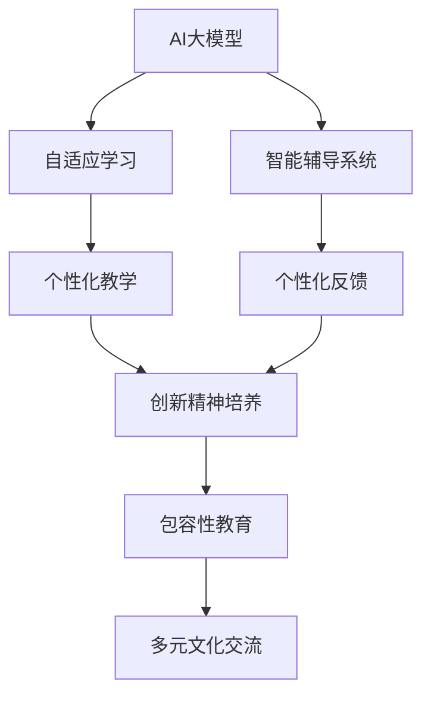
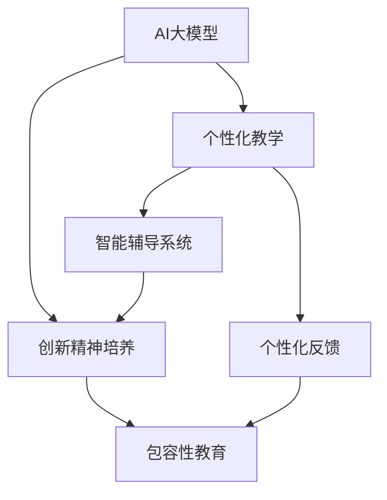

                 

# AI 大模型时代：教育怎样实现对创新精神的培养和包容

## 1. 背景介绍

随着人工智能(AI)大模型时代的到来，教育领域迎来了翻天覆地的变化。AI技术正以不可阻挡之势，深刻影响着教育的各个环节，从教学内容到教育方式，从学生评估到个性化教学，无不呈现出智能化、高效化和个性化的新趋势。在这样的大背景下，如何利用AI技术，实现对创新精神的培养和包容，成为了教育领域亟需思考和解决的问题。

### 1.1 问题由来

当前，教育领域的数字化转型已经是大势所趋。AI大模型的应用，如智能辅导系统、自适应学习系统、语音识别与合成技术等，已经展现出其在个性化教育、自主学习、高效教学等方面的巨大潜力。然而，在享受AI带来的便利与高效的同时，我们也应该深思如何借助AI技术，促进学生创新精神的培养和包容性的提升。

### 1.2 问题核心关键点

要实现对创新精神的培养和包容，教育体系需要从以下几个关键点入手：
- **数据驱动的教学设计**：利用AI收集和分析大量教学数据，发现学习规律和学生需求，提供个性化、针对性的教学内容和方法。
- **人机协作的教育模式**：AI作为辅助工具，帮助教师分担繁重教学任务，同时通过智能辅导系统，引导学生主动探索、解决问题。
- **创造性思维的培养**：通过AI技术，创设更多开放性、探索性的学习环境，鼓励学生发散思维、批判性思考。
- **多元文化的包容**：AI技术能够跨越语言障碍，促进不同文化背景学生的交流与合作，培养全球视野和多元包容性。

### 1.3 问题研究意义

在AI大模型时代，教育领域的研究和实践变得更加复杂和多样化。实现对创新精神的培养和包容，不仅能提升教育质量，推动学科创新，还能培养具有全球竞争力的人才，适应未来社会的发展需求。这一目标的实现，对教育体系的优化、教学方法的革新、学习环境的重构，都有着重要的指导意义。

## 2. 核心概念与联系

### 2.1 核心概念概述

为了更好地理解AI大模型在教育中的应用，本节将介绍几个核心概念：

- **AI大模型**：以深度学习技术为基础，能够处理复杂任务、具备自我学习能力的大型模型，如GPT、BERT等。
- **自适应学习**：利用AI技术，根据学生的学习进度和理解程度，动态调整教学内容和方法，实现个性化教学。
- **智能辅导系统**：使用AI技术，为学生提供个性化的学习建议和即时反馈，帮助学生自主学习和解决疑难问题。
- **创新精神**：包括好奇心、创造力、批判性思维、问题解决能力等多方面，是培养未来社会领袖和创新人才的关键。
- **包容性教育**：关注不同背景、性别、语言、能力的学生，提供公平、公正、多元的学习机会。

这些概念之间的联系，可以通过以下Mermaid流程图来展示：



这个流程图展示了AI大模型在教育领域的应用链条：首先，AI大模型通过自适应学习提供个性化教学，智能辅导系统则通过即时反馈支持个性化学习，这些技术共同作用，培养学生的创新精神和包容性。同时，包容性教育与多元文化交流相辅相成，进一步促进了学生的多样性和全球视野。

### 2.2 概念间的关系

这些核心概念之间的关系，可以通过以下Mermaid流程图来展示：



这个流程图展示了AI大模型如何通过个性化教学、智能辅导系统和个性化反馈，支持创新精神的培养，并最终促进包容性教育的实现。

## 3. 核心算法原理 & 具体操作步骤

### 3.1 算法原理概述

AI大模型在教育中的应用，主要基于以下算法原理：

1. **自适应学习算法**：通过收集学生的学习数据，分析其知识掌握情况和学习风格，动态调整教学内容和策略，提供个性化的学习路径和资源。
2. **强化学习算法**：利用学生的学习反馈和成绩数据，不断优化智能辅导系统的行为策略，提高辅导系统的适应性和有效性。
3. **自然语言处理算法**：通过文本分析、情感识别等技术，理解学生的学习需求和心理状态，提供针对性的学习建议和激励。
4. **多模态学习算法**：整合文本、图像、语音等多种数据，丰富学习体验，提升学习效果。

### 3.2 算法步骤详解

以下是AI大模型在教育领域应用的核心算法步骤：

1. **数据收集与分析**：通过学生的学习行为数据、成绩数据、互动数据等，收集和分析学生的学习情况和需求。
2. **个性化推荐**：根据学生的学习数据，利用AI模型推荐适合的学习资源和教学内容。
3. **智能辅导与反馈**：利用AI模型实时分析学生的学习过程，提供个性化的学习建议和即时反馈。
4. **评估与调整**：根据学生的学习表现和反馈，不断优化教学策略和智能辅导系统的行为策略。
5. **创新精神培养**：通过开放性、探索性的学习任务和环境，激发学生的创造力和批判性思维。
6. **包容性教育**：通过跨文化交流平台和多元文化课程，促进不同背景学生之间的理解和合作。

### 3.3 算法优缺点

AI大模型在教育中的应用具有以下优点：

1. **个性化教学**：能够根据学生的个性化需求，提供定制化的学习资源和教学策略。
2. **高效反馈与辅导**：通过即时反馈，帮助学生及时发现和解决问题，提升学习效率。
3. **数据驱动决策**：利用大数据分析，优化教学决策，提高教学效果。
4. **跨文化交流**：打破语言和地域障碍，促进不同文化背景学生的交流与合作。

然而，AI大模型在教育中的应用也存在一些缺点：

1. **数据隐私与安全**：教育数据涉及学生的隐私信息，需采取严格的数据保护措施。
2. **技术依赖性**：过度依赖AI技术，可能削弱教师的主导地位，减少师生互动。
3. **算法偏见**：AI模型可能会因为训练数据中的偏见，导致输出结果的不公正。
4. **依赖高质量数据**：AI模型的效果依赖于数据的质量和数量，数据不足可能影响模型表现。

### 3.4 算法应用领域

AI大模型在教育领域的应用范围非常广泛，涵盖从学前教育到高等教育，从普通教育到特殊教育，从学科知识教育到素质能力教育等各个方面。以下是几个典型的应用领域：

1. **智能辅导系统**：利用AI模型，为学生提供个性化的学习建议和即时反馈，帮助学生自主学习和解决疑难问题。
2. **自适应学习平台**：根据学生的学习数据，动态调整教学内容和策略，提供个性化的学习路径和资源。
3. **跨文化交流平台**：打破语言和地域障碍，促进不同文化背景学生的交流与合作。
4. **创新教育工具**：利用AI技术，创设更多开放性、探索性的学习环境，激发学生的创造力和批判性思维。
5. **教育数据分析**：通过大数据分析，优化教学策略和资源配置，提高教育质量。

## 4. 数学模型和公式 & 详细讲解 & 举例说明

### 4.1 数学模型构建

在教育领域，AI大模型通常用于以下数学模型的构建：

1. **学生学习模型**：用于预测学生的学习效果和行为，包括知识掌握、学习进度、学习风格等。
2. **教师教学模型**：用于优化教师的教学策略和方法，包括教学内容、教学方法、教学评估等。
3. **智能辅导模型**：用于生成个性化的学习建议和即时反馈，包括学习资源推荐、学习路径规划、问题解答等。

### 4.2 公式推导过程

以学生学习模型为例，其数学模型可以表示为：

$$
L(y|\theta) = \frac{1}{N}\sum_{i=1}^N \log p(y_i|x_i,\theta)
$$

其中，$L$ 为损失函数，$y_i$ 为学生的学习表现，$x_i$ 为学生的学习数据，$\theta$ 为模型的参数。

具体公式推导过程如下：

1. **数据预处理**：将学生的学习数据 $x_i$ 转换为模型可用的输入格式。
2. **模型训练**：使用学生的学习数据 $x_i$，通过反向传播算法更新模型参数 $\theta$。
3. **损失计算**：根据学生的学习表现 $y_i$ 和模型的预测 $p(y_i|x_i,\theta)$，计算损失函数 $L(y|\theta)$。
4. **模型评估**：使用验证集和测试集对模型进行评估，优化模型性能。

### 4.3 案例分析与讲解

假设我们有一组学生的学习数据，包括作业成绩、考试分数、互动情况等。我们可以构建一个学生学习模型，预测学生的未来学习效果和行为。具体步骤如下：

1. **数据预处理**：将学生的作业成绩、考试分数、互动情况等数据进行标准化处理，生成输入矩阵 $X$。
2. **模型训练**：使用神经网络模型（如RNN、CNN、Transformer等）训练学生学习模型，得到模型参数 $\theta$。
3. **损失计算**：根据学生的真实学习表现 $y$ 和模型的预测 $p(y|\theta)$，计算损失函数 $L(y|\theta)$。
4. **模型评估**：使用验证集和测试集对模型进行评估，调整模型参数 $\theta$，优化模型性能。

## 5. 项目实践：代码实例和详细解释说明

### 5.1 开发环境搭建

在进行教育领域的AI大模型应用开发时，我们需要准备好以下开发环境：

1. **Python环境**：确保Python 3.x版本，安装必要的依赖包，如TensorFlow、PyTorch、NumPy等。
2. **数据收集与处理工具**：安装Pandas、Scikit-learn等数据处理工具，用于数据的预处理和分析。
3. **AI模型库**：安装TensorFlow、PyTorch等深度学习库，用于模型训练和推理。
4. **可视化工具**：安装Matplotlib、Seaborn等可视化工具，用于模型的可视化分析和结果展示。

### 5.2 源代码详细实现

以下是使用TensorFlow构建学生学习模型的代码实现：

```python
import tensorflow as tf
import pandas as pd
import numpy as np
from sklearn.model_selection import train_test_split

# 加载学生学习数据
data = pd.read_csv('student_data.csv')

# 数据预处理
features = ['作业成绩', '考试分数', '互动情况']
X = data[features].values
y = data['学习效果'].values

# 数据划分
X_train, X_test, y_train, y_test = train_test_split(X, y, test_size=0.2, random_state=42)

# 构建学生学习模型
model = tf.keras.Sequential([
    tf.keras.layers.Dense(64, activation='relu', input_shape=(X_train.shape[1],)),
    tf.keras.layers.Dense(32, activation='relu'),
    tf.keras.layers.Dense(1, activation='sigmoid')
])

# 模型编译
model.compile(optimizer='adam', loss='binary_crossentropy', metrics=['accuracy'])

# 模型训练
model.fit(X_train, y_train, epochs=10, batch_size=32, validation_data=(X_test, y_test))

# 模型评估
loss, accuracy = model.evaluate(X_test, y_test)
print(f'Test loss: {loss:.4f}, Test accuracy: {accuracy:.4f}')
```

### 5.3 代码解读与分析

在这个代码示例中，我们使用TensorFlow构建了一个简单的学生学习模型，用于预测学生的学习效果。具体步骤如下：

1. **数据预处理**：加载学生学习数据，将其转换为模型可用的输入格式。
2. **模型构建**：定义一个包含两个隐藏层的神经网络模型，用于预测学生的学习效果。
3. **模型编译**：使用Adam优化器和二元交叉熵损失函数，编译模型。
4. **模型训练**：使用训练集数据，对模型进行10个epoch的训练，并在验证集上评估模型性能。
5. **模型评估**：在测试集上评估模型的损失和准确率，输出结果。

## 6. 实际应用场景

### 6.1 智能辅导系统

智能辅导系统是AI大模型在教育领域应用的重要方向之一。通过智能辅导系统，学生可以随时随地获取个性化的学习建议和即时反馈，自主学习和解决问题。例如，智能辅导系统可以根据学生的学习进度和理解程度，推荐适合的学习资源和解题策略，帮助学生掌握复杂的数学问题和逻辑思维能力。

### 6.2 自适应学习平台

自适应学习平台利用AI技术，根据学生的学习数据，动态调整教学内容和策略，提供个性化的学习路径和资源。例如，自适应学习平台可以根据学生的学习进度和理解程度，动态调整教学内容和策略，提供个性化的学习路径和资源，帮助学生掌握复杂的数学问题和逻辑思维能力。

### 6.3 跨文化交流平台

跨文化交流平台打破了语言和地域障碍，促进不同文化背景学生的交流与合作。例如，跨文化交流平台可以提供多语言支持，帮助学生跨越语言障碍，进行跨文化的交流和学习。同时，平台还可以提供多元文化课程和活动，促进不同文化背景学生的理解与合作。

### 6.4 创新教育工具

创新教育工具利用AI技术，创设更多开放性、探索性的学习环境，激发学生的创造力和批判性思维。例如，创新教育工具可以提供开放性的编程任务、科学实验和艺术创作，激发学生的创造力和批判性思维，培养其解决问题的能力和创新精神。

## 7. 工具和资源推荐

### 7.1 学习资源推荐

为了帮助开发者系统掌握AI大模型在教育中的应用，这里推荐一些优质的学习资源：

1. **Coursera《AI for Everyone》课程**：由Andrew Ng教授主讲，全面介绍了AI技术在教育中的应用，包括智能辅导系统、自适应学习等。
2. **edX《Data Science and Machine Learning》课程**：涵盖了数据科学和机器学习的基础知识和应用，包括数据分析、模型构建和评估等。
3. **Kaggle AI Education Challenge**：一个面向AI教育研究的开源项目，提供丰富的教育数据集和模型，供开发者进行研究和实践。

### 7.2 开发工具推荐

以下是几款用于AI大模型在教育领域应用的常用工具：

1. **TensorFlow**：基于数据流的开源机器学习框架，支持分布式计算和深度学习模型构建。
2. **PyTorch**：基于Python的深度学习框架，易于上手和使用，支持动态计算图。
3. **Jupyter Notebook**：用于编写和运行Python代码，支持代码解释和可视化。
4. **Matplotlib**：用于绘制数据可视化的Python库，支持各种图表和图形的绘制。

### 7.3 相关论文推荐

AI大模型在教育领域的研究方向众多，以下是几篇具有代表性的相关论文，推荐阅读：

1. **《AI in Education: Current Status and Future Trends》**：探讨AI在教育中的应用现状和未来发展趋势。
2. **《Data Mining and Statistical Learning in Education》**：利用数据挖掘和统计学习方法，提升教育数据的质量和分析能力。
3. **《Leveraging AI for Personalized Learning in K-12 Education》**：探讨AI技术在K-12教育中的个性化学习应用。

## 8. 总结：未来发展趋势与挑战

### 8.1 研究成果总结

本文对AI大模型在教育中的应用进行了全面系统的介绍。首先阐述了AI大模型在教育领域的背景、核心概念和关键技术，然后详细讲解了AI大模型在教育中的数学模型构建和公式推导过程，最后通过项目实践展示了AI大模型在教育中的具体应用。通过本文的系统梳理，可以看到AI大模型在教育领域具有广阔的应用前景，能够有效促进创新精神的培养和包容性的提升。

### 8.2 未来发展趋势

展望未来，AI大模型在教育领域的应用将呈现以下几个发展趋势：

1. **AI与人类协作**：未来的教育模式将更加注重AI与人类协作，教师和学生共同参与教学过程，形成人机协作的教育模式。
2. **个性化与通用化**：AI技术将实现个性化的学习资源和教学策略，同时促进跨领域的通用能力培养。
3. **虚拟与现实结合**：虚拟现实(VR)和增强现实(AR)技术将与AI教育工具结合，提供更加沉浸式和互动式的学习体验。
4. **情感与心理分析**：通过情感识别和心理分析技术，更好地理解学生的情感状态和心理需求，提供针对性的支持和指导。
5. **多元文化融合**：AI技术将促进多元文化的交流与合作，培养具有全球视野和多元包容性的未来人才。

### 8.3 面临的挑战

尽管AI大模型在教育领域的应用取得了显著进展，但在迈向更加智能化、普适化应用的过程中，仍面临诸多挑战：

1. **数据隐私与安全**：教育数据涉及学生的隐私信息，需采取严格的数据保护措施。
2. **技术依赖性**：过度依赖AI技术，可能削弱教师的主导地位，减少师生互动。
3. **算法偏见**：AI模型可能会因为训练数据中的偏见，导致输出结果的不公正。
4. **依赖高质量数据**：AI模型的效果依赖于数据的质量和数量，数据不足可能影响模型表现。

### 8.4 研究展望

面对AI大模型在教育领域面临的挑战，未来的研究需要在以下几个方面寻求新的突破：

1. **数据隐私保护**：开发高效的数据保护技术，确保学生数据的安全和隐私。
2. **教师与学生协作**：开发人机协作的教育系统，增强师生互动，提升教学效果。
3. **算法公平性**：开发公平性评估和优化技术，减少算法偏见，确保输出结果的公正性。
4. **多模态学习**：整合文本、图像、语音等多种数据，丰富学习体验，提升学习效果。
5. **情感与心理支持**：开发情感识别和心理分析技术，更好地理解学生的情感状态和心理需求，提供针对性的支持和指导。

这些研究方向将引领AI大模型在教育领域的技术进步，为构建智能、公平、包容的教育体系提供有力支持。

## 9. 附录：常见问题与解答

**Q1：AI大模型在教育中的应用是否需要高质量数据？**

A: 是的，AI大模型在教育中的应用效果依赖于高质量的数据。高质量的数据包括学生的学习行为数据、成绩数据、互动数据等，这些数据的质量和数量直接影响模型的训练效果。因此，数据收集和处理是AI大模型在教育应用中的重要环节。

**Q2：AI大模型在教育中的应用是否会导致教师的主导地位下降？**

A: 不会。AI大模型可以作为教师的辅助工具，帮助教师分担繁重教学任务，同时通过智能辅导系统，引导学生自主学习和解决疑难问题。教师的主导地位不会因AI大模型的应用而下降，反而可以通过AI技术更好地发挥教学效果。

**Q3：AI大模型在教育中的应用是否存在算法偏见？**

A: 是的。AI模型可能会因为训练数据中的偏见，导致输出结果的不公正。因此，开发公平性评估和优化技术，减少算法偏见，确保输出结果的公正性，是AI大模型在教育应用中需要重点关注的问题。

**Q4：AI大模型在教育中的应用是否需要考虑数据隐私与安全？**

A: 是的。教育数据涉及学生的隐私信息，需采取严格的数据保护措施。因此，在AI大模型在教育应用中，需要重视数据隐私和安全问题，采取加密、去标识化等技术手段，确保学生数据的安全和隐私。

**Q5：AI大模型在教育中的应用是否需要考虑学生的情感和心理状态？**

A: 是的。通过情感识别和心理分析技术，更好地理解学生的情感状态和心理需求，提供针对性的支持和指导，是AI大模型在教育应用中的重要方向。因此，在AI大模型在教育应用中，需要重视学生的情感和心理状态，开发相应的分析工具和支持系统。

---

作者：禅与计算机程序设计艺术 / Zen and the Art of Computer Programming

