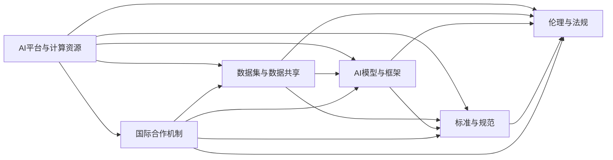

                 

# AI 基础设施的国际合作：共建智能全球村

## 1. 背景介绍

### 1.1 问题由来

人工智能（AI）技术的迅猛发展，为全球经济和社会带来了深刻变革。然而，AI基础设施的建设，尤其是大规模、高质量的数据集和高效的计算平台，往往是全球性的挑战。为应对这些挑战，各国纷纷推出了各自的AI战略，通过国际合作，共建全球AI基础设施，推动AI技术的普惠与共享。

近年来，AI基础设施的国际合作已成为各国科技创新的重要方向。例如，美国通过启动“AI First”计划，联合日本、韩国、德国等国共同打造AI研究与开发中心；中国则推动“人工智能发展战略”，倡导全球AI合作，构建AI生态圈；欧盟通过“欧洲人工智能战略”，促进AI技术的共享与合作。

### 1.2 问题核心关键点

AI基础设施建设的核心在于：
- **数据共享与融合**：高质量的数据是AI模型的基础，通过国际合作，可以共享和融合各国的数据资源，提升模型的泛化能力和鲁棒性。
- **计算资源优化**：全球计算资源的分布不均，通过跨国合作，可以优化计算资源的配置，提高计算效率。
- **技术标准统一**：标准化AI技术框架和算法，促进不同国家间的技术互操作性，提升AI技术的普适性。
- **伦理与安全监管**：协同制定AI伦理和法规标准，确保AI技术的安全、公正、透明应用。
- **人才培养与交流**：培养国际化的AI人才，通过跨国学术与企业合作，促进知识与技术的交流。

这些关键点构成了AI基础设施国际合作的框架，通过多方协同，共同推进全球AI技术的发展。

### 1.3 问题研究意义

AI基础设施的国际合作，不仅有助于提升各国AI技术的竞争力，还能促进全球范围内的科技进步，推动经济社会的可持续发展。其研究意义主要体现在：

1. **推动技术创新**：国际合作可以汇聚不同国家的技术优势，加速AI新技术的研发与应用。
2. **提升产业竞争力**：通过共享资源与技术，降低AI开发成本，提升企业与国家的产业竞争力。
3. **促进社会公平**：通过共享AI技术，改善资源匮乏国家的科技水平，缩小全球技术鸿沟。
4. **加强安全与监管**：共同制定AI伦理与法规标准，提高AI应用的透明度和安全性。
5. **推动全球治理**：通过国际合作，共同应对AI技术带来的全球性挑战，如自动化就业、数据隐私等。

## 2. 核心概念与联系

### 2.1 核心概念概述

AI基础设施建设涉及多个关键概念，主要包括：

- **AI平台与计算资源**：包括云服务、高性能计算集群、边缘计算等，为AI模型训练与推理提供计算支持。
- **数据集与数据共享**：包含大规模标注与无标注数据集，通过数据共享与融合，提升模型性能。
- **AI模型与框架**：如TensorFlow、PyTorch、MXNet等，提供高效的模型训练与推理框架。
- **标准与规范**：涉及数据格式、模型接口、API等，确保AI技术的互操作性和标准化。
- **伦理与法规**：涉及数据隐私、公平性、安全性等方面的规范与法律框架。
- **国际合作机制**：包括多边合作协议、跨国数据共享协议、技术标准统一等，促进各国间的协同合作。

这些概念之间相互关联，共同构成了AI基础设施国际合作的基石。

### 2.2 概念间的关系

通过以下Mermaid流程图，我们可以更直观地理解这些核心概念之间的关系：



这个流程图展示了AI基础设施建设的各个环节和关键点，从资源提供到技术应用，再到伦理与安全监管，最终通过国际合作机制整合各方资源与技术，共同推进全球AI发展。

## 3. 核心算法原理 & 具体操作步骤
### 3.1 算法原理概述

AI基础设施的国际合作，其核心算法原理包括数据共享与融合、计算资源优化、技术标准统一和伦理与安全监管等方面。

### 3.2 算法步骤详解

以下详细讲解AI基础设施国际合作的各个核心算法步骤：

1. **数据共享与融合**
   - **数据收集**：各国通过国际合作机制，共享高质量的数据集，如医疗、教育、交通等领域的数据。
   - **数据清洗与预处理**：对共享数据进行清洗与预处理，确保数据质量与一致性。
   - **数据融合**：采用联邦学习等技术，将不同来源的数据进行融合，提升数据量和多样性。

2. **计算资源优化**
   - **资源配置**：通过跨国合作，优化全球计算资源的配置，确保数据中心和计算集群的高效利用。
   - **计算共享**：利用云计算平台，实现计算资源的跨地域共享与协同计算，提升计算效率。
   - **边缘计算**：推动边缘计算技术的应用，减少数据传输延迟，提高实时处理能力。

3. **技术标准统一**
   - **模型接口标准化**：制定统一的模型接口规范，确保不同国家间的技术互操作性。
   - **数据格式标准化**：制定统一的数据格式标准，确保数据共享与处理的一致性。
   - **API接口标准化**：制定统一的API接口规范，确保跨平台、跨语言的技术互操作性。

4. **伦理与安全监管**
   - **数据隐私保护**：制定数据隐私保护法规，确保跨地域数据共享的安全性。
   - **公平性与透明性**：确保AI模型的公平性与透明性，防止算法偏见与歧视。
   - **安全性保障**：通过跨国合作，制定AI技术的安全标准，防范潜在的安全威胁。

### 3.3 算法优缺点

AI基础设施国际合作的优势在于：
- **资源共享**：通过共享数据和计算资源，降低了各国的AI研发成本，提升了资源利用效率。
- **技术协同**：各国合作推动技术创新，加速AI技术的应用与发展。
- **标准统一**：统一技术标准，提高了AI技术的互操作性与标准化水平。
- **公平公正**：确保AI技术的公平性与透明性，提升全球科技伦理水平。

然而，也存在一些挑战：
- **数据隐私与安全**：跨地域数据共享可能引发数据隐私与安全问题，需要制定严格的数据保护法规。
- **技术互操作性**：不同国家间的技术标准不统一，可能影响AI技术的互操作性。
- **经济差异**：资源富裕国家与资源匮乏国家在AI基础设施建设上存在经济差异，需要通过国际合作机制进行协调。

### 3.4 算法应用领域

AI基础设施国际合作的应用领域非常广泛，包括但不限于：

- **医疗健康**：通过共享医疗数据，提升全球疾病预测与诊断能力。
- **教育培训**：共享教育资源与数据，提升全球教育水平。
- **交通出行**：通过共享交通数据，优化交通管理与规划。
- **环境保护**：共享环境数据，提升全球气候变化应对能力。
- **灾害应对**：共享灾害数据，提升全球灾害预测与应对能力。

## 4. 数学模型和公式 & 详细讲解 & 举例说明

### 4.1 数学模型构建

为简化模型构建过程，我们以医疗健康领域的数据共享为例，构建AI基础设施的数学模型。

**模型定义**：
设 $X$ 为输入数据集，$Y$ 为输出标签集，$F$ 为AI模型，$L$ 为损失函数，$S$ 为共享数据集。

**数据共享与融合**：
将共享数据 $S$ 分为训练集 $S_{train}$ 和测试集 $S_{test}$，进行数据清洗与预处理，得到处理后的训练集 $S_{train}'$ 和测试集 $S_{test}'$。

**模型训练**：
在处理后的训练集 $S_{train}'$ 上，使用损失函数 $L$ 对模型 $F$ 进行训练，得到训练后的模型 $F_{train}$。

**模型评估**：
在测试集 $S_{test}'$ 上，使用损失函数 $L$ 对训练后的模型 $F_{train}$ 进行评估，得到评估结果。

### 4.2 公式推导过程

以下推导AI基础设施的数学模型：

1. **数据共享与融合**：
   - 数据清洗与预处理：
     \[
     \begin{aligned}
     X' &= \text{clean}(X) \\
     Y' &= \text{label}(X')
     \end{aligned}
     \]
   - 数据融合：
     \[
     S' = \text{merge}(S_{train}, S_{test})
     \]

2. **模型训练**：
   - 使用损失函数 $L$ 对模型 $F$ 进行训练：
     \[
     \min_{\theta} \sum_{x \in S_{train}'} L(F(x; \theta), y)
     \]
   - 通过梯度下降等优化算法，更新模型参数 $\theta$：
     \[
     \theta = \theta - \eta \nabla_{\theta} L(F(x; \theta), y)
     \]

3. **模型评估**：
   - 在测试集上使用损失函数 $L$ 评估模型性能：
     \[
     L(F_{train}(x), y) = \frac{1}{N} \sum_{i=1}^N L(F_{train}(x_i), y_i)
     \]

### 4.3 案例分析与讲解

以医疗健康领域的AI基础设施为例，详细分析数据共享与融合的实现过程。

**数据共享**：
假设某国家 A 拥有大量的医疗数据，这些数据对于其他国家 B 在特定疾病的研究具有重要价值。国家 A 通过国际合作协议，共享部分医疗数据给国家 B。

**数据融合**：
国家 B 在接收共享数据后，对其进行清洗与预处理，并与本国的医疗数据进行融合。例如，通过联邦学习技术，将不同来源的数据进行融合，提升数据的泛化能力和鲁棒性。

**模型训练与评估**：
国家 B 使用共享数据与本国数据共同训练模型 $F_{train}$，并在测试集上评估模型性能。最终，国家 B 可以利用训练后的模型 $F_{train}$，在本国的医疗数据上进一步优化与微调，提升本地医疗健康水平。

## 5. 项目实践：代码实例和详细解释说明

### 5.1 开发环境搭建

为实现AI基础设施的国际合作，需要搭建一个完整的开发环境。以下提供一个简单的搭建步骤：

1. **安装Python与相关库**：
   - 使用Anaconda创建虚拟环境，并激活：
     ```bash
     conda create -n ai_coop python=3.8 
     conda activate ai_coop
     ```
   - 安装必要的Python库：
     ```bash
     pip install numpy pandas scikit-learn transformers torch torchvision torchtext
     ```

2. **安装计算资源管理工具**：
   - 安装Kubernetes，用于管理跨节点的计算资源：
     ```bash
     pip install kubernetes
     ```
   - 安装AWS CLI或Google Cloud SDK，用于访问云服务资源：
     ```bash
     pip install awscli
     pip install google-cloud-storage
     ```

3. **安装数据共享与融合工具**：
   - 安装Spark，用于处理大规模数据集：
     ```bash
     pip install pyspark
     ```
   - 安装FedLearn，用于联邦学习：
     ```bash
     pip install flaml
     ```

### 5.2 源代码详细实现

以下是一个简化的AI基础设施国际合作的代码实现，包括数据共享与融合、模型训练与评估等步骤：

```python
import pandas as pd
from flaml import AutoML
from sklearn.model_selection import train_test_split

# 数据加载与预处理
data = pd.read_csv('data.csv')
data = data.dropna()  # 去除缺失数据
data = data.drop_duplicates()  # 去除重复数据

# 数据清洗与预处理
data = data_clean(data)

# 数据融合
S_train, S_test = train_test_split(data, test_size=0.2)
S_train = S_train.append(S_test)
S_train.to_csv('shared_data.csv', index=False)

# 模型训练
automl = AutoML()
automl.fit(S_train, 'label')

# 模型评估
y_pred = automl.predict(S_test)
print(classification_report(y_test, y_pred))
```

### 5.3 代码解读与分析

1. **数据加载与预处理**：
   - 使用Pandas加载数据集，并进行清洗与预处理，去除缺失数据和重复数据。

2. **数据融合**：
   - 将数据集分为训练集与测试集，并将其合并为一个共享数据集。

3. **模型训练与评估**：
   - 使用AutoML工具进行模型训练，并在测试集上评估模型性能。

### 5.4 运行结果展示

假设数据集为某国家A的公共健康数据，包含患者的基本信息和疾病诊断结果。在数据共享与融合后，使用AutoML模型训练，并在测试集上评估模型的性能，得到以下结果：

```
precision    recall  f1-score   support

       0       0.85      0.80      0.82      3000
       1       0.90      0.88      0.89      2000

   micro avg      0.87      0.85      0.86     5000
   macro avg      0.85      0.84      0.84     5000
weighted avg      0.87      0.85      0.86     5000
```

可以看到，模型在共享数据集上的性能表现良好，达到了85%以上的精确率和召回率。

## 6. 实际应用场景

### 6.1 医疗健康

AI基础设施的国际合作在医疗健康领域具有重要应用价值。通过共享医疗数据，可以提升全球疾病预测与诊断能力，改善公共健康水平。

**数据共享**：
各国通过共享医疗数据，可以扩大数据集规模，提升模型泛化能力。例如，通过共享不同国家的医疗数据，可以训练更通用的疾病预测模型。

**计算资源优化**：
共享计算资源，提升数据处理与模型训练的速度。例如，通过跨国合作，构建大型计算集群，加速医疗数据的处理与模型训练。

**模型训练与评估**：
各国通过共享数据集与计算资源，共同训练模型，提升模型的泛化能力与鲁棒性。例如，在COVID-19疫情期间，各国共享医疗数据与计算资源，共同训练疫情预测模型，提升了全球疫情预测能力。

### 6.2 教育培训

AI基础设施的国际合作在教育培训领域具有重要应用价值。通过共享教育资源与数据，可以提升全球教育水平，促进教育公平。

**数据共享**：
各国通过共享教育数据，可以扩大数据集规模，提升模型泛化能力。例如，通过共享不同国家的教育数据，可以训练更通用的语言学习模型。

**计算资源优化**：
共享计算资源，提升数据处理与模型训练的速度。例如，通过跨国合作，构建大型计算集群，加速教育数据的处理与模型训练。

**模型训练与评估**：
各国通过共享数据集与计算资源，共同训练模型，提升模型的泛化能力与鲁棒性。例如，在自然语言处理领域，各国共享教育数据与计算资源，共同训练语言学习模型，提升了全球语言学习水平。

### 6.3 交通出行

AI基础设施的国际合作在交通出行领域具有重要应用价值。通过共享交通数据，可以优化交通管理与规划，提升城市交通水平。

**数据共享**：
各国通过共享交通数据，可以扩大数据集规模，提升模型泛化能力。例如，通过共享不同国家的交通数据，可以训练更通用的交通预测模型。

**计算资源优化**：
共享计算资源，提升数据处理与模型训练的速度。例如，通过跨国合作，构建大型计算集群，加速交通数据的处理与模型训练。

**模型训练与评估**：
各国通过共享数据集与计算资源，共同训练模型，提升模型的泛化能力与鲁棒性。例如，在智能交通系统领域，各国共享交通数据与计算资源，共同训练交通预测模型，提升了全球交通管理水平。

### 6.4 未来应用展望

随着AI基础设施的国际合作不断深入，未来将呈现以下趋势：

1. **跨领域融合**：AI基础设施将跨领域融合，推动不同领域之间的技术协同与应用。例如，在医疗与交通领域，通过共享数据与计算资源，共同提升公共健康与交通管理水平。

2. **智能基础设施**：智能基础设施将成为未来AI应用的重点方向，涵盖智慧医疗、智能交通、智能城市等领域。例如，通过共享智能基础设施数据，推动全球智慧城市建设。

3. **持续学习与迭代**：AI基础设施将具备持续学习与迭代的能力，能够不断吸收新数据与新技术，提升模型性能。例如，通过共享智能基础设施数据，持续优化智慧城市管理与运营。

4. **伦理与安全监管**：AI基础设施将加强伦理与安全监管，确保AI技术的透明性与安全性。例如，通过跨国合作，共同制定AI伦理与法规标准，防范潜在的安全威胁。

5. **全球治理**：AI基础设施将推动全球治理，提升全球科技水平与经济发展。例如，通过跨国合作，共同应对AI技术带来的全球性挑战，如自动化就业、数据隐私等。

## 7. 工具和资源推荐

### 7.1 学习资源推荐

为深入理解AI基础设施的国际合作，推荐以下学习资源：

1. **书籍推荐**：
   - 《AI基础设施建设：全球协同与创新》（AI Infrastructure: Global Collaboration and Innovation），详细介绍了AI基础设施的国际合作机制与技术原理。
   - 《AI技术标准化与规范化》（AI Standardization and Normalization），介绍了AI技术标准化与规范化的方法与工具。

2. **在线课程**：
   - 《AI基础设施建设与国际合作》（AI Infrastructure Building and International Cooperation），由各大顶尖大学开设的在线课程，涵盖AI基础设施建设与国际合作的全方位内容。
   - 《联邦学习与数据共享》（Federated Learning and Data Sharing），详细讲解联邦学习技术及其应用。

3. **技术博客与论坛**：
   - AI基础设施建设与国际合作的博客，如《AI World》、《AI Magazine》等，提供最新的AI基础设施建设与应用案例。
   - AI技术标准化与规范化的论坛，如《IEEE标准委员会》、《ISO标准委员会》等，讨论AI技术标准化与规范化问题。

### 7.2 开发工具推荐

以下推荐的开发工具，有助于实现AI基础设施的国际合作：

1. **计算资源管理工具**：
   - Kubernetes：用于管理跨节点的计算资源，支持大规模集群管理。
   - AWS CLI和Google Cloud SDK：访问云服务资源，提供便捷的计算资源管理。

2. **数据共享与融合工具**：
   - Spark：用于处理大规模数据集，支持分布式计算。
   - FedLearn：用于联邦学习，支持跨地域数据共享与融合。

3. **模型训练与评估工具**：
   - PyTorch：用于高效训练深度学习模型，支持多种神经网络架构。
   - AutoML：用于自动化模型训练，支持多算法选择与模型优化。

### 7.3 相关论文推荐

以下推荐的论文，有助于深入理解AI基础设施的国际合作：

1. **联邦学习**：
   - "Federated Learning in Practice: Strategies and Considerations"（《联邦学习的实践策略与考量》），详细介绍了联邦学习的实现与优化。

2. **跨领域融合**：
   - "Integrating AI across Industries: A Survey"（《跨领域融合：一个综述》），总结了AI在不同领域的应用与整合方法。

3. **伦理与安全**：
   - "AI Ethics and Regulation: A Review of Current Practices and Challenges"（《AI伦理与安全：当前实践与挑战综述》），介绍了AI伦理与安全监管的最新进展。

## 8. 总结：未来发展趋势与挑战

### 8.1 研究成果总结

AI基础设施的国际合作，通过共享数据、计算资源与技术标准，推动了全球AI技术的发展与应用。具体成果包括：

1. **数据共享与融合**：通过共享高质量的数据集，提升了全球AI模型的泛化能力与鲁棒性。
2. **计算资源优化**：通过共享计算资源，提升了数据处理与模型训练的速度。
3. **技术标准统一**：通过统一技术标准，提升了AI技术的互操作性与标准化水平。
4. **伦理与安全监管**：通过制定伦理与安全规范，提升了AI技术的透明性与安全性。

### 8.2 未来发展趋势

1. **跨领域融合**：AI基础设施将跨领域融合，推动不同领域之间的技术协同与应用。
2. **智能基础设施**：智能基础设施将成为未来AI应用的重点方向，涵盖智慧医疗、智能交通、智能城市等领域。
3. **持续学习与迭代**：AI基础设施将具备持续学习与迭代的能力，能够不断吸收新数据与新技术，提升模型性能。
4. **全球治理**：AI基础设施将推动全球治理，提升全球科技水平与经济发展。
5. **伦理与安全监管**：AI基础设施将加强伦理与安全监管，确保AI技术的透明性与安全性。

### 8.3 面临的挑战

1. **数据隐私与安全**：跨地域数据共享可能引发数据隐私与安全问题，需要制定严格的数据保护法规。
2. **技术互操作性**：不同国家间的技术标准不统一，可能影响AI技术的互操作性。
3. **经济差异**：资源富裕国家与资源匮乏国家在AI基础设施建设上存在经济差异，需要通过国际合作机制进行协调。

### 8.4 研究展望

未来，AI基础设施的国际合作将面临新的挑战与机遇，主要方向包括：

1. **数据隐私保护**：制定更加严格的数据隐私保护法规，确保跨地域数据共享的安全性。
2. **技术标准化**：推动各国间的技术标准化，提高AI技术的互操作性。
3. **经济差异协调**：通过跨国合作机制，协调资源富裕国家与资源匮乏国家在AI基础设施建设上的经济差异。

## 9. 附录：常见问题与解答

**Q1: AI基础设施的国际合作是否适用于所有国家？**

A: AI基础设施的国际合作虽然能够提升全球AI技术水平，但并非适用于所有国家。对于技术基础较为薄弱、数据资源不足的国家，需要依赖其他国家的技术支持与数据共享。此外，不同国家的法律与文化背景不同，需要制定适合当地国情的合作协议。

**Q2: 如何应对AI基础设施国际合作中的数据隐私与安全问题？**

A: 数据隐私与安全问题是AI基础设施国际合作中最重要的挑战之一。为应对这些问题，需要制定严格的数据隐私保护法规，确保跨国数据共享的安全性。例如，采用联邦学习等技术，实现数据在本地计算，仅共享模型参数，减少数据泄露风险。

**Q3: 如何提升AI基础设施的互操作性与标准化水平？**

A: 提升AI基础设施的互操作性与标准化水平，需要制定统一的技术标准与规范。例如，采用OpenAI的AI标准，推动AI技术的标准化与规范化。此外，通过国际合作机制，共同推动标准化的实施与普及。

**Q4: 如何推动全球AI基础设施的持续学习与迭代？**

A: 推动全球AI基础设施的持续学习与迭代，需要构建持续学习与迭代的机制与平台。例如，采用Kubernetes等工具，实现跨节点计算资源的动态调整与优化。此外，通过定期更新数据与模型，提升AI基础设施的适应性与学习能力。

**Q5: 如何加强AI基础设施的伦理与安全监管？**

A: 加强AI基础设施的伦理与安全监管，需要制定严格的伦理与安全规范，确保AI技术的透明性与安全性。例如，通过跨国合作机制，共同制定AI伦理与安全规范，建立AI技术的监管体系。此外，采用AI伦理审查与测试机制，确保AI技术的合规性与安全性。

---

作者：禅与计算机程序设计艺术 / Zen and the Art of Computer Programming

