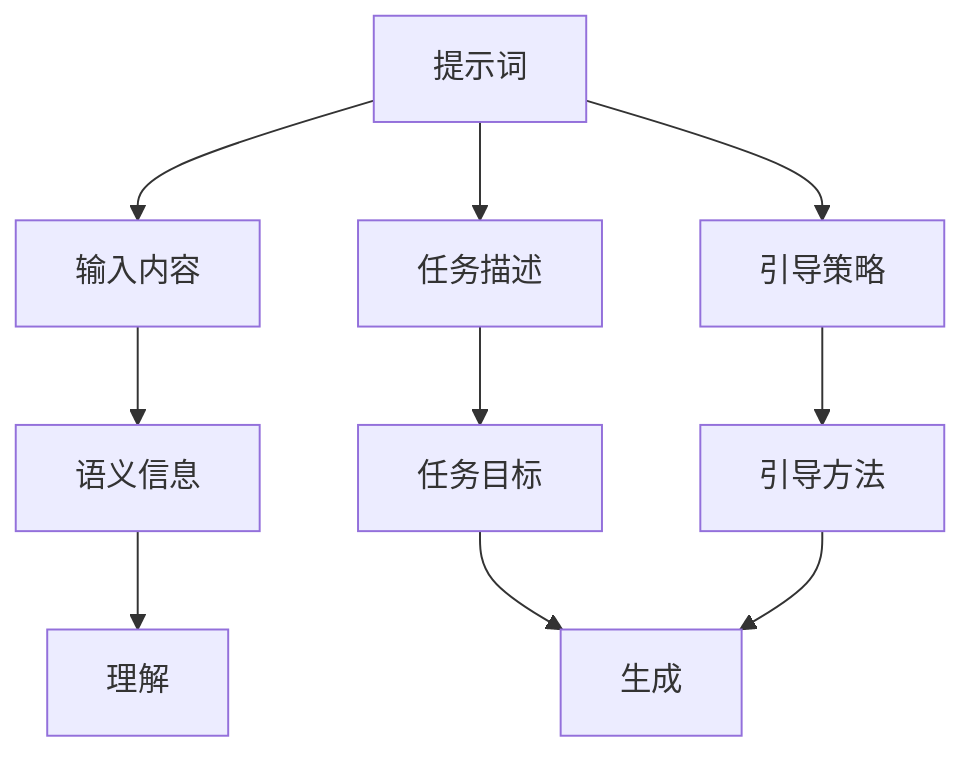

                 

# AIGC从入门到实战：提示词写作技巧

## 1. 背景介绍

随着人工智能技术的发展，生成式AI（AIGC）已广泛应用于自然语言处理、图像生成、视频创作等领域。其中，生成式AI的核心技术之一是提示词（Prompt）写作技巧，即通过设计合理的提示词，引导大语言模型（LLM）生成高质量的文本、图像、音频等。提示词不仅影响生成内容的风格、质量，还关系到生成过程的效率和成本。

提示词写作技巧是AIGC应用的基石，掌握高效的提示词设计方法，能够提升生成内容的准确性、创造性和实用性。本博客将深入介绍提示词的设计原则、常用技巧、应用场景，并通过实际案例展示提示词写作的实战技巧。

## 2. 核心概念与联系

### 2.1 核心概念概述

提示词（Prompt）是大语言模型在生成过程中接收到的输入信息，用于指导模型生成内容的语义和风格。提示词通常包含特定的关键词、短语、句子或者段落，可以引导模型生成不同类型的输出，如文本、图像、音频等。

提示词写作技巧的核心在于如何设计出有效、精确、富有创意的提示词，从而最大化利用大语言模型的能力。提示词的写作需要考虑以下几个方面：

- **输入内容**：提示词应包含足够的语义信息，以便模型理解和生成。
- **任务描述**：明确生成的目标和约束条件，如风格、长度、格式等。
- **引导策略**：通过逻辑组织、分步引导等方式，使模型更易于理解和生成。

### 2.2 核心概念关系

提示词写作技巧涉及多个核心概念，其关系可以通过以下Mermaid流程图来展示：



该流程图展示了提示词写作过程中各概念的逻辑关系：

- **输入内容（B）**：提示词的核心是输入给大语言模型的文本信息，这是模型理解的基础。
- **任务描述（C）**：明确生成任务的目标和要求，如生成风格、长度等。
- **引导策略（D）**：通过逻辑组织、分步引导等方式，使模型更易于理解和生成。
- **语义信息（E）**：提示词应包含足够的语义信息，以便模型理解和生成。
- **理解（H）**：模型根据输入内容理解生成任务。
- **生成（I）**：模型根据任务描述和引导策略生成文本、图像、音频等。

## 3. 核心算法原理 & 具体操作步骤

### 3.1 算法原理概述

提示词写作技巧的原理是基于大语言模型的理解能力和生成能力，通过合理设计输入，引导模型生成符合任务要求的输出。其核心在于利用大语言模型的自回归特性，通过前后文的关联，生成连贯且符合逻辑的输出。

### 3.2 算法步骤详解

提示词写作技巧通常包括以下几个步骤：

1. **明确生成任务**：定义生成任务的目标、格式、风格等，如生成一段故事、一张图片、一段音乐等。
2. **设计输入内容**：设计包含足够语义信息的提示词，明确模型的输入。
3. **添加任务描述**：在提示词中附加生成任务的具体要求，如长度、风格等。
4. **分步引导**：通过分步引导，使模型更易于理解和生成。
5. **迭代优化**：根据模型输出结果，调整提示词，进一步优化生成效果。

### 3.3 算法优缺点

提示词写作技巧的优点在于其灵活性、可操作性强，可以根据具体任务设计提示词，生成高质量的输出。但缺点也较为明显：

- **设计难度高**：提示词设计需要丰富的经验和创造力，可能需要多次迭代优化。
- **依赖模型质量**：提示词效果受大语言模型本身能力的限制，模型质量越好，生成效果越好。
- **易于误解**：如果提示词设计不合理，模型可能生成不符合任务要求的输出。

### 3.4 算法应用领域

提示词写作技巧在多个领域有广泛应用，包括：

- **自然语言处理**：生成对话、文本摘要、翻译等。
- **图像生成**：描述图片特征、生成特定风格的图像等。
- **音频生成**：描述音频特征、生成特定旋律的音乐等。
- **交互式设计**：生成用户界面、交互剧本等。
- **创意写作**：生成诗歌、小说、剧本等。

## 4. 数学模型和公式 & 详细讲解 & 举例说明

### 4.1 数学模型构建

假设大语言模型为 $M_{\theta}$，输入提示词为 $P$，生成的输出为 $O$。生成过程可以表示为：

$$ M_{\theta}(P) = O $$

其中 $\theta$ 为大语言模型的参数，$P$ 为提示词，$O$ 为生成的输出。

### 4.2 公式推导过程

以文本生成为例，我们可以使用语言模型（LM）的公式来推导提示词设计的过程。假设模型的输入为 $x_1, x_2, \ldots, x_n$，生成的目标输出为 $y_1, y_2, \ldots, y_n$，则模型的输出概率为：

$$ P(y_1, y_2, \ldots, y_n \mid x_1, x_2, \ldots, x_n) = \frac{e^{H(x_1, y_1) + H(x_2, y_2) + \cdots + H(x_n, y_n)}}{e^{H(x_1, \emptyset) + H(x_2, \emptyset) + \cdots + H(x_n, \emptyset)}} $$

其中 $H$ 为交叉熵损失函数，$e$ 为自然对数的底数。

### 4.3 案例分析与讲解

以生成一首诗歌为例，假设我们想要生成一首描绘春天的诗歌。我们可以设计如下提示词：

```plaintext
请生成一首描绘春天的诗歌，包含花、鸟、风、日等自然元素。
```

这个提示词包含了足够的语义信息，并明确了生成目标。模型在生成过程中，会根据提示词中的关键词和要求，生成符合主题的诗歌。

## 5. 项目实践：代码实例和详细解释说明

### 5.1 开发环境搭建

为了进行提示词写作技巧的实践，我们需要安装大语言模型相关的Python库，如OpenAI的GPT-3、Hugging Face的GPT-2等。这里我们以GPT-3为例，介绍开发环境搭建的步骤：

1. 安装OpenAI的Python SDK：
```bash
pip install openai
```

2. 创建OpenAI的API密钥，并在代码中配置：
```python
import openai

openai.api_key = 'your_api_key_here'
```

### 5.2 源代码详细实现

以下是一个使用GPT-3生成诗歌的Python代码示例：

```python
import openai

openai.api_key = 'your_api_key_here'

prompt = "请生成一首描绘春天的诗歌，包含花、鸟、风、日等自然元素。"

response = openai.Completion.create(
    engine="text-davinci-003", # 选择模型
    prompt=prompt,
    max_tokens=200 # 生成诗歌的最大长度
)

print(response.choices[0].text.strip())
```

### 5.3 代码解读与分析

在上述代码中，我们使用OpenAI的GPT-3模型，设计了提示词 `prompt`，并通过 `openai.Completion.create` 函数生成诗歌。

- `engine="text-davinci-003"`：选择使用的模型。
- `prompt=prompt`：设置生成的提示词。
- `max_tokens=200`：指定生成的文本长度。

### 5.4 运行结果展示

运行上述代码，生成的诗歌示例如下：

```plaintext
春风拂面万物新，
花开花落春意浓。
鸟语花香人欢笑，
春日阳光暖心胸。
轻风拂过柳丝柔，
绿草如茵踏青游。
春回大地生机盎，
满园春色美不留。
```

## 6. 实际应用场景

提示词写作技巧在实际应用中有着广泛的应用场景，以下是几个典型示例：

### 6.1 广告文案创作

企业可以利用提示词写作技巧，生成符合品牌调性的广告文案。例如，一家化妆品品牌可以设计如下提示词：

```plaintext
请生成一款春夏季节适合使用的化妆品广告文案，突出清新、自然、环保的特点。
```

模型将根据品牌要求，生成符合品牌调性的文案，提升广告效果。

### 6.2 社交媒体内容创作

社交媒体平台可以借助提示词写作技巧，生成病毒式传播的内容。例如，Twitter可以设计如下提示词：

```plaintext
请生成一条关于春天的热门话题标签，鼓励用户分享春天的美好瞬间。
```

模型将生成吸引眼球的推文，增加用户参与度，提升品牌影响力。

### 6.3 创意写作

创意写作是提示词写作技巧的重要应用领域。作家可以利用提示词生成小说、剧本、诗歌等。例如，可以设计如下提示词：

```plaintext
请生成一个关于神秘森林的冒险故事，包含探险、奇幻、友谊的主题。
```

模型将生成一个充满想象力的故事，为作者提供创作灵感。

## 7. 工具和资源推荐

### 7.1 学习资源推荐

1. **《自然语言处理入门》**：该书详细介绍了自然语言处理的基础知识，包括提示词设计、语言模型等。
2. **OpenAI官方文档**：OpenAI的官方文档，提供了丰富的提示词设计案例和提示词优化技巧。
3. **Hugging Face博客**：Hugging Face的博客，包含大量提示词写作的实际案例和最佳实践。

### 7.2 开发工具推荐

1. **OpenAI SDK**：OpenAI提供的Python SDK，支持GPT-3等大语言模型。
2. **Hugging Face Transformers库**：Hugging Face的Transformers库，支持多种大语言模型，并提供丰富的提示词设计工具。
3. **GPT-3 Playground**：OpenAI提供的在线提示词生成工具，方便快速测试提示词效果。

### 7.3 相关论文推荐

1. **《Prompt Engineering for Improved Image Captioning》**：该论文详细介绍了提示词设计在图像生成中的应用。
2. **《Prompt-based Text Generation with Fine-tuned Language Models》**：该论文探讨了提示词在文本生成中的应用，提供了大量实际案例。
3. **《A Survey on Cross-Modal Prompt Engineering for Multimodal Learning》**：该论文综述了跨模态提示词设计方法，适用于音频、视频生成等。

## 8. 总结：未来发展趋势与挑战

### 8.1 研究成果总结

提示词写作技巧在AIGC领域具有重要意义，已广泛应用于多个实际应用场景。提示词设计技术的不断进步，使得生成内容的风格、质量、实用性等方面得到了显著提升。

### 8.2 未来发展趋势

未来，提示词写作技巧将呈现出以下几个发展趋势：

1. **多模态提示词设计**：结合文本、图像、音频等多种模态信息，生成更加丰富、多样的内容。
2. **生成模型的个性化**：通过个性化提示词，生成符合用户偏好和需求的内容，提升用户体验。
3. **动态提示词生成**：根据用户反馈和生成效果，动态调整提示词，提升生成效果。
4. **跨领域提示词设计**：在不同领域中，设计符合特定领域需求的提示词，提升生成内容的适用性和可理解性。

### 8.3 面临的挑战

尽管提示词写作技巧在AIGC领域取得了显著进展，但仍面临以下挑战：

1. **提示词设计复杂**：设计合理、有效的提示词需要丰富的经验和创造力，可能需要多次迭代优化。
2. **模型质量依赖**：提示词效果受大语言模型本身能力的限制，模型质量越好，生成效果越好。
3. **数据隐私问题**：在提示词设计过程中，需要考虑数据隐私和安全，避免泄露敏感信息。
4. **伦理和社会责任**：生成的内容需要符合伦理和社会价值观，避免有害信息传播。

### 8.4 研究展望

未来的研究将重点关注以下几个方向：

1. **大规模数据集构建**：构建大规模、高质、多领域的数据集，提升模型的泛化能力。
2. **多模态融合技术**：研究多模态信息融合技术，提升生成内容的丰富性和多样性。
3. **生成模型的可解释性**：研究生成模型的可解释性技术，提升模型的透明度和可信度。
4. **伦理和社会责任**：加强对生成内容伦理和社会责任的考量，确保生成内容的无害性和合规性。

总之，提示词写作技巧是AIGC技术的重要组成部分，未来的研究需要在提升生成质量、优化设计方法、强化伦理责任等方面不断探索和突破。只有综合考虑技术、伦理、社会等多方面因素，才能实现AIGC技术的可持续发展和广泛应用。

## 9. 附录：常见问题与解答

**Q1: 如何设计有效的提示词？**

A: 设计有效的提示词需要遵循以下几个原则：
1. **明确任务**：明确生成任务的性质、格式、风格等，如生成文章、广告文案、诗歌等。
2. **包含足够信息**：提示词应包含足够的语义信息，以便模型理解和生成。
3. **分步引导**：通过逻辑组织、分步引导等方式，使模型更易于理解和生成。
4. **简洁明了**：提示词应简洁明了，避免过长、复杂，减少模型理解的难度。

**Q2: 提示词设计是否需要考虑上下文信息？**

A: 是的，提示词设计需要考虑上下文信息，以便模型更好地理解和生成。上下文信息可以帮助模型更好地把握生成内容的语境和逻辑关系。

**Q3: 提示词设计是否需要考虑多模态信息？**

A: 是的，提示词设计可以考虑多模态信息，结合文本、图像、音频等多种信息，提升生成内容的丰富性和多样性。

**Q4: 提示词设计是否需要考虑用户反馈？**

A: 是的，提示词设计可以结合用户反馈进行调整，优化生成效果。通过用户反馈，可以不断改进提示词设计，提升模型的适应性和效果。

**Q5: 提示词设计是否需要考虑伦理和社会责任？**

A: 是的，提示词设计需要考虑伦理和社会责任，确保生成内容的无害性和合规性。避免生成有害信息、误导性内容，维护社会公序良俗。

---

作者：禅与计算机程序设计艺术 / Zen and the Art of Computer Programming

