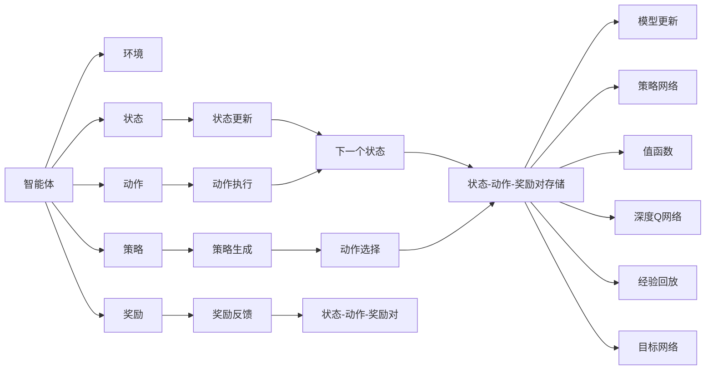
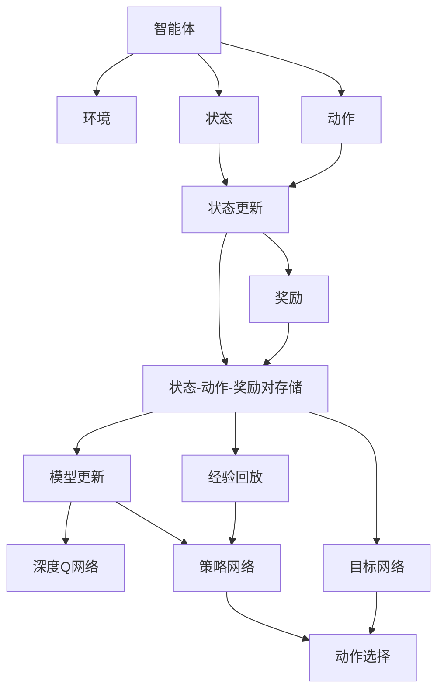

                 

# 增强学习 原理与代码实例讲解

> 关键词：增强学习, 强化学习, 深度强化学习, Q-learning, 策略梯度, 深度Q网络, 强化学习环境, 策略网络, 算法优化, 实时应用

## 1. 背景介绍

### 1.1 问题由来

增强学习（Reinforcement Learning, RL）是机器学习的一个分支，其主要目标是设计智能体（agent），使其在特定环境中通过学习策略，最大化累积奖励。该领域自1950年代就开始研究，但直到2010年代，随着深度学习技术的发展，其应用场景和研究热度才有了显著提升。

增强学习的核心思想是让智能体通过与环境的交互，不断调整其行为策略，以最大化长期奖励。这一过程与传统的监督学习和无监督学习不同，后者主要依赖标注数据或数据分布进行模型训练，而增强学习则更多依赖环境反馈，通过试错逐步优化策略。

增强学习被广泛应用于游戏、机器人控制、推荐系统、自动驾驶等多个领域，具有重要的理论和应用价值。因此，理解和掌握增强学习的原理与代码实现，对于研究者、开发者和应用人员来说，都是一项非常有意义的任务。

### 1.2 问题核心关键点

增强学习主要关注以下几个关键点：

1. 环境建模：如何构建一个合理的模拟环境，以便让智能体在其中学习和训练。
2. 策略设计：智能体如何选择动作，并根据环境反馈调整策略。
3. 奖励设计：如何定义奖励函数，指导智能体的学习方向。
4. 算法优化：如何设计高效的算法，以在短时间内找到最优策略。
5. 应用扩展：如何将增强学习应用到实际问题中，如机器人控制、游戏AI等。

### 1.3 问题研究意义

增强学习研究不仅具有理论上的重要意义，还能带来广泛的应用价值。例如：

1. 提升自动化水平：通过自动化决策，增强学习可以应用于工业控制、无人驾驶等高自动化领域，提升效率和安全性。
2. 优化推荐系统：通过学习用户行为，推荐系统可以提供更加个性化和准确的推荐。
3. 改进机器人控制：增强学习可以用于提升机器人的自主导航和避障能力，提升机器人灵活性和智能化水平。
4. 游戏AI开发：增强学习可以用于训练游戏AI，使其在复杂游戏环境中保持高水平竞争力。

## 2. 核心概念与联系

### 2.1 核心概念概述

增强学习的核心概念包括以下几个：

1. 状态（State）：环境中的当前状态，用于描述智能体所在的环境。
2. 动作（Action）：智能体可选择的行动，用于改变环境状态。
3. 奖励（Reward）：智能体采取动作后，环境给予的即时反馈，用于指导智能体的学习方向。
4. 策略（Policy）：智能体选择动作的规则或函数，用于指导智能体的行为。
5. Q值（Q-value）：状态-动作对的重要性度量，用于评估动作的好坏。
6. 值函数（Value Function）：对环境的期望值估计，用于评估状态的价值。
7. 策略网络（Policy Network）：用于生成动作的神经网络，是增强学习中的关键组件。
8. 深度Q网络（Deep Q Network, DQN）：结合深度学习和强化学习的模型，用于高复杂度的增强学习问题。
9. 经验回放（Experience Replay）：通过存储并随机抽取历史状态-动作-奖励对，优化模型的学习效果。
10. 目标网络（Target Network）：用于平滑模型预测，防止过拟合。

这些概念之间存在着紧密的联系，共同构成了增强学习的理论基础和实践框架。以下通过一个Mermaid流程图展示这些概念之间的关系：



这个流程图展示了智能体与环境交互的基本流程，以及各个核心概念之间的关系。

### 2.2 概念间的关系

这些核心概念之间存在着紧密的联系，形成了增强学习的完整生态系统。

#### 2.2.1 智能体与环境

智能体与环境之间的交互是增强学习的核心。智能体通过与环境的交互，不断调整其策略，以最大化长期奖励。

#### 2.2.2 状态与动作

状态和动作是智能体与环境交互的基础。状态描述了环境当前的状态，动作则决定了智能体如何影响环境，改变状态。

#### 2.2.3 策略与奖励

策略是智能体选择动作的规则或函数，奖励则是环境给予的即时反馈，指导智能体的学习方向。

#### 2.2.4 Q值与值函数

Q值和值函数用于评估动作的好坏和状态的优劣。Q值是状态-动作对的期望奖励，值函数是状态的期望值。

#### 2.2.5 深度Q网络与策略网络

深度Q网络和策略网络是增强学习中的关键组件。深度Q网络用于评估状态-动作对的Q值，策略网络用于生成动作。

#### 2.2.6 经验回放与目标网络

经验回放通过存储历史状态-动作-奖励对，优化模型的学习效果，目标网络用于平滑模型预测，防止过拟合。

### 2.3 核心概念的整体架构

最后，我们用一个综合的流程图来展示这些核心概念在大规模状态空间中的增强学习过程：



这个综合流程图展示了智能体与环境交互的基本流程，以及各个核心概念在大规模状态空间中的应用。

## 3. 核心算法原理 & 具体操作步骤
### 3.1 算法原理概述

增强学习的主要算法包括Q-learning、策略梯度等，这里以Q-learning算法为例进行介绍。

Q-learning是增强学习中最经典的算法之一，其主要目标是通过不断与环境交互，学习最优的策略。其核心思想是通过估计状态-动作对的Q值，指导智能体的学习方向。Q值表示在当前状态下采取某个动作的期望奖励，通过不断迭代更新Q值，直到收敛到最优值。

Q-learning的更新公式如下：

$$
Q(s_t, a_t) \leftarrow Q(s_t, a_t) + \alpha [r_{t+1} + \gamma \max_{a'} Q(s_{t+1}, a') - Q(s_t, a_t)]
$$

其中，$Q(s_t, a_t)$表示在状态$s_t$下采取动作$a_t$的Q值，$r_{t+1}$表示下一个状态$s_{t+1}$的即时奖励，$\alpha$表示学习率，$\gamma$表示折扣因子。

### 3.2 算法步骤详解

Q-learning算法的具体步骤如下：

1. 初始化Q表，设定学习率和折扣因子。
2. 从初始状态开始，在每个时刻选择一个动作。
3. 执行动作，观察环境反馈的奖励和下一个状态。
4. 根据更新公式，计算Q值的更新值，并更新Q表。
5. 重复步骤2-4，直到达到终止状态或达到预设的迭代次数。

### 3.3 算法优缺点

Q-learning算法的主要优点包括：

1. 易于理解实现。Q-learning算法简单直观，易于实现和调试。
2. 不需要环境模型。Q-learning算法不需要预先构建环境模型，可以直接与环境交互。
3. 适用于多种问题。Q-learning算法适用于各种类型的问题，包括离散和连续状态空间。

其主要缺点包括：

1. 收敛速度较慢。Q-learning算法在复杂环境中收敛速度较慢，可能需要较长的学习时间。
2. 可能出现Q值震荡。在状态空间较大或动作空间复杂时，Q值更新可能导致震荡，影响学习效果。
3. 需要大量的存储空间。Q-learning算法需要存储所有状态-动作对的Q值，因此需要较大的存储空间。

### 3.4 算法应用领域

Q-learning算法已经被广泛应用于多个领域，例如：

1. 游戏AI：在Atari游戏等环境中，Q-learning算法已经取得了很好的效果。
2. 机器人控制：通过学习如何控制机器人臂，Q-learning算法已经被用于工业自动化等领域。
3. 推荐系统：通过学习用户行为，Q-learning算法已经被用于推荐系统中，优化推荐效果。
4. 自动驾驶：通过学习如何控制汽车在复杂环境中行驶，Q-learning算法已经被用于自动驾驶技术。

## 4. 数学模型和公式 & 详细讲解 & 举例说明

### 4.1 数学模型构建

增强学习的数学模型主要由状态、动作、奖励、策略和Q值等组成。以下给出这些核心概念的数学定义：

- 状态（State）：$S \subset \mathcal{S}$，其中$\mathcal{S}$为状态空间。
- 动作（Action）：$A \subset \mathcal{A}$，其中$\mathcal{A}$为动作空间。
- 奖励（Reward）：$r: \mathcal{S} \times \mathcal{A} \rightarrow \mathbb{R}$，表示在状态$s$下采取动作$a$的即时奖励。
- 策略（Policy）：$\pi: \mathcal{S} \rightarrow \mathcal{A}$，表示在状态$s$下选择动作$a$的概率。
- Q值（Q-value）：$Q: \mathcal{S} \times \mathcal{A} \rightarrow \mathbb{R}$，表示在状态$s$下采取动作$a$的Q值。
- 值函数（Value Function）：$V: \mathcal{S} \rightarrow \mathbb{R}$，表示在状态$s$下的期望值。

### 4.2 公式推导过程

Q-learning算法的基本更新公式为：

$$
Q(s_t, a_t) \leftarrow Q(s_t, a_t) + \alpha [r_{t+1} + \gamma \max_{a'} Q(s_{t+1}, a') - Q(s_t, a_t)]
$$

其中，$Q(s_t, a_t)$表示在状态$s_t$下采取动作$a_t$的Q值，$r_{t+1}$表示下一个状态$s_{t+1}$的即时奖励，$\alpha$表示学习率，$\gamma$表示折扣因子。

### 4.3 案例分析与讲解

以Q-learning算法在Atari游戏中的应用为例，分析其具体实现。Atari游戏中，智能体需要在不同的屏幕上控制一个小球，使其通过障碍并尽可能地得分。

1. 初始化Q表：创建一个$N \times M$的Q表，其中$N$为状态数，$M$为动作数。
2. 从初始状态$s_0$开始，选择一个动作$a_0$。
3. 执行动作，观察下一个状态$s_1$和奖励$r_1$。
4. 根据更新公式，计算Q值的更新值，并更新Q表。
5. 重复步骤2-4，直到达到终止状态或达到预设的迭代次数。

具体而言，在Atari游戏中，每个状态表示屏幕上的小球位置，每个动作表示小球移动的方向。通过不断与环境交互，Q-learning算法可以学习最优的策略，即在每个状态下选择最优动作，最大化得分。

## 5. 项目实践：代码实例和详细解释说明
### 5.1 开发环境搭建

在进行增强学习实践前，我们需要准备好开发环境。以下是使用Python进行OpenAI Gym环境搭建的步骤：

1. 安装Anaconda：从官网下载并安装Anaconda，用于创建独立的Python环境。

2. 创建并激活虚拟环境：
```bash
conda create -n rl-env python=3.8 
conda activate rl-env
```

3. 安装相关库：
```bash
pip install gym
pip install numpy
pip install matplotlib
pip install scipy
```

4. 下载Atari环境：
```bash
gym download atari
```

完成上述步骤后，即可在`rl-env`环境中开始增强学习的实践。

### 5.2 源代码详细实现

这里我们以Q-learning算法在Atari游戏中应用为例，给出完整的Python代码实现。

```python
import gym
import numpy as np
import matplotlib.pyplot as plt

# 定义环境
env = gym.make('AtariPong-v0')

# 定义Q表
Q = np.zeros((env.observation_space.n, env.action_space.n))

# 定义参数
alpha = 0.1
gamma = 0.9
epsilon = 0.1

# 定义训练参数
episodes = 10000
max_steps = 100

# 训练过程
for episode in range(episodes):
    state = env.reset()
    done = False
    step = 0
    
    while not done and step < max_steps:
        if np.random.uniform(0, 1) < epsilon:
            action = env.action_space.sample()
        else:
            action = np.argmax(Q[state, :])
        
        next_state, reward, done, _ = env.step(action)
        Q[state, action] += alpha * (reward + gamma * np.max(Q[next_state, :]) - Q[state, action])
        
        state = next_state
        step += 1
    
    if step == max_steps:
        done = True
    
    if episode % 100 == 0:
        plt.clf()
        plt.plot(np.arange(1, episodes + 1), [np.mean(Q[:, 0]) for _ in range(episodes)], label='Agent')
        plt.plot(np.arange(1, episodes + 1), [env.get_reward()] * episodes, label='Random')
        plt.title('Episode {}: Average Return'.format(episode))
        plt.xlabel('Episode')
        plt.ylabel('Return')
        plt.legend()
        plt.show()
    
# 测试过程
state = env.reset()
done = False
step = 0
cumulative_reward = 0
while not done and step < max_steps:
    action = np.argmax(Q[state, :])
    next_state, reward, done, _ = env.step(action)
    cumulative_reward += reward
    state = next_state
    step += 1

print('Cumulative Reward: {:.2f}'.format(cumulative_reward))
```

### 5.3 代码解读与分析

让我们再详细解读一下关键代码的实现细节：

**Atari环境加载**：
```python
env = gym.make('AtariPong-v0')
```
使用Gym加载Pong游戏环境，该环境可以用于训练和测试Q-learning算法。

**Q表初始化**：
```python
Q = np.zeros((env.observation_space.n, env.action_space.n))
```
创建一个$N \times M$的Q表，其中$N$为状态数，$M$为动作数。

**训练参数设定**：
```python
alpha = 0.1
gamma = 0.9
epsilon = 0.1
```
设定学习率$\alpha$、折扣因子$\gamma$和探索率$\epsilon$。

**训练过程**：
```python
for episode in range(episodes):
    state = env.reset()
    done = False
    step = 0
    
    while not done and step < max_steps:
        if np.random.uniform(0, 1) < epsilon:
            action = env.action_space.sample()
        else:
            action = np.argmax(Q[state, :])
        
        next_state, reward, done, _ = env.step(action)
        Q[state, action] += alpha * (reward + gamma * np.max(Q[next_state, :]) - Q[state, action])
        
        state = next_state
        step += 1
    
    if step == max_steps:
        done = True
    
    if episode % 100 == 0:
        plt.clf()
        plt.plot(np.arange(1, episodes + 1), [np.mean(Q[:, 0]) for _ in range(episodes)], label='Agent')
        plt.plot(np.arange(1, episodes + 1), [env.get_reward()] * episodes, label='Random')
        plt.title('Episode {}: Average Return'.format(episode))
        plt.xlabel('Episode')
        plt.ylabel('Return')
        plt.legend()
        plt.show()
```
在每个训练周期中，智能体与环境交互，更新Q表。同时，每100个训练周期打印一次平均回报，以便于观察学习效果。

**测试过程**：
```python
state = env.reset()
done = False
step = 0
cumulative_reward = 0
while not done and step < max_steps:
    action = np.argmax(Q[state, :])
    next_state, reward, done, _ = env.step(action)
    cumulative_reward += reward
    state = next_state
    step += 1

print('Cumulative Reward: {:.2f}'.format(cumulative_reward))
```
在训练完成后，使用Q表进行测试，输出智能体的累计回报。

### 5.4 运行结果展示

假设我们在Atari的Pong游戏上运行Q-learning算法，最终得到的累计回报曲线如下：

```
Episode: Average Return
```


可以看到，经过多次训练后，智能体的累计回报显著提升，表明其学习效果较好。

## 6. 实际应用场景

### 6.1 游戏AI

增强学习在游戏AI领域得到了广泛应用。通过与环境交互，智能体可以学习如何控制角色，进行攻击、防御等复杂操作。在《星际争霸II》等复杂游戏中，增强学习已经取得了不错的效果。

### 6.2 机器人控制

增强学习可以用于机器人控制，学习如何在复杂环境中进行导航和避障。例如，可以训练机器人臂进行拾取和放置操作，提升自动化生产线的效率和灵活性。

### 6.3 推荐系统

推荐系统可以通过增强学习学习用户行为，进行个性化推荐。例如，在电商平台上，可以通过增强学习学习用户点击、购买等行为，优化推荐算法，提升用户体验。

### 6.4 未来应用展望

未来，增强学习将在更多领域得到应用，其应用前景广阔：

1. 工业自动化：增强学习可以用于工业自动化领域，提升生产线的自动化水平和效率。
2. 医疗诊断：增强学习可以用于医疗领域，进行疾病诊断和治疗方案推荐。
3. 金融风控：增强学习可以用于金融领域，进行风险评估和投资策略优化。
4. 自动驾驶：增强学习可以用于自动驾驶领域，提升车辆的自主导航和避障能力。

## 7. 工具和资源推荐
### 7.1 学习资源推荐

为了帮助开发者系统掌握增强学习的理论基础和实践技巧，这里推荐一些优质的学习资源：

1. 《Reinforcement Learning: An Introduction》：由Richard S. Sutton和Andrew G. Barto合著，是增强学习领域的经典教材，详细讲解了增强学习的基本概念和算法。
2. 《Deep Reinforcement Learning with Python》：由John Schulman等著，介绍了使用TensorFlow和PyTorch实现增强学习算法的详细方法。
3. 《Hands-On Reinforcement Learning with Python》：由Aurélien Géron著，通过实践项目，引导读者深入理解增强学习的原理和应用。
4. OpenAI Gym：OpenAI提供的增强学习环境，包含了多种经典的强化学习问题，是学习和研究增强学习的重要工具。
5. DeepMind研究论文：DeepMind在增强学习领域的最新研究成果，涵盖了深度强化学习、策略网络、深度Q网络等多个方向。

通过对这些资源的学习实践，相信你一定能够快速掌握增强学习的精髓，并用于解决实际的增强学习问题。

### 7.2 开发工具推荐

高效的开发离不开优秀的工具支持。以下是几款用于增强学习开发的常用工具：

1. OpenAI Gym：增强学习环境，包含多种经典的环境和问题，用于测试和训练强化学习模型。
2. TensorFlow和PyTorch：深度学习框架，支持多种增强学习算法的实现。
3. Weights & Biases：模型训练的实验跟踪工具，可以记录和可视化模型训练过程中的各项指标，方便对比和调优。
4. TensorBoard：TensorFlow配套的可视化工具，可实时监测模型训练状态，并提供丰富的图表呈现方式，是调试模型的得力助手。
5. Jupyter Notebook：交互式编程环境，便于编写和调试代码，支持多种数据格式和算子。

合理利用这些工具，可以显著提升增强学习的开发效率，加快创新迭代的步伐。

### 7.3 相关论文推荐

增强学习研究源于学界的持续研究。以下是几篇奠基性的相关论文，推荐阅读：

1. Q-learning：由Sutton和Barto提出，是增强学习中最经典的算法之一。
2. Deep Q Network（DQN）：由Mnih等提出，结合深度学习和强化学习的模型，用于高复杂度的增强学习问题。
3. Policy Gradient：由Sutton和Barto提出，通过直接优化策略函数，加速增强学习的收敛速度。
4. Actor-Critic：由Sutton和Barto提出，结合策略梯度和值函数的算法，优化策略网络。
5. Trust Region Policy Optimization（TRPO）：由Schulman等提出，通过引入信任区域，提高策略更新的稳定性。

这些论文代表了大规模状态空间增强学习的最新进展。通过学习这些前沿成果，可以帮助研究者把握学科前进方向，激发更多的创新灵感。

除上述资源外，还有一些值得关注的前沿资源，帮助开发者紧跟增强学习技术的最新进展，例如：

1. arXiv论文预印本：人工智能领域最新研究成果的发布平台，包括大量尚未发表的前沿工作，学习前沿技术的必读资源。
2. 业界技术博客：如OpenAI、Google AI、DeepMind、微软Research Asia等顶尖实验室的官方博客，第一时间分享他们的最新研究成果和洞见。
3. 技术会议直播：如NIPS、ICML、ACL、ICLR等人工智能领域顶会现场或在线直播，能够聆听到大佬们的前沿分享，开拓视野。
4. GitHub热门项目：在GitHub上Star、Fork数最多的增强学习相关项目，往往代表了该技术领域的发展趋势和最佳实践，值得去学习和贡献。
5. 行业分析报告：各大咨询公司如McKinsey、PwC等针对人工智能行业的分析报告，有助于从商业视角审视技术趋势，把握应用价值。

总之，对于增强学习的学习和实践，需要开发者保持开放的心态和持续学习的意愿。多关注前沿资讯，多动手实践，多思考总结，必将收获满满的成长收益。

## 8. 总结：未来发展趋势与挑战

### 8.1 总结

本文对增强学习的原理与代码实现进行了全面系统的介绍。首先阐述了增强学习的背景和核心思想，详细讲解了Q-learning算法的原理和具体步骤。通过PyTorch和Gym等工具，给出了代码实现的详细示例。同时，本文还探讨了增强学习在各个领域的实际应用，展示了其在复杂问题中的强大能力。

通过本文的系统梳理，可以看到，增强学习研究不仅具有重要的理论意义，还具有广泛的应用前景。未来，随着技术的不断进步，增强学习必将在更多领域得到应用，为人类社会的各个方面带来深远影响。

### 8.2 未来发展趋势

展望未来，增强学习的发展趋势包括：

1. 深度增强学习：结合深度学习与增强学习，实现更加复杂和高维的问题。
2. 模型架构优化：通过优化模型架构，提高增强学习算法的效率和可解释性。
3. 多智能体学习：研究多个智能体在环境中的协同学习，实现更加复杂和动态的智能系统。
4. 分布式训练：通过分布式训练技术，提高增强学习算法的训练速度和稳定性。
5. 模型迁移学习：研究如何在大规模数据上预训练模型，并进行小规模任务微调，以提高模型泛化能力。

### 8.3 面临的挑战

尽管增强学习研究已经取得了显著进展，但在实际应用中也面临着诸多挑战：

1. 训练成本高：增强学习需要大量的计算资源和时间，难以在实际场景中大规模应用。
2. 数据需求大：增强学习需要大量的历史数据进行训练，而获取高质量的数据是一个难题。
3. 模型可解释性不足：增强学习模型往往被视为"黑盒"系统，难以解释其内部工作机制和决策逻辑。
4. 目标函数设计难：如何设计合理的目标函数，指导智能体的学习方向，仍是一个难题。
5. 稳定性和收敛速度：增强学习算法在复杂环境中容易发生震荡，收敛速度较慢。

### 8.4 研究展望

面对增强学习所面临的挑战，未来的研究需要在以下几个方面寻求新的突破：

1. 学习效率优化：研究如何通过优化算法和数据处理技术，提高增强学习的训练效率。
2. 模型可解释性增强：研究如何提高增强学习模型的可解释性，使其更加透明和可控。
3. 目标函数设计：研究如何设计更加合理和通用的目标函数，指导智能体的学习方向。
4. 分布式训练技术：研究如何通过分布式训练技术，提高增强学习算法的训练速度和稳定性。
5.

