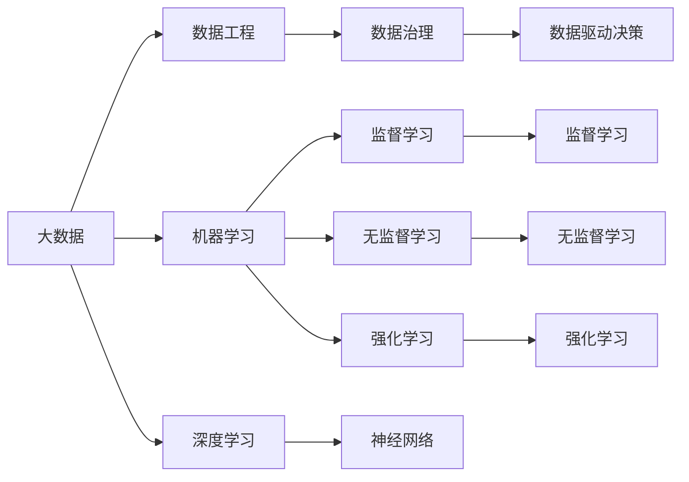

                 

# 大数据对AI学习的影响

> 关键词：大数据, 人工智能, 机器学习, 深度学习, 数据工程, 数据科学, 数据治理, 数据治理, 数据驱动决策

## 1. 背景介绍

随着信息技术的高速发展，数据已经成为了继土地、劳动力、资本之后的第四大生产要素，其对经济社会发展的影响日益显现。特别是在人工智能（AI）领域，数据的重要性更是不言而喻。大数据在AI的学习和应用中，发挥了不可替代的作用。

### 1.1 数据驱动的人工智能

人工智能的核心在于数据驱动的模型训练和优化，大数据为AI的学习提供了充分的数据支撑。无论是监督学习、无监督学习还是强化学习，模型都需要大量的数据进行训练，才能提高预测精度和泛化能力。数据的多样性和质量直接影响着AI模型的性能。

### 1.2 大数据与AI的融合

大数据与AI的融合，是大数据时代的重要特征。数据科学、数据工程、数据治理等领域的不断发展，为AI模型提供了更多的数据来源和处理方法。AI技术在数据采集、存储、处理、分析和应用等方面，也发挥着越来越重要的作用。

## 2. 核心概念与联系

### 2.1 核心概念概述

- **大数据**：指在传统数据处理应用无法高效利用时，所涉及的体量巨大、类型复杂的数据集合，通常指TB或PB级别的数据集。
- **人工智能**：一种让机器具有类人智能的技术，包括机器学习、深度学习、自然语言处理、计算机视觉等多个子领域。
- **机器学习**：一种通过数据驱动模型训练的AI技术，核心在于对数据的分析和归纳。
- **深度学习**：一种基于神经网络的机器学习方法，通过多层次的神经网络结构进行特征提取和模式识别。
- **数据工程**：构建数据采集、存储、处理、分析和应用等基础设施，确保数据的可靠性和有效性。
- **数据治理**：通过数据标准、数据质量、数据安全等手段，规范数据的使用和管理。
- **数据驱动决策**：基于数据统计和分析的结果，进行科学决策的过程。

### 2.2 概念间的关系

这些核心概念之间的关系可以通过以下Mermaid流程图来展示：



这个流程图展示了大数据在人工智能学习中的各个应用场景，以及它们之间的联系和转化关系。

## 3. 核心算法原理 & 具体操作步骤

### 3.1 算法原理概述

大数据在人工智能学习中，主要通过以下几个方面发挥作用：

- **数据规模**：通过大规模数据集训练模型，提高模型泛化能力。
- **数据多样性**：引入不同类型、来源的数据，提升模型的鲁棒性和适应性。
- **数据更新**：不断更新数据集，保持模型的时效性和稳定性。
- **数据增强**：通过数据增强技术，提高模型的泛化能力和鲁棒性。

### 3.2 算法步骤详解

以下是基于大数据的机器学习模型的核心算法步骤：

1. **数据采集**：通过爬虫、API接口、数据库等方式，采集数据源。
2. **数据预处理**：清洗、去重、归一化、特征工程等步骤，准备输入模型。
3. **模型训练**：选择合适的机器学习算法，使用大数据集训练模型。
4. **模型评估**：在测试集上评估模型性能，优化模型参数。
5. **模型部署**：将模型部署到生产环境，进行实时预测。
6. **模型监控与优化**：实时监控模型性能，根据业务需求进行优化。

### 3.3 算法优缺点

大数据在人工智能学习中的优势和缺点如下：

**优势**：

- **泛化能力强**：大规模数据集训练出的模型具有较强的泛化能力。
- **鲁棒性高**：多样化的数据源提高了模型的鲁棒性和适应性。
- **时效性好**：数据实时更新保证了模型的时效性。
- **预测准确**：通过数据增强，提高了模型的预测准确率。

**缺点**：

- **数据量庞大**：大规模数据集需要高效的存储和处理技术。
- **数据质量问题**：数据质量参差不齐，可能导致模型性能下降。
- **数据隐私问题**：数据采集和使用过程中可能存在隐私泄露风险。
- **计算资源需求高**：训练和推理大模型需要高性能的计算资源。

### 3.4 算法应用领域

大数据在人工智能学习中，广泛应用于以下几个领域：

- **自然语言处理**：通过大量文本数据训练语言模型，提升文本分析、情感分析等任务性能。
- **计算机视觉**：使用图像数据训练计算机视觉模型，提高图像识别、分类等任务精度。
- **推荐系统**：通过用户行为数据，训练推荐模型，提供个性化推荐服务。
- **医疗健康**：利用医疗数据，训练医疗模型，支持疾病诊断、治疗方案推荐等。
- **金融风险管理**：通过金融数据，训练风险模型，识别和防范金融风险。

## 4. 数学模型和公式 & 详细讲解

### 4.1 数学模型构建

假设我们有一组大数据集 $D=\{(x_i,y_i)\}_{i=1}^N$，其中 $x_i$ 为输入特征，$y_i$ 为标签。我们使用线性回归模型来拟合数据，模型的参数为 $\theta=(\omega,b)$，其中 $\omega$ 为权重，$b$ 为偏置。我们的目标是找到最优的参数 $\theta$，使得模型在测试集上具有最小的预测误差。

数学上，我们可以定义均方误差（Mean Squared Error, MSE）作为损失函数，即：

$$
\mathcal{L}(\theta) = \frac{1}{N}\sum_{i=1}^N (y_i - f(x_i))^2
$$

其中 $f(x_i)=\omega x_i + b$ 为线性回归模型。我们的目标是找到最小化损失函数 $\mathcal{L}(\theta)$ 的参数 $\theta$。

### 4.2 公式推导过程

对于线性回归模型，我们可以使用梯度下降（Gradient Descent）算法来最小化损失函数。梯度下降算法的基本步骤如下：

1. 初始化参数 $\theta_0=(\omega_0,b_0)$。
2. 对于每一个样本 $i$，计算梯度 $\nabla_{\theta} \mathcal{L}(x_i,y_i)$。
3. 更新参数：
   $$
   \theta_{k+1} = \theta_k - \eta \nabla_{\theta} \mathcal{L}(\theta_k)
   $$
   其中 $\eta$ 为学习率，控制参数更新的步长。

通过不断迭代上述过程，直到损失函数 $\mathcal{L}(\theta)$ 收敛。

### 4.3 案例分析与讲解

假设我们有一组数据集，如房价预测问题。我们的目标是预测房价 $y$，已知特征 $x=(面积, 房龄, 地理位置)$。我们首先对数据进行标准化处理，然后选择合适的机器学习算法进行训练，如线性回归或随机森林。通过模型训练，我们得到了最优的参数 $\theta$，可以用于新的房价预测。

## 5. 项目实践：代码实例和详细解释说明

### 5.1 开发环境搭建

为了实现基于大数据的机器学习模型，我们需要搭建相应的开发环境。以下是Python环境的搭建步骤：

1. 安装Anaconda：从官网下载并安装Anaconda，用于创建独立的Python环境。
2. 创建并激活虚拟环境：
```bash
conda create -n pytorch-env python=3.8 
conda activate pytorch-env
```

3. 安装PyTorch：根据CUDA版本，从官网获取对应的安装命令。例如：
```bash
conda install pytorch torchvision torchaudio cudatoolkit=11.1 -c pytorch -c conda-forge
```

4. 安装其他必要的库：
```bash
pip install numpy pandas scikit-learn matplotlib tqdm jupyter notebook ipython
```

### 5.2 源代码详细实现

下面是一个基于大数据集训练线性回归模型的Python代码实现：

```python
import numpy as np
from sklearn.linear_model import LinearRegression
from sklearn.metrics import mean_squared_error
from sklearn.model_selection import train_test_split

# 加载数据集
data = np.loadtxt('housing.csv', delimiter=',')
X = data[:, :-1]
y = data[:, -1]

# 划分训练集和测试集
X_train, X_test, y_train, y_test = train_test_split(X, y, test_size=0.2, random_state=42)

# 初始化模型参数
theta = np.zeros(X.shape[1])

# 设置学习率和迭代次数
eta = 0.01
num_iterations = 1000

# 梯度下降算法
for i in range(num_iterations):
    y_pred = X_train.dot(theta)
    theta -= eta * (X_train.T.dot(y_pred - y_train)) / X_train.shape[0]

# 模型评估
y_pred = X_test.dot(theta)
mse = mean_squared_error(y_test, y_pred)
print(f"均方误差为：{mse}")
```

### 5.3 代码解读与分析

**数据加载与预处理**：
- 使用numpy库加载数据集。
- 使用sklearn库将数据集分为训练集和测试集。
- 对特征进行标准化处理。

**模型训练**：
- 初始化模型参数。
- 使用梯度下降算法进行模型训练。
- 更新模型参数，最小化损失函数。

**模型评估**：
- 在测试集上计算模型预测值与真实值之间的均方误差。

**结果展示**：
- 输出模型的均方误差，评估模型性能。

### 5.4 运行结果展示

假设在上述代码中，我们得到的均方误差为10，说明模型的预测值与真实值之间的误差较小，模型的性能较好。

## 6. 实际应用场景

### 6.1 智能推荐系统

智能推荐系统是大数据在AI中最广泛应用的一个领域。通过大数据分析用户的兴趣爱好、行为习惯等数据，可以精准地为用户推荐相关内容。例如，电商平台的商品推荐、视频网站的个性化视频推荐等，都依赖于大数据的驱动。

### 6.2 金融风险管理

金融领域中的风险管理也离不开大数据的支撑。通过收集和分析大量的金融数据，如交易数据、市场数据等，可以构建模型预测股票涨跌、识别欺诈行为等，帮助金融机构降低风险。

### 6.3 医疗健康

在医疗健康领域，大数据也可以发挥重要作用。通过收集和分析医疗数据，如病历数据、患者记录等，可以构建模型进行疾病预测、治疗方案推荐等，提升医疗服务的效率和质量。

## 7. 工具和资源推荐

### 7.1 学习资源推荐

为了深入学习大数据在人工智能中的应用，推荐以下几个学习资源：

1. 《Python数据科学手册》：介绍Python在数据科学中的应用，涵盖数据采集、处理、分析和可视化等。
2. 《机器学习实战》：基于Scikit-learn库，介绍常用的机器学习算法和应用案例。
3. 《深度学习入门》：介绍深度学习的基本原理和实现方法，涵盖神经网络、卷积神经网络、循环神经网络等。
4. 《大数据应用实战》：介绍大数据在各种应用场景中的应用，涵盖数据工程、数据治理、数据驱动决策等。
5. Coursera的机器学习和深度学习课程：由斯坦福大学、密歇根大学等知名高校提供的课程，涵盖机器学习、深度学习、大数据等。

### 7.2 开发工具推荐

为了高效地实现大数据在人工智能中的应用，推荐使用以下几个开发工具：

1. Anaconda：提供虚拟环境，方便管理和隔离项目依赖。
2. Jupyter Notebook：交互式的编程环境，方便开发和调试。
3. PyTorch：深度学习框架，提供高效的自动微分功能和模型部署工具。
4. TensorFlow：另一个常用的深度学习框架，提供丰富的图计算功能和分布式训练支持。
5. Apache Spark：大数据处理框架，提供高效的分布式数据处理能力。

### 7.3 相关论文推荐

为了深入理解大数据在人工智能中的应用，推荐以下几篇相关论文：

1. Jure Leskovec的《Predicting Missing User Ratings Using Matrix Factorization with Explicit Features》：介绍基于矩阵分解的协同过滤推荐算法，通过用户评分数据预测用户未评分商品。
2. Ian Goodfellow的《Generative Adversarial Nets》：介绍生成对抗网络（GAN），通过对抗训练提升生成模型的性能。
3. Andrew Ng的《Large Scale Machine Learning》：介绍大规模机器学习的方法和实践，涵盖数据处理、模型训练、模型优化等。
4. Hinton的《Deep Learning》：介绍深度学习的基本原理和应用方法，涵盖神经网络、卷积神经网络、循环神经网络等。

## 8. 总结：未来发展趋势与挑战

### 8.1 研究成果总结

通过本文的介绍，可以看出大数据在人工智能学习中发挥了至关重要的作用。大数据提供了丰富的数据资源和高效的计算能力，为AI模型提供了强有力的支撑。

### 8.2 未来发展趋势

未来，大数据在人工智能中的应用将更加广泛和深入。以下是大数据在AI领域的几个发展趋势：

1. 数据源多元化：随着传感器、物联网等技术的发展，数据来源将更加多样化，涵盖视频、音频、图像等多种类型。
2. 数据处理实时化：实时数据处理技术将得到更广泛的应用，支持实时分析和决策。
3. 数据治理标准化：数据治理标准和规范将逐步完善，确保数据质量和安全。
4. 数据驱动智能决策：基于大数据的智能决策系统将成为未来的重要趋势。

### 8.3 面临的挑战

尽管大数据在人工智能中的应用前景广阔，但也面临一些挑战：

1. 数据隐私和安全：数据隐私和安全问题日益凸显，如何保护用户数据隐私，确保数据安全，是一个重要问题。
2. 数据质量和完整性：数据质量和完整性问题可能导致模型性能下降，如何保证数据质量，提高数据可用性，需要更多的技术手段。
3. 计算资源需求高：训练和推理大模型需要高性能的计算资源，如何降低计算成本，提高计算效率，需要进一步的优化。
4. 模型可解释性：大模型的复杂性可能导致模型结果难以解释，如何提高模型的可解释性，增强用户信任，需要更多的研究。

### 8.4 研究展望

未来的研究需要在以下几个方面寻求新的突破：

1. 数据融合与分析：如何更好地融合和分析多样化的数据源，提高模型的综合能力。
2. 模型优化与压缩：如何优化模型结构和参数，降低计算成本，提高计算效率。
3. 数据隐私与安全：如何保护用户数据隐私，确保数据安全，是未来研究的重点之一。
4. 模型可解释性与透明化：如何提高模型的可解释性，增强用户对模型的信任，是未来的重要研究方向。

## 9. 附录：常见问题与解答

**Q1：大数据在AI学习中扮演什么角色？**

A: 大数据在AI学习中扮演了数据支撑和资源供给的角色。大数据为AI模型提供了丰富的训练数据和高效的计算能力，使得模型能够更好地学习到数据中的规律和特征。

**Q2：使用大数据进行AI学习时，需要注意哪些问题？**

A: 使用大数据进行AI学习时，需要注意以下几个问题：
1. 数据质量：保证数据的质量和完整性，避免数据噪音对模型性能的影响。
2. 数据隐私：保护用户数据隐私，确保数据安全。
3. 计算资源：考虑计算资源的限制，选择合适的模型和算法。
4. 模型可解释性：提高模型的可解释性，增强用户信任。

**Q3：如何优化大数据在AI学习中的应用？**

A: 优化大数据在AI学习中的应用，可以从以下几个方面入手：
1. 数据融合与分析：通过数据融合和分析，提高模型的综合能力。
2. 模型优化与压缩：优化模型结构和参数，降低计算成本，提高计算效率。
3. 数据隐私与安全：保护用户数据隐私，确保数据安全。
4. 模型可解释性与透明化：提高模型的可解释性，增强用户信任。

总之，大数据在AI学习中发挥了重要作用，但也面临着诸多挑战。未来的研究需要在这几个方面寻求新的突破，推动大数据与AI的深度融合，为AI应用提供更坚实的数据和计算基础。

---

作者：禅与计算机程序设计艺术 / Zen and the Art of Computer Programming

