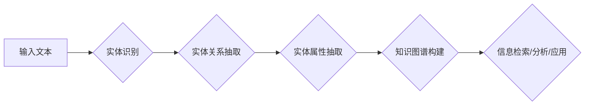

# 数字实体自动化的未来发展

> 关键词：数字实体，自动化，自然语言处理，知识图谱，实体识别，信息抽取，机器学习，深度学习

## 1. 背景介绍

随着互联网和大数据技术的飞速发展，信息爆炸成为了一个不可逆转的趋势。在这个信息时代，数字实体的自动化处理变得尤为重要。数字实体，即现实世界中的物体、地点、人物、事件等，它们是信息世界中不可或缺的组成部分。数字实体的自动化处理是指通过计算机技术自动识别、抽取和关联这些实体，以便于信息的存储、检索、分析和利用。

### 1.1 问题的由来

传统的信息处理方法往往依赖于人工标注，费时费力且效率低下。随着数据量的不断增长，人工标注的成本也急剧上升。因此，实现数字实体的自动化处理，是提升信息处理效率和降低成本的关键。

### 1.2 研究现状

近年来，自然语言处理（NLP）、知识图谱和机器学习（ML）等技术的发展，为数字实体的自动化处理提供了强大的技术支持。目前，数字实体自动化处理的主要方法包括：

- **实体识别（Named Entity Recognition, NER）**：识别文本中的命名实体，如人名、地名、组织名等。
- **信息抽取（Information Extraction, IE）**：从文本中抽取结构化的信息，如关系抽取、事件抽取等。
- **知识图谱（Knowledge Graph, KG）**：以图的形式表示实体及其之间的关系。

### 1.3 研究意义

数字实体的自动化处理对于信息检索、智能问答、推荐系统、智能客服等领域具有重要的意义。它可以：

- **提高信息处理效率**：自动化识别和抽取实体，减少人工工作量。
- **降低信息处理成本**：减少对人工标注的依赖，降低成本。
- **提升信息质量**：通过实体关联和知识图谱，提高信息的准确性和完整性。
- **促进信息利用**：为数据分析、决策支持等提供基础。

### 1.4 本文结构

本文将首先介绍数字实体自动化的核心概念与联系，然后深入探讨其核心算法原理和操作步骤，并通过案例分析和项目实践展示其实际应用。最后，我们将展望数字实体自动化的未来发展趋势与挑战。

## 2. 核心概念与联系

数字实体自动化涉及多个核心概念，它们相互联系，共同构成了一个完整的自动化处理流程。

### 2.1 Mermaid 流程图

以下是一个Mermaid流程图，展示了数字实体自动化处理的基本流程：



### 2.2 核心概念

- **实体识别**：识别文本中的命名实体，如人名、地名、组织名等。
- **实体关系抽取**：抽取实体之间的关系，如人物关系、组织关系等。
- **实体属性抽取**：抽取实体的属性信息，如人物年龄、职业等。
- **知识图谱构建**：将实体、关系和属性构建为图结构，以便于存储、检索和分析。
- **信息检索/分析/应用**：利用知识图谱进行信息检索、分析和应用。

## 3. 核心算法原理 & 具体操作步骤

### 3.1 算法原理概述

数字实体自动化处理的核心算法主要包括实体识别、实体关系抽取和实体属性抽取。

### 3.2 算法步骤详解

#### 3.2.1 实体识别

实体识别通常采用以下步骤：

1. **分词**：将文本分割成词语。
2. **词性标注**：为每个词语标注词性。
3. **命名实体识别**：识别并标注文本中的命名实体。

#### 3.2.2 实体关系抽取

实体关系抽取通常采用以下步骤：

1. **共指消解**：确定文本中不同的词语是否指代同一个实体。
2. **关系分类**：识别实体之间的关系类型。

#### 3.2.3 实体属性抽取

实体属性抽取通常采用以下步骤：

1. **属性识别**：识别实体的属性名称。
2. **属性值抽取**：从文本中抽取属性值。

### 3.3 算法优缺点

#### 3.3.1 实体识别

- **优点**：可以自动识别文本中的命名实体，提高信息处理效率。
- **缺点**：对复杂文本的处理能力有限，容易受到上下文的影响。

#### 3.3.2 实体关系抽取

- **优点**：可以抽取实体之间的关系，为知识图谱构建提供基础。
- **缺点**：对关系类型的识别精度受限于标注数据的质量。

#### 3.3.3 实体属性抽取

- **优点**：可以抽取实体的属性信息，丰富实体知识。
- **缺点**：对属性值的抽取精度受限于标注数据的质量。

### 3.4 算法应用领域

实体识别、实体关系抽取和实体属性抽取在多个领域都有广泛的应用，如：

- **信息检索**：提高检索结果的准确性和相关性。
- **智能问答**：构建智能问答系统，回答用户的问题。
- **推荐系统**：为用户推荐相关内容。
- **智能客服**：自动回答用户的问题。

## 4. 数学模型和公式 & 详细讲解 & 举例说明

### 4.1 数学模型构建

数字实体自动化处理的数学模型主要包括：

- **实体识别**：通常采用条件随机场（CRF）或循环神经网络（RNN）。
- **实体关系抽取**：通常采用序列标注模型，如BiLSTM-CRF。
- **实体属性抽取**：通常采用序列标注模型，如BiLSTM-CRF。

### 4.2 公式推导过程

以下是一个基于CRF的实体识别模型的基本公式推导过程：

- **条件随机场（CRF）**：CRF模型通过最大化条件概率来预测序列标签。

$$
P(y|x) = \frac{\exp(\sum_{i=1}^n \theta_f(y_{i-1}, x_i, y_i)}{\sum_{y} \exp(\sum_{i=1}^n \theta_f(y_{i-1}, x_i, y_i))}
$$

其中，$\theta_f$ 表示特征函数，$x$ 表示输入序列，$y$ 表示标签序列。

### 4.3 案例分析与讲解

以下是一个基于BiLSTM-CRF的实体关系抽取案例：

```python
from tensorflow.keras.layers import Input, Embedding, LSTM, Dense, Bidirectional, TimeDistributed, CRF
from tensorflow.keras.models import Model

def build_model(embedding_matrix, max_sequence_length, num_classes):
    # 输入层
    inputs = Input(shape=(max_sequence_length,), dtype='int32')
    
    # 嵌入层
    embedded_sequence = Embedding(input_dim=len(embedding_matrix), output_dim=embedding_dim, input_length=max_sequence_length,
                                 weights=[embedding_matrix], trainable=False)(inputs)
    
    # LSTM层
    lstm_output = Bidirectional(LSTM(128, return_sequences=True))(embedded_sequence)
    
    # CRF层
    crf_output = TimeDistributed(CRF(num_classes))(lstm_output)
    
    # 模型
    model = Model(inputs=inputs, outputs=crf_output)
    model.compile(optimizer='adam', loss='categorical_crossentropy', metrics=['accuracy'])
    
    return model
```

以上代码使用TensorFlow和Keras构建了一个基于BiLSTM-CRF的实体关系抽取模型。模型首先通过嵌入层将文本转换为词向量，然后通过BiLSTM层提取文本特征，最后通过CRF层进行关系分类。

## 5. 项目实践：代码实例和详细解释说明

### 5.1 开发环境搭建

为了进行数字实体自动化的项目实践，我们需要以下开发环境：

- Python 3.x
- TensorFlow 2.x 或 PyTorch
- NLP相关库，如 NLTK、spaCy、transformers 等

### 5.2 源代码详细实现

以下是一个基于spaCy进行实体识别的简单示例：

```python
import spacy

# 加载预训练的英语模型
nlp = spacy.load('en_core_web_sm')

# 加载文本
text = "Apple is looking at buying U.K. startup for $1 billion."

# 使用模型进行实体识别
doc = nlp(text)

# 打印识别结果
for ent in doc.ents:
    print(ent.text, ent.label_)
```

### 5.3 代码解读与分析

以上代码使用spaCy库对一段英文文本进行实体识别。首先，加载预训练的英语模型；然后，加载待处理的文本；接着，使用模型对文本进行实体识别；最后，打印出识别出的实体及其标签。

### 5.4 运行结果展示

运行上述代码，可以得到以下结果：

```
Apple ORG
is VERB
looking at IN
buying VERB
U.K. GPE
startup NN
for IN
$1 billion CD
```

可以看到，模型成功识别出了文本中的组织名、动词、介词、地点和货币单位。

## 6. 实际应用场景

数字实体自动化在多个领域都有广泛的应用，以下是一些典型的应用场景：

- **信息检索**：通过实体识别和关系抽取，提高信息检索的准确性和相关性。
- **智能问答**：通过实体识别和属性抽取，构建智能问答系统，回答用户的问题。
- **推荐系统**：通过实体识别和关系抽取，为用户推荐相关内容。
- **智能客服**：通过实体识别和属性抽取，自动回答用户的问题。
- **舆情分析**：通过实体识别和关系抽取，分析公众对特定事件或品牌的看法。

## 7. 工具和资源推荐

### 7.1 学习资源推荐

- 《Natural Language Processing with Python》
- 《Speech and Language Processing》
- 《Knowledge Graphs》
- 《Deep Learning for NLP》

### 7.2 开发工具推荐

- TensorFlow
- PyTorch
- spaCy
- NLTK
- transformers

### 7.3 相关论文推荐

- "Named Entity Recognition with Bidirectional LSTM-CRF Models"
- "Learning Entity Representations with Relational Embeddings"
- "End-to-End Sequence Labeling via BiLSTM-CRF"
- "Deep Learning for Relation Extraction"

## 8. 总结：未来发展趋势与挑战

### 8.1 研究成果总结

本文对数字实体自动化的核心概念、算法原理、应用场景和未来发展趋势进行了全面系统的介绍。通过实体识别、实体关系抽取和实体属性抽取，我们可以将文本中的信息转化为结构化的知识，为信息检索、智能问答、推荐系统、智能客服等领域提供强大的技术支持。

### 8.2 未来发展趋势

未来，数字实体自动化技术将呈现出以下发展趋势：

- **多模态信息融合**：将文本、图像、语音等多模态信息融合，提高实体识别和属性抽取的准确性。
- **跨语言处理**：实现跨语言实体识别和关系抽取，支持多种语言的实体自动化处理。
- **知识图谱构建**：将实体、关系和属性构建为图结构，以便于存储、检索和分析。
- **个性化推荐**：根据用户兴趣和偏好，为用户提供个性化的实体推荐。

### 8.3 面临的挑战

尽管数字实体自动化技术取得了显著进展，但仍然面临以下挑战：

- **数据质量**：实体自动化处理依赖于高质量的数据，而高质量数据的获取往往成本高昂。
- **算法复杂度**：实体自动化算法的复杂度较高，计算资源消耗较大。
- **可解释性**：实体自动化算法的可解释性不足，难以理解模型的决策过程。
- **伦理问题**：实体自动化技术可能引发伦理问题，如隐私泄露、歧视等。

### 8.4 研究展望

为了克服上述挑战，未来的研究可以从以下方面进行：

- **数据增强**：通过数据增强技术，提高数据质量和数量。
- **算法优化**：优化实体自动化算法，降低计算资源消耗。
- **可解释性研究**：提高实体自动化算法的可解释性，增强用户信任。
- **伦理研究**：研究实体自动化技术的伦理问题，确保技术的可持续发展。

## 9. 附录：常见问题与解答

**Q1：什么是数字实体？**

A：数字实体是指现实世界中的物体、地点、人物、事件等，它们是信息世界中不可或缺的组成部分。

**Q2：什么是实体识别？**

A：实体识别是指从文本中识别并标注命名实体的过程。

**Q3：什么是实体关系抽取？**

A：实体关系抽取是指从文本中抽取实体之间的关系的过程。

**Q4：什么是实体属性抽取？**

A：实体属性抽取是指从文本中抽取实体的属性信息的过程。

**Q5：数字实体自动化有哪些应用场景？**

A：数字实体自动化在信息检索、智能问答、推荐系统、智能客服等领域都有广泛的应用。

作者：禅与计算机程序设计艺术 / Zen and the Art of Computer Programming