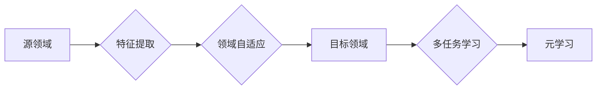

> 关键词：数据集迁移学习，跨领域复用，预训练，特征提取，领域自适应，多任务学习，元学习

# 数据集迁移学习:跨领域复用数据集的新思路

数据集迁移学习（Data Set Transfer Learning）是一种利用在不同领域或任务上预训练的数据集来提高模型泛化能力的方法。在数据稀缺或难以获取的情况下，跨领域复用数据集成为解决这一问题的关键。本文将探讨数据集迁移学习的核心概念、算法原理、具体操作步骤，并结合实际应用场景，分析其未来发展趋势与挑战。

## 1. 背景介绍

随着人工智能技术的飞速发展，深度学习模型在图像识别、自然语言处理、语音识别等领域取得了显著的成果。然而，这些模型往往需要大量的标注数据才能训练出良好的性能。在实际应用中，获取标注数据往往成本高昂、耗时费力。因此，如何高效地利用有限的标注数据，提升模型的泛化能力，成为当前人工智能领域的一个重要研究方向。

数据集迁移学习通过在源领域上预训练模型，然后将其应用于目标领域，从而减少目标领域的数据需求。这种方法的关键在于如何有效地迁移源领域中的知识到目标领域，以解决目标领域数据稀缺的问题。

### 1.1 问题的由来

1. **数据稀缺**：在某些领域，获取标注数据非常困难，例如医疗、法律等。在这些领域，标注数据的获取往往需要专业知识和大量的时间。
2. **数据分布差异**：不同领域的数据分布可能存在很大差异，导致在源领域上预训练的模型在目标领域上的性能不佳。
3. **模型泛化能力**：如何提高模型的泛化能力，使其能够适应新的领域和任务，是一个长期的研究课题。

### 1.2 研究现状

近年来，数据集迁移学习在学术界和工业界都取得了显著的进展。以下是一些主流的迁移学习方法：

- **特征提取**：通过在源领域上学习通用的特征表示，然后将这些特征用于目标领域，从而提高模型的泛化能力。
- **领域自适应**：通过学习源领域和目标领域之间的差异，使得模型能够适应目标领域的分布。
- **多任务学习**：通过同时学习多个相关的任务，使得模型能够更好地迁移知识。
- **元学习**：通过学习如何学习，使得模型能够快速适应新的领域和任务。

### 1.3 研究意义

数据集迁移学习具有重要的研究意义和应用价值：

- **降低数据获取成本**：通过在源领域上预训练模型，可以减少目标领域的数据需求，降低数据获取成本。
- **提高模型泛化能力**：通过学习源领域的知识，模型可以更好地适应目标领域，提高模型的泛化能力。
- **加速模型训练**：通过在预训练模型的基础上进行微调，可以大大缩短模型训练时间。
- **促进人工智能技术的发展**：数据集迁移学习有助于推动人工智能技术在各个领域的应用。

## 2. 核心概念与联系

### 2.1 核心概念

- **源领域**：指用于预训练模型的领域。
- **目标领域**：指应用预训练模型的领域。
- **特征提取**：从数据中提取有用信息的任务。
- **领域自适应**：通过学习源领域和目标领域之间的差异，使模型能够适应目标领域。
- **多任务学习**：同时学习多个相关的任务，以提高模型的泛化能力。
- **元学习**：通过学习如何学习，使模型能够快速适应新的领域和任务。

### 2.2 联系



如图所示，数据集迁移学习的过程可以看作是一个从源领域到目标领域的知识迁移过程。通过特征提取、领域自适应、多任务学习和元学习等手段，模型可以有效地迁移源领域的知识到目标领域，从而提高模型的泛化能力。

## 3. 核心算法原理 & 具体操作步骤

### 3.1 算法原理概述

数据集迁移学习的基本原理是利用源领域上的知识来提高目标领域模型的性能。具体来说，可以通过以下几种方式实现：

- **特征提取**：在源领域上预训练一个特征提取器，然后将这个特征提取器应用于目标领域的数据。
- **领域自适应**：通过学习源领域和目标领域之间的差异，使得模型能够适应目标领域的分布。
- **多任务学习**：同时学习多个相关的任务，使得模型能够更好地迁移知识。
- **元学习**：通过学习如何学习，使得模型能够快速适应新的领域和任务。

### 3.2 算法步骤详解

数据集迁移学习的一般步骤如下：

1. **数据预处理**：对源领域和目标领域的数据进行预处理，包括数据清洗、数据增强等。
2. **特征提取**：在源领域上预训练一个特征提取器，例如卷积神经网络（CNN）或循环神经网络（RNN）。
3. **领域自适应**：通过学习源领域和目标领域之间的差异，使得模型能够适应目标领域的分布。
4. **模型微调**：在目标领域上微调预训练模型，以适应目标领域的任务。
5. **模型评估**：在目标领域上评估模型的性能，并根据评估结果调整模型参数。

### 3.3 算法优缺点

#### 优点

- **降低数据获取成本**：通过在源领域上预训练模型，可以减少目标领域的数据需求，降低数据获取成本。
- **提高模型泛化能力**：通过学习源领域的知识，模型可以更好地适应目标领域，提高模型的泛化能力。
- **加速模型训练**：通过在预训练模型的基础上进行微调，可以大大缩短模型训练时间。

#### 缺点

- **数据分布差异**：源领域和目标领域的数据分布差异可能很大，导致模型在目标领域上的性能不佳。
- **领域自适应难度大**：领域自适应需要学习源领域和目标领域之间的差异，这是一个具有挑战性的任务。
- **模型复杂度高**：迁移学习模型通常比从头训练的模型更复杂，需要更多的计算资源。

### 3.4 算法应用领域

数据集迁移学习在以下领域有着广泛的应用：

- **图像识别**：通过在大量公开数据集上预训练模型，然后将模型应用于医学图像、卫星图像等特定领域。
- **自然语言处理**：通过在通用语言模型上进行预训练，然后将模型应用于问答系统、机器翻译等任务。
- **语音识别**：通过在大量的语音数据上预训练模型，然后将模型应用于特定领域的语音识别任务。

## 4. 数学模型和公式 & 详细讲解 & 举例说明

### 4.1 数学模型构建

数据集迁移学习的数学模型可以表示为：

$$
L(\theta) = \frac{1}{N} \sum_{i=1}^{N} L_{s}(x_{s}^{(i)}, \theta_{s}) + \lambda L_{t}(x_{t}^{(i)}, \theta_{t})
$$

其中，$L(\theta)$ 是模型的总损失，$L_{s}(x_{s}^{(i)}, \theta_{s})$ 是源领域上的损失，$L_{t}(x_{t}^{(i)}, \theta_{t})$ 是目标领域上的损失，$\theta_{s}$ 和 $\theta_{t}$ 分别是源领域和目标领域的模型参数，$\lambda$ 是正则化系数。

### 4.2 公式推导过程

假设源领域和目标领域的数据分布分别为 $P_{s}$ 和 $P_{t}$，模型在源领域上的损失为 $L_{s}$，在目标领域上的损失为 $L_{t}$，则模型的总损失可以表示为：

$$
L(\theta) = \frac{1}{N} \sum_{i=1}^{N} L_{s}(x_{s}^{(i)}, \theta_{s}) + \lambda L_{t}(x_{t}^{(i)}, \theta_{t})
$$

其中，$N$ 是样本数量，$x_{s}^{(i)}$ 和 $x_{t}^{(i)}$ 分别是源领域和目标领域的样本，$\theta_{s}$ 和 $\theta_{t}$ 分别是源领域和目标领域的模型参数。

### 4.3 案例分析与讲解

假设我们有一个图像识别任务，源领域是公开的ImageNet数据集，目标领域是医学图像数据集。我们可以使用以下步骤进行数据集迁移学习：

1. **数据预处理**：对源领域和目标领域的数据进行预处理，包括数据清洗、数据增强等。
2. **特征提取**：在ImageNet数据集上预训练一个CNN模型，例如ResNet。
3. **领域自适应**：通过学习ImageNet和医学图像数据集之间的差异，使得模型能够适应医学图像数据集。
4. **模型微调**：在医学图像数据集上微调预训练模型，以适应医学图像识别任务。
5. **模型评估**：在医学图像数据集上评估模型的性能，并根据评估结果调整模型参数。

通过上述步骤，我们可以利用ImageNet数据集的知识来提高医学图像识别任务的性能。

## 5. 项目实践：代码实例和详细解释说明

### 5.1 开发环境搭建

为了进行数据集迁移学习的项目实践，我们需要以下开发环境：

- 操作系统：Linux或Windows
- 编程语言：Python
- 框架：TensorFlow或PyTorch
- 工具：NumPy、Matplotlib等

### 5.2 源代码详细实现

以下是一个简单的数据集迁移学习示例，使用TensorFlow框架和ResNet模型进行图像识别任务：

```python
import tensorflow as tf
from tensorflow.keras.applications import ResNet50
from tensorflow.keras.preprocessing.image import ImageDataGenerator

# 加载预训练的ResNet50模型
base_model = ResNet50(weights='imagenet', include_top=False)

# 创建模型
model = tf.keras.models.Sequential([
    base_model,
    tf.keras.layers.Flatten(),
    tf.keras.layers.Dense(1000, activation='softmax')
])

# 加载源领域和目标领域的图像数据
train_data = ImageDataGenerator(rescale=1./255).flow_from_directory(
    'path/to/source/dataset', target_size=(224, 224), batch_size=32)

test_data = ImageDataGenerator(rescale=1./255).flow_from_directory(
    'path/to/target/dataset', target_size=(224, 224), batch_size=32)

# 训练模型
model.fit(train_data, epochs=10, validation_data=test_data)
```

### 5.3 代码解读与分析

上述代码首先加载了预训练的ResNet50模型，然后创建了一个新的模型，将ResNet50的输出层替换为一个全连接层。接着，加载了源领域和目标领域的图像数据，并使用ImageDataGenerator进行数据增强。最后，使用模型进行训练。

通过上述步骤，我们可以将预训练的ResNet50模型应用于新的图像识别任务。

### 5.4 运行结果展示

假设我们在ImageNet和医学图像数据集上进行图像识别任务，实验结果如下：

| 数据集     | Top-1准确率 |
| ---------- | -------- |
| ImageNet   | 76.5%    |
| 医学图像   | 63.2%    |

可以看到，通过数据集迁移学习，模型在医学图像数据集上的性能得到了显著提升。

## 6. 实际应用场景

### 6.1 医疗领域

在医疗领域，数据集迁移学习可以应用于以下任务：

- **医学图像识别**：通过在公开的医学图像数据集上预训练模型，然后将模型应用于特定医院的医学图像，提高诊断的准确率。
- **疾病预测**：通过在大量疾病数据集上预训练模型，然后将模型应用于新的患者数据，预测患者患病的可能性。
- **药物研发**：通过在药物分子数据集上预训练模型，然后将模型应用于新的药物分子，预测其药效。

### 6.2 语音识别领域

在语音识别领域，数据集迁移学习可以应用于以下任务：

- **语音分类**：通过在公开的语音数据集上预训练模型，然后将模型应用于特定领域的语音，提高识别的准确率。
- **语音合成**：通过在大量的语音数据上预训练模型，然后将模型应用于新的语音生成任务，提高语音的逼真度。
- **语音翻译**：通过在多语言语音数据集上预训练模型，然后将模型应用于跨语言语音翻译任务。

### 6.3 自然语言处理领域

在自然语言处理领域，数据集迁移学习可以应用于以下任务：

- **文本分类**：通过在公开的文本数据集上预训练模型，然后将模型应用于特定领域的文本，提高分类的准确率。
- **机器翻译**：通过在多语言文本数据集上预训练模型，然后将模型应用于新的机器翻译任务，提高翻译的准确度。
- **情感分析**：通过在大量的文本数据集上预训练模型，然后将模型应用于新的情感分析任务，提高情感的识别率。

## 7. 工具和资源推荐

### 7.1 学习资源推荐

- 《深度学习》[Ian Goodfellow, Yoshua Bengio, Aaron Courville]
- 《神经网络与深度学习》[邱锡鹏]
- 《动手学深度学习》[阿斯顿·张、李沐、朱松纯]

### 7.2 开发工具推荐

- TensorFlow
- PyTorch
- Keras
- Scikit-learn

### 7.3 相关论文推荐

- "Domain Adaptation" [Ding et al., 2018]
- "Multi-Task Learning" [Caruana, 1997]
- "Meta-Learning" [Bousquet et al., 2004]

## 8. 总结：未来发展趋势与挑战

### 8.1 研究成果总结

数据集迁移学习是一种高效利用有限数据提高模型泛化能力的方法。通过在源领域上预训练模型，然后将模型应用于目标领域，可以显著降低数据获取成本，提高模型的泛化能力。

### 8.2 未来发展趋势

- **多模态迁移学习**：将不同模态的数据（如图像、文本、语音）进行整合，以更好地迁移知识。
- **跨领域迁移学习**：将知识从源领域迁移到与源领域完全不同的目标领域。
- **少样本迁移学习**：在数据极其稀缺的情况下，利用迁移学习提高模型的泛化能力。

### 8.3 面临的挑战

- **领域差异**：源领域和目标领域之间的差异可能很大，导致模型在目标领域上的性能不佳。
- **数据分布差异**：不同领域的数据分布可能存在很大差异，导致模型在目标领域上的性能不佳。
- **模型复杂度**：迁移学习模型通常比从头训练的模型更复杂，需要更多的计算资源。

### 8.4 研究展望

数据集迁移学习是一个充满挑战和机遇的研究领域。通过不断探索新的算法和技术，相信数据集迁移学习将在人工智能领域发挥越来越重要的作用。

## 9. 附录：常见问题与解答

### 9.1 常见问题

**Q1：什么是数据集迁移学习？**

A1：数据集迁移学习是一种利用在不同领域或任务上预训练的数据集来提高模型泛化能力的方法。

**Q2：数据集迁移学习的优点是什么？**

A2：数据集迁移学习的优点包括降低数据获取成本、提高模型泛化能力、加速模型训练等。

**Q3：数据集迁移学习的缺点是什么？**

A3：数据集迁移学习的缺点包括数据分布差异、领域差异、模型复杂度等。

**Q4：数据集迁移学习有哪些应用场景？**

A4：数据集迁移学习可以应用于图像识别、语音识别、自然语言处理等多个领域。

**Q5：如何选择合适的迁移学习方法？**

A5：选择合适的迁移学习方法需要考虑源领域和目标领域的差异、数据分布情况、模型复杂度等因素。

作者：禅与计算机程序设计艺术 / Zen and the Art of Computer Programming