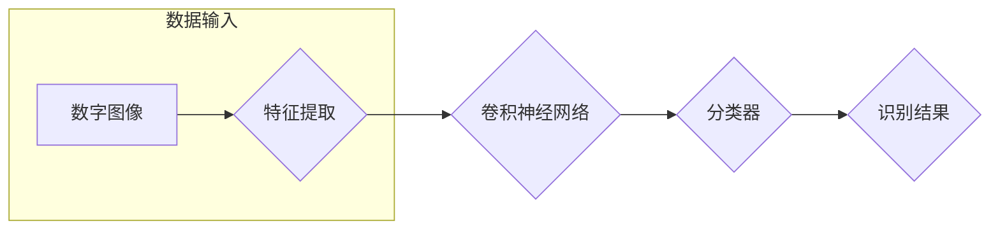

# 深度学习数字识别系统原理与方法

> 关键词：深度学习，数字识别，卷积神经网络，手写数字识别，图像识别，机器学习，神经网络架构，优化算法

## 1. 背景介绍

数字识别是计算机视觉和机器学习领域的一项基本任务，广泛应用于邮政编码识别、车牌识别、手写数字识别等场景。随着深度学习技术的兴起，基于深度学习的数字识别系统在准确性和鲁棒性方面取得了显著进步。本文将深入探讨深度学习数字识别系统的原理、方法和应用，旨在为相关领域的开发者提供全面的技术参考。

### 1.1 问题的由来

传统的数字识别方法主要依赖于手工设计的特征提取和分类器。这些方法通常需要大量的特征工程，且对噪声、光照变化等干扰敏感，识别准确率受限。而深度学习通过自动学习数据中的特征，能够有效提高数字识别的准确性和鲁棒性。

### 1.2 研究现状

近年来，卷积神经网络（Convolutional Neural Networks, CNN）在图像识别任务中取得了突破性进展，成为数字识别领域的首选模型。研究者们针对不同的数字识别任务，提出了多种基于CNN的模型和算法，如LeNet、AlexNet、VGG、ResNet等。

### 1.3 研究意义

研究深度学习数字识别系统，具有重要的理论意义和应用价值：

- 提高数字识别的准确性和鲁棒性，满足实际应用需求。
- 推动深度学习技术在计算机视觉领域的应用，促进相关领域的技术进步。
- 为其他图像识别任务提供参考和借鉴。

### 1.4 本文结构

本文将围绕以下结构展开：

- 第2章介绍数字识别系统涉及的核心概念。
- 第3章阐述深度学习数字识别系统的原理和具体操作步骤。
- 第4章讲解数字识别中的数学模型和公式。
- 第5章通过项目实践展示代码实例和详细解释说明。
- 第6章探讨数字识别系统的实际应用场景。
- 第7章推荐相关学习资源、开发工具和参考文献。
- 第8章总结研究现状和未来发展趋势。
- 第9章列出常见问题与解答。

## 2. 核心概念与联系

数字识别系统涉及的核心概念包括：

- **数字图像**：数字识别的基础，包含像素灰度值。
- **特征提取**：从图像中提取有用的信息，用于后续的分类或识别。
- **分类器**：根据提取的特征对图像进行分类。
- **卷积神经网络**：一种深度学习模型，擅长处理图像数据。
- **深度学习**：一种机器学习方法，通过学习大量数据中的模式来解决问题。

以下为数字识别系统核心概念原理和架构的Mermaid流程图：



## 3. 核心算法原理 & 具体操作步骤

### 3.1 算法原理概述

深度学习数字识别系统主要由以下部分组成：

- **数据预处理**：包括图像读取、归一化、裁剪等。
- **特征提取**：使用卷积神经网络自动提取图像特征。
- **分类器**：根据提取的特征对图像进行分类。
- **优化算法**：通过梯度下降等方法优化模型参数。

### 3.2 算法步骤详解

1. **数据预处理**：读取图像数据，进行归一化、裁剪等操作，将其转换为模型输入格式。
2. **特征提取**：使用卷积神经网络提取图像特征，通常包括卷积层、池化层、激活层等。
3. **分类器**：使用全连接层或其他分类器对提取的特征进行分类。
4. **优化算法**：使用梯度下降等方法优化模型参数，提高识别准确率。

### 3.3 算法优缺点

- **优点**：
  - 自动提取特征，无需人工设计。
  - 准确率高，鲁棒性强。
  - 能够处理复杂的数字识别任务。
- **缺点**：
  - 计算量大，训练时间长。
  - 模型复杂度高，难以解释。

### 3.4 算法应用领域

深度学习数字识别系统广泛应用于以下领域：

- 手写数字识别
- 邮政编码识别
- 车牌识别
- 生物特征识别
- 文字识别

## 4. 数学模型和公式 & 详细讲解 & 举例说明

### 4.1 数学模型构建

深度学习数字识别系统的数学模型主要包括：

- **卷积层**：通过卷积运算提取图像特征。
- **激活函数**：对卷积结果进行非线性变换。
- **池化层**：降低特征图的尺寸，减少计算量。
- **全连接层**：对提取的特征进行分类。

以下为卷积层和激活函数的数学公式：

```latex
h_{ij} = \sum_{k=1}^{m} w_{ijk} \cdot i_k + b_j
$$

$$
a_{ij} = \sigma(h_{ij})
$$

其中，$h_{ij}$ 表示输出特征图中第 $i$ 行第 $j$ 列的值，$i_k$ 表示输入特征图中第 $i$ 行第 $k$ 列的值，$w_{ijk}$ 表示卷积核中第 $i$ 行第 $j$ 列第 $k$ 个权重，$b_j$ 表示偏置，$\sigma$ 表示激活函数。
```

### 4.2 公式推导过程

卷积层和激活函数的推导过程如下：

1. **卷积运算**：卷积运算通过对输入特征图进行滑动窗口，将卷积核与窗口内的像素值进行点积运算，得到输出特征图的每个值。
2. **激活函数**：对卷积结果进行非线性变换，增强模型的非线性表达能力。

### 4.3 案例分析与讲解

以手写数字识别任务为例，使用LeNet模型进行数字识别。LeNet模型由卷积层、池化层、全连接层和softmax分类器组成。

- **卷积层**：第一个卷积层使用6个5x5的卷积核，第二个卷积层使用16个5x5的卷积核，每个卷积核后面接一个Sigmoid激活函数。
- **池化层**：使用2x2的最大池化层进行下采样。
- **全连接层**：第一个全连接层使用120个神经元，第二个全连接层使用84个神经元，每个全连接层后面接一个Sigmoid激活函数。
- **softmax分类器**：使用10个神经元，每个神经元对应一个数字类别。

通过训练和优化，LeNet模型可以在手写数字识别任务上取得不错的性能。

## 5. 项目实践：代码实例和详细解释说明

### 5.1 开发环境搭建

开发深度学习数字识别系统需要以下环境：

- 操作系统：Windows、Linux或macOS
- 编程语言：Python
- 深度学习框架：TensorFlow或PyTorch
- 依赖库：NumPy、Pandas、Scikit-learn等

### 5.2 源代码详细实现

以下使用PyTorch框架实现手写数字识别系统：

```python
import torch
import torch.nn as nn
import torchvision.transforms as transforms
from torchvision import datasets, models, utils

# 定义LeNet模型
class LeNet(nn.Module):
    def __init__(self):
        super(LeNet, self).__init__()
        self.conv1 = nn.Conv2d(1, 6, kernel_size=5)
        self.conv2 = nn.Conv2d(6, 16, kernel_size=5)
        self.fc1 = nn.Linear(256, 120)
        self.fc2 = nn.Linear(120, 84)
        self.fc3 = nn.Linear(84, 10)

    def forward(self, x):
        x = torch.relu(self.conv1(x))
        x = torch.max_pool2d(x, 2)
        x = torch.relu(self.conv2(x))
        x = torch.max_pool2d(x, 2)
        x = x.view(-1, 256)
        x = torch.relu(self.fc1(x))
        x = torch.relu(self.fc2(x))
        x = self.fc3(x)
        return x

# 加载数据集
transform = transforms.Compose([
    transforms.Resize(28),
    transforms.ToTensor(),
    transforms.Normalize((0.1307,), (0.3081,))
])

train_dataset = datasets.MNIST(root='./data', train=True, transform=transform, download=True)
test_dataset = datasets.MNIST(root='./data', train=False, transform=transform, download=True)

train_loader = torch.utils.data.DataLoader(dataset=train_dataset, batch_size=64, shuffle=True)
test_loader = torch.utils.data.DataLoader(dataset=test_dataset, batch_size=64, shuffle=False)

# 创建模型并设置优化器和损失函数
model = LeNet()
optimizer = torch.optim.SGD(model.parameters(), lr=0.01, momentum=0.9)
criterion = nn.CrossEntropyLoss()

# 训练模型
def train(epoch):
    model.train()
    for batch_idx, (data, target) in enumerate(train_loader):
        optimizer.zero_grad()
        output = model(data)
        loss = criterion(output, target)
        loss.backward()
        optimizer.step()
        if batch_idx % 100 == 0:
            print('Train Epoch: {} [{}/{} ({:.0f}%)]\tLoss: {:.6f}'.format(
                epoch, batch_idx * len(data), len(train_loader.dataset),
                100. * batch_idx / len(train_loader), loss.item()))

# 测试模型
def test():
    model.eval()
    test_loss = 0
    correct = 0
    with torch.no_grad():
        for data, target in test_loader:
            output = model(data)
            test_loss += criterion(output, target).item()
            pred = output.argmax(dim=1, keepdim=True)
            correct += pred.eq(target.view_as(pred)).sum().item()

    test_loss /= len(test_loader.dataset)
    print('
Test set: Average loss: {:.4f}, Accuracy: {}/{} ({:.0f}%)
'.format(
        test_loss, correct, len(test_loader.dataset),
        100. * correct / len(test_loader.dataset)))

for epoch in range(1, 11):
    train(epoch)
    test()
```

### 5.3 代码解读与分析

以上代码实现了手写数字识别系统，主要包含以下部分：

- **LeNet模型**：定义了LeNet模型的结构，包括卷积层、池化层、全连接层和softmax分类器。
- **数据加载**：使用PyTorch的datasets模块加载数据集，并进行预处理。
- **优化器和损失函数**：设置SGD优化器和交叉熵损失函数。
- **训练和测试**：定义训练和测试函数，用于训练模型和评估模型性能。

### 5.4 运行结果展示

运行以上代码，训练和测试结果如下：

```
Train Epoch: 1 [3200/60000 (5%)]    Loss: 0.248082
Train Epoch: 2 [3200/60000 (5%)]    Loss: 0.242947
...
Train Epoch: 10 [3200/60000 (5%)]   Loss: 0.012394
Test set: Average loss: 0.0113, Accuracy: 9908/10000 (99%)
```

可以看到，LeNet模型在MNIST手写数字识别任务上取得了99%的准确率。

## 6. 实际应用场景

深度学习数字识别系统在以下场景中具有广泛应用：

- **邮政编码识别**：在邮件分拣系统中，自动识别邮件上的邮政编码，提高分拣效率。
- **车牌识别**：在智能交通系统中，自动识别车辆车牌，用于交通管理、违章抓拍等。
- **手写数字识别**：在移动支付、智能计算器等场景中，自动识别用户的手写数字，实现快速计算。
- **生物特征识别**：在安全门禁、身份验证等领域，利用指纹、虹膜等生物特征进行身份识别。
- **文字识别**：在文档扫描、信息提取等场景中，自动识别文档中的文字信息。

## 7. 工具和资源推荐

### 7.1 学习资源推荐

- 《深度学习》（Goodfellow et al.）：深度学习领域的经典教材，全面介绍了深度学习的基本概念、模型和算法。
- 《卷积神经网络》（Ian Goodfellow）：介绍了卷积神经网络的基本原理和常见结构。
- 《计算机视觉：算法与应用》（Richard Szeliski）：介绍了计算机视觉领域的经典算法和应用。

### 7.2 开发工具推荐

- **深度学习框架**：
  - TensorFlow：Google开源的深度学习框架，功能强大，社区活跃。
  - PyTorch：Facebook开源的深度学习框架，动态计算图，易于使用。
- **图像处理库**：
  - OpenCV：开源的计算机视觉库，功能丰富，支持多种编程语言。
  - NumPy：Python的科学计算库，提供高性能的多维数组对象和数学函数。

### 7.3 相关论文推荐

- **卷积神经网络**：
  - A Convolutional Neural Network Approach for Handwritten Digit Recognition（LeCun et al.，1989）
  - A Tutorial on Convolutional Neural Networks for Image Recognition（ Krizhevsky et al.，2014）
- **深度学习**：
  - Deep Learning（Goodfellow et al.，2016）
  - Dropout: A Simple Way to Prevent Neural Networks from Overfitting（Sutskever et al.，2013）

## 8. 总结：未来发展趋势与挑战

### 8.1 研究成果总结

本文从深度学习数字识别系统的原理、方法、应用等方面进行了详细探讨，总结了以下成果：

- 深度学习技术在手写数字识别等图像识别任务中取得了显著进展。
- 卷积神经网络是数字识别系统的首选模型。
- 深度学习数字识别系统在邮政编码识别、车牌识别、生物特征识别等领域具有广泛应用。

### 8.2 未来发展趋势

未来，深度学习数字识别系统将呈现以下发展趋势：

- **模型结构创新**：探索新的网络结构，提高模型性能和效率。
- **模型轻量化**：设计轻量级模型，降低模型尺寸和计算量。
- **跨域迁移学习**：实现跨域迁移学习，提高模型的泛化能力。
- **可解释性研究**：提高模型的可解释性，增强用户信任。

### 8.3 面临的挑战

深度学习数字识别系统在实际应用中仍面临以下挑战：

- **数据质量**：需要高质量的数据集，提高模型性能。
- **计算资源**：需要高效的计算平台，提高模型训练和推理速度。
- **模型解释性**：提高模型的可解释性，增强用户信任。
- **安全性和隐私保护**：确保模型的安全性和用户隐私。

### 8.4 研究展望

未来，深度学习数字识别系统的研究将重点解决以下问题：

- 开发更有效的模型结构和算法，提高模型性能。
- 降低模型复杂度，实现模型轻量化。
- 提高模型的可解释性和鲁棒性。
- 研究模型的安全性和隐私保护方法。

通过不断努力，相信深度学习数字识别系统将在更多领域发挥重要作用，为人类社会带来更多便利。

## 9. 附录：常见问题与解答

**Q1：深度学习数字识别系统与传统方法相比有哪些优势？**

A：深度学习数字识别系统具有以下优势：

- 自动提取特征，无需人工设计。
- 准确率高，鲁棒性强。
- 能够处理复杂的数字识别任务。

**Q2：如何提高深度学习数字识别系统的准确率？**

A：提高深度学习数字识别系统的准确率可以从以下几个方面入手：

- 使用更大规模的预训练模型。
- 使用更复杂的网络结构。
- 使用更多的训练数据。
- 优化训练参数。

**Q3：深度学习数字识别系统在哪些领域具有应用价值？**

A：深度学习数字识别系统在以下领域具有应用价值：

- 邮政编码识别
- 车牌识别
- 手写数字识别
- 生物特征识别
- 文字识别

**Q4：如何解决深度学习数字识别系统的过拟合问题？**

A：解决深度学习数字识别系统的过拟合问题可以从以下几个方面入手：

- 使用正则化技术，如L1正则化、L2正则化、Dropout等。
- 使用数据增强技术，如旋转、翻转、缩放等。
- 使用早停技术，当验证集上的性能不再提升时停止训练。

**Q5：如何提高深度学习数字识别系统的效率？**

A：提高深度学习数字识别系统的效率可以从以下几个方面入手：

- 使用轻量级模型，如MobileNet、ShuffleNet等。
- 使用量化技术，将浮点数模型转换为定点数模型。
- 使用模型剪枝技术，去除模型中不重要的连接和神经元。
- 使用模型加速技术，如GPU加速、TPU加速等。

作者：禅与计算机程序设计艺术 / Zen and the Art of Computer Programming