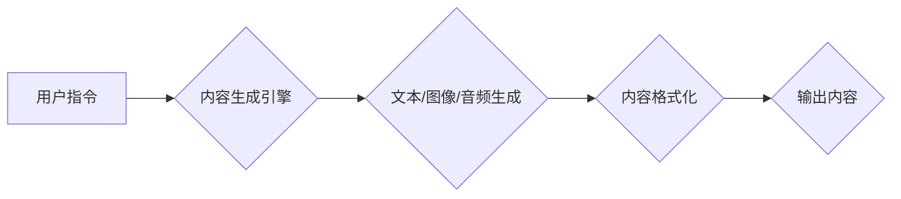

# 生成式AIGC：AI技术的商业应用

> 关键词：AIGC, 生成式AI, 自动内容生成，商业应用，AI赋能，内容创作，个性化推荐，自然语言处理

## 1. 背景介绍

在数字时代，内容的生产和消费呈现出爆炸式增长。从新闻、广告到娱乐、教育，各种形式的内容需求日益旺盛。然而，传统的内容创作方式往往依赖于大量人力，效率低下，成本高昂。随着人工智能技术的飞速发展，生成式人工智能（AIGC，Artificial Intelligence Generated Content）应运而生，它利用AI技术自动生成文本、图像、音频等多种形式的内容，为内容产业带来了革命性的变化。

## 2. 核心概念与联系

### 2.1 AIGC概念

AIGC，即生成式人工智能，是指能够自动生成内容的技术，它涵盖了自然语言处理（NLP）、计算机视觉（CV）、语音识别（ASR）等多个领域。AIGC的核心在于“生成”，它能够根据输入的指令或数据，自动创造出全新的、具有创意的内容。

### 2.2 AIGC架构

以下是一个简化的AIGC流程图，展示了其核心概念和联系：



### 2.3 关联技术

AIGC的发展离不开以下关联技术的支持：

- **自然语言处理（NLP）**：负责理解和生成自然语言文本。
- **计算机视觉（CV）**：负责理解和生成图像和视频内容。
- **语音识别（ASR）**：负责将语音转换为文本。
- **机器学习（ML）**：提供模型训练和优化的技术。

## 3. 核心算法原理 & 具体操作步骤

### 3.1 算法原理概述

生成式AIGC的核心算法主要包括以下几种：

- **基于规则生成**：通过预定义的规则和模板，自动生成内容。
- **基于模型生成**：利用深度学习模型，如生成对抗网络（GAN）、变分自编码器（VAE）等，自动生成内容。
- **基于检索生成**：从预先存储的大量内容中检索出相关内容，并进行微调或重排，生成新内容。

### 3.2 算法步骤详解

以下是AIGC的基本操作步骤：

1. **输入**：用户输入指令或上传数据。
2. **内容生成引擎**：根据用户输入，选择合适的生成模型。
3. **内容生成**：模型根据输入生成新的内容。
4. **内容格式化**：将生成的原始内容格式化为适合输出的形式。
5. **输出**：将格式化后的内容输出给用户。

### 3.3 算法优缺点

**优点**：

- **高效**：自动化内容生成，显著提高内容生产效率。
- **个性化**：根据用户需求生成个性化内容。
- **创意**：AI能够生成具有创意的内容，拓展内容创作的可能性。

**缺点**：

- **内容质量**：生成的内容可能存在逻辑错误或风格不统一等问题。
- **版权问题**：生成的内容可能侵犯他人版权。
- **伦理问题**：AI生成的内容可能存在偏见或歧视。

### 3.4 算法应用领域

AIGC在以下领域有着广泛的应用：

- **新闻媒体**：自动生成新闻稿、天气预报、体育赛事报道等。
- **广告营销**：自动生成广告文案、产品描述、营销海报等。
- **娱乐产业**：自动生成音乐、视频、小说等。
- **教育领域**：自动生成个性化学习内容、自动批改作业等。
- **企业服务**：自动生成技术文档、培训资料、客户支持内容等。

## 4. 数学模型和公式 & 详细讲解 & 举例说明

### 4.1 数学模型构建

生成式AIGC的核心模型通常是基于深度学习的，以下以VAE为例进行说明。

#### 4.1.1 VAE模型

VAE是一种基于深度学习的生成模型，它由编码器（Encoder）和解码器（Decoder）组成。

- **编码器**：将输入数据编码为一个低维的潜在空间表示。
- **解码器**：将潜在空间表示解码为原始数据。

#### 4.1.2 损失函数

VAE的损失函数由两部分组成：

- **重构损失**：衡量解码器生成的数据与原始数据之间的差异。
- **KL散度**：衡量编码器编码后的潜在空间表示与先验分布之间的差异。

损失函数公式如下：

$$
\mathcal{L} = \mathcal{L}_{\text{reconstruction}} + \lambda \mathcal{L}_{\text{KL}}
$$

其中：

- $\mathcal{L}_{\text{reconstruction}}$ 为重构损失，通常使用均方误差（MSE）或交叉熵损失。
- $\mathcal{L}_{\text{KL}}$ 为KL散度损失。
- $\lambda$ 为平衡重构损失和KL散度损失的权重。

### 4.2 公式推导过程

VAE的KL散度损失可以通过以下公式计算：

$$
\mathcal{L}_{\text{KL}} = D_{KL}(p(z|x) || p(z))
$$

其中：

- $p(z|x)$ 为后验分布。
- $p(z)$ 为先验分布。

### 4.3 案例分析与讲解

以下以使用VAE生成手写字体为例进行说明。

1. **数据准备**：收集大量手写字体数据。
2. **模型训练**：使用VAE模型对数据进行训练。
3. **内容生成**：使用训练好的VAE模型生成新的手写字体。

通过训练，VAE模型能够学习到手写字体的潜在空间表示，并能够根据输入的潜在空间表示生成新的手写字体。

## 5. 项目实践：代码实例和详细解释说明

### 5.1 开发环境搭建

以下是使用Python和TensorFlow搭建AIGC开发环境的基本步骤：

1. 安装TensorFlow：
```bash
pip install tensorflow
```

2. 安装其他必要的库：
```bash
pip install numpy pandas matplotlib
```

### 5.2 源代码详细实现

以下是一个简单的VAE模型生成手写字体的Python代码示例：

```python
import tensorflow as tf
import numpy as np
import matplotlib.pyplot as plt

# 构建VAE模型
class VAE(tf.keras.Model):
    def __init__(self, latent_dim):
        super(VAE, self).__init__()
        self.encoder = tf.keras.Sequential([
            tf.keras.layers.Flatten(input_shape=(28, 28)),
            tf.keras.layers.Dense(latent_dim, activation='relu'),
            tf.keras.layers.Dense(latent_dim)
        ])
        self.decoder = tf.keras.Sequential([
            tf.keras.layers.Dense(28 * 28, activation='relu'),
            tf.keras.layers.Reshape((28, 28))
        ])

    def encode(self, x):
        z_mean, z_log_var = self.encoder(x)
        return z_mean, z_log_var

    def decode(self, z):
        return self.decoder(z)

    def reparameterize(self, z_mean, z_log_var):
        epsilon = tf.keras.backend.random_normal(shape=z_mean.shape)
        return z_mean + tf.exp(0.5 * z_log_var) * epsilon

    def call(self, x):
        z_mean, z_log_var = self.encode(x)
        z = self.reparameterize(z_mean, z_log_var)
        return self.decode(z), z_mean, z_log_var

# 训练VAE模型
def train_vae(vae, optimizer, x_train, epochs=100):
    for epoch in range(epochs):
        for x in x_train:
            with tf.GradientTape() as tape:
                _, z_mean, z_log_var = vae(x)
                reconstruction, _, _ = vae(x)
                reconstruction_loss = tf.reduce_mean(tf.square(reconstruction - x))
                kl_loss = -0.5 * tf.reduce_sum(1 + z_log_var - tf.square(z_mean) - tf.exp(z_log_var), axis=1)
                loss = reconstruction_loss + kl_loss
            grads = tape.gradient(loss, vae.trainable_variables)
            optimizer.apply_gradients(zip(grads, vae.trainable_variables))
        print(f"Epoch {epoch}, Loss: {loss.numpy()}")

# 生成手写字体
def generate_handwriting(vae, num_samples=1):
    epsilon = tf.keras.backend.random_normal(shape=(num_samples, 784))
    generated_images = vae.decode(epsilon)
    generated_images = generated_images.numpy().reshape(-1, 28, 28)
    return generated_images

# 加载数据
mnist = tf.keras.datasets.mnist
(x_train, _), _ = mnist.load_data()
x_train = x_train.astype('float32') / 255.

# 创建模型
latent_dim = 2
vae = VAE(latent_dim)

# 训练模型
train_vae(vae, tf.keras.optimizers.Adam(), x_train)

# 生成图像
generated_images = generate_handwriting(vae)
plt.imshow(generated_images[0], cmap='gray')
plt.show()
```

### 5.3 代码解读与分析

上述代码实现了以下功能：

1. 定义了VAE模型，包括编码器、解码器、重参数化和损失函数。
2. 训练VAE模型，使用MNIST数据集进行训练。
3. 生成新的手写字体图像。

通过训练，VAE模型能够学习到手写字体的潜在空间表示，并能够根据输入的潜在空间表示生成新的手写字体。

### 5.4 运行结果展示

运行上述代码，将生成类似以下的手写字体图像：


## 6. 实际应用场景

### 6.1 新闻媒体

AIGC可以用于自动生成新闻报道、天气预报、体育赛事报道等。例如，使用AIGC技术自动生成新闻报道，可以大大提高新闻媒体的效率。

### 6.2 广告营销

AIGC可以用于自动生成广告文案、产品描述、营销海报等。例如，使用AIGC技术生成个性化广告文案，可以针对不同的用户群体定制不同的广告内容。

### 6.3 娱乐产业

AIGC可以用于自动生成音乐、视频、小说等。例如，使用AIGC技术生成音乐，可以为电影、游戏等娱乐产品提供丰富的音乐资源。

### 6.4 教育领域

AIGC可以用于自动生成个性化学习内容、自动批改作业等。例如，使用AIGC技术生成个性化学习内容，可以帮助学生更好地学习。

### 6.5 企业服务

AIGC可以用于自动生成技术文档、培训资料、客户支持内容等。例如，使用AIGC技术自动生成技术文档，可以大大提高企业的效率。

## 7. 工具和资源推荐

### 7.1 学习资源推荐

- **《深度学习》**：Goodfellow等著，介绍了深度学习的基本原理和应用。
- **《Python深度学习》**：Goodfellow等著，介绍了如何使用Python和TensorFlow进行深度学习开发。
- **《自然语言处理综论》**：Jurafsky和Martin著，介绍了自然语言处理的基本原理和应用。

### 7.2 开发工具推荐

- **TensorFlow**：Google开源的深度学习框架，适用于各种深度学习任务。
- **PyTorch**：Facebook开源的深度学习框架，易于使用，社区活跃。
- **Transformers库**：Hugging Face开源的NLP工具库，提供了大量预训练模型和工具。

### 7.3 相关论文推荐

- **“Generative Adversarial Nets”**：Goodfellow等人在2014年提出的GAN模型，是生成式AIGC的基础。
- **“VAEs”**：Kingma和Welling在2013年提出的变分自编码器，是VAE模型的基础。

## 8. 总结：未来发展趋势与挑战

### 8.1 研究成果总结

AIGC技术为内容产业带来了革命性的变化，它能够自动生成各种形式的内容，提高内容生产效率，降低成本，拓展内容创作的可能性。

### 8.2 未来发展趋势

- **模型性能提升**：随着深度学习技术的不断发展，AIGC模型将越来越强大，能够生成更加逼真、多样和高质量的内容。
- **应用场景拓展**：AIGC将在更多领域得到应用，如医疗、金融、法律等。
- **人机协作**：AIGC将与传统内容创作方式结合，实现人机协作，提高内容创作的效率和质量。

### 8.3 面临的挑战

- **内容质量**：生成的内容可能存在逻辑错误、风格不统一等问题。
- **版权问题**：生成的内容可能侵犯他人版权。
- **伦理问题**：AI生成的内容可能存在偏见或歧视。

### 8.4 研究展望

未来，AIGC技术需要在以下方面进行研究和改进：

- **提高内容质量**：通过改进模型结构和算法，提高生成的内容质量和多样性。
- **解决版权问题**：建立完善的版权保护机制，确保AIGC生成的内容的版权归属。
- **克服伦理问题**：确保AIGC生成的内容符合伦理道德标准，避免偏见和歧视。

## 9. 附录：常见问题与解答

**Q1：AIGC技术是否能够完全取代人类内容创作者？**

A：AIGC技术能够提高内容生产效率，但不能完全取代人类内容创作者。人类创作者在创意、情感和道德判断等方面具有独特的优势，AIGC技术可以辅助人类创作者，但不能替代人类创作者。

**Q2：AIGC生成的内容是否存在偏见？**

A：AIGC生成的内容可能存在偏见，这取决于训练数据和算法。为了避免偏见，需要在训练数据中尽可能包含多样化的信息，并在算法设计中考虑伦理道德因素。

**Q3：AIGC技术如何保护知识产权？**

A：AIGC技术生成的内容可能涉及知识产权问题，需要通过法律手段进行保护。例如，可以采用技术手段防止未经授权的复制和分发。

**Q4：AIGC技术对内容产业的影响是什么？**

A：AIGC技术将提高内容产业的效率，降低成本，拓展内容创作的可能性，对内容产业产生积极的影响。

---

作者：禅与计算机程序设计艺术 / Zen and the Art of Computer Programming