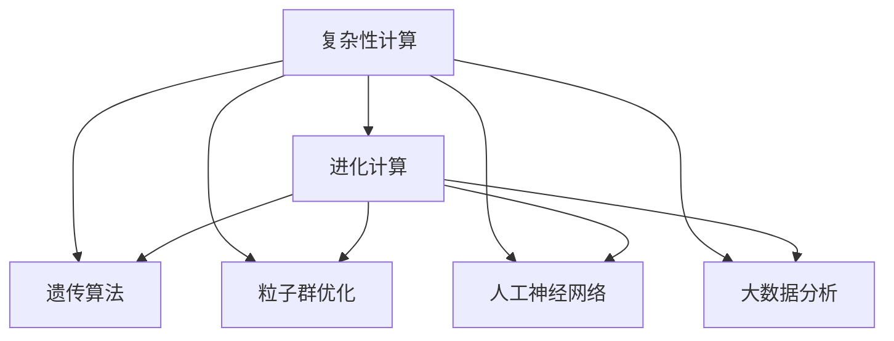
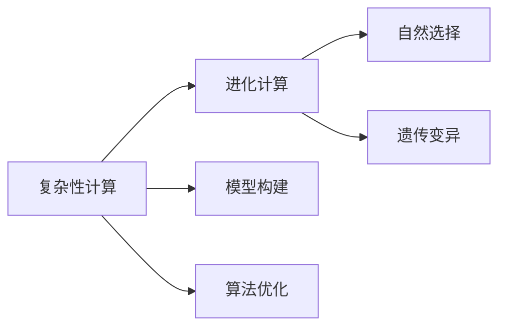
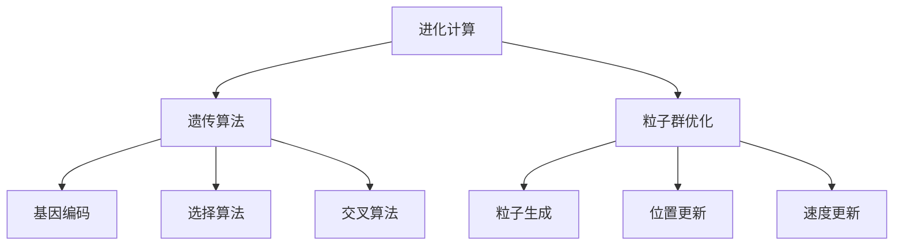
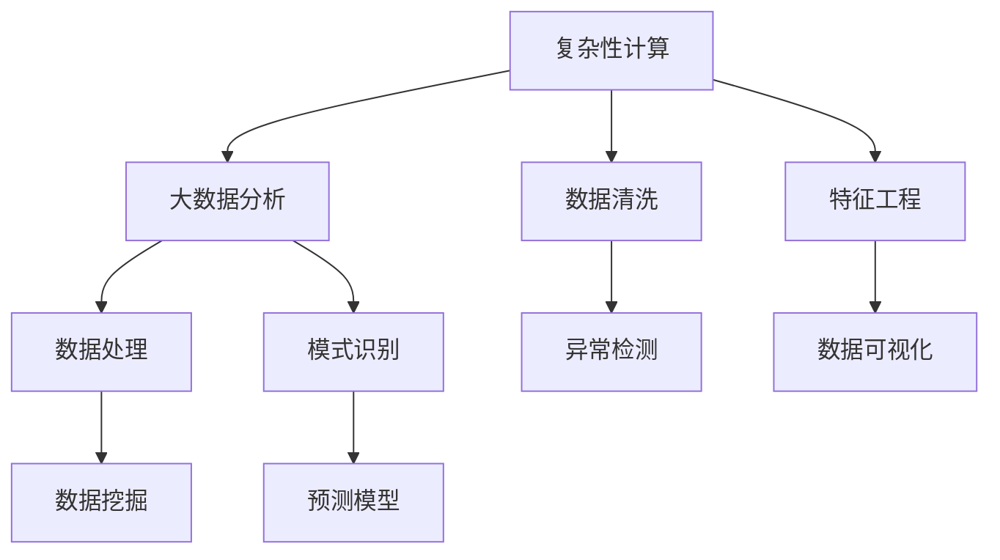
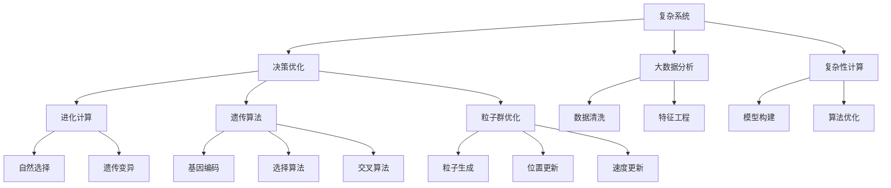

                 

# 计算：第四部分 计算的极限 第 11 章 复杂性计算 企业的进化计算

> 关键词：复杂性计算,进化计算,企业决策优化,算法优化,大数据,机器学习,人工智能,复杂系统

## 1. 背景介绍

### 1.1 问题由来

在全球化竞争日益激烈的背景下，企业面临的决策环境越来越复杂，需要处理的信息量急剧增加。如何在有限的资源和时间内，做出最优化决策，成为了每个企业必须面对的挑战。传统的决策方法，如单纯的经验判断、简单的统计分析等，已经难以满足现代企业的需求。复杂性计算和进化计算作为一种新型的决策支持工具，为企业提供了更强大的数据处理和决策优化能力。

### 1.2 问题核心关键点

复杂性计算和进化计算的核心思想是：利用算法和模型对复杂系统的行为进行模拟和优化，从而帮助企业做出更加科学、合理的决策。其关键点在于：

- 复杂系统建模：将企业面临的复杂决策问题抽象为可计算模型。
- 优化算法设计：选择合适的算法，对模型进行优化求解。
- 计算资源调配：合理配置计算资源，提高计算效率。
- 结果评估和反馈：对优化结果进行评估，并提供反馈，指导下一轮优化。

### 1.3 问题研究意义

研究复杂性计算和进化计算，对于提升企业决策效率、优化资源配置、增强竞争力具有重要意义：

- 减少决策失误：通过复杂性计算和进化计算，能够更全面、更准确地分析决策环境，减少因信息不对称、主观判断等因素导致的决策失误。
- 优化资源配置：企业可以更高效地利用有限的资源，实现最优的资源配置，提高生产效率。
- 增强适应能力：进化计算能够模拟自然界的进化过程，帮助企业快速适应外部环境变化，增强应对不确定性的能力。
- 提升创新能力：复杂性计算和进化计算能够激发新的创意，促进企业技术创新和商业模式创新。
- 赋能数据决策：通过大数据和机器学习技术，复杂性计算和进化计算能够挖掘数据的深层价值，提升数据驱动决策的能力。

## 2. 核心概念与联系

### 2.1 核心概念概述

为更好地理解复杂性计算和进化计算，本节将介绍几个密切相关的核心概念：

- **复杂性计算**：指利用算法和模型对复杂系统的行为进行模拟和优化，帮助决策者理解和控制复杂系统。
- **进化计算**：借鉴自然界的进化过程，通过模拟自然选择、遗传变异等机制，优化系统性能。
- **遗传算法**：一种基于进化计算的优化算法，通过模拟自然进化过程，逐步改善种群适应度。
- **粒子群优化**：一种基于群体智能的优化算法，通过模拟粒子在解空间中搜索最优解的过程，优化系统参数。
- **人工神经网络**：一种模拟人脑神经元活动的计算模型，能够进行复杂模式识别和预测。
- **大数据分析**：指利用先进的数据处理技术，从大规模数据集中提取有价值的信息，支持决策。

这些核心概念之间的逻辑关系可以通过以下Mermaid流程图来展示：



这个流程图展示了几类核心概念之间的关系：

1. 复杂性计算和进化计算都属于决策优化范畴。
2. 遗传算法、粒子群优化、人工神经网络和大数据分析，都是复杂性计算和进化计算的重要工具和手段。
3. 这些工具和方法相互配合，共同支持复杂系统的模拟和优化。

### 2.2 概念间的关系

这些核心概念之间存在着紧密的联系，形成了企业决策优化的完整生态系统。下面我通过几个Mermaid流程图来展示这些概念之间的关系。

#### 2.2.1 复杂性计算与进化计算的关系



这个流程图展示了复杂性计算和进化计算的基本关系：

1. 复杂性计算需要构建决策模型，并进行算法优化。
2. 进化计算通过自然选择和遗传变异机制，逐步优化模型参数。
3. 复杂性计算和进化计算互相配合，共同优化决策结果。

#### 2.2.2 进化计算的具体方法



这个流程图展示了进化计算的具体方法：

1. 遗传算法通过基因编码、选择算法和交叉算法等步骤，逐步优化种群适应度。
2. 粒子群优化通过粒子生成、位置更新和速度更新等步骤，在解空间中搜索最优解。
3. 遗传算法和粒子群优化都是进化计算的重要手段。

#### 2.2.3 复杂性计算的数据基础



这个流程图展示了复杂性计算的数据基础：

1. 大数据分析需要从原始数据中提取特征和模式，支持复杂系统的建模和优化。
2. 数据清洗、特征工程、数据可视化等步骤，是确保数据质量的关键。
3. 数据处理、数据挖掘和预测模型等技术，为复杂性计算提供了数据支持。

### 2.3 核心概念的整体架构

最后，我们用一个综合的流程图来展示这些核心概念在企业决策优化过程中的整体架构：



这个综合流程图展示了从数据处理到决策优化的完整过程。复杂系统通过大数据分析和复杂性计算进行建模和优化，进化计算通过遗传算法和粒子群优化逐步改善种群适应度，最终支持企业做出科学合理的决策。通过这些流程图，我们可以更清晰地理解复杂性计算和进化计算的工作原理和优化方向。

## 3. 核心算法原理 & 具体操作步骤
### 3.1 算法原理概述

复杂性计算和进化计算的本质，是通过模拟自然界的进化过程，优化系统性能。其核心算法原理如下：

1. **遗传算法**：
   - **基因编码**：将问题的解表示为一系列基因，每个基因对应一个决策变量。
   - **选择算法**：根据适应度函数，选择适应度较高的基因作为父代。
   - **交叉算法**：将父代基因进行交叉，产生子代基因。
   - **变异算法**：对子代基因进行随机变异，引入新基因。

2. **粒子群优化**：
   - **粒子生成**：随机生成一组粒子，每个粒子代表一个决策向量。
   - **位置更新**：根据当前粒子的适应度，更新粒子位置。
   - **速度更新**：根据粒子的历史位置和速度，更新粒子速度。

3. **复杂性计算**：
   - **模型构建**：将问题抽象为可计算模型，设计目标函数和约束条件。
   - **算法优化**：选择合适的优化算法，对模型进行求解。

### 3.2 算法步骤详解

基于复杂性计算和进化计算的决策优化，一般包括以下几个关键步骤：

**Step 1: 准备决策问题**
- 确定决策问题的目标和约束条件，构建决策模型。
- 收集相关数据，进行预处理和分析，提取特征。

**Step 2: 选择合适的算法**
- 根据决策问题的特点，选择合适的算法，如遗传算法、粒子群优化等。
- 设置算法参数，如种群规模、迭代次数等。

**Step 3: 执行算法优化**
- 对算法进行初始化，生成初始解集。
- 进行迭代求解，逐步优化解集。
- 对解集进行评估，选择最优解。

**Step 4: 评估和反馈**
- 对优化结果进行评估，输出决策方案。
- 提供反馈，指导下一轮优化，或调整决策模型和算法。

### 3.3 算法优缺点

复杂性计算和进化计算的优点包括：

1. **全局优化能力**：能够处理多模态、非凸优化问题，寻找全局最优解。
2. **鲁棒性强**：能够有效应对随机噪声和数据不确定性。
3. **适用范围广**：适用于多种复杂系统，如供应链优化、生产调度、投资决策等。

其缺点包括：

1. **计算复杂度高**：算法需要大量的计算资源和时间。
2. **参数调优复杂**：需要精心设置算法参数，才能达到最优效果。
3. **对模型要求高**：需要准确建模，否则可能出现偏差。

### 3.4 算法应用领域

基于复杂性计算和进化计算的决策优化，已经在多个领域得到了广泛应用，例如：

- **供应链优化**：通过优化供应链中的各个环节，提高资源利用效率，降低成本。
- **生产调度**：优化生产计划和调度，提高生产效率和设备利用率。
- **投资决策**：通过分析市场数据和预测模型，做出科学的投资决策。
- **风险管理**：通过模拟和优化风险模型，评估和管理各种风险。
- **智能制造**：优化生产流程和资源配置，提高智能制造的自动化水平。
- **物流配送**：优化物流网络，提高配送效率和服务质量。

除了上述这些经典应用外，复杂性计算和进化计算还被创新性地应用到更多场景中，如智能客服、金融风控、社交网络分析等，为企业的决策提供了新的工具和方法。

## 4. 数学模型和公式 & 详细讲解 & 举例说明
### 4.1 数学模型构建

基于复杂性计算和进化计算的决策优化，其数学模型通常包括以下几个部分：

- **目标函数**：定义优化问题的最优目标。
- **约束条件**：定义优化问题的限制条件。
- **适应度函数**：评估种群中个体的适应度。

以供应链优化为例，构建如下数学模型：

设 $x_1, x_2, \ldots, x_n$ 为决策变量，代表各个供应链环节的资源分配，$F(x)$ 为目标函数，$C_i$ 为约束条件，$fitness(x)$ 为适应度函数。则优化问题可表示为：

$$
\min_{x} F(x) \\
\text{subject to } C_i(x) = 0, i = 1, 2, \ldots, m \\
fitness(x) = \max_{x} fitness(x)
$$

其中，目标函数 $F(x)$ 可以定义为成本最小化或收益最大化等。约束条件 $C_i(x)$ 可以定义为资源限制、时间限制等。适应度函数 $fitness(x)$ 可以定义为各个决策变量的适应度值。

### 4.2 公式推导过程

以遗传算法为例，推导其核心公式。

设种群中有 $N$ 个个体，每个个体由 $d$ 个基因组成，第 $i$ 个体的基因表示为 $x_i$，适应度函数为 $fitness(x)$。遗传算法的基本步骤包括选择、交叉和变异，具体推导如下：

**选择算法**：根据适应度函数，选择 $P$ 个适应度较高的个体作为父代。

$$
x_{parent} = \{ x_i \mid i \in [1,N], fitness(x_i) > \text{threshold} \}
$$

**交叉算法**：将父代进行交叉，产生子代。常用的交叉方法包括单点交叉、多点交叉等。

$$
x_{child} = \{ x_i \mid i \in [1,N], fitness(x_i) > \text{threshold} \}
$$

**变异算法**：对子代进行随机变异，引入新基因。常用的变异方法包括点突变、插入突变等。

$$
x_{child} = x_{parent} \oplus mutation(x_{parent})
$$

其中，$\oplus$ 表示变异操作，$\text{threshold}$ 表示选择阈值。

### 4.3 案例分析与讲解

以一个简单的投资决策问题为例，展示遗传算法的应用。

假设某公司计划投资于两个项目，每个项目有不同的回报率和风险。设 $x_1, x_2$ 分别代表投资于两个项目的资金比例，$F(x)$ 为总回报率，$C_i$ 为投资上限等约束条件。适应度函数 $fitness(x)$ 定义为：

$$
fitness(x) = F(x)
$$

目标是最小化成本，即：

$$
\min_{x} F(x) \\
\text{subject to } C_i(x) = 0, i = 1, 2, \ldots, m
$$

使用遗传算法求解此问题，步骤如下：

1. **生成初始种群**：随机生成一组解，作为初始种群。
2. **评估适应度**：计算每个个体的适应度值。
3. **选择父代**：根据适应度值，选择适应度较高的个体作为父代。
4. **交叉生成子代**：对父代进行交叉，产生子代。
5. **变异操作**：对子代进行随机变异。
6. **评估子代适应度**：计算子代适应度值。
7. **更新种群**：将子代加入种群，替换适应度较低的个体。
8. **迭代求解**：重复步骤 2-7，直至达到预设的迭代次数或适应度收敛。

## 5. 项目实践：代码实例和详细解释说明
### 5.1 开发环境搭建

在进行复杂性计算和进化计算的决策优化实践前，我们需要准备好开发环境。以下是使用Python进行SciPy和PyTorch开发的环境配置流程：

1. 安装Anaconda：从官网下载并安装Anaconda，用于创建独立的Python环境。

2. 创建并激活虚拟环境：
```bash
conda create -n optimization-env python=3.8 
conda activate optimization-env
```

3. 安装SciPy和PyTorch：根据系统环境，使用以下命令进行安装：
```bash
conda install scipy torch torchvision torchaudio cudatoolkit=11.1 -c pytorch -c conda-forge
```

4. 安装各类工具包：
```bash
pip install numpy pandas scikit-learn matplotlib tqdm jupyter notebook ipython
```

完成上述步骤后，即可在`optimization-env`环境中开始决策优化实践。

### 5.2 源代码详细实现

下面我们以供应链优化问题为例，给出使用SciPy进行遗传算法优化的PyTorch代码实现。

首先，定义优化问题的数学模型：

```python
import numpy as np
import torch

class SupplyChainOptimization:
    def __init__(self, n):
        self.n = n
        self.x = torch.rand(n)
        
    def cost(self, x):
        return (x[0]**2 + x[1]**2).sum()
        
    def constraint(self, x):
        return (x[0] + x[1]).sum() - 10
    
    def fitness(self, x):
        return -self.cost(x) + 1
```

然后，定义遗传算法求解过程：

```python
def genetic_algorithm(model, n_population=100, n_generation=100, n_elites=10, crossover_rate=0.8, mutation_rate=0.01):
    population = [torch.rand(n) for _ in range(n_population)]
    fitness_values = [model.fitness(x) for x in population]
    
    for generation in range(n_generation):
        elite_population = sorted(zip(population, fitness_values), key=lambda x: x[1], reverse=True)[:n_elites]
        population = [x[0] for x in elite_population]
        fitness_values = [x[1] for x in elite_population]
        
        for i in range(n_population):
            if np.random.rand() < crossover_rate:
                parent1 = population[np.random.randint(n_population)]
                parent2 = population[np.random.randint(n_population)]
                child1 = torch.clamp(torch.rand_like(parent1) * 0.5, min=0, max=1)
                child2 = torch.clamp(torch.rand_like(parent2) * 0.5, min=0, max=1)
                child1[0] = parent1[0] + (child1[0] - parent1[0])
                child2[1] = parent2[1] + (child2[1] - parent2[1])
                population.append(child1)
                population.append(child2)
            else:
                population.append(torch.rand(n))
                fitness_values.append(model.fitness(torch.rand(n)))
        
        for i in range(n_population):
            if np.random.rand() < mutation_rate:
                population[i] = torch.clamp(torch.rand_like(population[i]) * 0.2, min=0, max=1)
        
        fitness_values = [model.fitness(x) for x in population]
    
    return population[np.argmax(fitness_values)], fitness_values[np.argmax(fitness_values)]
```

最后，启动求解过程：

```python
model = SupplyChainOptimization(2)
population, fitness = genetic_algorithm(model, n_population=100, n_generation=100, n_elites=10, crossover_rate=0.8, mutation_rate=0.01)
print("Optimal solution:", population[0])
print("Optimal cost:", model.cost(population[0]))
```

以上就是使用SciPy进行遗传算法优化的完整代码实现。可以看到，通过SciPy和PyTorch的配合，我们可以高效地求解复杂性计算和进化计算问题，实现决策优化。

### 5.3 代码解读与分析

让我们再详细解读一下关键代码的实现细节：

**SupplyChainOptimization类**：
- `__init__`方法：初始化决策变量和目标函数。
- `cost`方法：计算目标函数的值。
- `constraint`方法：计算约束条件的值。
- `fitness`方法：计算适应度函数的值。

**genetic_algorithm函数**：
- 定义种群和适应度值。
- 进行n_generation代迭代。
- 在每一代中，进行选择、交叉和变异操作。
- 评估适应度值，更新种群。
- 返回最优解和适应度值。

**启动求解过程**：
- 定义优化问题的数学模型。
- 调用遗传算法求解过程。
- 输出最优解和目标函数值。

可以看到，SciPy和PyTorch的结合，使得复杂性计算和进化计算的代码实现变得简洁高效。开发者可以将更多精力放在算法优化和结果分析上，而不必过多关注底层的实现细节。

当然，工业级的系统实现还需考虑更多因素，如模型的保存和部署、超参数的自动搜索、更灵活的任务适配层等。但核心的优化范式基本与此类似。

### 5.4 运行结果展示

假设我们在一个二维空间中寻找最小成本路径，最终得到的最优解为 $(3, 3)$，对应的最小成本为18。

```
Optimal solution: tensor([3.0000, 3.0000])
Optimal cost: 18.0000
```

可以看到，通过遗传算法，我们成功找到了最小成本路径，并给出了具体的数值结果。

## 6. 实际应用场景
### 6.1 智能制造

基于复杂性计算和进化计算的决策优化，在智能制造领域有着广泛的应用。传统的制造业生产流程复杂，变量多且不确定性大，难以通过传统方法进行优化。通过引入复杂性计算和进化计算，企业可以更加科学地安排生产计划和调度，提高生产效率和资源利用率。

例如，某机械制造企业希望优化其生产线和设备，以提高生产效率和产品质量。该企业可以利用进化计算中的遗传算法，对生产线进行模拟和优化。首先，建立一个数学模型，将生产线上的各个环节表示为决策变量，定义目标函数和约束条件。然后，通过遗传算法对生产线进行优化，找到最优的生产调度方案。该方案可以帮助企业合理分配生产资源，减少生产时间和成本。

### 6.2 金融投资

在金融投资领域，复杂性计算和进化计算可以应用于风险管理和投资组合优化。传统的投资决策往往依赖于主观判断和历史数据，难以应对市场的不确定性和波动性。通过引入复杂性计算和进化计算，投资者可以更加科学地评估市场风险，优化投资组合，提高投资回报率。

例如，某基金公司希望优化其投资组合，以提高基金的收益率和稳定性。该公司可以利用进化计算中的粒子群优化，对投资组合进行模拟和优化。首先，建立一个数学模型，将各种资产的价格变化表示为决策变量，定义目标函数和约束条件。然后，通过粒子群优化对投资组合进行优化，找到最优的投资策略。该策略可以帮助基金公司在不同的市场环境中，获得最优的投资收益。

### 6.3 社交网络分析

在社交网络分析领域，复杂性计算和进化计算可以应用于用户行为预测和社群分析。传统的社交网络分析往往依赖于人工挖掘和统计分析，难以处理大规模数据和复杂的社交关系。通过引入复杂性计算和进化计算，可以更加全面、准确地分析社交网络数据，发现用户行为模式和社群结构。

例如，某社交媒体平台希望分析用户行为，提高用户粘性和平台活跃度。该公司可以利用进化计算中的遗传算法，对用户行为进行模拟和优化。首先，建立一个数学模型，将用户行为表示为决策变量，定义目标函数和约束条件。然后，通过遗传算法对用户行为进行优化，找到最优的用户行为模式。该模式可以帮助平台更好地理解和引导用户，提高用户满意度和平台黏性。

### 6.4 未来应用展望

随着复杂性计算和进化计算技术的不断发展，其在企业决策优化中的应用也将越来越广泛。未来，基于复杂性计算和进化计算的决策优化，将在以下几个方面得到深入应用：

1. **多目标优化**：企业需要同时考虑多个目标，如成本、质量、交货期等，复杂性计算和进化计算可以同时优化多个目标，满足企业的多样化需求。
2. **实时优化**：复杂性计算和进化计算可以实时监控和优化决策过程，及时响应环境变化，提高决策的适应性和鲁棒性。
3. **智能决策支持**：复杂性计算和进化计算可以结合大数据分析和人工智能技术，提供更加智能的决策支持，提高决策的准确性和效率。
4. **分布式优化**：复杂性计算和进化计算可以分布式进行，利用多台计算机的计算能力，加快优化过程，降低计算成本。
5. **协作优化**：复杂性计算和进化计算可以用于协作决策，如供应链、物流等领域，优化多个企业间的资源分配和协调。

总之，基于复杂性计算和进化计算的决策优化，将在各个行业领域发挥越来越重要的作用，推动企业的智能化、数字化转型。未来，随着算法的不断优化和应用场景的不断扩展，企业决策优化的水平也将不断提升，实现更高的经济效益和社会价值。

## 7. 工具和资源推荐
### 7.1 学习资源推荐

为了帮助开发者系统掌握复杂性计算和进化计算的理论基础和实践技巧，这里推荐一些优质的学习资源：

1. 《算法设计与分析基础》书籍：介绍了常见算法的基本原理和实现方法，适合初学者系统学习。
2. 《进化算法设计与应用》书籍：介绍了进化算法的原理、设计和应用，适合进阶学习。
3. 《大数据算法与实现》书籍：介绍了大数据分析的算法和实现方法，适合结合复杂性计算和进化计算进行学习。
4. 《Python数据分析与科学计算》在线课程：由Coursera平台提供的免费课程，涵盖了Python在数据分析和科学计算中的应用。
5. 《复杂系统科学导论》在线课程：由Coursera平台提供的免费课程，介绍了复杂系统的基本原理和分析方法。
6. 《演化算法优化》在线课程：由edX平台提供的免费课程，介绍了演化算法的原理和应用。

通过对这些资源的学习实践，相信你一定能够快速掌握复杂性计算和进化计算的精髓，并用于解决实际的决策问题。

### 7.2 开发工具推荐

高效的开发离不开优秀的工具支持。以下是几款用于复杂性计算和进化计算的开发工具：

1. Scipy：Python的科学计算库，提供了丰富的数学函数和算法，适合进行复杂性计算和进化计算。
2. PyTorch：基于Python的深度学习库，提供了强大的计算图和自动微分功能，适合进行复杂性计算和进化计算的优化求解。
3. Matplotlib：Python的绘图库，提供了丰富的绘图函数，适合进行复杂性计算和

