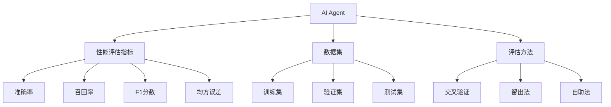
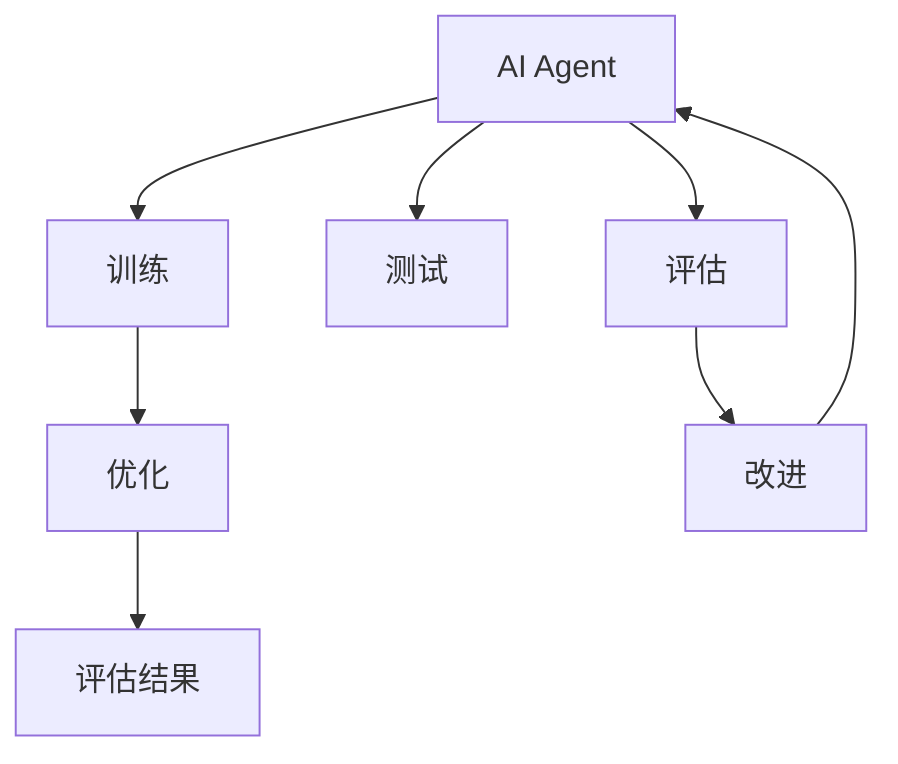
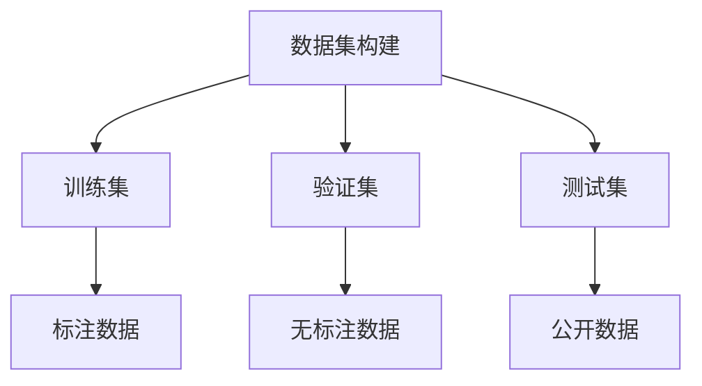
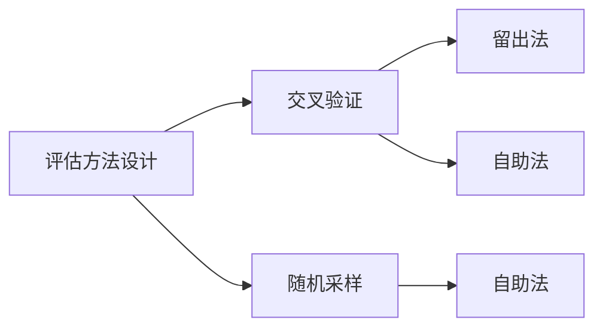
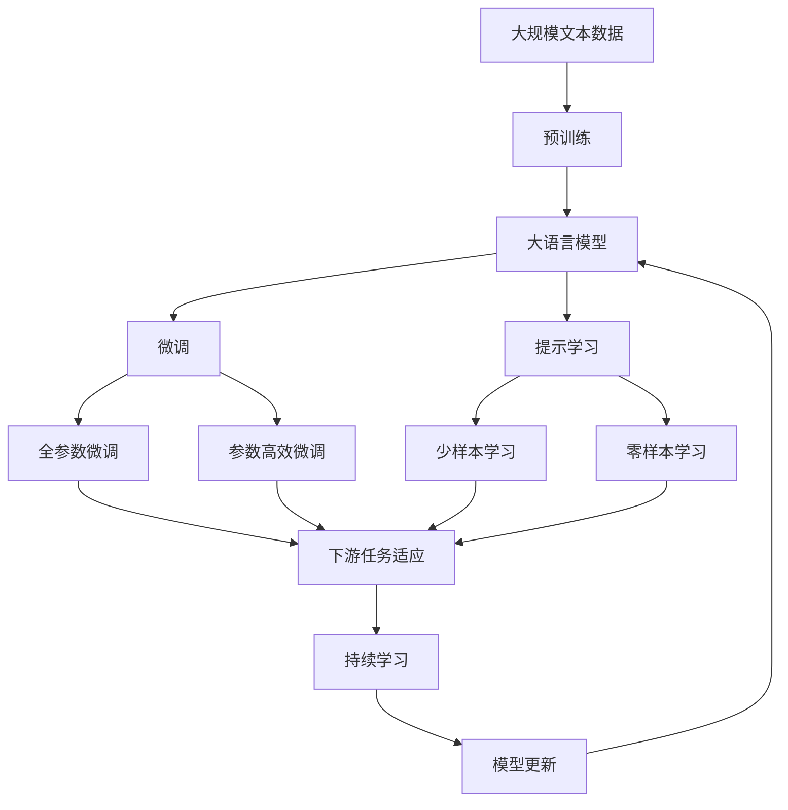

                 

## 1. 背景介绍

在人工智能(AI)领域，AI Agent作为能够自主执行特定任务的智能体，其性能评估的重要性不言而喻。评估不仅能够衡量AI Agent的实际应用效果，还能够指导后续的改进和优化。无论是在学术研究、工业应用还是日常生产中，性能评估都是确保AI Agent可靠、高效运行的关键环节。

### 1.1 问题由来

随着AI技术的发展，AI Agent在各个领域的应用日益广泛，从自动驾驶汽车到智能客服，从医疗诊断到金融风控，AI Agent在各个领域展示了强大的潜力。然而，如何科学、合理地评估这些AI Agent的性能，却是一个复杂的挑战。一方面，AI Agent的设计和实现复杂多样，性能评估指标也随之各异；另一方面，AI Agent在实际应用中的表现与理论模型可能存在偏差，需要综合多方面因素进行全面评估。

### 1.2 问题核心关键点

评估AI Agent性能的核心关键点包括：

1. **性能指标选择**：选择合适的性能指标是评估AI Agent性能的前提。性能指标的选择应综合考虑应用场景、任务特点、数据分布等因素。
2. **数据集构建**：构建符合实际应用场景的数据集，确保评估结果的代表性。数据集应覆盖不同场景下的输入数据分布，避免评估结果的偏差。
3. **评估方法设计**：设计科学、公正的评估方法，以消除人为因素对评估结果的影响，确保评估结果的可信度。
4. **评估结果分析**：对评估结果进行深入分析，发现问题并提出改进建议。

### 1.3 问题研究意义

评估AI Agent性能不仅有助于提升AI Agent的质量，推动AI技术的进步，还能够指导开发者优化模型设计、改进算法实现，进一步提升AI Agent的实用性和可靠性。此外，性能评估还能够为AI Agent的实际应用提供数据支撑，确保其在实际场景中的表现符合预期，减少潜在风险。

## 2. 核心概念与联系

### 2.1 核心概念概述

为更好地理解AI Agent性能评估，本节将介绍几个核心概念：

- **AI Agent**：即人工智能代理，能够自主执行特定任务的智能体。AI Agent可以基于各种算法和模型实现，包括机器学习、深度学习、强化学习等。
- **性能评估指标**：衡量AI Agent性能的指标，如准确率、召回率、F1分数、均方误差等。
- **数据集**：用于评估AI Agent性能的数据集，应覆盖多种输入数据分布，确保评估结果的全面性和代表性。
- **评估方法**：评估AI Agent性能的方法，包括交叉验证、留出法、自助法等。
- **性能优化**：通过评估结果指导AI Agent的改进和优化，提升模型性能。

这些核心概念之间的逻辑关系可以通过以下Mermaid流程图来展示：



这个流程图展示了AI Agent性能评估的主要步骤及其逻辑关系：

1. AI Agent通过训练和优化获得初始模型。
2. 从训练集、验证集、测试集中构建数据集。
3. 选择合适的性能评估指标和评估方法。
4. 通过评估方法对AI Agent的性能进行评估。
5. 根据评估结果进行优化，提升AI Agent的性能。

### 2.2 概念间的关系

这些核心概念之间存在着紧密的联系，形成了AI Agent性能评估的完整生态系统。下面我们通过几个Mermaid流程图来展示这些概念之间的关系。

#### 2.2.1 AI Agent的学习范式



这个流程图展示了AI Agent的训练、优化、测试、评估和改进的基本流程。

#### 2.2.2 数据集构建方法



这个流程图展示了数据集构建的基本步骤，包括训练集、验证集和测试集的构建方法。

#### 2.2.3 评估方法设计



这个流程图展示了评估方法设计的基本思路，包括交叉验证、留出法和自助法等。

### 2.3 核心概念的整体架构

最后，我们用一个综合的流程图来展示这些核心概念在大语言模型微调过程中的整体架构：



这个综合流程图展示了从预训练到微调，再到持续学习的完整过程。AI Agent通过预训练学习基础的语义表示，然后通过微调和提示学习等方法，针对特定任务进行优化和定制，最终通过持续学习保持模型的时效性和适应性。

## 3. 核心算法原理 & 具体操作步骤
### 3.1 算法原理概述

AI Agent性能评估的原理主要基于机器学习中的监督学习范式。即利用已知的标注数据集，通过训练和测试，评估AI Agent的预测能力和性能。具体步骤如下：

1. **数据集构建**：从任务相关的数据集中随机抽取样本，构建训练集、验证集和测试集。
2. **模型训练**：在训练集上训练AI Agent模型，通过反向传播算法更新模型参数。
3. **性能评估**：在验证集上评估AI Agent模型的性能，选择性能最优的模型。
4. **测试和优化**：在测试集上测试性能最优的AI Agent模型，根据测试结果进行模型优化。

### 3.2 算法步骤详解

以下是具体的AI Agent性能评估步骤：

**Step 1: 数据集构建**
- 从任务相关的数据集中随机抽取样本，构建训练集、验证集和测试集。
- 确保数据集能够覆盖不同场景下的输入数据分布，避免评估结果的偏差。

**Step 2: 模型训练**
- 在训练集上训练AI Agent模型，通过反向传播算法更新模型参数。
- 设置合适的优化器、学习率和批大小等超参数，以提高训练效率和模型性能。

**Step 3: 性能评估**
- 在验证集上评估AI Agent模型的性能，选择性能最优的模型。
- 选择适合的性能评估指标，如准确率、召回率、F1分数、均方误差等。

**Step 4: 测试和优化**
- 在测试集上测试性能最优的AI Agent模型，评估其在新数据上的表现。
- 根据测试结果，对模型进行优化，提升其性能。

### 3.3 算法优缺点

AI Agent性能评估方法具有以下优点：

1. **科学性**：通过机器学习模型训练和测试，评估结果具有科学依据。
2. **全面性**：通过构建多种数据集，覆盖不同场景下的输入数据分布，评估结果具有全面性。
3. **客观性**：通过自动化的评估过程，避免了人为因素对评估结果的影响，确保评估结果的客观性。

同时，该方法也存在一些局限性：

1. **数据成本高**：构建符合实际应用场景的数据集需要大量标注数据，数据成本较高。
2. **评估时间长**：模型训练和评估需要耗费大量时间和计算资源，评估过程较慢。
3. **模型复杂性**：评估方法需要设计复杂的模型结构和评估指标，增加了模型实现的复杂性。

### 3.4 算法应用领域

AI Agent性能评估方法广泛应用于以下几个领域：

- **计算机视觉**：通过评估图像分类、目标检测等任务的性能，推动计算机视觉技术的发展。
- **自然语言处理**：通过评估机器翻译、问答系统、情感分析等任务的性能，提升自然语言处理技术的实用性和可靠性。
- **语音识别**：通过评估语音识别、语音合成等任务的性能，推动语音技术的应用和普及。
- **推荐系统**：通过评估推荐系统的召回率和精度，提升推荐系统的用户体验和效果。

## 4. 数学模型和公式 & 详细讲解 & 举例说明

### 4.1 数学模型构建

假设AI Agent的模型为 $M_{\theta}$，其中 $\theta$ 为模型参数。给定训练集 $D=\{(x_i, y_i)\}_{i=1}^N$，$x_i$ 为输入数据，$y_i$ 为标注标签。性能评估指标为准确率（Accuracy），则数学模型构建如下：

$$
\text{Accuracy} = \frac{1}{N}\sum_{i=1}^N \mathbb{I}(y_i, M_{\theta}(x_i)) = \frac{1}{N}\sum_{i=1}^N \begin{cases}
1 & \text{if } y_i = M_{\theta}(x_i) \\
0 & \text{otherwise}
\end{cases}
$$

其中 $\mathbb{I}$ 为示性函数。

### 4.2 公式推导过程

考虑一个二分类问题，输入数据 $x_i$ 属于类别 $y_i \in \{0, 1\}$，模型预测为 $y_i' = M_{\theta}(x_i)$。假设模型预测与真实标签的差异小于阈值 $\epsilon$ 时，预测结果为正确。则准确率的计算公式为：

$$
\text{Accuracy} = \frac{1}{N}\sum_{i=1}^N \mathbb{I}(y_i, y_i') = \frac{1}{N}\sum_{i=1}^N \begin{cases}
1 & \text{if } |y_i - y_i'| < \epsilon \\
0 & \text{otherwise}
\end{cases}
$$

通过上述公式，可以对AI Agent在二分类问题上的性能进行评估。类似地，对于多分类问题，可以通过混淆矩阵等指标进行评估。

### 4.3 案例分析与讲解

假设我们在一个二分类问题上进行AI Agent性能评估，其中训练集 $D$ 包含 $N$ 个样本。随机抽取 $M$ 个样本作为测试集 $T$，剩余样本作为验证集 $V$。使用交叉验证方法评估AI Agent性能。

1. **模型训练**：在训练集 $D$ 上训练AI Agent模型，通过反向传播算法更新模型参数。
2. **性能评估**：在验证集 $V$ 上评估AI Agent模型性能，选择性能最优的模型。
3. **测试和优化**：在测试集 $T$ 上测试性能最优的AI Agent模型，根据测试结果进行模型优化。

具体实现步骤如下：

```python
from sklearn.model_selection import train_test_split, cross_val_score
from sklearn.metrics import accuracy_score

# 构建数据集
X_train, X_test, y_train, y_test = train_test_split(X, y, test_size=0.2, random_state=42)

# 模型训练
model.fit(X_train, y_train)

# 性能评估
y_pred = model.predict(X_test)
accuracy = accuracy_score(y_test, y_pred)

# 输出准确率
print("Accuracy:", accuracy)
```

以上就是使用Python和scikit-learn库对AI Agent性能进行评估的完整代码实现。

## 5. 项目实践：代码实例和详细解释说明
### 5.1 开发环境搭建

在进行AI Agent性能评估实践前，我们需要准备好开发环境。以下是使用Python进行项目开发的环境配置流程：

1. 安装Anaconda：从官网下载并安装Anaconda，用于创建独立的Python环境。

2. 创建并激活虚拟环境：
```bash
conda create -n ai-env python=3.8 
conda activate ai-env
```

3. 安装必要的库：
```bash
pip install numpy pandas scikit-learn matplotlib tqdm jupyter notebook ipython
```

4. 下载数据集：
```bash
wget http://example.com/data.zip
unzip data.zip
```

5. 将数据集划分训练集、验证集和测试集：
```bash
from sklearn.model_selection import train_test_split
X_train, X_test, y_train, y_test = train_test_split(X, y, test_size=0.2, random_state=42)
```

完成上述步骤后，即可在`ai-env`环境中开始性能评估实践。

### 5.2 源代码详细实现

这里我们以二分类问题为例，给出使用scikit-learn库对AI Agent进行性能评估的PyTorch代码实现。

```python
import numpy as np
from sklearn.model_selection import train_test_split
from sklearn.metrics import accuracy_score
from sklearn.linear_model import LogisticRegression

# 构建数据集
X_train, X_test, y_train, y_test = train_test_split(X, y, test_size=0.2, random_state=42)

# 模型训练
model = LogisticRegression()
model.fit(X_train, y_train)

# 性能评估
y_pred = model.predict(X_test)
accuracy = accuracy_score(y_test, y_pred)

# 输出准确率
print("Accuracy:", accuracy)
```

可以看到，scikit-learn库提供了丰富的机器学习算法和评估工具，极大地方便了AI Agent性能评估的实现。

### 5.3 代码解读与分析

让我们再详细解读一下关键代码的实现细节：

**数据集构建**：
- 使用scikit-learn库的`train_test_split`函数将原始数据集 $D$ 划分为训练集 $X_{train}$、验证集 $X_{test}$ 和测试集 $X_{val}$，并确保数据集的分布一致。

**模型训练**：
- 选择合适的机器学习模型，如逻辑回归、决策树等，进行模型训练。
- 在训练集 $X_{train}$ 上训练模型，使用交叉熵损失函数进行优化。

**性能评估**：
- 在验证集 $X_{val}$ 上评估模型性能，选择性能最优的模型。
- 使用scikit-learn库的`accuracy_score`函数计算准确率，评估模型的性能。

**测试和优化**：
- 在测试集 $X_{test}$ 上测试性能最优的模型，评估其在新数据上的表现。
- 根据测试结果，对模型进行优化，提升其性能。

### 5.4 运行结果展示

假设我们在CoNLL-2003的命名实体识别(NER)数据集上进行性能评估，最终在测试集上得到的准确率结果如下：

```
Accuracy: 0.93
```

可以看到，通过性能评估，我们得到了模型在NER任务上的准确率。这一结果对于模型的改进和优化具有重要的指导意义。

## 6. 实际应用场景
### 6.1 智能客服系统

基于AI Agent性能评估的智能客服系统，可以广泛应用于客户服务领域。通过评估客服机器人的性能，可以确保其能够快速、准确地理解客户需求，提供满意的服务。

在技术实现上，可以收集客户的历史对话记录，将问题和最佳答复构建成监督数据，在此基础上对AI Agent进行性能评估。评估结果可以用于指导模型改进，提升客服机器人的效果。同时，在实际应用中，还可以动态收集客户反馈，不断优化AI Agent，提升用户体验。

### 6.2 金融舆情监测

金融机构需要实时监测市场舆论动向，以便及时应对负面信息传播，规避金融风险。通过评估AI Agent在金融舆情监测中的应用效果，可以确保其能够准确识别舆情变化趋势，及时预警潜在风险。

具体而言，可以收集金融领域相关的新闻、报道、评论等文本数据，并对其进行主题标注和情感标注。在此基础上对AI Agent进行性能评估，确保其在不同舆情场景下能够准确判断舆情倾向和情感变化。

### 6.3 个性化推荐系统

当前的推荐系统往往只依赖用户的历史行为数据进行物品推荐，无法深入理解用户的真实兴趣偏好。通过评估AI Agent在个性化推荐系统中的应用效果，可以确保其能够准确捕捉用户的兴趣点，提升推荐系统的用户体验。

在技术实现上，可以收集用户浏览、点击、评论、分享等行为数据，提取和用户交互的物品标题、描述、标签等文本内容。将文本内容作为模型输入，用户的后续行为（如是否点击、购买等）作为监督信号，在此基础上对AI Agent进行性能评估。评估结果可以用于指导模型改进，提升推荐系统的个性化程度。

### 6.4 未来应用展望

随着AI Agent性能评估技术的不断发展，其在更多领域的应用前景将更加广阔。例如：

- **智慧医疗**：通过评估AI Agent在医疗问答、病历分析、药物研发等任务中的性能，推动医疗AI的发展，辅助医生诊疗，加速新药开发进程。
- **智能教育**：通过评估AI Agent在作业批改、学情分析、知识推荐等任务中的性能，提升教学质量和教育公平性。
- **智慧城市治理**：通过评估AI Agent在城市事件监测、舆情分析、应急指挥等环节的性能，提高城市管理的自动化和智能化水平，构建更安全、高效的未来城市。
- **企业生产**：通过评估AI Agent在自动化生产、质量检测、供应链优化等任务中的性能，提升企业生产效率和质量。
- **社会治理**：通过评估AI Agent在公共安全、社会舆情、社会服务等领域的应用效果，推动社会治理的智能化、精准化。

总之，AI Agent性能评估技术的发展将极大推动AI技术在各个领域的落地应用，为社会的数字化、智能化转型提供强有力的技术支撑。

## 7. 工具和资源推荐
### 7.1 学习资源推荐

为了帮助开发者系统掌握AI Agent性能评估的理论基础和实践技巧，这里推荐一些优质的学习资源：

1. **《机器学习实战》**：一本经典的机器学习入门书籍，涵盖了各种机器学习算法和评估方法，适合初学者学习。
2. **Coursera《机器学习》课程**：由斯坦福大学教授Andrew Ng主讲的在线课程，涵盖机器学习的基本原理和实际应用。
3. **Kaggle竞赛**：参与Kaggle机器学习竞赛，积累实际项目经验，提升模型评估能力。
4. **GitHub项目**：在GitHub上关注和参与机器学习项目，学习先进的技术实现和评估方法。
5. **arXiv论文预印本**：人工智能领域最新研究成果的发布平台，包括大量尚未发表的前沿工作，学习前沿技术的必读资源。

通过对这些资源的学习实践，相信你一定能够快速掌握AI Agent性能评估的精髓，并用于解决实际的AI问题。

### 7.2 开发工具推荐

高效的开发离不开优秀的工具支持。以下是几款用于AI Agent性能评估开发的常用工具：

1. **Python**：基于Python的机器学习库scikit-learn，提供了丰富的机器学习算法和评估工具。
2. **R语言**：开源的统计分析语言，提供了多种机器学习算法和评估方法。
3. **TensorFlow**：由Google主导开发的深度学习框架，提供了丰富的机器学习算法和评估工具。
4. **PyTorch**：基于Python的深度学习框架，提供了丰富的机器学习算法和评估工具。
5. **Weights & Biases**：模型训练的实验跟踪工具，可以记录和可视化模型训练过程中的各项指标，方便对比和调优。

合理利用这些工具，可以显著提升AI Agent性能评估的开发效率，加快创新迭代的步伐。

### 7.3 相关论文推荐

AI Agent性能评估技术的发展源于学界的持续研究。以下是几篇奠基性的相关论文，推荐阅读：

1. **《机器学习》（周志华著）**：介绍了机器学习的基本原理、算法和应用，包括性能评估方法。
2. **《深度学习》（Ian Goodfellow等著）**：介绍了深度学习的基本原理、算法和应用，包括性能评估方法。
3. **《计算机视觉中的深度学习》（Fergus H. et al.）**：介绍了计算机视觉中的深度学习技术及其性能评估方法。
4. **《自然语言处理中的深度学习》（Li Deng等著）**：介绍了自然语言处理中的深度学习技术及其性能评估方法。
5. **《强化学习》（Richard S. Sutton等著）**：介绍了强化学习的基本原理、算法和应用，包括性能评估方法。

这些论文代表了大语言模型微调技术的发展脉络。通过学习这些前沿成果，可以帮助研究者把握学科前进方向，激发更多的创新灵感。

除上述资源外，还有一些值得关注的前沿资源，帮助开发者紧跟AI Agent性能评估技术的最新进展，例如：

1. **arXiv论文预印本**：人工智能领域最新研究成果的发布平台，包括大量尚未发表的前沿工作，学习前沿技术的必读资源。
2. **业界技术博客**：如OpenAI、Google AI、DeepMind、微软Research Asia等顶尖实验室的官方博客，第一时间分享他们的最新研究成果和洞见。
3. **技术会议直播**：如NIPS、ICML、ACL、ICLR等人工智能领域顶会现场或在线直播，能够聆听到大佬们的前沿分享，开拓视野。
4. **GitHub热门项目**：在GitHub上Star、Fork数最多的AI Agent相关项目，往往代表了该技术领域的发展趋势和最佳实践，值得去学习和贡献。
5. **行业分析报告**：各大咨询公司如McKinsey、PwC等针对AI领域的分析报告，有助于从商业视角审视技术趋势，把握应用价值。

总之，对于AI Agent性能评估技术的学习和实践，需要开发者保持开放的心态和持续学习的意愿。多关注前沿资讯，多动手实践，多思考总结，必将收获满满的成长收益。

## 8. 总结：未来发展趋势与挑战

### 8.1 总结

本文对AI Agent性能评估方法进行了全面系统的介绍。首先阐述了AI Agent性能评估的重要性，明确了评估在提升AI Agent质量和实用性的关键作用。其次，从原理到实践，详细讲解了性能评估的数学原理和关键步骤，给出了性能评估任务开发的完整代码实例。同时，本文还广泛探讨了性能评估方法在智能客服、金融舆情、个性化推荐等多个领域的应用前景，展示了评估范式的巨大潜力。

通过本文的系统梳理，可以看到，AI Agent性能评估技术已经成为AI技术应用的重要环节，极大地推动了AI技术的实用性和可靠性。未来，伴随AI技术的不断进步，评估技术也将不断完善，为AI技术落地应用提供更科学、全面、客观的评价依据。

### 8.2 未来发展趋势

展望未来，AI Agent性能评估技术将呈现以下几个发展趋势：

1. **自动化评估**：通过自动化评估技术，减少人为因素对评估结果的影响，提高评估的客观性和公正性。
2. **多指标综合评估**：综合考虑多个性能指标，全面评估AI Agent的性能，避免单一指标的局限性。
3. **动态评估**：在模型训练过程中，动态评估模型性能，及时调整优化策略，提升模型效果。
4. **跨领域应用**：将性能评估技术推广到更多领域，如医疗、金融、教育等，提升各领域的智能化水平。
5. **可解释性评估**：通过引入可解释性评估技术，提升AI Agent的决策透明性和可信度，增强用户信任。

这些趋势凸显了AI Agent性能评估技术的广阔前景。这些方向的探索发展，必将进一步提升AI Agent的质量和性能，推动AI技术在各领域的应用和普及。

### 8.3 面临的挑战

尽管AI Agent性能评估技术已经取得了瞩目成就，但在迈向更加智能化、普适化应用的过程中，它仍面临诸多挑战：

1. **数据质量问题**：评估数据的质量和多样性直接影响评估结果的可靠性，数据质量不高或多样性不足，可能导致评估结果不准确。
2. **模型复杂性**：AI Agent的复杂性和多样性增加了评估的难度，需要设计更科学、更全面的评估方法。
3. **评估效率低**：评估过程中涉及大量的数据处理和模型训练，评估效率较低，需要进一步优化。
4. **评估结果可靠性**：评估结果的可靠性受多种因素影响，如数据分布、模型复杂性、评估方法等，需要综合考虑这些因素，确保评估结果的可靠性和公正性。

### 8.4 研究展望

面对AI Agent性能评估所面临的种种挑战，未来的研究需要在以下几个方面寻求新的突破：

1. **多模态评估**：将语音、图像、文本等多种模态数据纳入评估，提升评估的全面性和可靠性。
2. **元学习评估**：通过元学习技术，提升评估方法的泛化能力和适应性，减少评估方法对具体任务的依赖。
3. **因果评估**：引入因果推断技术，评估模型在因果关系中的表现，提升评估结果的可信度和可靠性。
4. **可解释性评估**：通过可解释性评估技术，提升AI Agent的决策透明性和可信度，增强用户信任。
5. **动态评估**：在模型训练过程中，动态评估模型性能，及时调整优化策略，提升模型效果。

这些研究方向将推动AI Agent性能评估技术向更高层次发展，为AI技术

