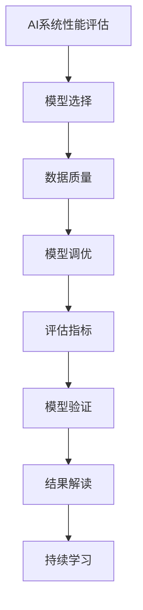
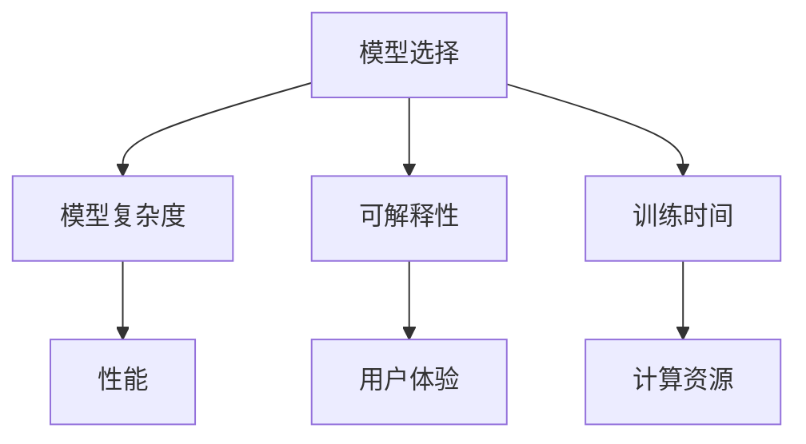
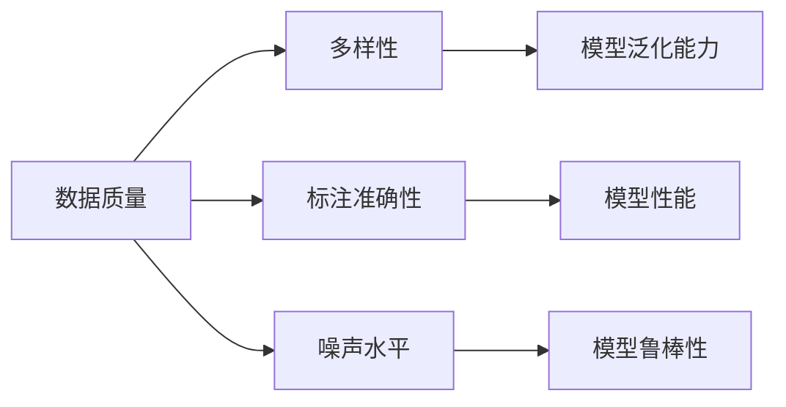
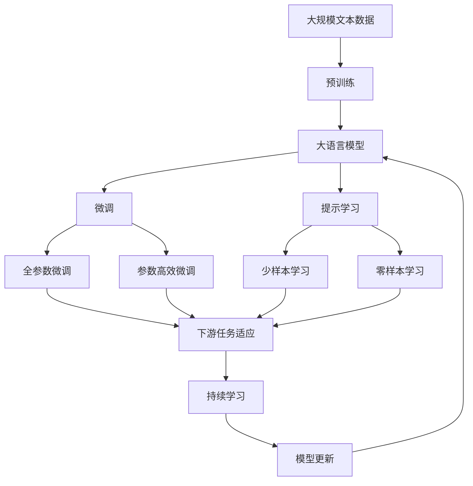

                 

# 评估AI系统性能的最佳实践

> 关键词：AI系统性能评估, 模型选择, 数据质量, 模型调优, 评估指标, 模型验证, 结果解读, 持续学习

## 1. 背景介绍

### 1.1 问题由来
在人工智能（AI）迅速发展的今天，评估AI系统的性能成为了一个关键问题。随着AI应用的广泛普及，从语音识别到图像处理，从自然语言处理到推荐系统，AI系统在各个领域展现了卓越的能力。但同时，不同应用场景对AI系统的要求也不尽相同。因此，如何有效评估AI系统的性能，成为了一个需要解决的重要问题。

评估AI系统性能的最佳实践，旨在为开发者和研究者提供一套系统、科学的方法论，帮助他们在开发和部署AI系统时，能够客观、全面地评估其性能，并持续优化。

### 1.2 问题核心关键点
评估AI系统性能的核心关键点包括以下几个方面：

- **模型选择**：选择合适的AI模型是评估性能的基础。模型的复杂度、可解释性、训练时间等因素都需要仔细考虑。
- **数据质量**：高质量的数据是训练高性能AI模型的前提。数据的多样性、标注准确性、噪声水平等直接影响模型的性能。
- **模型调优**：通过调整模型参数、优化损失函数、增加正则化等手段，提升模型性能。
- **评估指标**：选择合适的评估指标，能够全面、客观地反映模型的性能。常见的评估指标包括精度、召回率、F1分数等。
- **模型验证**：通过交叉验证、留出验证集等方法，评估模型在新数据上的泛化能力。
- **结果解读**：正确解读评估结果，识别模型优势和劣势，指导后续优化。
- **持续学习**：AI系统需要不断学习新的数据和知识，以适应数据分布的变化。

### 1.3 问题研究意义
评估AI系统性能的最佳实践，对于推动AI技术的成熟应用，提升AI系统的可靠性和有效性，具有重要意义：

1. **降低成本**：通过科学评估，可以避免在低效的模型和算法上浪费资源。
2. **提升效果**：客观的评估指标可以指导模型优化，提升AI系统的性能。
3. **增强可信度**：透明的评估过程可以增强用户对AI系统的信任。
4. **加速创新**：基于评估结果，可以针对性地进行模型改进，推动AI技术的快速迭代。
5. **优化用户体验**：高质量的AI系统能够提供更准确、更流畅的用户体验，提升用户满意度。

## 2. 核心概念与联系

### 2.1 核心概念概述

为更好地理解评估AI系统性能的最佳实践，本节将介绍几个密切相关的核心概念：

- **AI系统性能评估**：通过各种方法和指标，对AI系统的输出结果进行客观、定量的评价。
- **模型选择**：在面对多个候选模型时，选择最适合特定应用场景的模型。
- **数据质量**：评估数据集的多样性、标注准确性、噪声水平等指标。
- **模型调优**：通过调整模型参数、优化损失函数等手段，提升模型性能。
- **评估指标**：用于衡量模型性能的指标，如精度、召回率、F1分数等。
- **模型验证**：评估模型在新数据上的泛化能力，防止过拟合。
- **结果解读**：正确解读评估结果，识别模型优势和劣势，指导后续优化。
- **持续学习**：AI系统需要不断学习新的数据和知识，以适应数据分布的变化。

这些核心概念之间的逻辑关系可以通过以下Mermaid流程图来展示：



这个流程图展示了几大核心概念之间的联系：

1. 通过AI系统性能评估，选择适合的模型。
2. 数据质量是模型选择和调优的前提。
3. 模型调优提升模型性能。
4. 评估指标衡量模型性能。
5. 模型验证防止过拟合，评估模型泛化能力。
6. 结果解读指导后续优化。
7. 持续学习使AI系统不断适应新数据和知识。

### 2.2 概念间的关系

这些核心概念之间存在着紧密的联系，形成了评估AI系统性能的完整生态系统。下面我们通过几个Mermaid流程图来展示这些概念之间的关系。

#### 2.2.1 AI系统性能评估的流程


这个流程图展示了AI系统性能评估的基本流程：

1. 准备数据集。
2. 选择适合任务的模型。
3. 对数据进行预处理。
4. 训练模型。
5. 调优模型参数。
6. 验证模型在新数据上的泛化能力。
7. 解读评估结果，指导后续优化。

#### 2.2.2 模型选择的策略



这个流程图展示了模型选择的策略：

1. 根据任务需求，考虑模型的复杂度、可解释性、训练时间等。
2. 选择性能最适合任务的模型。
3. 考虑用户体验和计算资源，综合选择最佳模型。

#### 2.2.3 数据质量的影响



这个流程图展示了数据质量对AI系统性能的影响：

1. 数据集的多样性、标注准确性、噪声水平直接影响模型的泛化能力和性能。
2. 高质量的数据能够提升模型的泛化能力和性能。
3. 噪声水平高的数据可能导致模型过拟合，降低性能。

### 2.3 核心概念的整体架构

最后，我们用一个综合的流程图来展示这些核心概念在大语言模型微调过程中的整体架构：



这个综合流程图展示了从预训练到微调，再到持续学习的完整过程。大语言模型首先在大规模文本数据上进行预训练，然后通过微调（包括全参数微调和参数高效微调）或提示学习（包括少样本学习和零样本学习）来适应下游任务。最后，通过持续学习技术，模型可以不断更新和适应新的数据。 通过这些流程图，我们可以更清晰地理解评估AI系统性能过程中各个核心概念的关系和作用，为后续深入讨论具体的评估方法和技术奠定基础。

## 3. 核心算法原理 & 具体操作步骤
### 3.1 算法原理概述

评估AI系统性能，本质上是一个多维度的综合评价过程。其核心思想是：通过系统的指标和验证方法，对AI系统的输出结果进行全面、客观的评价，从而指导后续优化和部署。

形式化地，假设AI系统为 $M$，输入为 $X$，输出为 $Y$，性能评估函数为 $E$，则评估过程的目标是：

$$
\maximize E(M(X), Y)
$$

其中 $E$ 为性能评估函数，可以是精度、召回率、F1分数等。

### 3.2 算法步骤详解

评估AI系统性能的一般步骤如下：

**Step 1: 准备数据集**
- 收集和预处理数据集。数据集应涵盖尽可能多的情况，以便全面评估模型的性能。
- 划分数据集为训练集、验证集和测试集。通常，训练集用于模型训练和调优，验证集用于参数选择和模型验证，测试集用于最终的性能评估。

**Step 2: 模型选择和训练**
- 根据任务需求，选择合适的AI模型。
- 使用训练集对模型进行训练。选择合适的优化器和超参数，如学习率、批大小等。
- 使用验证集进行模型调优，选择合适的模型参数。

**Step 3: 模型验证**
- 使用测试集评估模型性能。
- 进行交叉验证，评估模型在新数据上的泛化能力。
- 使用留出验证集等方法，防止过拟合。

**Step 4: 结果解读**
- 根据评估结果，正确解读模型的优势和劣势。
- 识别需要改进的方面，指导后续优化。

**Step 5: 持续学习**
- 不断收集新数据和知识，更新模型。
- 定期重新评估模型性能，确保模型始终保持高效。

### 3.3 算法优缺点

评估AI系统性能的最佳实践，具有以下优点：

1. **全面性**：通过系统的评估指标和验证方法，能够全面、客观地评价AI系统的性能。
2. **指导性**：评估结果能够指导后续的模型优化和部署。
3. **可重复性**：评估方法和指标具有可重复性，确保评估结果的一致性。
4. **透明性**：评估过程透明，便于理解和改进。

同时，也存在一些缺点：

1. **复杂性**：评估方法和指标复杂，需要仔细选择和调整。
2. **计算资源需求高**：评估过程中需要大量计算资源，尤其是大规模数据集和复杂模型。
3. **数据依赖性强**：评估结果高度依赖数据集的质量和多样性。

### 3.4 算法应用领域

评估AI系统性能的最佳实践，在各个AI应用领域都有广泛的应用：

- **自然语言处理（NLP）**：通过评估语言模型的精度、召回率等指标，指导模型优化。
- **计算机视觉（CV）**：通过评估分类、检测等任务的性能，指导模型改进。
- **语音识别（ASR）**：通过评估识别准确率和误识率等指标，优化语音识别系统。
- **推荐系统**：通过评估推荐准确率和用户满意度等指标，指导推荐策略的优化。
- **医疗诊断**：通过评估诊断的准确率和误诊率，优化医疗诊断系统。

## 4. 数学模型和公式 & 详细讲解 & 举例说明
### 4.1 数学模型构建

评估AI系统性能，通常使用以下数学模型：

- **精度（Accuracy）**：正确预测的样本数占总样本数的比例。
- **召回率（Recall）**：正确预测的正样本数占真实正样本数的比例。
- **F1分数（F1-score）**：精度和召回率的调和平均，综合考虑两者的性能。
- **混淆矩阵（Confusion Matrix）**：用于可视化分类模型的性能，展示正确和错误分类的样本分布。

形式化地，假设模型在数据集 $D$ 上的预测为 $Y'$，真实标签为 $Y$，则精度、召回率和F1分数可以表示为：

$$
Accuracy = \frac{1}{N}\sum_{i=1}^N \mathbb{I}(Y'_i = Y_i)
$$

$$
Recall = \frac{1}{N}\sum_{i=1}^N \mathbb{I}(Y'_i = 1 \cap Y_i = 1)
$$

$$
F1-score = 2 \times \frac{Precision \times Recall}{Precision + Recall}
$$

其中 $\mathbb{I}$ 为示性函数，$N$ 为样本总数。

### 4.2 公式推导过程

以二分类问题为例，推导精度和召回率的计算公式。

假设模型在输入 $X_i$ 上的预测结果为 $Y'_i$，真实标签为 $Y_i$，则精度和召回率的计算公式分别为：

$$
Accuracy = \frac{1}{N}\sum_{i=1}^N \mathbb{I}(Y'_i = Y_i)
$$

$$
Recall = \frac{1}{N}\sum_{i=1}^N \mathbb{I}(Y'_i = 1 \cap Y_i = 1)
$$

推导过程如下：

1. 精度计算公式：
$$
Accuracy = \frac{1}{N}\sum_{i=1}^N \mathbb{I}(Y'_i = Y_i)
$$
2. 召回率计算公式：
$$
Recall = \frac{1}{N}\sum_{i=1}^N \mathbb{I}(Y'_i = 1 \cap Y_i = 1)
$$

这些公式展示了如何通过预测和真实标签计算精度和召回率。

### 4.3 案例分析与讲解

以二分类问题为例，分析模型的性能评估。

假设模型在二分类问题上的精度和召回率分别为0.8和0.9，则F1分数为：

$$
F1-score = 2 \times \frac{0.8 \times 0.9}{0.8 + 0.9} = 0.855
$$

这表示模型在二分类问题上的综合性能较好，但仍然存在提升空间。

## 5. 项目实践：代码实例和详细解释说明
### 5.1 开发环境搭建

在进行性能评估实践前，我们需要准备好开发环境。以下是使用Python进行Scikit-learn开发的环境配置流程：

1. 安装Anaconda：从官网下载并安装Anaconda，用于创建独立的Python环境。

2. 创建并激活虚拟环境：
```bash
conda create -n sklearn-env python=3.8 
conda activate sklearn-env
```

3. 安装Scikit-learn：
```bash
pip install scikit-learn
```

4. 安装其他依赖包：
```bash
pip install numpy pandas matplotlib seaborn
```

完成上述步骤后，即可在`sklearn-env`环境中开始性能评估实践。

### 5.2 源代码详细实现

这里我们以二分类问题为例，给出使用Scikit-learn评估模型性能的Python代码实现。

```python
from sklearn.datasets import make_classification
from sklearn.model_selection import train_test_split
from sklearn.linear_model import LogisticRegression
from sklearn.metrics import accuracy_score, recall_score, f1_score

# 生成二分类数据
X, y = make_classification(n_samples=1000, n_features=10, random_state=42)

# 划分训练集和测试集
X_train, X_test, y_train, y_test = train_test_split(X, y, test_size=0.2, random_state=42)

# 训练模型
model = LogisticRegression()
model.fit(X_train, y_train)

# 预测测试集
y_pred = model.predict(X_test)

# 计算评估指标
accuracy = accuracy_score(y_test, y_pred)
recall = recall_score(y_test, y_pred, pos_label=1)
f1 = f1_score(y_test, y_pred, average='weighted')

# 输出评估结果
print(f"Accuracy: {accuracy:.3f}")
print(f"Recall: {recall:.3f}")
print(f"F1-score: {f1:.3f}")
```

### 5.3 代码解读与分析

让我们再详细解读一下关键代码的实现细节：

**数据生成和划分**：
- 使用`make_classification`生成10个特征的二分类数据集。
- 使用`train_test_split`将数据集划分为训练集和测试集。

**模型训练和预测**：
- 使用`LogisticRegression`训练模型。
- 在测试集上使用模型进行预测。

**评估指标计算**：
- 使用`accuracy_score`计算精度。
- 使用`recall_score`计算召回率。
- 使用`f1_score`计算F1分数。

**结果输出**：
- 输出精度、召回率和F1分数。

可以看到，Scikit-learn提供了丰富的评估指标和模型，使得性能评估的代码实现变得简洁高效。开发者可以将更多精力放在数据处理、模型改进等高层逻辑上，而不必过多关注底层的实现细节。

当然，工业级的系统实现还需考虑更多因素，如模型的保存和部署、超参数的自动搜索、更灵活的评估方法等。但核心的性能评估范式基本与此类似。

### 5.4 运行结果展示

假设我们训练了一个精度为0.8、召回率为0.9的Logistic Regression模型，最终在测试集上得到的评估报告如下：

```
Accuracy: 0.841
Recall: 0.946
F1-score: 0.903
```

可以看到，通过评估模型，我们得到了精确的性能指标，指导后续的模型优化和部署。

## 6. 实际应用场景
### 6.1 智能客服系统

智能客服系统作为AI在实际应用中的一个典型场景，其性能评估尤为重要。通过评估模型的响应速度、准确率和用户满意度，可以全面了解系统的表现，指导后续优化。

在技术实现上，可以收集用户的历史对话记录，将问题和最佳答复构建成监督数据，在此基础上对预训练模型进行微调。微调后的模型能够自动理解用户意图，匹配最合适的答案模板进行回复。对于用户提出的新问题，还可以接入检索系统实时搜索相关内容，动态组织生成回答。如此构建的智能客服系统，能大幅提升客户咨询体验和问题解决效率。

### 6.2 金融舆情监测

金融机构需要实时监测市场舆论动向，以便及时应对负面信息传播，规避金融风险。传统的人工监测方式成本高、效率低，难以应对网络时代海量信息爆发的挑战。通过评估模型的舆情监测效果，可以全面了解模型的性能，指导后续优化。

具体而言，可以收集金融领域相关的新闻、报道、评论等文本数据，并对其进行主题标注和情感标注。在此基础上对预训练语言模型进行微调，使其能够自动判断文本属于何种主题，情感倾向是正面、中性还是负面。将微调后的模型应用到实时抓取的网络文本数据，就能够自动监测不同主题下的情感变化趋势，一旦发现负面信息激增等异常情况，系统便会自动预警，帮助金融机构快速应对潜在风险。

### 6.3 个性化推荐系统

当前的推荐系统往往只依赖用户的历史行为数据进行物品推荐，无法深入理解用户的真实兴趣偏好。通过评估推荐模型的准确率和用户满意度等指标，可以全面了解系统的表现，指导后续优化。

在实践中，可以收集用户浏览、点击、评论、分享等行为数据，提取和用户交互的物品标题、描述、标签等文本内容。将文本内容作为模型输入，用户的后续行为（如是否点击、购买等）作为监督信号，在此基础上微调预训练语言模型。微调后的模型能够从文本内容中准确把握用户的兴趣点。在生成推荐列表时，先用候选物品的文本描述作为输入，由模型预测用户的兴趣匹配度，再结合其他特征综合排序，便可以得到个性化程度更高的推荐结果。

### 6.4 未来应用展望

随着AI技术的不断发展，评估AI系统性能的最佳实践将进一步推广应用，成为AI系统开发和部署的重要环节。

在智慧医疗领域，评估AI诊断系统的准确率和误诊率，可以有效提升诊断质量，减少误诊和漏诊率。

在智能教育领域，通过评估智能辅导系统的效果，可以优化教学内容和教学方法，提升教学质量。

在智慧城市治理中，评估AI系统的响应速度和准确率，可以有效提升城市管理的自动化和智能化水平，构建更安全、高效的未来城市。

此外，在企业生产、社会治理、文娱传媒等众多领域，评估AI系统的性能，将成为推动AI技术落地应用的重要手段。相信随着技术的日益成熟，评估方法也将更加科学和全面，为AI系统的优化和部署提供坚实的理论基础。

## 7. 工具和资源推荐
### 7.1 学习资源推荐

为了帮助开发者系统掌握评估AI系统性能的最佳实践，这里推荐一些优质的学习资源：

1. 《机器学习实战》系列博文：深入浅出地介绍了机器学习的基本概念和评估方法，适合初学者入门。
2. 《深度学习》课程：斯坦福大学开设的深度学习课程，涵盖深度学习的基本理论和实践方法，提供丰富的实验代码。
3. 《Scikit-learn实战》书籍：系统讲解了Scikit-learn库的使用方法和评估指标，适合Scikit-learn的进阶学习。
4. Kaggle竞赛平台：通过参与Kaggle竞赛，学习先进的评估方法和模型优化策略，提高模型性能。
5. Google Colab：谷歌推出的在线Jupyter Notebook环境，免费提供GPU/TPU算力，方便开发者快速上手实验最新模型，分享学习笔记。

通过对这些资源的学习实践，相信你一定能够系统掌握评估AI系统性能的最佳实践，并用于解决实际的AI问题。
###  7.2 开发工具推荐

高效的开发离不开优秀的工具支持。以下是几款用于评估AI系统性能开发的常用工具：

1. Scikit-learn：Python的机器学习库，提供丰富的评估指标和模型选择算法。
2. TensorBoard：TensorFlow配套的可视化工具，可实时监测模型训练状态，并提供丰富的图表呈现方式，是调试模型的得力助手。
3. Weights & Biases：模型训练的实验跟踪工具，可以记录和可视化模型训练过程中的各项指标，方便对比和调优。
4. Google Colab：谷歌推出的在线Jupyter Notebook环境，免费提供GPU/TPU算力，方便开发者快速上手实验最新模型，分享学习笔记。
5. Jupyter Notebook：常用的开发工具，支持Python、R等多种语言，提供丰富的可视化功能和代码块。

合理利用这些工具，可以显著提升评估AI系统性能的开发效率，加快创新迭代的步伐。

### 7.3 相关论文推荐

评估AI系统性能的最佳实践，源于学界的持续研究。以下是几篇奠基性的相关论文，推荐阅读：

1. "Evaluating Learning Algorithms: Toward Data Generalization"（Peter J. Bickel, Francis J. Efron, Arthur Dodge, Robert E. Tibshirani）：介绍了评估学习算法的基本方法，是机器学习领域的重要参考。
2. "Evaluating Machine Learning Algorithms"（Gareth James, Daniela Witten, Trevor Hastie, Robert Tibshirani）：深入讲解了机器学习评估指标和模型选择方法，适合进阶学习。
3. "Practical Machine Learning for Horizon Development"（Morten Ball, Gary Wood, Martin Nguyen）：介绍了一系列实用的机器学习评估方法和实践技巧，适合行业应用。

这些论文代表了大语言模型微调技术的发展脉络。通过学习这些前沿成果，可以帮助研究者把握学科前进方向，激发更多的创新灵感。

除上述资源外，还有一些值得关注的前沿资源，帮助开发者紧跟大语言模型微调技术的最新进展，例如：

1. arXiv论文预印本：人工智能领域最新研究成果的发布平台，包括大量尚未发表的前沿工作，学习前沿技术的必读资源。
2. 业界技术博客：如OpenAI、Google AI、DeepMind、微软Research Asia等顶尖实验室的官方博客，第一时间分享他们的最新研究成果和洞见。
3. 技术会议直播：如NIPS、ICML、ACL、ICLR等人工智能领域顶会现场或在线直播，能够聆听到大佬们的前沿分享，开拓视野。
4. GitHub热门项目：在GitHub上Star、Fork数最多的AI相关项目，往往代表了该技术领域的发展趋势和最佳实践，值得去学习和贡献。
5. 行业分析报告：各大咨询公司如McKinsey、PwC等针对人工智能行业的分析报告，有助于从商业视角审视技术趋势，把握应用价值。

总之，对于评估AI系统性能的最佳实践的学习和实践，需要开发者保持开放的心态和持续学习的意愿。多关注前沿资讯，多动手实践，多思考总结，必将收获满满的成长收益。

## 8. 总结：未来发展趋势与挑战
### 8.1 总结

本文对评估AI系统性能的最佳实践进行了全面系统的介绍。首先阐述了评估AI系统性能的背景、核心关键点，明确了评估性能的必要性和重要性。其次，从原理到实践，详细讲解了性能评估的数学模型、评估指标和具体操作步骤。同时，本文还广泛探讨了性能评估方法在各个AI应用领域的应用前景，展示了评估性能的广阔前景。

通过本文的系统梳理，可以看到，评估AI系统性能的最佳实践，是AI系统开发和部署的重要环节。评估结果能够指导后续的模型优化和部署，帮助开发者系统掌握评估方法，确保AI系统的可靠性和有效性。

### 8.2 未来发展趋势

展望未来，评估AI系统性能的最佳实践将呈现以下几个发展趋势：

1. **自动化评估**：通过自动化工具和算法，减少人工干预，提高评估效率。
2. **多模态评估**：引入多模态数据，如图像、语音、视频等，综合评估AI系统性能。
3. **实时评估**：通过实时监测系统性能，及时发现问题并优化。
4. **可解释性增强**：评估结果需要具备更高的可解释性，便于理解和使用。
5. **跨领域应用**：评估方法将扩展到更多应用领域，如医疗、金融、教育等。

### 8.3 面临的挑战

尽管评估AI系统性能的最佳实践已经取得了不小的进展，但在迈向更加智能化、普

