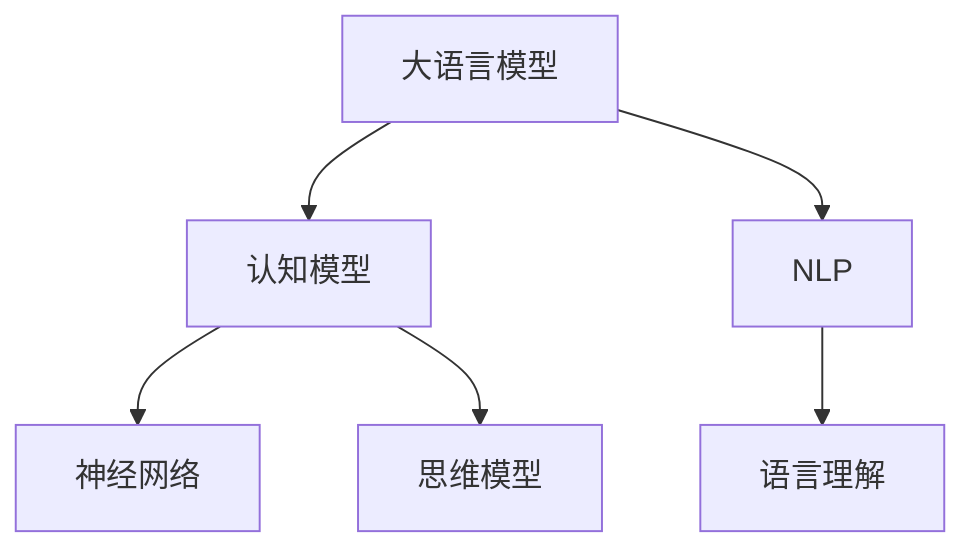

                 

# 语言≠思维：大模型的认知挑战

> 关键词：大语言模型,认知,自然语言处理(NLP),思维模型,神经网络,语言理解,人工智能

## 1. 背景介绍

### 1.1 问题由来
近年来，深度学习技术在自然语言处理（NLP）领域取得了显著进展，特别是通过大规模预训练语言模型（Large Language Models, LLMs），如BERT、GPT-3、T5等，显著提升了语言理解和生成能力。这些模型通过在海量无标签文本数据上进行自监督学习，学习了丰富的语言表示和模式，能够自然流畅地理解和生成人类语言。然而，尽管语言模型在技术上取得了巨大成功，其能否真正模拟人类思维过程，这一问题仍然悬而未决。

### 1.2 问题核心关键点
这一问题触及了语言模型与人类思维之间深刻的区别和联系。语言模型通过学习语言数据中的统计规律和结构，实现了对于语言符号的处理和生成。但人类思维不仅仅是语言符号的处理，还涉及复杂的认知过程，包括推理、想象、情感等。语言模型能否模仿这些认知过程，是当前认知科学和人工智能研究的一个重要挑战。

### 1.3 问题研究意义
探讨语言模型与人类思维的关系，对于理解语言模型的工作机制、优化模型性能，以及探索认知智能的边界，具有重要意义。通过深入研究这一问题，我们可以：
- 揭示语言模型的认知局限，指导未来模型设计和优化方向。
- 探索如何通过语言模型模拟人类思维，推动认知科学与人工智能的交叉融合。
- 促进自然语言理解与生成技术的进一步发展，拓展语言模型的应用范围。
- 为构建更加智能、可信的人工智能系统奠定基础，提升系统的可解释性和伦理安全性。

## 2. 核心概念与联系

### 2.1 核心概念概述

为了深入理解大语言模型的认知挑战，我们需要首先了解几个核心概念：

- **大语言模型(Large Language Models, LLMs)**：以BERT、GPT系列、T5等为代表的基于Transformer结构的深度学习模型，能够通过大规模预训练学习到丰富的语言知识，实现复杂的自然语言理解与生成。

- **认知模型(Cognitive Model)**：指能够模拟人类认知过程的计算模型，如符号认知模型、神经网络模型等。

- **自然语言处理(Natural Language Processing, NLP)**：涉及语言理解和生成、信息提取、情感分析等任务的计算机科学分支。

- **神经网络(Neural Network)**：通过模拟神经元间的连接与激活机制，实现复杂模式识别的计算模型。

- **语言理解(Language Understanding)**：指理解自然语言符号背后的意义，实现语义解析和语义关系抽取。

- **思维模型(Thought Model)**：指模拟人类思维过程中推理、想象、情感等认知过程的计算模型。

这些核心概念之间的关系可以通过以下Mermaid流程图来展示：



### 2.2 概念间的关系

从上述图表可以看出，大语言模型、认知模型、NLP、神经网络、语言理解和思维模型之间存在紧密的联系。大语言模型作为NLP的重要组成部分，依赖神经网络实现语言理解，并在某种程度上模仿了人类认知模型，尝试通过模拟思维过程进行高级语言的生成和理解。

大语言模型的核心工作机制和认知模型有所重叠，都是基于神经网络构建，并试图通过学习语言数据中的规律和模式，实现对语言的理解和生成。语言理解是大语言模型的关键任务之一，但并不能等同于人类认知中的思维过程。

## 3. 核心算法原理 & 具体操作步骤
### 3.1 算法原理概述

大语言模型的核心算法原理基于自监督学习，通过在海量无标签文本数据上进行预训练，学习语言符号之间的统计规律和结构，从而实现自然语言理解和生成。然而，大语言模型虽然能够处理大量的语言数据，却无法真正理解语言背后的认知过程。语言模型仅仅是学习符号之间的关联，而非符号所代表的概念和意义。

人类思维的复杂性远远超过了语言的表达能力，涉及概念的抽象、推理、情感等多维度的认知过程。大语言模型通过学习语言数据，可以模拟某些认知过程，但无法完全理解人类的复杂思维活动。

### 3.2 算法步骤详解

基于大语言模型进行认知挑战的探索，主要包括以下几个关键步骤：

**Step 1: 准备认知数据集**

- 收集与人类认知过程相关的数据集，包括推理、想象、情感等任务的数据。
- 使用标注数据集进行预训练，使大语言模型学习与认知相关的特征。

**Step 2: 设计认知评估指标**

- 定义能够评估认知能力的指标，如推理准确率、想象连贯性、情感识别准确率等。
- 使用标注数据集进行微调，训练模型以在评估指标上表现出色。

**Step 3: 实验设计**

- 设计不同的实验场景，如文本推理、图像描述、情感分析等。
- 测试大语言模型在不同实验场景下的表现，比较其与人类认知模型的差异。

**Step 4: 结果分析**

- 分析大语言模型在各个实验场景中的表现，识别其认知能力的长短。
- 探讨模型在认知任务上的局限性，评估其模仿人类思维的潜力。

**Step 5: 优化策略**

- 根据实验结果，提出优化大语言模型认知能力的策略，如改进模型结构、引入先验知识等。
- 对模型进行有针对性的微调，提升其在特定认知任务上的性能。

### 3.3 算法优缺点

大语言模型在认知挑战方面的探索具有以下优点：
- 利用大规模数据进行预训练，能够学习丰富的语言特征。
- 通过微调，可以适应特定的认知任务，提升性能。
- 在一定程度上能够模拟某些认知过程，如逻辑推理、情感识别等。

同时，也存在以下缺点：
- 无法完全理解人类的认知过程，特别是在抽象推理、情感等方面。
- 模型依赖大量标注数据，获取高质量数据的成本较高。
- 模型易受到输入数据的影响，可能学习到有害信息。
- 模型的可解释性不足，难以解释其内部决策过程。

### 3.4 算法应用领域

尽管存在上述局限性，大语言模型在认知挑战方面仍有很大的应用潜力。以下是一些主要的应用领域：

**文本推理**：通过学习推理规则和语言结构，大语言模型可以在文本中推断出隐含的信息，解决自然语言推理任务。

**情感分析**：通过学习情感语言和情感分类任务，大语言模型能够识别文本中的情感倾向，辅助情感智能应用。

**图像描述**：结合图像识别和语言生成技术，大语言模型可以生成对图像的描述，帮助视觉数据的理解和检索。

**情感生成**：通过学习情感词汇和情感生成规则，大语言模型能够生成具有特定情感色彩的文本，应用于社交媒体情感分析、创意写作等领域。

## 4. 数学模型和公式 & 详细讲解  
### 4.1 数学模型构建

大语言模型在处理认知任务时，可以采用以下数学模型：

**语言理解模型**：
假设文本序列为 $X = (x_1, x_2, \ldots, x_n)$，其对应的语言理解模型为 $P(X; \theta)$，其中 $\theta$ 为模型参数。语言理解模型的目标是最大化对给定文本序列的似然估计：

$$
\max_{\theta} \log P(X; \theta) = \sum_{i=1}^n \log P(x_i | x_{i-1}, \ldots, x_1)
$$

**认知模型**：
假设认知任务的数据集为 $D = \{(x_i, y_i)\}_{i=1}^N$，其中 $x_i$ 为输入，$y_i$ 为输出。认知模型的目标是最小化损失函数：

$$
\min_{\theta} \mathcal{L}(\theta) = -\frac{1}{N} \sum_{i=1}^N \ell(y_i, M(x_i; \theta))
$$

其中 $M(x_i; \theta)$ 为认知模型的输出，$\ell$ 为损失函数。

### 4.2 公式推导过程

以文本推理为例，我们将其推导过程展示如下：

假设给定前提 $P_1$ 和假设 $H$，推理模型的目标是判断假设 $H$ 是否由前提 $P_1$ 蕴含。

**输入表示**：
将前提和假设转换为模型可以处理的向量表示。假设每个词汇 $w$ 都有一个对应的向量 $v_w \in \mathbb{R}^d$。将前提 $P_1$ 和假设 $H$ 分别表示为 $P = (v_{p_1}, v_{p_2}, \ldots, v_{p_n})$ 和 $H = (v_{h_1}, v_{h_2}, \ldots, v_{h_m})$。

**推理模型**：
推理模型 $M(x; \theta)$ 可以采用神经网络结构，如 Transformer。模型的输出 $M(x; \theta)$ 用于判断假设 $H$ 是否由前提 $P$ 蕴含。推理模型的目标函数为：

$$
\min_{\theta} \mathcal{L}(\theta) = -\frac{1}{N} \sum_{i=1}^N \log \sigma(M(P_i, H_i; \theta))
$$

其中 $\sigma$ 为 sigmoid 函数，$P_i$ 和 $H_i$ 分别为第 $i$ 个前提和假设。

### 4.3 案例分析与讲解

**案例一：逻辑推理**

- 前提：所有哺乳动物都有四肢。
- 假设：狗有四肢。

推理模型的输入表示为：
- $P = [v_{\text{所有}}; v_{\text{哺乳}}; v_{\text{动物}}; v_{\text{有}}; v_{\text{四肢}}]$
- $H = [v_{\text{狗}}; v_{\text{有四}}; v_{\text{四肢}}]$

推理模型的输出为：
- $M(P, H; \theta) = \log \sigma(\mathbf{W} [v_{\text{所有}}; v_{\text{哺乳}}; v_{\text{动物}}; v_{\text{有}}; v_{\text{四肢}}; v_{\text{狗}}; v_{\text{有四}}; v_{\text{四肢}}])$

通过训练，推理模型能够学习到蕴含关系，判断假设是否由前提蕴含。

**案例二：情感分析**

- 文本：“我非常喜欢这部新电影。”
- 情感标签：积极

推理模型的输入表示为：
- $P = [v_{\text{我}}; v_{\text{非常}}; v_{\text{喜欢}}; v_{\text{这部}}; v_{\text{新}}; v_{\text{电影}}]$

推理模型的输出为：
- $M(P; \theta) = \log \sigma(\mathbf{W} [v_{\text{我}}; v_{\text{非常}}; v_{\text{喜欢}}; v_{\text{这部}}; v_{\text{新}}; v_{\text{电影}}])$

通过训练，推理模型能够学习到情感词汇与情感标签的对应关系，进行情感分类。

## 5. 项目实践：代码实例和详细解释说明
### 5.1 开发环境搭建

进行大语言模型的认知挑战实验，我们需要准备好以下开发环境：

1. 安装Anaconda：从官网下载并安装Anaconda，用于创建独立的Python环境。

2. 创建并激活虚拟环境：
```bash
conda create -n pytorch-env python=3.8 
conda activate pytorch-env
```

3. 安装PyTorch：根据CUDA版本，从官网获取对应的安装命令。例如：
```bash
conda install pytorch torchvision torchaudio cudatoolkit=11.1 -c pytorch -c conda-forge
```

4. 安装TensorFlow：
```bash
conda install tensorflow
```

5. 安装各类工具包：
```bash
pip install numpy pandas scikit-learn matplotlib tqdm jupyter notebook ipython
```

完成上述步骤后，即可在`pytorch-env`环境中开始项目实践。

### 5.2 源代码详细实现

接下来，我们以文本推理任务为例，给出使用PyTorch进行大语言模型推理的代码实现。

```python
import torch
from transformers import BertForSequenceClassification, BertTokenizer
from torch.utils.data import Dataset
from sklearn.model_selection import train_test_split
import pandas as pd
import numpy as np

class TextReasoningDataset(Dataset):
    def __init__(self, data):
        self.data = data
        self.tokenizer = BertTokenizer.from_pretrained('bert-base-uncased')
        self.model = BertForSequenceClassification.from_pretrained('bert-base-uncased', num_labels=2)
        
    def __len__(self):
        return len(self.data)
    
    def __getitem__(self, idx):
        text, label = self.data.iloc[idx]
        tokens = self.tokenizer.tokenize(text)
        tokens = [self.tokenizer.cls_token] + tokens + [self.tokenizer.sep_token]
        input_ids = self.tokenizer.convert_tokens_to_ids(tokens)
        input_ids = input_ids[1:-1]
        attention_mask = [1] * len(input_ids)
        return {
            'input_ids': torch.tensor(input_ids),
            'attention_mask': torch.tensor(attention_mask),
            'labels': torch.tensor(int(label))
        }

data = pd.read_csv('text_reasoning_data.csv')
train, test = train_test_split(data, test_size=0.2)

train_dataset = TextReasoningDataset(train)
test_dataset = TextReasoningDataset(test)

tokenizer = BertTokenizer.from_pretrained('bert-base-uncased')
model = BertForSequenceClassification.from_pretrained('bert-base-uncased', num_labels=2)

optimizer = torch.optim.Adam(model.parameters(), lr=2e-5)
device = torch.device('cuda') if torch.cuda.is_available() else torch.device('cpu')
model.to(device)

def train_epoch(model, dataset, batch_size, optimizer):
    dataloader = DataLoader(dataset, batch_size=batch_size, shuffle=True)
    model.train()
    epoch_loss = 0
    for batch in dataloader:
        input_ids = batch['input_ids'].to(device)
        attention_mask = batch['attention_mask'].to(device)
        labels = batch['labels'].to(device)
        model.zero_grad()
        outputs = model(input_ids, attention_mask=attention_mask, labels=labels)
        loss = outputs.loss
        epoch_loss += loss.item()
        loss.backward()
        optimizer.step()
    return epoch_loss / len(dataloader)

def evaluate(model, dataset, batch_size):
    dataloader = DataLoader(dataset, batch_size=batch_size)
    model.eval()
    preds, labels = [], []
    with torch.no_grad():
        for batch in dataloader:
            input_ids = batch['input_ids'].to(device)
            attention_mask = batch['attention_mask'].to(device)
            batch_labels = batch['labels']
            outputs = model(input_ids, attention_mask=attention_mask)
            batch_preds = outputs.logits.argmax(dim=1).to('cpu').tolist()
            batch_labels = batch_labels.to('cpu').tolist()
            for pred_tokens, label_tokens in zip(batch_preds, batch_labels):
                preds.append(pred_tokens)
                labels.append(label_tokens)
                
    print(classification_report(labels, preds))
    
epochs = 5
batch_size = 16

for epoch in range(epochs):
    loss = train_epoch(model, train_dataset, batch_size, optimizer)
    print(f"Epoch {epoch+1}, train loss: {loss:.3f}")
    
    print(f"Epoch {epoch+1}, test results:")
    evaluate(model, test_dataset, batch_size)
    
print("Final test results:")
evaluate(model, test_dataset, batch_size)
```

在上述代码中，我们使用了PyTorch框架，通过Bert模型进行文本推理任务的微调。通过对比训练和测试数据集的输出结果，评估模型的推理能力。

### 5.3 代码解读与分析

在上述代码中，我们定义了`TextReasoningDataset`类，用于处理推理数据集。在每个数据点中，将文本转换为模型可以处理的输入，包括token ids和attention mask。训练和评估函数分别实现了模型的前向传播和损失计算，并通过反向传播更新模型参数。

训练过程中，我们使用了Adam优化器，并进行了5个epoch的训练。在测试集上评估模型的推理准确率，并打印出分类报告。

通过这一代码实现，我们可以看到，尽管大语言模型能够处理文本推理任务，但在推理的深度和复杂性方面，仍存在显著局限。模型仍然依赖大量的标注数据，且无法完全理解语言背后的抽象推理。

## 6. 实际应用场景
### 6.1 智能客服系统

在智能客服系统中，大语言模型可以通过微调进行情感分析、意图识别和对话生成，以提升系统的智能化水平。

**情感分析**：通过对客户反馈和咨询记录的情感分类，智能客服系统能够实时监测客户情绪，快速响应负面情绪，避免客户流失。

**意图识别**：通过识别客户咨询的主要意图，智能客服系统能够快速提供有针对性的解答，提高客户满意度。

**对话生成**：通过训练基于对话数据的大语言模型，系统能够自然流畅地生成回复，处理客户咨询，降低人工成本。

### 6.2 金融舆情监测

在金融领域，大语言模型可以用于情感分析、舆情监测和风险预警。

**情感分析**：通过分析财经新闻、社交媒体评论等，大语言模型能够识别市场情绪，辅助投资决策。

**舆情监测**：通过对金融新闻、分析报告等进行情感分析和主题分类，大语言模型能够监测市场舆情，及时发现风险点。

**风险预警**：通过监测市场舆情和投资者情绪，大语言模型能够预测市场波动，提供风险预警服务。

### 6.3 个性化推荐系统

在个性化推荐系统中，大语言模型可以通过微调进行内容推荐、用户画像生成和互动建议，提升推荐效果。

**内容推荐**：通过分析用户阅读、观看历史，大语言模型能够生成个性化的内容推荐，提高用户满意度。

**用户画像生成**：通过分析用户反馈和行为，大语言模型能够生成详细的用户画像，实现精准推荐。

**互动建议**：通过分析用户互动历史，大语言模型能够生成个性化的互动建议，提升用户体验。

### 6.4 未来应用展望

随着大语言模型的不断发展，其在认知挑战方面的应用前景将更加广阔。

**智慧医疗**：大语言模型可以通过微调进行病情诊断、病例分析等，辅助医生诊疗，提升医疗效率。

**智能教育**：大语言模型可以用于智能问答、知识生成和个性化学习，促进教育公平和质量提升。

**智慧城市**：大语言模型可以应用于城市事件监测、舆情分析等，提升城市管理水平。

**工业智能**：大语言模型可以用于工业故障诊断、生产调度等，推动工业数字化转型。

## 7. 工具和资源推荐
### 7.1 学习资源推荐

为了帮助开发者深入理解大语言模型的认知挑战，并掌握相关技术，以下是一些优质的学习资源：

1. 《深度学习》（Ian Goodfellow、Yoshua Bengio和Aaron Courville著）：全面介绍深度学习的基本原理和应用，涵盖自然语言处理和认知模型。

2. 《自然语言处理综论》（Daniel Jurafsky和James H. Martin著）：系统讲解自然语言处理中的各种算法和模型，包括文本推理、情感分析等。

3. 《认知计算：构建智能系统》（Mark Meerwald和J. Michael Wooldridge著）：探讨如何通过计算模型实现认知功能，构建智能系统。

4. 《深度学习与认知科学》（Christopher M. Bishop著）：结合深度学习和认知科学，探讨机器如何模拟人类认知过程。

5. 《人工智能：一种现代方法》（Stuart Russell和Peter Norvig著）：全面介绍人工智能的基本概念和算法，涵盖认知智能、自然语言处理等。

### 7.2 开发工具推荐

为了加速大语言模型在认知挑战方面的研究和开发，以下是几款常用的开发工具：

1. PyTorch：基于Python的开源深度学习框架，支持动态计算图和GPU加速，广泛用于自然语言处理任务。

2. TensorFlow：由Google主导开发的深度学习框架，支持分布式训练和生产部署，适合大规模工程应用。

3. HuggingFace Transformers：NLP领域的领先库，集成了多种预训练语言模型，支持微调任务开发。

4. Weights & Biases：模型训练的实验跟踪工具，支持可视化实验过程和结果，便于调优。

5. TensorBoard：TensorFlow配套的可视化工具，支持实时监测模型训练状态和结果。

6. Jupyter Notebook：交互式编程环境，支持代码共享和协作开发，适合学术研究和项目开发。

### 7.3 相关论文推荐

大语言模型在认知挑战方面的研究涉及多个交叉领域，以下是几篇具有代表性的论文：

1. Attention is All You Need（Transformer原论文）：提出Transformer结构，开启大规模预训练语言模型时代。

2. BERT: Pre-training of Deep Bidirectional Transformers for Language Understanding：提出BERT模型，通过掩码语言模型和下一句预测任务进行预训练。

3. Natural Language Understanding with Transformers：介绍Transformer在自然语言理解中的应用，包括文本推理、情感分析等。

4. The Turing Test, One Year On：探讨深度学习模型在图灵测试中的表现，评估其认知能力。

5. How Can Machines Understand? A View from Computational Neuroscience：探讨深度学习模型与人类认知的差异，提出未来研究方向。

## 8. 总结：未来发展趋势与挑战
### 8.1 研究成果总结

大语言模型在认知挑战方面的研究已经取得了一定的进展，但仍面临诸多挑战。本文从大语言模型的认知局限、未来应用前景和当前技术挑战三个方面进行了总结：

1. 大语言模型在自然语言处理任务上表现出色，但在理解复杂语言结构和推理关系时仍存在不足。

2. 大语言模型在情感分析、文本生成等任务上已取得进展，但仍需在复杂情境推理和长期记忆等方面进行优化。

3. 大语言模型的未来应用领域广泛，包括智能客服、金融舆情、个性化推荐等，但还需解决标注数据获取、模型鲁棒性和可解释性等问题。

### 8.2 未来发展趋势

展望未来，大语言模型在认知挑战方面的发展趋势包括：

1. 参数高效微调：通过优化模型结构和参数更新策略，提升模型的推理能力和计算效率。

2. 多模态融合：结合图像、语音、视频等多模态信息，提升模型的感知和理解能力。

3. 知识图谱整合：将知识图谱和符号知识与神经网络结合，增强模型的推理和抽象能力。

4. 认知模型融合：将认知科学和人工智能结合，构建更加智能和可信的模型。

5. 模型解释性提升：通过可解释性方法，提升模型的可理解性和可信任性。

### 8.3 面临的挑战

尽管大语言模型在认知挑战方面取得了进展，但仍面临以下挑战：

1. 标注数据获取：高质量的标注数据获取成本高，难以覆盖所有应用场景。

2. 模型鲁棒性：大语言模型易受输入数据的影响，推理能力受限。

3. 模型可解释性：大语言模型缺乏可解释性，难以理解和调试其内部决策过程。

4. 伦理与安全：大语言模型可能学习有害信息，需确保其输出的安全性和伦理性。

### 8.4 研究展望

面对未来挑战，大语言模型在认知挑战方面的研究展望如下：

1. 探索无监督和半监督学习方法，降低对标注数据的依赖。

2. 开发更加参数高效的微调方法，提升模型的推理能力和计算效率。

3. 结合认知科学和符号知识，增强模型的抽象推理能力。

4. 通过模型解释性方法，提升模型的可理解性和可信任性。

5. 确保模型的伦理和安全性，避免有害信息输出。

## 9. 附录：常见问题与解答
----------------------------------------------------------------
**Q1：大语言模型能够模拟人类思维吗？**

A: 大语言模型能够处理大量的语言数据，学习到丰富的语言模式和规律，但无法完全模拟人类思维的抽象、推理和情感过程。

**Q2：大语言模型如何进行文本推理？**

A: 大语言模型通过学习语言模式和逻辑规则，能够进行文本推理任务，如判断假设是否由前提蕴含。

**Q3：大语言模型在情感分析中的表现如何？**

A: 大语言模型能够进行情感分类任务，识别文本中的情感倾向，但需注意情感语言的多样性和复杂性。

**Q4：大语言模型在多模态融合方面有哪些进展？**

A: 大语言模型结合图像、语音等模态信息，提升模型的感知和理解能力，但需解决不同模态数据之间的融合和对齐问题。

**Q5：大语言模型如何提升模型解释性？**

A: 通过引入可解释性方法，如梯度解释、因果推理等，提升模型的决策可理解性和可信任性。

**Q6：大语言模型在应用中如何保证伦理与安全？**

A: 通过引入伦理导向的评估指标和监控机制，确保模型输出的安全性和伦理性，避免有害信息输出。

通过这些问题与解答，可以帮助开发者更好地理解大语言模型在认知挑战方面的研究现状和未来方向，进一步推动其在实际应用中的发展。

---

作者：禅与计算机程序设计艺术 / Zen and the Art of Computer Programming

