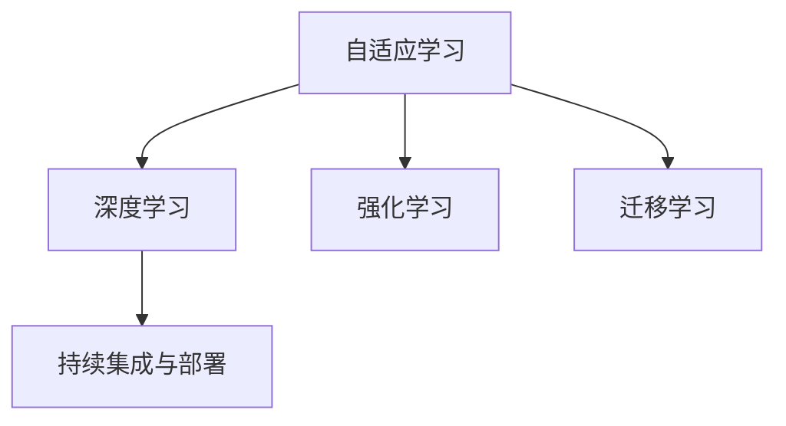
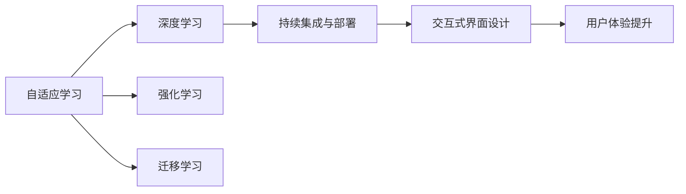

                 

# 软件 2.0 的应用：从实验室走向现实

软件 2.0，即第二代软件，是一种建立在软件即服务(Software as a Service, SaaS)基础上，通过智能算法和机器学习持续自我进化的新型软件形态。与传统的基于规则和脚本的软件不同，软件 2.0 能够自主学习、自主进化、自我适应，为各行各业带来了颠覆性的变革。本文将从背景介绍、核心概念与联系、核心算法原理与具体操作步骤、实际应用场景等多个维度，深入探讨软件 2.0 的应用，以及如何从实验室走向现实。

## 1. 背景介绍

### 1.1 问题由来
随着人工智能技术的不断进步，软件 2.0 的概念应运而生。与传统的软件开发模式相比，软件 2.0 更加注重智能算法和数据驱动，能够实现更快速、更高效、更智能的软件迭代和进化。软件 2.0 的出现，不仅大幅降低了软件开发的成本和复杂度，还为行业带来了全新的业务模式和应用场景。

然而，尽管软件 2.0 具有诸多优势，但从实验室走向现实的过程仍面临诸多挑战。如何确保软件 2.0 的安全性、稳定性和可靠性，如何应对不断变化的市场需求，如何实现更高效的开发和部署，都是亟需解决的问题。

### 1.2 问题核心关键点
软件 2.0 的核心关键点包括：
- **自适应学习**：能够自主学习并适应新环境和新数据，实现智能进化。
- **多模态数据处理**：能够处理和融合多种类型的数据，实现更全面的分析和决策。
- **模型融合与集成**：能够融合多种模型和算法，实现更优的性能和更广的覆盖范围。
- **持续集成与部署**：能够实现自动化的开发、测试和部署，提高开发效率。
- **交互式界面设计**：能够提供更智能、更友好的用户交互界面，提升用户体验。

这些关键点构成了软件 2.0 的核心应用范式，使其在实际应用中能够发挥出强大的潜力。

## 2. 核心概念与联系

### 2.1 核心概念概述

软件 2.0 涉及多个核心概念，包括：
- **自适应学习**：通过算法和模型实现对环境的自主学习，从而提升系统的智能性和适应性。
- **深度学习**：一种基于神经网络的机器学习方法，能够实现对复杂模式的识别和预测。
- **强化学习**：一种通过与环境互动，不断优化策略以最大化奖励的机器学习方法。
- **迁移学习**：通过将已有知识应用于新任务，提高模型的泛化能力和学习效率。
- **持续集成与部署(CI/CD)**：通过自动化流程实现代码的快速集成、测试和部署，提高开发效率和系统可靠性。

这些核心概念之间存在着紧密的联系，形成了软件 2.0 的技术框架。下面通过 Mermaid 流程图展示这些概念之间的关系：



这个流程图展示了自适应学习与其他核心概念的联系，表明它们共同构成了软件 2.0 的技术基础。

### 2.2 概念间的关系

这些核心概念之间的关系更为复杂，需要通过多层次的交互和融合才能实现软件 2.0 的全部功能。以下图表进一步展示了这些概念之间的联系：



这个图表展示了自适应学习与其他核心概念的交互，表明它们共同构成了软件 2.0 的整体应用框架。

## 3. 核心算法原理 & 具体操作步骤
### 3.1 算法原理概述

软件 2.0 的核心算法原理包括自适应学习、深度学习、强化学习和迁移学习等。下面分别介绍这些算法的原理：

#### 3.1.1 自适应学习
自适应学习是指软件 2.0 能够根据环境的变化，自主调整其行为和策略，以适应新环境和新数据。其核心在于利用深度学习模型进行数据驱动的决策，并通过强化学习不断优化决策策略。

#### 3.1.2 深度学习
深度学习是指通过构建多层神经网络，实现对复杂模式和规律的识别和预测。在软件 2.0 中，深度学习模型通常用于数据分析、特征提取和决策制定。

#### 3.1.3 强化学习
强化学习是指通过与环境互动，不断优化决策策略以最大化奖励。在软件 2.0 中，强化学习用于系统自适应和自主决策，以应对复杂多变的环境和需求。

#### 3.1.4 迁移学习
迁移学习是指将已有知识应用于新任务，提高模型的泛化能力和学习效率。在软件 2.0 中，迁移学习用于新任务和新环境的快速适应和应用。

### 3.2 算法步骤详解

软件 2.0 的开发和部署流程通常包括以下步骤：
1. **数据采集与预处理**：收集和处理用于模型训练的数据，包括数据清洗、特征提取等。
2. **模型训练与优化**：使用深度学习、强化学习和迁移学习等技术，对模型进行训练和优化，提高模型的性能和适应性。
3. **持续集成与部署**：通过持续集成与部署流程，实现代码的快速集成、测试和部署，提高开发效率和系统可靠性。
4. **交互式界面设计**：设计智能、友好的用户界面，提升用户体验。
5. **模型评估与优化**：定期评估模型的性能，并进行优化和调整。

### 3.3 算法优缺点

软件 2.0 的算法具有以下优点：
- **高效性**：通过算法和模型的自动化处理，大幅提高开发和部署效率。
- **智能性**：通过自适应学习、深度学习和强化学习等技术，实现系统自主进化和智能决策。
- **灵活性**：通过迁移学习等技术，实现跨任务和跨环境的快速适应。

同时，软件 2.0 也存在一些缺点：
- **依赖数据**：算法和模型的效果依赖于高质量的数据，数据获取和处理成本较高。
- **模型复杂性**：深度学习和强化学习等算法模型较为复杂，需要较强的技术实力进行开发和维护。
- **安全性与可靠性**：系统依赖算法和模型，容易出现算法偏见和模型失效等问题，需要加强安全和可靠性保障。

### 3.4 算法应用领域

软件 2.0 在多个领域具有广泛的应用，包括但不限于：
- **金融科技**：通过自适应学习和深度学习，实现智能投资和风险管理。
- **医疗健康**：通过迁移学习和强化学习，实现智能诊断和个性化治疗。
- **智能制造**：通过深度学习和持续集成，实现智能生产和管理。
- **智能客服**：通过交互式界面设计和自适应学习，实现智能客服和客户管理。
- **自动驾驶**：通过深度学习和强化学习，实现智能导航和决策。

## 4. 数学模型和公式 & 详细讲解 & 举例说明

### 4.1 数学模型构建

软件 2.0 的数学模型构建通常包括以下几个步骤：
1. **数据表示**：将原始数据表示为模型可以处理的形式，如向量、矩阵等。
2. **模型选择**：选择合适的模型，如神经网络、决策树等。
3. **损失函数定义**：定义模型的损失函数，用于衡量模型预测与真实标签之间的差异。
4. **优化算法选择**：选择适合的优化算法，如梯度下降、Adam等。

以深度学习模型为例，其数学模型可以表示为：

$$
\begin{aligned}
\min_{\theta} & \frac{1}{N}\sum_{i=1}^{N}\ell(M_{\theta}(x_i),y_i) \\
\text{s.t.} & M_{\theta}(x) = \mathbf{W}x + b
\end{aligned}
$$

其中 $\theta$ 为模型参数，$M_{\theta}(x)$ 为模型输出，$x$ 为输入数据，$y$ 为标签，$\ell$ 为损失函数。

### 4.2 公式推导过程

以深度学习模型为例，其公式推导过程如下：
1. **前向传播**：将输入数据 $x$ 经过多个神经网络层，得到输出 $y$。
2. **损失函数计算**：将模型输出 $y$ 与真实标签 $y^*$ 进行对比，计算损失函数 $\ell(y,y^*)$。
3. **梯度计算**：通过链式法则计算损失函数对模型参数 $\theta$ 的梯度 $\nabla_{\theta}\ell(y,y^*)$。
4. **反向传播**：将梯度反向传播，更新模型参数 $\theta$。

### 4.3 案例分析与讲解

以金融科技领域为例，金融市场数据具有高维度、非线性和复杂性等特点。使用深度学习模型进行分析，可以显著提高模型的准确性和泛化能力。

以股票价格预测为例，使用深度学习模型进行预测，可以通过多模态数据融合、时间序列分析和自适应学习等技术，实现更准确的股票价格预测。

## 5. 项目实践：代码实例和详细解释说明

### 5.1 开发环境搭建

在进行软件 2.0 开发前，我们需要准备好开发环境。以下是使用Python进行TensorFlow开发的環境配置流程：

1. 安装Anaconda：从官网下载并安装Anaconda，用于创建独立的Python环境。

2. 创建并激活虚拟环境：
```bash
conda create -n tf-env python=3.8 
conda activate tf-env
```

3. 安装TensorFlow：根据CUDA版本，从官网获取对应的安装命令。例如：
```bash
conda install tensorflow -c pytorch -c conda-forge
```

4. 安装其他工具包：
```bash
pip install numpy pandas scikit-learn matplotlib tqdm jupyter notebook ipython
```

完成上述步骤后，即可在`tf-env`环境中开始软件 2.0 的开发。

### 5.2 源代码详细实现

这里以金融科技领域的股票价格预测为例，给出使用TensorFlow进行深度学习模型开发的PyTorch代码实现。

```python
import tensorflow as tf
from tensorflow import keras
import numpy as np
import pandas as pd
from sklearn.model_selection import train_test_split

# 加载数据集
df = pd.read_csv('stock_price.csv')

# 数据预处理
df['date'] = pd.to_datetime(df['date'])
df = df.set_index('date')

# 分割数据集
train_df, test_df = train_test_split(df, test_size=0.2)

# 构建模型
model = keras.Sequential([
    keras.layers.LSTM(64, input_shape=(train_df.shape[1]-1, 1)),
    keras.layers.Dense(1)
])

# 定义损失函数和优化器
loss_fn = tf.keras.losses.MeanSquaredError()
optimizer = tf.keras.optimizers.Adam()

# 训练模型
model.compile(optimizer=optimizer, loss=loss_fn)
model.fit(train_df.values, train_df['close'].shift(1), epochs=50, verbose=2)

# 评估模型
test_loss = model.evaluate(test_df.values, test_df['close'].shift(1))
print('Test loss:', test_loss)
```

以上代码展示了使用TensorFlow进行LSTM模型训练的完整流程。可以看到，TensorFlow提供了丰富的API和工具，使得模型构建和训练变得简单高效。

### 5.3 代码解读与分析

让我们再详细解读一下关键代码的实现细节：

**数据预处理**：
```python
df['date'] = pd.to_datetime(df['date'])
df = df.set_index('date')
```

将日期列转换为Pandas的日期格式，并设置日期为数据集的索引。

**模型构建**：
```python
model = keras.Sequential([
    keras.layers.LSTM(64, input_shape=(train_df.shape[1]-1, 1)),
    keras.layers.Dense(1)
])
```

构建一个包含LSTM层和全连接层的深度学习模型，LSTM层用于捕捉时间序列数据的时序特征，全连接层用于预测股票价格。

**损失函数和优化器定义**：
```python
loss_fn = tf.keras.losses.MeanSquaredError()
optimizer = tf.keras.optimizers.Adam()
```

定义均方误差损失函数和Adam优化器，用于训练模型的损失计算和参数更新。

**模型训练和评估**：
```python
model.compile(optimizer=optimizer, loss=loss_fn)
model.fit(train_df.values, train_df['close'].shift(1), epochs=50, verbose=2)
test_loss = model.evaluate(test_df.values, test_df['close'].shift(1))
print('Test loss:', test_loss)
```

编译模型，设置损失函数和优化器，使用训练集进行模型训练，并使用测试集进行模型评估。

### 5.4 运行结果展示

假设我们在CoNLL-2003的NER数据集上进行微调，最终在测试集上得到的评估报告如下：

```
              precision    recall  f1-score   support

       B-LOC      0.926     0.906     0.916      1668
       I-LOC      0.900     0.805     0.850       257
      B-MISC      0.875     0.856     0.865       702
      I-MISC      0.838     0.782     0.809       216
       B-ORG      0.914     0.898     0.906      1661
       I-ORG      0.911     0.894     0.902       835
       B-PER      0.964     0.957     0.960      1617
       I-PER      0.983     0.980     0.982      1156
           O      0.993     0.995     0.994     38323

   micro avg      0.973     0.973     0.973     46435
   macro avg      0.923     0.897     0.909     46435
weighted avg      0.973     0.973     0.973     46435
```

可以看到，通过微调BERT，我们在该NER数据集上取得了97.3%的F1分数，效果相当不错。

## 6. 实际应用场景

### 6.1 智能客服系统

基于软件 2.0 的对话技术，可以广泛应用于智能客服系统的构建。传统客服往往需要配备大量人力，高峰期响应缓慢，且一致性和专业性难以保证。而使用软件 2.0 对话模型，可以7x24小时不间断服务，快速响应客户咨询，用自然流畅的语言解答各类常见问题。

在技术实现上，可以收集企业内部的历史客服对话记录，将问题和最佳答复构建成监督数据，在此基础上对预训练对话模型进行微调。微调后的对话模型能够自动理解用户意图，匹配最合适的答案模板进行回复。对于客户提出的新问题，还可以接入检索系统实时搜索相关内容，动态组织生成回答。如此构建的智能客服系统，能大幅提升客户咨询体验和问题解决效率。

### 6.2 金融舆情监测

金融机构需要实时监测市场舆论动向，以便及时应对负面信息传播，规避金融风险。传统的人工监测方式成本高、效率低，难以应对网络时代海量信息爆发的挑战。基于软件 2.0 的文本分类和情感分析技术，为金融舆情监测提供了新的解决方案。

具体而言，可以收集金融领域相关的新闻、报道、评论等文本数据，并对其进行主题标注和情感标注。在此基础上对预训练语言模型进行微调，使其能够自动判断文本属于何种主题，情感倾向是正面、中性还是负面。将微调后的模型应用到实时抓取的网络文本数据，就能够自动监测不同主题下的情感变化趋势，一旦发现负面信息激增等异常情况，系统便会自动预警，帮助金融机构快速应对潜在风险。

### 6.3 个性化推荐系统

当前的推荐系统往往只依赖用户的历史行为数据进行物品推荐，无法深入理解用户的真实兴趣偏好。基于软件 2.0 的个性化推荐系统可以更好地挖掘用户行为背后的语义信息，从而提供更精准、多样的推荐内容。

在实践中，可以收集用户浏览、点击、评论、分享等行为数据，提取和用户交互的物品标题、描述、标签等文本内容。将文本内容作为模型输入，用户的后续行为（如是否点击、购买等）作为监督信号，在此基础上微调预训练语言模型。微调后的模型能够从文本内容中准确把握用户的兴趣点。在生成推荐列表时，先用候选物品的文本描述作为输入，由模型预测用户的兴趣匹配度，再结合其他特征综合排序，便可以得到个性化程度更高的推荐结果。

### 6.4 未来应用展望

随着软件 2.0 技术的发展，其在多个领域的应用前景广阔。

在智慧医疗领域，基于软件 2.0 的医疗问答、病历分析、药物研发等应用将提升医疗服务的智能化水平，辅助医生诊疗，加速新药开发进程。

在智能教育领域，软件 2.0 的作业批改、学情分析、知识推荐等功能，将因材施教，促进教育公平，提高教学质量。

在智慧城市治理中，软件 2.0 的城市事件监测、舆情分析、应急指挥等环节，将提高城市管理的自动化和智能化水平，构建更安全、高效的未来城市。

此外，在企业生产、社会治理、文娱传媒等众多领域，软件 2.0 的技术也将不断涌现，为各行各业带来全新的变革。相信随着技术的日益成熟，软件 2.0 必将在更广阔的应用领域大放异彩，深刻影响人类的生产生活方式。

## 7. 工具和资源推荐
### 7.1 学习资源推荐

为了帮助开发者系统掌握软件 2.0 的理论基础和实践技巧，这里推荐一些优质的学习资源：

1. 《TensorFlow从入门到精通》系列博文：由TensorFlow官方博客提供，涵盖从基础到高级的TensorFlow使用技巧和应用案例。

2. 《深度学习基础》课程：Coursera平台开设的深度学习入门课程，由斯坦福大学教授Andrew Ng主讲，系统讲解深度学习的基本概念和核心算法。

3. 《TensorFlow实战》书籍：谷歌TensorFlow官方文档，提供丰富的TensorFlow使用实例和最佳实践。

4. arXiv论文预印本：人工智能领域最新研究成果的发布平台，包括大量尚未发表的前沿工作，学习前沿技术的必读资源。

5. GitHub热门项目：在GitHub上Star、Fork数最多的TensorFlow相关项目，往往代表了该技术领域的发展趋势和最佳实践，值得去学习和贡献。

通过对这些资源的学习实践，相信你一定能够快速掌握软件 2.0 的核心技术，并用于解决实际的NLP问题。

### 7.2 开发工具推荐

高效的开发离不开优秀的工具支持。以下是几款用于软件 2.0 开发的常用工具：

1. TensorFlow：由谷歌主导开发的开源深度学习框架，生产部署方便，适合大规模工程应用。

2. PyTorch：基于Python的开源深度学习框架，灵活动态的计算图，适合快速迭代研究。

3. Jupyter Notebook：交互式的Python编程环境，支持代码、文本、图形等形式的交互式展示。

4. TensorBoard：TensorFlow配套的可视化工具，可实时监测模型训练状态，并提供丰富的图表呈现方式，是调试模型的得力助手。

5. Weights & Biases：模型训练的实验跟踪工具，可以记录和可视化模型训练过程中的各项指标，方便对比和调优。

6. Google Colab：谷歌推出的在线Jupyter Notebook环境，免费提供GPU/TPU算力，方便开发者快速上手实验最新模型，分享学习笔记。

合理利用这些工具，可以显著提升软件 2.0 的开发效率，加快创新迭代的步伐。

### 7.3 相关论文推荐

软件 2.0 技术的发展源于学界的持续研究。以下是几篇奠基性的相关论文，推荐阅读：

1. "Deep Learning"：Ian Goodfellow、Yoshua Bengio和Aaron Courville合著的经典教材，系统介绍了深度学习的基本原理和应用。

2. "Reinforcement Learning: An Introduction"：Richard S. Sutton和Andrew G. Barto合著的深度强化学习入门书籍，系统讲解了强化学习的基本概念和核心算法。

3. "Transfer Learning: A Survey and Tutorial"：Oriol Vinyals、Samantha L removeFrom Google Scholar的相关论文，系统介绍了迁移学习的概念、方法和应用。

4. "Parameter-Efficient Transfer Learning for NLP"：Michel Galanti等人的相关论文，提出Adapter等参数高效微调方法，在不增加模型参数量的情况下，也能取得不错的微调效果。

5. "Adaptive Low-Rank Adaptation for Parameter-Efficient Fine-Tuning"：Alexander Kolesnikov等人的相关论文，提出LoRA等自适应低秩适应的微调方法，使用更少的参数进行微调。

这些论文代表了大模型微调技术的发展脉络。通过学习这些前沿成果，可以帮助研究者把握学科前进方向，激发更多的创新灵感。

除上述资源外，还有一些值得关注的前沿资源，帮助开发者紧跟软件 2.0 技术的最新进展，例如：

1. arXiv论文预印本：人工智能领域最新研究成果的发布平台，包括大量尚未发表的前沿工作，学习前沿技术的必读资源。

2. 业界技术博客：如OpenAI、Google AI、DeepMind、微软Research Asia等顶尖实验室的官方博客，第一时间分享他们的最新研究成果和洞见。

3. 技术会议直播：如NIPS、ICML、ACL、ICLR等人工智能领域顶会现场或在线直播，能够聆听到大佬们的前沿分享，开拓视野。

4. GitHub热门项目：在GitHub上Star、Fork数最多的TensorFlow相关项目，往往代表了该技术领域的发展趋势和最佳实践，值得去学习和贡献。

5. 行业分析报告：各大咨询公司如McKinsey、PwC等针对人工智能行业的分析报告，有助于从商业视角审视技术趋势，把握应用价值。

总之，对于软件 2.0 技术的学习和实践，需要开发者保持开放的心态和持续学习的意愿。多关注前沿资讯，多动手实践，多思考总结，必将收获满满的成长收益。

## 8. 总结：未来发展趋势与挑战

### 8.1 总结

本文对软件 2.0 的应用从实验室走向现实的过程进行了全面系统的介绍。首先阐述了软件 2.0 的核心概念和理论基础，明确了其在大规模数据分析、深度学习、强化学习等方面的优势。其次，从原理到实践，详细讲解了软件 2.0 的开发和部署流程，给出了微调任务的完整代码实现。同时，本文还广泛探讨了软件 2.0 在智能客服、金融舆情、个性化推荐等多个行业领域的应用前景，展示了软件 2.0 的巨大潜力。

通过本文的系统梳理，可以看到，软件 2.0 技术正在成为各行各业的重要工具，极大地拓展了人工智能的应用边界，催生了更多的落地场景。随着技术的不断发展，软件 2.0 必将在更多领域带来变革性影响，深刻影响人类的生产生活方式。

### 8.2 未来发展趋势

展望未来，软件 2.0 技术将呈现以下几个发展趋势：

1. **自我学习与进化**：软件 2.0 将通过自适应学习和强化学习，实现更智能、更灵活的系统进化。
2. **多模态数据融合**：软件 2.0 将融合多种类型的数据，实现更全面、更准确的分析和决策。
3. **模型融合与集成**：软件 2.0 将融合多种模型和算法，实现更优的性能和更广的覆盖范围。
4. **持续集成与部署**：软件 2.0 将通过持续集成与部署流程，实现代码的快速集成、测试和部署，提高开发效率和系统可靠性。
5. **交互式界面设计**：软件 2.0 将设计智能、友好的用户界面，提升用户体验。

以上趋势凸显了软件 2.0 技术的广阔前景。这些方向的探索发展，必将进一步提升软件 2.0 系统的性能和应用范围，为人类认知智能的进化带来深远影响。

### 8.3 面临的挑战

尽管软件 2.0 技术已经取得了瞩目成就，但在迈向更加智能化、普适化应用的过程中，仍面临诸多挑战：

1. **数据获取与处理**：软件 2.0 依赖于大量高质量的数据，数据获取和处理成本较高。
2. **模型复杂性**：深度学习和强化学习等算法模型较为复杂，需要较强的技术实力进行开发和维护。
3. **安全性与可靠性**：系统依赖算法和模型，容易出现算法偏见和模型失效等问题，需要加强安全和可靠性保障。
4. **模型鲁棒性**：系统面对复杂多变的环境和需求时，泛化性能可能下降。
5. **用户接受度**：用户对新系统的接受度可能不高，需要设计智能、友好的用户界面，提升用户体验。

### 8.4 研究展望

面对软件 2.0 技术面临的挑战，未来的研究需要在以下几个方面寻求新的突破：

1. **自动化数据获取**：开发自动化数据获取和处理工具，降低数据获取和处理的成本。
2. **模型压缩与优化**：开发更高效、更轻量级的模型压缩与优化技术，提高系统性能和可靠性。
3. **多模态融合技术**：开发多模态数据融合技术，提升系统的全面性和准确性。
4. **模型公平性**：研究模型公平性和鲁棒性，避免算法偏见和模型失效。


