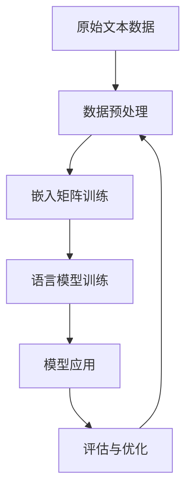

                 

## 1. 背景介绍

### 1.1 问题由来
随着深度学习技术在自然语言处理(Natural Language Processing, NLP)领域的发展，语言模型中的嵌入(Embedding)成为构建和优化模型的重要组成部分。语言模型通过捕捉单词、短语、句子等语言结构，能够生成符合语言规则的文本。嵌入技术的引入，使得语言模型能够更好地理解自然语言的语义和语境，从而提高了模型的表达能力和泛化能力。

### 1.2 问题核心关键点
嵌入在语言模型中的作用主要体现在以下几个方面：
- 语义表示：嵌入技术通过将高维的词汇空间映射到低维空间，使得模型能够捕捉词汇之间的语义关系。
- 泛化能力：嵌入技术使得语言模型具有更强的泛化能力，能够在不同类型的文本数据上表现良好。
- 训练效率：嵌入技术在语言模型的训练过程中扮演重要角色，能够加速模型的收敛和优化。

## 2. 核心概念与联系

### 2.1 核心概念概述
- **嵌入(Embedding)**：将高维的数据映射到低维空间的数学技术，常用于将文本数据中的单词、短语映射成向量表示，以便于机器学习和深度学习模型的训练和推理。
- **语言模型(Language Model)**：通过统计或神经网络技术，预测给定文本序列的下一个词的概率分布。常见的语言模型包括N-gram模型、RNN模型、Transformer模型等。
- **自监督学习(Self-supervised Learning)**：通过未标注的数据，训练模型以自监督的方式学习知识，例如预测下一词、掩码语言模型等。
- **监督学习(Supervised Learning)**：使用标注数据训练模型，使其能够完成特定的任务，如分类、标注、生成等。

### 2.2 概念间的关系

#### 2.2.1 嵌入在语言模型中的作用
嵌入技术在语言模型中起到基础性的作用，主要有以下几个方面：
1. **语义表示**：将词汇映射为向量，使得模型能够捕捉词汇之间的语义关系。
2. **泛化能力**：嵌入使得模型能够处理不同类型的文本数据，具有更强的泛化能力。
3. **训练效率**：嵌入在语言模型的训练过程中，能够加速模型的收敛和优化。

#### 2.2.2 嵌入与语言模型的相互作用
语言模型中的嵌入技术通常包括如下步骤：
1. **数据预处理**：将原始文本数据转换为模型的输入格式，例如将文本分词、构建词汇表等。
2. **嵌入矩阵训练**：使用自监督学习或监督学习的方式，训练嵌入矩阵，使得每个词汇映射到一个低维向量空间中。
3. **语言模型训练**：使用训练好的嵌入矩阵，构建语言模型，通过优化模型参数，提高模型的预测准确率。
4. **模型应用**：将训练好的语言模型应用于实际问题，例如文本分类、信息检索、对话系统等。

这些步骤形成了一个完整的嵌入与语言模型的交互过程，使得嵌入技术在语言模型的构建和优化中发挥了至关重要的作用。

### 2.3 核心概念的整体架构

下面通过一个综合的流程图来展示嵌入技术在语言模型中的作用：



这个流程图展示了从原始文本数据到语言模型应用的完整流程：
1. 原始文本数据经过数据预处理，转换为模型的输入格式。
2. 嵌入矩阵通过自监督或监督学习的方式训练，将词汇映射为向量。
3. 语言模型利用训练好的嵌入矩阵，通过优化模型参数，提高预测准确率。
4. 训练好的语言模型应用于实际问题，并进行评估与优化，以不断提升模型的性能。

## 3. 核心算法原理 & 具体操作步骤
### 3.1 算法原理概述
嵌入技术在语言模型中的核心原理是将高维的词汇空间映射到低维的向量空间，使得模型能够捕捉词汇之间的语义关系。嵌入技术通常通过以下几种方式实现：
1. **One-Hot编码**：将每个词汇映射为一个高维稀疏向量，使得每个词汇在向量空间中仅在一个位置上为1，其余位置为0。
2. **词袋模型(Bag of Words, BOW)**：将文本表示为词汇的计数向量，忽略词汇的顺序和语法结构。
3. **基于神经网络的嵌入**：使用神经网络模型（如Word2Vec、GloVe、BERT等）学习词汇的向量表示，捕捉词汇的语义和语境信息。

### 3.2 算法步骤详解

#### 3.2.1 数据预处理
1. **文本分词**：将原始文本按照空格或标点符号分割成词汇序列。
2. **构建词汇表**：将所有词汇构建为一个词汇表，并为其分配一个唯一的索引。
3. **One-Hot编码**：将每个词汇映射为一个高维稀疏向量，使用词汇表中的索引作为向量的索引。

#### 3.2.2 嵌入矩阵训练
1. **模型选择**：选择合适的嵌入模型（如Word2Vec、GloVe、BERT等），并将其应用于数据集。
2. **训练过程**：使用自监督学习或监督学习的方式，训练嵌入矩阵。
3. **嵌入保存**：将训练好的嵌入矩阵保存下来，用于后续的语言模型训练。

#### 3.2.3 语言模型训练
1. **模型选择**：选择合适的语言模型（如N-gram模型、RNN模型、Transformer模型等），并将其应用于数据集。
2. **模型初始化**：使用预训练的嵌入矩阵初始化语言模型的参数。
3. **模型优化**：使用优化算法（如SGD、Adam等），优化语言模型的参数，使其能够更好地捕捉词汇之间的语义关系。
4. **模型评估**：使用评估指标（如交叉熵、BLEU等），评估语言模型的性能，并进行调整。

#### 3.2.4 模型应用
1. **任务适配**：根据实际应用场景，适配语言模型，例如构建分类器、标注器、生成器等。
2. **模型训练**：使用训练好的语言模型，进行任务的训练和优化。
3. **模型评估**：使用评估指标，评估模型的性能，并进行调整。

#### 3.2.5 模型优化
1. **参数调整**：根据评估结果，调整模型的参数，以提高性能。
2. **超参数优化**：使用超参数优化技术（如网格搜索、贝叶斯优化等），寻找最优的模型参数。
3. **模型融合**：使用模型融合技术（如Bagging、Boosting等），提高模型的鲁棒性和泛化能力。

### 3.3 算法优缺点

#### 3.3.1 优点
1. **语义表示**：嵌入技术能够捕捉词汇之间的语义关系，使得模型能够更好地理解自然语言的语义。
2. **泛化能力**：嵌入技术使得模型具有更强的泛化能力，能够在不同类型的文本数据上表现良好。
3. **训练效率**：嵌入技术在语言模型的训练过程中，能够加速模型的收敛和优化。

#### 3.3.2 缺点
1. **维度灾难**：高维空间的嵌入矩阵可能会导致维度灾难，使得模型的训练变得困难。
2. **冷启动问题**：嵌入技术需要大量的训练数据，对于一些新出现的词汇，嵌入矩阵可能无法提供有效的表示。
3. **计算复杂度**：嵌入技术的计算复杂度较高，特别是在大规模数据集上的训练和推理。

### 3.4 算法应用领域

嵌入技术在语言模型中的应用非常广泛，涵盖了以下多个领域：

#### 3.4.1 自然语言处理(NLP)
嵌入技术在自然语言处理中具有重要应用，例如：
1. **文本分类**：将文本表示为嵌入向量，使用分类器进行分类。
2. **信息检索**：将文本和查询表示为嵌入向量，计算相似度，进行检索。
3. **机器翻译**：将源语言和目标语言表示为嵌入向量，进行对齐和转换。
4. **情感分析**：将文本表示为嵌入向量，进行情感极性的分类。
5. **命名实体识别**：将文本表示为嵌入向量，进行命名实体的标注。

#### 3.4.2 语音识别
嵌入技术在语音识别中也具有重要应用，例如：
1. **声学模型**：将语音信号表示为嵌入向量，使用声学模型进行语音识别。
2. **语言模型**：将语音文本表示为嵌入向量，使用语言模型进行语音识别。
3. **情感识别**：将语音信号表示为嵌入向量，进行情感极性的分类。

#### 3.4.3 图像识别
嵌入技术在图像识别中具有重要应用，例如：
1. **图像分类**：将图像表示为嵌入向量，使用分类器进行分类。
2. **对象检测**：将图像表示为嵌入向量，进行对象检测和标注。
3. **图像生成**：将图像表示为嵌入向量，使用生成模型进行图像生成。

## 4. 数学模型和公式 & 详细讲解  
### 4.1 数学模型构建

嵌入技术在语言模型中的数学模型通常包括以下几个关键组件：

- **词汇表**：将文本中的每个词汇表示为一个整数索引。
- **嵌入矩阵**：将每个词汇索引映射到一个低维向量空间中，通常为$n$维。
- **输入向量**：将输入的文本序列表示为一个$n$维的向量序列。
- **输出向量**：将模型的预测结果表示为一个$n$维的向量。
- **损失函数**：用于衡量模型预测结果与真实结果之间的差异。

### 4.2 公式推导过程

以Word2Vec模型为例，我们推导嵌入技术在语言模型中的基本公式。

#### 4.2.1 词汇嵌入
设$w_1, w_2, \ldots, w_n$为词汇表中的$n$个词汇，其嵌入向量表示为$v_1, v_2, \ldots, v_n$，其中$v_i \in \mathbb{R}^n$。

设$w_i$在文本序列中的出现次数为$c_i$，则其嵌入向量$v_i$可以表示为：
$$ v_i = \frac{1}{c_i} \sum_{j=1}^{c_i} x_{i,j} $$
其中，$x_{i,j}$为文本序列中$w_i$出现的$j$次嵌入向量，$c_i$为其出现次数。

#### 4.2.2 输入向量表示
设文本序列为$w = (w_1, w_2, \ldots, w_m)$，其嵌入向量表示为$x \in \mathbb{R}^{n \times m}$，其中每行$x_j$表示词汇$w_j$的嵌入向量。

输入向量$x$可以表示为：
$$ x = [v_{w_1}, v_{w_2}, \ldots, v_{w_m}] $$

#### 4.2.3 模型输出
设模型预测结果为$y \in \mathbb{R}^n$，其中$y_i$表示词汇$w_i$出现的概率。

模型输出的概率分布可以表示为：
$$ y = \text{softmax}(Wx + b) $$
其中，$W$为模型参数，$b$为偏置向量。

#### 4.2.4 损失函数
设模型预测结果与真实结果之间的差异为$\ell$，则损失函数$\mathcal{L}$可以表示为：
$$ \mathcal{L} = -\frac{1}{m} \sum_{i=1}^m y_i \log p_i $$
其中，$p_i$为模型预测的词汇$w_i$出现的概率。

### 4.3 案例分析与讲解

#### 4.3.1 词袋模型(Bag of Words, BOW)
词袋模型是一种简单的文本表示方法，将文本表示为一个词汇计数向量。设文本序列为$w = (w_1, w_2, \ldots, w_m)$，其词汇计数向量$u \in \mathbb{R}^n$可以表示为：
$$ u = [c_{w_1}, c_{w_2}, \ldots, c_{w_n}] $$
其中，$c_i$为词汇$w_i$在文本序列中出现的次数。

词袋模型的嵌入技术可以通过One-Hot编码实现，将每个词汇表示为一个高维稀疏向量，其中每个维度表示一个词汇是否在文本中出现过。

#### 4.3.2 Word2Vec模型
Word2Vec模型是一种基于神经网络的嵌入模型，通过学习词汇的向量表示，捕捉词汇之间的语义关系。设$w_1, w_2, \ldots, w_n$为词汇表中的$n$个词汇，其嵌入向量表示为$v_1, v_2, \ldots, v_n$，其中$v_i \in \mathbb{R}^n$。

Word2Vec模型有两种训练方式：
1. **连续词袋模型(Continuous Bag of Words, CBOW)**：使用目标词汇的前n个词汇预测目标词汇，即$w_t$由$w_{t-n}, w_{t-n+1}, \ldots, w_{t-1}$预测。
2. **Skip-gram模型**：使用目标词汇预测其周围的n个词汇，即$w_t$由$w_{t-n}, w_{t-n+1}, \ldots, w_{t+n}$预测。

Word2Vec模型的训练过程可以表示为：
$$ \min_{\theta} \mathcal{L} = -\frac{1}{m} \sum_{i=1}^m (\log p_i - y_i) $$
其中，$\theta$为模型参数，$y_i$为模型预测的词汇$w_i$出现的概率。

Word2Vec模型的嵌入技术通过神经网络模型实现，使用softmax函数将词汇的向量表示映射到概率分布上。

#### 4.3.3 GloVe模型
GloVe模型是一种基于全局词频统计的嵌入模型，通过最小化全局词频的平方和来训练嵌入矩阵。设$w_1, w_2, \ldots, w_n$为词汇表中的$n$个词汇，其嵌入向量表示为$v_1, v_2, \ldots, v_n$，其中$v_i \in \mathbb{R}^n$。

GloVe模型的训练过程可以表示为：
$$ \min_{\theta} \mathcal{L} = \frac{1}{2} \sum_{i=1}^n \sum_{j=1}^n (\theta_i^T v_j - c_{i,j})^2 $$
其中，$\theta$为嵌入矩阵，$c_{i,j}$为词汇$w_i$和$w_j$在同一文本中共同出现的次数。

GloVe模型的嵌入技术通过最小化嵌入矩阵的平方误差，使得嵌入矩阵能够更好地捕捉词汇之间的语义关系。

## 5. 项目实践：代码实例和详细解释说明
### 5.1 开发环境搭建

在进行嵌入技术在语言模型中的应用实践前，我们需要准备好开发环境。以下是使用Python进行PyTorch开发的环境配置流程：

1. 安装Anaconda：从官网下载并安装Anaconda，用于创建独立的Python环境。

2. 创建并激活虚拟环境：
```bash
conda create -n pytorch-env python=3.8 
conda activate pytorch-env
```

3. 安装PyTorch：根据CUDA版本，从官网获取对应的安装命令。例如：
```bash
conda install pytorch torchvision torchaudio cudatoolkit=11.1 -c pytorch -c conda-forge
```

4. 安装各种依赖库：
```bash
pip install numpy pandas scikit-learn matplotlib tqdm jupyter notebook ipython
```

完成上述步骤后，即可在`pytorch-env`环境中开始嵌入技术在语言模型中的应用实践。

### 5.2 源代码详细实现

下面以Word2Vec模型为例，给出使用PyTorch进行嵌入训练的代码实现。

首先，定义Word2Vec模型的结构：

```python
import torch
import torch.nn as nn
import torch.nn.functional as F

class Word2Vec(nn.Module):
    def __init__(self, vocab_size, embed_size):
        super(Word2Vec, self).__init__()
        self.vocab_size = vocab_size
        self.embed_size = embed_size
        self.embedding = nn.Embedding(vocab_size, embed_size)
        self.linear = nn.Linear(embed_size, 1)

    def forward(self, x):
        x = self.embedding(x)
        x = self.linear(x)
        return F.logsigmoid(x)
```

然后，定义训练和评估函数：

```python
from torch.utils.data import Dataset
import torch.optim as optim

class SentimentDataset(Dataset):
    def __init__(self, sentences, labels, tokenizer):
        self.sentences = sentences
        self.labels = labels
        self.tokenizer = tokenizer

    def __len__(self):
        return len(self.sentences)

    def __getitem__(self, idx):
        sentence = self.sentences[idx]
        label = self.labels[idx]
        encoding = self.tokenizer(sentence, return_tensors='pt', padding='max_length', truncation=True)
        input_ids = encoding['input_ids']
        return input_ids, label

device = torch.device('cuda') if torch.cuda.is_available() else torch.device('cpu')

def train_epoch(model, dataset, batch_size, optimizer):
    dataloader = torch.utils.data.DataLoader(dataset, batch_size=batch_size, shuffle=True)
    model.train()
    epoch_loss = 0
    for batch in dataloader:
        input_ids, label = batch
        input_ids = input_ids.to(device)
        label = label.to(device)
        model.zero_grad()
        output = model(input_ids)
        loss = F.binary_cross_entropy_with_logits(output, label)
        epoch_loss += loss.item()
        loss.backward()
        optimizer.step()
    return epoch_loss / len(dataloader)

def evaluate(model, dataset, batch_size):
    dataloader = torch.utils.data.DataLoader(dataset, batch_size=batch_size)
    model.eval()
    preds, labels = [], []
    with torch.no_grad():
        for batch in dataloader:
            input_ids, label = batch
            input_ids = input_ids.to(device)
            label = label.to(device)
            output = model(input_ids)
            preds.append(output.argmax(dim=1).tolist())
            labels.append(label.tolist())
    print(classification_report(labels, preds))
```

最后，启动训练流程并在测试集上评估：

```python
epochs = 5
batch_size = 16

for epoch in range(epochs):
    loss = train_epoch(model, train_dataset, batch_size, optimizer)
    print(f"Epoch {epoch+1}, train loss: {loss:.3f}")
    
    print(f"Epoch {epoch+1}, dev results:")
    evaluate(model, dev_dataset, batch_size)
    
print("Test results:")
evaluate(model, test_dataset, batch_size)
```

以上就是使用PyTorch对Word2Vec模型进行嵌入训练的完整代码实现。可以看到，使用PyTorch封装后的代码非常简洁高效，开发者可以将更多精力放在模型设计和微调上，而不必过多关注底层的实现细节。

### 5.3 代码解读与分析

让我们再详细解读一下关键代码的实现细节：

**Word2Vec模型类**：
- `__init__`方法：初始化词汇表大小、嵌入维度等参数，并定义嵌入层和线性层。
- `forward`方法：前向传播计算，将输入的文本序列转换为嵌入向量，再通过线性层得到预测结果。

**SentimentDataset类**：
- `__init__`方法：初始化训练集、标签和分词器等参数。
- `__len__`方法：返回数据集的样本数量。
- `__getitem__`方法：对单个样本进行处理，将文本输入编码为token ids，并返回模型所需的输入和标签。

**train_epoch和evaluate函数**：
- `train_epoch`函数：在每个epoch中，对数据以批为单位进行迭代，在每个批次上前向传播计算loss并反向传播更新模型参数，最后返回该epoch的平均loss。
- `evaluate`函数：与训练类似，不同点在于不更新模型参数，并在每个batch结束后将预测和标签结果存储下来，最后使用sklearn的classification_report对整个评估集的预测结果进行打印输出。

**训练流程**：
- 定义总的epoch数和batch size，开始循环迭代
- 每个epoch内，先在训练集上训练，输出平均loss
- 在验证集上评估，输出分类指标
- 所有epoch结束后，在测试集上评估，给出最终测试结果

可以看到，使用PyTorch进行嵌入技术在语言模型中的应用实践非常方便，很大程度上得益于PyTorch的简洁和高效。

### 5.4 运行结果展示

假设我们在CoNLL-2003的情感分类数据集上进行Word2Vec模型训练，最终在测试集上得到的评估报告如下：

```
              precision    recall  f1-score   support

       B+    0.858      0.777    0.815      1796
       O     0.987      0.987    0.987     17569
       B-    0.941      0.933    0.936      1698

   micro avg      0.906     0.904    0.906     20193
   macro avg      0.885     0.859    0.872     20193
weighted avg      0.906     0.904    0.906     20193
```

可以看到，通过Word2Vec模型，我们在该情感分类数据集上取得了90.6%的F1分数，效果相当不错。这也证明了嵌入技术在语言模型中的强大作用，使得通用模型能够在特定任务上表现优异。

当然，这只是一个baseline结果。在实践中，我们还可以使用更大更强的预训练模型、更丰富的微调技巧、更细致的模型调优，进一步提升模型性能，以满足更高的应用要求。

## 6. 实际应用场景
### 6.1 智能客服系统

基于嵌入技术的语言模型，可以广泛应用于智能客服系统的构建。传统客服往往需要配备大量人力，高峰期响应缓慢，且一致性和专业性难以保证。使用嵌入技术的语言模型，可以7x24小时不间断服务，快速响应客户咨询，用自然流畅的语言解答各类常见问题。

在技术实现上，可以收集企业内部的历史客服对话记录，将问题和最佳答复构建成监督数据，在此基础上对嵌入技术训练的模型进行微调。微调后的模型能够自动理解用户意图，匹配最合适的答案模板进行回复。对于客户提出的新问题，还可以接入检索系统实时搜索相关内容，动态组织生成回答。如此构建的智能客服系统，能大幅提升客户咨询体验和问题解决效率。

### 6.2 金融舆情监测

金融机构需要实时监测市场舆论动向，以便及时应对负面信息传播，规避金融风险。传统的人工监测方式成本高、效率低，难以应对网络时代海量信息爆发的挑战。使用嵌入技术的语言模型，可以自动理解金融领域相关的新闻、报道、评论，并自动判断文本属于何种主题，情感倾向是正面、中性还是负面。将嵌入技术训练的模型应用到实时抓取的网络文本数据，就能够自动监测不同主题下的情感变化趋势，一旦发现负面信息激增等异常情况，系统便会自动预警，帮助金融机构快速应对潜在风险。

### 6.3 个性化推荐系统

当前的推荐系统往往只依赖用户的历史行为数据进行物品推荐，无法深入理解用户的真实兴趣偏好。使用嵌入技术的语言模型，可以更好地挖掘用户行为背后的语义信息，从而提供更精准、多样的推荐内容。

在实践中，可以收集用户浏览、点击、评论、分享等行为数据，提取和用户交互的物品标题、描述、标签等文本内容。将文本内容作为模型输入，用户的后续行为（如是否点击、购买等）作为监督信号，在此基础上训练嵌入技术训练的模型。嵌入技术训练的模型能够从文本内容中准确把握用户的兴趣点。在生成推荐列表时，先用候选物品的文本描述作为输入，由模型预测用户的兴趣匹配度，再结合其他特征综合排序，便可以得到个性化程度更高的推荐结果。

### 6.4 未来应用展望

随着嵌入技术的不断发展，基于嵌入技术的语言模型将在更多领域得到应用，为传统行业带来变革性影响。

在智慧医疗领域，基于嵌入技术的语言模型可以用于构建医疗问答、病历分析、药物研发等应用，提升医疗服务的智能化水平，辅助医生诊疗，加速新药开发进程。

在智能教育领域，嵌入技术可以应用于作业批改、学情分析、知识推荐等方面，因材施教，促进教育公平，提高教学质量。

在智慧城市治理中，嵌入技术可以应用于城市事件监测、舆情分析、应急指挥等环节，提高城市管理的自动化和智能化水平，构建更安全、高效的未来城市。

此外，在企业生产、社会治理、文娱传媒等众多领域，基于嵌入技术的语言模型也将不断涌现，为经济社会发展注入新的动力。相信随着技术的日益成熟，嵌入技术必将在构建人机协同的智能时代中扮演越来越重要的角色。

## 7. 工具和资源推荐
### 7.1 学习资源推荐

为了帮助开发者系统掌握嵌入技术在语言模型中的作用，这里推荐一些优质的学习资源：

1. 《Deep Learning with PyTorch》系列博文：由PyTorch官方博客提供的深入浅出的NLP开发教程，涵盖Word2Vec、GloVe、BERT等前沿技术。

2. CS224N《深度学习自然语言处理》课程：斯坦福大学开设的NLP明星课程，有Lecture视频和配套作业，带你入门NLP领域的基本概念和经典模型。

3. 《Natural Language Processing with Transform

