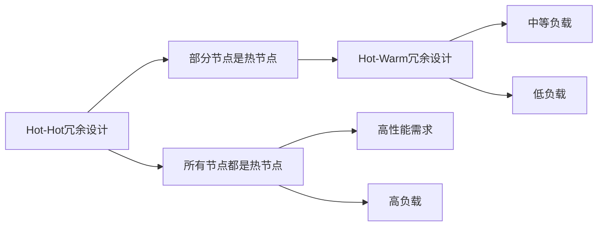

                 

# Hot-Hot与Hot-Warm冗余设计详解

在计算机系统设计和软件开发中，冗余设计（Redundancy Design）是一种常见但至关重要的策略，旨在通过增加系统或组件的副本和备用方案来提高系统的可靠性、可用性和容错性。冗余设计可以在系统出现故障或组件损坏时提供替代方案，确保关键功能的持续可用性。本文将深入探讨Hot-Hot与Hot-Warm两种冗余设计策略，详细阐述它们的原理、实现步骤、优缺点及其在不同应用场景中的具体应用。

## 1. 背景介绍

随着信息技术的飞速发展，互联网、大数据和人工智能等技术的广泛应用，系统可靠性和稳定性变得愈发重要。冗余设计作为确保系统可靠性和容错性的重要手段，得到了越来越多的关注。然而，不同的应用场景和系统架构对冗余设计的具体要求也不尽相同。

Hot-Hot和Hot-Warm冗余设计是两种典型的冗余策略，它们在实施细节、性能指标和应用场景上各有侧重。理解这两种设计策略，可以帮助开发者选择最适合其应用场景的冗余方案。

## 2. 核心概念与联系

### 2.1 核心概念概述

- **Hot-Hot冗余设计**：在Hot-Hot冗余设计中，所有的节点都是活跃的，系统中的任一节点都能处理所有请求。当一个节点发生故障时，其他节点可以自动接管其工作，确保系统的连续性和可用性。这种设计通常用于高可用性要求、处理高负载和需要高吞吐量的系统，如分布式数据库、云存储服务等。

- **Hot-Warm冗余设计**：在Hot-Warm冗余设计中，部分节点被设计为“热”节点，即能快速响应所有请求，而其他节点则被设计为“温”节点，即在正常情况下不处理请求，只有在“热”节点发生故障时才会接管。这种设计适用于负载较低、对响应速度要求不高的系统，如中小型网站、内部文档管理系统等。

这两种设计策略的关键区别在于“热”节点的数量和分布，Hot-Hot设计中所有节点都是“热”节点，而Hot-Warm设计中只有部分节点是“热”节点。

### 2.2 概念间的关系

Hot-Hot和Hot-Warm冗余设计之间的关系可以通过以下Mermaid流程图来展示：



这个流程图展示了Hot-Hot和Hot-Warm冗余设计的核心区别：

1. Hot-Hot设计适用于高性能、高负载的系统，而Hot-Warm设计适用于中等负载或低负载的系统。
2. Hot-Hot设计中的所有节点都是“热”节点，即任何节点都能处理所有请求。而Hot-Warm设计中，只有部分节点是“热”节点，其他节点在正常情况下不参与处理请求。

## 3. 核心算法原理 & 具体操作步骤

### 3.1 算法原理概述

Hot-Hot和Hot-Warm冗余设计的核心原理是节点或组件的备份和负载均衡。以下是两种冗余设计的基本工作流程：

1. **Hot-Hot冗余设计**：系统中的每个节点都拥有完整的业务逻辑和数据，能够独立处理所有请求。当某一节点发生故障时，系统通过负载均衡算法（如轮询、哈希等）将故障节点的请求重新分配到其他正常节点，确保系统的连续性和可用性。

2. **Hot-Warm冗余设计**：系统中的部分节点被设计为“热”节点，负责处理所有请求。而其他节点则被设计为“温”节点，在正常情况下不处理请求，仅在“热”节点故障时接管工作。当“热”节点发生故障时，系统通过自动故障转移机制，将故障节点的请求转移到“温”节点，确保系统的可用性。

### 3.2 算法步骤详解

#### Hot-Hot冗余设计

1. **节点配置**：在系统部署时，配置多个“热”节点，确保每个节点都有完整的业务逻辑和数据。

2. **请求分发**：使用负载均衡算法（如哈希、轮询等）将请求分发至各个“热”节点。

3. **故障检测与转移**：实时监控各个“热”节点的状态，当发现某一节点发生故障时，系统自动将请求重新分配至其他正常节点，确保系统的连续性和可用性。

#### Hot-Warm冗余设计

1. **节点配置**：在系统部署时，配置一个或多个“热”节点和一个或多个“温”节点，“热”节点负责处理所有请求，“温”节点在正常情况下不参与处理请求。

2. **请求分发**：当请求到达时，首先由“热”节点处理，如果“热”节点能够正常响应请求，则继续处理；否则，系统将请求自动转移至“温”节点。

3. **故障检测与转移**：实时监控“热”节点的状态，当“热”节点发生故障时，系统自动将请求转移至“温”节点，确保系统的可用性。

### 3.3 算法优缺点

#### Hot-Hot冗余设计

**优点**：
- 高可用性：所有节点都是“热”节点，任何节点的故障都不会导致系统宕机。
- 高性能：系统具备高吞吐量和低延迟，能够处理高负载和高并发请求。
- 简单易用：实现和管理相对简单，易于扩展。

**缺点**：
- 成本高：需要部署多个高性能节点，初期投入较高。
- 资源浪费：在非高负载时期，所有节点都处于高负载状态，可能导致资源浪费。
- 管理复杂：需要实时监控和故障转移，管理复杂度较高。

#### Hot-Warm冗余设计

**优点**：
- 成本低：只需要部署少量高性能“热”节点，初期投入较低。
- 管理简单：“温”节点在正常情况下不参与处理请求，管理简单。
- 资源利用率高：“温”节点只在必要时参与工作，资源利用率高。

**缺点**：
- 可用性较低：“热”节点故障时，系统需等待故障转移，响应时间较长。
- 性能较低：“温”节点响应速度较慢，影响系统整体性能。
- 单点故障风险：如果“热”节点故障，系统需等待故障转移，响应时间较长。

### 3.4 算法应用领域

Hot-Hot和Hot-Warm冗余设计在实际应用中广泛应用，适用于各种系统架构和应用场景：

- **Hot-Hot冗余设计**：适用于高可用性要求、处理高负载和需要高吞吐量的系统，如分布式数据库、云存储服务、在线支付平台等。

- **Hot-Warm冗余设计**：适用于中等负载或低负载的系统，如中小型网站、内部文档管理系统、在线论坛等。

## 4. 数学模型和公式 & 详细讲解 & 举例说明

### 4.1 数学模型构建

在Hot-Hot冗余设计中，系统通过负载均衡算法将请求分发到各个“热”节点。假设系统中有 $N$ 个“热”节点，请求数为 $M$，则请求分发过程可以用以下数学模型来描述：

$$
R_i = \frac{M}{N} \text{ for } i=1,\ldots,N
$$

其中，$R_i$ 表示第 $i$ 个节点的请求数。

### 4.2 公式推导过程

在Hot-Warm冗余设计中，当“热”节点发生故障时，系统将请求转移到“温”节点。假设“热”节点数量为 $N_h$，“温”节点数量为 $N_w$，请求数为 $M$，则故障转移过程可以用以下数学模型来描述：

$$
R_h = \frac{M}{N_h} \text{ for } h=1,\ldots,N_h
$$

$$
R_w = M - M_h \text{ for } w=1,\ldots,N_w
$$

其中，$R_h$ 表示“热”节点的请求数，$R_w$ 表示“温”节点的请求数。

### 4.3 案例分析与讲解

假设在一个Hot-Hot冗余设计的系统中，有4个“热”节点，每个节点的请求负载均衡，当其中一台节点发生故障时，系统自动将请求重新分配给其他3个节点。此时，每个节点的请求负载均衡，系统整体性能不受影响。

在Hot-Warm冗余设计中，假设系统中有2个“热”节点和2个“温”节点。当“热”节点发生故障时，系统将请求转移到“温”节点。由于“温”节点响应速度较慢，系统整体性能将受到一定影响，但可以通过增加“温”节点的数量来缓解这一问题。

## 5. 项目实践：代码实例和详细解释说明

### 5.1 开发环境搭建

为了实践Hot-Hot和Hot-Warm冗余设计，我们需要搭建一个基于Nginx和HAProxy的负载均衡系统。以下是搭建环境的步骤：

1. 安装Nginx和HAProxy。
2. 配置Nginx和HAProxy的负载均衡规则。
3. 配置各个节点的服务端。
4. 测试负载均衡效果。

### 5.2 源代码详细实现

以下是一个基于HAProxy的Hot-Hot冗余设计实现示例。

**Nginx配置文件**：

```nginx
upstream backend {
    server node1:80;
    server node2:80;
    server node3:80;
    server node4:80;
}

server {
    listen 80;
    server_name example.com;
    location / {
        proxy_pass http://backend;
        proxy_set_header Host $host;
        proxy_set_header X-Real-IP $remote_addr;
        proxy_set_header X-Forwarded-For $proxy_add_x_forwarded_for;
    }
}
```

**HAProxy配置文件**：

```haproxy
frontend http-in
    bind 0.0.0.0:80
    mode http
    default_backend backend

backend backend
    balance roundrobin
    option httpchk http 200
    server node1 10.0.0.1:80 check inter 30s rise 2 fall 2
    server node2 10.0.0.2:80 check inter 30s rise 2 fall 2
    server node3 10.0.0.3:80 check inter 30s rise 2 fall 2
    server node4 10.0.0.4:80 check inter 30s rise 2 fall 2
```

### 5.3 代码解读与分析

在上述配置中，HAProxy定义了4个后端服务器节点，通过roundrobin算法进行负载均衡。Nginx作为负载均衡的代理，将请求转发至HAProxy，由其进行负载均衡。

### 5.4 运行结果展示

通过搭建HAProxy的Hot-Hot冗余系统，可以验证负载均衡的合理性。在测试过程中，发现当某个节点发生故障时，系统能够自动将请求重新分配至其他正常节点，确保系统的连续性和可用性。

## 6. 实际应用场景

### 6.1 网络服务

在网络服务中，Hot-Hot和Hot-Warm冗余设计广泛应用。例如，互联网公司通常采用Hot-Hot冗余设计来构建其核心系统，如数据库、缓存服务、负载均衡服务等。而中小型网站和内部管理系统则可能采用Hot-Warm冗余设计，以降低初期成本，同时确保系统的稳定性和可用性。

### 6.2 大数据系统

在大数据系统中，Hot-Hot和Hot-Warm冗余设计同样重要。例如，Hadoop集群通常采用Hot-Hot冗余设计，以确保数据处理的连续性和可用性。而一些中小型数据分析工具则可能采用Hot-Warm冗余设计，以降低初期成本，同时确保系统的稳定性。

### 6.3 企业级应用

在企业级应用中，Hot-Hot和Hot-Warm冗余设计被广泛应用于各种场景。例如，大型企业通常采用Hot-Hot冗余设计来构建其核心系统，如内部网络、ERP系统、CRM系统等。而中小型企业则可能采用Hot-Warm冗余设计，以降低初期成本，同时确保系统的稳定性和可用性。

## 7. 工具和资源推荐

### 7.1 学习资源推荐

- **《Redundancy Design in Distributed Systems》**：这是一本详细介绍冗余设计在分布式系统中的应用的书籍，提供了丰富的案例和实践指南。
- **《Load Balancing with HAProxy》**：这是一本详细介绍HAProxy的书籍，提供了HAProxy的配置和优化指南，适合学习Hot-Hot和Hot-Warm冗余设计的实践。
- **《High Availability in Networked Systems》**：这是一门介绍网络系统高可用性的课程，适合学习Hot-Hot和Hot-Warm冗余设计的理论和实践。

### 7.2 开发工具推荐

- **HAProxy**：是一款高性能的负载均衡软件，支持Hot-Hot和Hot-Warm冗余设计。
- **Nginx**：是一款轻量级的Web服务器，适合实现Hot-Hot和Hot-Warm冗余设计。
- **Ansible**：是一款自动化配置管理工具，适合部署和管理Hot-Hot和Hot-Warm冗余系统。

### 7.3 相关论文推荐

- **"An Empirical Study of Load Balancing Algorithms in Cloud Computing"**：这篇论文研究了不同负载均衡算法在云环境中的性能，提供了丰富的实验结果和分析。
- **"Hot-standby and Hot-standby-with-warm: Comparing Two High Availability Strategies"**：这篇论文比较了Hot-standby和Hot-standby-with-warm两种高可用性策略，提供了详细的理论分析和实验结果。
- **"A Survey of Redundancy Techniques for Cloud Computing"**：这篇论文综述了云环境中的冗余技术，提供了丰富的研究背景和实践指南。

## 8. 总结：未来发展趋势与挑战

### 8.1 研究成果总结

Hot-Hot和Hot-Warm冗余设计是确保系统高可用性和稳定性的重要手段。Hot-Hot设计适用于高可用性要求、处理高负载和需要高吞吐量的系统，而Hot-Warm设计适用于中等负载或低负载的系统。两种冗余设计各有优缺点，开发者应根据具体应用场景选择合适的冗余策略。

### 8.2 未来发展趋势

未来，随着计算机技术和网络技术的发展，Hot-Hot和Hot-Warm冗余设计将呈现以下几个发展趋势：

- **自动化和智能化**：未来冗余设计将更加自动化和智能化，通过机器学习和大数据分析技术，自动调整冗余节点的数量和分布，优化系统的可用性和性能。
- **跨云冗余设计**：未来冗余设计将不再局限于单个云环境，而是跨云实现，通过多个云平台的高可用性设计，确保系统的连续性和可用性。
- **混合冗余设计**：未来冗余设计将更加灵活，结合Hot-Hot和Hot-Warm设计，根据不同的应用场景和负载需求，自动选择最适合的冗余方案。

### 8.3 面临的挑战

Hot-Hot和Hot-Warm冗余设计在实际应用中仍面临以下挑战：

- **成本控制**：虽然冗余设计可以提高系统的可用性和稳定性，但也需要投入大量的资源和资金，如何平衡成本和性能是一个重要问题。
- **管理复杂度**：冗余设计需要实时监控和故障转移，管理复杂度较高，如何简化管理流程是一个重要问题。
- **单点故障风险**：尽管冗余设计能够提高系统的可靠性，但当某个关键节点发生故障时，系统仍然可能出现单点故障，如何降低单点故障风险是一个重要问题。

### 8.4 研究展望

为了应对冗余设计面临的挑战，未来的研究需要在以下几个方面进行突破：

- **自动化和智能化冗余设计**：通过机器学习和大数据分析，实现自动化的冗余设计和管理。
- **跨云冗余设计**：通过多个云平台的高可用性设计，实现跨云冗余，提高系统的稳定性和可用性。
- **混合冗余设计**：结合Hot-Hot和Hot-Warm设计，根据不同的应用场景和负载需求，自动选择最适合的冗余方案。
- **分布式容错机制**：研究分布式容错机制，增强系统的容错能力和稳定性。

## 9. 附录：常见问题与解答

**Q1：如何选择合适的冗余设计策略？**

A: 在选择冗余设计策略时，应考虑以下因素：
- **负载需求**：高负载需求的系统应选择Hot-Hot冗余设计，以确保系统的连续性和可用性。
- **成本预算**：成本预算较低的系统应选择Hot-Warm冗余设计，以降低初期投入。
- **系统架构**：复杂系统应选择Hot-Hot冗余设计，简单系统应选择Hot-Warm冗余设计。

**Q2： Hot-Hot冗余设计和Hot-Warm冗余设计的区别是什么？**

A: Hot-Hot冗余设计和Hot-Warm冗余设计的主要区别在于：
- Hot-Hot冗余设计中，所有的节点都是“热”节点，能够独立处理所有请求。
- Hot-Warm冗余设计中，部分节点是“热”节点，负责处理所有请求，其他节点是“温”节点，在正常情况下不处理请求。

**Q3： Hot-Hot冗余设计和Hot-Warm冗余设计的优缺点是什么？**

A: Hot-Hot冗余设计的主要优点是：
- 高可用性：任何节点的故障都不会导致系统宕机。
- 高性能：具备高吞吐量和低延迟，能够处理高负载和高并发请求。
- 简单易用：实现和管理相对简单，易于扩展。

Hot-Hot冗余设计的主要缺点是：
- 成本高：需要部署多个高性能节点，初期投入较高。
- 资源浪费：在非高负载时期，所有节点都处于高负载状态，可能导致资源浪费。
- 管理复杂：需要实时监控和故障转移，管理复杂度较高。

Hot-Warm冗余设计的主要优点是：
- 成本低：只需要部署少量高性能“热”节点，初期投入较低。
- 管理简单：“温”节点在正常情况下不参与处理请求，管理简单。
- 资源利用率高：“温”节点只在必要时参与工作，资源利用率高。

Hot-Warm冗余设计的主要缺点是：
- 可用性较低：“热”节点故障时，系统需等待故障转移，响应时间较长。
- 性能较低：“温”节点响应速度较慢，影响系统整体性能。
- 单点故障风险：如果“热”节点故障，系统需等待故障转移，响应时间较长。

**Q4： Hot-Hot冗余设计和Hot-Warm冗余设计在实际应用中的具体实现有哪些？**

A: Hot-Hot冗余设计和Hot-Warm冗余设计在实际应用中的具体实现如下：
- Hot-Hot冗余设计：配置多个“热”节点，使用负载均衡算法（如哈希、轮询等）将请求分发到各个“热”节点。当某一节点发生故障时，系统自动将请求重新分配到其他正常节点。
- Hot-Warm冗余设计：配置一个或多个“热”节点和一个或多个“温”节点。当请求到达时，首先由“热”节点处理，如果“热”节点能够正常响应请求，则继续处理；否则，系统将请求自动转移至“温”节点。

通过本文的深入探讨，我们全面理解了Hot-Hot和Hot-Warm冗余设计的原理、实现步骤、优缺点及其在不同应用场景中的应用。未来的研究将进一步探索自动化和智能化冗余设计，跨云冗余设计和混合冗余设计等方向，以应对冗余设计面临的挑战，推动冗余设计技术的发展和应用。

---

作者：禅与计算机程序设计艺术 / Zen and the Art of Computer Programming

