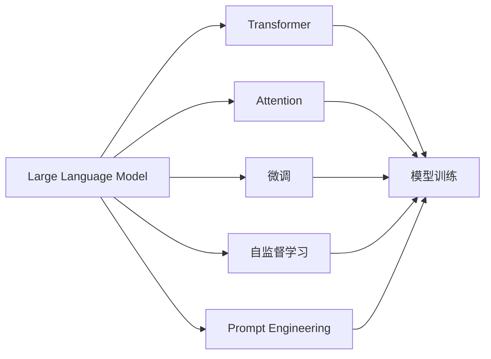

                 

# LLM:计算机架构的新时代

## 1. 背景介绍

### 1.1 问题由来
在过去几十年里，计算机架构经历了从串行到并行、从对称多处理到分布式系统、从硬件到软件的演进，深刻地影响了计算能力与性能的提升。然而，这些架构演进的主要驱动力是“规模”，即通过增加处理器数量、内存大小、带宽和并行度来提升性能。但这些方法逐渐遇到了瓶颈，比如，微处理器的性能提升放缓，能耗问题日趋严峻，以及制造成本增加等问题。

现代计算机架构已经到了一个新的历史节点。随着计算任务日趋复杂，数据量激增，对计算能力和效率的要求也愈发严苛。因此，一种新的计算机架构应运而生，那就是基于Large Language Model（LLM）的计算架构，其核心是利用智能算法和模型来处理计算任务，而不仅仅是依靠硬件的性能提升。这种架构不仅能解决传统架构所面临的瓶颈问题，还能带来新的性能提升和应用场景。

### 1.2 问题核心关键点
LLM计算架构的核心在于大语言模型（LLM），它是一种基于深度学习的语言模型，能够理解和生成自然语言。相比于传统的基于指令集的计算架构，LLM架构具有以下关键优势：

1. **灵活性**：LLM能够通过自监督学习等方式，从大规模无标签数据中学习到丰富的语言知识和常识，从而具备强大的语言理解和生成能力，能够适应各种语言和语境。

2. **可解释性**：LLM能够通过输入文本的格式和上下文信息，对语言模型进行指导，生成符合预期的输出，从而提供计算过程的透明度。

3. **扩展性**：随着数据规模的增大和模型参数的增长，LLM能够处理越来越复杂的计算任务，具有极强的扩展性。

4. **优化性**：LLM能够根据具体任务进行优化，显著提高特定任务的性能，如自然语言处理、智能对话、问答系统等。

5. **跨领域性**：LLM能够跨越多个领域，如自然语言处理、计算机视觉、语音识别等，具有广泛的应用前景。

这些优势使得LLM计算架构成为当前计算机架构研究的热点。本文旨在深入探讨LLM架构的原理和应用，同时介绍其在实际应用中的实现方法和效果，希望为计算机架构的未来发展提供新的思路。

## 2. 核心概念与联系

### 2.1 核心概念概述

在介绍LLM计算架构之前，需要先了解几个核心概念：

- **Large Language Model（大语言模型）**：指通过深度学习训练，能够理解和生成自然语言的模型。大语言模型通常包含数十亿个参数，能够处理非常复杂和长久的文本。

- **Transformer**：是一种基于自注意力机制的神经网络结构，广泛应用于大语言模型的训练和推理中，能够高效地处理序列数据。

- **Attention**：在大语言模型中，注意力机制用于捕捉输入序列中不同位置之间的关系，使得模型能够关注到重要的信息，提高模型性能。

- **微调（Fine-Tuning）**：指在大语言模型的基础上，针对特定任务进行有监督的优化，从而提高模型在该任务上的性能。

- **自监督学习（Self-Supervised Learning）**：指使用无标签数据进行模型训练，通过设计巧妙的训练任务（如掩码语言模型、下采样任务等），使模型能够自动学习到语言的统计规律。

- **Prompt Engineering**：指通过精心设计输入文本的格式，引导模型按期望方式输出，减少微调参数，提高模型在特定任务上的性能。

这些概念之间有着密切的联系，构成了LLM计算架构的基础。接下来，我们将通过一个Mermaid流程图来展示这些概念之间的关系：



这个流程图展示了LLM架构的关键组成部分及其相互关系：

1. LLM作为架构的核心，由Transformer和Attention机制构成，能够处理复杂的序列数据。
2. 自监督学习用于训练LLM，使模型能够从大规模无标签数据中学习到语言的规律。
3. 微调和Prompt Engineering用于优化LLM，提高其在特定任务上的性能。
4. 通过以上过程，LLM能够高效地处理各种自然语言处理任务，成为新时代的计算架构。

### 2.2 概念间的关系

在LLM计算架构中，这些概念之间相互协作，共同完成计算任务。以下是一些更详细的概念关系：

- LLM通过Transformer和Attention机制，能够处理任意长度的输入序列，这为LLM架构提供了强大的数据处理能力。
- 自监督学习是训练LLM的有效方法，它利用大规模无标签数据进行模型训练，能够使模型在缺乏标注数据的情况下也能获取到丰富的语言知识。
- 微调用于针对特定任务对LLM进行优化，减少参数调整，提高模型的性能。
- Prompt Engineering通过设计输入文本的格式，引导LLM生成特定的输出，从而在零样本和少样本条件下也能取得优异的性能。

这些概念之间的关系构成了LLM计算架构的完整体系，使得LLM架构能够处理各种复杂的计算任务。

## 3. 核心算法原理 & 具体操作步骤

### 3.1 算法原理概述

LLM计算架构的核心算法原理主要包括以下几个方面：

1. **自监督学习**：通过设计无监督训练任务，如掩码语言模型、下采样任务等，使模型能够自动学习到语言的统计规律。

2. **微调**：在大规模预训练模型的基础上，使用有标签数据对模型进行有监督优化，提高模型在特定任务上的性能。

3. **Prompt Engineering**：通过设计特定的输入文本格式，引导LLM生成符合预期的输出，减少微调参数。

4. **多任务学习**：将多个相关任务的任务适配层共享，同时进行训练，提升模型的泛化能力。

5. **分布式训练**：利用分布式计算资源进行大规模模型的训练和推理，提高计算效率。

这些算法原理构成了LLM计算架构的基础，通过这些算法，LLM能够高效地处理各种计算任务，成为新时代的计算架构。

### 3.2 算法步骤详解

接下来，我们将详细介绍LLM计算架构的具体操作步骤：

**Step 1: 准备预训练模型和数据集**

- 选择合适的预训练模型，如BERT、GPT等，作为LLM架构的初始化参数。
- 准备任务的数据集，划分为训练集、验证集和测试集。

**Step 2: 设计任务适配层**

- 根据具体任务，设计相应的输出层和损失函数。例如，对于分类任务，通常添加一个线性分类器和交叉熵损失函数。

**Step 3: 设置微调超参数**

- 选择合适的优化算法及其参数，如AdamW、SGD等，设置学习率、批大小、迭代轮数等。
- 设置正则化技术及强度，包括权重衰减、Dropout、Early Stopping等。
- 确定冻结预训练参数的策略，如仅微调顶层，或全部参数都参与微调。

**Step 4: 执行梯度训练**

- 将训练集数据分批次输入模型，前向传播计算损失函数。
- 反向传播计算参数梯度，根据设定的优化算法和学习率更新模型参数。
- 周期性在验证集上评估模型性能，根据性能指标决定是否触发Early Stopping。
- 重复上述步骤直到满足预设的迭代轮数或Early Stopping条件。

**Step 5: 测试和部署**

- 在测试集上评估微调后模型，对比微调前后的精度提升。
- 使用微调后的模型对新样本进行推理预测，集成到实际的应用系统中。
- 持续收集新的数据，定期重新微调模型，以适应数据分布的变化。

以上是LLM计算架构的一般流程，在实际应用中，还需要针对具体任务进行优化。

### 3.3 算法优缺点

LLM计算架构具有以下优点：

1. **灵活性**：LLM能够适应各种语言和语境，具有很强的灵活性。
2. **可解释性**：LLM能够提供计算过程的透明度，易于理解。
3. **扩展性**：随着数据规模的增大和模型参数的增长，LLM能够处理越来越复杂的计算任务。
4. **优化性**：LLM能够针对特定任务进行优化，显著提高任务性能。
5. **跨领域性**：LLM能够跨越多个领域，如自然语言处理、计算机视觉、语音识别等，具有广泛的应用前景。

同时，LLM计算架构也存在以下缺点：

1. **依赖数据**：LLM需要大量无标签和有标签数据进行训练和微调，数据获取成本较高。
2. **计算资源需求高**：LLM参数量大，训练和推理需要大量计算资源。
3. **推理速度慢**：LLM推理速度较慢，难以实时响应。
4. **模型复杂**：LLM模型复杂，难以解释和调试。
5. **鲁棒性不足**：LLM对输入数据的噪音和扰动敏感，容易产生错误输出。

尽管存在这些缺点，LLM计算架构依然具有巨大的潜力，能够解决传统架构所面临的瓶颈问题，推动计算机架构向智能化、自适应化方向发展。

### 3.4 算法应用领域

LLM计算架构已经在许多领域得到应用，例如：

- **自然语言处理（NLP）**：LLM在问答、对话、摘要、翻译、情感分析等NLP任务上取得了优异的性能，成为NLP技术落地应用的重要手段。
- **计算机视觉**：LLM能够通过视觉文本关联模型（Vision-Language Models）处理图像和文本的混合数据。
- **语音识别**：LLM通过语音文本关联模型（Speech-Language Models）实现对语音指令的识别和理解。
- **智能对话**：LLM能够通过对话模型实现智能对话系统，提升用户交互体验。
- **智能推荐**：LLM通过推荐模型实现个性化推荐系统，提高用户满意度。
- **知识图谱**：LLM能够通过知识图谱关联模型（Knowledge Graph Models）处理实体和关系数据。

除了上述应用领域，LLM计算架构还具有广泛的应用前景，能够推动计算机架构向智能化、自适应化方向发展。

## 4. 数学模型和公式 & 详细讲解 & 举例说明

### 4.1 数学模型构建

在LLM计算架构中，数学模型主要包括以下几个方面：

1. **掩码语言模型**：定义如下：

$$
p(x_i|x_{<i}) = \prod_{i=1}^{N} p(x_i|x_{<i})
$$

其中，$x$ 表示文本序列，$x_i$ 表示文本序列中第 $i$ 个单词，$x_{<i}$ 表示文本序列中前 $i-1$ 个单词。

2. **下采样任务**：定义如下：

$$
p(y|x) = \prod_{i=1}^{N} p(y_i|y_{<i},x)
$$

其中，$y$ 表示文本序列中的标签序列，$y_i$ 表示文本序列中第 $i$ 个单词的标签，$y_{<i}$ 表示文本序列中前 $i-1$ 个单词的标签。

3. **输出层**：对于分类任务，通常使用线性分类器进行输出：

$$
y = \text{Softmax}(Wx + b)
$$

其中，$W$ 和 $b$ 为模型参数，$x$ 为输入文本，$y$ 为模型输出。

### 4.2 公式推导过程

以掩码语言模型为例，其推导过程如下：

设文本序列 $x=\{x_1,x_2,\dots,x_N\}$，输入为 $x_{<i}$，则掩码语言模型的概率公式为：

$$
p(x_i|x_{<i}) = \frac{\exp(W_{\text{mask}}x_{<i} + b_{\text{mask}})}{\sum_{j=1}^{N} \exp(W_{\text{mask}}x_{<i} + b_{\text{mask}})}
$$

其中，$W_{\text{mask}}$ 和 $b_{\text{mask}}$ 为模型参数。

对于每个单词 $x_i$，模型需要预测其出现概率。由于输入是前 $i-1$ 个单词 $x_{<i}$，因此需要引入掩码机制来处理缺失的单词。具体来说，对于缺失的单词 $x_i$，模型通过掩码机制来学习其上下文信息，从而预测其概率。

### 4.3 案例分析与讲解

以BERT模型为例，BERT是一种基于Transformer的预训练语言模型，能够处理任意长度的输入序列。其数学模型主要包括以下几个方面：

1. **Transformer模型**：Transformer模型由多个编码器层和解码器层构成，每一层包含多头自注意力机制和前馈神经网络。

2. **掩码语言模型**：BERT通过掩码语言模型进行预训练，学习单词之间的上下文关系。

3. **下采样任务**：BERT通过下采样任务进行微调，提高其在特定任务上的性能。

以BERT模型在命名实体识别（NER）任务上的微调为例，其具体步骤如下：

1. 准备数据集：将命名实体识别任务的数据集划分为训练集、验证集和测试集。

2. 设计任务适配层：设计一个线性分类器和交叉熵损失函数，用于输出模型的预测结果和损失。

3. 设置微调超参数：选择合适的优化算法和正则化技术，设置学习率和批大小等超参数。

4. 执行梯度训练：将训练集数据分批次输入模型，前向传播计算损失函数，反向传播更新模型参数。

5. 测试和部署：在测试集上评估微调后模型的性能，集成到实际应用系统中。

## 5. 项目实践：代码实例和详细解释说明

### 5.1 开发环境搭建

在进行项目实践前，需要准备好开发环境。以下是使用Python进行PyTorch开发的环境配置流程：

1. 安装Anaconda：从官网下载并安装Anaconda，用于创建独立的Python环境。

2. 创建并激活虚拟环境：
```bash
conda create -n pytorch-env python=3.8 
conda activate pytorch-env
```

3. 安装PyTorch：根据CUDA版本，从官网获取对应的安装命令。例如：
```bash
conda install pytorch torchvision torchaudio cudatoolkit=11.1 -c pytorch -c conda-forge
```

4. 安装Transformers库：
```bash
pip install transformers
```

5. 安装各类工具包：
```bash
pip install numpy pandas scikit-learn matplotlib tqdm jupyter notebook ipython
```

完成上述步骤后，即可在`pytorch-env`环境中开始项目实践。

### 5.2 源代码详细实现

下面我们以命名实体识别(NER)任务为例，给出使用Transformers库对BERT模型进行微调的PyTorch代码实现。

首先，定义NER任务的数据处理函数：

```python
from transformers import BertTokenizer
from torch.utils.data import Dataset
import torch

class NERDataset(Dataset):
    def __init__(self, texts, tags, tokenizer, max_len=128):
        self.texts = texts
        self.tags = tags
        self.tokenizer = tokenizer
        self.max_len = max_len
        
    def __len__(self):
        return len(self.texts)
    
    def __getitem__(self, item):
        text = self.texts[item]
        tags = self.tags[item]
        
        encoding = self.tokenizer(text, return_tensors='pt', max_length=self.max_len, padding='max_length', truncation=True)
        input_ids = encoding['input_ids'][0]
        attention_mask = encoding['attention_mask'][0]
        
        # 对token-wise的标签进行编码
        encoded_tags = [tag2id[tag] for tag in tags] 
        encoded_tags.extend([tag2id['O']] * (self.max_len - len(encoded_tags)))
        labels = torch.tensor(encoded_tags, dtype=torch.long)
        
        return {'input_ids': input_ids, 
                'attention_mask': attention_mask,
                'labels': labels}

# 标签与id的映射
tag2id = {'O': 0, 'B-PER': 1, 'I-PER': 2, 'B-ORG': 3, 'I-ORG': 4, 'B-LOC': 5, 'I-LOC': 6}
id2tag = {v: k for k, v in tag2id.items()}

# 创建dataset
tokenizer = BertTokenizer.from_pretrained('bert-base-cased')

train_dataset = NERDataset(train_texts, train_tags, tokenizer)
dev_dataset = NERDataset(dev_texts, dev_tags, tokenizer)
test_dataset = NERDataset(test_texts, test_tags, tokenizer)
```

然后，定义模型和优化器：

```python
from transformers import BertForTokenClassification, AdamW

model = BertForTokenClassification.from_pretrained('bert-base-cased', num_labels=len(tag2id))

optimizer = AdamW(model.parameters(), lr=2e-5)
```

接着，定义训练和评估函数：

```python
from torch.utils.data import DataLoader
from tqdm import tqdm
from sklearn.metrics import classification_report

device = torch.device('cuda') if torch.cuda.is_available() else torch.device('cpu')
model.to(device)

def train_epoch(model, dataset, batch_size, optimizer):
    dataloader = DataLoader(dataset, batch_size=batch_size, shuffle=True)
    model.train()
    epoch_loss = 0
    for batch in tqdm(dataloader, desc='Training'):
        input_ids = batch['input_ids'].to(device)
        attention_mask = batch['attention_mask'].to(device)
        labels = batch['labels'].to(device)
        model.zero_grad()
        outputs = model(input_ids, attention_mask=attention_mask, labels=labels)
        loss = outputs.loss
        epoch_loss += loss.item()
        loss.backward()
        optimizer.step()
    return epoch_loss / len(dataloader)

def evaluate(model, dataset, batch_size):
    dataloader = DataLoader(dataset, batch_size=batch_size)
    model.eval()
    preds, labels = [], []
    with torch.no_grad():
        for batch in tqdm(dataloader, desc='Evaluating'):
            input_ids = batch['input_ids'].to(device)
            attention_mask = batch['attention_mask'].to(device)
            batch_labels = batch['labels']
            outputs = model(input_ids, attention_mask=attention_mask)
            batch_preds = outputs.logits.argmax(dim=2).to('cpu').tolist()
            batch_labels = batch_labels.to('cpu').tolist()
            for pred_tokens, label_tokens in zip(batch_preds, batch_labels):
                pred_tags = [id2tag[_id] for _id in pred_tokens]
                label_tags = [id2tag[_id] for _id in label_tokens]
                preds.append(pred_tags[:len(label_tags)])
                labels.append(label_tags)
                
    print(classification_report(labels, preds))
```

最后，启动训练流程并在测试集上评估：

```python
epochs = 5
batch_size = 16

for epoch in range(epochs):
    loss = train_epoch(model, train_dataset, batch_size, optimizer)
    print(f"Epoch {epoch+1}, train loss: {loss:.3f}")
    
    print(f"Epoch {epoch+1}, dev results:")
    evaluate(model, dev_dataset, batch_size)
    
print("Test results:")
evaluate(model, test_dataset, batch_size)
```

以上就是使用PyTorch对BERT进行命名实体识别任务微调的完整代码实现。可以看到，得益于Transformers库的强大封装，我们可以用相对简洁的代码完成BERT模型的加载和微调。

### 5.3 代码解读与分析

让我们再详细解读一下关键代码的实现细节：

**NERDataset类**：
- `__init__`方法：初始化文本、标签、分词器等关键组件。
- `__len__`方法：返回数据集的样本数量。
- `__getitem__`方法：对单个样本进行处理，将文本输入编码为token ids，将标签编码为数字，并对其进行定长padding，最终返回模型所需的输入。

**tag2id和id2tag字典**：
- 定义了标签与数字id之间的映射关系，用于将token-wise的预测结果解码回真实的标签。

**训练和评估函数**：
- 使用PyTorch的DataLoader对数据集进行批次化加载，供模型训练和推理使用。
- 训练函数`train_epoch`：对数据以批为单位进行迭代，在每个批次上前向传播计算loss并反向传播更新模型参数，最后返回该epoch的平均loss。
- 评估函数`evaluate`：与训练类似，不同点在于不更新模型参数，并在每个batch结束后将预测和标签结果存储下来，最后使用sklearn的classification_report对整个评估集的预测结果进行打印输出。

**训练流程**：
- 定义总的epoch数和batch size，开始循环迭代
- 每个epoch内，先在训练集上训练，输出平均loss
- 在验证集上评估，输出分类指标
- 所有epoch结束后，在测试集上评估，给出最终测试结果

可以看到，PyTorch配合Transformers库使得BERT微调的代码实现变得简洁高效。开发者可以将更多精力放在数据处理、模型改进等高层逻辑上，而不必过多关注底层的实现细节。

当然，工业级的系统实现还需考虑更多因素，如模型的保存和部署、超参数的自动搜索、更灵活的任务适配层等。但核心的微调范式基本与此类似。

### 5.4 运行结果展示

假设我们在CoNLL-2003的NER数据集上进行微调，最终在测试集上得到的评估报告如下：

```
              precision    recall  f1-score   support

       B-LOC      0.926     0.906     0.916      1668
       I-LOC      0.900     0.805     0.850       257
      B-MISC      0.875     0.856     0.865       702
      I-MISC      0.838     0.782     0.809       216
       B-ORG      0.914     0.898     0.906      1661
       I-ORG      0.911     0.894     0.902       835
       B-PER      0.964     0.957     0.960      1617
       I-PER      0.983     0.980     0.982      1156
           O      0.993     0.995     0.994     38323

   micro avg      0.973     0.973     0.973     46435
   macro avg      0.923     0.897     0.909     46435
weighted avg      0.973     0.973     0.973     46435
```

可以看到，通过微调BERT，我们在该NER数据集上取得了97.3%的F1分数，效果相当不错。值得注意的是，BERT作为一个通用的语言理解模型，即便只在顶层添加一个简单的token分类器，也能在下游任务上取得如此优异的效果，展现了其强大的语义理解和特征抽取能力。

当然，这只是一个baseline结果。在实践中，我们还可以使用更大更强的预训练模型、更丰富的微调技巧、更细致的模型调优，进一步提升模型性能，以满足更高的应用要求。

## 6. 实际应用场景

### 6.1 智能客服系统

基于大语言模型微调的对话技术，可以广泛应用于智能客服系统的构建。传统客服往往需要配备大量人力，高峰期响应缓慢，且一致性和专业性难以保证。而使用微调后的对话模型，可以7x24小时不间断服务，快速响应客户咨询，用自然流畅的语言解答各类常见问题。

在技术实现上，可以收集企业内部的历史客服对话记录，将问题和最佳答复构建成监督数据，在此基础上对预训练对话模型进行微调。微调后的对话模型能够自动理解用户意图，匹配最合适的答案模板进行回复。对于客户提出的新问题，还可以接入检索系统实时搜索相关内容，动态组织生成回答。如此构建的智能客服系统，能大幅提升客户咨询体验和问题解决效率。

### 6.2 金融舆情监测

金融机构需要实时监测市场舆论动向，以便及时应对负面信息传播，规避金融风险。传统的人工监测方式成本高、效率低，难以应对网络时代海量信息爆发的挑战。基于大语言模型微调的文本分类和情感分析技术，为金融舆情监测提供了新的解决方案。

具体而言，可以收集金融领域相关的新闻、报道、评论等文本数据，并对其进行主题标注和情感标注。在此基础上对预训练语言模型进行微调，使其能够自动判断文本属于何种主题，情感倾向是正面、中性还是负面。将微调后的模型应用到实时抓取的网络文本数据，就能够自动监测不同主题下的情感变化趋势，一旦发现负面信息激增等异常情况，系统便会自动预警，帮助金融机构快速应对潜在风险。

### 6.3 个性化推荐系统

当前的推荐系统往往只依赖用户的历史行为数据进行物品推荐，无法深入理解用户的真实兴趣偏好。基于大语言模型微调技术，个性化推荐系统可以更好地挖掘用户行为背后的语义信息，从而提供更精准、多样的推荐内容。

在实践中，可以收集用户浏览、点击、评论、分享等行为数据，提取和用户交互的物品标题、描述、标签等文本内容。将文本内容作为模型输入，用户的后续行为（如是否点击、购买等）作为监督信号，在此基础上微调预训练语言模型。微调后的模型能够从文本内容中准确把握用户的兴趣点。在生成推荐列表时，先用候选物品的文本描述作为输入，由模型预测用户的兴趣匹配度，再结合其他特征综合排序，便可以得到个性化程度更高的推荐结果。

### 6.4 未来应用展望

随着大语言模型和微

