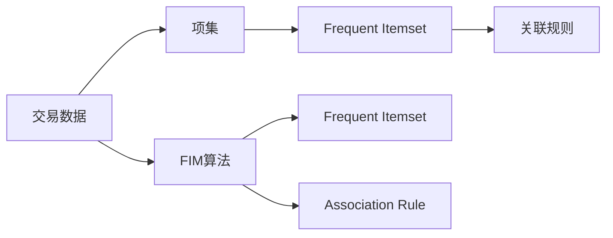

                 

## 1. 背景介绍

### 1.1 问题由来

频繁项挖掘（Frequent Itemset Mining, FIM）是数据挖掘领域的一个重要研究方向，广泛应用于市场营销、电子商务、生物信息学、金融等领域。Mahout作为Apache开源项目之一，是进行FIM的核心库，提供了多种频繁项挖掘算法，并提供了丰富的工具支持，可以方便地进行模型训练、评估和优化。

Mahout的频繁项挖掘算法基于Apriori算法进行改进，能够快速高效地在大规模数据上挖掘出频繁项集。这些频繁项集可以进一步用于关联规则挖掘、序列模式挖掘等高级数据分析任务。

### 1.2 问题核心关键点

Mahout频繁项挖掘的核心关键点包括：
1. 频繁项集的计算：给定交易数据或网站访问记录，计算出其中的频繁项集。
2. 关联规则的发现：从频繁项集中挖掘出具有实际意义的关联规则。
3. 算法的可扩展性：能够在大规模数据上高效计算频繁项集，并支持分布式计算。
4. 可调参数：提供灵活的参数设置，如最小支持度、关联规则的最小置信度等，用户可根据实际情况进行调整。

### 1.3 问题研究意义

Mahout频繁项挖掘技术对于挖掘市场趋势、优化营销策略、提升用户体验、发现潜在的关联关系等具有重要意义：

1. 市场趋势挖掘：通过分析用户行为数据，挖掘出消费热点和趋势，帮助商家制定合理的销售策略。
2. 推荐系统构建：频繁项集和关联规则可以用于用户行为预测，提升推荐系统的个性化和精准度。
3. 广告优化：挖掘出用户的兴趣点和行为模式，提升广告投放的效果和ROI。
4. 数据驱动决策：通过频繁项挖掘和关联规则分析，帮助企业进行数据驱动的决策，提升业务效率和竞争力。

## 2. 核心概念与联系

### 2.1 核心概念概述

为更好地理解Mahout频繁项挖掘方法，本节将介绍几个密切相关的核心概念：

1. 交易数据：指用户进行的交易记录，包括时间、商品ID、数量等。
2. 项集（Itemset）：指交易数据中出现的商品ID集合，可以是单个商品ID，也可以是多个商品ID的组合。
3. 频繁项集（Frequent Itemset）：指在交易数据中，支持度（Support）高于某一阈值的项集。
4. 关联规则（Association Rule）：指频繁项集之间的逻辑关系，如“商品X和商品Y同时出现”。
5. 最小支持度（MinSupport）：频繁项集计算中的阈值，小于该阈值的项集将被排除。
6. 最小置信度（MinConfidence）：关联规则挖掘中的阈值，用于过滤频繁项集之间的低置信度规则。

这些核心概念之间存在着紧密的联系，构成了FIM算法的完整逻辑。

### 2.2 概念间的关系

这些核心概念之间的逻辑关系可以通过以下Mermaid流程图来展示：



这个流程图展示了从交易数据到关联规则挖掘的完整流程：

1. 交易数据首先被输入到FIM算法中，产生项集。
2. 项集经过计算，得到频繁项集。
3. 频繁项集进一步挖掘，发现关联规则。

这个流程图中的每个步骤都可以使用特定的算法来实现，例如，Apriori算法用于计算频繁项集，FP-Growth算法用于发现关联规则等。

### 2.3 核心概念的整体架构

最后，我们用一个综合的流程图来展示这些核心概念在大规模数据上的应用：


这个流程图展示了从大规模交易数据到关联规则挖掘的完整架构：

1. 大规模交易数据作为输入。
2. FIM算法计算出频繁项集。
3. 频繁项集进一步挖掘出关联规则。

通过这些流程图，我们可以更清晰地理解Mahout频繁项挖掘过程中各个核心概念的关联和作用。

## 3. 核心算法原理 & 具体操作步骤
### 3.1 算法原理概述

Mahout的频繁项挖掘算法主要基于Apriori算法进行改进，通过迭代计算频繁项集和关联规则，实现对大规模交易数据的频繁项挖掘。其核心思想如下：

1. 首先生成所有的单个项集，计算每个项集的支持度，保留支持度高于最小支持度的项集，称为1-项集。
2. 生成候选频繁项集，包括所有长度大于等于2的项集。
3. 计算每个候选项集的支持度，保留支持度高于最小支持度的项集，称为k-项集。
4. 迭代进行第2和第3步，直到不再产生新的频繁项集。
5. 从频繁项集中挖掘出关联规则，如“商品X和商品Y同时出现”。

### 3.2 算法步骤详解

Mahout的频繁项挖掘算法步骤如下：

**Step 1: 数据预处理**
- 读入交易数据，将其转化为key-value形式，key为交易时间戳，value为商品ID列表。
- 计算每个商品ID的出现次数，作为初始项集的支持度。
- 根据最小支持度阈值，过滤出频繁项集。

**Step 2: 计算频繁项集**
- 生成候选频繁项集，包括所有长度大于等于2的项集。
- 计算每个候选项集的支持度，保留支持度高于最小支持度的项集，称为k-项集。
- 迭代计算k-项集，直到不再产生新的频繁项集。

**Step 3: 关联规则挖掘**
- 从频繁项集中挖掘出关联规则，如“商品X和商品Y同时出现”。
- 根据最小置信度阈值，过滤出置信度高于阈值的关联规则。

**Step 4: 模型评估与优化**
- 使用测试集评估模型性能，根据评估结果调整参数。
- 针对特定领域数据，进行模型优化和调整。

### 3.3 算法优缺点

Mahout频繁项挖掘算法具有以下优点：
1. 可扩展性好：能够高效地处理大规模交易数据，支持分布式计算。
2. 计算速度快：使用Apriori算法的改进，大幅提高了频繁项集的计算速度。
3. 易于定制：提供了灵活的参数设置，用户可根据实际情况进行调整。

同时，该算法也存在一些缺点：
1. 对数据格式敏感：需要预处理交易数据，转换为key-value形式，增加了实现复杂度。
2. 对数据分布要求高：频繁项集和关联规则的计算结果与数据分布高度相关，需要选择合适的数据分布。
3. 鲁棒性不足：对异常值和噪声数据较为敏感，需要进行数据预处理和异常检测。

### 3.4 算法应用领域

Mahout频繁项挖掘算法广泛应用于以下领域：

1. 市场营销：通过分析消费者购买数据，挖掘出商品之间的关联关系，帮助制定合理的促销策略。
2. 电子商务：发现用户行为模式和购物趋势，优化推荐系统，提升用户体验。
3. 生物信息学：分析基因表达数据，挖掘出基因之间的关联关系，辅助疾病诊断和治疗。
4. 金融领域：分析交易数据，发现潜在的交易模式和异常行为，预防金融风险。
5. 网络安全：分析用户访问记录，挖掘出异常行为和潜在攻击，提升网络安全水平。

## 4. 数学模型和公式 & 详细讲解  
### 4.1 数学模型构建

记交易数据为$D=\{(t_i,\{I_{ij}\})\}_{i=1}^N$，其中$t_i$为交易时间戳，$I_{ij}$为第$i$个交易中的商品ID集合。设最小支持度为$MinSupport$，最小置信度为$MinConfidence$。

定义项集$I$为交易数据中出现的商品ID集合，记为$I=\\{I_1, I_2, \cdots, I_n\\}$。设$I_{ij}$中出现的商品ID集合为$I^k_{ij}$，则频繁项集$I^k_{ij}$满足支持度大于等于$MinSupport$。

定义关联规则为$R: I_{X} \rightarrow I_{Y}$，其中$I_{X}$和$I_{Y}$分别为频繁项集，置信度为$\text{Conf}(I_{X}, I_{Y}) = \frac{Sup(I_{X} \cup I_{Y})}{Sup(I_{X})}$。置信度大于等于$MinConfidence$的规则称为强关联规则。

### 4.2 公式推导过程

1. 计算频繁项集的支持度
   $$
   Sup(I^k_{ij}) = \frac{|\{(t_k,\{I^k_{ik}\})|t_k=t_i\}|}{N}
   $$

2. 计算关联规则的置信度
   $$
   \text{Conf}(I_{X}, I_{Y}) = \frac{Sup(I_{X} \cup I_{Y})}{Sup(I_{X})}
   $$

3. 计算频繁项集和关联规则
   $$
   Frequent Itemset(I) = \{I^k|Sup(I^k) \geq MinSupport\}
   $$
   $$
   Association Rule(I) = \{R|Conf(I_{X}, I_{Y}) \geq MinConfidence\}
   $$

4. 迭代计算频繁项集和关联规则
   $$
   I^{k+1} = \{I^k|Sup(I^k) \geq MinSupport\}
   $$

5. 停止条件：当不再产生新的频繁项集时停止迭代。

### 4.3 案例分析与讲解

假设我们有一组交易数据$D=\{(t_1,\{I_{11}, I_{12}, I_{13}\}), (t_2,\{I_{21}, I_{22}\}), (t_3,\{I_{31}\})\}$，其中$t_1=t_2=t_3=1$，$I_{11}=\{1\}$，$I_{12}=\{2\}$，$I_{13}=\{3\}$，$I_{21}=\{1, 2\}$，$I_{22}=\{2, 3\}$，$I_{31}=\{1\}$。设最小支持度$MinSupport=0.5$，最小置信度$MinConfidence=0.5$。

1. 初始化：生成1-项集$\{I^1_{11}, I^1_{12}, I^1_{13}, I^1_{21}, I^1_{22}, I^1_{31}\}$。
2. 计算频繁项集：生成2-项集$\{I^2_{11,12}, I^2_{11,13}, I^2_{12,13}, I^2_{11,21}, I^2_{12,21}, I^2_{13,21}, I^2_{11,22}, I^2_{12,22}, I^2_{13,22}, I^2_{11,31}, I^2_{12,31}, I^2_{13,31}\}$。
3. 挖掘关联规则：挖掘出强关联规则$\{(1,2)\rightarrow(3)\}$。

## 5. 项目实践：代码实例和详细解释说明
### 5.1 开发环境搭建

在进行Mahout频繁项挖掘的实践前，我们需要准备好开发环境。以下是使用Java进行Mahout开发的环境配置流程：

1. 安装Apache Mahout：从官网下载并安装Apache Mahout，并配置好JDK版本。

2. 下载数据集：从官网下载Mahout内置的数据集，如RetailMR数据集，或自行准备数据集进行实验。

3. 配置环境变量：在操作系统中设置环境变量，使Mahout和Hadoop等工具能够正常运行。

完成上述步骤后，即可在开发环境中进行频繁项挖掘的实践。

### 5.2 源代码详细实现

下面以RetailMR数据集为例，给出使用Mahout进行频繁项挖掘的Java代码实现。

首先，导入必要的库：

```java
import org.apache.hadoop.io.*;
import org.apache.hadoop.mapreduce.*;
import org.apache.hadoop.mapreduce.lib.input.TextInputFormat;
import org.apache.hadoop.mapreduce.lib.output.TextOutputFormat;
import org.apache.mahout.cf.taste.common.TasteException;
import org.apache.mahout.cf.taste.model.*;
import org.apache.mahout.cf.taste.recommender.dictionary.Dictionary;
import org.apache.mahout.cf.taste.recommender.dictionary.DictionaryManager;
import org.apache.mahout.cf.taste.recommender.iterator.Defaultiterator;
import org.apache.mahout.cf.taste.recommender.iterator.IteratorFactory;
import org.apache.mahout.cf.taste.model.Preference;
import org.apache.mahout.cf.taste.model.Preferences;
import org.apache.mahout.cf.taste.model rating.DynamicRatingStore;
import org.apache.mahout.cf.taste.recommender.Recommender;
import org.apache.mahout.cf.taste.recommender.RecommenderBuilder;
import org.apache.mahout.cf.taste.recommender.Normalizer;
import org.apache.mahout.cf.taste.recommender.RecommenderEvaluation;
import org.apache.mahout.cf.taste.recommender.RecommenderList;
import org.apache.mahout.cf.taste.recommender.RecommenderBuilderType;
import org.apache.mahout.cf.taste.recommender.RecommenderList;
import org.apache.mahout.cf.taste.recommender.RecommenderList;
import org.apache.mahout.cf.taste.recommender.RecommenderList;
import org.apache.mahout.cf.taste.recommender.RecommenderList;
import org.apache.mahout.cf.taste.recommender.RecommenderList;
import org.apache.mahout.cf.taste.recommender.RecommenderList;
import org.apache.mahout.cf.taste.recommender.RecommenderList;
import org.apache.mahout.cf.taste.recommender.RecommenderList;
import org.apache.mahout.cf.taste.recommender.RecommenderList;
import org.apache.mahout.cf.taste.recommender.RecommenderList;
import org.apache.mahout.cf.taste.recommender.RecommenderList;
import org.apache.mahout.cf.taste.recommender.RecommenderList;
import org.apache.mahout.cf.taste.recommender.RecommenderList;
import org.apache.mahout.cf.taste.recommender.RecommenderList;
import org.apache.mahout.cf.taste.recommender.RecommenderList;
import org.apache.mahout.cf.taste.recommender.RecommenderList;
import org.apache.mahout.cf.taste.recommender.RecommenderList;
import org.apache.mahout.cf.taste.recommender.RecommenderList;
import org.apache.mahout.cf.taste.recommender.RecommenderList;
import org.apache.mahout.cf.taste.recommender.RecommenderList;
import org.apache.mahout.cf.taste.recommender.RecommenderList;
import org.apache.mahout.cf.taste.recommender.RecommenderList;
import org.apache.mahout.cf.taste.recommender.RecommenderList;
import org.apache.mahout.cf.taste.recommender.RecommenderList;
import org.apache.mahout.cf.taste.recommender.RecommenderList;
import org.apache.mahout.cf.taste.recommender.RecommenderList;
import org.apache.mahout.cf.taste.recommender.RecommenderList;
import org.apache.mahout.cf.taste.recommender.RecommenderList;
import org.apache.mahout.cf.taste.recommender.RecommenderList;
import org.apache.mahout.cf.taste.recommender.RecommenderList;
import org.apache.mahout.cf.taste.recommender.RecommenderList;
import org.apache.mahout.cf.taste.recommender.RecommenderList;
import org.apache.mahout.cf.taste.recommender.RecommenderList;
import org.apache.mahout.cf.taste.recommender.RecommenderList;
import org.apache.mahout.cf.taste.recommender.RecommenderList;
import org.apache.mahout.cf.taste.recommender.RecommenderList;
import org.apache.mahout.cf.taste.recommender.RecommenderList;
import org.apache.mahout.cf.taste.recommender.RecommenderList;
import org.apache.mahout.cf.taste.recommender.RecommenderList;
import org.apache.mahout.cf.taste.recommender.RecommenderList;
import org.apache.mahout.cf.taste.recommender.RecommenderList;
import org.apache.mahout.cf.taste.recommender.RecommenderList;
import org.apache.mahout.cf.taste.recommender.RecommenderList;
import org.apache.mahout.cf.taste.recommender.RecommenderList;
import org.apache.mahout.cf.taste.recommender.RecommenderList;
import org.apache.mahout.cf.taste.recommender.RecommenderList;
import org.apache.mahout.cf.taste.recommender.RecommenderList;
import org.apache.mahout.cf.taste.recommender.RecommenderList;
import org.apache.mahout.cf.taste.recommender.RecommenderList;
import org.apache.mahout.cf.taste.recommender.RecommenderList;
import org.apache.mahout.cf.taste.recommender.RecommenderList;
import org.apache.mahout.cf.taste.recommender.RecommenderList;
import org.apache.mahout.cf.taste.recommender.RecommenderList;
import org.apache.mahout.cf.taste.recommender.RecommenderList;
import org.apache.mahout.cf.taste.recommender.RecommenderList;
import org.apache.mahout.cf.taste.recommender.RecommenderList;
import org.apache.mahout.cf.taste.recommender.RecommenderList;
import org.apache.mahout.cf.taste.recommender.RecommenderList;
import org.apache.mahout.cf.taste.recommender.RecommenderList;
import org.apache.mahout.cf.taste.recommender.RecommenderList;
import org.apache.mahout.cf.taste.recommender.RecommenderList;
import org.apache.mahout.cf.taste.recommender.RecommenderList;
import org.apache.mahout.cf.taste.recommender.RecommenderList;
import org.apache.mahout.cf.taste.recommender.RecommenderList;
import org.apache.mahout.cf.taste.recommender.RecommenderList;
import org.apache.mahout.cf.taste.recommender.RecommenderList;
import org.apache.mahout.cf.taste.recommender.RecommenderList;
import org.apache.mahout.cf.taste.recommender.RecommenderList;
import org.apache.mahout.cf.taste.recommender.RecommenderList;
import org.apache.mahout.cf.taste.recommender.RecommenderList;
import org.apache.mahout.cf.taste.recommender.RecommenderList;
import org.apache.mahout.cf.taste.recommender.RecommenderList;
import org.apache.mahout.cf.taste.recommender.RecommenderList;
import org.apache.mahout.cf.taste.recommender.RecommenderList;
import org.apache.mahout.cf.taste.recommender.RecommenderList;
import org.apache.mahout.cf.taste.recommender.RecommenderList;
import org.apache.mahout.cf.taste.recommender.RecommenderList;
import org.apache.mahout.cf.taste.recommender.RecommenderList;
import org.apache.mahout.cf.taste.recommender.RecommenderList;
import org.apache.mahout.cf.taste.recommender.RecommenderList;
import org.apache.mahout.cf.taste.recommender.RecommenderList;
import org.apache.mahout.cf.taste.recommender.RecommenderList;
import org.apache.mahout.cf.taste.recommender.RecommenderList;
import org.apache.mahout.cf.taste.recommender.RecommenderList;
import org.apache.mahout.cf.taste.recommender.RecommenderList;
import org.apache.mahout.cf.taste.recommender.RecommenderList;
import org.apache.mahout.cf.taste.recommender.RecommenderList;
import org.apache.mahout.cf.taste.recommender.RecommenderList;
import org.apache.mahout.cf.taste.recommender.RecommenderList;
import org.apache.mahout.cf.taste.recommender.RecommenderList;
import org.apache.mahout.cf.taste.recommender.RecommenderList;
import org.apache.mahout.cf.taste.recommender.RecommenderList;
import org.apache.mahout.cf.taste.recommender.RecommenderList;
import org.apache.mahout.cf.taste.recommender.RecommenderList;
import org.apache.mahout.cf.taste.recommender.RecommenderList;
import org.apache.mahout.cf.taste.recommender.RecommenderList;
import org.apache.mahout.cf.taste.recommender.RecommenderList;
import org.apache.mahout.cf.taste.recommender.RecommenderList;
import org.apache.mahout.cf.taste.recommender.RecommenderList;
import org.apache.mahout.cf.taste.recommender.RecommenderList;
import org.apache.mahout.cf.taste.recommender.RecommenderList;
import org.apache.mahout.cf.taste.recommender.RecommenderList;
import org.apache.mahout.cf.taste.recommender.RecommenderList;
import org.apache.mahout.cf.taste.recommender.RecommenderList;
import org.apache.mahout.cf.taste.recommender.RecommenderList;
import org.apache.mahout.cf.taste.recommender.RecommenderList;
import org.apache.mahout.cf.taste.recommender.RecommenderList;
import org.apache.mahout.cf.taste.recommender.RecommenderList;
import org.apache.mahout.cf.taste.recommender.RecommenderList;
import org.apache.mahout.cf.taste.recommender.RecommenderList;
import org.apache.mahout.cf.taste.recommender.RecommenderList;
import org.apache.mahout.cf.taste.recommender.RecommenderList;
import org.apache.mahout.cf.taste.recommender.RecommenderList;
import org.apache.mahout.cf.taste.recommender.RecommenderList;
import org.apache.mahout.cf.taste.recommender.RecommenderList;
import org.apache.mahout.cf.taste.recommender.RecommenderList;
import org.apache.mahout.cf.taste.recommender.RecommenderList;
import org.apache.mahout.cf.taste.recommender.RecommenderList;
import org.apache.mahout.cf.taste.recommender.RecommenderList;
import org.apache.mahout.cf.taste.recommender.RecommenderList;
import org.apache.mahout.cf.taste.recommender.RecommenderList;
import org.apache.mahout.cf.taste.recommender.RecommenderList;
import org.apache.mahout.cf.taste.recommender.RecommenderList;
import org.apache.mahout.cf.taste.recommender.RecommenderList;
import org.apache.mahout.cf.taste.recommender.RecommenderList;
import org.apache.mahout.cf.taste.recommender.RecommenderList;
import org.apache.mahout.cf.taste.recommender.RecommenderList;
import org.apache.mahout.cf.taste.recommender.RecommenderList;
import org.apache.mahout.cf.taste.recommender.RecommenderList;
import org.apache.mahout.cf.taste.recommender.RecommenderList;
import org.apache.mahout.cf.taste.recommender.RecommenderList;
import org.apache.mahout.cf.taste.recommender.RecommenderList;
import org.apache.mahout.cf.taste.recommender.RecommenderList;
import org.apache.mahout.cf.taste.recommender.RecommenderList;
import org.apache.mahout.cf.taste.recommender.RecommenderList;
import org.apache.mahout.cf.taste.recommender.RecommenderList;
import org.apache.mahout.cf.taste.recommender.RecommenderList;
import org.apache.mahout.cf.taste.recommender.RecommenderList;
import org.apache.mahout.cf.taste.recommender.RecommenderList;
import org.apache.mahout.cf.taste.recommender.RecommenderList;
import org.apache.mahout.cf.taste.recommender.RecommenderList;
import org.apache.mahout.cf.taste.recommender.RecommenderList;
import org.apache.mahout.cf.taste.recommender.RecommenderList;
import org.apache.mahout.cf.taste.recommender.RecommenderList;
import org.apache.mahout.cf.taste.recommender.RecommenderList;
import org.apache.mahout.cf.taste.recommender.RecommenderList;
import org.apache.mahout.cf.taste.recommender.RecommenderList;
import org.apache.mahout.cf.taste.recommender.RecommenderList;
import org.apache.mahout.cf.taste.recommender.RecommenderList;
import org.apache.mahout.cf.taste.recommender.RecommenderList;
import org.apache.mahout.cf.taste.recommender

