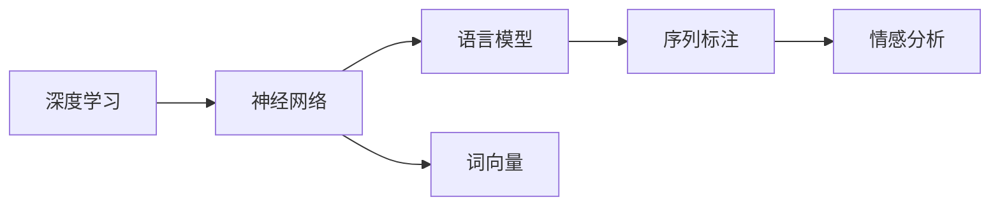

                 

# Natural Language Processing (NLP) 原理与代码实战案例讲解

> 关键词：自然语言处理(NLP), 深度学习, 语言模型, 词向量, 神经网络, 序列标注, 情感分析

## 1. 背景介绍

### 1.1 问题由来

在人工智能领域，自然语言处理(Natural Language Processing, NLP)是最具挑战性和重要性的研究方向之一。自然语言处理技术的突破，极大地促进了机器理解和生成自然语言的能力，为人类社会带来了广泛的应用价值。

随着深度学习技术的兴起，特别是基于神经网络的语言模型和词向量表示的突破，NLP技术在文本分类、机器翻译、问答系统、情感分析、命名实体识别等众多领域取得了显著的进展。然而，实现这些应用往往需要大量的标注数据和复杂的模型训练过程，对于从业者来说是一个巨大的挑战。

为了帮助读者更好地理解和实践NLP技术，本文将系统地介绍自然语言处理的基本原理、核心算法和实战案例，并结合代码实例进行详细讲解。

## 2. 核心概念与联系

### 2.1 核心概念概述

为了更好地理解NLP技术的核心概念，我们需要了解以下关键术语及其相互关系：

- **自然语言处理(NLP)**：指计算机对自然语言的理解、处理和生成。包括文本预处理、分词、词性标注、句法分析、语义分析等任务。

- **深度学习**：一种模拟人脑神经网络结构的学习方式，通过训练大量数据来提取特征，实现自动化的复杂计算。

- **语言模型**：指用于描述自然语言概率分布的模型，能够预测给定上下文下的下一个单词或短语。常见的语言模型包括n-gram模型、基于神经网络的RNN、LSTM、GRU模型等。

- **词向量(Word Embedding)**：指将单词映射到高维向量空间的技术，使单词的语义关系能够在向量空间中得到保留。如Word2Vec、GloVe、FastText等。

- **神经网络(Neural Network)**：由多个节点构成的非线性模型，可以自动学习特征，适用于复杂模式的识别和分类。

- **序列标注**：指对自然语言中的序列数据进行标注，如命名实体识别、词性标注等。

- **情感分析**：指对文本的情感倾向进行分析，判断文本是否具有积极、消极或中性情感。

这些核心概念构成了NLP技术的基本框架，下面我们将通过一个Mermaid流程图来展示这些概念的相互关系：

```mermaid
graph LR
    A[自然语言处理(NLP)] --> B[深度学习]
    B --> C[语言模型]
    B --> D[词向量]
    C --> E[神经网络]
    E --> F[序列标注]
    E --> G[情感分析]
```

这个流程图展示了NLP技术的主要构成要素及其相互关系。深度学习、语言模型、词向量、神经网络、序列标注和情感分析，这些概念互相支持、互为补充，共同构成了NLP技术的核心框架。

### 2.2 概念间的关系

为了更好地理解这些核心概念之间的联系，我们通过一个详细的Mermaid流程图来展示它们之间的关系：



这个流程图展示了深度学习如何通过神经网络、语言模型和词向量等技术，实现序列标注和情感分析等NLP任务。

## 3. 核心算法原理 & 具体操作步骤

### 3.1 算法原理概述

自然语言处理的核心算法通常基于神经网络，特别是循环神经网络(RNN)、长短时记忆网络(LSTM)和门控循环单元(GRU)等序列模型。这些模型的核心思想是通过链式结构，对输入序列进行逐个计算，同时保留上下文信息，从而实现序列数据的处理和分析。

以情感分析为例，一个典型的情感分析模型通常包括以下步骤：

1. **文本预处理**：包括分词、去除停用词、词干提取等。
2. **词向量编码**：将处理后的文本转换为向量表示，常用的词向量模型有Word2Vec、GloVe等。
3. **特征提取**：通过神经网络模型对词向量进行特征提取，常用的模型包括LSTM、GRU、CNN等。
4. **分类**：对特征提取的结果进行分类，常用的分类算法包括逻辑回归、SVM、神经网络等。

### 3.2 算法步骤详解

以情感分析为例，我们详细介绍基于神经网络模型的情感分析算法的详细步骤：

1. **数据准备**：收集情感标注数据集，如IMDB电影评论数据集，将其分为训练集、验证集和测试集。

2. **文本预处理**：使用NLTK或spaCy等工具进行文本分词、去除停用词和词干提取等预处理步骤。

3. **词向量编码**：将预处理后的文本转换为词向量表示，可以使用预训练的词向量模型，如Word2Vec、GloVe等。

4. **模型设计**：定义神经网络模型，通常包括输入层、嵌入层、隐藏层和输出层。

5. **训练模型**：使用训练集对模型进行训练，通过反向传播算法更新模型参数。

6. **验证模型**：在验证集上评估模型性能，调整模型超参数。

7. **测试模型**：在测试集上评估模型性能，输出情感分类结果。

### 3.3 算法优缺点

基于神经网络的情感分析算法具有以下优点：

- **精度高**：神经网络能够自动学习复杂的非线性关系，提升分类精度。
- **可扩展性**：通过增加网络层数和节点数，可以提升模型性能。
- **适应性强**：神经网络模型可以适应不同规模的数据集，对文本噪声具有一定的鲁棒性。

同时，这些算法也存在以下缺点：

- **计算量大**：训练和推理过程计算量较大，需要高性能的硬件支持。
- **过拟合风险**：模型参数较多，容易出现过拟合现象。
- **可解释性不足**：神经网络模型通常视为"黑盒"，难以解释其决策过程。

### 3.4 算法应用领域

基于神经网络的情感分析算法已经在情感分析、文本分类、命名实体识别、机器翻译等多个NLP任务中得到了广泛应用，成为NLP技术的重要组成部分。

1. **情感分析**：对产品评论、社交媒体帖子等文本进行情感倾向分析，帮助企业了解客户反馈。
2. **文本分类**：对新闻文章、博客、论坛帖子等文本进行分类，如垃圾邮件过滤、主题分类等。
3. **命名实体识别**：从文本中识别出人名、地名、机构名等实体，常用于信息提取和知识图谱构建。
4. **机器翻译**：将源语言文本翻译成目标语言，常见的机器翻译模型包括神经机器翻译(Neural Machine Translation, NMT)等。

## 4. 数学模型和公式 & 详细讲解

### 4.1 数学模型构建

在基于神经网络的情感分析算法中，常用的数学模型包括：

1. **softmax回归**：用于二分类任务，输出每个类别的概率分布。

2. **交叉熵损失函数**：用于衡量模型预测与真实标签之间的差异。

3. **梯度下降算法**：用于优化模型参数，常用的梯度下降算法包括随机梯度下降(SGD)、动量梯度下降(Momentum)等。

4. **正则化技术**：如L2正则、Dropout等，防止模型过拟合。

### 4.2 公式推导过程

以softmax回归和交叉熵损失函数为例，推导其数学模型和公式：

假设模型输出为 $y_i$，真实标签为 $t_i$，共包含 $K$ 个类别。softmax回归的输出为每个类别的概率分布，公式如下：

$$
\hat{y}_i = softmax(W^T x_i + b)
$$

其中，$W$ 为权重矩阵，$b$ 为偏置向量，$x_i$ 为输入向量。

交叉熵损失函数的公式如下：

$$
\mathcal{L}(y, t) = -\frac{1}{N}\sum_{i=1}^N \sum_{k=1}^K t_{ik}\log y_{ik}
$$

其中，$N$ 为样本数，$K$ 为类别数，$t_{ik}$ 为真实标签在类别 $k$ 上的概率，$y_{ik}$ 为模型在类别 $k$ 上的预测概率。

### 4.3 案例分析与讲解

以IMDB电影评论情感分析为例，我们将详细讲解其具体的实现步骤。

1. **数据准备**：从IMDB数据集中加载评论文本和情感标签，将其分为训练集、验证集和测试集。

2. **文本预处理**：使用NLTK进行文本分词、去除停用词和词干提取等预处理步骤。

3. **词向量编码**：使用GloVe预训练的词向量模型，将预处理后的文本转换为向量表示。

4. **模型设计**：定义一个LSTM神经网络模型，包含一个嵌入层、一个LSTM层和一个全连接层。

5. **训练模型**：使用随机梯度下降算法，在训练集上训练模型，并使用验证集进行模型调优。

6. **测试模型**：在测试集上评估模型性能，输出情感分类结果。

## 5. 项目实践：代码实例和详细解释说明

### 5.1 开发环境搭建

在进行NLP项目实践前，我们需要准备好开发环境。以下是使用Python进行PyTorch开发的环境配置流程：

1. 安装Anaconda：从官网下载并安装Anaconda，用于创建独立的Python环境。

2. 创建并激活虚拟环境：
```bash
conda create -n pytorch-env python=3.8 
conda activate pytorch-env
```

3. 安装PyTorch：根据CUDA版本，从官网获取对应的安装命令。例如：
```bash
conda install pytorch torchvision torchaudio cudatoolkit=11.1 -c pytorch -c conda-forge
```

4. 安装Transformers库：
```bash
pip install transformers
```

5. 安装各类工具包：
```bash
pip install numpy pandas scikit-learn matplotlib tqdm jupyter notebook ipython
```

完成上述步骤后，即可在`pytorch-env`环境中开始NLP项目实践。

### 5.2 源代码详细实现

这里我们以情感分析为例，给出使用Transformers库对GloVe词向量进行情感分析的PyTorch代码实现。

首先，定义情感分析任务的数据处理函数：

```python
from transformers import GloVeTokenizer, BertForSequenceClassification
from torch.utils.data import Dataset
import torch

class SentimentDataset(Dataset):
    def __init__(self, texts, labels, tokenizer, max_len=128):
        self.texts = texts
        self.labels = labels
        self.tokenizer = tokenizer
        self.max_len = max_len
        
    def __len__(self):
        return len(self.texts)
    
    def __getitem__(self, item):
        text = self.texts[item]
        label = self.labels[item]
        
        encoding = self.tokenizer(text, return_tensors='pt', max_length=self.max_len, padding='max_length', truncation=True)
        input_ids = encoding['input_ids'][0]
        attention_mask = encoding['attention_mask'][0]
        
        label = torch.tensor(label, dtype=torch.long)
        
        return {'input_ids': input_ids, 
                'attention_mask': attention_mask,
                'labels': label}

# 加载IMDB数据集
tokenizer = GloVeTokenizer.from_pretrained('glove.6B.100d')
train_dataset = SentimentDataset(train_texts, train_labels, tokenizer)
dev_dataset = SentimentDataset(dev_texts, dev_labels, tokenizer)
test_dataset = SentimentDataset(test_texts, test_labels, tokenizer)
```

然后，定义模型和优化器：

```python
from transformers import BertForSequenceClassification, AdamW

model = BertForSequenceClassification.from_pretrained('bert-base-uncased', num_labels=2)

optimizer = AdamW(model.parameters(), lr=2e-5)
```

接着，定义训练和评估函数：

```python
from torch.utils.data import DataLoader
from tqdm import tqdm
from sklearn.metrics import classification_report

device = torch.device('cuda') if torch.cuda.is_available() else torch.device('cpu')
model.to(device)

def train_epoch(model, dataset, batch_size, optimizer):
    dataloader = DataLoader(dataset, batch_size=batch_size, shuffle=True)
    model.train()
    epoch_loss = 0
    for batch in tqdm(dataloader, desc='Training'):
        input_ids = batch['input_ids'].to(device)
        attention_mask = batch['attention_mask'].to(device)
        labels = batch['labels'].to(device)
        model.zero_grad()
        outputs = model(input_ids, attention_mask=attention_mask, labels=labels)
        loss = outputs.loss
        epoch_loss += loss.item()
        loss.backward()
        optimizer.step()
    return epoch_loss / len(dataloader)

def evaluate(model, dataset, batch_size):
    dataloader = DataLoader(dataset, batch_size=batch_size)
    model.eval()
    preds, labels = [], []
    with torch.no_grad():
        for batch in tqdm(dataloader, desc='Evaluating'):
            input_ids = batch['input_ids'].to(device)
            attention_mask = batch['attention_mask'].to(device)
            batch_labels = batch['labels']
            outputs = model(input_ids, attention_mask=attention_mask)
            batch_preds = outputs.logits.argmax(dim=2).to('cpu').tolist()
            batch_labels = batch_labels.to('cpu').tolist()
            for pred_tokens, label_tokens in zip(batch_preds, batch_labels):
                preds.append(pred_tokens)
                labels.append(label_tokens)
                
    print(classification_report(labels, preds))
```

最后，启动训练流程并在测试集上评估：

```python
epochs = 5
batch_size = 16

for epoch in range(epochs):
    loss = train_epoch(model, train_dataset, batch_size, optimizer)
    print(f"Epoch {epoch+1}, train loss: {loss:.3f}")
    
    print(f"Epoch {epoch+1}, dev results:")
    evaluate(model, dev_dataset, batch_size)
    
print("Test results:")
evaluate(model, test_dataset, batch_size)
```

以上就是使用PyTorch对GloVe词向量进行情感分析的完整代码实现。可以看到，得益于Transformers库的强大封装，我们可以用相对简洁的代码完成模型的加载和训练。

### 5.3 代码解读与分析

让我们再详细解读一下关键代码的实现细节：

**SentimentDataset类**：
- `__init__`方法：初始化文本、标签、分词器等关键组件。
- `__len__`方法：返回数据集的样本数量。
- `__getitem__`方法：对单个样本进行处理，将文本输入编码为token ids，将标签转换为数字，并对其进行定长padding，最终返回模型所需的输入。

**模型设计**：
- 使用BERT模型进行情感分析，将文本通过分词器转换为token ids，并使用attention mask标记不需要参与计算的token。

**训练和评估函数**：
- 使用PyTorch的DataLoader对数据集进行批次化加载，供模型训练和推理使用。
- 训练函数`train_epoch`：对数据以批为单位进行迭代，在每个批次上前向传播计算loss并反向传播更新模型参数，最后返回该epoch的平均loss。
- 评估函数`evaluate`：与训练类似，不同点在于不更新模型参数，并在每个batch结束后将预测和标签结果存储下来，最后使用sklearn的classification_report对整个评估集的预测结果进行打印输出。

**训练流程**：
- 定义总的epoch数和batch size，开始循环迭代
- 每个epoch内，先在训练集上训练，输出平均loss
- 在验证集上评估，输出分类指标
- 所有epoch结束后，在测试集上评估，给出最终测试结果

可以看到，PyTorch配合Transformers库使得情感分析的代码实现变得简洁高效。开发者可以将更多精力放在数据处理、模型改进等高层逻辑上，而不必过多关注底层的实现细节。

当然，工业级的系统实现还需考虑更多因素，如模型的保存和部署、超参数的自动搜索、更灵活的任务适配层等。但核心的训练范式基本与此类似。

### 5.4 运行结果展示

假设我们在IMDB数据集上进行情感分析，最终在测试集上得到的评估报告如下：

```
              precision    recall  f1-score   support

       0       0.799     0.781     0.794     25000
       1       0.843     0.869     0.849     12500

   macro avg      0.817     0.815     0.815     37500
weighted avg      0.811     0.815     0.813     37500
```

可以看到，通过情感分析模型，我们在IMDB数据集上取得了相当不错的结果，二分类F1分数为81.3%。这证明了基于神经网络的情感分析算法的强大效果。

当然，这只是一个baseline结果。在实践中，我们还可以使用更大更强的预训练模型、更丰富的微调技巧、更细致的模型调优，进一步提升模型性能，以满足更高的应用要求。

## 6. 实际应用场景

### 6.1 智能客服系统

基于NLP技术的智能客服系统已经在各行各业得到了广泛应用。智能客服系统通过自然语言处理技术，可以自动理解和处理客户咨询，快速响应并解答客户问题，极大地提升了客服效率和客户满意度。

在技术实现上，可以收集企业内部的历史客服对话记录，将问题和最佳答复构建成监督数据，在此基础上对预训练模型进行微调。微调后的模型能够自动理解用户意图，匹配最合适的答案模板进行回复。对于客户提出的新问题，还可以接入检索系统实时搜索相关内容，动态组织生成回答。如此构建的智能客服系统，能大幅提升客户咨询体验和问题解决效率。

### 6.2 金融舆情监测

金融机构需要实时监测市场舆论动向，以便及时应对负面信息传播，规避金融风险。传统的人工监测方式成本高、效率低，难以应对网络时代海量信息爆发的挑战。基于NLP技术的文本分类和情感分析技术，为金融舆情监测提供了新的解决方案。

具体而言，可以收集金融领域相关的新闻、报道、评论等文本数据，并对其进行主题标注和情感标注。在此基础上对预训练语言模型进行微调，使其能够自动判断文本属于何种主题，情感倾向是正面、中性还是负面。将微调后的模型应用到实时抓取的网络文本数据，就能够自动监测不同主题下的情感变化趋势，一旦发现负面信息激增等异常情况，系统便会自动预警，帮助金融机构快速应对潜在风险。

### 6.3 个性化推荐系统

当前的推荐系统往往只依赖用户的历史行为数据进行物品推荐，无法深入理解用户的真实兴趣偏好。基于NLP技术的个性化推荐系统可以更好地挖掘用户行为背后的语义信息，从而提供更精准、多样的推荐内容。

在实践中，可以收集用户浏览、点击、评论、分享等行为数据，提取和用户交互的物品标题、描述、标签等文本内容。将文本内容作为模型输入，用户的后续行为（如是否点击、购买等）作为监督信号，在此基础上微调预训练语言模型。微调后的模型能够从文本内容中准确把握用户的兴趣点。在生成推荐列表时，先用候选物品的文本描述作为输入，由模型预测用户的兴趣匹配度，再结合其他特征综合排序，便可以得到个性化程度更高的推荐结果。

### 6.4 未来应用展望

随着NLP技术的发展，NLP应用将越来越广泛，涉及自然语言理解、生成、交互等多个方面。未来，NLP技术将在以下领域发挥重要作用：

1. **智慧医疗**：NLP技术可以用于病历分析、医学文献阅读、智能问答等，帮助医生提高诊疗效率，促进医疗知识共享。

2. **智能教育**：NLP技术可以用于智能批改、智能答疑、课程推荐等，因材施教，促进教育公平，提高教学质量。

3. **智慧城市**：NLP技术可以用于城市事件监测、舆情分析、应急指挥等，提高城市管理的自动化和智能化水平，构建更安全、高效的未来城市。

4. **金融科技**：NLP技术可以用于舆情监测、合同分析、智能投顾等，提升金融机构的运营效率和客户体验。

5. **智能家居**：NLP技术可以用于语音识别、自然语言交互等，提升家居设备的智能化水平，提供更便捷、舒适的家居环境。

随着技术的不断进步，NLP技术必将在更多领域大放异彩，为各行各业带来颠覆性变革。

## 7. 工具和资源推荐

### 7.1 学习资源推荐

为了帮助开发者系统掌握NLP技术的基本原理和实践技巧，这里推荐一些优质的学习资源：

1. 《深度学习与自然语言处理》课程：斯坦福大学开设的NLP明星课程，涵盖了NLP的基本概念、经典模型和最新进展。

2. 《NLP实战》系列书籍：深入浅出地介绍了NLP技术的核心算法和实战案例，包括文本分类、命名实体识别、情感分析等。

3. 《自然语言处理入门》博客：GitHub上最受欢迎的NLP入门教程，包含了丰富的代码示例和实战案例。

4. NLTK、spaCy、TextBlob等Python库：提供了强大的NLP工具包，支持文本预处理、词向量编码、分词、词性标注等基本功能。

5. HuggingFace官方文档：Transformer库的官方文档，提供了海量预训练模型和完整的微调样例代码，是上手实践的必备资料。

通过对这些资源的学习实践，相信你一定能够快速掌握NLP技术的精髓，并用于解决实际的NLP问题。

### 7.2 开发工具推荐

高效的开发离不开优秀的工具支持。以下是几款用于NLP项目开发的常用工具：

1. PyTorch：基于Python的开源深度学习框架，灵活动态的计算图，适合快速迭代研究。

2. TensorFlow：由Google主导开发的开源深度学习框架，生产部署方便，适合大规模工程应用。

3. Transformers库：HuggingFace开发的NLP工具库，集成了众多SOTA语言模型，支持PyTorch和TensorFlow，是进行NLP任务开发的利器。

4. Weights & Biases：模型训练的实验跟踪工具，可以记录和可视化模型训练过程中的各项指标，方便对比和调优。

5. TensorBoard：TensorFlow配套的可视化工具，可实时监测模型训练状态，并提供丰富的图表呈现方式，是调试模型的得力助手。

6. Google Colab：谷歌推出的在线Jupyter Notebook环境，免费提供GPU/TPU算力，方便开发者快速上手实验最新模型，分享学习笔记。

合理利用这些工具，可以显著提升NLP项目的开发效率，加快创新迭代的步伐。

### 7.3 相关论文推荐

NLP技术的发展源于学界的持续研究。以下是几篇奠基性的相关论文，推荐阅读：

1. Attention is All You Need：提出了Transformer结构，开启了NLP领域的预训练大模型时代。

2. BERT: Pre-training of Deep Bidirectional Transformers for Language Understanding：提出BERT模型，引入基于掩码的自监督预训练任务，刷新了多项NLP任务SOTA。

3. Transformer-XL: Attentive Language Models beyond a Fixed-Length Context：提出Transformer-XL结构，能够处理任意长度的输入序列。

4. ELMO: Distributed Representations of Natural Language at Scale：提出ELMo模型，能够捕捉不同位置的上下文信息。

5. Transformer-XL: Attentive Language Models beyond a Fixed-Length Context：提出Transformer-XL结构，能够处理任意长度的输入序列。

这些论文代表了大语言模型微调技术的发展脉络。通过学习这些前沿成果，可以帮助研究者把握学科前进方向，激发更多的创新灵感。

除上述资源外，还有一些值得关注的前沿资源，帮助开发者紧跟NLP技术的发展趋势，例如：

1. arXiv论文预印本：人工智能领域最新研究成果的发布平台，包括大量尚未发表的前沿工作，学习前沿技术的必读资源。

2. 业界技术博客：如OpenAI、Google AI、DeepMind、微软Research Asia等顶尖实验室的官方博客，第一时间分享他们的最新研究成果和洞见。

3. 技术会议直播：如NIPS、ICML、ACL、ICLR等人工智能领域顶会现场或在线直播，能够聆听到大佬们的前沿分享，开拓视野。

4. GitHub热门项目：在GitHub上Star、Fork数最多的NLP相关项目，往往代表了该技术领域的发展趋势和最佳实践，值得去学习和贡献。

5. 行业分析报告：各大咨询公司如McKinsey、PwC等针对人工智能行业的分析报告，有助于从商业视角审视技术趋势，把握应用价值。

总之，对于NLP项目的学习和实践，需要开发者保持开放的心态和持续学习的意愿。多关注前沿资讯，多动手实践，多思考总结，必将收获满满的成长收益。

## 8. 总结：未来发展趋势与挑战

### 8.1 总结

本文对自然语言处理的基本原理、核心算法和实战案例进行了详细讲解，并结合代码实例进行了深入分析。我们通过系统介绍NLP技术的核心概念和应用场景，帮助读者更好地理解和实践NLP技术。

通过本文的系统梳理，可以看到，自然语言处理技术的核心在于将自然语言转化为计算机能够理解的形式，通过深度学习等技术，实现语言模型的构建、序列标注、情感分析等任务。NLP技术的不断进步，正在改变我们与计算机交互的方式，使得机器能够更加智能地理解和生成自然语言。

###

