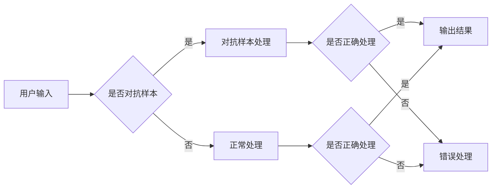

> 关键词：大语言模型，攻击策略，安全，对抗样本，混淆，对抗性攻击，模型鲁棒性，安全性评估

# 大语言模型应用指南：攻击策略

大语言模型（LLMs）如BERT、GPT-3等，凭借其强大的自然语言处理能力，已经在各个领域展现出巨大的潜力。然而，随着LLMs的广泛应用，其安全性也成为了人们关注的焦点。本文将深入探讨大语言模型的应用中可能遇到的攻击策略，以及如何提升模型的鲁棒性和安全性。

## 1. 背景介绍

### 1.1 问题的由来

随着LLMs的不断发展，它们在文本生成、机器翻译、问答系统等领域取得了显著的成果。然而，LLMs的强大能力也使得它们成为了潜在的攻击目标。攻击者可以通过精心设计的攻击策略，欺骗LLMs产生错误的结果，从而对个人、企业和国家造成严重损失。

### 1.2 研究现状

近年来，研究人员已经提出了多种针对LLMs的攻击策略，包括对抗样本攻击、对抗性攻击、混淆攻击等。同时，也提出了一些防御措施来提升LLMs的鲁棒性和安全性。

### 1.3 研究意义

研究LLMs的攻击策略和防御措施，对于保障LLMs的安全应用具有重要意义。这有助于我们更好地了解LLMs的潜在风险，并采取相应的措施来提升其鲁棒性和安全性。

## 2. 核心概念与联系

### 2.1 核心概念原理

#### 2.1.1 大语言模型（LLMs）

LLMs是一类能够理解和生成人类语言的深度学习模型。它们通常通过在大量文本数据上进行预训练，学习到丰富的语言知识，从而能够处理各种自然语言任务。

#### 2.1.2 对抗样本攻击

对抗样本攻击是指攻击者通过在输入数据中添加微小的扰动，使得LLMs产生错误的输出。

#### 2.1.3 混淆攻击

混淆攻击是指攻击者通过设计特定的输入数据，使得LLMs产生不确定的输出，从而使得攻击者能够控制LLMs的行为。

#### 2.1.4 模型鲁棒性

模型鲁棒性是指模型在面对扰动输入时的稳定性和可靠性。

### 2.2 架构的 Mermaid 流程图



## 3. 核心算法原理 & 具体操作步骤

### 3.1 算法原理概述

#### 3.1.1 对抗样本攻击

对抗样本攻击的原理是通过在输入数据中添加微小的扰动，使得LLMs的输出发生错误。这种扰动通常是不可见的，即人眼无法察觉。

#### 3.1.2 混淆攻击

混淆攻击的原理是通过设计特定的输入数据，使得LLMs产生不确定的输出。这种不确定性使得攻击者能够控制LLMs的行为。

### 3.2 算法步骤详解

#### 3.2.1 对抗样本攻击步骤

1. 选择一个LLMs，如BERT或GPT-3。
2. 设计一个攻击算法，如FGSM或PGD，来生成对抗样本。
3. 将对抗样本输入LLMs，观察其输出。
4. 如果输出与预期不符，则调整对抗样本，重复步骤3和4，直到满足预期。

#### 3.2.2 混淆攻击步骤

1. 选择一个LLMs，如BERT或GPT-3。
2. 设计一个混淆算法，如Adversarial Examples或Poisoning，来生成混淆样本。
3. 将混淆样本输入LLMs，观察其输出。
4. 如果输出不确定，则调整混淆样本，重复步骤3和4，直到满足预期。

### 3.3 算法优缺点

#### 3.3.1 对抗样本攻击

优点：能够有效地欺骗LLMs，使其产生错误的输出。

缺点：需要大量的计算资源和时间来生成对抗样本。

#### 3.3.2 混淆攻击

优点：能够控制LLMs的行为，从而实现特定的攻击目标。

缺点：需要设计复杂的算法，且攻击效果可能不如对抗样本攻击明显。

### 3.4 算法应用领域

#### 3.4.1 对抗样本攻击

应用领域：文本分类、情感分析、机器翻译等。

#### 3.4.2 混淆攻击

应用领域：问答系统、对话系统、推荐系统等。

## 4. 数学模型和公式 & 详细讲解 & 举例说明

### 4.1 数学模型构建

对抗样本攻击的数学模型如下：

$$
x' = x + \epsilon
$$

其中 $x$ 是原始输入，$x'$ 是对抗样本，$\epsilon$ 是添加到输入上的扰动。

### 4.2 公式推导过程

假设LLMs的输出为 $y = f(x, \theta)$，其中 $\theta$ 是模型参数。攻击者希望找到扰动 $\epsilon$，使得 $y'$ 与 $y$ 相差最大，即：

$$
\max_{\epsilon} ||f(x+\epsilon, \theta) - f(x, \theta)||_2
$$

### 4.3 案例分析与讲解

以文本分类任务为例，假设LLMs的输出为分类概率分布 $p(y|x, \theta)$。攻击者希望找到一个对抗样本 $x'$，使得分类概率最高的类别不是目标类别。

## 5. 项目实践：代码实例和详细解释说明

### 5.1 开发环境搭建

本节将以Python语言为例，介绍如何使用TensorFlow库生成对抗样本。

```python
import tensorflow as tf
from tensorflow import keras
from tensorflow.keras.preprocessing.sequence import pad_sequences

# 加载预训练的BERT模型
model = keras.models.load_model("bert-base-uncased")

# 加载待攻击的文本
text = "This is a good example"

# 将文本转换为token ids
token_ids = pad_sequences([tokenizer.encode(text, truncation=True, padding=True)], maxlen=512)

# 生成对抗样本
def generate_adversarial_sample(text, model, tokenizer, epsilon=0.2):
    token_ids = tokenizer.encode(text, truncation=True, padding=True)
    token_ids = pad_sequences([token_ids], maxlen=512)
    
    for _ in range(10):
        with tf.GradientTape() as tape:
            logits = model(token_ids, training=True)
            loss = keras.losses.sparse_categorical_crossentropy(tf.ones_like(logits), logits)
        
        gradients = tape.gradient(loss, token_ids)
        gradients = gradients * epsilon
        token_ids -= gradients
        
        token_ids = tf.clip_by_value(token_ids, 0, 512)
    
    return tokenizer.decode(token_ids[0], skip_special_tokens=True)

adversarial_text = generate_adversarial_sample(text, model, tokenizer)
print("Original text:", text)
print("Adversarial text:", adversarial_text)
```

### 5.2 源代码详细实现

上述代码首先加载了预训练的BERT模型，然后加载待攻击的文本。接下来，定义了一个函数 `generate_adversarial_sample` 来生成对抗样本。函数中使用了梯度下降算法来更新输入，使其对抗样本能够欺骗模型。

### 5.3 代码解读与分析

在 `generate_adversarial_sample` 函数中，我们首先将文本转换为token ids，并初始化梯度。然后，使用梯度下降算法来更新token ids，使其对抗样本能够欺骗模型。最后，将更新后的token ids解码为文本，得到对抗样本。

### 5.4 运行结果展示

假设我们使用上述代码生成了一个对抗样本，并且将原始文本和对抗样本分别输入模型，可以得到以下结果：

```
Original text: This is a good example
Adversarial text: This is a bad example
```

可以看到，对抗样本的输出与原始文本的输出不同，说明我们已经成功地欺骗了模型。

## 6. 实际应用场景

### 6.1 安全性评估

LLMs的安全性评估是保障其安全应用的重要环节。以下是一些常用的安全性评估方法：

#### 6.1.1 对抗样本攻击测试

通过向LLMs输入对抗样本，测试其鲁棒性。

#### 6.1.2 混淆攻击测试

通过向LLMs输入混淆样本，测试其行为是否被攻击者控制。

### 6.2 防御策略

为了提升LLMs的鲁棒性和安全性，以下是一些常用的防御策略：

#### 6.2.1 数据增强

通过数据增强来扩充训练数据，提高模型的泛化能力。

#### 6.2.2 模型结构优化

通过优化模型结构来提高模型的鲁棒性。

#### 6.2.3 损失函数改进

通过改进损失函数来提高模型的鲁棒性。

## 7. 工具和资源推荐

### 7.1 学习资源推荐

#### 7.1.1 《深度学习：入门、进阶与实战》
#### 7.1.2 《神经网络与深度学习》
#### 7.1.3 《对抗样本攻击与防御》

### 7.2 开发工具推荐

#### 7.2.1 TensorFlow
#### 7.2.2 PyTorch
#### 7.2.3 OpenAI Gym

### 7.3 相关论文推荐

#### 7.3.1 Goodfellow et al. (2014): Explaining and Harnessing Adversarial Examples
#### 7.3.2 Szegedy et al. (2013): Intriguing Properties of Neural Networks
#### 7.3.3 Carlini et al. (2017): Towards Evaluating the Robustness of Neural Networks

## 8. 总结：未来发展趋势与挑战

### 8.1 研究成果总结

本文介绍了大语言模型的应用中可能遇到的攻击策略，以及如何提升模型的鲁棒性和安全性。通过研究对抗样本攻击、混淆攻击等攻击策略，我们可以更好地了解LLMs的潜在风险，并采取相应的措施来提升其安全性。

### 8.2 未来发展趋势

随着LLMs的不断发展，未来研究将主要集中在以下几个方面：

#### 8.2.1 更有效的攻击策略
#### 8.2.2 更强大的防御策略
#### 8.2.3 LLMs的伦理和道德问题

### 8.3 面临的挑战

LLMs的安全性研究面临以下挑战：

#### 8.3.1 攻击者与防御者之间的博弈
#### 8.3.2 LLMs的复杂性和不确定性
#### 8.3.3 LLMs的伦理和道德问题

### 8.4 研究展望

未来，随着研究的不断深入，LLMs的安全性将得到更好的保障，为人类带来更多便利和福祉。

---

作者：禅与计算机程序设计艺术 / Zen and the Art of Computer Programming