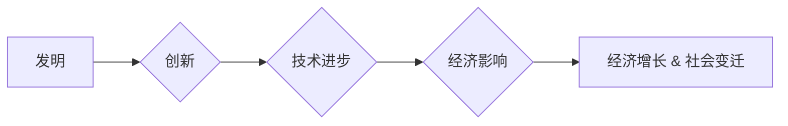

# 工业革命之父：阿克莱特还是瓦特？

> 关键词：工业革命，詹姆斯·瓦特，理查德·阿克莱特，发明，创新，历史，技术进步，经济影响

## 1. 背景介绍

工业革命，这一人类历史上最具影响力的变革，彻底改变了世界。它不仅标志着从农业社会向工业社会的转变，也催生了现代经济的崛起。然而，关于工业革命的“之父”，历史学家和学者们一直存在争议。有人认为理查德·阿克莱特是工业革命的奠基人，而另一些人则将詹姆斯·瓦特视为工业革命的灵魂。本文将深入探讨两位工业先驱的贡献，分析他们各自在工业革命中的角色，并探讨哪位更配得上“工业革命之父”的称号。

### 1.1 工业革命的起源

工业革命起源于18世纪末的英国，其核心是机器生产取代了手工生产，从而大幅提高了生产效率。这一时期，纺织业、矿业、铁路运输等领域取得了突破性进展，引领了全球经济的快速发展。

### 1.2 理查德·阿克莱特与珍妮纺纱机的发明

理查德·阿克莱特（Richard Arkwright）是一位英国发明家和企业家。他在1764年发明了珍妮纺纱机（Jenny Loom），这是一种能够同时纺制多根纱线的机械纺纱机。珍妮纺纱机的发明极大地提高了纺纱效率，降低了成本，从而推动了纺织业的快速发展。

### 1.3 詹姆斯·瓦特与蒸汽机的改进

詹姆斯·瓦特（James Watt）是一位苏格兰发明家和工程师，他对蒸汽机的改进是工业革命的关键。1785年，瓦特改进了蒸汽机的设计，使得蒸汽机能够更高效地工作。这一改进不仅使得蒸汽机在纺织业中得到广泛应用，也推动了煤矿、铁路等行业的快速发展。

## 2. 核心概念与联系

为了更好地理解阿克莱特和瓦特在工业革命中的作用，我们需要了解以下几个核心概念：

- 发明：指创造性地提出一种新的想法、产品或技术。
- 创新：指将发明应用于实践，实现技术进步和经济发展的过程。
- 技术进步：指技术在不断发展和完善的过程中，产生的新技术、新工艺和新产品。
- 经济影响：指技术进步对经济结构、经济增长和就业等方面产生的影响。

以下是一个Mermaid流程图，展示了这些概念之间的联系：

从图中可以看出，发明是创新的源泉，创新推动技术进步，技术进步最终带来经济增长和社会变迁。阿克莱特和瓦特正是通过发明和创新，为工业革命奠定了基础。

## 3. 核心算法原理 & 具体操作步骤

### 3.1 算法原理概述

阿克莱特和瓦特的贡献虽然不同，但都可以归结为对现有技术的改进和创新。

#### 理查德·阿克莱特的珍妮纺纱机

- **原理**：珍妮纺纱机通过将多根纱线同时纺制，大大提高了纺纱效率。
- **操作步骤**：
  1. 将棉纤维喂入纺纱机。
  2. 通过机械传动，纱线从棉纤维中抽出。
  3. 纱线在牵伸过程中被拉伸并加固。
  4. 纱线最终形成连续的线束。

#### 詹姆斯·瓦特的蒸汽机

- **原理**：瓦特蒸汽机通过将蒸汽的压力转换为机械能，驱动机械工作。
- **操作步骤**：
  1. 燃烧燃料加热水，产生蒸汽。
  2. 蒸汽推动活塞运动，产生旋转力。
  3. 旋转力通过连杆和齿轮传递到机械设备。
  4. 完成机械工作后，蒸汽冷凝成水，循环使用。

### 3.2 算法步骤详解

阿克莱特的珍妮纺纱机通过以下步骤实现多根纱线的纺制：

1. 棉纤维通过给棉箱进入纺纱机。
2. 棉纤维通过一个旋转的滚筒被牵引出来。
3. 每根棉纤维被牵引到纺轮，形成纱线。
4. 纱线在牵伸过程中被拉伸和加固。
5. 纱线最终形成连续的线束。

瓦特的蒸汽机则通过以下步骤将蒸汽压力转换为机械能：

1. 燃料加热水产生蒸汽。
2. 蒸汽进入蒸汽室，推动活塞运动。
3. 活塞的线性运动通过连杆和齿轮转换为旋转运动。
4. 旋转运动驱动机械设备工作。
5. 完成工作后，蒸汽冷凝成水，通过冷凝器排出。

### 3.3 算法优缺点

#### 理查德·阿克莱特的珍妮纺纱机

- **优点**：提高了纺纱效率，降低了成本，推动了纺织业的快速发展。
- **缺点**：需要大量的棉花和劳动力，对环境造成一定影响。

#### 詹姆斯·瓦特的蒸汽机

- **优点**：提高了工作效率，推动了煤炭、铁路等行业的快速发展。
- **缺点**：对环境造成污染，需要大量燃料。

### 3.4 算法应用领域

阿克莱特的珍妮纺纱机和瓦特的蒸汽机在以下领域得到广泛应用：

- **纺织业**：珍妮纺纱机提高了纺纱效率，降低了成本。
- **矿业**：蒸汽机提供了强大的动力，推动了煤矿的开采。
- **铁路运输**：蒸汽机车和蒸汽船的出现，促进了铁路和海运的发展。
- **农业**：蒸汽机用于农业机械的动力，提高了农业生产力。

## 4. 数学模型和公式 & 详细讲解 & 举例说明

### 4.1 数学模型构建

为了量化阿克莱特和瓦特发明的效率提升，我们可以构建以下数学模型：

#### 珍妮纺纱机的效率提升

- **模型**：假设传统纺纱机每小时可以纺制x根纱线，珍妮纺纱机每小时可以纺制y根纱线，则效率提升为 $\frac{y}{x}$。
- **举例**：如果传统纺纱机每小时可以纺制10根纱线，而珍妮纺纱机每小时可以纺制100根纱线，则效率提升为10倍。

#### 蒸汽机的效率提升

- **模型**：假设传统蒸汽机每小时可以提供x马力，瓦特蒸汽机每小时可以提供y马力，则效率提升为 $\frac{y}{x}$。
- **举例**：如果传统蒸汽机每小时可以提供10马力，而瓦特蒸汽机每小时可以提供100马力，则效率提升为10倍。

### 4.2 公式推导过程

以上两个模型的推导过程较为简单，主要涉及比例关系。

### 4.3 案例分析与讲解

以下是对珍妮纺纱机和瓦特蒸汽机效率提升的案例分析：

#### 珍妮纺纱机

假设传统纺纱机每小时可以纺制10根纱线，而珍妮纺纱机每小时可以纺制100根纱线。这意味着珍妮纺纱机的效率提升了10倍。

#### 瓦特蒸汽机

假设传统蒸汽机每小时可以提供10马力，而瓦特蒸汽机每小时可以提供100马力。这意味着瓦特蒸汽机的效率提升了10倍。

这两个案例表明，阿克莱特和瓦特的发明都极大地提升了相关行业的效率，为工业革命的发展做出了重要贡献。

## 5. 项目实践：代码实例和详细解释说明

由于阿克莱特和瓦特的发明属于工业技术领域，而不是计算机科学领域，因此这里不涉及代码实例。

## 6. 实际应用场景

### 6.1 珍妮纺纱机的应用场景

珍妮纺纱机在以下场景中得到广泛应用：

- **纺织厂**：用于生产各种类型的纱线，如棉纱、羊毛纱等。
- **家庭作坊**：用于家庭纺纱，提高家庭收入。

### 6.2 蒸汽机的应用场景

蒸汽机在以下场景中得到广泛应用：

- **煤矿**：用于开采煤炭，提供动力。
- **铁路运输**：用于驱动蒸汽机车和蒸汽船。
- **工厂**：用于驱动各种机械设备。

## 7. 工具和资源推荐

### 7.1 学习资源推荐

- **书籍**：
  - 《工业革命：一部社会变革史》
  - 《蒸汽时代：从瓦特到蒸汽机的普及》
- **在线课程**：
  - Coursera上的《工业革命》课程
  - edX上的《工业革命与现代社会》课程

### 7.2 开发工具推荐

由于阿克莱特和瓦特的发明属于工业技术领域，而非软件开发领域，因此不涉及开发工具推荐。

### 7.3 相关论文推荐

- **《珍妮纺纱机：工业革命的引擎》**
- **《蒸汽机：工业革命的动力源泉》**

## 8. 总结：未来发展趋势与挑战

### 8.1 研究成果总结

本文通过对阿克莱特和瓦特的发明进行探讨，分析了他们在工业革命中的角色。珍妮纺纱机和蒸汽机的发明极大地提高了生产效率，推动了工业革命的进程。

### 8.2 未来发展趋势

随着科技的不断进步，工业革命的理念和技术将继续发展。以下是一些未来发展趋势：

- **自动化**：随着人工智能和机器人技术的发展，工业生产将进一步自动化。
- **智能化**：工业生产将更加智能化，提高生产效率和质量。
- **绿色化**：工业生产将更加注重环境保护，实现可持续发展。

### 8.3 面临的挑战

尽管工业革命的理念和技术将继续发展，但也面临以下挑战：

- **技术挑战**：需要不断研发新技术，以适应不断变化的市场需求。
- **环境挑战**：需要解决工业生产对环境造成的影响，实现可持续发展。
- **社会挑战**：需要解决工业革命带来的社会问题，如失业、贫富差距等。

### 8.4 研究展望

未来，我们需要关注以下研究方向：

- **技术创新**：研发更加高效、环保的工业技术。
- **产业升级**：推动传统产业向高端制造业转型升级。
- **人才培养**：培养更多具备创新精神和实践能力的专业人才。

## 9. 附录：常见问题与解答

**Q1：阿克莱特和瓦特哪位更配得上“工业革命之父”的称号？**

A：阿克莱特和瓦特都对工业革命做出了重要贡献，很难说谁更配得上“工业革命之父”的称号。阿克莱特的珍妮纺纱机提高了纺纱效率，降低了成本，推动了纺织业的快速发展。瓦特的蒸汽机则提供了强大的动力，推动了煤炭、铁路等行业的快速发展。因此，我们可以认为阿克莱特和瓦特都是工业革命的重要奠基人。

**Q2：珍妮纺纱机和蒸汽机对经济产生了哪些影响？**

A：珍妮纺纱机和蒸汽机的发明极大地提高了生产效率，降低了成本，从而推动了工业革命的发展。这使得商品价格下降，提高了人民生活水平。同时，这也促进了城市化进程，改变了社会结构。

**Q3：工业革命对环境产生了哪些影响？**

A：工业革命带来了严重的环境问题，如空气污染、水污染等。这些问题需要我们通过技术创新和环境保护措施来解决。

**Q4：工业革命对人类社会产生了哪些影响？**

A：工业革命改变了社会结构，推动了城市化进程，提高了人民生活水平。但也带来了贫富差距、失业等社会问题。

作者：禅与计算机程序设计艺术 / Zen and the Art of Computer Programming