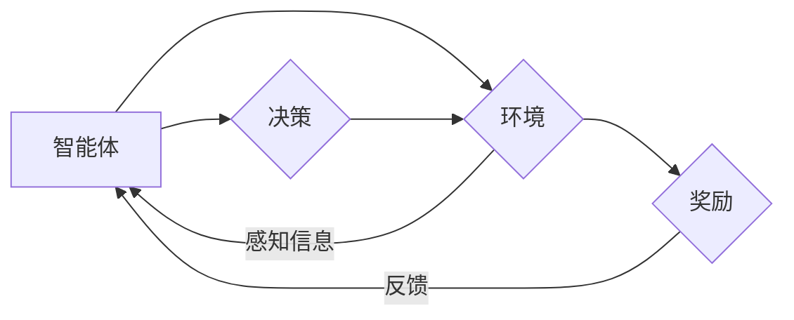

# 强化学习Reinforcement Learning在物联网IoT的创新应用方案

> 关键词：强化学习，物联网，智能设备，优化决策，自适应控制，分布式系统，机器人，资源管理

## 1. 背景介绍

随着物联网（IoT）技术的飞速发展，智能设备和传感器遍布各个领域，从智能家居到工业自动化，从智能交通到智慧城市。这些设备收集了海量的数据，为智能决策提供了丰富的信息来源。然而，如何从这些数据中提取有用信息，并指导智能设备做出最优决策，成为了物联网领域的一个关键问题。强化学习（Reinforcement Learning, RL）作为一种能够使智能体在环境中通过试错学习最优策略的技术，为物联网应用提供了强大的支持。

### 1.1 物联网与强化学习的结合

物联网设备的智能化需求，使得强化学习成为了解决复杂决策问题的理想选择。强化学习在物联网中的应用主要体现在以下几个方面：

- **自适应控制**：通过强化学习，物联网设备可以在动态环境中自适应地调整其行为，以优化系统性能。
- **资源管理**：在资源受限的环境中，如电池寿命有限的传感器节点，强化学习可以帮助设备在有限的资源下做出最佳决策。
- **路径规划**：在物流、自动驾驶等领域，强化学习可以帮助智能体规划出最优路径。
- **异常检测**：通过强化学习，物联网设备可以学会识别异常行为，提高系统的鲁棒性。

### 1.2 研究现状

近年来，强化学习在物联网领域的应用研究取得了显著进展。一些经典的强化学习算法，如Q-learning、Deep Q-Network（DQN）、Policy Gradient方法等，都被应用于物联网场景中。同时，随着深度学习技术的快速发展，深度强化学习（Deep Reinforcement Learning, DRL）在物联网中的应用也越来越受到关注。

### 1.3 研究意义

强化学习在物联网中的应用具有重要意义：

- **提高系统效率**：通过学习最优策略，物联网设备可以更有效地执行任务，提高系统整体效率。
- **降低成本**：优化资源管理，减少能源消耗，降低系统维护成本。
- **增强安全性**：通过异常检测和自适应控制，提高系统的安全性和可靠性。

### 1.4 本文结构

本文将围绕强化学习在物联网中的创新应用方案展开，主要包括以下内容：

- 核心概念与联系
- 核心算法原理与操作步骤
- 数学模型和公式
- 项目实践
- 实际应用场景
- 工具和资源推荐
- 总结与展望

## 2. 核心概念与联系

### 2.1 强化学习核心概念

#### Mermaid流程图：



#### 概述

- **智能体（Agent）**：智能体是强化学习中的主体，它通过感知环境信息，根据策略做出决策，并根据奖励调整策略。
- **环境（Environment）**：环境是智能体行动和接收奖励的场所，它根据智能体的行动产生状态转移和奖励。
- **策略（Policy）**：策略是智能体在给定状态下选择行动的规则。
- **价值函数（Value Function）**：价值函数表示智能体在当前状态下采取某个行动的长期奖励期望。
- **模型（Model）**：模型是智能体对环境状态转移和奖励的预测。

### 2.2 物联网与强化学习的联系

物联网设备可以作为强化学习中的智能体，感知环境信息，并根据策略做出决策。物联网环境可以根据智能体的行动产生状态转移和奖励，从而实现智能决策的闭环。

## 3. 核心算法原理 & 具体操作步骤

### 3.1 算法原理概述

强化学习算法的核心是学习一个最优策略，使得智能体在环境中能够获得最大的长期奖励。常见的强化学习算法包括：

- **Q-learning**：通过学习状态-动作价值函数Q(s,a)，选择能够带来最大期望奖励的动作。
- **DQN（Deep Q-Network）**：使用深度神经网络来近似Q值函数，可以处理高维输入空间。
- **Policy Gradient方法**：直接学习策略函数，而不是Q值函数。

### 3.2 算法步骤详解

#### Q-learning

1. 初始化Q表，对所有状态-动作对赋予初始值。
2. 选择一个初始状态s。
3. 选择一个随机动作a。
4. 执行动作a，并观察新的状态s'和奖励r。
5. 更新Q表：$ Q(s,a) \leftarrow Q(s,a) + \alpha [r + \gamma \max_{a'} Q(s',a') - Q(s,a)] $
6. 返回步骤2。

#### DQN

1. 初始化深度神经网络，用于近似Q值函数。
2. 将初始状态输入神经网络，得到Q值。
3. 选择一个随机动作a。
4. 执行动作a，并观察新的状态s'和奖励r。
5. 将新的状态s'和奖励r输入神经网络，得到新的Q值。
6. 使用经验回放和目标网络来优化神经网络。
7. 返回步骤2。

#### Policy Gradient方法

1. 初始化策略网络。
2. 将初始状态输入策略网络，得到策略分布。
3. 根据策略分布选择一个动作a。
4. 执行动作a，并观察新的状态s'和奖励r。
5. 更新策略网络，使得策略分布更加倾向于选择能够带来更大奖励的动作。
6. 返回步骤2。

### 3.3 算法优缺点

#### Q-learning

优点：

- 理论上可以收敛到最优策略。
- 适用于各种环境，包括连续和离散状态空间。

缺点：

- 需要大量样本才能收敛。
- 实际应用中，难以实现。

#### DQN

优点：

- 可以处理高维输入空间。
- 可以通过经验回放和目标网络来改善样本效率。

缺点：

- 难以处理高维动作空间。
- 目标网络和经验回放需要额外的计算成本。

#### Policy Gradient方法

优点：

- 可以直接学习策略函数，不需要Q值函数。
- 可以使用梯度上升方法来优化策略。

缺点：

- 需要合适的策略参数初始化。
- 容易陷入局部最优。

### 3.4 算法应用领域

强化学习在物联网中的应用领域包括：

- 自适应控制
- 资源管理
- 路径规划
- 异常检测
- 机器人控制

## 4. 数学模型和公式 & 详细讲解 & 举例说明

### 4.1 数学模型构建

强化学习的数学模型可以表示为：

$$
\begin{align*}
S_t &\sim P(S_t|S_{t-1},A_{t-1}) \\
A_t &\sim \pi(A_t|S_t) \\
R_t &\sim P(R_t|S_t,A_t)
\end{align*}
$$

其中：

- $S_t$ 表示时间步 $t$ 的状态。
- $A_t$ 表示时间步 $t$ 的动作。
- $R_t$ 表示时间步 $t$ 的奖励。
- $P(S_t|S_{t-1},A_{t-1})$ 表示状态转移概率。
- $\pi(A_t|S_t)$ 表示策略概率分布。

### 4.2 公式推导过程

以下以Q-learning为例，讲解公式推导过程：

#### 初始化Q表

初始化Q表，对所有状态-动作对赋予初始值：

$$
Q(s,a) \leftarrow 0
$$

#### 选择动作

选择一个动作a：

$$
a_t \sim \epsilon-greedy(\epsilon, Q(s,a))
$$

其中 $\epsilon$ 为探索概率，$Q(s,a)$ 为当前状态s下动作a的Q值。

#### 执行动作

执行动作a，并观察新的状态s'和奖励r：

$$
(s',r) \sim P(s'|s,a)
$$

#### 更新Q表

根据新的状态s'和奖励r，更新Q表：

$$
Q(s,a) \leftarrow Q(s,a) + \alpha [r + \gamma \max_{a'} Q(s',a') - Q(s,a)]
$$

其中 $\alpha$ 为学习率，$\gamma$ 为折扣因子。

### 4.3 案例分析与讲解

#### 案例一：智能停车场管理

假设一个智能停车场需要管理多个停车位。每个停车位的状态可以表示为“空”、“占用”、“维护”等。智能停车场的任务是在接收到车辆请求时，为车辆找到空闲停车位。

可以使用强化学习来设计一个智能停车场管理策略。状态空间可以表示为所有停车位的状态组合，动作空间为选择空闲停车位的动作。通过学习，智能停车场可以学会在接收到车辆请求时，为车辆找到最佳的停车位。

#### 案例二：智能温控系统

假设一个智能温控系统需要根据室内外的温度变化调整室内温度。系统可以感知室内外的温度，并根据策略调整空调的开关和温度设定。

可以使用强化学习来设计一个智能温控策略。状态空间可以表示为室内外的温度，动作空间为调整空调开关和温度设定的动作。通过学习，智能温控系统可以学会在室内外温度变化时，调整室内温度，以保持舒适的室内环境。

## 5. 项目实践：代码实例和详细解释说明

### 5.1 开发环境搭建

为了演示强化学习在物联网中的应用，我们将使用Python语言和OpenAI Gym环境来实现一个简单的Q-learning案例。

### 5.2 源代码详细实现

```python
import gym
import numpy as np

# 创建环境
env = gym.make("CartPole-v0")

# 初始化Q表
Q = np.zeros([env.observation_space.n, env.action_space.n])

# 学习参数
alpha = 0.1  # 学习率
gamma = 0.99  # 折扣因子
epsilon = 0.1  # 探索概率

# 训练
for episode in range(1000):
    state = env.reset()
    done = False
    while not done:
        if np.random.uniform(0, 1) < epsilon:
            action = env.action_space.sample()
        else:
            action = np.argmax(Q[state])

        next_state, reward, done, _ = env.step(action)
        Q[state, action] = Q[state, action] + alpha * (reward + gamma * np.max(Q[next_state]) - Q[state, action])

    env.close()

print("Training complete.")
```

### 5.3 代码解读与分析

上述代码实现了一个简单的Q-learning案例。首先，我们创建了一个CartPole-v0环境，这是一个经典的强化学习控制问题。然后，我们初始化一个Q表，用于存储状态-动作价值函数。接下来，我们设置学习参数，并开始训练过程。在训练过程中，智能体根据Q表和探索概率选择动作，并根据环境的反馈更新Q表。

### 5.4 运行结果展示

运行上述代码，可以看到智能体在经过1000个训练回合后，能够成功地控制CartPole保持平衡。

## 6. 实际应用场景

强化学习在物联网中的应用场景非常广泛，以下列举几个典型的应用案例：

### 6.1 智能交通系统

智能交通系统可以利用强化学习优化交通信号灯控制、车辆路径规划等，以提高交通效率和减少拥堵。

### 6.2 能源管理系统

能源管理系统可以利用强化学习优化电力分配、需求响应等，以提高能源利用率和降低成本。

### 6.3 智能机器人

智能机器人可以利用强化学习进行路径规划、避障、抓取等，以实现自主导航和操作。

### 6.4 智能农业

智能农业可以利用强化学习优化作物种植、灌溉、施肥等，以提高农业生产效率和降低成本。

## 7. 工具和资源推荐

### 7.1 学习资源推荐

- 《Reinforcement Learning: An Introduction》
- 《Reinforcement Learning: A Statistical Perspective》
- 《Deep Reinforcement Learning》
- OpenAI Gym：一个开源的强化学习环境库。
- gym.make("CartPole-v0")：一个经典的强化学习控制问题。
- Stable Baselines：一个用于快速实现和测试强化学习算法的库。

### 7.2 开发工具推荐

- Python：一种易于学习和使用的编程语言。
- TensorFlow：一个开源的深度学习框架。
- PyTorch：一个开源的深度学习框架。
- OpenAI Gym：一个开源的强化学习环境库。

### 7.3 相关论文推荐

- "Human-level control through deep reinforcement learning" (Silver et al., 2016)
- "Asynchronous advantage actor-critic" (Mnih et al., 2016)
- "Deep Q-Network" (Mnih et al., 2013)
- "Playing Atari with deep reinforcement learning" (Silver et al., 2014)

## 8. 总结：未来发展趋势与挑战

### 8.1 研究成果总结

本文介绍了强化学习在物联网中的创新应用方案，包括核心概念、算法原理、具体操作步骤、数学模型和公式、项目实践以及实际应用场景。通过分析，我们可以看到，强化学习在物联网领域具有广阔的应用前景。

### 8.2 未来发展趋势

未来，强化学习在物联网中的应用将呈现以下发展趋势：

- **多智能体强化学习**：在多智能体系统中，多个智能体需要协作完成任务，多智能体强化学习将成为重要的研究方向。
- **强化学习与深度学习融合**：将强化学习与深度学习技术相结合，可以更好地处理高维输入空间。
- **强化学习与博弈论融合**：将强化学习与博弈论相结合，可以解决更复杂的决策问题。

### 8.3 面临的挑战

尽管强化学习在物联网领域具有广阔的应用前景，但仍面临着以下挑战：

- **样本效率**：强化学习通常需要大量的样本才能收敛，如何提高样本效率是一个重要的研究方向。
- **可解释性**：强化学习模型通常难以解释，如何提高模型的可解释性是一个重要的研究方向。
- **安全性**：强化学习模型可能会学习到有害的策略，如何确保模型的安全性是一个重要的研究方向。

### 8.4 研究展望

未来，随着技术的不断发展和应用需求的不断增长，强化学习在物联网领域的应用将更加广泛。通过不断攻克技术难题，强化学习将为物联网领域带来更多的创新和突破。

## 9. 附录：常见问题与解答

### 9.1 常见问题

**Q1：什么是强化学习？**

A1：强化学习是一种使智能体在环境中通过试错学习最优策略的技术。

**Q2：强化学习有哪些应用领域？**

A2：强化学习在自动驾驶、机器人、游戏、智能控制等领域有广泛的应用。

**Q3：如何选择合适的强化学习算法？**

A3：选择合适的强化学习算法需要根据具体问题和数据特点进行选择。

**Q4：如何提高强化学习的样本效率？**

A4：可以通过经验回放、优先级回放等技术来提高强化学习的样本效率。

**Q5：如何提高强化学习模型的可解释性？**

A5：可以通过可视化、解释性方法等技术来提高强化学习模型的可解释性。

### 9.2 解答

**A1**：强化学习是一种使智能体在环境中通过试错学习最优策略的技术。智能体通过感知环境信息，根据策略做出决策，并根据奖励调整策略。

**A2**：强化学习在自动驾驶、机器人、游戏、智能控制等领域有广泛的应用。例如，在自动驾驶领域，强化学习可以用于训练自动驾驶车辆的决策策略；在机器人领域，强化学习可以用于训练机器人的运动控制策略。

**A3**：选择合适的强化学习算法需要根据具体问题和数据特点进行选择。例如，对于连续动作空间，可以使用actor-critic方法；对于离散动作空间，可以使用Q-learning或DQN方法。

**A4**：可以通过经验回放、优先级回放等技术来提高强化学习的样本效率。经验回放技术可以将历史经验存储在经验池中，并从中随机采样进行训练，从而提高训练的样本效率。

**A5**：可以通过可视化、解释性方法等技术来提高强化学习模型的可解释性。例如，可以将模型的决策过程可视化，或者使用注意力机制来解释模型的决策过程。

作者：禅与计算机程序设计艺术 / Zen and the Art of Computer Programming