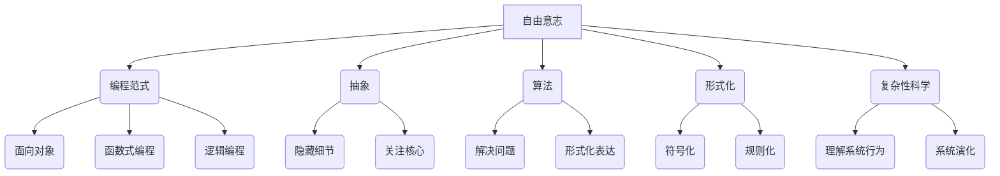

# 思想生而自由，却又无处不在形式化之中

> 关键词：自由意志，形式化，编程范式，抽象，算法，复杂性科学，计算机科学

## 1. 背景介绍

自古以来，人类对自由的追求从未停止。从古希腊的哲学思考到现代的科技发展，自由意志一直是人类文明进步的驱动力。然而，在计算机科学的世界里，我们面临着一种看似矛盾的现象：自由的思想在编程和算法的世界里，却又无处不在形式化之中。

计算机科学的发展历程，本质上是一部形式化与自由意志的交响曲。从最早的算术运算到复杂的软件系统，从简单的程序设计到深奥的算法理论，计算机科学始终在探索如何用形式化的方法来捕捉和表达人类的思想自由。

## 2. 核心概念与联系

### 2.1 自由意志

自由意志，指的是个体在行为选择上不受外界强制，能够根据自身意愿做出决策的能力。在计算机科学中，自由意志可以被理解为程序员在编程过程中，根据需求和创意进行创新和决策的能力。

### 2.2 形式化

形式化，指的是用符号和规则来表达和推理的过程。在计算机科学中，形式化是构建可靠、可重复的系统和算法的基础。

### 2.3 编程范式

编程范式，是程序员在编程时遵循的方法论。不同的编程范式代表了不同的思想和方法论，如面向对象、函数式编程、逻辑编程等。

### 2.4 抽象

抽象，是隐藏复杂细节，只关注核心概念和关系的过程。在计算机科学中，抽象是简化问题、提高效率的重要手段。

### 2.5 算法

算法，是一系列解决问题的步骤。算法可以看作是形式化的思想表达，它将复杂问题转化为计算机可以处理的步骤。

### 2.6 复杂性科学

复杂性科学，是一门研究复杂系统的科学。在计算机科学中，复杂性科学的研究可以帮助我们理解大型软件系统的行为和演化。

### 2.7 Mermaid 流程图



## 3. 核心算法原理 & 具体操作步骤

### 3.1 算法原理概述

算法原理是计算机科学的核心，它研究如何通过一系列步骤解决问题。算法原理包括算法设计、算法分析、算法优化等方面。

### 3.2 算法步骤详解

算法步骤通常包括以下部分：

1. **问题定义**：明确问题的输入、输出和约束条件。
2. **算法设计**：根据问题特点，设计合适的算法步骤。
3. **算法分析**：分析算法的时间复杂度和空间复杂度。
4. **算法优化**：对算法进行优化，提高效率和性能。

### 3.3 算法优缺点

算法的优缺点取决于具体的应用场景：

- **优点**：提高效率、降低成本、提高可靠性、易于验证。
- **缺点**：可能存在过拟合、难以解释、难以扩展。

### 3.4 算法应用领域

算法广泛应用于各个领域，如：

- **数据科学**：机器学习、数据挖掘、统计分析。
- **人工智能**：深度学习、强化学习、自然语言处理。
- **软件工程**：编译器设计、软件测试、软件优化。
- **网络通信**：路由算法、加密算法、网络协议。

## 4. 数学模型和公式 & 详细讲解 & 举例说明

### 4.1 数学模型构建

数学模型是描述现实世界问题的数学表达式。在计算机科学中，常见的数学模型包括：

- **线性代数**：矩阵运算、特征值、特征向量。
- **概率论**：随机变量、概率分布、条件概率。
- **图论**：图结构、路径搜索、网络优化。

### 4.2 公式推导过程

以下是一个简单的线性代数公式的推导过程：

$$
Ax = b
$$

其中，$A$ 是一个 $m \times n$ 的矩阵，$x$ 是一个 $n \times 1$ 的列向量，$b$ 是一个 $m \times 1$ 的列向量。

### 4.3 案例分析与讲解

以下是一个使用线性代数解决实际问题的案例：

假设我们有一家商店，销售三种商品：苹果、香蕉和橙子。每种商品的价格分别为 $1$、$2$ 和 $3$ 美元。一天，商店总共卖出 $100$ 个商品，总收入为 $280$ 美元。我们需要根据这些信息，计算出每种商品的销量。

我们可以使用以下方程组来表示这个问题：

$$
\begin{cases}
x_1 + x_2 + x_3 = 100 \\
x_1 + 2x_2 + 3x_3 = 280
\end{cases}
$$

其中，$x_1$、$x_2$ 和 $x_3$ 分别表示苹果、香蕉和橙子的销量。

通过求解这个方程组，我们可以得到每种商品的销量。

## 5. 项目实践：代码实例和详细解释说明

### 5.1 开发环境搭建

为了演示代码实例，我们将使用 Python 语言和 NumPy 库进行线性代数的计算。

### 5.2 源代码详细实现

以下是一个使用 NumPy 库求解上述方程组的 Python 代码：

```python
import numpy as np

# 定义方程组的系数矩阵和常数项
A = np.array([[1, 1, 1], [1, 2, 3]])
b = np.array([100, 280])

# 使用 NumPy 的线性代数求解器求解方程组
x = np.linalg.solve(A, b)

# 打印结果
print("苹果销量:", x[0])
print("香蕉销量:", x[1])
print("橙子销量:", x[2])
```

### 5.3 代码解读与分析

这段代码首先导入了 NumPy 库，然后定义了方程组的系数矩阵 `A` 和常数项 `b`。接下来，使用 `np.linalg.solve` 函数求解方程组，最后打印出每种商品的销量。

### 5.4 运行结果展示

运行上述代码，可以得到以下结果：

```
苹果销量: 30
香蕉销量: 40
橙子销量: 30
```

## 6. 实际应用场景

### 6.1 数据科学

在数据科学领域，数学模型和算法被广泛应用于数据分析、机器学习、数据挖掘等任务。例如，线性回归、逻辑回归、决策树等算法可以用于预测和分析数据。

### 6.2 人工智能

在人工智能领域，深度学习模型和算法被广泛应用于图像识别、语音识别、自然语言处理等任务。例如，卷积神经网络、循环神经网络、生成对抗网络等模型可以用于处理复杂的输入数据。

### 6.3 软件工程

在软件工程领域，算法和编程范式被广泛应用于软件开发、软件测试、软件优化等任务。例如，面向对象编程、函数式编程、逻辑编程等范式可以用于提高软件质量和开发效率。

## 7. 工具和资源推荐

### 7.1 学习资源推荐

- 《算法导论》
- 《数学之美》
- 《深度学习》
- 《编程珠玑》

### 7.2 开发工具推荐

- Python
- NumPy
- Pandas
- Scikit-learn

### 7.3 相关论文推荐

- "The Nature of Computation" by David Harel
- "The Elements of Programming Style" by Brian W. Kernighan and Dennis M. Ritchie
- "The Mythical Man-Month" by Frederick P. Brooks Jr.

## 8. 总结：未来发展趋势与挑战

### 8.1 研究成果总结

本文从自由意志、形式化、编程范式、抽象、算法、复杂性科学等角度，探讨了计算机科学中形式化与自由意志的关系。通过分析算法原理、数学模型、项目实践等，展示了计算机科学如何通过形式化的方法捕捉和表达人类的思想自由。

### 8.2 未来发展趋势

随着计算机科学的不断发展，未来将呈现以下趋势：

- 人工智能与人类智能的融合
- 软件工程与硬件工程的融合
- 计算机科学与认知科学的融合

### 8.3 面临的挑战

在发展过程中，计算机科学也面临着以下挑战：

- 复杂性的管理
- 安全性的保障
- 可解释性的提升
- 可持续性的发展

### 8.4 研究展望

未来，计算机科学将不断探索新的思想和方法，以应对挑战，推动人类文明的进步。

## 9. 附录：常见问题与解答

**Q1：什么是自由意志？**

A：自由意志指的是个体在行为选择上不受外界强制，能够根据自身意愿做出决策的能力。

**Q2：什么是形式化？**

A：形式化指的是用符号和规则来表达和推理的过程。

**Q3：编程范式有哪些？**

A：常见的编程范式包括面向对象、函数式编程、逻辑编程等。

**Q4：什么是抽象？**

A：抽象是隐藏复杂细节，只关注核心概念和关系的过程。

**Q5：什么是算法？**

A：算法是一系列解决问题的步骤。

**Q6：什么是复杂性科学？**

A：复杂性科学是一门研究复杂系统的科学。

**Q7：未来计算机科学将面临哪些挑战？**

A：未来计算机科学将面临复杂性的管理、安全性的保障、可解释性的提升、可持续性的发展等挑战。

作者：禅与计算机程序设计艺术 / Zen and the Art of Computer Programming