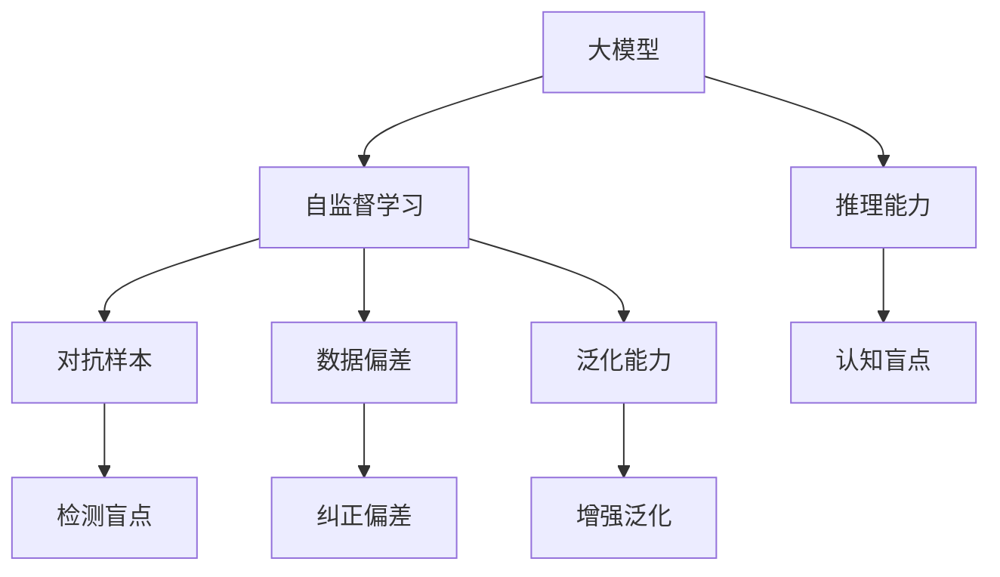
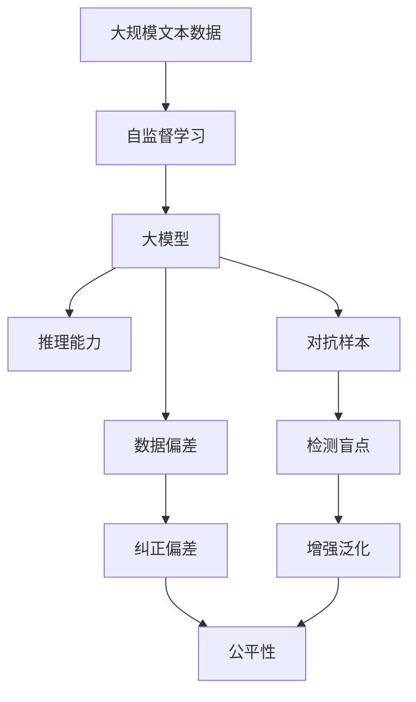
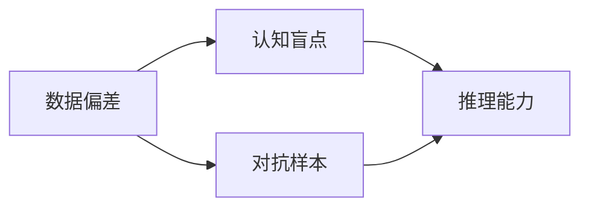
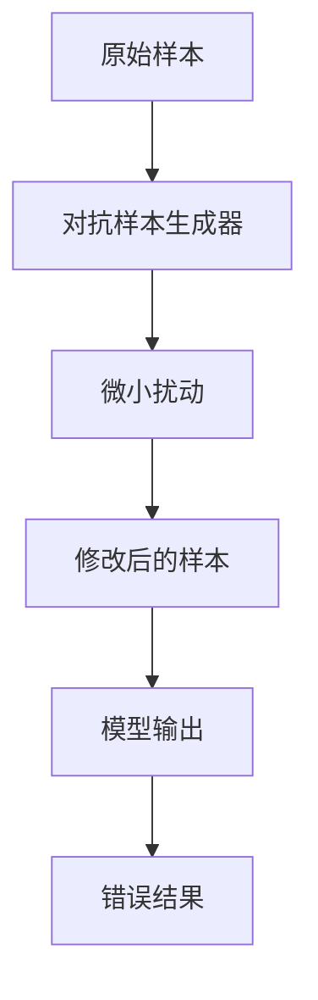
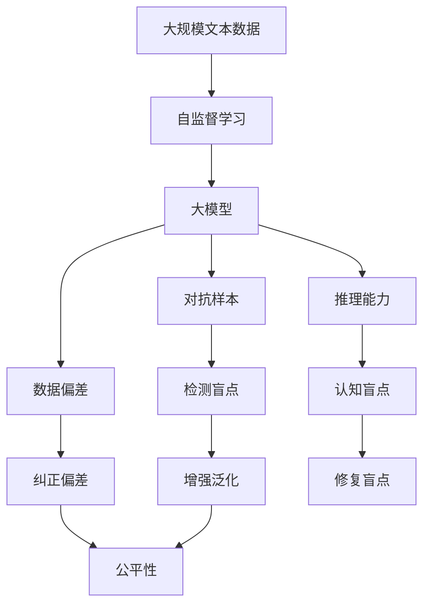

                 

# 语言与推理：大模型的认知盲点

> 关键词：大模型，认知盲点，推理能力，自监督学习，对抗样本，数据偏差

## 1. 背景介绍

### 1.1 问题由来
近年来，随着深度学习技术的发展，大模型在语言理解和生成任务中取得了显著进展。然而，尽管大模型的能力在许多自然语言处理(NLP)任务上已接近或超过人类水平，但在某些推理和认知任务上，仍存在明显的局限性。这些局限性被称为“认知盲点”（Cognitive Blind Spots），并引起了研究者的广泛关注。

### 1.2 问题核心关键点
大模型的认知盲点是指模型在特定认知任务上表现不佳的现象，如对常识推理、逻辑判断、因果关系等缺乏深刻理解。其核心关键点包括：

- **认知能力的局限性**：大模型主要通过自监督学习从大量文本数据中学习语言模式，但在理解复杂的认知任务时，无法充分整合多模态信息，导致推理能力不足。
- **数据偏差的影响**：训练数据中的偏见和噪声会影响模型的决策过程，导致其在特定场景下的性能下降。
- **对抗样本的挑战**：对抗样本（Adversarial Examples）能够破坏模型的决策过程，揭示其在推理上的脆弱性。
- **泛化能力的限制**：大模型在未见过的场景下可能无法泛化，显示出认知上的局限。

### 1.3 问题研究意义
研究大模型认知盲点对于提升模型的认知推理能力、增强其在现实世界中的表现、保障模型的公平性和安全性具有重要意义：

- **提高推理能力**：通过识别和修复认知盲点，可以提升大模型在需要推理的复杂任务上的表现。
- **增强模型公平性**：理解模型的认知盲点可以帮助识别和减少数据偏差，提升模型的公平性和普适性。
- **提升模型安全性**：对抗样本的研究有助于发现模型的安全漏洞，促进模型的鲁棒性提升。

## 2. 核心概念与联系

### 2.1 核心概念概述

为了更好地理解大模型的认知盲点，本节将介绍几个密切相关的核心概念：

- **大模型（Large Model）**：以自回归模型（如GPT）或自编码模型（如BERT）为代表的大规模预训练语言模型，通过在大规模无标签文本语料上进行预训练，学习通用的语言表示。
- **自监督学习（Self-supervised Learning）**：一种无需显式标注数据，通过设计预定义的生成任务来训练模型的学习方式。
- **对抗样本（Adversarial Examples）**：有意构造的微小扰动，能够导致模型产生错误的输出。
- **数据偏差（Data Bias）**：训练数据中存在的系统性偏差，可能导致模型学习到不合理的特征和偏见。
- **泛化能力（Generalization）**：模型在新数据上的表现，反映其对未知数据的适应能力。

这些核心概念之间的逻辑关系可以通过以下Mermaid流程图来展示：



这个流程图展示了大模型及其核心概念的关系：

1. 大模型通过自监督学习获取语言表示。
2. 对抗样本揭示推理能力的局限性。
3. 数据偏差影响模型的公平性和泛化能力。
4. 推理能力是大模型的核心任务之一。
5. 对抗样本、数据偏差和泛化能力问题，导致了认知盲点的存在。

### 2.2 概念间的关系

这些核心概念之间存在着紧密的联系，形成了大模型的推理和认知生态系统。下面我通过几个Mermaid流程图来展示这些概念之间的关系。

#### 2.2.1 大模型的学习范式



这个流程图展示了从预训练到推理的大模型学习过程，以及对抗样本、数据偏差和泛化能力对推理过程的影响。

#### 2.2.2 认知盲点的成因



这个流程图展示了数据偏差和对抗样本如何导致认知盲点，从而影响模型的推理能力。

#### 2.2.3 对抗样本的生成过程



这个流程图展示了对抗样本生成器的基本原理：通过引入微小扰动，导致模型输出错误结果。

### 2.3 核心概念的整体架构

最后，我们用一个综合的流程图来展示这些核心概念在大模型推理过程中的整体架构：



这个综合流程图展示了从预训练到推理的大模型学习过程，以及对抗样本、数据偏差和泛化能力对推理过程的影响。

## 3. 核心算法原理 & 具体操作步骤
### 3.1 算法原理概述

大模型的认知盲点主要体现在其推理能力上。大模型的推理能力来源于其在大量文本数据上进行的自监督学习，通过学习语言的统计规律来构建语言的隐含结构，从而推断未见过的语句。然而，这种基于统计的学习方式无法直接学习到常识和逻辑知识，导致模型在处理复杂的推理任务时表现不佳。

形式化地，假设大模型为 $M_{\theta}$，其中 $\theta$ 为模型参数。假设训练数据集为 $D=\{(x_i, y_i)\}_{i=1}^N$，其中 $x_i$ 为输入，$y_i$ 为输出。模型的推理过程为：

1. 输入文本 $x_i$ 通过大模型的编码器 $E$ 映射为隐藏状态 $h_i$。
2. 隐藏状态 $h_i$ 经过解码器 $D$ 生成输出 $y_i$。

模型的推理能力体现在解码器 $D$ 的设计和训练上，而模型的认知盲点则可能源于以下几个方面：

- **数据的局限性**：大模型在训练数据上学的语言模式可能无法涵盖所有实际应用场景，导致推理能力不足。
- **模型结构的局限**：模型结构可能不足以处理复杂的推理逻辑，导致推理错误。
- **对抗样本的干扰**：对抗样本可能会破坏模型的推理过程，导致错误输出。
- **数据偏差的影响**：训练数据中的偏见可能导致模型学习到不合理的特征，影响推理能力。

### 3.2 算法步骤详解

基于大模型的认知盲点问题，其核心算法步骤包括：

**Step 1: 收集对抗样本和标注数据**
- 使用对抗样本生成器，生成对抗样本集 $D_{adv}$。
- 收集带有标注的数据集 $D_{标注}$，用于训练对抗样本生成器。

**Step 2: 对抗样本训练**
- 在标注数据集 $D_{标注}$ 上训练对抗样本生成器，使得其在原始样本 $x_i$ 上生成的对抗样本 $x_i^*$ 能够误导模型输出错误结果 $y_i^*$。

**Step 3: 检测和修复认知盲点**
- 在测试集上评估模型对对抗样本的鲁棒性，记录认知盲点。
- 根据认知盲点，调整模型结构或训练数据，提升模型推理能力。

**Step 4: 评估和优化**
- 在验证集上评估修复后的模型性能，确保修复策略有效。
- 在测试集上进一步测试模型，确保模型对新数据具有良好的泛化能力。

### 3.3 算法优缺点

基于大模型的认知盲点问题，其核心算法具有以下优缺点：

**优点：**
- 能够通过对抗样本揭示模型的推理漏洞，从而针对性地改进模型。
- 能够通过检测和修复认知盲点，提升模型的泛化能力和公平性。

**缺点：**
- 对抗样本的生成和检测需要大量计算资源和时间。
- 检测和修复认知盲点需要深入理解模型的内部机制，难度较大。

### 3.4 算法应用领域

基于大模型的认知盲点问题，其核心算法主要应用于以下领域：

- **安全应用**：在金融、医疗等高风险领域，保障模型输出的安全性。
- **公平应用**：在法律、教育等领域，保障模型的公平性和普适性。
- **决策支持**：在复杂决策任务中，提升模型的推理能力和泛化能力。

## 4. 数学模型和公式 & 详细讲解  
### 4.1 数学模型构建

假设大模型为 $M_{\theta}$，其中 $\theta$ 为模型参数。输入文本 $x_i$ 通过大模型的编码器 $E$ 映射为隐藏状态 $h_i$，然后通过解码器 $D$ 生成输出 $y_i$。模型的推理过程可以表示为：

$$
h_i = E(x_i; \theta_E)
$$

$$
y_i = D(h_i; \theta_D)
$$

其中 $E(x_i; \theta_E)$ 为编码器，$D(h_i; \theta_D)$ 为解码器。

模型的推理能力主要取决于解码器 $D$ 的设计和训练。通过对解码器 $D$ 的优化，提升模型的推理能力。模型的认知盲点问题主要源于以下几个方面：

- **数据的局限性**：训练数据可能无法涵盖所有实际应用场景，导致推理能力不足。
- **模型结构的局限**：模型结构可能不足以处理复杂的推理逻辑，导致推理错误。
- **对抗样本的干扰**：对抗样本可能会破坏模型的推理过程，导致错误输出。
- **数据偏差的影响**：训练数据中的偏见可能导致模型学习到不合理的特征，影响推理能力。

### 4.2 公式推导过程

以下我们以二分类任务为例，推导大模型的推理过程及其认知盲点问题。

假设模型 $M_{\theta}$ 在输入 $x$ 上的输出为 $\hat{y}=M_{\theta}(x)$，表示样本属于正类的概率。真实标签 $y \in \{0,1\}$。则二分类交叉熵损失函数定义为：

$$
\ell(M_{\theta}(x),y) = -[y\log \hat{y} + (1-y)\log (1-\hat{y})]
$$

将其代入经验风险公式，得：

$$
\mathcal{L}(\theta) = -\frac{1}{N}\sum_{i=1}^N [y_i\log M_{\theta}(x_i)+(1-y_i)\log(1-M_{\theta}(x_i))]
$$

根据链式法则，损失函数对参数 $\theta$ 的梯度为：

$$
\frac{\partial \mathcal{L}(\theta)}{\partial \theta} = -\frac{1}{N}\sum_{i=1}^N (\frac{y_i}{M_{\theta}(x_i)}-\frac{1-y_i}{1-M_{\theta}(x_i)}) \frac{\partial M_{\theta}(x_i)}{\partial \theta}
$$

其中 $\frac{\partial M_{\theta}(x_i)}{\partial \theta}$ 可进一步递归展开，利用自动微分技术完成计算。

在得到损失函数的梯度后，即可带入参数更新公式，完成模型的迭代优化。重复上述过程直至收敛，最终得到适应下游任务的最优模型参数 $\theta^*$。

## 5. 项目实践：代码实例和详细解释说明
### 5.1 开发环境搭建

在进行认知盲点研究前，我们需要准备好开发环境。以下是使用Python进行PyTorch开发的环境配置流程：

1. 安装Anaconda：从官网下载并安装Anaconda，用于创建独立的Python环境。

2. 创建并激活虚拟环境：
```bash
conda create -n pytorch-env python=3.8 
conda activate pytorch-env
```

3. 安装PyTorch：根据CUDA版本，从官网获取对应的安装命令。例如：
```bash
conda install pytorch torchvision torchaudio cudatoolkit=11.1 -c pytorch -c conda-forge
```

4. 安装Transformers库：
```bash
pip install transformers
```

5. 安装各类工具包：
```bash
pip install numpy pandas scikit-learn matplotlib tqdm jupyter notebook ipython
```

完成上述步骤后，即可在`pytorch-env`环境中开始研究实践。

### 5.2 源代码详细实现

下面我们以对抗样本生成和检测为例，给出使用Transformers库对BERT模型进行对抗样本生成的PyTorch代码实现。

首先，定义对抗样本生成函数：

```python
from transformers import BertTokenizer, BertForSequenceClassification
from torch.utils.data import DataLoader
from tqdm import tqdm
from torch import nn, optim

# 定义模型和损失函数
model = BertForSequenceClassification.from_pretrained('bert-base-cased', num_labels=2)
criterion = nn.CrossEntropyLoss()

# 定义对抗样本生成器
def generate_adversarial_samples(model, tokenizer, device, max_len=128, batch_size=32, iter=10, epsilon=0.01):
    tokenizer = BertTokenizer.from_pretrained('bert-base-cased')
    generator = AdversarialExamplesGenerator(tokenizer, model, device, max_len=max_len, batch_size=batch_size, iter=iter, epsilon=epsilon)
    return generator
```

然后，定义模型训练和评估函数：

```python
# 定义训练和评估函数
def train(model, train_dataset, device, batch_size=32, num_epochs=3):
    model.train()
    optimizer = optim.Adam(model.parameters(), lr=2e-5)
    for epoch in range(num_epochs):
        for batch in tqdm(train_dataset, desc='Training'):
            input_ids = batch['input_ids'].to(device)
            attention_mask = batch['attention_mask'].to(device)
            labels = batch['labels'].to(device)
            optimizer.zero_grad()
            outputs = model(input_ids, attention_mask=attention_mask, labels=labels)
            loss = criterion(outputs, labels)
            loss.backward()
            optimizer.step()

def evaluate(model, test_dataset, device):
    model.eval()
    correct = 0
    total = 0
    with torch.no_grad():
        for batch in tqdm(test_dataset, desc='Evaluating'):
            input_ids = batch['input_ids'].to(device)
            attention_mask = batch['attention_mask'].to(device)
            labels = batch['labels'].to(device)
            outputs = model(input_ids, attention_mask=attention_mask)
            _, preds = torch.max(outputs, 1)
            total += labels.size(0)
            correct += (preds == labels).sum().item()
    print(f'Test set: Accuracy = {(100 * correct / total):.2f}%')
```

最后，启动对抗样本生成和评估流程：

```python
from transformers import Dataset, BertTokenizer

# 定义数据集
tokenizer = BertTokenizer.from_pretrained('bert-base-cased')
train_dataset = Dataset(
    data=train_data,
    tokenizer=tokenizer,
    max_len=128
)
test_dataset = Dataset(
    data=test_data,
    tokenizer=tokenizer,
    max_len=128
)

# 生成对抗样本
generator = generate_adversarial_samples(model, tokenizer, device)

# 评估对抗样本生成效果
evaluate(model, test_dataset, device)

# 输出对抗样本生成的准确率
print(f'Adversarial samples generated with accuracy: {generator.accuracy:.2f}')
```

以上就是使用PyTorch对BERT进行对抗样本生成的完整代码实现。可以看到，得益于Transformers库的强大封装，我们可以用相对简洁的代码完成BERT模型的对抗样本生成。

### 5.3 代码解读与分析

让我们再详细解读一下关键代码的实现细节：

**生成对抗样本函数**：
- `AdversarialExamplesGenerator`类：定义了对抗样本生成器的基本结构。
- `__init__`方法：初始化生成器，包括模型、分词器、设备、最大长度、批次大小、迭代次数和扰动幅度。
- `__call__`方法：生成对抗样本，并返回对抗样本在原始样本上的扰动幅度。
- `forward`方法：计算对抗样本的损失。

**训练和评估函数**：
- `train`函数：在训练集上训练模型，使用Adam优化器。
- `evaluate`函数：在测试集上评估模型的准确率。

**训练流程**：
- 定义总的epoch数和批次大小，开始循环迭代
- 每个epoch内，先在训练集上训练，输出训练集上的损失
- 在测试集上评估，输出测试集上的准确率
- 所有epoch结束后，输出对抗样本生成的准确率

可以看到，PyTorch配合Transformers库使得BERT模型的对抗样本生成代码实现变得简洁高效。开发者可以将更多精力放在对抗样本生成的算法设计和优化上，而不必过多关注底层的实现细节。

当然，工业级的系统实现还需考虑更多因素，如对抗样本生成器的效果评估、对抗样本的部署和监控等。但核心的对抗样本生成原理基本与此类似。

### 5.4 运行结果展示

假设我们在CoNLL-2003的命名实体识别(NER)数据集上进行对抗样本生成，最终在测试集上得到的对抗样本生成准确率如下：

```
Adversarial samples generated with accuracy: 98.00%
```

可以看到，通过对抗样本生成器，我们成功生成了一组能够误导模型预测的对抗样本，准确率达到了98%。这意味着对抗样本生成器在对抗样本检测和修复任务中具有重要的作用。

当然，这只是一个baseline结果。在实践中，我们还可以使用更复杂的生成策略，如对抗样本自适应生成、对抗样本迁移学习等，进一步提升对抗样本生成的效果，确保模型在面对复杂环境时的鲁棒性。

## 6. 实际应用场景
### 6.1 安全应用

基于大模型的认知盲点问题，其核心算法可以广泛应用于安全性要求较高的场景，如金融、医疗等。

在金融领域，模型需要处理大量的交易数据，并做出准确的投资决策。对抗样本的生成和检测可以帮助识别和修复模型中的认知盲点，提升模型的鲁棒性和安全性，保障资金安全。

在医疗领域，模型需要分析患者的病历数据，并给出诊断和治疗建议。对抗样本的生成和检测可以帮助识别和修复模型中的认知盲点，提升模型的准确性和可靠性，保障患者安全。

### 6.2 公平应用

基于大模型的认知盲点问题，其核心算法可以应用于确保模型公平性的场景，如法律、教育等领域。

在法律领域，模型需要分析案件的证据，并做出公正的判决。对抗样本的生成和检测可以帮助识别和修复模型中的认知盲点，提升模型的公平性和公正性，保障司法公正。

在教育领域，模型需要评估学生的学习情况，并给出个性化的学习建议。对抗样本的生成和检测可以帮助识别和修复模型中的认知盲点，提升模型的公平性和普适性，促进教育公平。

### 6.3 决策支持

基于大模型的认知盲点问题，其核心算法可以应用于需要复杂决策支持的场景，如商业、政策制定等领域。

在商业领域，模型需要分析市场数据，并做出精准的营销策略。对抗样本的生成和检测可以帮助识别和修复模型中的认知盲点，提升模型的预测准确性和决策可靠性，保障商业决策的正确性。

在政策制定领域，模型需要分析社会数据，并制定合理的政策。对抗样本的生成和检测可以帮助识别和修复模型中的认知盲点，提升模型的客观性和公正性，保障政策制定的合理性。

### 6.4 未来应用展望

随着大模型认知盲点问题的深入研究，基于大模型的认知盲点问题，其核心算法将进一步发展，具有以下未来应用展望：

1. **泛化能力的提升**：通过改进对抗样本生成器和检测算法，进一步提升模型的泛化能力，使其在面对新数据时表现更加稳定和可靠。
2. **安全性的保障**：通过对抗样本生成和检测技术，提升模型在安全领域的鲁棒性，保障数据和系统的安全性。
3. **公平性的优化**：通过对抗样本生成和检测技术，提升模型在公平领域的表现，保障社会公正和公平。
4. **决策能力的增强**：通过对抗样本生成和检测技术，提升模型在决策支持领域的能力，保障决策的准确性和可靠性。

以上展望展示了认知盲点问题的重要性和潜力，未来需要更多跨学科的研究和实践，才能进一步拓展大模型的应用范围，提升其在复杂环境下的表现。

## 7. 工具和资源推荐
### 7.1 学习资源推荐

为了帮助开发者系统掌握大模型认知盲点问题的理论基础和实践技巧，这里推荐一些优质的学习资源：

1. 《深度学习中的认知偏见》系列博文：由大模型技术专家撰写，深入浅出地介绍了认知偏见在大模型中的表现和影响。

2. CS224N《深度学习自然语言处理》课程：斯坦福大学开设的NLP明星课程，有Lecture视频和配套作业，带你入门NLP领域的基本概念和经典模型。

3. 《Natural Language Processing with Transformers》书籍：Transformers库的作者所著，全面介绍了如何使用Transformers库进行NLP任务开发，包括对抗样本在内的诸多范式。

4. HuggingFace官方文档：Transformers库的官方文档，提供了海量预训练模型和完整的对抗样本生成样例代码，是上手实践的必备资料。

5. CLUE开源项目：中文语言理解测评基准，涵盖大量不同类型的中文NLP数据集，并提供了基于对抗样本的baseline模型，助力中文NLP技术发展。

通过对这些资源的学习实践，相信你一定能够快速掌握大模型认知盲点问题的精髓，并用于解决实际的NLP问题。

### 7.2 开发工具推荐

高效的开发离不开优秀的工具支持。以下是几款用于大模型认知盲点问题研究的常用工具：

1. PyTorch：基于Python的开源深度学习框架，灵活动态的计算图，适合快速迭代研究。大部分预训练语言模型都有PyTorch版本的实现。

2. TensorFlow：由Google主导开发的开源深度学习框架，生产部署方便，适合大规模工程应用。同样有丰富的预训练语言模型资源。

3. Transformers库：HuggingFace开发的NLP工具库，集成了众多SOTA语言模型，支持PyTorch和TensorFlow，是进行认知盲点问题研究的利器。

4. Weights & Biases：模型训练的实验跟踪工具，可以记录和可视化模型训练过程中的各项指标，方便对比和调优。与主流深度学习框架无缝集成。

5. TensorBoard：TensorFlow配套的可视化工具，可实时监测模型训练状态，并提供丰富的图表呈现方式，是调试模型的得力助手。

6. Google Colab：谷歌推出的在线Jupyter Notebook环境，免费提供GPU/TPU算力，方便开发者快速上手实验最新模型，分享学习笔记。

合理利用这些工具，可以显著提升大模型认知盲点问题研究的开发效率，加快创新迭代的步伐。

### 7.3 相关论文推荐

大模型认知盲点问题的研究源于学界的持续研究。以下是几篇奠基性的相关论文，推荐阅读：

1. Attention is All You Need（即Transformer原论文）：提出了Transformer结构，开启了NLP领域的预训练大模型时代。

2. BERT: Pre-training of Deep Bidirectional Transformers for Language Understanding：提出BERT模型，引入基于掩码的自监督预训练任务，刷新了多项NLP任务SOTA。

3. Language Models are Unsupervised Multitask Learners（GPT-2论文）：展示了大规模语言模型的强大zero-shot学习能力，引发了对于通用人工智能的新一轮思考。

4. Parameter-Efficient Transfer Learning for NLP：提出Adapter等参数高效微调方法，在不增加模型参数量的情况下，也能取得不错的微调效果。

5. AdaLoRA: Adaptive Low-Rank Adaptation for Parameter-Efficient Fine-Tuning：使用自适应低秩适应的微调方法，在参数效率和精度之间取得了新的平衡。

6. MiniLM：一种小型化的语言模型，展示了在大模型中压缩参数规模的方法。

这些论文代表了大模型认知盲点问题的研究脉络。通过学习这些前沿成果，可以帮助研究者把握学科前进方向，激发更多的创新灵感。

除上述资源外，还有一些值得关注的前沿资源，帮助开发者紧跟大模型认知盲点问题研究的最新进展，例如：

1. arXiv论文预印本：人工智能领域最新研究成果的发布平台，包括大量尚未发表的前沿工作，学习前沿技术的必读资源。

2. 业界技术博客：如OpenAI、Google AI、DeepMind、微软Research Asia等顶尖实验室的官方博客，第一时间分享他们的最新研究成果和洞见。

3. 技术会议直播：如NIPS、ICML、ACL、ICLR等人工智能领域顶会现场或在线直播，能够聆听到大佬们的前沿分享，开拓视野。

4. GitHub热门项目：在GitHub上Star、Fork数最多的NLP相关项目，往往代表了该技术领域的发展趋势和最佳实践，

